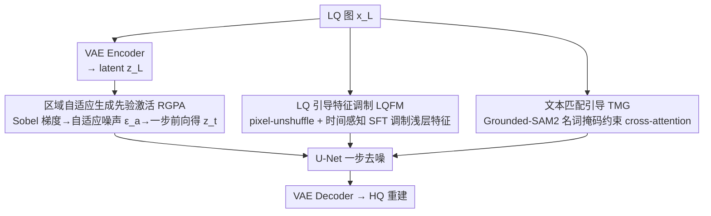

# Bridging Fidelity-Reality with Controllable One-Step Diffusion for Image Super-Resolution

**会议**: CVPR 2026  
**论文**: [CVF Open Access](https://openaccess.thecvf.com/content/CVPR2026/html/Chen_Bridging_Fidelity-Reality_with_Controllable_One-Step_Diffusion_for_Image_Super-Resolution_CVPR_2026_paper.html)  
**代码**: https://github.com/Chanson94/CODSR  
**领域**: 扩散模型 / 图像超分辨率  
**关键词**: 一步扩散、真实图像超分、生成先验激活、特征调制、文本对齐  

## 一句话总结
CODSR 用一步扩散做真实场景超分：先按梯度图给纹理区"定点注噪"激活生成先验，再用未压缩的 LQ 特征调制 U-Net 中间层补回保真信息，最后用 Grounded-SAM2 的名词掩码约束 cross-attention 对齐文本，在四个真实数据集上同时拿到更好的感知质量和有竞争力的保真度。

## 研究背景与动机
**领域现状**：真实图像超分（Real-ISR）近年的主流是借用预训练文生图扩散模型（Stable Diffusion）的强生成先验来"造细节"。但完整扩散要几十上百步去噪，开销大，于是出现了一批一步扩散方法（OSEDiff、PiSA-SR、TVT、HYPIR 等），把多步蒸馏成单步前向。

**现有痛点**：作者指出现有一步方法有三个未解的硬伤——
1. **保真度差**：LQ 图先经 VAE 压缩编码进 latent，压缩本身丢信息，重建出来结构容易跑偏；
2. **生成先验"不分区"激活**：现有方法直接把 LQ latent 喂进去噪网络，偏离了扩散模型"从噪声 latent 复原"的原生工作模式，且对所有空间区域一视同仁——平坦区被过度生成出伪纹理，纹理/边缘区却细节不足；
3. **文本错位**：用 DAPE/RAM 抽出的文本提示，其在 cross-attention 里的作用区域和文字对应的真实语义区在空间上对不上，文本指导名存实亡。

**核心矛盾**：保真（fidelity，忠于 LQ 结构）和真实（reality，生成丰富细节）天然冲突——想多造细节就得多注噪/多放生成先验，但这又会破坏 latent 分布、损伤结构保真。现有方法要么牺牲保真换感知，要么压住生成不敢放。

**本文目标**：做一个能"可控平衡保真与真实"的一步扩散超分，同时把上面三个硬伤逐个堵上。

**核心 idea**：与其全图均匀注噪，不如**按区域差异化激活生成先验**（哪里不确定就往哪里注噪），再用**未压缩的 LQ 信息调制中间特征**把保真补回来，外加**掩码约束文本对齐**——三件事分别对应上述三个痛点。

## 方法详解

### 整体框架
CODSR 是基于 SD 2.1-base 的一步扩散超分网络。输入是退化的低质图 $x_L$，输出是高质重建图。整条管线只做"一次前向加噪 + 一次反向去噪"：先把 $x_L$ 经 VAE 编码成 latent $z_L$；不直接去噪，而是用 **RGPA** 按 Sobel 梯度图构造空间自适应噪声、做一步前向得到含噪 latent $z_t$；去噪时 U-Net 的浅层特征被 **LQFM** 用未压缩的 LQ 特征调制以补回保真信息；同时 **TMG** 用 Grounded-SAM2 的名词掩码约束 cross-attention，让文本只作用在对应语义区。三个模块各管一个痛点，彼此通过时间系数 $\lambda_t$、$w_t$ 耦合，在一步内协同。

### 关键设计

**1. 区域自适应生成先验激活（RGPA）：按梯度图定点注噪，让生成只发生在该发生的地方**

针对"先验不分区激活"的痛点。现有一步法直接把 $z_L$ 喂进去噪网络，既偏离扩散原生的"从噪声复原"模式，又对所有区域一视同仁，结果平坦区冒伪纹理、纹理区细节不够。RGPA 的做法是：在去噪前**主动往 latent 注一次高斯噪声**，但注噪量随区域自适应。先把 $x_L$ 编码成 $z_L$，再做一步前向构造含噪 latent：
$$z_t = \sqrt{\bar\alpha_t}\, z_L + \sqrt{1-\bar\alpha_t}\, \epsilon_a$$
反向只走一步，用 U-Net 预测的噪声 $\epsilon_\theta(z_t,c,t)$ 复原干净 latent：
$$\hat z_H = z_L + w_t\big(\epsilon_a - \epsilon_\theta(z_t,c,t)\big),\quad w_t=\tfrac{\sqrt{1-\bar\alpha_t}}{\sqrt{\bar\alpha_t}}$$
关键在自适应噪声 $\epsilon_a$ 怎么来：对 $x_L$ 算 Sobel 梯度图 $g_{x_L}$，过一个映射算子 $\mathcal{W}(\cdot)$（先做 $16\times16$ patch 均值、再做类似 UPSR 的分段变换）得到逐区域噪声权重，最后 $\epsilon_a = \mathcal{W}(g_{x_L})\odot\epsilon$（$\epsilon\sim\mathcal N(0,I)$）。这样高频区（边缘、纹理）注噪强、鼓励模型多用生成先验去探索补细节；低频平坦区注噪弱、保住结构不被乱造。训练时还把时间步 $t_s\in[t_{min},t_{max}]$ 随机采样增强鲁棒；推理时只要调 $t_s$ 就能在保真和生成质量间连续滑动，这就是"可控"的来源。

**2. LQ 引导特征调制（LQFM）：用没被压缩的 LQ 信息把保真补回来**

针对"VAE 压缩丢信息导致保真差"的痛点。VAE 编码 $x_L→z_L$ 时压缩会丢结构信息，且这一步无法逆转。LQFM 是一个即插即用模块，绕过压缩 latent、直接从原始 LQ 取信息。先对 $x_L$ 做 pixel-unshuffle（不丢信息地调整空间分辨率）得到特征 $\tilde x_L$，再用一个**时间感知的空间特征变换（SFT）层**去调制 U-Net 第一层卷积的输出特征 $f^m$：
$$\mathrm{SFT}(f^m\mid \tilde x_L) = (1+\lambda_t\gamma)\odot f^m + \lambda_t\beta$$
其中调制参数 $(\gamma,\beta)=\mathcal M(\tilde x_L)$ 由两层 MLP 生成，时间系数 $\lambda_t=1/w_t$ 让调制强度随时间步变化、和 RGPA 的注噪节奏对齐。设计的精妙之处在于：它调制的是 U-Net 的**中间特征 $f^m$**，而不是去碰 $z_L$ latent 本身——消融（Table 4）显示，若改成直接调制 $z_L$，会破坏 latent 的高斯对角分布、压制生成先验，no-reference 指标明显下滑；调中间特征则既补了保真又不伤生成。

**3. 文本匹配引导（TMG）：用名词掩码把文本钉到对应的语义区上**

针对"文本错位"的痛点。文本提示本可提供语义指导，但其在 cross-attention 的作用区和文字真实对应的区域空间错位。TMG 的做法：先用 RAM 抽提示词、再用 NLTK 去掉抽象的形容词，只留名词 $\{n_1,\dots,n_N\}$；把名词连同 $x_L$ 喂给开放词表分割模型 Grounded-SAM2，得到每个名词对应的二值区域掩码 $\{M^1,\dots,M^N\}$（活跃像素低于阈值的掩码判无效丢弃）。这些掩码显式规定了反向过程中文本该作用的区域，再用 CoMat 的 positive area loss 约束 cross-attention 的平均注意力图 $A^i$ 与掩码 $M^i$ 一致。一个重要的工程点：掩码可**离线预算并缓存**，测试时单次前向不跑任何分割模块，推理效率不受影响。

### 损失函数 / 训练策略
两阶段训练。**第一阶段**用像素级 content loss + LPIPS 感知损失 + GAN loss（用 S3Diff 的 GAN 损失）打底，提升真实细节与纹理。**第二阶段**沿用 PiSA-SR 的双 LoRA 策略：冻结第一阶段的 LoRA，仅在 U-Net 的 cross-attention 层新加 LoRA 来增强文本对齐，并用 VSD loss（权重 2）从预训练模型蒸馏语义知识。该阶段优化目标为：
$$\mathcal L = \mathcal L_{\text{OSEDiff}} + \eta_{pos}\mathcal L_{pos}$$
其中 $\mathcal L_{\text{OSEDiff}}$ 是 OSEDiff 的损失，$\mathcal L_{pos}$ 是 CoMat 的 positive area loss，$\eta_{pos}=1$。VAE encoder 与 U-Net 的 LoRA rank 分别配 4 和 16，VAE decoder 冻结；4 卡 4090、batch 16、AdamW、lr 5e-5。

## 实验关键数据

### 主实验
在 RealSR、DrealSR、RealPhoto60、RealDeg 四个真实数据集上对比全步与一步扩散方法。下表摘取 DrealSR 和 RealSR 的代表性指标（PSNR/SSIM 越高越好，LPIPS/DISTS/NIQE 越低越好，MUSIQ/MANIQA/CLIPIQA+ 越高越好）：

| 数据集 | 指标 | OSEDiff | PiSA-SR | TVT | HYPIR | 本文 CODSR |
|--------|------|---------|---------|-----|-------|-----------|
| DrealSR | PSNR↑ | 27.92 | 28.32 | 28.27 | 26.04 | 28.19 |
| DrealSR | LPIPS↓ | 0.2968 | 0.2959 | 0.2900 | 0.3356 | 0.2919 |
| DrealSR | DISTS↓ | 0.2165 | 0.2169 | 0.2205 | 0.2333 | **0.2108** |
| DrealSR | NIQE↓ | 6.49 | 6.17 | 7.03 | 6.39 | **5.97** |
| DrealSR | MUSIQ↑ | 64.65 | 66.11 | 65.56 | 61.03 | **67.05** |
| DrealSR | CLIPIQA+↑ | 0.5181 | 0.5290 | 0.5226 | 0.4885 | **0.5589** |
| RealSR | LPIPS↓ | 0.2920 | 0.2672 | 0.2597 | 0.3046 | 0.2741 |
| RealSR | MUSIQ↑ | 69.08 | 70.15 | 69.89 | 66.42 | **70.54** |
| RealSR | MANIQA↑ | 0.6331 | 0.6552 | 0.6232 | 0.6510 | **0.6727** |

CODSR 在所有四个数据集的全部 no-reference 指标上都领先：NIQE、MUSIQ、CLIPIQA+ 至少比对手高 0.15、0.39、0.0133。相比全步方法，MUSIQ 在 DrealSR、RealDeg 上分别至少提升 1.96、5.15。值得注意：保真指标 PSNR/SSIM 上 CODSR 不是第一（PiSA-SR/TVT 略高），但作者的卖点是**在保持有竞争力保真度的同时拿到最好感知质量**，即更好的保真-真实平衡。

### 消融实验
模块逐项消融（DrealSR，Table 2）：

| 配置 | LPIPS↓ | MUSIQ↑ | CLIPIQA+↑ | 说明 |
|------|--------|--------|-----------|------|
| Base | 0.2906 | 65.89 | 0.5038 | 无任何模块 |
| + RGPA | 0.2914 | 66.26 | 0.5109 | 释放生成先验，感知↑ |
| + RGPA & LQFM | 0.2902 | 66.27 | 0.5213 | 补保真，CLIPIQA+ 明显↑ |
| Full (+ TMG) | 0.2919 | **67.05** | **0.5589** | TMG 让 MUSIQ/CLIPIQA+ 再跳一档 |

注噪策略对比（DrealSR，Table 3）：

| 注噪方式 | PSNR↑ | LPIPS↓ | MUSIQ↑ | CLIPIQA+↑ | 说明 |
|----------|-------|--------|--------|-----------|------|
| Base | 28.39 | 0.2906 | 65.89 | 0.5038 | 不注噪 |
| $x_L+\epsilon_a$（图像域注噪） | 28.29 | 0.2917 | 65.84 | 0.5020 | 没激活生成能力 |
| $z_L+\epsilon$（latent 标准高斯噪） | 28.04 | 0.2974 | 66.48 | 0.5133 | 感知↑但保真崩、平坦区出伪影 |
| RGPA（本文） | 28.24 | 0.2914 | 66.26 | 0.5109 | 保真-感知最优平衡 |

### 关键发现
- **三个模块各有分工且互补**：RGPA 主要拉 no-reference 感知（MUSIQ +0.37、CLIPIQA+ +0.71%），LQFM 主要补 CLIPIQA+（+1.04%），TMG 贡献最大的一跳（MUSIQ 66.27→67.05、CLIPIQA+ 0.5213→0.5589）。
- **注噪必须在 latent 域且必须自适应**：图像域注噪（$x_L+\epsilon_a$）几乎无效，因为它没对齐前向/反向的噪声通路；latent 域标准高斯噪虽提感知却毁保真（平坦区伪影）；只有 RGPA 的区域自适应 latent 注噪两头都顾。
- **调中间特征 vs 调 latent**：LQFM 调 $z_L$ 会破坏其高斯对角分布、no-reference 指标掉得更狠；用 element-wise addition 替代 SFT 也次优（LQ 与 U-Net 特征存在域差，会让去噪不稳甚至崩溃）。
- **时间步 $t_s$ 是保真-质量的可控旋钮**：$t_s$ 越大（注噪越强）MUSIQ 越高但 PSNR 越低，呈清晰 trade-off；默认 $t_s=100$。
- **VSD loss 不可少**：去掉后 MUSIQ 从 67.05 掉到 65.56、CLIPIQA+ 从 0.5589 掉到 0.5009（Table 5）。

## 亮点与洞察
- **"哪里不确定就往哪里注噪"是个很顺的直觉**：把扩散注噪从"全图均匀"改成"梯度图加权"，一举解决平坦区伪纹理 + 纹理区欠细节两个老问题，且实现轻（Sobel + patch 均值 + 分段映射），可迁移到其他需要"区域差异化生成强度"的扩散任务（如局部修复、可控生成）。
- **绕开 VAE 压缩补保真的思路干净**：不去改 latent（容易破坏分布），而是用 pixel-unshuffle 保住原始信息、再用时间感知 SFT 调中间特征，把"补保真"和"不伤生成"解耦——这个"调中间特征别碰 latent"的经验对一切 latent 扩散条件注入都有参考价值。
- **TMG 的离线缓存设计很实用**：训练时跑 Grounded-SAM2 拿掩码、测试时完全不跑分割，把重模块的成本挪到训练期，推理仍是单次前向，这种"训练用强工具监督、推理时蒸馏掉"的范式值得借鉴。
- **一个时间步把三个模块串起来**：$\lambda_t$、$w_t$ 让 RGPA 注噪强度和 LQFM 调制强度同步随时间变化，模块不是简单堆叠而是机制耦合。

## 局限与展望
- 依赖较多外部预训练组件（Grounded-SAM2、RAM、DAPE、SD 2.1），管线偏重；虽然掩码可离线缓存，但训练期成本和对这些模型质量的依赖仍在。⚠️ 论文未给出推理实际延迟与显存的完整数字（称在补充材料），与对手的效率对比需看补充材料确认。
- 保真指标 PSNR/SSIM 并非最优（PiSA-SR/TVT 更高），对极度看重像素保真的场景未必首选；作者定位是"平衡"，但"平衡点"由 $t_s$ 决定，落地需调参。
- TMG 依赖名词级掩码，对无明确物体的纹理/抽象场景（如纯纹理、天空）文本指导可能失效；去形容词的做法也会丢掉部分语义。
- 自适应噪声的映射算子 $\mathcal W(\cdot)$（$16\times16$ patch 均值 + 类 UPSR 分段变换）细节较经验化，⚠️ 分段变换的具体形式以原文/补充材料为准。

## 相关工作与启发
- **vs OSEDiff**：OSEDiff 直接把 LQ 当输入、用 VSD 蒸馏成一步，但不分区注噪、保真受 VAE 压缩限制；CODSR 在其框架上加 RGPA（区域注噪）+ LQFM（补保真）+ TMG（文本对齐），损失也复用 $\mathcal L_{\text{OSEDiff}}$，是在 OSEDiff 之上的系统性增强。
- **vs PiSA-SR / TVT**：二者用双 LoRA 或迁移 VAE 训练来提保真，但压缩丢信息的根本问题仍在；CODSR 用 pixel-unshuffle + 中间特征调制绕过压缩，DISTS/NIQE/感知指标更好（PSNR 略让）。
- **vs $z_L+\epsilon$ 类直接 latent 注噪**：直接加标准高斯噪能放生成但毁保真（平坦区伪影），CODSR 的梯度自适应注噪是对这条路线的精细化修正。
- **vs DAPE 文本提取路线**：现有方法只抽提示不管空间对齐，CODSR 用 Grounded-SAM2 掩码 + positive area loss 显式约束文本-视觉空间一致，是对"文本指导名存实亡"问题的针对性补丁。

## 评分
- 新颖性: ⭐⭐⭐⭐ 三个模块都是针对一步扩散超分具体痛点的合理设计，RGPA 的梯度自适应注噪较新颖，整体偏"系统性组合改进"而非单点突破。
- 实验充分度: ⭐⭐⭐⭐⭐ 四个真实数据集、八项指标、模块/注噪/调制/语义增强多组消融齐全，结论自洽。
- 写作质量: ⭐⭐⭐⭐ 痛点-设计一一对应、逻辑清晰，但部分关键超参与效率数字推给补充材料。
- 价值: ⭐⭐⭐⭐ 在保真-真实平衡和可控性上有实用价值，代码开源，对一步扩散超分社区有直接参考意义。

<!-- RELATED:START -->

## 相关论文

- [\[CVPR 2026\] One-Step Diffusion Transformer for Controllable Real-World Image Super-Resolution](one-step_diffusion_transformer_for_controllable_real-world_image_super-resolutio.md)
- [\[CVPR 2026\] IFCSR: Inference-Free Fidelity-Realism Control for One-Step Diffusion-based Real-World Image Super-Resolution](ifcsr_inference-free_fidelity-realism_control_for_one-step_diffusion-based_real-.md)
- [\[CVPR 2026\] FiDeSR: High-Fidelity and Detail-Preserving One-Step Diffusion Super-Resolution](fidesr_high-fidelity_and_detail-preserving_one-step_diffusion_super-resolution.md)
- [\[CVPR 2026\] Time-Aware One Step Diffusion Network for Real-World Image Super-Resolution](time-aware_one_step_diffusion_network_for_real-world_image_super-resolution.md)
- [\[CVPR 2026\] Language-Guided One-Step Diffusion Model for Nighttime Flare Removal](language-guided_one-step_diffusion_model_for_nighttime_flare_removal.md)

<!-- RELATED:END -->
