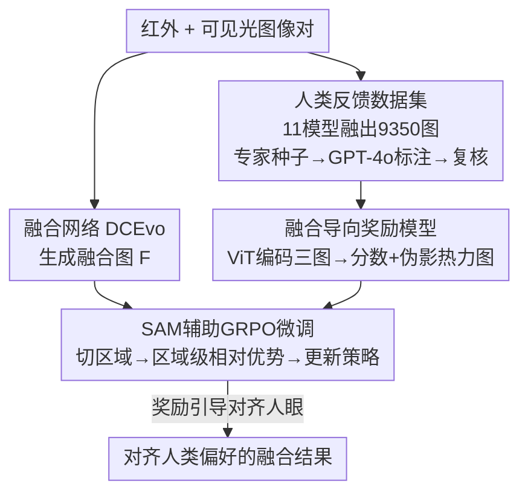

# Bridging Human Evaluation to Infrared and Visible Image Fusion

**会议**: CVPR 2026  
**论文**: [CVF Open Access](https://openaccess.thecvf.com/content/CVPR2026/html/Liu_Bridging_Human_Evaluation_to_Infrared_and_Visible_Image_Fusion_CVPR_2026_paper.html)  
**代码**: https://github.com/ALKA-Wind/EVAFusion  
**领域**: 图像融合 / 图像复原  
**关键词**: 红外可见光融合, RLHF, 人类偏好, 奖励模型, GRPO

## 一句话总结
针对红外-可见光图像融合（IVIF）长期只优化手工指标、与人眼审美脱节的问题，本文构建了首个大规模 IVIF 人类反馈数据集，训练了一个"融合导向奖励模型"来量化感知质量，再用 SAM 辅助的 GRPO 把融合网络对齐到人类偏好，在主流基准上取得 SOTA 且融合结果更"好看"。

## 研究背景与动机
**领域现状**：IVIF 要把红外的热辐射信息和可见光的纹理细节合成到一张图里，服务于自动驾驶、安防监控、医学影像等高风险场景。主流方法（CNN / GAN / Transformer / 扩散模型）都在比谁的 entropy、SSIM、梯度等客观指标更高。

**现有痛点**：IVIF 是个**病态问题**——没有唯一的 ground-truth 融合结果。于是整个领域被"优化手工损失 + 数值指标"主导，而这些数学代理量和真正的人眼感知偏好之间存在系统性鸿沟：指标涨了，但融出来的图人看着不一定舒服（伪影、过曝、纹理糊）。深度方法虽然特征提取更强，却继承了同一套评价范式，训练用的还是像素级 / 特征级损失，本质上和人的判断脱钩。

**核心矛盾**：缺两样东西堵死了"对齐人眼"这条路——(1) 没有大规模、高质量、带人类反馈标注的 IVIF 数据集；(2) 没有一个可靠、自动的奖励机制来量化感知质量、指导模型学习。

**本文目标**：把主观的人类评价直接、可扩展地塞进 IVIF 的优化闭环，让"人类偏好"成为这个病态任务的最终监督信号。

**切入角度**：借鉴 NLP/CV 里 RLHF 的成功路径——先采集人类偏好数据，训练奖励模型，再用强化学习把策略（融合网络）拉向高奖励。难点在于主观反馈昂贵、稀疏，要高效地把它转成可微的训练信号。

**核心 idea**：用"人类反馈数据集 → 融合导向奖励模型 → GRPO 微调融合网络"这条反馈强化链路，把 IVIF 从"对齐指标"改成"对齐人眼"。

## 方法详解

### 整体框架
整个系统是一条三阶段串行的 RLHF 流水线：**先造数据、再训奖励、最后用奖励调融合网络**。第一阶段从八个公开数据集采集红外-可见光图像对，用 11 个 SOTA 融合模型生成 9,350 张融合图，由专家给种子样本打分、微调 GPT-4o 做大规模标注、再经专家复核，得到带四维细粒度分数和伪影热力图的人类反馈数据集。第二阶段在该数据集上训练一个基于 ViT 的"融合导向奖励模型"，输入红外/可见光/融合三张图，输出四个感知质量分数和一张伪影概率图。第三阶段以这个奖励模型为打分器，用 SAM 把融合图切成语义区域、计算区域级相对优势，借鉴 GRPO 微调融合网络 DCEvo，使其输出向人类偏好靠拢。

### 关键设计

**1. 人类反馈 IVIF 数据集：给病态任务补上"人眼监督"这一缺口**

针对"没有人类反馈数据"这个第一性痛点，作者构建了 IVIF 领域第一个大规模人类反馈数据集。流程是：先从 FMB、LLVIP、M3FD、MFNet、RoadScene、SMOD、TNO、VIFB 八个数据集收集 3 万+ 红外-可见光对，用 CLIP 做去重清洗到 900 对，再经专家筛选留下 850 对高质量图；对每对用 11 个 SOTA 方法（MURF、DDcGAN、CDDFuse、SegMif、Text-IF、DDFM、TarDAL 等）融合，得到 9,350 张融合图。标注采用"专家种子 + 大模型扩展 + 专家复核"的协同方式：每张融合图配四个细粒度分数（1–5 分：热信息保留 thermal retention、纹理保留 texture retention、伪影程度 artifacts、清晰度 sharpness）、一个总均分，以及一张标出伪影区域的热力图。先请 4 位资深专家对 100 张图精标（伪影用中心坐标+半径表示），形成种子集；再用种子集微调 GPT-4o，由它自动标完全部 9,350 张；最后 5 位有 3 年以上经验的研究者复核 GPT 的打分和热力图、纠正偏差、补漏标的伪影区。这样既保证了人类先验的"标准"，又用大模型把昂贵的主观标注规模化。

**2. 融合导向奖励模型：把主观偏好编码成可微的奖励信号**

针对"没有自动量化感知质量的奖励机制"这个痛点，作者训练了一个基于 ViT 视觉-语言模型的奖励模型，把人类打分变成可微的标量奖励。对每个样本，红外、可见光、融合三张图分别送入**权重共享**的 ViT 编码器，取 patch 级语义特征 $F_i = \mathrm{ViT}(x_i)[:,1:,:]$（去掉 CLS token），其中 $x_i \in \{x_{ir}, x_{vi}, x_{fused}\}$；三组特征沿通道拼成 $[F_{ir}\,\|\,F_{vi}\,\|\,F_{fused}] \in \mathbb{R}^{N\times 3D}$，经线性投影压回原维度后送入另一个同构 ViT 做跨模态融合，输出 reshape 成空间特征图 $F_{map}\in\mathbb{R}^{D\times H'\times W'}$。该特征图进两条预测分支：热力图分支经卷积压缩 + 残差上采样 + Sigmoid，输出 $[0,1]$ 的伪影概率图；分数分支经卷积压缩 + flatten + MLP + Sigmoid，回归各维分数。训练时 ViT 冻结、只优化上层预测头以稳住收敛。损失是两项 MSE 的加权和：

$$L_{score} = \sum_{i=1}^{5} \mathrm{MSE}(s_i, \hat{s}_i), \quad L_{heatmap} = \mathrm{MSE}(H, \hat{H})$$

$$L_{total} = \lambda_1 \cdot L_{score} + \lambda_2 \cdot L_{heatmap}$$

冻结 ViT backbone、只训预测头，是为了在标注规模有限时避免过拟合、提高训练稳定性。

**3. SAM 辅助的 GRPO 策略优化：用区域级相对优势把融合网络拉向人眼偏好**

有了奖励模型后，怎么用它去更新融合网络是关键。作者以 DCEvo（编码器-解码器结构，带判别增强和跨维嵌入模块）为基线融合策略 $\pi_\theta$，借鉴 GRPO 做策略优化。直觉是：人眼对图像质量的判断很大程度落在关键语义目标（车、人、建筑）上，所以不该对全图一视同仁。具体地，对一对输入 $(v,i)$，策略网络融出图 $F$，用 **SAM** 把它切成 $K$ 个语义区域 $f_k = F\odot M_k$（$M_k$ 是区域 $k$ 的二值掩码）；这些区域图连同融合图送进奖励模型打分得 $\{s_1,\dots,s_K\}$，再在组内算归一化相对优势：

$$\mu = \frac{1}{K}\sum_{k=1}^{K} s_k, \quad \hat{A}_k = \frac{s_k - \mu}{\sigma + \epsilon}$$

然后用带 KL 正则的目标更新策略：

$$J(\theta) = \mathbb{E}_{(v,i)}\big[L(\theta) - \beta\cdot D_{KL}[\pi_\theta\,\|\,\pi_{ref}]\big]$$

$$L(\theta) = \sum_{k=1}^{K} w_k \cdot \min\big(r_k\hat{A}_k,\ \mathrm{clip}(r_k, 1-\epsilon, 1+\epsilon)\hat{A}_k\big)$$

其中 $\pi_{ref}$ 是初始时刻策略的冻结副本，区域级比率 $r_k = 1 + \alpha\cdot \frac{|F_\theta[M_k] - F_{\theta_{old}}[M_k]|}{|F_{\theta_{old}}[M_k]|}$ 度量该区域的策略变化，KL 项防止策略偏离参考太远。相比直接对整图打一个分，这种"SAM 切区域 + 组内相对优势 + 区域加权"的设计能把奖励信号聚焦到关键语义目标上，这也解释了为什么下游分割/检测能涨点（详见消融：去掉 SAM 后指标全面下滑）。

### 损失函数 / 训练策略
奖励模型用 ViT-Large-Patch16-384 作特征提取器（冻结），训练分数头和热力图生成器 30 epoch，AdamW + 余弦退火（2e-5→1e-5），weight decay 2e-3。RLHF 微调阶段 KL 系数 $\beta=0.1$、$\epsilon=0.2$，Adam，学习率 1e-4，weight decay 0.01，batch size 2，训 20 epoch，CosineAnnealingLR（衰减因子 0.5，最低 1e-6）。全部实验在 2 张 A40 上完成。奖励数据集 9,350 张按 7,350/1,000/1,000 划分 train/val/test。

## 实验关键数据

### 主实验
在 TNO、RoadScene、M3FD 三个基准上与 13 个 SOTA 方法对比，参考型指标 CC / PSNR / Qabf / SSIM 越高越好。本文在所有三个测试集上取得最高的 CC 和 PSNR。

| 数据集 | 指标 | 本文 | DCEvo(基线) | CDDFuse |
|--------|------|------|------|----------|
| TNO | CC↑ / PSNR↑ | **0.51 / 65.43** | 0.48 / 63.83 | 0.47 / 63.49 |
| RoadScene | CC↑ / PSNR↑ | **0.56 / 61.84** | 0.49 / 59.66 | 0.52 / 59.84 |
| M3FD | CC↑ / PSNR↑ | **0.65 / 65.09** | 0.55 / 62.87 | 0.62 / 63.14 |

无参考指标 NIQE / BRISQUE 越低越好，本文在三个数据集上均最优或次优：

| 数据集 | NIQE↓ | BRISQUE↓ |
|--------|-------|----------|
| TNO | **5.37** | **22.58** |
| RoadScene | **3.06** | **18.79** |
| M3FD | **4.03** | 29.80 |

此外，15 人（5 专家 + 10 非专家）双盲偏好排序实验显示本文方法在三个数据集上的平均偏好排名都最高；下游语义分割（FMB，mIoU 56.92）和目标检测（M3FD，mAP 62.23）也都拿到第一。

### 消融实验
**关键组件消融**（CC↑ / PSNR↑，TNO / RoadScene / M3FD）：

| 配置 | TNO | RoadScene | M3FD | 说明 |
|------|-----|-----------|------|------|
| w/o Score | 0.50 / 64.21 | 0.51 / 60.97 | 0.58 / 64.81 | 去掉分数分支，奖励无法全面评估质量 |
| w/o Heatmap | 0.50 / 65.17 | 0.54 / 61.21 | 0.60 / 64.93 | 去掉伪影热力图分支 |
| w/o SAM | 0.48 / 65.03 | 0.52 / 60.92 | 0.57 / 63.02 | 用随机裁剪块替代语义区域，掉点最明显 |
| **Ours** | **0.51 / 65.43** | **0.56 / 61.84** | **0.65 / 65.09** | 完整模型 |

**策略优化方法消融**（CC↑ / PSNR↑）——把 GRPO 换成 DPO / PPO：

| 方法 | TNO | RoadScene | M3FD |
|------|-----|-----------|------|
| Baseline | 0.48 / 63.83 | 0.49 / 59.66 | 0.55 / 62.87 |
| DPO | 0.50 / 63.98 | 0.49 / 61.50 | 0.57 / 63.74 |
| PPO | 0.51 / 63.59 | 0.53 / 61.17 | 0.59 / 64.32 |
| **Ours (GRPO)** | **0.51 / 65.43** | **0.56 / 61.84** | **0.65 / 65.09** |

### 关键发现
- **SAM 区域切分贡献最大**：去掉 SAM（改用随机裁剪块）后三个数据集的 CC/PSNR 普遍下滑（M3FD 上 CC 0.65→0.57），说明把奖励聚焦到关键语义区域是涨点核心，也呼应了下游检测/分割的提升。
- **GRPO 优于 DPO/PPO**：三种 RL 策略都比 baseline 强，但 GRPO 的组内相对优势机制在 PSNR 上拉开最大差距（如 M3FD 62.87→65.09），说明"区域级相对比较"比绝对偏好优化更稳。
- **奖励双分支互补**：去掉分数或热力图分支都会让车辆边缘变糊、出现伪影，二者从"整体质量评分"和"伪影定位"两个角度共同约束奖励。

## 亮点与洞察
- **把 RLHF 范式干净地搬到低层视觉的病态任务上**：IVIF 没有 ground-truth，本质上和"对齐人类偏好"天然契合；用奖励模型替代手工指标，思路清晰且可迁移到其他无标准答案的图像增强任务（去雾、低光增强、HDR）。
- **SAM + 区域级相对优势是点睛之笔**：不是对整图打一个分，而是让奖励聚焦到人眼真正关注的语义目标上，这把"感知质量"和"下游任务可用性"绑到了一起——融出来的图既好看又更利于检测/分割。
- **专家种子微调 GPT-4o 做规模化标注**：用 100 张专家精标的种子集对齐大模型，再让大模型标 9,350 张、专家复核，是一条务实的"人类先验 + 大模型扩展"低成本数据生产链，值得借鉴。

## 局限与展望
- **奖励依赖 GPT-4o 标注**：9,350 张里绝大多数由微调后的 GPT-4o 打分，虽有专家复核，但奖励模型可能继承 GPT-4o 的感知偏置；⚠️ 论文未量化 GPT 标注与纯人工标注的一致性差距。
- **只在一个基线网络上验证**：策略优化绑定 DCEvo 作基线融合网络，换成其它架构是否同样有效未充分实验。
- **计算开销**：每步要 SAM 切区域 + 奖励模型多次前向，相比纯监督训练成本更高，论文未给推理/训练耗时对比。
- **改进思路**：把奖励模型蒸馏成轻量打分器以降本；或用更细的伪影类型标注（而非单通道热力图）提供更结构化的奖励信号。

## 相关工作与启发
- **vs 传统 IVIF（CDDFuse / DDFM / SegMif 等）**：它们优化 entropy/SSIM/梯度等手工指标，本文改用人类反馈训练的奖励模型作监督，区别在于把"对齐数学代理量"换成"对齐人眼"，因而无参考指标和主观偏好排序都更优。
- **vs 生成式 RLHF（ImageReward / DPOK）**：那些是文生图领域用人类反馈提升生成质量，本文把同一思路迁到 IVIF 这个多模态低层融合任务，并额外引入 SAM 做区域级优势，是 RLHF 在低层视觉的一次落地。
- **vs DPO / PPO 微调**：本文选 GRPO 并配区域级相对优势 + 区域加权，消融显示其 PSNR 提升幅度优于 DPO/PPO，说明组内相对比较更适合这种缺乏绝对偏好对的场景。

## 评分
- 新颖性: ⭐⭐⭐⭐ 首个 IVIF 人类反馈数据集 + 把 RLHF/GRPO 干净落地到低层融合，组合创新扎实
- 实验充分度: ⭐⭐⭐⭐ 13 个 SOTA 对比、6 个指标、下游分割/检测、双盲偏好实验、两组消融，覆盖全面
- 写作质量: ⭐⭐⭐⭐ 动机-方法-实验逻辑清晰，公式与流程交代到位
- 价值: ⭐⭐⭐⭐ 为病态低层视觉任务提供了一条"对齐人眼"的可复用范式，数据集与代码均开源

<!-- RELATED:START -->

## 相关论文

- [\[CVPR 2026\] RegionFuse: Region-Adaptive Pixel Distribution Learning for Infrared and Visible Image Fusion](regionfuse_region-adaptive_pixel_distribution_learning_for_infrared_and_visible_.md)
- [\[CVPR 2026\] Beyond Strict Pairing: Arbitrarily Paired Training for High-Performance Infrared and Visible Image Fusion](beyond_strict_pairing_arbitrarily_paired_training_for_high-performance_infrared_.md)
- [\[CVPR 2026\] Bridging the Perception Gap in Image Super-Resolution Evaluation](bridging_the_perception_gap_in_image_super-resolution_evaluation.md)
- [\[CVPR 2026\] Customized Fusion: A Closed-Loop Dynamic Network for Adaptive Multi-Task-Aware Infrared-Visible Image Fusion](customized_fusion_a_closed-loop_dynamic_network_for_adaptive_multi-task-aware_in.md)
- [\[CVPR 2026\] Human-Centric Multi-Exposure Fusion: Benchmark and Bi-level Cognition Distillation Framework](human-centric_multi-exposure_fusion_benchmark_and_bi-level_cognition_distillatio.md)

<!-- RELATED:END -->
