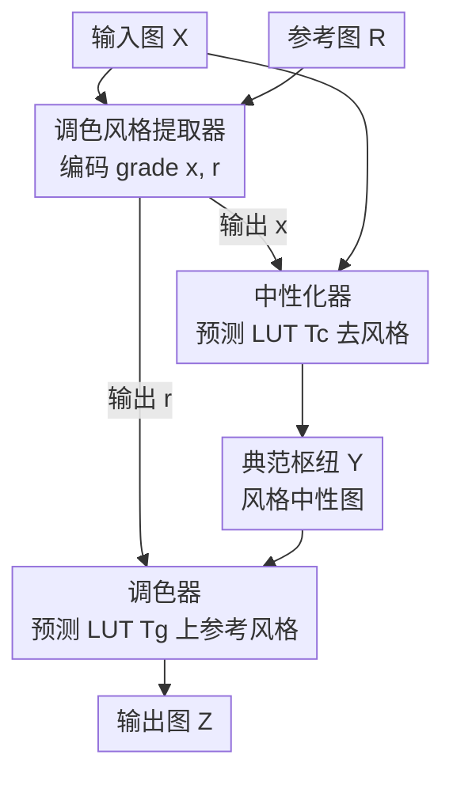

# CanonCGT: Reference-Based Color Grading via Canonical Pivot Representation

**会议**: CVPR 2026  
**arXiv**: [2606.01638](https://arxiv.org/abs/2606.01638)  
**代码**: https://github.com/Jinwon-Ko/CanonCGT （有）  
**领域**: 图像恢复 / 色彩调色 / 风格迁移  
**关键词**: 参考式调色、3D LUT、风格中性化、自监督、FiLM 调制

## 一句话总结
CanonCGT 把"参考图调色"拆成两步——先用 canonicalizer 把输入图洗成一张"无风格"的中性图（canonical pivot），再用 grader 把参考图的色调贴上去；配合监督+自监督的双阶段训练（DP-CGT），在 6 个数据集上 PSNR 从次优的 18.62 拉到 28.99，明显更稳更自然。

## 研究背景与动机

**领域现状**：参考式调色（reference-based color grading）让用户丢一张"我想要这种感觉"的参考图，系统就自动把它的色调、光影氛围搬到自己的照片上，省去手动调曝光/对比度/色温的专业活。主流做两条路：一是照片级风格迁移（photorealistic style transfer），在特征空间对齐统计量或调制激活；二是滤镜式迁移（filter style transfer），从"原图—滤镜图"配对数据里学低层色彩映射。

**现有痛点**：两条路都不稳。照片级方法（PhotoNAS、PhotoWCT2、Neural Preset、CAP-VST）容易**过度偏移色调**、局部串色、纹理失真——而调色恰恰要的是"轻微而精确"的色调控制。滤镜式方法（Deep Preset）虽然结果干净，但映射被锁死在训练用的"自然图→滤镜图"对上：**当输入图本身已经被调过色**，它往往保留原有色调、甚至把已有风格"叠加"上去，而不是把它改造成参考图的样子。

**核心矛盾**：问题根子在于——这些方法都假设输入是"干净的自然图"，直接在输入上做风格映射。但真实照片几乎都经过相机处理或预设滤镜，自带一层"风格偏置"。直接迁移就是"在已有偏置上再叠一层"，自然不稳定。

**本文目标**：拆成两个子问题——(1) 怎么把输入图自带的风格偏置去掉，得到一个稳定的中性基准；(2) 怎么在这个干净基准上可控地贴参考风格。

**切入角度**：作者引入一个"枢纽"概念——**canonical pivot（典范枢纽）**：一张风格中性的中间表示。所有不同风格的输入都先归一到这个中性域，再从中性域出发去调色。这样调色就有了稳定的公共起点，避免"风格叠加"。

**核心 idea**：用"先中性化、再调色"（canonicalization → grading）的两段式，把"去风格"和"上风格"解耦，并全程用 3D LUT 做色彩变换以保证空间一致性和结构保真。

## 方法详解

### 整体框架

CanonCGT 要解决的是"把输入图 $X$ 的调色改成参考图 $R$ 的样子，且不破坏结构、不叠加风格"。整体流程是：一个 **grade extractor**（调色风格提取器）分别从 $X$ 和 $R$ 编码出调色向量 $x$ 和 $r$；**canonicalizer**（中性化器）拿 $x$ 把 $X$ 自带的风格洗掉，生成中性图 $Y$（canonical pivot）；**grader**（调色器）拿 $r$ 把参考风格贴到 $Y$ 上，输出最终图 $Z$。canonicalizer 和 grader 共用同一套网络结构（conditioned LUT generator），但参数不共享、条件向量不同——前者输入 $x$、后者输入 $r$。两者都不直接改像素，而是各自预测一张 3D LUT（$T_c$ 和 $T_g$）再作用到图上。

概念上，canonicalizer 做的是**多对一**映射（各种风格的输入都归一到同一个中性域），grader 做的是**一对多**映射（同一个中性图能调成各种目标风格）。这一去一上正好互补。

### 关键设计

**1. Canonical pivot：用一张"风格中性图"当所有调色的公共起点**

这是全文的灵魂。痛点在于：真实照片都自带风格偏置，直接在输入上迁移参考风格 = 在脏底子上叠风格，导致"保留原色调"或"风格累积"。作者的做法是先把输入映射到一个**风格中性的中间域**——canonical pivot $Y$。具体地，作者用 FiveK 数据集里 **expert C** 的修图作为"典范风格"，因为 expert C 的色调最中性、风格偏置最小（多篇前作也公认 C 最均衡）。canonicalizer 学的就是"把任意风格的输入 $X$ 映射成它对应的 expert-C 版本"。有了这个公共的中性基准，调色就从"输入→参考"（起点千变万化）变成"中性→参考"（起点固定），稳定性大幅提升。这也是为什么 CanonCGT 对"已经被调过色的输入"格外鲁棒——不管输入多脏，先洗成中性再说

**2. 两段式 canonicalization-grading：把"去风格"和"上风格"解耦**

承接上面，作者把调色显式拆成两个独立模块串联：canonicalizer 负责去风格（多对一），grader 负责上风格（一对多）。为什么不一步到位？作者做了对照实验：把两者合并成一个"输入 grade 和参考 grade 拼接后条件化"的单 LUT 生成器（one-stage），结果在所有指标上都更差，PSNR 和 $\Delta E_{ab}$ 掉得尤其明显（见消融表）。原因是单阶段要同时"理解输入的脏在哪 + 理解参考长啥样 + 一次算出净变换"，纠缠在一起难学；两段式让每个模块只干一件清晰的事，中间还多出一个可监督的中性图 $Y$ 当锚点，训练信号更干净

**3. Conditioned LUT generator + FFN-FiLM：让一套网络既能去风格又能上风格**

canonicalizer 和 grader 共用的核心组件叫 **conditioned LUT generator**：吃一张图 $I$ 和一个条件向量 $g$（当 $g=x$ 时做中性化、$g=r$ 时做调色），去调制一张恒等 LUT $T_i$，产出图像自适应的输出 LUT $T_o$。流程是：CNN 抽特征图 $F\in\mathbb{R}^{\frac{L}{8}\times\frac{L}{8}\times C}$，拉平成 token 序列过 6 个 encoder block 拿多级特征 $\{F_l\}_{l=1}^4$；再用 8 个 decoder block，以恒等 LUT 网格点初始化的 query token $P_0$ 去 cross-attention 这些图像特征，逐级精炼成 $T_o$。关键在于条件向量 $g$ 怎么注入——作者改造 FiLM 提出 **FFN-FiLM block**：用 $g$ 生成逐通道的缩放/平移参数 $\alpha=W_1 g,\ \beta=W_2 g$，去调制特征 $F_l^{(\mathrm{film})}=\alpha\odot\sigma(F_l^{(\mathrm{sa})}W_3)+\beta$（$\sigma$ 为 GELU），再经投影和残差 $F_l^{(\mathrm{out})}=F_l^{(\mathrm{film})}W_4+F_l^{(\mathrm{sa})}$。原始 FiLM 用语言特征做条件，这里改成用调色向量调制色/调响应，从而让同一套权重靠不同的 $g$ 切换"去风格 / 上风格"两种行为。用 LUT 而非隐式特征变换，是因为 LUT 给出确定性、空间一致的逐色映射，结构保真天然更好

**4. DP-CGT 双阶段训练：监督学预设 + 自监督学泛化**

只在预设滤镜上监督训练，模型会被锁死在那几十种风格上、对真实世界的连续色调分布泛化不了。作者设计 **DP-CGT（dual-phase color grading training）**两段走。**监督暖身阶段**：在 FiveK 上，把 expert C 当典范风格，再用 Lightroom 合成 56 种额外风格（20 内置 + 36 用户生成）；先用监督对比损失 $\mathcal{L}_{\mathrm{supcon}}$ 训 grade extractor（同一预设的图互为正样本），冻结它后用重建损失 $\mathcal{L}_{\mathrm{rec}}$（含像素、梯度、感知三项）分别训 canonicalizer（对齐输入与中性图）和 grader（对齐输出与 GT），最后端到端联调。**自监督泛化阶段**：在 10 万张无标注真实照片上精炼——从同一张图采两个不重叠裁块 $A$、$B$，各自施加随机调色扰动 $t\sim\mathcal{T}$ 得 $A^*$、$B^*$，让模型对称处理 $(A,B^*)$ 和 $(A^*,B)$，用区域内"一致色调"做自参考重建（此阶段无中性 GT，故只对调色输出算 $\mathcal{L}_{\mathrm{rec}}$）。这一步把模型从"离散预设域"推广到"连续色调/色彩分布"，是泛化能力的主要来源——消融显示去掉它后在无监督测试集上 PSNR 从 28.99 暴跌到 19.17

### 损失函数 / 训练策略
两类目标：grade extractor 用监督对比损失 $\mathcal{L}_{\mathrm{supcon}}$ 学紧凑可分的风格嵌入；canonicalizer 和 grader 用重建损失 $\mathcal{L}_{\mathrm{rec}}$（像素 + 梯度 + 感知）。优化器 AdamW（$\beta_1=0.9,\ \beta_2=0.999$，weight decay $5\times10^{-5}$），学习率 $2\times10^{-4}$ 余弦退火到 $5\times10^{-5}$。关键超参 $L=224$、$C=64$、LUT 维度 $N=17$。骨干为预训练 MobileNet-v2。单卡 RTX 3090 完整训练（监督+自监督）约 7 天。自监督阶段的扰动范围：亮度/对比度/饱和度 $\pm10\sim\pm40\%$、色相 $\pm2\sim\pm5\%$。

## 实验关键数据

### 主实验
在 6 个无监督数据集（Flickr2K / LSDIR / PPR10K / DIV2K / Food-101 / GLD-v2，共 20,196 张测试）上自参考评测，三类指标：保真度、内容保持、风格对齐。

| 方法 | PSNR ↑ | SSIM ↑ | $\Delta E_{ab}$ ↓ | LPIPS ↓ | SSIM$_\text{ED}$ ↑ | H-Corr ↑ | H-Chi ↓ |
|------|--------|--------|------|---------|---------|----------|---------|
| PhotoNAS | 16.71 | 0.7436 | 19.40 | 0.3174 | 0.6420 | 0.2547 | 0.3301 |
| PhotoWCT2 | 16.36 | 0.8130 | 19.96 | 0.2256 | 0.7342 | 0.3207 | 0.2869 |
| Neural Preset* | 18.50 | 0.8451 | 17.28 | 0.2226 | 0.7174 | 0.2783 | 0.3526 |
| CAP-VST | 18.00 | 0.8058 | 18.60 | 0.2335 | 0.7112 | 0.3249 | 0.2924 |
| Deep Preset | 18.62 | 0.8582 | 15.21 | 0.1750 | 0.7575 | 0.2752 | 0.3185 |
| **CanonCGT** | **28.99** | **0.9608** | **5.46** | **0.0665** | **0.8933** | **0.5204** | **0.1785** |

CanonCGT 在**全部 7 个指标**上都是最优，且不是小幅领先：PSNR 比次优 Deep Preset 高 10.37 dB，$\Delta E_{ab}$（CIE LAB 色差）从 15.21 降到 5.46，H-Corr（色彩直方图相关性）从 0.32 翻到 0.52。

用户研究（25 人 × 50 对 = 1250 次评测，排名越低越好）：

| 方法 | 色调一致性 ↓ | 感知完整性 ↓ |
|------|------------|------------|
| CAP-VST | 1.89 | 2.49 |
| Deep Preset | 2.33 | 1.97 |
| **CanonCGT** | **1.78** | **1.54** |

### 消融实验
| 配置 | 测试集 | PSNR ↑ | $\Delta E_{ab}$ ↓ | 说明 |
|------|--------|--------|------|------|
| One-stage | FiveK val | 29.43 | 4.53 | 单阶段（合并去/上风格） |
| **Two-stage** | FiveK val | **30.29** | **4.25** | 两段式解耦更稳 |
| 仅监督阶段 | 监督验证集 | 30.29 | 4.25 | 预设上表现已很好 |
| 仅监督阶段 | 无监督测试 | 19.17 | 15.07 | **泛化崩塌** |
| + 自监督阶段 | 无监督测试 | **28.99** | **5.46** | 泛化能力主要来源 |
| + 自监督阶段 | 监督验证集 | 29.80 | 4.42 | 监督侧仅微降，可接受 |

### 关键发现
- **自监督阶段是泛化的命门**：只用监督训练时，模型在预设验证集上 PSNR 30.29 很漂亮，但一到无监督真实测试集就崩到 19.17（$\Delta E_{ab}$ 15.07）；加上自监督后无监督 PSNR 飙到 28.99，而监督侧只从 30.29 微降到 29.80——泛化提升几乎无代价。
- **两段式 > 单阶段**：解耦"去风格/上风格"在 PSNR 和色差 $\Delta E_{ab}$ 上都更优，验证 canonical pivot 当稳定锚点的价值。
- **对"已调色输入"鲁棒**：定性对比 Deep Preset 显示，同一参考、不同输入时 Deep Preset 会带入各输入的色偏导致结果不一致，而 CanonCGT 先洗成中性图（论文图 8 column b）再上色，跨输入结果一致。
- **在纯测试集上仍强**：DIV2K / Food-101 / GLD-v2 完全没参与训练，CanonCGT 仍有明显增益，说明不是过拟合训练域。

## 亮点与洞察
- **"枢纽表示"思路可迁移**：把"A→B 的直接迁移"改成"A→中性枢纽→B"，等于给迁移找了个稳定公共基准。这套"先归一化再变换"的范式不止能调色，任何"输入自带偏置、要替换成目标属性"的任务（光照迁移、妆容迁移、字体风格化）都可借鉴。
- **用 LUT 做风格载体很聪明**：相比隐式特征变换，3D LUT 是确定性、空间一致的逐色映射，天然不会串色/糊纹理——这正是调色最看重的结构保真。把"预测 LUT"用 cross-attention 解码（query=LUT 网格点、key/value=图像特征）也很优雅。
- **FFN-FiLM 一网两用**：同一套权重靠切换条件向量 $g$（$x$ vs $r$）就能在"去风格"和"上风格"间切换，省参数又对称。
- **自监督协议同时当训练和评测**：用"同图两裁块共享内在色调"构造自参考监督，既解决了无配对 GT 的训练问题，又顺手定义了一个能直接测色调保真的评测协议，绕开了以往依赖不可配对统计指标的尴尬。

## 局限与展望
- **作者承认**：当参考图有强烈的全局色偏（如整体偏红、或纯黑白）时，CanonCGT 为保住整体色彩平衡只会**选择性地**搬主色调（如只增强花和镜框的红、其余保持自然），而不会像对手那样把色偏铺满全图。这保住了照片真实感，但也意味着它**跟不了极端参考风格**——想要"全图统一染色"的艺术效果它做不到。
- **依赖 expert C 当典范风格**：canonical 域的定义绑死在 FiveK expert C 上，若目标领域的"中性"与 expert C 审美不符，中性化可能引入偏差。
- **训练成本不低**：单卡 RTX 3090 跑 7 天，两阶段流程也偏重，复现门槛较高。
- **改进思路**：可探索可调强度的调色（让用户控制"贴多狠"以覆盖极端风格）、或让 canonical 风格本身可学习/可选而非固定 expert C。

## 相关工作与启发
- **vs Deep Preset（滤镜式）**：Deep Preset 直接学"自然图→滤镜图"映射，遇到已调色输入会保留/累积原风格、跨输入不一致；CanonCGT 先洗成中性枢纽再上色，对脏输入鲁棒、跨输入一致，PSNR 18.62→28.99。
- **vs Neural Preset / PhotoWCT2（照片级风格迁移）**：它们在特征空间对齐统计量，易过度偏色、局部串色、纹理失真；CanonCGT 用确定性 LUT 做变换，结构保真和色调稳定性都明显更好（SSIM 0.96 vs ≤0.85）。
- **vs 传统 image-adaptive LUT（如 Zeng 等）**：以往 LUT 方法多用于通用增强、单图自适应；CanonCGT 把 LUT 同时用在"中性化"和"调色"两端，并由参考图条件驱动，扩展了 LUT 在参考式调色上的用法。

## 评分
- 新颖性: ⭐⭐⭐⭐⭐ canonical pivot"先中性化再调色"是对参考式调色不稳定根因的精准拆解，思路干净且可迁移。
- 实验充分度: ⭐⭐⭐⭐⭐ 6 数据集 7 指标全面领先 + 用户研究 + 两个关键消融，结论扎实。
- 写作质量: ⭐⭐⭐⭐ 框架清晰、图文配合好；网络结构细节稍密集，对非 LUT 背景读者略门槛。
- 价值: ⭐⭐⭐⭐ 调色是高频刚需，方法稳定性提升显著且有代码，实用价值高；极端风格受限是主要短板。

<!-- RELATED:START -->

## 相关论文

- [\[CVPR 2026\] AceTone: Bridging Words and Colors for Conditional Image Grading](acetone_bridging_words_and_colors_for_conditional_image_grading.md)
- [\[CVPR 2026\] Time Without Time: Pseudo-Temporal Representation for Space-Time Super-Resolution](time_without_time_pseudo-temporal_representation_for_space-time_super-resolution.md)
- [\[CVPR 2026\] ZeroIDIR: Zero-Reference Illumination Degradation Image Restoration with Perturbed Consistency Diffusion Models](zeroidir_zero-reference_illumination_degradation_image_restoration_with_perturbe.md)
- [\[CVPR 2026\] LRHDR: Learning Representation-enhanced HDR Video Reconstruction](lrhdr_learning_representation-enhanced_hdr_video_reconstruction.md)
- [\[CVPR 2026\] Perceptual Neural Video Compression with Color Separation and Rank Chain](perceptual_neural_video_compression_with_color_separation_and_rank_chain.md)

<!-- RELATED:END -->
