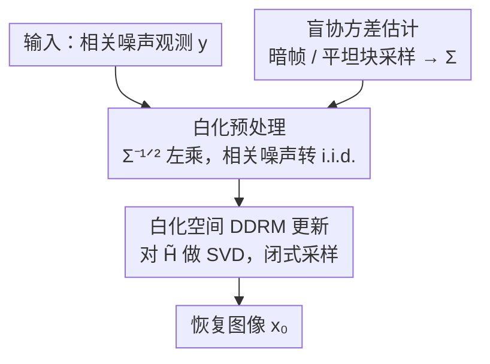

# CARD: Correlation Aware Restoration with Diffusion

**会议**: CVPR 2026  
**论文**: [CVF Open Access](https://openaccess.thecvf.com/content/CVPR2026/html/Nezakati_CARD_Correlation_Aware_Restoration_with_Diffusion_CVPR_2026_paper.html)  
**代码**: 无（论文未公开提供，基于公开 DDRM 代码库改造）  
**领域**: 扩散模型 / 图像恢复  
**关键词**: 相关噪声, 扩散逆问题, DDRM, 噪声白化, 协方差估计

## 一句话总结
CARD 把 DDRM 这套扩散逆问题求解器从「i.i.d. 高斯噪声」假设推广到真实传感器的「空间相关噪声」——先用协方差矩阵的逆平方根 $\Sigma^{-1/2}$ 把观测白化成 i.i.d.，再在白化后的测量空间里跑 DDRM 的闭式更新，全程免训练，在合成相关噪声和作者新采集的真实 rolling-shutter 数据集 CIN-D 上的去噪/去模糊/超分都稳定超过现有方法。

## 研究背景与动机

**领域现状**：近几年图像恢复（去噪、去模糊、超分）的 SOTA 大量来自扩散先验方法。其中 DDRM（Denoising Diffusion Restoration Model）特别有代表性：它把一个预训练的无条件扩散模型当先验，对退化算子 $H$ 做奇异值分解、在频谱基里推出**闭式**的后验更新，无需为每个任务重新训练就能解线性逆问题，效率很高。

**现有痛点**：这一整套方法（从经典 BM3D、监督学习 Restormer/DnCNN，到 DDRM/DDNM 这些扩散方法）几乎都建立在一个共同假设上——噪声是独立同分布（i.i.d.）的高斯噪声。但真实相机，尤其是手机和单反广泛采用的 rolling-shutter（卷帘快门）CMOS 传感器，因为逐行读出的电路机制，噪声在空间上是**强相关**的：作者在暗帧里能直接看到条纹状（row banding）的相关噪声结构。一旦把这些方法搬到真实传感器噪声上，恢复质量明显下降。

**核心矛盾**：DDRM 之所以能推出闭式更新，关键正是 i.i.d. 假设——在频谱基下每个分量退化成一维独立高斯，才能逐分量解析求解。而相关噪声的协方差 $\Sigma$ 不是对角阵，它把各个频谱分量**耦合**在一起，DDRM 赖以工作的闭式条件化直接失效。

**现有相关噪声方法的不足**：已有处理相关噪声的工作（信息论监督、空间自适应损失、burst 伪标签、结构化噪声建模等）几乎都需要**重新训练**，而且多数是用启发式去近似相关性，而非直接对协方差建模。

**本文目标 / 核心 idea**：能不能在**不重训**、不改预训练扩散模型的前提下，让 DDRM 直接吃下相关噪声？作者的切入点很直接——既然 DDRM 只在 i.i.d. 下成立，那就先把相关噪声「掰直」成 i.i.d.：用噪声协方差的逆平方根对观测做白化预处理，把问题搬进一个噪声重新独立的等价测量空间，再在那里原封不动地复用 DDRM 的闭式采样。一句话：**先白化、再 DDRM**。

## 方法详解

### 整体框架

CARD 是一个完全免训练的两步框架，只需要两样东西：一个噪声协方差矩阵 $\Sigma$ 的估计、一个预训练的无条件扩散模型。

退化观测模型从标准 DDRM 的

$$y = Hx_0 + z,\quad z \sim \mathcal{N}(0,\sigma_y^2 I)$$

推广为带相关噪声的版本：

$$y = Hx_0 + n,\quad n \sim \mathcal{N}(0,\sigma_y^2\Sigma)$$

其中 $y$ 是退化观测、$H$ 是退化算子、$x_0$ 是待恢复的干净图像、$\Sigma$ 是对称正定的协方差矩阵，捕捉像素间的空间相关性。整条流水线是：先（在真实场景下）从暗帧或噪声本身盲估出 $\Sigma$ → 用 $\Sigma^{-1/2}$ 白化观测，把相关噪声转回 i.i.d. → 在白化后的测量空间对白化算子 $\tilde H$ 做 SVD、跑 DDRM 的闭式更新 → 输出恢复图像。

### 关键设计

**1. 白化预处理：用 $\Sigma^{-1/2}$ 把相关噪声掰直成 i.i.d.**

这一步正面解决「相关噪声让 DDRM 闭式更新失效」的核心矛盾。做法是对整个测量方程左乘协方差的对称逆平方根 $\Sigma^{-1/2}$：

$$\Sigma^{-1/2}y = \Sigma^{-1/2}Hx_0 + \Sigma^{-1/2}n$$

令 $\tilde y = \Sigma^{-1/2}y$、$\tilde H = \Sigma^{-1/2}H$、$\tilde n = \Sigma^{-1/2}n$，则白化后的噪声 $\tilde n \sim \mathcal{N}(0,\sigma_y^2 I)$ 重新变成了 i.i.d.，得到一个标准形式的测量 $\tilde y = \tilde H x_0 + \tilde n$。这正好满足 DDRM 的独立性要求。直觉上，$\Sigma^{-1/2}$ 是一个「去相关」线性变换：它把噪声的相关结构吸收进退化算子（$H \to \tilde H$），代价是退化算子变得更复杂，但噪声侧干净了。实现上不直接求逆平方根，而是对 $\Sigma$ 做 Cholesky 分解 $LL^\top=\Sigma$，取 $W=L^{-1}$，使 $W\Sigma W^\top=I$，计算高效且数值稳定。

**2. 白化空间的 DDRM 闭式更新：在 $\tilde H$ 的频谱基里复用 DDRM**

白化只是把问题搬了个家，真正的恢复仍要靠扩散先验。CARD 把 DDRM 整套搬进白化测量空间：对白化算子做 SVD $\tilde H = \tilde U \tilde S \tilde V^\top$，把变量投影到这个新频谱基

$$\bar{\tilde x}_t = \tilde V^\top x_t,\quad \bar{\tilde y} = \tilde S^\dagger \tilde U^\top \tilde y$$

关键区别在于：原始 DDRM 的逐步更新依赖**原算子** $H$ 的奇异值 $s_i$，而 CARD 改用**白化算子** $\tilde H$ 的奇异值 $\tilde s_i$ 来驱动同一套闭式插值更新（在网络预测的干净分量 $x_{\theta,t}=f_\theta(x_{t+1},t+1)$ 与白化测量之间插值）。因为白化后噪声已是 i.i.d.，每个频谱分量重新退化为一维独立高斯，DDRM 的闭式后验得以成立——于是 CARD 继承了 DDRM 的采样效率（论文用 20 次 NFE），却把适用范围扩到相关噪声。它与预训练模型无关，可以即插即用替换任意线性恢复任务里的 DDRM。⚠️ 完整的白化更新方程作者放在补充材料，正文只给了投影式。

**3. 盲协方差估计 + CIN-D 数据集：让方法在真实相机上能落地**

白化的前提是拿到 $\Sigma$，这一步解决「真实场景从哪儿弄协方差」的问题。理想情况下用**暗帧**（盖上镜头盖、同曝光同增益拍摄）估计：假设暗帧近似零均值、在小块内局部平稳，对图像块计算样本协方差即得 $\Sigma$。没有标定数据（暗帧）时，CARD 还能**全盲**估计：从噪声图本身切非重叠块，用基于梯度的打分准则挑出空间平坦区域（假设平坦块由噪声主导），对这些块向量算样本协方差再做 Cholesky 分解得到白化算子。为支撑「相关噪声确实是真问题」这一论点，作者额外采集并贡献了 **CIN-D（Correlated Image Noise Dataset）**：用 FLIR Blackfly 卷帘机器视觉相机拍 100 个场景、各 3 个噪声等级（联合调增益/曝光/光圈），配长曝光图作无噪 GT 和暗帧供协方差估计，共 400 张，填补了「公开数据集都只有 i.i.d. 噪声」的空白。此外为高分辨率图像，白化和噪声采样按非重叠 tile 分块进行（传感器相关性通常是短程的，分块是合理近似）。

### 损失函数 / 训练策略
CARD **无任何训练**，所有超参沿用 DDRM，仅把测量参数 $\eta$ 针对相关噪声调过（网格搜索取 $\eta=0.80$，$\eta_b=1.0$ 与 DDRM 一致）。采用与 1000 步预训练模型相同的均匀时间步表，每个样本 20 次神经网络评估（NFE）。

## 实验关键数据

评测三类线性恢复任务：相关高斯噪声下的去噪、三种核（均匀/各向同性高斯/各向异性高斯）的去模糊、2×/4× 超分。在 ImageNet、LSUN-Bed/Cat（注入合成相关噪声 $\Sigma_{\text{synth}}=\sigma^2(I+\alpha B)+\varepsilon I$）和真实数据集 CIN-D 上评估，指标为 PSNR / LPIPS（SSIM 在补充材料）。

### 主实验

ImageNet 去噪（PSNR↑ / LPIPS↓，三种噪声强度 $\sigma_0$）：

| 方法 | $\sigma_0$=0.1 | $\sigma_0$=0.5 | $\sigma_0$=0.9 |
|------|------|------|------|
| Restormer（i.i.d. 监督） | 31.3 / 0.10 | 23.9 / 0.28 | 18.5 / 0.59 |
| BM3D（i.i.d. 先验） | 30.1 / 0.11 | 25.8 / 0.33 | 22.4 / 0.50 |
| DDRM（i.i.d. 扩散，最强基线） | 31.0 / 0.14 | 24.8 / 0.33 | 22.7 / 0.40 |
| **CARD（本文）** | **34.0 / 0.07** | **29.1 / 0.15** | **26.7 / 0.22** |

CARD 在所有噪声强度上全面领先，且优势随噪声增大而**拉大**：高噪声 $\sigma_0$=0.9 时 DDRM 已不稳定（22.7 dB），CARD 仍保持 26.7 dB。去模糊（高斯核）与超分同样领先：

| 任务 / ImageNet | DDRM | CARD（本文） |
|------|------|------|
| 高斯去模糊 $\sigma_0$=0.2 | 24.3 / 0.36 | **26.6 / 0.23** |
| 高斯去模糊 $\sigma_0$=0.5 | 22.2 / 0.42 | **24.4 / 0.30** |
| 2× 超分 $\sigma_0$=0.2 | 25.7 / 0.32 | **28.0 / 0.20** |
| 2× 超分 $\sigma_0$=0.5 | 22.7 / 0.41 | **25.1 / 0.33** |

真实相关噪声（CIN-D 去噪，PSNR↑ / LPIPS↓）——这是最能说明问题的一组，因为噪声来自真实卷帘传感器：

| 方法 | Low | High |
|------|------|------|
| PCST（i.i.d. 学习） | 37.2 / 0.20 | 29.4 / 0.40 |
| DDRM（i.i.d. 扩散） | 35.3 / 0.28 | 30.8 / 0.39 |
| APRRD-NBSN（相关噪声学习） | 17.0 / 0.28 | 17.1 / 0.38 |
| **CARD（本文）** | **38.1 / 0.19** | **31.5 / 0.34** |

值得注意的是，专为相关噪声训练的方法（APRRD-BSN/NBSN）反而泛化最差（仅 ~17 dB），说明「针对特定噪声统计重训」并不可靠，而 CARD 的「显式白化 + 通用扩散先验」更稳健。

### 消融实验

协方差估计误差敏感性（去噪 PSNR，对白化变换注入随机扰动模拟标定不准）：

| 协方差扰动 | CARD PSNR | 对照 DDRM |
|------|------|------|
| 0%（完美已知） | 29.6 dB | 25.0 dB |
| 5%（小误差） | 26.5 dB | — |
| 20%（中高误差） | 23.6 dB | — |

### 关键发现
- **优势随噪声增大而扩大**：低噪声时各方法都还行，CARD 的领先主要体现在中高噪声——白化把相关噪声拆解后，扩散先验才能正确发挥作用，否则相关结构会被当成图像内容保留下来。
- **白化是优雅退化的**：协方差估计扰动 5% 仅掉到 26.5 dB（仍高于 DDRM 的 25.0），扰动 20% 才掉到 23.6 dB，说明对标定误差有相当容忍度，不需要完美协方差。
- **协方差可跨传感器迁移**：用 Blackfly 暗帧估计的 $\Sigma$ 直接套到 Nikon Z30 相机图像上，CARD 仍优于 DDRM——相关噪声的空间结构在同类卷帘传感器间有共性。
- **针对相关噪声重训的方法泛化差**：APRRD 系列在 CIN-D 上崩到 17 dB 左右，反衬出 CARD「白化 + 免训练通用先验」路线的优势。

## 亮点与洞察
- **把问题转化而非硬解**：核心 trick 是「白化预处理」——不去改 DDRM 的内核，而是用 $\Sigma^{-1/2}$ 把相关噪声变换回 i.i.d. 这个 DDRM 能处理的形式。这种「先把输入掰成已有方法能吃的样子」的思路可迁移到任何对噪声分布有强假设的逆问题求解器。
- **免训练、即插即用**：与任意预训练扩散模型解耦，只多了一个线性白化步骤，几乎零额外成本就把 DDRM 的适用边界从理想噪声推到真实传感器噪声。
- **数据集补了真空白**：CIN-D 是（据作者所知）首个显式包含真实空间相关噪声的公开评测集，附暗帧供协方差估计，对后续相关噪声恢复研究是实打实的基础设施。
- **全盲协方差估计**：用「梯度打分挑平坦块 → 块协方差」在没有暗帧时也能估 $\Sigma$，让方法不依赖相机标定，落地门槛更低。

## 局限与展望
- **依赖协方差质量**：方法整体建立在 $\Sigma$ 估计之上，扰动 20% 时掉到 23.6 dB，极端相关或快速变化的噪声场景下估计误差可能更伤性能。
- **短程相关 + 分块近似**：高分辨率靠非重叠 tile 处理，前提是「相关性只跨几个邻近像素」。对长程相关（如全局条纹）这个近似可能不成立，作者也把分块大小的影响放进了补充材料。⚠️ 正文未给出长程相关的失败案例。
- **只覆盖线性逆问题**：CARD 继承 DDRM 框架，仅适用于线性退化算子 $H$（去噪/去模糊/超分），非线性退化（如复杂 ISP、JPEG）不在覆盖范围。
- **CIN-D 规模有限**：100 场景静态拍摄，缺动态/运动场景，且仅一两款卷帘相机，跨更多传感器的泛化仍需更大规模验证。

## 相关工作与启发
- **vs DDRM**：CARD 是 DDRM 的直接推广，复用其频谱基闭式更新和采样效率，唯一区别是先做白化、在 $\tilde H$ 的奇异值上更新。DDRM 在 i.i.d. 上是强基线，但在相关噪声/真实 CIN-D 上被 CARD 全面超过。
- **vs DDNM / DPS / DiffIR**：这些同样是扩散恢复方法（零空间投影 / 梯度引导 / 紧凑表示），但都默认 i.i.d. 噪声，相关噪声下鲁棒性有限（DDNM 在高噪声甚至崩到 12–16 dB）。CARD 用一步线性变换补上了这块假设缺口。
- **vs 相关噪声学习方法（AP-BSN / LG-BPN / APRRD）**：它们需要重训且用启发式近似相关性，泛化到训练统计之外就失效；CARD 免训练、直接对协方差建模，跨传感器也能用。
- **可迁移启发**：「用协方差白化把非 i.i.d. 噪声转回标准形式，再复用现成 i.i.d. 求解器」是个通用模式，理论上可嫁接到其它依赖噪声独立假设的恢复/采样方法上。

## 评分
- 新颖性: ⭐⭐⭐⭐ 思路简洁但切中要害——用一步白化把 DDRM 推广到相关噪声，加真实数据集，组合扎实。
- 实验充分度: ⭐⭐⭐⭐ 覆盖去噪/去模糊/超分三任务、合成+真实噪声、协方差敏感性与跨传感器泛化；SSIM 与部分结果放在补充。
- 写作质量: ⭐⭐⭐⭐ 动机（卷帘相关噪声）讲得清楚，公式推导紧凑，图示直观。
- 价值: ⭐⭐⭐⭐ 免训练即插即用 + 公开 CIN-D 数据集，对真实相机恢复有直接实用价值。

<!-- RELATED:START -->

## 相关论文

- [\[CVPR 2026\] DRFusion: Degradation-Robust Fusion via Degradation-Aware Diffusion Framework](drfusion_degradation_robust_fusion_via_degradation_aware_diffusion_framework.md)
- [\[CVPR 2026\] Residual Diffusion Bridge Model for Image Restoration](residual_diffusion_bridge_model_for_image_restoration.md)
- [\[CVPR 2026\] FAPE-IR: Frequency-Aware Planning and Execution Framework for All-in-One Image Restoration](fape-ir_frequency-aware_planning_and_execution_framework_for_all-in-one_image_re.md)
- [\[CVPR 2026\] Time-Aware One Step Diffusion Network for Real-World Image Super-Resolution](time-aware_one_step_diffusion_network_for_real-world_image_super-resolution.md)
- [\[CVPR 2026\] EMR-Diff: Edge-aware Multimodal Residual Diffusion Model for Hyperspectral Image Super-resolution](emr-diff_edge-aware_multimodal_residual_diffusion_model_for_hyperspectral_image_.md)

<!-- RELATED:END -->
