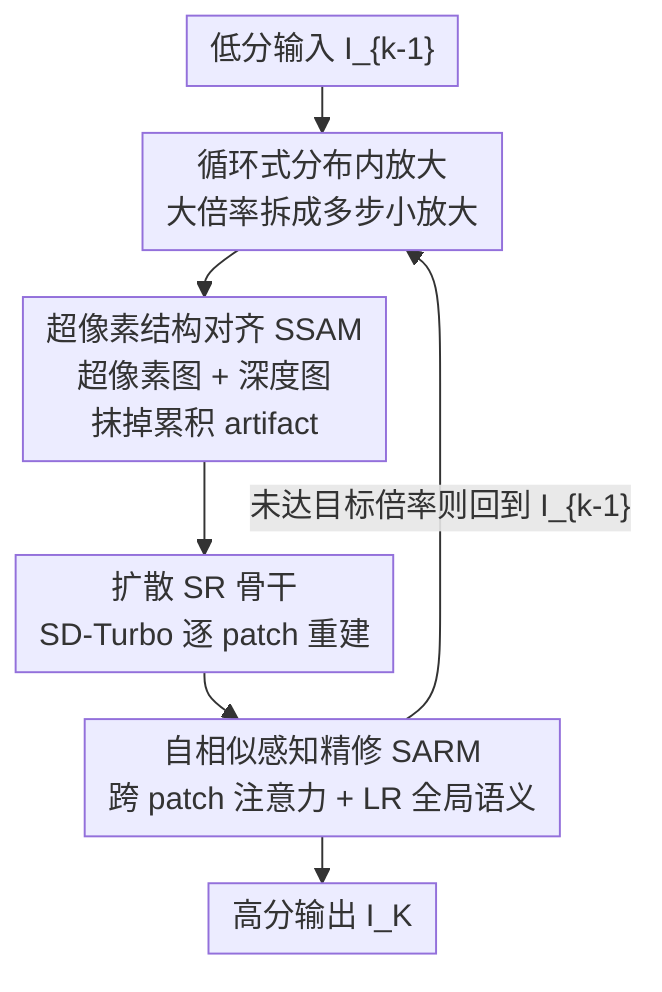

# CASR: A Robust Cyclic Framework for Arbitrary Large-Scale Super-Resolution with Distribution Alignment and Self-Similarity Awareness

**会议**: CVPR 2026  
**论文**: [CVF Open Access](https://openaccess.thecvf.com/content/CVPR2026/html/Guo_CASR_A_Robust_Cyclic_Framework_for_Arbitrary_Large-Scale_Super-Resolution_with_CVPR_2026_paper.html)  
**代码**: 无（论文未提供）  
**领域**: 图像恢复 / 超分辨率  
**关键词**: 任意尺度超分, 循环放大, 分布漂移, 超像素对齐, 自相似性  

## 一句话总结
CASR 把"任意大倍率超分"拆成一连串"始终落在训练分布内"的小倍率放大循环，用一个单模型反复迭代，并配两个模块（超像素结构对齐 SSAM 抑制循环中的分布漂移、自相似感知精修 SARM 保证分块重建的纹理一致），在 ×8~×30 极端放大下 LPIPS / MUSIQ 等感知指标大幅领先现有任意尺度方法。

## 研究背景与动机

**领域现状**：任意尺度超分（Arbitrary-Scale SR, ASISR）希望用一个统一模型，从单张低分图重建出任意放大倍率的高分图。主流做法是隐式神经表示（如 LIIF 用 MLP 按坐标查询 RGB）或在其上叠加生成式先验（归一化流 LINF、扩散 IDM），它们在训练覆盖的尺度范围内表现不错。

**现有痛点**：一旦推理倍率超出训练范围（典型训练到 ×4，推理却要 ×8 甚至 ×30），这些方法会急剧退化——LR→HR 的映射关系、纹理统计、重建先验都对不上，输出出现模糊、细节丢失、严重 artifact。作者用 SIFID 指标量化了这种"级联放大时分布越漂越远"的现象。

**核心矛盾**：直接预测大倍率会把模型推出训练分布，而 SR 本身是病态的一对多映射，倍率越大优化越不稳定、收敛越不可靠；另一条路"级联多个专用 SR 网络"虽然每步小倍率，但要存多个网络、参数冗余、且固定级联无法适配动态变化的倍率。两条路各有死穴。

**本文目标**：用单个模型，在任意（尤其极端）倍率下都做到稳定、高质量重建，同时把每一步都约束在模型的训练分布里。

**切入角度**：作者从"跨尺度分布迁移"的视角重新审视问题——既然模型只在 ≤×4 范围内可靠，那就别让它一次跳太远。把超大倍率 $s$ 分解为若干个 $\le s_{max}$ 的子倍率连乘 $s = s_1 \times s_2 \times \cdots \times s_K$，每一步都是一次"分布内"的小放大。

**核心 idea**：用"循环复用同一个 SR 模型、逐步放大"替代"一次性大倍率外推"，把超分辨率重写成一串分布一致的尺度迁移；并针对循环带来的两个新问题——迭代间分布漂移、分块扩散的纹理不一致——分别设计 SSAM 与 SARM。

## 方法详解

### 整体框架

给定低分图 $I_0$ 和任意倍率 $s$，CASR 先把 $s$ 分解成 $K$ 个不超过训练上限 $s_{max}$（实验取 4）的子倍率连乘，然后做 $K$ 次迭代放大：第 $k$ 步把上一步结果 $I_{k-1}$ 放大 $s_k$ 倍得到 $I_k$，直到输出最终 $I_K$。关键在于——每一步的输入分布都被强行"拉回"模型熟悉的范围，从而避免一次大跳跃带来的不稳定。

单步内部分三段串行：先用 **SSAM**（超像素结构对齐）把 $I_{k-1}$ 分解成"超像素图 + 深度图"这套抗噪的稳定表示，抹掉上一轮累积的 artifact；再切成 patch 送进以 SD-Turbo 为骨干的扩散 SR 网络逐块重建；最后用 **SARM**（自相似感知精修）在 patch 之间交换全局信息、保住跨块纹理一致，再拼回完整分辨率的 $I_k$。整个循环只用一套权重。

### 关键设计

**1. 循环式分布内放大：把大倍率外推改写成多步分布内迁移**

直接让模型一次放大 ×30，会强迫它在远离训练分布的区域工作，这正是一切模糊和 artifact 的根源。CASR 的做法是把目标倍率 $s$ 分解成连乘 $s = s_1 \times s_2 \times \cdots \times s_K$，每个 $s_k \le s_{max}$，于是每一步都是一次模型擅长的小倍率放大，前一步输出当作后一步输入逐级 refine。这样既保证了任意倍率的可达性（连乘可逼近任意 $s$），又把每一步约束在学到的流形内，稳定性和显存占用都远优于一次性大放大。论文还做了一个有力反证：让 baseline 也按 ×4×3×1.5 这样的分步流程跑（每步都在训练范围内），性能相比直接 ×18 并未提升——说明光"分步"不够，必须解决分步带来的分布漂移，这正是后两个模块的由来。

**2. SSAM 超像素结构对齐：用超像素 + 深度双表示截断迭代间的分布漂移**

循环放大有个致命副作用：SR 网络每轮都在增强边缘和纹理，残余噪声、振铃、局部模糊被一并放大，feature 统计逐轮偏离训练分布，形成正反馈式的分布漂移。SSAM 在每轮放大前先做一次"结构提纯"。它把图像均匀划成 $n\times n$ 超像素块，用一个轻量全卷积超像素分割网络（SSN，从 SuperPixel-FCN 裁剪 35% 通道并蒸馏而来）预测每个像素归属周围 9 个邻域的软分配概率，双线性上采样 + argmax 得到分割掩码 $P^{k-1}$，每个区域 $r$ 用区域均值归一化：

$$C^{k-1}_r = \frac{1}{|r|}\sum_{i \in r} I^{k-1}_i$$

超像素把感知相似的像素聚成均匀片区，相当于稀疏编码式的平滑表示，能抹掉级联累积的 artifact、同时保留主体内容，且清晰的超像素边界还方便用最近邻做"矢量式"上采样。但只有超像素会破坏边缘连续性（分割边界可能和真实物体轮廓错位），于是再用预训练 DepthAnything 提取深度图作为几何约束——深度比边缘检测更抗 artifact。最终每轮输入被分解成两路互补稳定表示：捕捉低频内容的超像素图 + 保留高频几何的深度结构图，既压住随机噪声又守住语义和边界，为后续 SR 提供分布稳定的输入。

**3. SARM 自相似感知精修：让独立处理的 patch 共享全局纹理、保住跨块自相似性**

受显存和扩散骨干固定输入尺寸所限，逐级放大的大图只能切成小 patch 独立处理再拼接。重叠融合能缓解边界 artifact，却保不住"跨 patch 自相似性"——同一张图里重复出现的结构（如一排窗户、重复的雕像纹理）被不同 patch 重建成不一致的纹理。SARM 用相关性显式建模并对齐这种自相似。对重建图 $I_k$ 和 GT $I_{gt}$，用预训练 SAM 编码器取语义嵌入 $e_k, e_{gt}$，算各自的自相似矩阵：

$$R_k = e_k(e_k)^\top, \qquad R_{gt} = e_{gt}(e_{gt})^\top$$

矩阵紧凑地编码了图内各位置两两相似度。机制上，每个 patch 独立编码后，把最低分辨率瓶颈特征 $f$ 缓存下来，对这些 token 数很少的缓存特征做一次全局自注意力（开销极小），让每个 patch 都"看见"全图的模式分布，再各自解码、用 MultiDiffusion 合并成 HR。为补回分块导致的全局上下文损失，还从 LR 图 $I_{k-1}$ 用 SAM 抽全局语义嵌入 $g$，经 cross-attention 注入。训练时用相关性损失把重建图的自相似结构拉向 GT：

$$L_{corr} = \lVert R_k - R_{gt} \rVert^2$$

和只看局部邻域线索的方法不同，SARM 显式引入了 LR 全局语义来强化跨块一致性。

### 损失函数 / 训练策略

骨干用单步扩散模型 SD-Turbo，预训练参数全冻结，只在 VAE 编码器（LoRA rank 16）和去噪 U-Net（LoRA rank 32）上做 LoRA 轻量适配，并关掉扩散采样的随机噪声注入以保证确定性精修；结构控制信号经 ControlNet 分支注入 U-Net 解码器。训练分两阶段：

第一阶段（超分阶段）冻结 SARM、微调骨干，重建损失加深度一致性损失：

$$L_{rec} = \lambda_1 L_2 + \lambda_2 L_{LPIPS} + \lambda_3 L_{GAN}, \qquad L_{depth} = \lVert \mathrm{Norm}(d_k) - \mathrm{Norm}(d_{gt})\rVert^2$$

合计 $L_{total1} = L_{rec} + \lambda_4 L_{depth}$。第二阶段冻结骨干与 ControlNet，只训练全局融合模块（SARM），额外加相关性项 $L_{total2} = L_{rec} + \lambda_4 L_{depth} + \lambda_5 L_{corr}$。骨干文本提示在每个放大尺度用 RAM 动态抽取，DF2K 训练、四卡 A6000。

## 实验关键数据

### 主实验

DIV8K 合成数据集上跨 ×8~×30 的感知质量对比（LPIPS 越低越好，MUSIQ 越高越好）。CASR 在所有倍率均最优，且越极端优势越大：×30 时 LPIPS 比次优 LIIF+Diff 提升 16.9%，MUSIQ 远超所有 baseline。

| 倍率 | 指标 | CASR | LIIF+Diff | IDM | LINF |
|------|------|------|-----------|-----|------|
| ×8 | LPIPS↓ | **0.363** | 0.411 | 0.486 | 0.442 |
| ×8 | MUSIQ↑ | **53.63** | 28.99 | 24.11 | 26.01 |
| ×18 | LPIPS↓ | **0.450** | 0.550 | 0.656 | 0.578 |
| ×30 | LPIPS↓ | **0.501** | 0.603 | 0.705 | 0.625 |
| ×30 | MUSIQ↑ | **41.76** | 16.16 | 23.84 | 16.36 |

真实数据 RealSR（无参考指标）上同样全面领先，×30 时 MUSIQ / NIQE / PI 分别比次优 IDM 提升 34.1% / 6.5% / 9.5%：

| 数据集 | 倍率 | 指标 | CASR | IDM(次优) |
|--------|------|------|------|-----------|
| RealSR | ×8 | MUSIQ↑ | **53.50** | 28.69 |
| RealSR | ×30 | MUSIQ↑ | **37.84** | 28.22 |
| CelebA-HQ | ×12 | MUSIQ↑ | **71.71** | 41.47 |
| CelebA-HQ | ×12 | NIQE↓ | **4.77** | 9.66 |

一个关键对照：在 Table 1 的 ×4×3×1.5 分步列里，baseline 即便每步都在训练范围内，整体性能也并不比直接 ×18 好——证明"分步"本身不解决问题，分布漂移不治，循环级联反而被误差累积拖累。这正是 CASR 两个模块存在的意义。

### 消融实验

组件有效性（×18，DIV8K）：从 SD-Turbo+LoRA 的 Base 逐步叠加，每个模块都掉点验证：

| 配置 | LPIPS↓ | MUSIQ↑ | 说明 |
|------|--------|--------|------|
| Base（仅骨干） | 0.585 | 31.73 | 迭代精修中分布漂移，边缘糊、均匀区有 artifact |
| + 超像素 | 0.471 | 42.23 | 锐化边界、稳住跨迭代特征分布，贡献最大 |
| + 深度 | 0.467 | 45.18 | 几何保真增强、边缘更利 |
| + SARM（Full） | **0.450** | **51.44** | 跨 patch 一致，重复结构纹理统一 |

其余消融：SARM 中加入 LR 全局语义 cross-attention，相比只用 self-attention，MUSIQ +2.34、NIQE −0.29；损失上 $L_{corr}$ 带来 MUSIQ +0.90 / NIQE +0.47，再叠 $L_{depth}$ 达最优；超像素块大小取 4×4 是结构一致性与细节保留的平衡点（更大块更能压 artifact 但会抹掉细节甚至改变内容）。

### 关键发现
- **超像素模块贡献最大**：从 Base 加超像素，LPIPS 从 0.585 直降到 0.471、MUSIQ 涨 10+，说明"循环放大失败"的主因确实是分布漂移，把它截断收益最高。
- **光分步无用、必须治漂移**：baseline 在分步设置下不涨点，是全文最有说服力的动机验证。
- **越极端越能拉开差距**：×30 下 baseline 普遍崩坏，CASR 的 MUSIQ 仍维持 40+，体现循环范式在外推上的根本优势。
- **超像素尺寸是双刃剑**：增大尺寸 NIQE/PI 看似变好（更平滑），但 4×4 之后结构一致性下降、细节流失，作者据此定档 4×4。

## 亮点与洞察
- **范式重写**：把"训练大模型/扩大数据/扩大尺度范围"的暴力路线，换成"理解并调控表示如何随尺度演化"——核心洞见是极端超分的关键不在模型大小，而在每一步是否守在分布内，思路很干净也好迁移。
- **单模型循环复用**：任意倍率只靠一套权重连乘逼近，相比级联多网络省了大量存储且对动态倍率天然灵活，是工程上很实用的设计。
- **用超像素 + 深度做"分布提纯"**：把抗噪结构表示插在每轮放大之前来截断正反馈漂移，这个"在循环里反复重置到稳定流形"的 trick 可迁移到任何迭代式生成/放大流程。
- **自相似矩阵 + 缓存瓶颈特征做全局注意力**：只在低分瓶颈 token 上算全局注意力，开销极小却补回了分块丢掉的全局一致性，是分块扩散推理保一致的好范例。

## 局限与展望
- 作者承认方向性局限：内容自适应的超像素尺寸（而非固定 4×4）、把循环框架推广到视频 / 3D / 跨模态重建，都还是未来工作。
- ⚠️ 固定 $s_{max}=4$ 且倍率需分解为连乘，非整除或带小数的任意倍率如何精确分配各步 $s_k$、误差是否会在很多步时累积，论文未给出敏感性分析。
- 依赖一串重型预训练模型（SD-Turbo、DepthAnything、SAM、RAM、ControlNet），单步虽是 single-step 扩散，但多模块 + 多轮循环的实际推理时延/显存峰值未充分报告，落地成本存疑。
- 多数评测用无参考感知指标（MUSIQ/NIQE/PI），这类指标对"看起来真实但偏离原内容"的幻觉纹理不敏感，极端倍率下保真度是否被牺牲值得追问。

## 相关工作与启发
- **vs 隐式神经表示类（LIIF / CiaoSR）**：它们用 MLP 按坐标外推、理论上任意尺度，但超过 ×4 就模糊失真；CASR 不外推而是分步分布内放大，且作者把它们 +Diff 后仍在极端倍率落后，说明问题在分布漂移而非表达能力。
- **vs 生成式 ASISR（LINF 流 / IDM、Kim 扩散）**：它们靠生成先验提感知质量，但大倍率下出现块状 artifact 或过度平滑；CASR 用 SSAM 主动稳分布、SARM 保跨块一致，极端倍率优势显著。
- **vs 级联 SR（SR3 堆 ×4 扩散 / CDM）**：级联多网络存在"中间输出与下一网络训练分布不匹配"的退化，且要训练存储多个网络；CASR 用单模型循环 + 每轮分布对齐，既省参数又直面分布失配，是对级联范式的根本性改进。
- **vs 域特定大倍率（PULSE / GLEAN）**：那些方法靠 StyleGAN 隐码能做到 ×64 但局限于人脸等结构化类别；CASR 面向任意真实内容、不限语义域。

## 评分
- 新颖性: ⭐⭐⭐⭐⭐ 把任意大倍率超分重写为"分布内尺度迁移序列"的循环范式，视角干净且有反证支撑。
- 实验充分度: ⭐⭐⭐⭐ 合成/真实/人脸三类数据、×8~×30 全覆盖、消融到位；但缺倍率分解策略与推理成本的系统分析。
- 写作质量: ⭐⭐⭐⭐ 动机—挑战—模块对应清晰，图表完整，结论部分的范式升华有高度。
- 价值: ⭐⭐⭐⭐⭐ 单模型任意倍率、循环稳分布的思路实用且可迁移到视频/3D/迭代式生成。

<!-- RELATED:START -->

## 相关论文

- [\[CVPR 2026\] VoDaSuRe: A Large-Scale Dataset Revealing Domain Shift in Volumetric Super-Resolution](vodasure_a_large-scale_dataset_revealing_domain_shift_in_volumetric_super-resolu.md)
- [\[CVPR 2026\] Degradation-Robust Fusion: An Efficient Degradation-Aware Diffusion Framework for Multimodal Image Fusion in Arbitrary Degradation Scenarios](degradation-robust_fusion_an_efficient_degradation-aware_diffusion_framework_for.md)
- [\[CVPR 2026\] DRFusion: Degradation-Robust Fusion via Degradation-Aware Diffusion Framework](drfusion_degradation_robust_fusion_via_degradation_aware_diffusion_framework.md)
- [\[CVPR 2026\] Next-Scale Prediction: A Self-Supervised Approach for Real-World Image Denoising](next-scale_prediction_a_self-supervised_approach_for_real-world_image_denoising.md)
- [\[CVPR 2026\] Toward Real-world Infrared Image Super-Resolution: A Unified Autoregressive Framework and Benchmark Dataset](real_iisr_infrared_image_super_resolution_autoregressive.md)

<!-- RELATED:END -->
