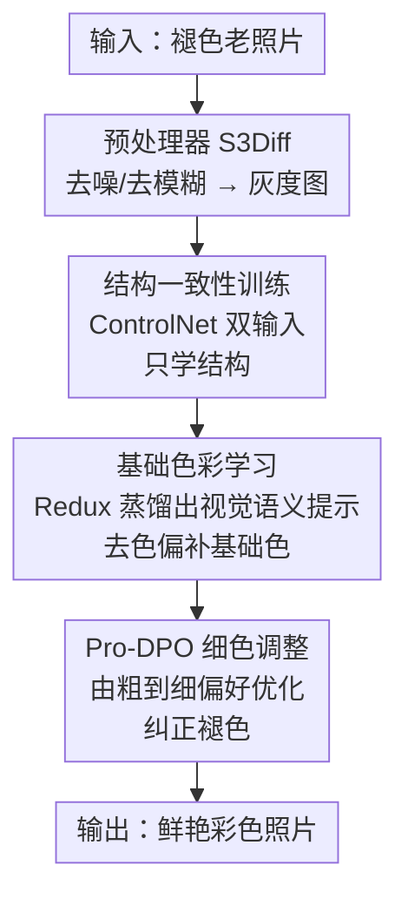

# ColorFLUX: A Structure-Color Decoupling Framework for Old Photo Colorization

**会议**: CVPR 2026  
**论文**: [CVF Open Access](https://openaccess.thecvf.com/content/CVPR2026/html/Li_ColorFLUX_A_Structure-Color_Decoupling_Framework_for_Old_Photo_Colorization_CVPR_2026_paper.html)  
**代码**: 无（论文未公开）  
**领域**: 图像恢复 / 扩散模型  
**关键词**: 老照片上色, 结构-色彩解耦, FLUX扩散, 渐进式DPO, 视觉语义提示  

## 一句话总结
ColorFLUX 把"保结构"和"补颜色"拆成相互冻结的两段训练，让生成扩散模型 FLUX 在不被结构任务干扰的前提下学到准确语义着色，再用一套由粗到细的渐进式 DPO 后训练修正老照片特有的褪色，在合成与真实老照片上都超过了现有开源/闭源商业上色模型。

## 研究背景与动机

**领域现状**：给黑白/褪色照片上色，主流路线是先用图像修复模型去噪、去划痕、去模糊，再接一个专门的上色模型；近期的生成式上色则借文生图（T2I）扩散模型当颜色先验，靠结构约束让输出和灰度输入对齐。

**现有痛点**：这套"先修复后上色"的流水线在老照片上效果差。一是灰度图本身色彩线索极少，模型只能"猜"颜色，容易出现语义不一致和**色彩外溢**（color bleeding，颜色糊到相邻物体上，比如手和外套串色）；二是现有生成式方法重度依赖文本 prompt，而"一图胜千言"，文字根本描述不清画面里的细粒度语义。

**核心矛盾**：老照片有一种现代照片没有的独特退化——亮度褪去、色相偏移（faded brightness / altered color hues），它和现代照片的色彩分布之间存在巨大的 **domain gap**。直接拿现代图训练的上色先验去套老照片，结果要么偏暗发灰、要么过饱和失真，对不上现代审美。

**本文目标**：在保持结构一致的同时，给褪色老照片补上既丰富又合理的颜色，并把老照片特有的褪色（低饱和、过曝/欠曝）也一并纠正。

**切入角度**：作者观察到，如果让一个模型同时学"保结构"和"学颜色"，两个任务会互相纠缠、彼此干扰（实验里联合训练时狮子脸部明显发暗）。那干脆把这两件事**解耦**：先专门学结构、再专门学颜色，且训练时互相冻结对方的模块。

**核心 idea**：以 FLUX 为底座，用"结构-色彩解耦"把上色拆成三段串行训练（结构一致 → 基础上色 → 细色调整），并用从灰度图蒸馏出的视觉语义提示替代文本 prompt、用渐进式 DPO 替代普通 DPO，专治老照片褪色。

## 方法详解

### 整体框架

ColorFLUX 建立在 Rectified Flow 扩散模型 FLUX 之上，整条管线是"一个预处理 + 三段解耦训练 + 一次推理"。推理时输入老照片，先经一个预训练的低层预处理器（S3Diff）去掉噪声/模糊等退化得到干净灰度图 $I_{gray}$，再交给上色主体。上色主体的核心是把"保结构"和"补颜色"彻底拆开，靠三段训练分别完成、且每一段都冻结上一段已经学好的能力：

- **阶段一·结构一致性训练**：用 ControlNet 向 FLUX 注入结构，让它只负责"画得跟原图结构对齐"，不操心颜色；
- **阶段二·基础色彩学习**：微调 Redux 让它从灰度图里抽出"去掉色偏的"视觉语义提示，调动 FLUX 的生成先验补出合理基础色；
- **阶段三·Pro-DPO 细色调整**：用 LoRA + 渐进式偏好优化，把基础色进一步推向鲜艳、符合现代审美的方向，纠正褪色。

三段之间用"冻结"实现解耦：训阶段一时冻 FLUX/Redux，训阶段二时冻 ControlNet/FLUX，训阶段三只动 LoRA。这样颜色学习就不会反过来破坏已经学好的结构对齐。

### 关键设计

**1. 结构一致性训练：让 ControlNet 只管结构、不碰颜色**

这一步针对的痛点是"结构与颜色互相纠缠"。常规做法是用 ControlNet 把灰度图当结构条件注入 FLUX，但若此时模型也要负责上色，结构和颜色就会在同一组权重里打架。ColorFLUX 的做法是给 ControlNet **同时喂两路输入**：灰度图 + 一条"颜色视觉提示" $c_v$；关键在于这条颜色提示是用预训练 Redux 从**真值彩色图 $I_{gt}$** 里抽出来的——也就是说，训练时直接把正确颜色当条件喂进去。这样模型不需要自己推断颜色，注意力被逼着只去学"怎么把结构画对"。训练损失就是 Rectified Flow 的 flow matching 目标

$$\mathcal{L}_{FM}=\mathbb{E}_{t,\,x_0\sim p(x_0),\,\epsilon\sim\mathcal{N}(0,I)}\big[\,\lVert v-v_\theta(x_t,t)\rVert^2\,\big],$$

其中噪声插值 $x_t=(1-t)x_0+t\epsilon$、目标速度场 $v=\epsilon-x_0$。整段训练只更新 ControlNet，FLUX 与 Redux 全程冻结。等推理时真值不可用，这条颜色提示就换成阶段二训出来的"从灰度图抽取"的版本——这正是下一个设计要解决的。

**2. 基础色彩学习：把 Redux 蒸馏成"无色偏"的视觉语义提示**

阶段一用的是真值颜色提示，但推理时没有真值，只能从灰度老照片里抽语义。难点有两个：灰度图本身带着老照片的色偏（亮度/色相已经被破坏），直接抽会把错误颜色信息也带进去；而文本 prompt 又描述不清细粒度语义，导致色彩外溢。ColorFLUX 的解法是微调 Redux 这个视觉提示提取器 $\Phi$，让它从灰度图 $I_{gray}$ 抽出的 embedding **逼近**冻结副本 $\Phi'$ 从真值彩色图 $I_{gt}$ 抽出的 embedding，用蒸馏损失对齐：

$$\mathcal{L}_{distill}=\lVert\Phi(I_{gray})-\Phi'(I_{gt})\rVert^2.$$

直觉是：让灰度图的语义表示"看起来像彩色图该有的样子"，从而抹掉老照片输入里的色偏。但只用蒸馏会让 Redux 的输出空间发生分布漂移、偏离 FLUX 能读懂的先验空间（实验里只用 $\mathcal{L}_{distill}$ 时色彩合理性下降），所以要再叠一项 flow matching 损失把输出拉回 FLUX 的表示空间：

$$\mathcal{L}=\mathcal{L}_{FM}+\alpha\,\mathcal{L}_{distill}.$$

这一段冻结结构 ControlNet 和 FLUX，只动 Redux——和阶段一的结构训练彻底解耦。产物就是一条能直接从灰度图抽取、且对齐 FLUX 颜色先验的"视觉语义提示"，替代了不可靠的文本 prompt。

**3. Pro-DPO 细色调整：由粗到细的渐进式偏好优化纠正褪色**

基础色补上后，老照片还残留低饱和、过曝/欠曝这类**褪色效应**，需要细微纠正。作者用 DPO 做后训练对齐人类审美，先构造偏好三元组 $(c,x_w,x_l)$：正样本 $x_w=I_{gt}$ 是真实自然的彩色图，负样本 $x_l=I_{aug}$ 是对 $x_w$ **随机组合**亮度调整、对比度降低、饱和度降低（B/C/S）模拟褪色得到，条件 $c$ 则是把 $I_{aug}$ 灰度化得到。DPO 损失沿用 Diffusion-DPO 在 Rectified Flow 上的形式：

$$-\mathbb{E}\Big[\log\sigma\Big(-\tfrac{\beta_t}{2}\big(\lVert v_w-v_\theta(x_t^w,t)\rVert^2-\lVert v_w-v_{ref}(x_t^w,t)\rVert^2-\lVert v_l-v_\theta(x_t^l,t)\rVert^2+\lVert v_l-v_{ref}(x_t^l,t)\rVert^2\big)\Big)\Big],$$

并采用常数 $\beta_t=\beta_c$（实验证明优于 $\beta(1-t)^2$）。关键创新在 **progressive（Pro-DPO）**：若一上来就在大范围色彩增强空间里学，模型会只盯着"别太饱和"这类明显偏好，忽略"轻微提一点饱和让画面更鲜活"这种细微但更有价值的调整。于是设计两阶段渐进——第一阶段用**强增强**制造明显的偏好差，让模型先学会粗区分；第二阶段逐步**减小增强强度**，引入更细微的差距，逼模型练就细粒度调色能力（即原文示意的 easy-to-hard losing samples）。训练只在 FLUX 全部 MM-DiT 块的注意力/FFN 上加 rank=32 的 LoRA，不动主干。

### 损失函数 / 训练策略
- 阶段一：$\mathcal{L}_{FM}$，只训 ControlNet（FLUX/Redux 冻结）。
- 阶段二：$\mathcal{L}=\mathcal{L}_{FM}+\alpha\,\mathcal{L}_{distill}$，只训 Redux（ControlNet/FLUX 冻结）。
- 阶段三：$\mathcal{L}_{Diff\text{-}DPO}$（常数 $\beta_t$），只训 LoRA（rank=32，加在所有 MM-DiT 块），两阶段由粗到细。
- 配置：底座 FLUX.1 + 官方 Redux（SigLip 视觉编码器 + 两层 MLP 对齐到 FLUX 文本分支）；预处理器 S3Diff；8×80GB GPU 训约两天；推理 1024×1024、Euler flow-matching 调度、guidance=3.5、control scale=1、仅 8 步采样。

## 实验关键数据

评测用开源 Qwen2.5-VL-72B 作 MLLM 打分器（Qwen-score），评 6 个维度：色彩丰富度 CRI、色彩合理性 CRA、色彩一致性 CCS、结构一致性 SCS、美学 AES、综合 OA；再补三个 NR-IQA 指标 DeQA / Q-Insight / VisualQuality-R1（VQ-R1）。数据集：DIV2K-valid-synthesized（灰度化）、DIV2K-valid-augmented（先做褪色增强再灰度化，模拟老照片）、以及作者自采的 50 张真实老照片 RealOldPhotos。

### 主实验

三个 benchmark 上 ColorFLUX 在 DeQA、VQ-R1、AES、OA 上全面最好；下表摘真实老照片集 RealOldPhotos（OA 越高越好）：

| 方法 | 类型 | DeQA | VQ-R1 | CRI | CRA | AES | OA |
|------|------|------|-------|------|------|------|------|
| DeOldify | GAN开源 | 4.056 | 4.419 | 70.90 | 82.66 | 79.02 | 80.86 |
| DDColor | 编码-解码 | 4.090 | 4.500 | 76.20 | 82.36 | 82.42 | 82.70 |
| CtrlColor | 扩散 | 4.050 | 4.486 | 76.40 | 83.24 | 81.64 | 82.68 |
| FLUX-Kontext | FLUX编辑 | 4.110 | 4.452 | 66.00 | 79.74 | 76.38 | 77.70 |
| Doubao | 闭源商业 | 3.741 | 4.097 | **83.10** | 75.10 | 74.40 | 75.24 |
| **ColorFLUX** | 本文 | **4.199** | **4.593** | 80.50 | **83.36** | **83.22** | **83.20** |

闭源商业模型 Doubao 的色彩丰富度（CRI 83.10）虽更高，但结果**过饱和失真**，色彩合理性（CRA 75.10）和综合分都明显低；ColorFLUX 同时拿到高丰富度与高合理性，且单卡推理 7.45s，远快于 FLUX-Kontext 的 28.14s 和 Doubao 的约 29s。

### 消融实验

**(a) 基础色彩学习的两项损失**（DIV2K-valid-synthesized）：

| 配置 | DeQA | VQ-R1 | CRI | CRA | OA |
|------|------|-------|------|------|------|
| 仅 $\mathcal{L}_{FM}$ | 3.889 | 4.432 | 46.35 | 68.45 | 69.91 |
| 仅 $\mathcal{L}_{distill}$ | 4.044 | 4.552 | **58.55** | 70.65 | 75.12 |
| $\mathcal{L}_{FM}+\mathcal{L}_{distill}$ | **4.114** | **4.577** | 57.55 | **72.45** | **75.39** |

**(b) 细色调整策略**（DIV2K-valid-augmented）：

| 配置 | DeQA | VQ-R1 | CRI | CRA | AES |
|------|------|-------|------|------|------|
| W/o DPO | 3.932 | 4.344 | 55.80 | 71.85 | 72.24 |
| SFT | 4.236 | 4.656 | 70.95 | 78.65 | 79.80 |
| One-stage DPO | **4.307** | 4.692 | 77.05 | 79.35 | 82.46 |
| **Pro-DPO** | 4.303 | **4.728** | **80.15** | **79.70** | **82.80** |

**(c) 提示策略**（Table 2，RealOldPhotos）：视觉语义提示全面优于文本 prompt，CRI 从 58.00 升到 67.80、CRA 从 71.70 升到 79.60、AES 从 70.06 升到 78.62。

### 关键发现
- **解耦确实有用**：把 Redux 和 ControlNet 联合训练（不解耦）时，狮子脸部颜色明显发暗，说明颜色学习与结构保持互相干扰；逐段冻结后结构/色彩各司其职。可视化里去掉 SCT 的 ControlNet 会严重结构错乱，加回 BCL 恢复基础色，再加 FCA 的 LoRA 才得到鲜艳保真的结果。
- **两项损失互补**：只用 $\mathcal{L}_{distill}$ 色彩丰富但合理性偏低（Redux 输出空间漂移、FLUX 读不准）；只用 $\mathcal{L}_{FM}$ 训练效率低、蒸馏不充分；二者结合综合最好。
- **渐进比一步到位强**：Pro-DPO 相比 One-stage DPO 在 CRI（77.05→80.15）和 VQ-R1 上更高——由粗到细让模型学到了细微的提饱和等调整，而非只学"别过饱和"。⚠️ 注意 Pro-DPO 在 CCS（色彩一致性）上略低于 One-stage（84.15 vs 82.66），更鲜艳与更一致之间存在轻微取舍。

## 亮点与洞察
- **用"冻结"实现真解耦**：不是简单分支，而是三段训练逐一冻结上游已学能力，从机制上杜绝颜色任务反噬结构任务——这种"分阶段冻结"范式可迁移到任何"结构 vs 风格/颜色"会打架的生成任务。
- **训练时灌真值颜色、推理时用蒸馏替身**：阶段一直接把真值色彩当 ControlNet 条件喂进去逼模型专注结构，再用阶段二的蒸馏提示无缝替换真值，是个很巧的"训练-推理输入对齐"技巧。
- **把"老照片褪色"显式建模进负样本**：负样本不是随便找的差图，而是对真值做 B/C/S 增强模拟真实褪色，让 DPO 学的偏好正好对准要纠正的失真类型；渐进式增强强度则是课程学习思想在 DPO 上的落地。
- **无可靠上色指标就自建 MLLM 评测**：用 Qwen2.5-VL-72B 拆成 6 维打分，外加自采 50 张含人群/风景的真实老照片，补上了以往只测人像、样本极少（DDColor 仅 13 张）的评测空白。

## 局限与展望
- **依赖外接预处理器**：去退化交给独立的 S3Diff，整体效果受其上限制约；预处理失败会直接污染后续上色，端到端联合优化是个方向。
- **训练成本与可复现性**：8×80GB GPU 训两天、三段串行 + LoRA，复现门槛高；论文未公开代码，部分超参（如 $\alpha$、$\beta_c$、两阶段增强强度切换点）需查补充材料。⚠️ 以原文/补充材料为准。
- **评测部分自定义**：Qwen-score 由 MLLM 打分，主观性与 prompt 设计相关；虽补了三个 NR-IQA，但缺少传统 FID/有参考指标的对照。
- **鲜艳 vs 一致的取舍**：Pro-DPO 在色彩一致性 CCS 上略有让步，对要求严格保色一致的场景（如文物档案）可能需要调权重。

## 相关工作与启发
- **vs CtrlColor**：同为扩散式上色、靠结构约束对齐灰度输入，但 CtrlColor 仍重度依赖文本 prompt，难防色彩外溢；ColorFLUX 用从灰度图蒸馏的视觉语义提示替代文本，并额外做解耦训练 + Pro-DPO 专攻老照片褪色。
- **vs DDColor / DeOldify**：传统编码-解码 / GAN 路线色彩线索不足、易出 color bleeding（手、外套串色）；ColorFLUX 借 FLUX 生成先验补色，丰富度与合理性兼得。
- **vs FLUX-Kontext / Doubao**：同样基于强生成模型，但 Kontext 亮度波动大、Doubao 过饱和失真；ColorFLUX 的解耦 + 渐进 DPO 让颜色既鲜艳又合理，且推理更快。
- **vs Diffusion-DPO / 普通 DPO**：本文把 DPO 从"一次性偏好对齐"改成"由粗到细的两阶段渐进"，并把负样本显式构造成褪色增强，针对性更强。

## 评分
- 新颖性: ⭐⭐⭐⭐ 结构-色彩解耦 + 视觉语义提示 + 渐进式 DPO 三件组合拳针对老照片褪色，单点都不算全新但组合与问题切入很扎实。
- 实验充分度: ⭐⭐⭐⭐ 三 benchmark + 四组消融 + 对比闭源商业模型，但缺有参考指标与代码。
- 写作质量: ⭐⭐⭐⭐ 动机—解耦—三阶段叙事清晰，公式与图配合到位。
- 价值: ⭐⭐⭐⭐ 老照片上色是有真实需求的应用，解耦冻结范式与褪色负样本构造有迁移价值。

<!-- RELATED:START -->

## 相关论文

- [\[CVPR 2026\] CanonCGT: Reference-Based Color Grading via Canonical Pivot Representation](canoncgt_reference-based_color_grading_via_canonical_pivot_representation.md)
- [\[CVPR 2026\] Perceptual Neural Video Compression with Color Separation and Rank Chain](perceptual_neural_video_compression_with_color_separation_and_rank_chain.md)
- [\[CVPR 2026\] Polarization State Tracing for Reflection Removal and Color-Consistent Reconstruction](polarization_state_tracing_for_reflection_removal_and_color-consistent_reconstru.md)
- [\[CVPR 2026\] Restore Text First, Enhance Image Later: Two-Stage Scene Text Image Super-Resolution with Glyph Structure Guidance](restore_text_first_enhance_image_later_two-stage_scene_text_image_super-resoluti.md)
- [\[CVPR 2026\] From Events to Clarity: The Event-Guided Diffusion Framework for Dehazing](from_events_to_clarity_the_event-guided_diffusion_framework_for_dehazing.md)

<!-- RELATED:END -->
