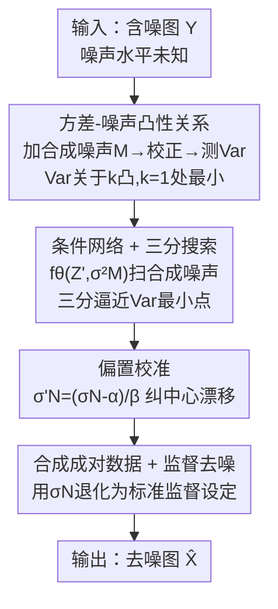

# Convexity-Aware Noise Calibration: A Self-Supervised Framework for Noise-Level-Unknown Image Denoising

**会议**: CVPR 2026  
**论文**: [CVF Open Access](https://openaccess.thecvf.com/content/CVPR2026/html/Wang_Convexity-Aware_Noise_Calibration_A_Self-Supervised_Framework_for_Noise-Level-Unknown_Image_Denoising_CVPR_2026_paper.html)  
**代码**: https://github.com/zhanzhanblue/CANC  
**领域**: 图像恢复 / 自监督去噪  
**关键词**: 自监督去噪, 噪声估计, Noisier2Noise, 三分搜索, AWGN

## 一句话总结
本文（CANC）发现"对含噪图再加合成噪声、跑 Noisier2Noise 校正"后，去噪输出的方差关于"合成噪声/真实噪声方差比 $k$"是一条**凸曲线**、且在 $k=1$（合成噪声恰好等于真实噪声）处取最小，于是用一个以合成噪声方差为条件的网络 + 三分搜索把这个最小点找出来，从而在没有干净图、不知道噪声水平的前提下精确估计噪声 $\sigma_N$，再用估计值合成监督训练对，让自监督去噪逼平甚至略超"已知噪声水平"的监督模型。

## 研究背景与动机
**领域现状**：高斯白噪声（AWGN）去噪里，监督方法（DnCNN-S、Restormer、MambaIR）在"已知噪声水平、给定成对干净-含噪图"时性能最强，但要给每个噪声水平单独训一个模型；无监督这边则分两路——盲点网络（Noise2Void、Noise2Self、Neighbor2Neighbor）和直接估噪声参数的传统方法（Foi、DWT、IVHC）。

**现有痛点**：盲点类方法靠 mask 掉中心像素来构造自监督信号，**信息有损且不可逆**，网络学不到完整图像统计，PSNR 永远追不上监督方法；万能模型（DnCNN-B）一个网络扛多噪声水平，缺乏针对性，比专门模型差；传统估噪声方法精度不稳，对噪声水平敏感、鲁棒性差，把后续去噪的上限也拉低了。

**核心矛盾**：监督去噪要"已知噪声水平 + 成对数据"才能发挥，但真实场景噪声水平未知、根本配不出与真实数据同水平的成对图——性能最好的范式恰恰用不上。

**本文目标**：在**只有含噪图、不知道噪声分布**的硬约束下，先把真实噪声水平 $\sigma_N$ 估准，再借它合成成对数据，把问题转化回监督去噪。

**切入角度**：作者回到 Noisier2Noise——它对含噪图 $Y$ 再加一份合成噪声 $M$ 得到 $Z'$，再用校正公式恢复干净图，但**要求已知 $M$ 的水平且 $M=N$**。作者反过来想：如果把 $M$ 的水平当未知变量去扫，去噪结果会随 $M$ 怎么变？直觉是 $M$ 恰好等于 $N$ 时去噪最彻底、输出方差最小，偏离就残留噪声、方差变大。

**核心 idea**：把"输出方差 vs 合成噪声水平"的关系严格推成一条**凸曲线**，最小值点对应的合成噪声方差就等于真实噪声方差——于是用三分搜索找最小点即可估出 $\sigma_N$，全程不需要干净图。

## 方法详解

### 整体框架
CANC 是一个**两阶段自监督**框架。阶段一（噪声估计）：训练一个把合成噪声方差 $\sigma_M^2$ 作为显式条件的去噪网络 $f_\theta(Z', \sigma_M^2)$，对每张含噪图 $Y$ 加不同水平的合成噪声 $M$ 得到 $Z'=Y+M$，用 Noisier2Noise 校正得到估计 $\hat X$，并测其方差 $\mathrm{Var}(\hat X)$；由于该方差关于 $\sigma_M^2$ 是凸的，用三分搜索快速逼近使方差最小的 $\sigma_M^2$，再做一次线性校准纠偏，得到真实噪声水平估计 $\sigma_N$。阶段二（去噪）：拿估出的 $\sigma_N$ 合成噪声-干净成对数据（"已知水平后退化为标准监督设定"），喂任意标准监督去噪网络（DnCNN-S / BM3D / Restormer）训练，最终得到去噪模型。

下面这张图把整条 pipeline 串起来，节点名与"关键设计"一一对应：

### 关键设计

**1. 方差-噪声凸性关系：把"噪声水平未知"转成一个可优化的凸问题**

这是全文的理论核心，针对"噪声水平未知就没法用 Noisier2Noise"的痛点。设干净图 $X$、真实噪声 $N\sim\mathcal N(0,\sigma_N^2)$、额外合成噪声 $M\sim\mathcal N(0,\sigma_M^2)$、noisier 图 $Z'=Y+M=X+N+M$。训练网络 $f_\theta(Z',\sigma_M^2)$ 以 L2 损失从 $Z'$ 预测 $Y$，最优解满足 $f_{\theta^*}(Z',\sigma_M^2)=\mathbb E[Y\mid Z']$。用 Tweedie 公式可得 $\mathbb E[N\mid Z']=\frac{\sigma_N^2}{\sigma_N^2+\sigma_M^2}(Z'-X)$，代入并套 Noisier2Noise 校正 $\hat X=2\mathbb E[Y\mid Z']-Z'$，化简得到关键的残差表达式：

$$\hat X = X + \frac{\sigma_N^2-\sigma_M^2}{\sigma_N^2+\sigma_M^2}(N+M)$$

可见只有当 $\sigma_M^2=\sigma_N^2$ 时残差项系数为 0、$\hat X=X$ 恢复干净图。进一步算估计量方差，令 $\sigma_M^2=k\sigma_N^2$（$k>0$）：

$$\mathrm{Var}(\hat X)=\mathrm{Var}(X)+\frac{(1-k)^2}{1+k}\,\sigma_N^2$$

对 $k$ 求导得 $\frac{d}{dk}\frac{(1-k)^2}{1+k}=\frac{-3+2k+k^2}{(1+k)^2}$，零点为 $k=1$（$k=-3$ 无意义）。$0<k<1$ 时方差随 $k$ 递减、$k>1$ 时递增——这是一条以 $k=1$ 为唯一最小点的**凸**曲线。也就是说，"使去噪输出方差最小的合成噪声水平 = 真实噪声水平"，把一个无监督估计问题精确转成了一个一维凸优化问题，这是后面能用三分搜索的根本依据。

**2. 条件网络 + 三分搜索：沿凸曲线高效逼近真实噪声水平**

有了凸性，还得真的把最小点找出来，这就要求一个网络对**任意**合成噪声水平都能正确去噪。作者把 $\sigma_M^2$ 作为条件显式喂进网络 $f_\theta(Z',\sigma_M^2)$，训练时对每张图随机采样 $\sigma_M^2$ 并以 $\|f_\theta(Z',\sigma_M^2)-Y\|_2^2$ 为目标，迫使网络在原噪声与合成噪声分布不一致时仍隐式学到 $\sigma_M^2$ 的统计、给出 $\mathbb E[Y\mid Z']$。推理时固定网络、扫不同 $\sigma_M^2$ 测 $\mathrm{Var}(\hat X)$，并利用凸性用三分搜索（Algorithm 1）：在区间 $[L,R]$ 取 $m_1=L+\frac{R-L}{3}$、$m_2=R-\frac{R-L}{3}$，比较两点方差，方差小的一侧保留、丢掉另外三分之一，反复收缩到 $R-L<\epsilon$，返回 $(L+R)/2$ 作为 $\sigma_M^{2*}$，再令 $\sigma_N=\sigma_M$。相比逐点暴力扫描，三分搜索把估计代价从线性降到对数级，且只依赖凸性、不需要梯度。

**3. 偏置校准：纠正方差噪声把估计往区间中心拉的系统漂移**

理论上 $\sigma_M^2=\sigma_N^2$ 就是最优，但实际网络训练不可能完美（PSNR 无法到无穷）、方差测量本身带随机噪声，导致估计值会概率性地朝搜索区间 $[0,55]$ 的几何中心漂移，形成系统性偏差。作者用一条简单线性校准 $\sigma'_N=(\sigma_N-\alpha)/\beta$ 把整体方差拉回理论最优，参数由跨多个数据集的最小二乘回归拟合得到 $\alpha=1.2591,\ \beta=0.9622$。作者坦言这条校准偏经验性（⚠️ 详细推导在补充材料 Sec. 9–10，以原文为准），但在真实部署下是当前最有效实用的纠偏方案——在 $\sigma=25/255$ 上估计值收到 $25.21/255$、百分比误差 $\%E=0.84$。

### 损失函数 / 训练策略
阶段一的训练目标即条件去噪重建损失 $L'(\theta)=\min_\theta \mathbb E\big[\|f_\theta(Z',\sigma_M^2)-Y\|_2^2\big]$，其中 $Z'=Y+M$、$M\sim\mathcal N(0,\sigma_M^2)$ 的方差按训练样本随机采样。评估噪声估计用百分比误差 $\%E=\frac{|\sigma_{est}-\sigma|}{\sigma}\times100$。阶段二直接采用标准监督去噪的训练流程（DFWB 训练集、固定网络架构、统一超参），不再有特殊损失。

## 实验关键数据

### 主实验
彩色 RGB 设定下（DFWB 训练、$\sigma=25/255$、统一用 DnCNN backbone），CANC 估出 $\sigma=25.21/255$，在四个测试集上全面超过无监督方法，并与"已知噪声水平"的 DnCNN-S 几乎持平、个别略超：

| 测试集 | 指标 | 本文 | DnCNN-B(未知) | DnCNN-S(已知) |
|--------|------|------|---------------|---------------|
| CBSD68 | PSNR/SSIM | **31.21**/**0.886** | 31.13/0.883 | 31.21/0.886 |
| Kodak24 | PSNR/SSIM | **32.11**/**0.879** | 32.03/0.876 | 32.11/0.878 |
| McMaster | PSNR/SSIM | **32.26**/**0.887** | 32.13/0.885 | 32.25/0.887 |
| Urban100 | PSNR/SSIM | **31.41**/**0.912** | 31.24/0.910 | 31.41/0.912 |

灰度多噪声水平下，CANC（Proposed-DnCNN）相对真·已知水平的 DnCNN-S 差距 $\Delta$ 极小，且把估计值套到 BM3D / Noisier2Noise / Restormer 上都几乎无损：

| 监督方法(SET12 σ=25) | 本身 PSNR | 本文套用后 | Δ |
|----------------------|-----------|-----------|----|
| BM3D | 30.00 | 29.99 | 0.01 |
| Noisier2Noise | 29.81 | 29.77 | 0.04 |
| DnCNN-S | 30.39 | 30.35 | 0.04 |
| Restormer | 30.62 | 30.62 | 0.00 |

### 消融实验
噪声估计精度对比（$\%E$，越低越好），CANC 在三个噪声水平上都稳定领先传统估计法，验证设计 2/3 的有效性：

| 方法 | SET12 σ=15 %E | σ=25 %E | σ=50 %E | BSD68 σ=25 %E |
|------|--------------|---------|---------|---------------|
| Foi et al. | 8.13 | 20.38 | 3.94 | 3.36 |
| Pimpalkhute et al. | 1.82 | 2.46 | 8.04 | 2.37 |
| IVHC | 3.06 | 6.06 | 7.19 | 4.27 |
| **Proposed** | **1.47** | **0.35** | **0.10** | **0.90** |

方差趋势验证（Sec. 5.3）：在 SET12/BSD68 上把 $\sigma_M$ 从 5/255 扫到 60/255，实测 $\mathrm{Var}(\hat X)$ 曲线与理论凸曲线形状高度吻合、最小点都落在真实 $\sigma_N=25/255$ 附近，直接坐实了设计 1 的凸性推导。

### 关键发现
- **凸性是全套方法的命根**：方差-噪声关系的凸性既给出"最小点=真实噪声水平"的估计依据，又让三分搜索成立；实测曲线与理论吻合是最有说服力的验证。
- **信息无损是超越盲点法的根因**：Noise2Void/Noise2Self/Neighbor2Neighbor 因 mask/下采样丢信息，PSNR 天花板被钉死；CANC 保留全部像素信息，所以能逼平监督方法。
- **略超监督的反直觉解释**：估计值 25.21 比真值 25 稍高 → 去噪更"激进"、输出更平滑，反而更贴合人眼对"干净"的感知，于是 PSNR/SSIM 略升——这是个有意思的 caveat，并非方法真比已知水平更强。
- **实测方差低于理论值**：MSE 训练让网络倾向输出平滑图，BSD68 数据更多、平滑倾向更明显，实测-理论方差差更大；合成噪声接近真值时网络收敛更好、差距更小。

## 亮点与洞察
- **把无监督估计问题化成一维凸优化**：从 Noisier2Noise 的"$M=N$ 已知"约束反推出"输出方差关于噪声比 $k$ 凸、$k=1$ 取最小"，一个干净的数学事实直接撑起整套估计——这是最让人"啊哈"的地方。
- **条件网络 + 三分搜索的组合很轻**：不需要梯度、不需要干净图，只靠凸性就能对数级逼近，工程上极易复现。
- **估计与去噪解耦**：阶段一估出的 $\sigma_N$ 可即插即用喂给 BM3D / DnCNN / Restormer 任意去噪器（Δ 均 <0.05dB），相当于给所有"已知水平才好用"的方法补上了缺失的前置模块，迁移价值高。

## 局限与展望
- **强假设 AWGN**：整套推导建立在零均值、像素独立、与图像无关的高斯白噪声上，真实相机的泊松-高斯混合、空间相关噪声、JPEG 压缩噪声等未验证，适用范围受限。
- **校准偏经验**：$\alpha=1.2591,\beta=0.9622$ 由特定数据集最小二乘拟合，作者自己也承认"may appear heuristic"，换数据分布/噪声范围 [0,55] 之外是否还稳，存疑（⚠️ 以补充材料为准）。
- **依赖网络训练质量**：实测方差因网络平滑倾向偏离理论值，若 backbone 较弱或数据量影响收敛，最小点定位精度会受牵连。
- **改进思路**：把凸性分析推广到非高斯/信号相关噪声（如局部方差稳定变换后再估计），或用更原理化的纠偏替代线性校准，可显著扩大可用场景。

## 相关工作与启发
- **vs Noisier2Noise**：二者共用"加合成噪声 + 校正公式"骨架，但 Noisier2Noise 要求 $M=N$ 且噪声水平已知；本文把 $M$ 的水平当未知变量、用输出方差的凸性反推真实水平，从"已知才能用"升级到"未知也能估"，是对其理论的严格扩展。
- **vs 盲点法（Noise2Void / Noise2Self / Neighbor2Neighbor）**：它们靠 mask/下采样构造自监督信号、信息有损，PSNR 追不上监督；本文不丢任何像素信息，估准噪声后退化为标准监督，因而能逼平甚至略超监督，劣势是强依赖 AWGN 假设。
- **vs 传统噪声估计（Foi / DWT / IVHC）**：传统法靠手工统计/频域分割，跨噪声水平精度不稳；本文用深度网络拟合 + 凸搜索，$\%E$ 在 15/25/50 三档都更低更稳。

## 评分
- 新颖性: ⭐⭐⭐⭐⭐ 把"输出方差关于合成噪声水平凸、最小点即真实噪声"这一事实严格推出来并用三分搜索落地，角度干净又有理论支撑。
- 实验充分度: ⭐⭐⭐⭐ 估计精度、方差趋势、与已知/未知方法对比、多 backbone 套用都覆盖了，但只在 AWGN 合成噪声上验证，缺真实噪声。
- 写作质量: ⭐⭐⭐⭐⭐ 从 Noisier2Noise 复习到凸性推导一步步推得很清楚，公式与动机咬合紧密。
- 价值: ⭐⭐⭐⭐ 给所有"已知水平才好用"的去噪器补上前置噪声估计模块，即插即用、迁移性强，但受 AWGN 假设限制。

<!-- RELATED:START -->

## 相关论文

- [\[ICCV 2025\] Blind2Sound: Self-Supervised Image Denoising without Residual Noise](../../ICCV2025/image_restoration/blind2sound_self-supervised_image_denoising_without_residual_noise.md)
- [\[CVPR 2026\] Next-Scale Prediction: A Self-Supervised Approach for Real-World Image Denoising](next-scale_prediction_a_self-supervised_approach_for_real-world_image_denoising.md)
- [\[CVPR 2026\] TM-BSN: Triangular-Masked Blind-Spot Network for Real-World Self-Supervised Image Denoising](tm-bsn_triangular-masked_blind-spot_network_for_real-world_self-supervised_image.md)
- [\[CVPR 2026\] Learning to Translate Noise for Robust Image Denoising](learning_to_translate_noise_for_robust_image_denoising.md)
- [\[CVPR 2026\] PNG: Diffusion-Based sRGB Real Noise Generation via Prompt-Driven Noise Representation Learning](diffusion-based_srgb_real_noise_generation_via_prompt-driven_noise_representatio.md)

<!-- RELATED:END -->
