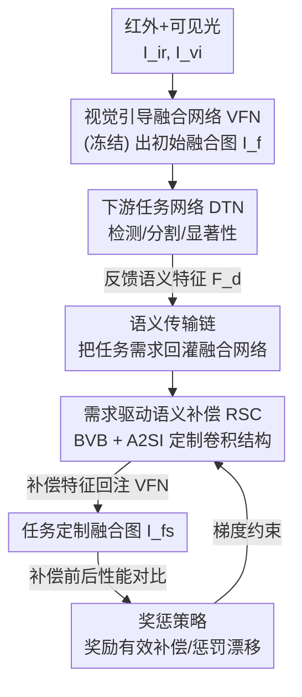

# Customized Fusion: A Closed-Loop Dynamic Network for Adaptive Multi-Task-Aware Infrared-Visible Image Fusion

**会议**: CVPR 2026  
**arXiv**: [2604.08924](https://arxiv.org/abs/2604.08924)  
**代码**: https://github.com/YR0211/CLDyN (有)  
**领域**: 红外可见光图像融合 / 多任务自适应 / 动态网络  
**关键词**: 图像融合, 闭环优化, 任务自适应, 动态卷积, 语义补偿

## 一句话总结
提出闭环动态网络 CLDyN，让一个冻结的融合网络在不重训的前提下，通过一个仅 0.46M 参数的"需求驱动语义补偿（RSC）"模块接收下游任务（检测/分割/显著性）反馈的语义特征、动态定制卷积结构来做任务专属补偿，从而用一套模块同时适配多个任务，在 M3FD/FMB/VT5000 上既保住融合质量又取得领先的多任务适应性。

## 研究背景与动机
**领域现状**：红外-可见光图像融合（IVIF）把红外的热目标线索和可见光的纹理细节合成一张图，用来支撑检测、分割、显著目标检测等高层视觉任务。为了让融合结果"对任务有用"，现有"任务感知融合"分两派：一是**损失驱动**（SeAFusion、TDAL、MetaFusion、TDFu），设计任务相关 loss 来引导融合网络学语义一致的表示；二是**任务语义引导**（DetFusion、UAAFusion、MRFS、SAGE），把任务特征直接注入融合过程增强语义表达。

**现有痛点**：这两类方法都是把"对某个/某些任务的偏好"**固化进网络权重**——融合网络在训练时见过哪些下游任务网络（DTN），就只对那些任务好。一旦换到训练时没见过的任务（untrained DTN），性能就明显掉，因为网络结构和参数是死的，没法针对新任务的语义需求重新调整自己。

**核心矛盾**：不同任务对融合图的语义需求其实是冲突的——检测想要突出的热区域，分割想要清晰的边缘结构，显著性想要完整的显著区域。把这些需求一次性塞进**同一套静态权重**里，必然顾此失彼（多任务下出现 task bias）。而要为每个任务单独训一个融合网络，参数和算力又爆炸。

**本文目标**：让**一个**融合网络在**不重训**的情况下，按照任意下游任务当下的语义需求"现场"调整自己，做到一套模块覆盖固定任务集内的多个任务。

**切入角度**：作者借鉴控制论里的**闭环反馈**思想——不要让信息只从融合网络单向流到任务网络，而是把任务网络反馈回来的语义特征作为"误差信号"，回灌去修正融合特征。关键观察是：任务自适应的本质不是改融合网络本身（它被冻结），而是在它的中间特征上做一次"任务专属语义补偿"。

**核心 idea**：用"闭环优化机制 + 需求驱动语义补偿模块"代替"把任务偏好固化进权重"，让融合网络的架构按任务需求动态定制，从而无需重训即可适配多任务。

## 方法详解

### 整体框架
CLDyN 分两阶段。**第一阶段**先训一个**视觉引导融合网络（VFN）**：红外/可见光 $I_{ir}, I_{vi}$ 经过 $L$ 个特征提取块（FEB）逐层提特征 $F^l_{ir/vi}$，再由融合重建块（FRB）重建出视觉质量高的融合图 $I_f$，仅用像素+梯度的融合损失约束。**第二阶段冻结 VFN**，引入闭环优化机制：把 $I_f$ 送进第 $n$ 个下游任务网络拿到任务预测 $\hat{y}^n_f$ 和反馈语义特征 $F^n_d$，再由 **RSC 模块**根据 $F^n_d$ 对 VFN 的中间特征 $F^l_{ir/vi}$ 做任务专属补偿，得到任务特征 $F^{l,n}_{ir_s/vi_s}$ 回注 VFN，重建出任务定制融合图 $I^n_{fs}$。整个链路（VFN → DTN → RSC → VFN）构成一条"语义传输链"，并由"奖惩策略"根据补偿前后任务性能的变化来约束 RSC 的训练。RSC 全程共享参数、只训一次，推理时不更新任何梯度，仅额外引入 0.46M 参数、174.06G FLOPs。

### 关键设计

**1. 闭环优化机制：把下游任务的语义需求作为反馈信号回灌融合网络**

针对"静态权重无法适配未见任务"的痛点，作者把单向的"融合→任务"管线改成闭环。语义传输链按式 (2)(3)(4)(5) 串起来：冻结 VFN 先产出 $I_f$ 和各层特征 $\{F^l_{ir/vi}\}$；$I_f$ 进第 $n$ 个任务网络 $\phi_n$ 得到 $(\hat{y}^n_f, F^n_d)$，其中 $F^n_d$ 编码了该任务对结构、纹理、显著区的偏好；RSC 据此把 $F^l_{ir/vi}$ 补偿成 $F^{l,n}_{ir_s/vi_s} = \mathrm{RSC}(\{F^l_{ir/vi}\}, F^n_d; \Psi)$，再用补偿特征**替换**原特征回注 VFN，重建任务定制图 $I^n_{fs}$。这样 VFN 本体不动，"适配能力"全部落在可学习的补偿上——检测任务就高亮热区、分割任务就强化边缘，做到同一网络对不同任务给出不同的融合结果

**2. 奖惩策略：用补偿前后的性能变化防止语义补偿漂移**

光有反馈链，RSC 在多任务联合训练下容易"补偿漂移"（学偏到某个任务上）。作者引入奖惩 loss 把补偿质量直接锚定到任务性能：奖励项 $\ell^n_r = c_n(\hat{y}^n_{fs}, y^n_{GT})$ 在 GT 监督下鼓励补偿后预测对齐真值；惩罚项 $\ell^n_p = \max(0,\ c_n(\hat{y}^n_{fs}, y^n_{GT}) - c_n(\hat{y}^n_f, y^n_{GT}))$ 只在"补偿后比补偿前更差"时才被激活，专门压制无效或有害的语义漂移。总目标 $\ell^n_{cl} = \ell^n_r + \alpha\,\ell^n_p$，$\alpha$ 控制惩罚强度；多任务梯度冲突用 CAGrad 缓解。奖励引导感知对齐、惩罚抑制过度补偿，二者配合让 RSC 逐步形成对各任务语义需求的可泛化理解

**3. 需求驱动语义补偿 RSC：用基向量库 + 架构自适应注入按任务现场定制卷积结构**

这是把"任务需求"翻译成"具体网络操作"的核心组件，由一个**基向量库（BVB）** 和 $2(L-1)$ 个**架构自适应语义注入（A2SI）块**组成。痛点是单一感受野吃不下多样的任务语义，所以每个 A2SI 内设 $M$ 个语义提取分支，每个分支按 $F^l_{ir/vi}$ 和 $F^n_d$ 自适应选卷积配置。作者定义四种正交卷积原型 $p=[p_{1,1}, p_{3,1}, p_{3,2}, p_{3,3}]$（核大小 $k\times k$、膨胀率 $d$ 的组合，冻结以保配置独立）。配置选择：把两路特征投影、拼接、聚合后乘以原型并 Softmax，得到配置选择矩阵 $S = \mathrm{Softmax}(p\,\mathrm{Resh}(\mathrm{Proj}_3([\mathrm{Proj}_1(F^l_{ir/vi}); \mathrm{Proj}_2(F^n_d)])))$，每个分支取概率最高的配置。

确定结构后，由 BVB 预测**卷积参数本身**：BVB 含四个子库对应四种配置，每个子库 32 个 $e_2{=}256$ 维、两两正交初始化的可学习基向量。按式 (9) 算聚合特征与各基向量的余弦相似度 $s_i = \cos(\mathrm{Proj}_6([\mathrm{Proj}_4(F^l); \mathrm{Proj}_5(F^n_d)]), r^{k,d}_{ir/vi,i})$，取最相似的基向量 $\tilde{r}_m$，再经预测块 $\mathrm{Pred}^{k,d}$ 生成第 $m$ 分支卷积核 $W^{k,d}_m$。最后所有分支并行卷积、聚合并残差注入：$F^{l,n}_{ir_s/vi_s} = F^l_{ir/vi} + \frac{1}{M}\sum_{m=1}^{M} (W^{k,d}_m \circledast F^l_{ir/vi})$。"选结构（A2SI）+ 选参数（BVB）"两步都由任务语义驱动，等于让网络架构本身随任务现场重组，而不是固定权重去硬扛所有任务

### 损失函数 / 训练策略
- **第一阶段（训 VFN）**：融合损失 $\ell_f = \|I_f - \max(I_{ir}, I_{vi})\|_1 + \lambda\|\nabla I_f - \max(\nabla I_{ir}, \nabla I_{vi})\|_1$，$\nabla$ 为 Sobel 梯度，$\lambda$ 平衡像素项与梯度项，保证融合图在像素一致性和纹理保留上的视觉保真。
- **第二阶段（训 RSC）**：冻结 VFN，仅训 RSC，用闭环目标 $\ell^n_{cl} = \ell^n_r + \alpha\ell^n_p$，多任务用 CAGrad 缓解梯度冲突。
- **超参/设置**：$L{=}2$，$\alpha{=}5$，$M{=}4$；两阶段 Adam，batch 16/4，初始 lr $1{\times}10^{-3}$ / $1{\times}10^{-2}$，epoch 100/50；下游网络用 YOLOv5s、SegFormer(mit-b2)、CTDNet-18；单张 RTX 4090。

## 实验关键数据

### 主实验

**融合质量对比**（融合网络均不重训、用官方模型；指标 MI/$Q_{AB/F}$/$Q_{CB}$ 越高越好，$Q_{CV}$ 越低越好，$Q_C$ 越高越好）：

| 数据集 | 指标 | 本文 | 次优(典型) | 说明 |
|--------|------|------|----------|------|
| M3FD | $Q_{AB/F}$ ↑ | **0.6900** | 0.6601 (SMiF) | 梯度融合质量第一 |
| M3FD | $Q_{CV}$ ↓ | **472.62** | 488.67 (SMiF) | 越低越好，第一 |
| FMB | MI ↑ | **2.6219** | 2.4035 (TIMF) | 互信息第一 |
| FMB | $Q_{AB/F}$ ↑ | **0.7124** | 0.6924 (SMiF) | 第一 |
| VT5000 | $Q_{AB/F}$ ↑ | **0.6519** | 0.5249 (SAGE) | 大幅领先 |
| VT5000 | $Q_{CV}$ ↓ | **331.15** | 392.64 (SAGE) | 第一 |

**多任务适应性 — vs "任务网络重训"方法**（OD: mAP$_{50\to95}$，Seg: mIoU，SOD: mF/$E_m$；参数/FLOPs 为可训练部分）：

| 方法 | OD mAP ↑ | Seg mIoU ↑ | SOD mF ↑ | SOD $E_m$ ↑ | Params(M) | FLOPs(G) |
|------|----------|-----------|----------|------------|-----------|----------|
| IRFS | 0.6306 | 59.43 | 0.8114 | 0.9091 | — | — |
| OCCO | 0.6320 | 58.57 | 0.8030 | 0.9017 | — | — |
| SAGE | 0.6225 | 54.89 | 0.8093 | 0.9066 | — | — |
| TIMF | 0.6166 | 60.86 | 0.7985 | 0.8998 | 46.52 | 183.82 |
| **Ours** | 0.6304 | **60.34** | **0.8129** | 0.9087 | **0.46** | **174.06** |

本文用**最少可训练参数（0.46M，约为 TIMF 的 1%）和最低 FLOPs** 拿到多数指标第一或紧贴第一（mIoU、$E_m$ 第二也极接近最优），而对手要么参数/算力高得多、要么无法兼顾所有任务。

**vs "联合训练"方法**：IRFS/SMiF/MRFS 只在参与训练的任务上有竞争力、在其它任务掉得明显（如 MRFS 的 SOD mF 仅 0.7800），且参数 39.95~134.97M、FLOPs 219~526G；本文 0.46M/174.06G 在多任务上整体稳定领先。

### 消融实验
（M3FD/FMB/VT5000，OD/Seg/SOD 指标）

| 配置 | OD mAP ↑ | Seg mIoU ↑ | SOD mF ↑ | SOD $E_m$ ↑ | 说明 |
|------|----------|-----------|----------|------------|------|
| Model I（去闭环机制，仅任务损失训 RSC） | 0.6272 | 60.15 | 0.8136 | 0.9091 | 出现明显 task bias |
| Model II（去惩罚项 $\ell^n_p$） | 0.6276 | 60.18 | 0.8134 | 0.9091 | 偏向 SOD 任务 |
| Model III（RSC 换成普通卷积） | 0.6298 | 60.07 | 0.8115 | 0.9081 | 多任务适应性下降 |
| **Full model** | **0.6304** | **60.34** | 0.8129 | 0.9087 | 跨任务最均衡 |

> ⚠️ 表中 SOD 的 mF/$E_m$ 在某些消融行个别项略高于 Full，作者强调 Full 的价值在于**跨三个任务整体最均衡**（消去组件后会偏科），单看某一任务的单点指标不代表整体多任务适应性。

**跨检测器泛化**（不重训 RSC，直接换检测器）：

| 检测器 | VFN（补偿前） | VFN+RSC（补偿后） |
|--------|--------------|-------------------|
| DETR | 0.5610 | **0.5810** |
| YOLOv5 | 0.6076 | **0.6304** |

### 关键发现
- **闭环机制是多任务均衡的关键**：去掉它（Model I）会出现显著 task bias，说明"反馈+补偿"而非单纯多任务 loss 才是消除偏科的根源。
- **惩罚项防漂移**：去掉 $\ell^n_p$（Model II）模型明显偏向 SOD，证明惩罚项确实在抑制"补偿学偏"。
- **结构定制 > 普通卷积**：RSC 换成普通卷积（Model III）多任务适应性下降，说明 BVB+A2SI 的动态结构定制带来的收益是实打实的。
- **极致轻量**：仅 0.46M 参数/174.06G FLOPs 就支撑三任务自适应，且 RSC 训一次、跨任务共享、推理零梯度更新；跨检测器（DETR/YOLOv5）都能稳定涨点，说明补偿是任务级而非检测器过拟合。

## 亮点与洞察
- **把"控制论闭环"搬进图像融合**：用任务网络的反馈语义当"误差信号"回灌融合特征，思路新颖——既保留了冻结 VFN 的视觉质量，又把"任务适配"剥离成一个可插拔的补偿模块，工程上很解耦。
- **奖惩里"惩罚只在变差时触发"很巧**：$\ell^n_p = \max(0, \text{after} - \text{before})$ 等于给补偿设了一道"不准帮倒忙"的底线，只惩负向漂移、不打压正向补偿，比单纯加任务 loss 更稳，这个 trick 可迁移到任何"额外模块可能反而拖累主网络"的场景。
- **"选结构 + 选参数"双层动态**：A2SI 用正交原型选卷积配置、BVB 用正交基向量选卷积权重，两层都靠任务语义驱动、两层都用正交初始化保多样性——把"动态网络"做到了架构和参数双自适应，而代价只有 0.46M 参数。
- **轻得离谱的多任务方案**：用 1% 于对手的可训练参数拿下可比甚至更好的多任务表现，对资源受限部署很有吸引力。

## 局限与展望
- **任务集是固定的**：RSC 在一个**预定义固定任务集**内训练并共享参数，论文反复强调"within a fixed task set"。对完全新增的任务类型能否零样本扩展，没有验证。
- **依赖下游任务网络可微反馈**：闭环依赖从 DTN 拿到语义特征 $F^n_d$ 和梯度可比的性能信号，对黑盒/不可微的下游任务或没有 GT 的场景不适用。
- **奖惩需要 GT 监督**：奖励和惩罚项都建立在 GT 之上，意味着每个目标任务仍需标注数据来训 RSC，并非真正"无监督适配新任务"。
- **改进思路**：可探索用无标注一致性信号代替 GT 监督、或让 BVB 支持任务集的增量扩展（如新任务来时只扩基向量子集而不重训全模块），向真正的开放任务集自适应靠拢。

## 相关工作与启发
- **vs 损失驱动方法（SeAFusion / TDAL / MetaFusion / TDFu）**：它们用任务 loss 把语义"烧"进融合网络权重，本文不动权重、改为外挂可学习补偿；区别在于本文把任务适配做成动态、可跨任务复用的模块，避免了换任务就失效。
- **vs 任务语义引导方法（DetFusion / MRFS / SAGE / SMiF）**：它们直接把任务特征注入融合过程，但任务特征与融合特征分布差距大、注入次优且常只对特定任务好；本文通过闭环反馈+结构定制做"按需补偿"，在多任务下更通用。
- **vs IDF-TDDT（指令微调融合网络）**：IDF-TDDT 用 LLaMA 编码任务指令来微调融合网络，参数/算力开销大、且纯靠指令难以捕捉任务专属语义；本文不用大模型、用反馈语义直接驱动结构定制，在多任务上定量定性都更优，更适合资源受限平台。
- **启发**："冻结主网络 + 外挂任务驱动的动态补偿模块"是一种很轻的多任务适配范式，可迁移到分割、检测之外凡是"一套主干想服务多任务、又不想为每任务重训"的场景。

## 评分
- 新颖性: ⭐⭐⭐⭐⭐ 把闭环反馈控制引入图像融合，并用"动态选结构+选参数"的 RSC 实现免重训多任务适配，思路确有新意
- 实验充分度: ⭐⭐⭐⭐ 三数据集三任务、对比重训/联合训练两大派、跨检测器泛化与逐项消融齐全；但任务集固定、未验证开放新任务
- 写作质量: ⭐⭐⭐⭐ 框架与公式清晰，闭环+RSC 两条主线讲得明白；部分符号（BVB/A2SI 维度）较密集
- 价值: ⭐⭐⭐⭐⭐ 0.46M 参数支撑多任务自适应、推理零更新，对实际部署很有吸引力

<!-- RELATED:START -->

## 相关论文

- [\[CVPR 2026\] RegionFuse: Region-Adaptive Pixel Distribution Learning for Infrared and Visible Image Fusion](regionfuse_region-adaptive_pixel_distribution_learning_for_infrared_and_visible_.md)
- [\[CVPR 2026\] Bridging Human Evaluation to Infrared and Visible Image Fusion](bridging_human_evaluation_to_infrared_and_visible_image_fusion.md)
- [\[CVPR 2026\] Degradation-Robust Fusion: An Efficient Degradation-Aware Diffusion Framework for Multimodal Image Fusion in Arbitrary Degradation Scenarios](degradation-robust_fusion_an_efficient_degradation-aware_diffusion_framework_for.md)
- [\[CVPR 2026\] Beyond Strict Pairing: Arbitrarily Paired Training for High-Performance Infrared and Visible Image Fusion](beyond_strict_pairing_arbitrarily_paired_training_for_high-performance_infrared_.md)
- [\[CVPR 2026\] DRFusion: Degradation-Robust Fusion via Degradation-Aware Diffusion Framework](drfusion_degradation_robust_fusion_via_degradation_aware_diffusion_framework.md)

<!-- RELATED:END -->
