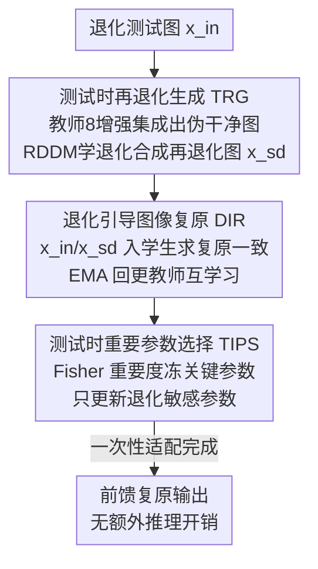

# Degradation-Consistent Test-Time Adaptation for All-in-One Image Restoration

**会议**: CVPR 2026  
**论文**: [CVF Open Access](https://openaccess.thecvf.com/content/CVPR2026/html/Tang_Degradation-Consistent_Test-Time_Adaptation_for_All-in-One_Image_Restoration_CVPR_2026_paper.html)  
**代码**: https://github.com/tonia86/DCTTA  
**领域**: 图像复原  
**关键词**: 测试时自适应, 全能图像复原, 退化一致性, 扩散退化生成, 源free域适应

## 一句话总结
针对全能图像复原（AiOIR）模型在测试退化分布偏离训练分布时性能骤降的问题，本文提出 DCTTA：在测试时用扩散退化生成器把"伪干净图→退化图"的过程学出来，构造"退化–再退化"自监督对，靠复原一致性在线微调模型，并只更新退化敏感参数以稳住预训练知识，在 Rain100H 上单数据集最高带来 +4.57 dB PSNR。

## 研究背景与动机
**领域现状**：全能图像复原（All-in-One Image Restoration, AiOIR）用一个统一模型同时处理去噪、去雾、去雨等多种退化，相比一退化一网络的传统做法更灵活、更通用，是近年 low-level vision 的热门方向。它分非盲（已知退化类型，显式注入先验）和盲（无先验，模型自己推断退化并复原）两类。

**现有痛点**：无论盲还是非盲，绝大多数 AiOIR 方法都隐含一个闭集假设——训练和测试的退化分布一致。一旦测试时遇到没见过的、或分布发生偏移的退化（如训练只见过 Rain100L 的小雨、测试遇到 Rain100H 的暴雨），性能会大幅跌落。论文用 t-SNE 证实：Rain100L / Rain100H / Rainstreak 虽然视觉相似，特征分布却差异明显，模型在偏移最重的 Rain100H 上掉点严重。

**核心矛盾**：要在测试阶段就地适配目标域，又拿不到源数据、不能重训，于是面临两个绕不开的难题。其一是缺可靠监督——图像复原是像素级回归任务，从无标签的退化图里很难造出准确的自监督信号；其二是会伤预训练能力——在线更新参数容易覆盖源域知识、引入伪影，导致适配不稳甚至越调越差。

**切入角度**：作者抓住一个朴素但有用的观察——同一场景的多个不同程度退化版本，理应映射到同一张干净图（clean consistency）。如果能在测试时人为造出"同场景、不同退化"的图像对，就能用它们复原结果应当一致这个约束，绕开真值标签搭出自监督信号。

**核心 idea**：用扩散模型当退化生成器，把"伪干净图→原退化图"的退化过程学出来、再生成一张再退化图，构成"退化–再退化"对；强制学生网络对这两者的复原输出一致来做无源域适配，同时只更新退化敏感参数、冻住对预训练知识最关键的参数来保稳。这是据作者所知第一个专为 AiOIR 设计的源free（source-free）测试时自适应框架。

## 方法详解

### 整体框架
DCTTA 建立在师生（teacher–student）架构上：预训练源域模型 $f_\xi$ 当教师，待适配的目标模型 $f_\theta$ 当学生（初始权重从教师拷贝）。给定一张测试退化图 $x_{in}$，整条管线分三步：① **测试时再退化生成（TRG）**先用教师产出伪干净标签，再训一个扩散退化生成器学会"干净→退化"的过程，进而合成再退化图 $x_{sd}$，于是有了"退化–再退化"对 $(x_{in}, x_{sd})$；② **退化引导图像复原（DIR）**把这对图都送进学生，用自监督一致性损失 + 适配一致性损失在线微调学生，并用 EMA 反过来更新教师做互学习；③ **测试时重要参数选择（TIPS）**在适配开始前一次性算出每个参数的重要度，冻住最关键的一批、只放开退化敏感的其余参数更新，防止灾难性遗忘。适配是针对目标测试域的一次性更新，调完后模型就是普通前馈推理，不带额外推理开销。

### 关键设计

**1. 测试时再退化生成（TRG）：没有真值，就把退化过程本身学出来造数据**

要做自监督，先得有"图像对"。TRG 的思路是用一张近似干净图反推退化、再正向生成一张新的退化图。具体两步：先用预训练 AiOIR 教师对 $x_{in}$ 做 8 种几何增强（随机 90° 旋转 + 翻转），各自复原后做逆变换再平均，得到更鲁棒的伪标签 $\bar y = \frac{1}{8}\sum_{i=1}^{8} R_i\big(f_\xi(A_i(x_{in}))\big)$，其中 $A_i$ 是第 $i$ 种增强、$R_i$ 是对应逆变换——多视角集成能压掉单次复原的随机误差。然后训一个扩散退化生成器去建模"从 $\bar y$ 到 $x_{in}$ 的分布差距"。作者借 RDDM（残差扩散）来做，优化目标 $L_{res}(\theta)=\mathbb{E}\big[\lVert I_{res}-I^\theta_{res}(z_t,t,\bar y)\rVert_2^2\big]$，其中残差 $I_{res}=\bar y - x_{in}$ 正是"干净减退化"，$z_t$ 是由 $\bar y$ 与 $x_{in}$ 合成的中间量。这样生成器学到的不是某种固定退化核，而是当前测试集真实的退化分布；训好后就能对 $\bar y$ 采样合成再退化图 $x_{sd}$。值得强调的是，扩散模型在这里只当"退化数据工厂"，推理阶段并不需要它——这和 TAO 那类推理时依赖扩散的方法本质不同。

**2. 退化引导图像复原（DIR）：用"同场景应复原成同一张干净图"当无标签监督**

有了 $(x_{in}, x_{sd})$ 这对同场景、不同退化的图，DIR 就把 clean consistency 落成损失。两张图都过学生得 $y_{in}=f_\theta(x_{in})$、$y_{sd}=f_\theta(x_{sd})$，既然源于同一场景，复原结果就该一致，于是自监督损失 = 像素一致性 $L^s_{cons}=\lVert y_{in}-y_{sd}\rVert_1$ 加 VGG 感知一致性 $L^s_{per}=\sum_l\lVert\phi_l(y_{in})-\phi_l(y_{sd})\rVert_2^2$，合成 $L_s=\lambda_{cons}L^s_{cons}+\lambda_{per}L^s_{per}$。光有自洽还不够，容易整体漂走，所以再加适配一致性损失把学生在再退化图上的输出 $y_{sd}$ 拉向教师给的伪标签 $\bar y$：$L_a=\lambda_{cos}L^a_{cons}(\bar y,y_{sd})+\lambda_{per}L^a_{per}(\bar y,y_{sd})$，形式同上但锚点换成 $\bar y$，相当于用教师的稳定预测当软约束防跑偏。总损失 $L=L_s(y_{in},y_{sd})+\alpha\cdot L_a(\bar y,y_{sd})$。

$$\xi = \eta\cdot\xi + (1-\eta)\cdot\theta$$

此外教师不是死的：每步用学生参数 $\theta$ 的指数滑动平均（EMA，$\eta=0.95$）更新教师 $\xi$，让伪标签随适配同步变准、师生互相带动。

**3. 测试时重要参数选择（TIPS）：只动退化敏感参数，冻住知识骨架防遗忘**

在线全参更新最危险——会把源域知识冲掉。TIPS 的判断是：测试样本退化变了，但任务还是同一个复原任务，所以承载"复原能力"的参数应当保留，只放开对退化敏感的那部分跟着目标域走。怎么区分？用 Fisher 信息矩阵的对角近似估每个参数的重要度。先定义增强一致性损失 $L_c(x_{in})=\sqrt{(y-f_\xi(x_{in}))^2+\epsilon}$，再把参数 $\theta_i$ 的重要度记为该损失对它的梯度平方、在测试集上平均：$\omega(\theta_i)=\frac{1}{|D|}\sum_{x_{in}\in D}\big(\frac{\partial L_c(x_{in})}{\partial\theta_i}\big)^2$。取重要度排前 $\rho$ 分位的参数集合 $S=\{\theta_i\mid\omega(\theta_i)>\tau_\rho\}$（默认 $\rho=0.4$）冻结、其余参数才参与适配更新。关键是这个选择在 TTA 开始前只算一次，在线阶段没有反复评估开销。消融里去掉 TIPS 让 PSNR 从 20.21 直接崩到 14.24，说明"该冻的冻住"是这套在线适配能稳住的命门。

### 损失函数 / 训练策略
总损失 $L=L_s+\alpha L_a$，超参经验取 $\lambda_{cons}=1$、$\lambda_{per}=0.01$、$\alpha=1$、EMA 衰减 $\eta=0.95$；RDDM 采样步数设为 5。优化用 Adam（学习率 $2\times10^{-4}$，$(\beta_1,\beta_2)=(0.9,0.999)$），batch size 为 1，单卡 RTX 3090。框架 backbone 无关，论文在 AirNet、PromptIR、DFPIR 上即插即用验证。

## 实验关键数据

### 主实验
三退化设置（去噪/去雾/去雨，PromptIR 配置），训练分布与测试分布故意错开（如训练 Rain100L、测试 Rain100H）。DCTTA 套到三种 backbone 上都在每个数据集取得最佳，PromptIR+DCTTA 平均最高：

| 方法 | Kodak24(去噪) PSNR | DenseHaze(去雾) PSNR | Rain100H(去雨) PSNR | 平均 PSNR | 平均 SSIM |
|------|------|------|------|------|------|
| AirNet | 25.57 | 10.90 | 14.62 | 16.95 | 0.606 |
| AirNet+DCTTA | 25.79 | 12.49 | 17.34 | **18.14** | **0.623** |
| PromptIR | 25.41 | 11.48 | 15.64 | 17.31 | 0.612 |
| PromptIR+DCTTA | 25.78 | 11.65 | **20.21** | **18.61** | **0.654** |
| DFPIR | 24.57 | 11.61 | 15.94 | 17.21 | 0.616 |
| DFPIR+DCTTA | 24.66 | 11.73 | 20.27 | **18.37** | **0.647** |

去雨提升最猛（PromptIR 上 +4.57 dB，15.64→20.21），因为雨纹是强空间结构退化、最受益于分布对齐；去噪/去雾退化空间均匀、统计同质，提升相对温和。五退化设置（再加去模糊、低光）结论一致：AirNet+DCTTA 在 Rain100H +4.47 dB、RealBlur-J +2.79 dB；DFPIR+DCTTA 把平均推到 23.61 dB / 0.802。混合退化（雨纹+雨滴）下 PromptIR+DCTTA 也比原模型 +0.21 dB / +0.020 SSIM，说明对复合退化同样有效。

### 消融实验
PromptIR 在 Rain100H 去雨上逐模块拆解（PSNR / SSIM）：

| 配置 | PSNR | SSIM | 说明 |
|------|------|------|------|
| Full (Ours) | 20.21 | 0.663 | 完整模型 |
| w/o TIPS | 14.24 | 0.487 | 不冻关键参数，崩塌最严重（-5.97 dB） |
| w/o DA | 19.57 | 0.606 | 去掉 8 增强伪标签 |
| w/o EMA | 19.87 | 0.609 | 教师不再 EMA 更新 |
| baseline PromptIR | 15.64 | 0.498 | 未适配 |

退化生成器对比（去雨）：CNN 生成器仅 17.43 dB / 0.532，换成 RDDM 扩散生成器升到 20.21 dB / 0.663——扩散更能抓住真实退化模式。损失消融（Table 6）显示自监督的像素一致性与感知损失对 PSNR 最关键（单去其一掉到 18.85/19.10 dB），适配一致性损失则主要保泛化与结果一致性。

### 关键发现
- **TIPS 是稳定性命门**：去掉它 PSNR 直接 -5.97 dB（20.21→14.24），印证"在线适配最大风险是冲掉源域知识"，靠 Fisher 重要度冻参数是有效解。
- **退化越有结构、增益越大**：去雨（强空间纹理）普遍 +2.7~4.5 dB，去噪/去雾（均匀同质）提升小，说明 DCTTA 的优势来自把"有结构的分布偏移"对齐回来。
- **扩散当退化工厂值回票价**：相比 CNN 生成器，RDDM 在去雨上 +2.78 dB；且扩散只在适配阶段用、推理阶段零额外开销。
- **效率换性能划算**：Rain100H 上一次性适配约 32.25s、显存升到 23.5G，但换来 +4.57 dB，且适配后推理时间与原模型同为 0.59s。

## 亮点与洞察
- **把"退化过程"而非"复原结果"当成要学的东西**：用扩散反向学退化、正向造再退化图，巧妙地把缺真值的复原任务转成有自监督信号的一致性学习——这是绕开像素级回归无标签难题的关键一招。
- **扩散模型当数据工厂而非推理引擎**：和 TAO 等推理时跑扩散的方法划清界限，扩散只在测试时适配阶段生成退化数据，推理阶段完全前馈、不背扩散的速度包袱，工程上更可落地。
- **Fisher 重要度 + 一次性选参**：把"哪些参数该冻"量化成可计算的重要度并只算一次，既稳住源知识又控住在线开销，这套思路可迁移到其他在线/持续学习的复原与分割任务。
- **backbone 无关、即插即用**：AirNet/PromptIR/DFPIR 一律涨点，证明它是一层通用的测试时适配壳，而非绑死某个架构。

## 局限与展望
- **适配代价不小**：一次性适配占 32.25s 且显存从 3.2G 飙到 23.5G（扩散生成 + 在线反传所致），对显存受限或要求即时响应的场景偏重。
- **依赖教师伪标签质量**：整条自监督链以教师在目标域的复原为锚，若教师在某退化上本就崩坏（如 DenseHaze 上 PSNR 仅 10~12 dB），DCTTA 的提升空间也被压低，实验里去雾增益确实最弱。⚠️ TIPS 中"冻重要参数、只更新其余退化敏感参数"与摘要"selectively updates degradation-sensitive parameters"措辞略有张力，以原文 Eq.(14) 为准（重要参数冻结）。
- **退化需可被扩散建模**：方法假设测试退化能被 RDDM 从"伪干净–退化"残差中学到，对极端复合/未知物理退化是否仍成立，论文只验到雨纹+雨滴的合成混合，更真实的多源退化有待检验。

## 相关工作与启发
- **vs TAO**: 二者都用扩散应对未知退化，但 TAO 推理时依赖扩散做梯度引导生成、做零样本复原；DCTTA 把扩散降级为测试时的退化生成器，靠退化一致性做域适配，推理不需要扩散，且 backbone 无关——更轻、更通用。
- **vs CoTTA / TSTTA 等高层视觉 TTA**: 它们面向分类/分割，用加权伪标签、随机参数恢复或熵正则稳定适配；DCTTA 针对像素级复原这一更难造监督的回归任务，改用"再退化生成 + 复原一致性"造自监督，并用 Fisher 选参替代随机恢复来保稳。
- **vs 常规 AiOIR（AirNet/PromptIR/DFPIR）**: 这些方法在闭集退化分布下训练，遇分布偏移即掉点；DCTTA 不改其训练、只在测试时加一层适配壳，把它们在 OOD 退化上的性能整体抬高一截。

## 评分
- 新颖性: ⭐⭐⭐⭐⭐ 首个专为 AiOIR 设计的源free测试时自适应框架，"扩散当退化工厂 + 复原一致性自监督"组合新颖
- 实验充分度: ⭐⭐⭐⭐ 三/五/混合退化 ×3 backbone，模块/生成器/损失消融齐全，但缺真实世界大规模复合退化验证
- 写作质量: ⭐⭐⭐⭐ 三组件分工清晰、公式完整，TIPS 选参与摘要措辞略有张力需对照原文
- 价值: ⭐⭐⭐⭐ 即插即用提升现有 AiOIR 模型 OOD 鲁棒性，去雨等结构退化增益显著，工程可落地

<!-- RELATED:START -->

## 相关论文

- [\[CVPR 2026\] Retrieve-to-Restore: Efficient All-in-One Image Restoration with a Retrieval-Based Degradation Bank](retrieve-to-restore_efficient_all-in-one_image_restoration_with_a_retrieval-base.md)
- [\[CVPR 2025\] Visual-Instructed Degradation Diffusion for All-in-One Image Restoration](../../CVPR2025/image_restoration/visual-instructed_degradation_diffusion_for_all-in-one_image_restoration.md)
- [\[CVPR 2026\] UniLDiff: Unlocking the Power of Diffusion Priors for All-in-One Image Restoration](unildiff_unlocking_the_power_of_diffusion_priors_for_all-in-one_image_restoratio.md)
- [\[CVPR 2026\] FAPE-IR: Frequency-Aware Planning and Execution Framework for All-in-One Image Restoration](fape-ir_frequency-aware_planning_and_execution_framework_for_all-in-one_image_re.md)
- [\[CVPR 2025\] Degradation-Aware Feature Perturbation for All-in-One Image Restoration](../../CVPR2025/image_restoration/degradation-aware_feature_perturbation_for_all-in-one_image_restoration.md)

<!-- RELATED:END -->
