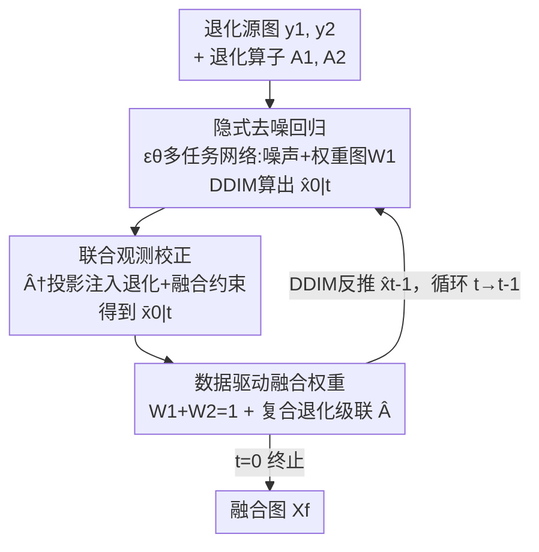

# Degradation-Robust Fusion: An Efficient Degradation-Aware Diffusion Framework for Multimodal Image Fusion in Arbitrary Degradation Scenarios

**会议**: CVPR 2026  
**论文**: [CVF Open Access](https://openaccess.thecvf.com/content/CVPR2026/html/Shi_Degradation-Robust_Fusion_An_Efficient_Degradation-Aware_Diffusion_Framework_for_Multimodal_Image_CVPR_2026_paper.html)  
**代码**: https://github.com/YShi-cool/DRFusion  
**领域**: 图像恢复 / 扩散模型 / 多模态图像融合  
**关键词**: 退化感知扩散、图像融合、联合观测约束、隐式去噪、红外可见光融合

## 一句话总结
针对真实场景里源图普遍带噪声/模糊/低分辨率的多模态图像融合，本文把扩散模型从"显式预测噪声"改成"直接回归融合图"，并在 DDIM 采样里插入一个把两路退化约束和融合约束写进同一块矩阵的"联合观测校正"步骤，从而在少数几步采样内同时完成复原与融合，在 M3FD 和 Harvard 数据集的多种退化场景下显著超过"先复原再融合"的级联方案。

## 研究背景与动机
**领域现状**：多模态图像融合（红外+可见光、PET+MRI 等）目前主流是两类做法。一类是端到端神经网络，从多源输入直接学一个到融合图的映射，设计简单、推理快；另一类是扩散模型，靠强生成先验和逐步细化的迭代过程，提供更好的可解释性和更高的融合精度。

**现有痛点**：绝大多数融合方法假设源图是高质量的，而真实成像里噪声、运动模糊、分辨率不足普遍存在。传统的"复原 + 融合"两段式范式让融合结果高度依赖复原质量，解耦设计还会带来跨阶段误差累积、部署复杂。端到端网络虽然能把复原和融合塞进一个 loss 联合优化，但黑盒、可解释性差、精度受 loss 设计强烈影响。

**核心矛盾**：扩散模型本来很适合融合（迭代聚合多模态信息的过程透明、稳定），但它有两个先天障碍直接卡死了在退化融合上的应用——其一，扩散模型训练需要拟合一个目标数据分布，而**图像融合根本没有天然的"融合真值"数据**；其二，标准扩散是单域分布建模，而融合要求显式建模来自多个源的互补信息，需要一种把跨模态信息、融合目标和概率模型连起来的新形式。现有扩散融合要么只处理特定退化，要么依赖独立预训练的复原模型，没有一个能灵活应对任意复合退化的统一框架。

**本文目标**：用一个统一过程同时建模"退化复原"和"多模态融合"，且要在少数扩散步内高效完成，不依赖外部复原模型、不需要融合真值。

**切入角度**：作者发现扩散模型真正不可或缺的是**逆过程（reverse process）的逐步细化**，而"显式预测噪声"只是为了拟合目标分布而存在的训练约束。如果把噪声预测去掉、让网络直接回归融合图，扩散就退化成一个"长得像端到端网络、但保留了迭代结构"的东西——既能像端到端那样自监督地处理无真值的融合，又保留了迭代采样可注入约束的口子。

**核心 idea**：**丢掉显式噪声预测、直接回归融合图（隐式去噪），并在每一步 DDIM 采样里用一个"联合观测模型"把两路源图的退化约束和融合约束一次性投影进去**，实现退化感知的复原-融合一体化。

## 方法详解

### 整体框架
整个方法是一个**带约束注入的加速扩散采样循环**：输入是两张退化源图 $y_1, y_2$ 及其退化算子 $A_1, A_2$，输出是一张干净的融合图 $X_f$。它不再像标准扩散那样训练一个噪声预测网络去逼近某个目标分布，而是只保留逆过程 $F_\theta = f_\theta^T \to f_\theta^{T-1} \to \cdots \to f_\theta^0$，在有限的扩散步数内把输入直接映射成融合输出。

每个扩散步 $f_\theta^t$ 做三件事：(1) 网络 $\varepsilon_\theta$ 给出当前估计，用 DDIM 公式算出对干净图的预测 $\hat{x}_{0|t}$；(2) **联合观测校正**：把 $\hat{x}_{0|t}$ 投影到"同时满足两路退化约束 + 融合约束"的解集上，得到校正后的 $\bar{x}_{0|t}$；(3) 用 DDIM 反推回 $\hat{x}_{t-1}$，进入下一步。这样退化约束在每一步都被强制满足，避免了"先复原再融合"的误差累积。

### 关键设计

**1. 隐式去噪：丢掉噪声预测，直接回归融合图**

这一步针对的是"扩散没有融合真值、且是单域分布"这个根本障碍。标准扩散先预训练一个噪声预测网络去估计任意时刻 $t$ 注入的噪声，前向加噪满足 $p(x_t|x_0) = \mathcal{N}(x_t; \sqrt{\bar{\alpha}_t}\,x_0, (1-\bar{\alpha}_t)I)$，其中 $\bar{\alpha}_t = \prod_{i=1}^{t}\alpha_i$、$\alpha_t = 1-\beta_t$。要准确估噪需要海量迭代且 $T$ 很大，还必须在训练时拿到干净目标分布——这正是融合任务给不出来的。

本文的做法是**保留逆过程、抛弃显式噪声预测**：每步仍用 DDIM 形式

$$\hat{x}_{0|t} = \hat{x}_t - \sqrt{1-\bar{\alpha}_t}\,\varepsilon_\theta(\hat{x}_t, t), \qquad \hat{x}_{t-1} = \sqrt{\bar{\alpha}_{t-1}}\,\hat{x}_{0|t} + \sqrt{1-\bar{\alpha}_{t-1}}\,\varepsilon_\theta(\hat{x}_t, t)$$

但网络不再被要求"算准噪声"，而是直接朝重建的源图/融合图回归，噪声被隐含在中间表示里。这样带来三个好处：输入到输出的直接映射让方法可以像端到端网络一样**自监督**地融合，绕开了融合标签的缺失；多源融合可以通过对融合输出施加各源的重建约束在单一框架内联合优化；既然不再显式预测噪声，就能配合 DDIM 这类加速采样器，在**很少的扩散步**内拿到高质量结果，推理效率大幅提升。这是它能"长得像扩散、跑得像端到端"的关键。

**2. 联合观测校正机制：把两路退化约束和融合约束写进同一块矩阵**

光有迭代采样还不够——DDIM 采样轨迹虽近乎确定，但底层模型学的仍是一个分布而非确定映射，中间结果未必满足真实的退化观测。本文在采样里插入一个投影校正。先看经典退化模型 $y = AX + n$（暂忽略噪声项 $n$），$A$ 是退化算子。已知上一步估计 $\hat{x}_{0|t}$ 未必满足 $y = AX$，于是求一个最接近它、又满足约束的解：

$$x^\star = \arg\min_z \|z - x_{0|t}\|^2 \quad \text{s.t.}\quad Az = y$$

几何上就是把 $x_{0|t}$ 投影到约束子空间，解为 $x^\star = x_{0|t} - A^\dagger(Ax_{0|t} - y)$，$A^\dagger$ 是 Moore–Penrose 伪逆，$A^\dagger(Ax-y)$ 是校正项。单图复原里这很直接，但融合有两个源、且融合图本身没有对应的退化观测，没法直接套。

本文的创新是构造一个**联合观测模型**：把两路源图和融合图写成联合变量 $[X_1, X_2, X_f]$，让两路退化约束 $y_1 = A_1 X_1$、$y_2 = A_2 X_2$ 和融合约束 $X_f = W_1 * X_1 + W_2 * X_2$ 并存。把融合约束里的 $X_f$ 移到左边，融合图原来的位置就被零矩阵替代——**这意味着不需要预先得到融合图的观测**：

$$\begin{bmatrix} y_1 \\ y_2 \\ 0 \end{bmatrix} = \begin{bmatrix} A_1 & 0 & 0 \\ 0 & A_2 & 0 \\ -W_1 & -W_2 & I \end{bmatrix} \begin{bmatrix} X_1 \\ X_2 \\ X_f \end{bmatrix}$$

这个块矩阵 $\hat{A}$ 的伪逆很难直接算（显式求伪逆开销和显存都吃不消）。作者用一个巧办法：把 $X_1, X_2$ 分别解出来再代入融合关系，**解析地拼出**满足 Moore–Penrose 条件的联合伪逆：

$$\hat{A}^\dagger = \begin{bmatrix} A_1^\dagger & 0 & 0 \\ 0 & A_2^\dagger & 0 \\ W_1 A_1^\dagger & W_2 A_2^\dagger & I \end{bmatrix}$$

把它代回投影公式，再嵌进 DDIM，就得到最终的三段式迭代：先 DDIM 估计 $\hat{x}_{0|t}$（式16），再联合观测校正 $\bar{x}_{0|t} = \hat{x}_{0|t} - \hat{A}^\dagger(\hat{A}\hat{x}_{0|t} - y)$（式17），最后 DDIM 反推 $\hat{x}_{t-1}$（式18）。这样**复原和融合在同一过程里同时被约束**，既绕开"先复原再融合"的误差累积，又不需要任何融合真值或外部复原模型。

**3. 数据驱动的融合权重 + 复合退化的可扩展性**

联合观测模型里的融合权重 $W_1, W_2$ 如果写死会限制效果，本文让它**数据驱动**：把噪声预测器设计成多任务架构，除了输出（隐式的）噪声估计，还额外输出一张权重图 $W_1$，再用 $W_1 + W_2 = 1$ 得到互补的两路权重，融进式（14）的伪逆里。

对更复杂的真实退化，框架也能优雅扩展。有噪声时只需把校正项乘一个尺度矩阵 $\Sigma_t$ 来抑制噪声影响：$\bar{x}_{0|t} = \hat{x}_{0|t} - \Sigma_t \hat{A}^\dagger(\hat{A}\hat{x}_{0|t} - y)$（式19）。当一张源图同时叠加噪声、模糊、低分辨率等多种退化 $A = A_1 A_2 \cdots A_n$ 时，其伪逆按 $A^\dagger = A_n^\dagger A_{n-1}^\dagger \cdots A_1^\dagger$ **级联**写出后直接代入即可——这让"复合退化"不需要为每种组合重新设计，只要把各退化算子的伪逆按序相乘，简洁又高效。

### 损失函数 / 训练策略
因为框架不再显式预测噪声、而是直接回归重建图，就能直接用融合领域常见的无监督损失。总损失 $L_{total} = L_{rec} + \lambda L_f$。重建损失约束两路源图的复原质量：$L_{rec} = \|X_1 - \bar{X}_1\|_1 + \|X_2 - \bar{X}_2\|_1$。融合损失按任务定制：红外-可见光用强度+梯度的最大值约束 $L_f = \|X_f - \max(\bar{X}_1, \bar{X}_2)\|_1 + \gamma\|\nabla X_f - \max(\nabla \bar{X}_1, \nabla \bar{X}_2)\|_1$；医学融合用 $L_f = \sum_{i=1}^{2}\|X_f - \bar{X}_i\|_1 + \phi(1 - \text{SSIM}(X_f, \bar{X}_i))$。训练用 Adam、batch 8、100 epochs、初始学习率 0.0001 多步衰减，$\lambda{=}10$、$\gamma{=}20$、$\phi{=}10$，双 RTX 4090。这种"按任务自由组合 loss"的能力，正是抛弃单一噪声预测目标后换来的灵活性。

## 实验关键数据

数据集为红外-可见光的 M3FD 和 Harvard 的 PET-MRI，三种退化场景：噪声、模糊、以及更难的复合退化（红外/PET 叠加噪声+模糊+低分辨率，可见光/MRI 叠加噪声+模糊）。对比方法包括 CNN 类（IFCNN、U2Fusion、MURF）和扩散类（DDFM、Text-DiFuse、VDMUFusion、RFfusion、Mask-DiFuser），它们都先用对应复原算法（去噪/去模糊/超分）恢复源图再融合，而本文直接从退化源图重建融合图。六个客观指标：$Q_{MI}$、$Q_{NCIE}$、$Q_{AB/F}$、$Q_P$、$Q_{CB}$、$Q_W$（越高越好）。

### 主实验（M3FD 红外-可见光，节选关键指标）

| 退化场景 | 方法 | $Q_{MI}$ | $Q_{AB/F}$ | $Q_P$ | $Q_W$ |
|----------|------|----------|------------|-------|-------|
| 噪声 | Mask-DiFuser | 0.2343 | 0.3343 | 0.2161 | 0.7271 |
| 噪声 | RFfusion | 0.3021 | 0.2831 | 0.1217 | 0.6959 |
| 噪声 | **Ours** | **0.3505** | **0.4083** | 0.1825 | **0.7810** |
| 模糊 | Mask-DiFuser | 0.2572 | 0.2114 | 0.0860 | 0.5403 |
| 模糊 | RFfusion | 0.3771 | 0.0972 | 0.0564 | 0.3884 |
| 模糊 | **Ours** | **0.4477** | **0.3698** | **0.1671** | **0.7233** |
| 复合退化 | Mask-DiFuser | 0.2492 | 0.1986 | 0.0611 | 0.5845 |
| 复合退化 | **Ours** | **0.3732** | **0.2199** | **0.0755** | **0.6237** |

在最难的模糊和复合退化场景里，本文在 $Q_{MI}/Q_{AB/F}/Q_P/Q_W$ 等多数指标上明显领先；模糊场景的 $Q_{AB/F}$ 从次优的 ~0.21 跃到 0.37，提升尤为突出。

### 主实验（Harvard PET-MRI，节选关键指标）

| 退化场景 | 方法 | $Q_{MI}$ | $Q_{AB/F}$ | $Q_P$ | $Q_W$ |
|----------|------|----------|------------|-------|-------|
| 噪声 | DDFM | 0.6025 | 0.3840 | 0.1908 | 0.7532 |
| 噪声 | **Ours** | **0.6171** | **0.4258** | **0.2436** | **0.7892** |
| 模糊 | Mask-DiFuser | 0.5998 | 0.2914 | 0.1621 | 0.6591 |
| 模糊 | **Ours** | 0.6469 | **0.3855** | **0.2016** | **0.7885** |
| 复合退化 | DDFM | 0.6353 | 0.1971 | 0.0715 | 0.6032 |
| 复合退化 | **Ours** | 0.6019 | **0.2956** | **0.1258** | **0.7344** |

医学融合上，本文在 $Q_{AB/F}/Q_P/Q_W$ 三项于所有退化场景均取得最高分；复合退化下 $Q_{AB/F}$、$Q_P$ 的优势尤其显著，说明它在保结构和保细节上更稳。

### 消融实验
作者对比了"有/无联合观测约束"两种配置（结果以柱状图 Fig.6 给出，⚠️ 原文未提供具体数值表）：

| 配置 | 效果 | 说明 |
|------|------|------|
| 完整模型（带联合约束） | 各指标整体最优 | 退化约束在每步被强制满足，复原-融合一体 |
| w/o 联合观测约束 | 多数指标明显下降 | 退化未被纠正，融合图残留模糊/伪影 |

去掉联合约束后，$Q_{MI}/Q_{NCIE}/Q_{AB/F}/Q_P/Q_{CB}/Q_W$ 在两个数据集、多种退化下普遍下滑，尤其在重建精度和细节保持上掉得最多——这印证了联合约束才是把"退化感知"真正注入采样的关键部件。

### 关键发现
- **联合观测校正是性能主力**：消融显示去掉它后多数指标明显下降，且越难的退化（复合）越依赖它，说明性能不是来自更强的网络，而是来自把退化约束嵌进采样的机制。
- **效率介于两类方法之间**：本文比 DDFM/Text-DiFuse/VDMUFusion 等传统扩散显著更快（受益于少步采样+隐式去噪），虽仍慢于纯 CNN，但在质量-速度上取得有竞争力的折中，且参数量不大。
- **复合退化下优势最大**：当源图同时叠加噪声+模糊+低分辨率时，级联伪逆 $A^\dagger = A_n^\dagger \cdots A_1^\dagger$ 仍能整体复原，而"先复原再融合"的级联方案误差累积、残留伪影最明显。

## 亮点与洞察
- **把"显式噪声预测"识别为可去掉的训练约束**：作者看穿扩散真正不可替代的是迭代逆过程而非噪声预测，于是改成直接回归融合图——这一刀让扩散同时获得"端到端的自监督性"和"迭代可注入约束"两个优点，是很漂亮的范式重构。
- **零矩阵技巧绕开"融合无真值"**：把 $X_f$ 移到约束左边、原位置填零矩阵，使联合观测模型不需要任何融合观测就能成立，干净利落地解决了扩散融合最棘手的"没有融合真值"问题。
- **解析拼出块矩阵伪逆**：不去硬算 $\hat{A}^\dagger$，而是分别解子问题再拼成满足 Moore–Penrose 条件的形式，把不可行的伪逆计算变成可代入的闭式——这个 trick 可迁移到任何带块结构退化算子的逆问题求解。
- **级联伪逆处理复合退化**：复合退化只需把各退化算子伪逆按序相乘，无需为每种组合重训，工程上极实用。

## 局限与展望
- 作者承认本方法仍慢于纯 CNN 融合，只是相对传统扩散大幅提速；对实时性要求极高的场景未必够用。
- ⚠️ 消融只对比了"有/无联合约束"且仅以柱状图呈现，未给数值表，也未单独消融"隐式去噪 vs 显式噪声预测""数据驱动权重 vs 固定权重"等子组件，难以量化各部件的独立贡献。
- 退化算子 $A_1, A_2$ 需已知或可建模（去噪/去模糊/超分的算子形式），对**未知或非线性退化**（如真实相机复杂 ISP、压缩伪影）能否仍解析地拼伪逆，原文未充分讨论。
- 联合观测模型假设融合是 $X_f = W_1 X_1 + W_2 X_2$ 的线性加权组合，对需要非线性融合（如某些跨模态语义融合）的任务可能受限。

## 相关工作与启发
- **vs DDFM / RFfusion / Mask-DiFuser（扩散类融合）**：它们仍受限于标准扩散框架（依赖目标分布、或靠伪标签/专用解码器），且通常要先复原再融合；本文直接回归融合图 + 联合观测校正，把复原与融合统一进一个采样过程，复合退化下优势最明显。
- **vs DDNM（复原向扩散）**：DDNM 用基于伪逆的一致性步把单图退化模型嵌进每步去噪；本文把这一思路从单图扩展到**多源 + 融合约束**的联合块矩阵，并给出可解析拼接的联合伪逆，是对 DDNM 在融合场景的本质推广。
- **vs 端到端 CNN 融合（IFCNN/U2Fusion/MURF）**：CNN 方法快但黑盒、精度受 loss 设计强烈影响；本文保留了扩散的迭代可解释性和可注入约束，又借隐式去噪拿回端到端的自监督性，在退化场景质量更高。

## 评分
- 新颖性: ⭐⭐⭐⭐⭐ "去噪声预测+直接回归融合图"与"零矩阵联合观测模型+解析联合伪逆"两点都很巧，是对扩散融合范式的实质重构
- 实验充分度: ⭐⭐⭐⭐ 两数据集×三退化×八对比方法×六指标覆盖充分，但消融偏弱（仅图、缺子组件拆解）
- 写作质量: ⭐⭐⭐⭐ 动机推导清晰、公式链条完整；个别公式（式22重复、$L_{rec}$定义）排版有小瑕疵
- 价值: ⭐⭐⭐⭐ 复原-融合一体化、不需融合真值、复合退化可扩展，对真实退化场景的多模态融合实用价值高

<!-- RELATED:START -->

## 相关论文

- [\[CVPR 2026\] DRFusion: Degradation-Robust Fusion via Degradation-Aware Diffusion Framework](drfusion_degradation_robust_fusion_via_degradation_aware_diffusion_framework.md)
- [\[CVPR 2026\] MMDIR: Multimodal Instruction-Driven Framework for Mixed-Degradation Document Image Restoration](mmdir_multimodal_instruction-driven_framework_for_mixed-degradation_document_ima.md)
- [\[CVPR 2026\] Customized Fusion: A Closed-Loop Dynamic Network for Adaptive Multi-Task-Aware Infrared-Visible Image Fusion](customized_fusion_a_closed-loop_dynamic_network_for_adaptive_multi-task-aware_in.md)
- [\[CVPR 2026\] EMR-Diff: Edge-aware Multimodal Residual Diffusion Model for Hyperspectral Image Super-resolution](emr-diff_edge-aware_multimodal_residual_diffusion_model_for_hyperspectral_image_.md)
- [\[CVPR 2026\] Bridging Human Evaluation to Infrared and Visible Image Fusion](bridging_human_evaluation_to_infrared_and_visible_image_fusion.md)

<!-- RELATED:END -->
