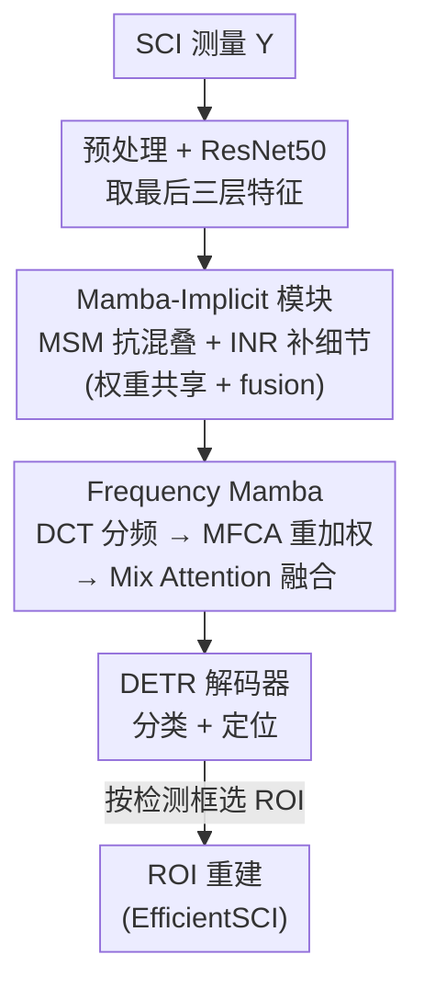

# DetectSCI: Toward Object-Guided ROI Reconstruction for High-Resolution Video Snapshot Compressive Imaging

**会议**: CVPR 2026  
**论文**: [CVF Open Access](https://openaccess.thecvf.com/content/CVPR2026/html/Jiang_DetectSCI_Toward_Object-Guided_ROI_Reconstruction_for_High-Resolution_Video_Snapshot_Compressive_CVPR_2026_paper.html)  
**代码**: 暂未开源（论文称 Code will be released）  
**领域**: 图像恢复 / 视频快照压缩成像  
**关键词**: 快照压缩成像, ROI重建, 目标检测, Mamba, 频域注意力

## 一句话总结
针对高分辨率视频快照压缩成像（SCI）"全帧重建太耗显存、背景占大头却没信息"的痛点，DetectSCI 提出**直接在编码测量上做目标检测**、再按检测框只重建感兴趣区域（ROI）的工作流，其检测器用权重共享的 Mamba-Implicit 模块抗时空混叠、用 Frequency Mamba 找回被压制的高频细节，在 SportsMOT 改造的 SCI 数据集上拿到 80.9 AP，超过最好的 CNN 检测器 ≥2.8 AP、最好的 Transformer 检测器 ≥4.1 AP。

## 研究背景与动机
**领域现状**：视频快照压缩成像（SCI）是高速相机的低成本替代方案——CACTI 系统用一组随机掩膜对连续 $B$ 帧做光学调制，再由一台低速 2D 相机把它们积分成**一张** 2D 测量。要看回高速视频，就得跑重建算法把这张测量解码回 $B$ 帧。

**现有痛点**：随着帧分辨率升高，重建整段视频在算力和显存上都极其昂贵，作者在 Figure 1 里直接标注全帧重建会 OOM（Out Of Memory）。更尴尬的是，大量算力浪费在恢复**信息量极低的背景**上：在体育场景里运动员才是主体，却只占很小一块像素，剩下的看台、球场全是无用功。

**核心矛盾**：重建是"逐像素无差别恢复"，而场景的"信息密度"是高度不均匀的——计算预算被均摊到了不该花钱的地方。一个自然的想法是"只重建重要区域"，但要做到这点，必须先知道哪里重要，也就是要在 SCI 测量上做目标检测。

**本文目标**：(1) 让检测器能直接吃 SCI 测量、准确定位目标；(2) 基于检测框做用户可选的 ROI 重建，把算力只花在主体上。

**切入角度**：难点在于"直接在测量上检测"几乎不可行。常规 CNN 假设相邻像素局部平稳，但掩膜调制会把**同一空间位置、不同时刻**的像素融合进一个测量像素里；目标一旦运动，某帧属于目标的像素在下一帧可能属于背景，这些语义相异的像素被编码曝光强行混在一起，造成严重的**时空混叠**，目标与背景的对比度被大幅削弱。作者进一步指出这种退化是**频率偏置**的：静态区的低频分量相互加强，运动目标的高频细节因时间错位而部分相消——编码曝光相当于一个**时间低通滤波器**，专门压制轮廓、边界这些对定位最关键的高频结构。

**核心 idea**：与其先重建再检测，不如**先在测量上检测、再按需重建 ROI**；而要让检测在混叠的测量上站得住，就用 Mamba-Implicit 编码器抗空间退化、用 Frequency Mamba 把被低通掉的高频找回来。

## 方法详解

### 整体框架
DetectSCI 的检测器是一个端到端的 encoder–decoder（DETR 风格）。输入是单张 SCI 测量 $Y$，输出是目标框，随后用现成重建器（论文用 EfficientSCI）只对选中的框做 ROI 重建。中间流程是：**预处理归一化 → ResNet-50 抽多尺度特征 → 由权重共享 Mamba-Implicit 模块（MIM）+ fusion 块组成的编码器逐级精炼特征 → Frequency Mamba（FM）做频率感知的 query 选择 → DETR 解码器出分类与定位**。两个真正的创新点是 MIM（对抗时空混叠造成的空间特征退化）和 FM（对抗频率偏置造成的高频丢失），其余都是标准脚手架。

CACTI 的成像模型给整套方法定了基调。原始灰度视频 $\{X_t\}_{t=1}^B$ 被掩膜 $\{M_t\}_{t=1}^B$ 调制后积分成测量：

$$Y = \sum_{t=1}^{B} X_t \odot M_t + G$$

其中 $\odot$ 是逐元素乘、$G$ 是噪声。向量化后记 $y=\mathrm{vec}(Y)$，把每个掩膜写成对角矩阵 $D_t=\mathrm{Diag}(\mathrm{vec}(M_t))$ 并拼成感知矩阵 $H=[D_1,\dots,D_B]$，于是 $y = Hx + g$。这个"多帧塞进一张图"的求和正是时空混叠的根源，也是后面两个模块要补救的对象。预处理则做一次掩膜归一化得到增强图 $\overline{Y} = Y \oslash \sum_{t=1}^{B} M_t$（$\oslash$ 为逐元素除），缓解掩膜调制带来的强度不均，再喂给 ResNet-50。

### 关键设计

**1. Mamba-Implicit 模块（MIM）：用多尺度 Mamba + 隐式表示对抗时空混叠**

MIM 是编码器的核心单元，专门解决"测量像素混叠导致空间特征退化、目标边界模糊"的痛点。它由两块串联组成。前半是 **Multi-Scale Spatial Mamba（MSM）**：对每层 backbone 特征 $\hat{S}_i$ 先做一段 PWConv-GeLU-PWConv（PGP），再并联三个不同膨胀率的深度可分离膨胀卷积（$\mathrm{DWD}_7/\mathrm{DWD}_{13}/\mathrm{DWD}_{19}$）拼接，得到 $Z_2 = \mathrm{Concat}[\mathrm{DWD}_7(Z_1),\mathrm{DWD}_{13}(Z_1),\mathrm{DWD}_{19}(Z_1)]$，再过一段 PGP。动机很具体：单一尺度的特征不足以抹平 SCI 的层内退化，而逐级增大的感受野能让网络在同一特征阶段感知不同大小的目标。之后用 **2D Selective Scan（SS2D）** 沿四个空间方向做双向状态扫描，以线性复杂度替代 Transformer 的二次注意力做全局上下文传播；最后接一个 depth-wise FFN（双 DW 卷积 + 通道注意力门控）重加权通道，公式为 $Z_i = S_i + (Z_6 \odot Z_7)$，$Z_7=\sigma(\mathrm{PWConv}(Z_6))$，把残差与门控融合输出。

后半是 **隐式神经表示（INR）块**：MSM 之后特征仍是离散网格，难以表达被混叠抹掉的亚像素细节。INR 把特征当作"坐标→值"的连续场来重建。它先做潜在投影 $Z_8 = \mathrm{SiLU}(\mathrm{BN}(\mathrm{PWConv}(Z_i)))$，对每个特征点的 2D 坐标 $(x,y)\in[-1,1]^2$ 用傅里叶基编码出多频位置线索 $\Phi(x,y) = [\sin(\omega_1 x),\dots,\cos(\omega_m y)]$，其中频率 $\omega_j = T^{-\frac{j-1}{m-1}}$ 由温度 $T$ 控制（实现取 $m=64,\,T=10000$）。把 $\Phi$ 与展平的 $Z_8$ 拼接成 $\hat{E}_i$，再用一个轻量 MLP 学到连续映射 $f=\mathrm{MLP}(\hat{E}_i)$ 并 reshape 回 $E_i$。连续函数表示突破了离散网格的限制、重新引入亚像素变化，从而填补"压缩测量"与"底层连续场景"之间的特征鸿沟。值得注意的是 MIM 在多层之间**权重共享**（见消融，这是精度/效率的折中），多个 $E_i$ 最后经 fusion 块合并为 $E$。

**2. Frequency Mamba（FM）：用频域分解 + 重加权找回被低通掉的高频细节**

FM 针对的痛点是 SCI 的频率偏置——编码曝光像时间低通滤波器，把运动相关的高频（轮廓、边界）选择性压掉。FM 在 query 选择前对编码特征做频域"纠偏"，分三步。第一步 **Multi-Frequency Channel Attention（MFCA）**：用离散余弦变换把特征投到三组频带 $\{F_1,F_2,F_3\}=\mathrm{DCT}(E)$（低/中/高频），再用 **Tri-Pooling Unit（TPU）** 把三个频带的全局平均、最大、最小池化结果分别相加再汇总：$F = F_\mathrm{avg}+F_\mathrm{max}+F_\mathrm{min}$，其中每一项都跨三个频带求和聚合互补信息。聚合后过 PWConv+Sigmoid 生成通道重加权系数去调制原特征 $O_1 = \sigma(\mathrm{PWConv}(F)) \otimes E$——这一步自适应谱滤波专门抬高被压制的高频、同时保住低频的结构稳定性。

但 MFCA 只在通道内独立操作、缺少跨通道全局交互，于是第二步再用 **SS2D** 做通道维全局建模 $O_2=\mathrm{SS2D}(\mathrm{BN}(O_1))$，扫描合并块里的可学习转移矩阵沿通道混合激活，既做通道上下文对齐、又充当 MFCA 与下游之间的"全局频率信息载体"。第三步 **Mix Attention** 用双分支做非线性增强：Spatial Attention（SA）分支用 PGP 生成空间重加权掩膜 $O_\mathrm{SA}=O_3 \otimes \sigma(\hat{O}_\mathrm{SA})$ 提取位置相关特征；Frequency-Gated Attention（FGA）分支用一条门控路 $O_\mathrm{G}=\sigma(\mathrm{PWConv}(G_\mathrm{avg}(O_3)))$ 抑制噪声激活、一条 $O_\mathrm{A}=\mathrm{DW3}(\mathrm{PWConv}(O_3))$ 提取频率增强线索，相乘得 $O_\mathrm{FGA}=O_\mathrm{G}\otimes O_\mathrm{A}$。两分支拼接后再过 PGP 降维并与 $O_2$ 残差相加。作者用散点图（Figure 3）验证：用 FM 训练的特征在 IoU 与分类分都 >0.5 的高质量区域比不用 FM 密集 **92.7%**，说明 FM 确实选出了更可判别、定位更准的 query。

### 损失函数 / 训练策略
检测头沿用 DETR 风格的集合预测，初始 object query 数固定 300。所有检测器统一在 4 张 RTX 4090 上训练，带 per-epoch 验证和 patience=20 的早停。Transformer 系（含本文）用 AdamW，base lr=1e-4、backbone lr=1e-5、weight decay=5e-5，输入分辨率 (720,1280)，共享 ImageNet 预训练的 ResNet-50；CNN 系（YOLO）输入 (720,720)。INR 取 $m=64,\,T=10000$。

## 实验关键数据

数据集是作者基于 SportsMOT（240 段篮球/足球/排球视频，平均 485 帧、720p）用 CACTI 系统按压缩比 8 自建的 SCI 检测集：把同一 person ID 在连续 8 帧的框做时间并集（$\{x,y\}$ 取最小、$\{w,h\}$ 取最大）得到包络框、过滤掉非 person 或可见度 <0.25 的实例、转成 COCO 格式按 7:1.5:1.5 划分。

### 主实验
所有 Transformer 检测器统一用 ResNet-50 backbone、同训练设置公平对比（节选最强对手）：

| 类别 | 模型 | AP | AP50 | AP75 | GFLOPs | Params(M) |
|------|------|----|------|------|--------|-----------|
| CNN | YOLOv10-X（最佳权衡） | 78.1 | 94.3 | 87.5 | 196.4 | 51.7 |
| CNN | YOLOv8-X | 77.9 | 94.9 | 87.3 | 296.4 | 68.2 |
| Transformer | DINO | 72.6 | 95.9 | 83.2 | 313.2 | 46.7 |
| Transformer | RT-DETR（baseline） | 76.8 | 95.0 | 86.9 | 266.3 | 50.3 |
| Transformer | MS-DETR（最强对手） | 75.8 | 92.6 | 87.3 | 321.8 | 53.7 |
| **本文** | **DetectSCI** | **80.9** | **98.5** | **93.1** | 268.1 | 53.1 |

DetectSCI 以 80.9 AP 领先：超 YOLOv10-X 约 +2.8、超最强 Transformer MS-DETR +5.1、超 baseline RT-DETR +4.1；在更严的定位阈值上优势更明显（AP75 达 93.1，比 YOLOv10-X 高约 6.4%）。效率上 268.1 GFLOPs / 53.1M 参数，比 YOLOv12-X 轻 10%、比 YOLOv8-X 少 22% 参数；相对 RT-DETR 反而少 4.2M 参数、GFLOPs 仅高 0.7%。

### 消融实验
MIM 各组件（baseline 为 RT-DETR 76.8 AP）：

| 变体 | 设置 | AP | GFLOPs | Params(M) | 说明 |
|------|------|----|--------|-----------|------|
| A1 | 仅 INR | 79.5 | 192.0 | 51.2 | 单用 INR 已 +2.7 |
| A2 | 仅 MSM | 79.6 | 263.9 | 60.4 | 单用 MSM +2.8，复杂度主要来自它 |
| A3 | 单尺度 MIM | 79.9 | 257.8 | 52.6 | INR+单尺度 MSM 互补 |
| A4 | 独立多尺度 MIM | **82.5** | 268.1 | 61.2 | 精度最高但参数最大 |
| A5 | 权重共享 MIM（本文） | 80.9 | 268.1 | 53.1 | 80.9 vs 82.5 但省 8.1M 参数 |

FM 各频带（B1 为去掉 FM）：

| 变体 | 设置 | AP | 说明 |
|------|------|----|------|
| B1 | No FM | 78.4 | 基准 |
| B2 | 仅低频 | 78.8 | +0.4，低频贡献最小 |
| B3 | 仅中频 | 79.6 | +1.2 |
| B4 | 仅高频 | 80.1 | +1.7，单频带最佳 |
| B5 | FM（TPU 融合三频） | **80.9** | 比单高频再 +0.8，三频互补 |

### 关键发现
- **MSM 与 INR 各自独立有效、且互补**：A1/A2 单用任一都 +约3 AP，A3–A5 显示组合后更强；MSM 贡献了大部分算力开销，所以才设计权重共享。
- **权重共享是精度/效率的工程取舍**：独立多尺度（A4）能到 82.5 AP，但权重共享（A5）只掉 1.6 AP 却省下 8.1M 参数（61.2M→53.1M），作者选了后者。
- **频率证据支持 SCI"高频被低通"的判断**：高频单频带（B4 +1.7）远比低频（B2 +0.4）有用，与"编码曝光压制高频"的分析一致；TPU 三频融合再 +0.8 说明频带互补。
- **检测质量直接转化为定位收益**：AP75 的领先（93.1）比 AP50 更突出，说明 FM 选出的高质量 query 主要改善了**精定位**。

## 亮点与洞察
- **"先检测后重建"是范式级的重排**：把 SCI 从"无差别全帧重建"改成"任务驱动的 ROI 重建"，让算力跟着信息密度走。这个 detection→reconstruction 的解耦思路可迁移到任何"重建昂贵但只关心局部"的成像任务（医学动态成像、遥感等）。
- **直面 SCI 的两类退化、对症下药**：空间混叠用 MIM（多尺度感受野 + INR 连续场补亚像素），频率偏置用 FM（DCT 分频 + 自适应重加权），两个模块各打一个病灶，而不是堆一个大网络硬抗。
- **INR 用作"特征去网格化"很巧**：把离散特征当连续场重采样来补回被混叠抹掉的亚像素细节，是把 NeRF/VideoINR 那套坐标-MLP 思想迁到检测特征增强上的一个可复用 trick。
- **散点图量化 query 质量**：用 IoU×分类分双高占比（+92.7%）直接证明"FM 让被选 query 更可判别"，比单看 AP 更能说明模块到底改了什么。

## 局限与展望
- **ROI 重建器是外接的、非端到端**：检测与重建解耦，重建直接用现成 EfficientSCI，全流程"端到端联合优化检测+重建"留给未来；检测误检/漏检会直接传导到重建结果（作者未量化这部分误差传播）。
- **数据集和类别单一**：仅在自建的 SportsMOT-SCI（压缩比 8、只保留 person 类、720p 体育场景）上验证，真实 CACTI 硬件采集、其他场景/类别/压缩比下的泛化未知。⚠️ 文中 MSM 缩写在不同位置出现 Multi-Scale Spatial Mamba 与 Mamba-Implicit 的混用（如 3.1 节写 "weight-sharing Mamba-Implicit Modules (MSM)"），以原文 Figure 2 与 3.3 节定义为准。
- **效率收益的"账"算在 ROI 重建侧**：主表里检测器本身 GFLOPs 并不比对手低多少，真正省显存/算力的是"只重建 ROI 不重建全帧"，论文用 Figure 1/4 定性展示但缺少 ROI vs 全帧重建的端到端显存/时间定量对比。
- **改进思路**：把检测置信度作为重建预算分配信号（高置信框给更多算力）、或让检测与重建共享 backbone 做联合训练，可能进一步省算力并减少误差传播。

## 相关工作与启发
- **vs YOLO 系（YOLOv8–v12）**：YOLO 是纯卷积/局部建模一阶段检测器，依赖高质量空间特征，在 SCI 的像素对比度被削弱时定位不稳；本文用 Mamba 的全局扫描 + INR 补细节，在 AP75 上明显拉开（93.1 vs YOLOv10-X 的 87.5）。
- **vs DETR 系（RT-DETR/MS-DETR/DINO 等）**：同为 DETR 风格集合预测，但它们直接吃 backbone 特征、没针对 SCI 的混叠与频率偏置做处理；本文在编码器与 query 选择之间插入 MIM 和 FM 两个 SCI 专用模块，在相同 backbone 与训练设置下 +4.1～+5.1 AP。
- **vs 传统 SCI 重建（如 EfficientSCI 等全帧重建器）**：传统方法目标是"把整段视频解码回来"，本文把它降级为"只在 ROI 上调用"的下游工具，转而先在测量上做检测，把问题从"重建全部"变成"重建该重建的"。

## 评分
- 新颖性: ⭐⭐⭐⭐⭐ 首个"直接在 SCI 测量上检测、再做 ROI 重建"的框架，范式重排有想象空间。
- 实验充分度: ⭐⭐⭐⭐ 与 CNN/Transformer 两大系对比充分、MIM/FM 双消融到位，但缺 ROI vs 全帧重建的端到端显存/时间定量对比、数据集单一。
- 写作质量: ⭐⭐⭐⭐ 动机与频率分析清晰，但缩写（MSM/MIM）有混用、部分公式排版需对照图理解。
- 价值: ⭐⭐⭐⭐ 把感知与重建耦合、面向资源受限的智能快照成像，思路对高分辨率 SCI 落地有实际意义。

<!-- RELATED:START -->

## 相关论文

- [\[ICML 2026\] Phy-CoSF: Physics-Guided Continuous Spectral Fields Reconstruction and Super-Resolution for Snapshot Compressive Imaging](../../ICML2026/image_restoration/phy-cosf_physics-guided_continuous_spectral_fields_reconstruction_and_super-reso.md)
- [\[CVPR 2026\] Statistical Characteristic-Guided Denoising for Rapid High-Resolution Transmission Electron Microscopy Imaging](statistical_characteristic-guided_denoising_for_rapid_high-resolution_transmissi.md)
- [\[CVPR 2026\] Multi-Scale Gradient-Guided Unrolling Architecture with Adaptive Mamba for Compressive Sensing](multi-scale_gradient-guided_unrolling_architecture_with_adaptive_mamba_for_compr.md)
- [\[CVPR 2026\] AE2VID: Event-based Video Reconstruction via Aperture Modulation](ae2vid_event-based_video_reconstruction_via_aperture_modulation.md)
- [\[CVPR 2026\] STCDiT: Spatio-Temporally Consistent Diffusion Transformer for High-Quality Video Super-Resolution](stcdit_spatio-temporally_consistent_diffusion_transformer_for_high-quality_video.md)

<!-- RELATED:END -->
