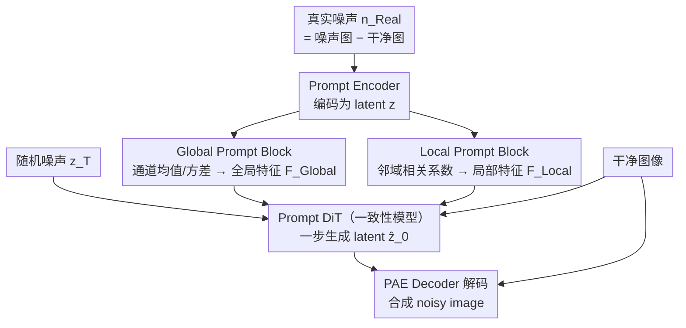

# PNG: Diffusion-Based sRGB Real Noise Generation via Prompt-Driven Noise Representation Learning

**会议**: CVPR 2026  
**arXiv**: [2603.04870](https://arxiv.org/abs/2603.04870)  
**代码**: 无  
**领域**: 图像去噪 / 噪声生成  
**关键词**: sRGB噪声生成, prompt学习, 一致性模型, 去噪, metadata-free

## 一句话总结

PNG提出用可学习的Global/Local Prompt组件从真实噪声中自动提取噪声特征（替代ISO/相机型号等metadata），通过Prompt AutoEncoder编码噪声到latent空间+Prompt DiT（基于一致性模型）一步生成latent code，实现无需任何metadata的真实sRGB噪声合成，下游DnCNN去噪在SIDD上仅落后真实数据0.08dB。

## 研究背景与动机

**领域现状**：sRGB域去噪是低层视觉的核心问题。主流监督学习方法依赖大量noisy-clean图像对训练，但真实配对数据的采集极其昂贵（需多帧平均或特殊硬件），限制了实际应用。因此，**噪声生成（noise synthesis）** 方法兴起——用生成模型合成逼真噪声图像，扩充训练数据。

**现有痛点**：当前噪声生成方法（NoiseFlow、Flow-sRGB、NeCA-W等）在训练和测试时都依赖相机metadata（如ISO值、传感器型号、快门速度等）作为条件。但在真实场景中：（a）网上公开的sRGB图像通常经过后处理，EXIF标签丢失；（b）科学成像等领域的metadata格式不统一或缺失；（c）不同设备之间metadata语义不一致。这限制了方法的通用性。

**核心矛盾**：metadata本质上是噪声分布的一种紧凑描述（ISO→增益→噪声强度，相机型号→ISP管线→噪声空间相关性）。问题是：能否直接从噪声图像本身学习出这种描述，而不依赖外部metadata？

**本文目标** （a）消除训练和测试阶段对metadata的依赖；（b）从有限的噪声样本中学习到能替代metadata的高维特征表示；（c）生成的噪声足够逼真，使下游去噪器性能接近甚至超过用真实数据训练的结果。

**切入角度**：借鉴NLP/视觉中prompt learning的思想——用可学习的prompt组件作为"噪声特征的隐式编码器"，从输入噪声的统计特性（通道均值/方差对应ISO、局部相关系数对应传感器特性）中自动提取prompt features，代替显式metadata。

**核心 idea**：用学习的Global Prompt（捕获ISO相关的全局噪声统计）和Local Prompt（捕获ISP管线引入的局部空间相关性）替代metadata，驱动基于一致性模型的扩散式噪声生成框架。

## 方法详解

### 整体框架

PNG由两个核心组件组成，分两阶段训练：

**第一阶段：Prompt AutoEncoder (PAE)**。输入真实噪声 $\mathbf{n}_{Real} = \mathcal{I}_{Noisy} - \mathcal{I}_{Clean}$。Prompt Encoder $\mathcal{E}$ 将噪声编码为latent code $\mathbf{z}$，同时通过Global Prompt Block和Local Prompt Block生成prompt features $\mathbf{F}_{Global}$, $\mathbf{F}_{Local}$。Decoder $\mathcal{D}$ 以 $\mathbf{z}$ 和clean image $\mathcal{I}_{Clean}$ 为条件重建noisy image $\hat{\mathcal{I}}_{Noisy}$（学习信号依赖特性）。用 $\mathcal{L}_1$ 重建损失 + $\mathcal{L}_2$ latent正则训练。

**第二阶段：Prompt DiT (P-DiT)**。在PAE的latent空间上训练一致性模型（CM）。P-DiT以prompt features和clean image为条件，将随机噪声 $\mathbf{z}_T$ 一步映射为latent code $\hat{\mathbf{z}}_0$，再由PAE Decoder解码为noisy image。

**推理**：给定少量真实噪声 $\mathbf{n}_{Real}$ → Prompt Encoder提取prompt features → P-DiT一步生成新latent code → Decoder+clean image → 合成noisy image。

### 关键设计

**1. Global Prompt Block：用通道统计量隐式编码 ISO 增益**

Metadata 里 ISO 之所以有用，是因为它决定传感器增益、进而决定噪声整体强度——而噪声强度恰好写在通道的均值和方差里。GPB 顺着这条线索，不去读 ISO 数值，而是直接从输入特征 $\mathbf{F}_{In}^\ell$ 算出通道均值 $\mu$ 和标准差 $\Sigma$ 来反映全局噪声水平，用它们经 $1\times1$ 卷积加 softmax 生成一组调制系数 $\mathbf{w}_{Global}^\ell = \text{Softmax}(\text{Conv}_{1\times1}[\mu(\mathbf{F}_{In}^\ell), \Sigma(\mathbf{F}_{In}^\ell)])$，再去加权一个可学习的 prompt 组件 $\mathbf{P}_{Global}^{\ell} \in \mathbb{R}^{\frac{H}{2^\ell} \times \frac{W}{2^\ell} \times C_{Global}^\ell}$，最后过 $3\times3$ 卷积输出 $\mathbf{F}_{Global}^\ell = \text{Conv}_{3\times3}(\mathbf{w}_{Global}^\ell \odot \mathbf{P}_{Global}^\ell)$。这样可学习参数负责"全局噪声大概长什么样"的先验，而当前样本的统计量负责"这次具体多强"，两者相乘就得到了一份不依赖 ISO 数值、却携带等价信息的全局噪声描述。

**2. Local Prompt Block：用邻域相关系数捕获相机指纹**

真实 sRGB 噪声并非逐像素独立——ISP 管线里的去马赛克、非线性映射、空间自适应处理都会让相邻像素的噪声相互关联，而这种局部相关模式正是区分不同相机型号的"指纹"，纯靠全局统计量根本看不到。LPB 于是在每个像素位置取一个 $\rho\times\rho$ 邻域，计算邻域像素与中心像素的 Pearson 相关系数，堆成相关系数图 $\mathbf{F}_\rho \in \mathbb{R}^{H \times W \times \rho^2}$；再分别沿行、列取均值（ISP 的非线性操作往往带方向性，行/列均值能把这种方向性噪声暴露出来），经 CoMB（$1\times1$ 卷积 → 双线性上采样 → $3\times3$ 卷积）加 softmax 得到局部调制系数

$$\mathbf{w}_{Local} = \text{Softmax}(\text{CoMB}([\text{Avg}_{row}(\mathbf{F}_\rho), \text{Avg}_{col}(\mathbf{F}_\rho)]))$$

最后同样去调制局部 prompt 组件，输出 $\mathbf{F}_{Local} = \text{Conv}_{3\times3}(\mathbf{w}_{Local} \odot \mathbf{P}_{Local})$。GPB 管"噪声多强"、LPB 管"噪声怎么空间纠缠"，两份 prompt 合起来就替代了 ISO + 相机型号这对最关键的 metadata。

**3. Prompt DiT：一致性模型把噪声生成压成一步**

有了 prompt features 还需要一个生成器，既要逼真又要快。P-DiT 没有在像素空间扩散，而是在 PAE 的 latent 空间上训练一致性模型（CM），把随机噪声 $\mathbf{z}_T$ 一步映射成带噪声特征的 latent code $\hat{\mathbf{z}}_0$——一步生成让 256×256 分辨率下吞吐达到 57 张/秒。骨干是 DiT-S（$B=8$ 个 block，patch size = 1 以保留精细噪声纹理），条件来自三路：timestep embedding、clean image 和两份 prompt。具体做法是把 clean image 与 $\mathbf{F}_{Local}$、$\mathbf{F}_{Global}$ 各自 pixel downsample 后过 $3\times3$ 卷积提浅层特征，拼成 $\mathbf{F}_{Cond}$，再 global average pooling 加到 timestep embedding 上。但只这样注入会丢掉空间信息，所以 P-DiT block 里额外加了 Prompt Attention——把条件特征转成 Q/K/V 注入 attention 层，让模型用上 prompt 的空间结构；消融里光是这一步就把 KLD 从 0.0287 拉到 0.0261，说明仅靠 AdaLN 式的全局条件注入并不够。

### 损失函数 / 训练策略

**PAE训练**：$\mathcal{L}_1$ 损失（noisy image重建） + $\mathcal{L}_2$ latent正则。Adam优化器，lr从 $10^{-4}$ 余弦退火到 $10^{-6}$，400k迭代，patch 256×256，batch 64。

**P-DiT训练**：一致性训练损失（pseudo-Huber loss），$d(\mathbf{x},\mathbf{y}) = \sqrt{\|\mathbf{x}-\mathbf{y}\|_2^2 + c^2} - c$。RAdam优化器，固定lr $2 \times 10^{-4}$，250k迭代，patch 256×256编码为32×32 latent，batch 512。使用EMA（decay 0.9999）稳定训练。离散化curriculum从 $s_0=10$ 递增到 $s_1=160$，lognormal noise sampling。

## 实验关键数据

### 主实验：SIDD验证集噪声质量（KLD↓ / AKLD↓）

| 相机 | C2N KLD | NeCA-W KLD | NAFlow KLD | **PNG KLD** |
|------|---------|-----------|------------|------------|
| G4 | 0.1660 | 0.0242 | 0.0254 | **0.0174** |
| GP | 0.1315 | 0.0432 | 0.0352 | **0.0143** |
| IP | 0.0581 | 0.0410 | 0.0339 | **0.0291** |
| N6 | 0.3524 | 0.0206 | 0.0309 | **0.0167** |
| S6 | 0.4517 | 0.0302 | 0.0272 | **0.0193** |
| **平均** | 0.2129 | 0.0342 | 0.0305 | **0.0194** |

PNG在所有5款手机上KLD和AKLD均取得最优。

### 下游去噪性能（DnCNN on SIDD Benchmark）

| 训练数据 | PSNR(dB) | SSIM |
|----------|----------|------|
| C2N (合成) | 33.76 | 0.901 |
| NeCA-W (合成) | 34.74 | 0.912 |
| NAFlow (合成) | 37.22 | 0.935 |
| **PNG (合成)** | **37.55** | **0.937** |
| Real (真实数据) | 37.63 | 0.936 |

PNG合成数据训练的去噪器与用真实数据训练的oracle仅差0.08dB、SSIM甚至超出0.001。

### 跨域泛化（混合训练设置，50%真实+50%合成）

| 方法 | PolyU PSNR | Nam PSNR | SIDD Val PSNR | SIDD+ PSNR | 平均 |
|------|-----------|---------|--------------|-----------|------|
| Real (100%) | 36.34 | 35.35 | 37.72 | 35.68 | 36.27 |
| NAFlow-Mixed | 37.29 | 37.47 | 37.66 | 36.27 | 37.17 |
| **PNG-Mixed** | **37.98** | **38.09** | **37.96** | **36.57** | **37.65** |

混合训练中PNG在所有4个数据集上均超过纯真实数据训练，平均PSNR+1.38dB。

### 消融实验

| GPB | LPB | KLD↓ | AKLD↓ | 说明 |
|-----|-----|------|-------|------|
| ✗ | ✗ | 0.6182 | 0.4387 | 无prompt，失败 |
| ✓ | ✗ | 0.0287 | 0.1112 | 仅全局，大幅提升 |
| ✓ | ✓ | **0.0261** | **0.1108** | 全局+局部，最优 |

Metadata分类实验：用prompt features做相机传感器分类准确率94.47%（baseline 75.80%），ISO+传感器联合16类Top-1为75.48%，top-3为98.64%，证明prompt确实编码了metadata等价信息。

### 关键发现

- GPB贡献最大——加入GPB后KLD从0.6182暴降到0.0287。LPB在此基础上进一步降低到0.0261，提升相对较小但在局部相关性建模上不可替代
- Prompt Attention在P-DiT中很重要——同时在timestep embedding和attention中注入条件，比仅用timestep embedding KLD从0.0287降到0.0261
- 推理速度：256×256分辨率下PNG 57张/秒，比NAFlow（13张/秒）快4.4倍；512×512下21张/秒 vs 8张/秒
- 扩大合成数据量可以持续提升泛化性能（×1→×4，外部数据集平均PSNR从36.74提升到37.23）

## 亮点与洞察

- **Prompt替代Metadata的思路非常优雅**：不是简单地去掉metadata条件，而是提出结构化的方式（通道统计→全局prompt、局部相关系数→局部prompt）从噪声本身提取等价信息。分类实验证明prompt确实编码了传感器和ISO信息，给出了可解释性
- **两阶段训练+CM一步生成的架构设计**：PAE在图像空间学习紧凑latent表示和prompt提取，P-DiT在latent空间用一致性模型一步生成，兼顾了生成质量和推理效率。这个"先学紧凑空间再做生成"的范式可以推广到其他条件生成任务
- **跨域能力是真亮点**：在SIDD（智能手机）上训练，可以直接用PolyU/Nam（DSLR）的噪声样本生成对应噪声，而metadata依赖的方法在此场景完全失效

## 局限与展望

- 仍需要少量真实噪声样本（用于提取prompt features），不是完全zero-shot的噪声生成
- PAE总参数约44M，模型规模中等，但两阶段训练（400k + 250k）仍较耗时
- 实验均基于DnCNN作为下游去噪器，未验证在更强的去噪器（如Restormer、NAFNet）上的表现
- Local Prompt的Pearson相关系数计算需要真实噪声patch，在完全无配对数据的场景下可能受限
- 未探索RAW域噪声生成（当前仅限sRGB域），RAW域的噪声更规则、metadata更明确，可能是另一个有价值的方向

## 相关工作与启发

- **vs NAFlow**：NAFlow用normalizing flow，推理时不需metadata但训练仍需。PNG在训练和测试都不需metadata，且KLD平均优0.0111、去噪PSNR高0.33dB、推理速度快4.4倍
- **vs NeCA-W**：NeCA-W需要为每个相机型号训练独立模型（5×40.5M参数），PNG用单一模型统一处理所有设备（44M参数总共），且在跨域场景下明显更优
- **vs C2N/Flow-sRGB**：这些早期方法生成噪声质量远不如PNG，在下游去噪上差距巨大（33-34dB vs 37.55dB）
- 这篇论文展示了prompt learning在低层视觉任务中的强大潜力，prompt作为"隐式条件编码器"的范式值得在其他退化建模任务（如模糊、压缩伪影）中探索

## 评分

- 新颖性: ⭐⭐⭐⭐ Prompt替代metadata的框架设计有创意，GPB/LPB从噪声统计中自动提取特征的方法巧妙
- 实验充分度: ⭐⭐⭐⭐⭐ SIDD/PolyU/Nam/SIDD+/MAI2021多数据集，噪声质量+去噪性能双评估，paired/unpaired两种设置，消融全面
- 写作质量: ⭐⭐⭐⭐ 方法描述清晰，图示直观，实验分析详尽。补充材料非常充实
- 价值: ⭐⭐⭐⭐ 消除metadata依赖是实际应用中的真需求，跨域泛化能力使其在数据增强场景价值很高

<!-- RELATED:START -->

## 相关论文

- [\[CVPR 2026\] Learning to Translate Noise for Robust Image Denoising](learning_to_translate_noise_for_robust_image_denoising.md)
- [\[CVPR 2026\] The Surprising Effectiveness of Noise Pretraining for Implicit Neural Representations](the_surprising_effectiveness_of_noise_pretraining_for_implicit_neural_representa.md)
- [\[CVPR 2026\] Convexity-Aware Noise Calibration: A Self-Supervised Framework for Noise-Level-Unknown Image Denoising](convexity-aware_noise_calibration_a_self-supervised_framework_for_noise-level-un.md)
- [\[CVPR 2026\] NEC-Diff: Noise-Robust Event–RAW Complementary Diffusion for Seeing Motion in Extreme Darkness](nec-diff_noise-robust_event-raw_complementary_diffusion_for_seeing_motion_in_ext.md)
- [\[CVPR 2026\] BiProLoRA: Bilevel Prompt LoRA for Real Scene Recovery](biprolora_bilevel_prompt_lora_for_real_scene_recovery.md)

<!-- RELATED:END -->
