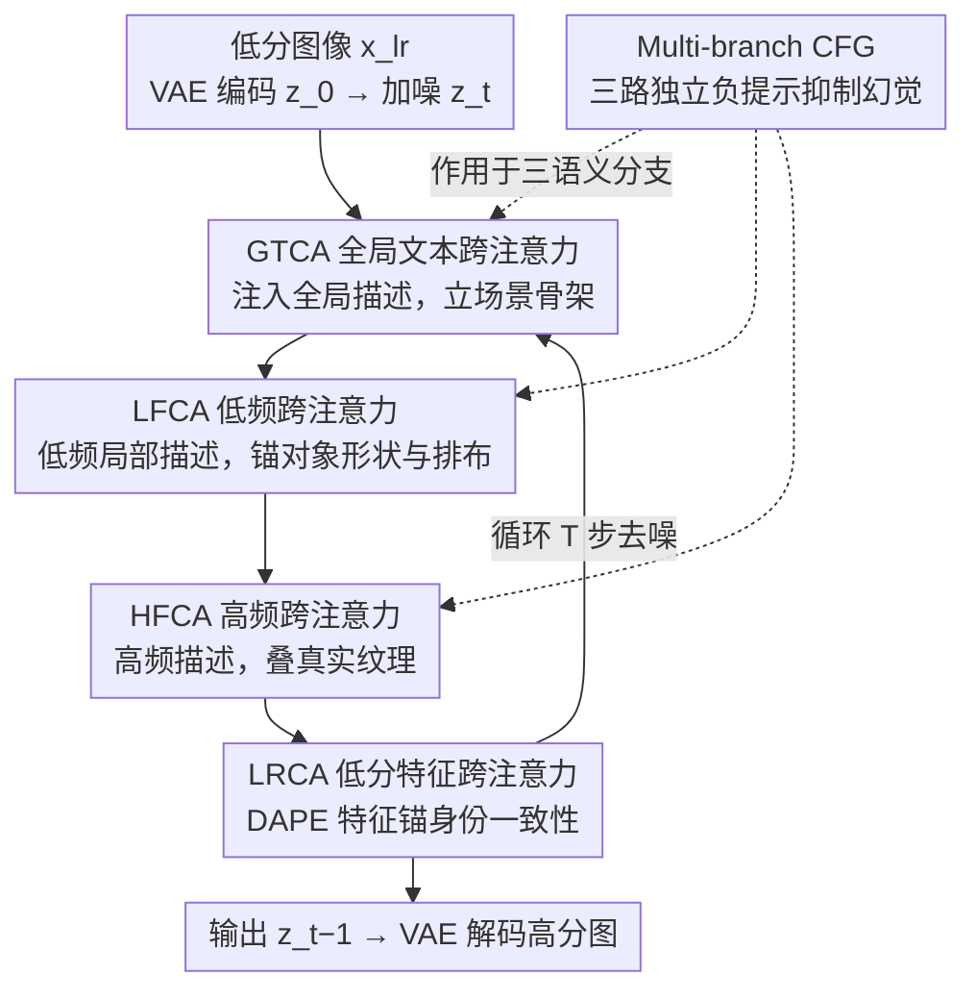

# Disentangled Textual Priors for Diffusion-based Image Super-Resolution

**会议**: CVPR 2026  
**arXiv**: [2603.07430](https://arxiv.org/abs/2603.07430)  
**代码**: [GitHub](https://github.com/JL6666JL/DTPSR)  
**领域**: 图像超分辨率  
**关键词**: 扩散模型超分, 文本引导, 解耦先验, 频率感知, 语义控制

## 一句话总结

提出 DTPSR，通过将文本先验沿空间层级（全局/局部）和频率语义（低频/高频）两个维度解耦，构建解耦的跨注意力注入管线和多分支 CFG 策略，实现感知质量优越的扩散超分辨率。

## 研究背景与动机

扩散模型（如 Stable Diffusion）在图像超分中展现了强大的生成能力，但其性能严重依赖语义先验的构造与注入方式。现有方法存在两类局限：

**语义粒度不足**：局部标签方法（SeeSR）关注细节但缺乏全局一致性；全局描述方法（SUPIR、PASD）关注全局但忽略细粒度细节

**频率信息纠缠**：现有方法将结构信息（低频：形状、布局）与纹理信息（高频：边缘、材质）混在同一嵌入中，导致语义可控性和解释性不足

**退化严重时的幻觉问题**：缺乏解耦语义引导时，扩散模型容易产生幻觉，如将墙壁误解为海洋纹理

核心洞察：将文本先验沿 **空间层级** 和 **频率语义** 两个正交维度解耦，让模型可以同时捕捉场景级结构和对象级细节。

## 方法详解

### 整体框架

DTPSR 想解决的是「文本先验到底该怎么喂给扩散超分模型」这个问题：它不再把一句笼统描述塞进 cross-attention 了事，而是把文本先验拆成「全局结构 / 局部低频 / 局部高频 / 输入锚定」四股，按语义层级分阶段依次注入去噪过程。

具体地，低分图像 $x_{lr}$ 先经 VAE 编码进隐空间得到 $z_0$，前向加噪到 $z_t$；反向去噪的每一步里，隐变量像过流水线一样依次穿过四个专用跨注意力模块——先由 GTCA 注入全局结构、再由 LFCA 补上对象级低频形状、接着 HFCA 叠加高频纹理、最后 LRCA 用原图特征锚住身份一致性：

$$z_t \xrightarrow{\text{GTCA}} z_t^g \xrightarrow{\text{LFCA}} z_t^{lf} \xrightarrow{\text{HFCA}} z_t^{hf} \xrightarrow{\text{LRCA}} z_{t-1}$$

这条「从粗到细、从结构到纹理」的注入顺序是刻意安排的：先定全局骨架，再逐层往上加细节，避免不同语义源互相打架。

### 关键设计

**1. 全局文本跨注意力 GTCA：先把场景骨架立起来**

全局描述方法抓得住大局却落不到细节，细节方法又缺乏全局一致性，GTCA 的活就是先打地基。它把一句全局描述 $c_g$（如"室内场景有 3 个物体"）经 CLIP 编码成 $e_g$，再通过跨注意力注入隐变量 $z_t$，确立场景级的结构和布局。后面三个模块都在这个全局骨架上做增量细化，就不会一上来纠结纹理却把整体一致性丢了。

**2. 低频跨注意力 LFCA：把对象的形状和排布锚清楚**

低频信息（形状、大小、空间排列）决定结构保真度，一旦和高频纹理混在同一个嵌入里就会互相干扰，所以 DTPSR 给它单开一路。LFCA 把一组低频局部描述 $\{c_{lf}^{(i)}\}$ 各自经 CLIP 编码后拼成矩阵

$$E_{lf} = [\text{CLIP\_TextEnc}(c_{lf}^{(1)}), \dots, \text{CLIP\_TextEnc}(c_{lf}^{(n)})]$$

注入 GTCA 的输出 $z_t^g$，做对象级的结构增强。因为只管低频，它能专注把"沙发是 L 形、靠墙摆"这类布局钉牢，不被纹理细节带偏。

**3. 高频跨注意力 HFCA：在结构之上叠真实纹理**

高频信息（纹理、边缘、表面材质）控制画面的视觉真实感，DTPSR 把它独立成第三路注入，正是为了精修纹理却不动已经定好的结构。HFCA 把高频描述 $\{c_{hf}^{(j)}\}$ 编码后，在 LFCA 输出基础上进一步注入：

$$z_t^{hf} = \text{HFCA}(z_t^{lf}, E_{hf})$$

低频先定形、高频后铺质感的分工，让"形状对不对"和"质感真不真"两件事各管各的，这正是避免把墙壁脑补成海洋纹理这类幻觉的关键。

**4. 低分辨率特征跨注意力 LRCA：把生成结果拴回原图**

文本先验再丰富，也可能让生成跑偏、偏离输入图像本身的内容。LRCA 用一个冻结的 DAPE 编码器从 $x_{lr}$ 抽出视觉特征 $f_{lr}$，通过跨注意力把它作为身份锚点注入，约束去噪结果别漂移出原图该有的样子。它放在注入链的最后一环，相当于三层语义都加完后再做一次"对齐校正"。

**5. 多分支无分类器引导 Multi-branch CFG：给每个语义源单独的"刹车"**

普通 CFG 只有一条负提示，但 DTPSR 同时有全局、低频、高频三个语义源，单一负提示压不住多源的幻觉。于是它给三个分支各配一条独立负提示 $c_g^{\text{neg}}, c_{lf}^{\text{neg}}, c_{hf}^{\text{neg}}$，按

$$\tilde{\epsilon} = \hat{\epsilon} + \lambda_s(\hat{\epsilon} - \hat{\epsilon}_{\text{neg}})$$

分别做语义抑制。好处是无需额外训练，就能针对"哪一层语义出了幻觉"做频率感知的精准压制。

### 一个完整示例

拿一张退化严重的室内照片走一遍，看四个模块怎么接力把它修出来：

- **GTCA**：读到全局描述"一间客厅，含沙发、茶几、墙面"，先在隐空间把三件家具的大致位置和场景骨架定下来，此时画面只是模糊的结构团块。
- **LFCA**：拿到低频局部描述"L 形沙发靠左墙、矩形茶几居中"，把每件物体的形状、大小、排布锚实，结构从"团块"变成"轮廓清楚的物件"。
- **HFCA**：再叠上高频描述"沙发是亚麻布纹、茶几是木纹、墙面是哑光涂料"，给已成形的物件铺上对的质感——关键是它不碰沙发的形状只动纹理，所以墙面不会被脑补成海浪。
- **LRCA**：最后用原图特征校一遍，确保修出来的还是这张输入图里的客厅，而不是另一间凭空生成的房间。
- **Multi-branch CFG**：去噪的每一步都用三条负提示分别压制全局/低频/高频可能跑出的幻觉，三路各刹各的。

### 损失函数 / 训练策略

- **训练损失**：标准噪声预测 MSE 损失
$$\mathcal{L} = \mathbb{E}[\|\epsilon - \epsilon_\theta(z_t, z_{lr}, t, c_g, c_{lf}, c_{hf})\|_2^2]$$
- **数据集 DisText-SR**：约 95K 图像-文本对，基于 LSDIR + FFHQ 前 10K 张，通过 Mask2Former 分割 + LLaVA 生成解耦描述
- **基座模型**：SD-2-base；DAPE 编码器提取 LR 嵌入
- **训练配置**：AdamW 优化器，lr $5 \times 10^{-5}$，batch 32，110K iterations，4× A800
- **推理**：DDPM 50 步，引导尺度 $\lambda_s = 7.0$

## 实验关键数据

### 主实验

| 数据集 | 指标 | DTPSR | FaithDiff | SUPIR | 提升 |
|--------|------|-------|-----------|-------|------|
| DIV2K-Val | MUSIQ↑ | **71.24** | 69.18 | 62.59 | +2.06 |
| DIV2K-Val | MANIQA↑ | **0.5866** | 0.4309 | 0.5224 | +0.0642 |
| DIV2K-Val | CLIPIQA↑ | **0.7549** | 0.6463 | 0.7040 | +0.0509 |
| RealSR | MUSIQ↑ | **71.84** | 68.86 | 58.51 | +2.98 |
| RealSR | MANIQA↑ | **0.6021** | 0.4644 | 0.4429 | +0.0432 |
| DRealSR | CLIPIQA↑ | **0.7640** | 0.6335 | 0.6307 | +0.0729 |

注：DTPSR 在所有无参考感知指标上均为 SOTA，但 PSNR/SSIM 低于 GAN 方法（感知-失真权衡）。

### 消融实验

| 配置 | MANIQA↑ | CLIPIQA↑ | MUSIQ↑ | 说明 |
|------|---------|----------|--------|------|
| 无先验 | 0.5271 | 0.7064 | 67.48 | 基线 |
| 仅局部 | 0.5851 | 0.7471 | 68.86 | 局部先验贡献更大 |
| 仅全局 | 0.5394 | 0.7211 | 67.80 | 全局提升较温和 |
| 全局+局部 | **0.6011** | **0.7640** | **69.24** | 互补效果最佳 |
| 频率混合 | 0.5947 | 0.7527 | 69.05 | 解耦优于混合 |
| 频率解耦 | **0.6011** | **0.7640** | **69.24** | 分离注入更有效 |

### 关键发现

- 局部先验的贡献远大于全局先验（MANIQA 提升 0.0580 vs 0.0123）
- 频率解耦比频率混合在所有指标上一致更优
- 多分支 CFG 比单一/无 CFG 显著提升感知质量（MUSIQ 66.73→69.24）
- 即使文本描述被随机损坏（替换为"None"），DTPSR 仍优于其他方法，展现鲁棒性
- 参数量 10.5B，推理 14.94s/张，与 SUPIR (17.8B) 和 FaithDiff (15.6B) 相比效率更优

## 亮点与洞察

1. **解耦设计优雅**：沿空间层级 × 频率语义两个正交维度解耦文本先验，概念清晰且有效
2. **DisText-SR 数据集**：首个结合全局-局部 + 低频-高频文本标注的大规模 SR 数据集，为可控超分研究提供基础
3. **多分支 CFG 策略**：无需额外训练即可抑制幻觉，用频率感知的负提示实现细粒度控制
4. **鲁棒性实验**：即使上游模块（分割、描述）输出不完美，系统仍能正常工作

## 局限与展望

1. PSNR/SSIM 等全参考指标不如 GAN 方法，存在感知-失真权衡
2. 依赖上游分割（Mask2Former）和描述（LLaVA）模型的质量
3. 推理时需要运行分割和描述生成流程，增加了端到端延迟
4. 仅处理 top-3 最大分割区域，可能遗漏小但重要的细节区域
5. 未来方向：自适应提示校正、与上游模块更紧密集成、更高效的扩散骨干

## 相关工作与启发

- **SeeSR**：使用局部语义标签，但仅关注细节而缺乏全局一致性
- **SUPIR/PASD/FaithDiff**：使用全局描述，但忽略频率分离
- **StableSR/DiffBIR**：未利用文本语义，错过了扩散先验的全部潜力
- 启发：解耦文本先验的思路可推广到其他条件生成任务（如编辑、修复）

## 评分

- 新颖性: ⭐⭐⭐⭐ 空间-频率双重解耦的文本先验设计新颖，多分支 CFG 策略有创意
- 实验充分度: ⭐⭐⭐⭐ 多数据集、多指标、丰富消融（全局/局部、频率、CFG、鲁棒性）
- 写作质量: ⭐⭐⭐⭐ 动机清晰、框架图清楚、实验组织合理
- 价值: ⭐⭐⭐⭐ 为文本引导扩散超分提供了新范式，DisText-SR 数据集有实用价值

<!-- RELATED:START -->

## 相关论文

- [\[CVPR 2026\] Thermal Diffusion Matters: Infrared Spatial-Temporal Video Super-Resolution through Heat Conduction Priors](thermal_diffusion_matters_infrared_spatial-temporal_video_super-resolution_throu.md)
- [\[CVPR 2026\] UniLDiff: Unlocking the Power of Diffusion Priors for All-in-One Image Restoration](unildiff_unlocking_the_power_of_diffusion_priors_for_all-in-one_image_restoratio.md)
- [\[CVPR 2026\] FiDeSR: High-Fidelity and Detail-Preserving One-Step Diffusion Super-Resolution](fidesr_high-fidelity_and_detail-preserving_one-step_diffusion_super-resolution.md)
- [\[CVPR 2026\] DreamSR: Towards Ultra-High-Resolution Image Super-Resolution via a Receptive-Field Enhanced Diffusion Transformer](dreamsr_towards_ultra-high-resolution_image_super-resolution_via_a_receptive-fie.md)
- [\[CVPR 2026\] TUDSR: Twice Upsampling-Diffusion for Higher Super-Resolution](tudsr_twice_upsampling-diffusion_for_higher_super-resolution.md)

<!-- RELATED:END -->
