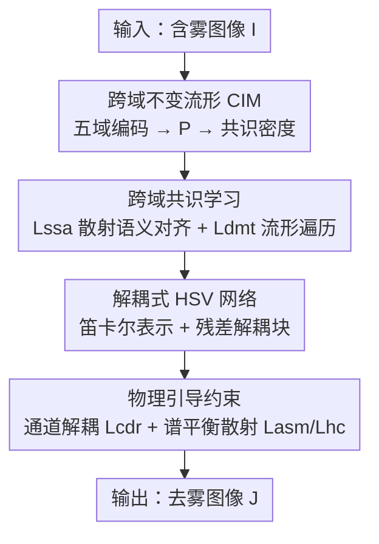

# Disentanglement-wise Image Dehazing through Cross-Domain Manifold Consensus

**会议**: CVPR 2026  
**论文**: [CVF Open Access](https://openaccess.thecvf.com/content/CVPR2026/html/Lyu_Disentanglement-wise_Image_Dehazing_through_Cross-Domain_Manifold_Consensus_CVPR_2026_paper.html)  
**代码**: 未开源（论文未提供链接）  
**领域**: 图像恢复  
**关键词**: 图像去雾, 跨域流形, 对比学习, HSV 解耦, 物理约束  

## 一句话总结
本文把"不同感知域（空间/频率/非局部/扩散/压缩感知）的雾图特征其实共享同一个散射语义核"这个假设落地成一个**跨域不变流形 CIM**，用共识密度驱动的对比学习把多域特征对齐到统一隐空间，再叠一条**物理引导的 HSV 解耦网络**专门拆解雾导致的颜色通道耦合，从而同时解决"误判雾特征"和"颜色失真"两大顽疾，在多个真实/合成基准上达到 SOTA 且推理最快（0.062s）。

## 研究背景与动机
**领域现状**：图像去雾的主流是深度网络，按所用表征域可分为空间域、频率域、非局部域、扩散域、压缩感知域等几大流派；近期也有"多域融合"方法想把不同域的互补线索合起来用。

**现有痛点**：作者点出两个相互纠缠的难题。一是**雾特征误判**——单域方法把"雾导致的低对比"和"场景本身的低对比（如天空、反射率低的表面）"混为一谈；多域方法虽想利用域间相关性，却依赖**人工设计的特征迁移**或域专属表征头，没有抓住"散射在各域里其实是同一物理过程"这个本质，于是经常把域专属特征错当成雾属性，导致复原次优、颜色偏移。二是**颜色失真**——在沙尘暴/浓雾这类场景，雾会破坏清晰图像在 HSV 空间里 H/S/V 三通道的天然独立性，引入强非线性耦合，使颜色难以忠实复原。

**核心矛盾**：现有去雾要么在"单一表征域里"看雾（视野受限、易误判），要么"经验式拼多个域"（没有物理一致的对齐准则、引入域冲突）；而颜色复原又被当作附属问题，没有显式去拆 H/S/V 的耦合。

**切入角度**：作者借用了多语言 NLP 里的"语义中枢假说"——意思相同的句子尽管词法语法不同，会被映射到共同语义空间里相近的点。类比到去雾：**同一雾场景在不同感知域的多种表征，是否也含有一个域不变的"散射语义核"？** 既然所有降质都源自同一个大气散射模型 $I = J\cdot t + A\cdot(1-t)$，那么不同域的散射特征理应能落到一个共享流形上。

**核心 idea**：用一个**跨域不变流形（CIM）**替代"各域独立 + 人工迁移"，让多域特征在散射物理的约束下自组织收敛对齐；并额外挂一条专门拆解 HSV 颜色耦合的解耦网络，让"流形收敛"与"颜色解耦"互相加强，构成统一的物理一致复原范式 CIM-D。

## 方法详解

### 整体框架
CIM-D 是一个**双视角统一框架**：输入是一张含雾图像 $I$，输出是去雾图像 $J$。第一条主线 **CIM** 负责"看准雾"——用五个域专属编码器（空间 SFE / 频率 FFE / 非局部 NFE / 扩散 DFE / 压缩感知 CFE）抽特征，经一个域翻译网络 $P$ 投到统一隐空间 $M$，再用**共识密度**衡量"哪些点是跨域一致的真散射、哪些只是某个域的噪声"，配合对比学习把雾态/清晰态特征分别聚成高密度区，把去雾建模成"在流形上从雾原型走向清晰原型"的遍历。第二条主线 **解耦式 HSV 网络**负责"修对颜色"——把 RGB 转成稳定的笛卡尔化 HSV 表示，用带残差解耦块的 U-Net 显式估计并抑制 H/S/V 通道间的雾致耦合。两条主线不是串行，而是**互相正则**：流形给解耦提供域不变的物理共识，HSV 网络的物理约束反过来把流形学习拉向"光度有效"的几何。

### 关键设计

**1. 跨域不变流形 CIM：用共识密度区分"真散射"与"域专属噪声"**

针对"单域误判、多域靠人工迁移"的痛点，作者构造一个统一隐空间 $M$：对第 $i$ 张图、状态 $s\in\{h,c\}$（含雾/清晰），五个域编码器 $\{\Phi_k\}_{k=1}^5$ 抽特征，再经域翻译网络 $P$ 映到流形：$z_s^{i,k} = P(\Phi_k(I_s^i))$。关键创新是定义**共识密度**来刻画流形上某点"被多少个域一致认同"。先算每个域在点 $z$ 处的特征密度（高斯核估计）：

$$\rho_s^k(z) = \frac{1}{N_k}\sum_{i=1}^{N_k} e^{-\frac{\|z - P(\Phi_k(I_s^i))\|^2}{2\sigma^2}}$$

再取各域密度的**几何平均**作为总共识密度：

$$\rho_s(z) = \Big(\prod_{k=1}^{K}\rho_s^k(z)\Big)^{1/K}$$

几何平均的妙处在于"一票否决"——只要某个域在该点密度很低（只是单域显著、不是跨域共识），乘积就被拉低，从而**压制域专属偏差、只保留各域都认可的散射结构**。$\rho_h$ 和 $\rho_c$ 的峰值分别对应雾态/清晰态的众数。和传统按语义相似度聚类不同，这里的流形几何是由"跨域物理共识"自组织涌现的，形成一个状态平滑过渡的连续散射语义场，使复原可解释为流形上的遍历。

**2. 跨域共识学习：把流形几何变成可优化的对齐与去雾目标**

光有流形结构还不够，需要损失把它训出来。作者设计两个共识密度驱动的对比损失。**散射语义对齐 $L_{ssa}$** 让同态正样本对靠拢、远离低密度负样本：

$$L_{ssa} = -\mathbb{E}_{(m_s^i,m_s^j)\sim p_{pos}}\Big[\log\frac{D(m_s^i,m_s^j)}{D(m_s^i,m_s^j)+R(m_s^i)}\Big]$$

其中 $D(u,v)=e^{\mathrm{Sim}(u,v)/\tau}$，$R(m_s^i)=\sum_n D(m_s^i,m_-^n)$ 聚合来自低密度区的负样本相似度。正样本对的采样概率本身就嵌入了流形几何：$p_{pos}(m_s^i,m_s^j)\propto \rho_s(m_s^i)\rho_s(m_s^j)\,e^{-\|m_s^i-m_s^j\|^2/2\sigma_g^2}$，即**高密度、近邻**的同态点更可能成对，从而让对比学习沿着物理一致的方向收紧。**流形遍历去雾 $L_{dmt}$** 则把去雾结果 $J$ 的流形位置 $m_d$ 推向清晰原型 $\mu_c$、推离雾原型 $\mu_h$ 和低密度的"物理不合理态"：

$$L_{dmt} = -\log\frac{w\cdot D(m_d,\mu_c)}{w\cdot[D(m_d,\mu_c)+D(m_d,\mu_h)]+(1-w)\cdot R(m_d)}$$

其中 $\mu_c,\mu_h$ 由密度峰聚类得到，权重 $w = 1-e^{-(\rho_h(m_d)+\rho_c(m_d))/2}$ 让"落在高密度区"时更信任原型引导。这一步把去雾从"端到端黑盒回归"变成了**在可解释流形上的有向遍历**。

**3. 解耦式 HSV 网络：用梯度相关性显式拆解雾致颜色耦合**

针对颜色失真痛点，作者先解决输入稳定性：原始 H 通道是**循环量**且在低饱和区不稳定，于是转成连续笛卡尔表示 $D_x=(S_I\cos(2\pi H_I)+1)/2$、$D_y=(S_I\sin(2\pi H_I)+1)/2$、$D_z=V_I$ 作为网络输入。网络是 U-Net（编解码各三个多尺度卷积块 MConv + 三个**残差解耦块**）。解耦块的核心是用 Sobel 算子算各通道梯度 $\nabla H,\nabla S,\nabla V$，再用梯度方向的绝对余弦相似度 $S_\nabla(\cdot,\cdot)$ 量化通道间耦合，然后做自适应纠正：

$$H_{dec} = H - F\big(\mathrm{cat}[S_\nabla(S,H),S_\nabla(H,V)]\big)\cdot W$$

（$S,V$ 通道同理）。其中 $W=\mathrm{Sigmoid}(F(\mathrm{cat}[\|\nabla H\|,\|\nabla S\|,\|\nabla V\|]))$ 是按梯度幅值估的自适应权重，**在低梯度无信息区（如天空）自动关掉解耦**，避免破坏本就独立的区域。解耦后的 $H_{dec},S_{dec},V_{dec}$ 重映回 $D_x,D_y,D_z$ 并经残差连接逐层累积，渐进抑制颜色耦合得到最终 $J$。这里"显式量化 + 显式扣除"耦合，是它优于"标准残差块隐式学习"的根本（消融 V7 证实）。

**4. 物理引导约束：让颜色复原服从大气散射的光度学**

为了让前面的解耦不是凭空纠偏、而是物理可信，作者加了两组约束。**通道解耦正则 $L_{cdr}$**：统计 10000 张清晰图发现 HSV 各通道对的互信息服从高斯分布，于是把去雾图的可微互信息估计 $\widehat{MI}_{i,j}(J)$ 约束回该高斯：$L_{cdr}=-\frac1B\sum_b\sum_{(i,j)}\log\mathcal N(\widehat{MI}_{i,j}(J_b);\mu_{i,j},\sigma_{i,j}^2)$，把"清晰图通道应当统计独立"这一先验直接写进损失。**谱平衡散射约束**：引入可学习的谱平衡矩阵 $W$ 把 ASM 改写成 $I_w=J_w t+A_w(1-t)$，映射到 HSV 后（利用谱平衡大气光 $S_{A_w}\approx0$ 消去未知传输 $t$）得到输入与复原帧之间的不变比值约束 $L_{asm}=\mathbb E[\|T(I_w,V_A)-T(J,V_A)\|_2^2]$，其中 $T(u,V_A)=S_uV_u/(V_A-V_u)$；再加一条**色相一致损失** $L_{hc}$，用权重 $\Omega=e^{-V_I/2S_I}$ 在低亮高饱和（散射干扰小）的可靠区惩罚色相漂移。$W$ 随网络端到端联合优化，意味着颜色补偿是"架构创新涌现出来的"而非预设修正。

### 损失函数 / 训练策略
总损失把四块统一起来：

$$L_{total} = \lambda_1 L_{ssa} + \lambda_2 L_{dmt} + \lambda_3 L_{cdr} + \lambda_4(L_{asm}+L_{hc})$$

权重 $\lambda_{1..4}=0.1,0.5,0.05,1$，对比温度 $\tau=0.07$。训练用 AdamW（$\beta_1=0.9,\beta_2=0.999$，lr $1\times10^{-5}$），batch 16、100 epoch，2×RTX 4090 训练。值得注意的是训练数据是**无配对**的：2500 张真实雾图（RTTS/URHI）+ 1800 张无雾图（OTS），雾与清晰样本无像素级对应，靠流形共识与物理约束完成无配对去雾。

## 实验关键数据

### 主实验
合成集用全参考指标（PSNR/SSIM），真实集 RTTS 用无参考指标（FADE/BRISQUE/NIQE）。CIM-D 在 Raw2ah 上 PSNR/SSIM 双第一；SOTS 上略逊 C2P 排第二；真实 RTTS 上 FADE/NIQE 最佳、BRISQUE 第二，且推理最快、参数第二轻。

| 数据集 | 指标 | CIM-D | 最优对手 | 说明 |
|--------|------|-------|----------|------|
| Raw2ah | PSNR↑ / SSIM↑ | **17.89 / 0.585** | C2P 17.26 / 0.553 | 合成集双指标第一 |
| SOTS | PSNR↑ / SSIM↑ | 25.51 / 0.935 | C2P 27.22 / 0.955 | 第二，逊于 C2P |
| RTTS | FADE↓ / NIQE↓ | **0.795 / 3.844** | UCL 0.824 / PTTD 3.887 | 真实集感知质量最佳 |
| 全体 | Runtime↓ | **0.062s** | KA-Net 0.088s | 推理最快 |
| 全体 | 参数↓(M) | 2.38 | PTTD 2.02 | 第二轻量 |

### 消融实验（SOTS）
逐项去掉损失/替换架构，验证每个组件贡献：

| 变体 | 改动 | PSNR↑ | SSIM↑ | 现象 |
|------|------|-------|-------|------|
| V1 | w/o $L_{dmt}$ | 21.15 | 0.875 | 缺清晰区引导，结构连贯性崩 |
| V2 | w/o $L_{ssa}$ | 22.89 | 0.891 | 缺跨域共识，特征判别力降 |
| V3 | w/o $L_{cdr}$ | 23.26 | 0.910 | 通道耦合残留、颜色失真 |
| V4 | w/o $L_{asm}$ | 20.57 | 0.804 | 细节大量丢失（掉点最狠） |
| V5 | w/o $L_{hc}$ | 23.82 | 0.906 | 天空区明显色相漂移 |
| V6 | 用原始 HSV（去笛卡尔） | 18.95 | 0.878 | 色相循环性致严重不稳 |
| V7 | 标准残差块（去解耦块） | 24.18 | 0.919 | 颜色耦合明显，证实显式解耦必要 |
| CIM-D | 完整 | **25.51** | **0.935** | — |

### 关键发现
- **谱平衡散射约束 $L_{asm}$ 贡献最大**：去掉后 PSNR 从 25.51 暴跌到 20.57、SSIM 跌到 0.804，说明把复原绑定到大气散射光度学是结构与细节保真的支柱。
- **笛卡尔化 HSV 表示几乎是命门**：V6 用原始 HSV 直接掉到 18.95，印证了"色相是循环量、低饱和区不稳"这一输入稳定性问题被严重低估。
- **显式梯度解耦 > 隐式残差学习**：V7 换成标准残差块仍掉到 24.18，证明"先量化通道耦合再显式扣除"比让网络隐式学更有效。
- **效率亮点**：在拿到真实集最佳感知质量的同时推理仅 0.062s，对自动驾驶等实时场景友好。

## 亮点与洞察
- **跨域类比的迁移**：把多语言 NLP 的"语义中枢假说"迁到去雾，提出"散射语义核"，是个漂亮的跨领域类比——同一物理过程在不同表征域应当落到共享流形，这个视角可推广到任何"多表征同源降质"问题（如去雨、低光增强）。
- **共识密度的几何平均"一票否决"**：用各域密度的几何平均而非算术平均来定义共识，天然压制单域显著噪声，是个简单但关键的设计选择。
- **把去雾重述为"流形遍历"**：$L_{dmt}$ 用密度加权把复原引向高密度清晰原型、推离低密度不合理态，比端到端回归更可解释，这种"在结构化隐空间里有向移动"的思路值得借鉴。
- **自适应权重 $W$ 在天空区关掉解耦**：用梯度幅值 sigmoid 出权重，避免在低信息区过度纠偏，是个实用的工程 trick。

## 局限与展望
- 作者承认：在**深度边缘附近偶尔产生光晕**，对复杂多层雾场景可能**过度平滑**。
- ⚠️ 论文大量关键理论（CIM 的理论依据、选这五个域的理由、HSV 约束推导）都放在 Supp.A/B/D，正文只给结论，**未读补充材料前对"五域为何足够/必要""谱平衡推导严密性"应保留判断**。
- SOTS 上 PSNR 仍明显逊于 C2P（25.51 vs 27.22），说明该方法的优势更偏"真实雾 + 颜色保真"而非"合成集峰值信噪比"；横向比 PSNR 时需注意 C2P 参数量是其 3 倍。
- 训练用无配对真实雾图，泛化是卖点，但也意味着缺乏像素级监督，复杂结构恢复仍是短板（作者将其列为未来工作）。

## 相关工作与启发
- **vs 单域方法（IDE/C2P 等）**：单域把雾特征和场景内容（如天空）混淆、易过增强；本文用跨域共识从多个表征域交叉验证"什么才是雾"，从源头降低误判。
- **vs 多域融合（FSDGN/Yu et al.）**：他们靠经验式特征迁移或域专属头拼多域，缺物理一致的对齐准则、易引入域冲突；本文用散射物理 + 共识密度建立"物理接地"的对齐，是方法论上的升级。
- **vs 感知色彩空间方法（Li et al./Lyu et al. 多色彩空间网络）**：他们把 HSV 当**辅助引导**且不显式拆 H/S/V 耦合；本文把 HSV 当**主表征**并用梯度相关性显式解耦，针对沙尘暴等彩色雾的颜色失真更对症。

## 评分
- 新颖性: ⭐⭐⭐⭐⭐ 跨域不变流形 + 共识密度 + 流形遍历去雾，把 NLP 语义中枢假说迁到去雾物理，视角新颖自洽
- 实验充分度: ⭐⭐⭐⭐ 合成+真实多基准、7 个 SOTA 对比、8 变体消融充分，但关键证明依赖补充材料、SOTS PSNR 仍落后 C2P
- 写作质量: ⭐⭐⭐⭐ 动机—方法—约束逻辑清晰，公式完整；但符号密集、五域细节压进 Supp，正文略吃力
- 价值: ⭐⭐⭐⭐ 真实彩色雾去除 + 实时推理（0.062s）兼顾，对自动驾驶等下游有实用价值

<!-- RELATED:START -->

## 相关论文

- [\[CVPR 2026\] From Events to Clarity: The Event-Guided Diffusion Framework for Dehazing](from_events_to_clarity_the_event-guided_diffusion_framework_for_dehazing.md)
- [\[CVPR 2026\] Thermal Diffusion Matters: Infrared Spatial-Temporal Video Super-Resolution through Heat Conduction Priors](thermal_diffusion_matters_infrared_spatial-temporal_video_super-resolution_throu.md)
- [\[ICLR 2026\] Learning Domain-Aware Task Prompt Representations for Multi-Domain All-in-One Image Restoration](../../ICLR2026/image_restoration/learning_domain-aware_task_prompt_representations_for_multi-domain_all-in-one_im.md)
- [\[CVPR 2026\] RAW-Domain Degradation Models for Realistic Smartphone Super-Resolution](rawdomain_degradation_models_smartphone_sr.md)
- [\[CVPR 2026\] White-Balance First, Adjust Later: Cross-Camera Color Constancy via Vision-Language Evaluation](white-balance_first_adjust_later_cross-camera_color_constancy_via_vision-languag.md)

<!-- RELATED:END -->
