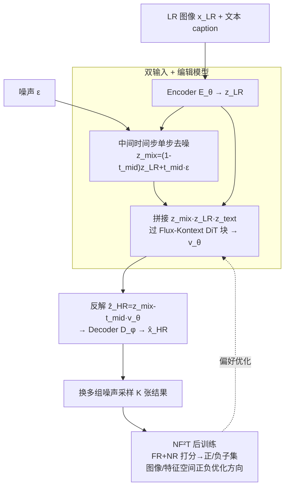

# DNF-SR: Dual-Input and Negative-Aware Feature Fine-Tuning for Real-World Image Super-Resolution

**会议**: CVPR 2026  
**论文**: [CVF Open Access](https://openaccess.thecvf.com/content/CVPR2026/html/Han_DNF-SR_Dual-Input_and_Negative-Aware_Feature_Fine-Tuning_for_Real-World_Image_Super-Resolution_CVPR_2026_paper.html)  
**代码**: https://github.com/SHH-Han/DNF-SR  
**领域**: 图像恢复 / 真实世界超分辨率 / 扩散模型  
**关键词**: 单步扩散超分, 双输入, 图像编辑模型, 偏好对齐, 负样本感知微调  

## 一句话总结
DNF-SR 把"带噪 LR + 原始 LR"双路喂进一个图像编辑扩散模型（Flux-Kontext）在中间时间步做单步超分，再用一种把偏好优化从隐空间搬到图像/特征空间的负样本感知微调（NF²T）做后训练，在四个真实超分基准的无参考指标上全面领先。

## 研究背景与动机
**领域现状**：扩散先验给真实世界图像超分（Real-ISR）带来了显著的感知质量提升，但多步去噪太慢。为了提速，近期工作转向"单步"扩散超分，主流有两条路线：(a) 用 ControlNet 把 LR 注入文生图模型、再把多步网络蒸馏成"噪声→HR"的单步映射（如 SinSR、AddSR-1s）；(b) 直接把 LR latent 当作扩散模型某个时间步的输入、用 LoRA 微调成单步超分（如 OSEDiff、TSDSR、FluxSR、OMGSR）。

**现有痛点**：路线 (a) 因为引入 ControlNet 而涨参数，而且"从纯噪声单步直接复原 HR"限制了上限；路线 (b) 用 LR latent 顶替扩散模型原本的输入，二者之间存在明显的分布鸿沟，拖累性能。OMGSR、TADSR 试图改在"中间时间步"注入 LR 来缓解，但无论选哪个中间步 $t$，LR latent 在高频成分上都和扩散模型该步原本的输入 $z_t$ 不一致。

**核心矛盾**：最直接的缩小分布差的办法是给 LR 加噪，但加噪会破坏 LR 本身的内容（细节被噪声盖掉）。于是出现"缩小输入分布差"与"保住 LR 内容保真度"之间的两难。

**切入角度**：作者观察到，从频率角度看 LR latent 最接近的是 $t=0$ 处的自然图像 latent $z_0$（因为 LR 比 HR 高频更少），而不是任意中间步；但 $t=0$ 时 $\hat z_{HR}=z_{LR}-t v_\theta$ 退化得无法优化。所以既要给 LR 加噪逼近原始输入分布，又要把"干净的原始 LR"作为额外条件保留进去——这正是图像编辑模型擅长的事（把参考图当条件）。

**核心 idea**：用"带噪 LR + 原始 LR"双输入喂图像编辑扩散模型做单步超分；再用一个能利用多个采样结果、且把优化搬到图像/特征空间的负样本感知后训练（NF²T）进一步提质。

## 方法详解

### 整体框架
DNF-SR 分两段：**(1) 模型结构（SFT 阶段）**——以 Flux-Kontext 为预训练骨干，把带噪 LR 与原始 LR 双路拼接，在固定中间时间步 $t_{mid}$ 做一次去噪得到 HR；**(2) 后训练（NF²T）**——对同一 LR 用不同噪声采样出多张结果，用 FR+NR 指标打分聚合成 reward，划分正/负子集，在图像与特征空间构造正负优化方向把模型推向更高质量。

SFT 前向：LR 图像 $x_{LR}$ 经可微调 Encoder $E_\theta$ 得 $z_{LR}$；与噪声 $\epsilon$ 按 $t_{mid}$ 加权得 $z_{mix}=(1-t_{mid})z_{LR}+t_{mid}\epsilon$；把 $z_{mix}$、$z_{LR}$ patch 化后与文本 token $z_{text}$ 沿 token 维拼接，过 MM-DiT 与 Single-DiT 块；取 $z_{mix}$ 对应位置的输出当作预测速度 $v_\theta$，由 $\hat z_{HR}=z_{mix}-t_{mid}v_\theta$ 反解 HR latent，再过固定 Decoder $D_\phi$ 得 $\hat x_{HR}$。

### 关键设计

**1. 双输入 + 图像编辑骨干：既缩分布差又保内容**

针对"加噪缩小分布差却破坏 LR 内容"的两难，DNF-SR 不再用 LR latent 单路顶替扩散输入，而是双路并行：一路是带噪的 $z_{mix}$，负责把输入分布拉回扩散模型熟悉的样子、激活其生成先验；另一路是干净的原始 $z_{LR}$，作为条件控制保住保真度。两路连同文本 token 沿 token 维拼接后送入 DiT 块，让自注意力自己去融合"该信哪条线"。关键在于骨干选的是**图像编辑模型 Flux-Kontext** 而非文生图 Flux——编辑模型天生就是"看着一张参考图、按指令改图"，因此能把原始 LR 当条件用得更充分。消融里 $(z_{mix},z_{LR})$ 双输入相比只用 $z_{mix}$ 或只用 $z_{LR}$，LPIPS 从 0.3349/0.3040 降到 0.2925；把骨干从 Flux 换成 Flux-Kontext 后 MANIQA 从 0.6718 升到 0.6903，验证了两点都有效。

**2. 中间时间步单步去噪：在结构与纹理之间取平衡**

扩散模型在不同时间步关注不同频段：$t$ 大时偏生成低频（整体结构），$t$ 小时偏生成高频（细节纹理）。如果像传统单步法那样从纯噪声 $\epsilon$（$t=1$）出发，模型要从零重建结构，保真度差；如果取 $t=0$，按 $\hat z_{HR}=z_{LR}-t v_\theta$ 又会因 $t\to0$ 退化得无法优化。DNF-SR 折中选固定中间步 $t_{mid}$ 作为输入 latent $z_{mix}$ 对应的时间步，让模型既补结构又补细节。消融显示 $t=0.5$ 在保真（LPIPS 0.2925）与质量（MANIQA 0.6903、QALIGN 3.9162）间最均衡，比 $t=1$（纯噪声，LPIPS 0.3025）以及 $t=0.25/0.75$ 都更稳，故全程取 $t_{mid}=0.5$。

**3. NF²T：把负样本感知优化从隐空间搬到图像/特征空间**

由于带噪输入让单步模型能采出多样结果，作者借鉴 DiffusionNFT 的偏好对齐范式做后训练：对同一 LR 用不同噪声采 $K$ 张图，用奖励 $r$ 把它们隐式划成正/负方向，定义隐式正策略 $v_\theta^+=v_\theta$、隐式负策略 $v_\theta^-=2v^{old}-v_\theta$，单步 SR 的 NFT 目标为

$$\mathcal{L}_{NFT}=\mathbb{E}\big[\,r\,\|v_\theta^+(z_{mix},z_{LR})-v\|^2+(1-r)\,\|v_\theta^-(z_{mix},z_{LR})-v\|^2\,\big].$$

但作者发现：直接在 **latent/velocity 空间**做这种隐式优化，会在重建图上引入明显的网格状伪影（grid artifacts）。NF²T 的关键修正是把优化从速度空间映射回**图像空间**：用 $f(v)=D_\phi(z_{mix}-t_{mid}v)$ 把 $v_\theta^+,v_\theta^-,v$ 解码成 $\hat x_\theta^+,\hat x_\theta^-,\hat x_{HR}$，再复用 SFT 阶段的重建损失 $\mathcal{L}_{Rec}$ 构造正负目标，最终训练目标为

$$\mathcal{L}_{NF^2T}=\mathbb{E}\big[\,r\,\mathcal{L}_{Rec}(\hat x_\theta^+,\hat x_{HR})+(1-r)\,\mathcal{L}_{Rec}(\hat x_\theta^-,\hat x_{HR})\,\big].$$

奖励 $r$ 由多种 IQA 指标聚合：取 LPIPS、DISTS（FR）与 CLIPIQA、MUSIQ、MANIQA（NR），对每个指标算原始分 $r_i^{raw}$、batch 内标准化得 $r_i^{std}$，再按标准高斯 CDF 映射 $r_i=\Phi(r_i^{std})$ 归一到 $[0,1]$，最后跨指标平均。相比需要显式概率建模的 PPO/GRPO 类强化学习，NF²T 直接优化 flow matching 的预测速度、省去采样里的概率建模，天然适配单步 SR；相比只能用成对数据的 Diffusion-DPO，它能同时利用多张采样结果的排序信息，数据利用率更高。

### 损失函数 / 训练策略
SFT 阶段用三类损失：$\mathcal{L}_z=\mathcal{L}_{MSE}(z_{LR},z_{HR})$ 把过了 $E_\theta$ 的 LR latent 对齐 HR latent；$\mathcal{L}_{Rec}=\mathcal{L}_{MSE}(\hat x_{HR},x_{HR})+\mathcal{L}_{DISTS}(\hat x_{HR},x_{HR})$ 做像素+感知重建；$\mathcal{L}_{GAN}$ 用 DINOv3 当判别器。总损失 $\mathcal{L}_{sft}=\lambda_1\mathcal{L}_z+\lambda_2\mathcal{L}_{MSE}+\lambda_3\mathcal{L}_{DISTS}+\lambda_4\mathcal{L}_{GAN}$，沿用 OMGSR 设定 $\lambda_1=5,\lambda_2=2,\lambda_3=5,\lambda_4=0.5$。骨干为 FLUX.1-Kontext-dev，SFT 阶段用 LoRA（rank 64）微调 VAE Encoder 与 DiT 块、固定 Decoder；后训练阶段只微调 DiT 块、每步采 8 张。AdamW，lr 2e-5，batch size 1，训练 5000 步，8×H20 GPU；caption 由 Qwen3-VL(8B) 生成（训练用 HR、推理用 LR，且推理时其他对比方法也用同一 caption）。

## 实验关键数据

### 主实验
在 RealSR、DrealSR、DIV2K-Val、RealLQ250 四个基准上对比多步法（DiffBIR/SeeSR/DiT4SR）与单步法（S3Diff/PisaSR/SinSR-1s/OSEDiff/TSDSR/HYPIR/OMGSR）。下表摘 RealSR 上与前 SOTA（OMGSR）的对比，DNF-SR(sft) 为仅 SFT、DNF-SR 为加上 NF²T 的完整模型：

| 方法 | PSNR↑ | LPIPS↓ | CLIPIQA↑ | MUSIQ↑ | MANIQA↑ | QALIGN↑ |
|------|-------|--------|----------|--------|---------|---------|
| TSDSR | 23.404 | 0.2805 | 0.7196 | 70.766 | 0.6312 | 3.7754 |
| HYPIR | 22.785 | 0.3107 | 0.6491 | 66.559 | 0.6558 | 3.6931 |
| OMGSR（前SOTA） | **25.882** | **0.2779** | 0.6682 | 69.527 | 0.6695 | 3.8507 |
| DNF-SR(sft) | 25.628 | 0.2925 | 0.6903 | 70.672 | 0.6856 | 3.9162 |
| **DNF-SR** | 24.970 | 0.3239 | **0.7257** | **72.040** | **0.6930** | **4.0718** |

DNF-SR 在所有基准的无参考指标上全面领先；值得注意的是 reward 计算只用了 CLIPIQA/MANIQA/MUSIQ，而 QALIGN、VQ-R1 这两个**未参与 reward** 的（基于多模态大模型的）指标同样拿到最高分，说明提升不是"刷指标"刷出来的。

### 消融实验

**模型结构消融（RealSR，输入方式 × 时间步）：**

| 输入 | 时间步 | LPIPS↓ | MUSIQ↑ | MANIQA↑ | QALIGN↑ | 说明 |
|------|--------|--------|--------|---------|---------|------|
| 仅 $z_{mix}^*$ | 0.5 | 0.3349 | 69.838 | 0.6729 | 3.9363 | 只带噪 LR，Flux 骨干 |
| 仅 $z_{LR}^*$ | 0.5 | 0.3040 | 70.441 | 0.6808 | 3.8771 | 只原始 LR，Flux 骨干 |
| $(z_{mix},z_{LR})^*$ | 0.5 | 0.2995 | 71.116 | 0.6718 | 3.9057 | 双输入，Flux 骨干 |
| $(z_{mix},z_{LR})$ | 0.5 | **0.2925** | 70.672 | **0.6903** | 3.9162 | 双输入 + Flux-Kontext |
| $(\epsilon,z_{LR})$ | 1.0 | 0.3025 | 70.333 | 0.6853 | 3.8574 | 纯噪声输入 |
| $(z_{mix},z_{LR})$ | 0.25 | 0.2945 | 70.493 | 0.6870 | 3.8688 | 偏高频 |
| $(z_{mix},z_{LR})$ | 0.75 | 0.2960 | 70.526 | 0.6790 | 3.9304 | 偏低频 |

（$^*$ 表示用文生图 Flux 作骨干，其余用编辑模型 Flux-Kontext。）双输入优于任一单输入、编辑骨干优于文生图骨干、$t=0.5$ 优于纯噪声与其他中间步，三点逐一验证。

**NF²T 后训练消融（RealSR）：**

| 设置 | Reward | LPIPS↓ | MUSIQ↑ | MANIQA↑ | QALIGN↑ |
|------|--------|--------|--------|---------|---------|
| 仅 SFT | — | 0.2925 | 70.672 | 0.6903 | 3.9162 |
| NFT（latent 空间） | NR+FR | 0.3250 | 71.168 | 0.6413 | 3.943 |
| NF²T | FR | 0.3255 | 71.091 | 0.6925 | 3.9979 |
| **NF²T** | NR+FR | 0.3239 | **72.040** | **0.6930** | **4.0718** |

### 关键发现
- **双输入是结构侧最大功臣**：去掉任一路、或换回文生图骨干，LPIPS/感知指标都明显回退，说明"带噪缩分布差 + 原始 LR 保内容"这对组合缺一不可。
- **优化空间比优化目标更重要**：同样是负样本感知，放在 latent 空间（NFT）会产生网格伪影且 MANIQA 掉到 0.6413，搬到图像/特征空间（NF²T）才把 MANIQA、QALIGN 一并拉高——这是本文最实用的一条经验。
- **LPIPS 反而略升要辩证看**：NF²T 后 LPIPS 从 0.2925 升到 0.3239。作者解释这是因为 HR ground truth 本身偏糊，更清晰的输出反而拉低了参考型 LPIPS，配合无参考指标全面上升才说明是真变好（⚠️ 此为作者解释，需结合可视化判断）。
- **reward 里加 FR 指标能稳住保真**：NF²T 只用 FR 与用 NR+FR 对比，后者在不牺牲 FR 的前提下进一步抬高 NR 指标，结果更自然。

## 亮点与洞察
- **"双输入"把加噪的两难拆成两条线**：一条专门缩分布差、一条专门保内容，让模型自注意力自己融合，比单路硬塞优雅——这种"该激活先验的归噪声、该保真的归条件"的拆分思路可迁移到其他需要"既用生成先验又要保真"的恢复任务。
- **诊断出 latent 空间偏好优化的网格伪影并给出对症解法**：直接照搬 DiffusionNFT 到 SR 会出网格状伪影，作者把优化用解码函数 $f(v)$ 映射回图像空间再算重建损失，是一个很具体、可复现的工程洞察。
- **用未参与 reward 的指标自证**：拿 QALIGN/VQ-R1 这种没进 reward 的强指标也拿第一，是规避"reward hacking"质疑的好做法，值得做偏好对齐时借鉴。

## 局限与展望
- **依赖外部 caption 与多个 IQA reward 模型**：每张图都要 Qwen3-VL 生成 caption，后训练每步要跑 5 个 IQA 指标算 reward，工程开销不小；reward 的好坏直接决定优化方向，IQA 指标自身偏差可能被放大（作者已用 FR 缓解但未根治）。
- **LPIPS 回退未被根本解决**：完整模型在参考型保真指标上不及 OMGSR/TSDSR，作者归因于 GT 偏糊，但这也意味着在"GT 质量高、强调像素保真"的场景未必占优。
- **$t_{mid}=0.5$ 为经验固定值**：时间步是手调的全局常数，未做按图自适应，不同退化程度的 LR 也许需要不同 $t_{mid}$，是一个直接的改进方向。
- ⚠️ 文中部分公式（如 $v$、$v_\theta^-$ 的具体形式）以原文为准，本笔记按主线做了精简表述。

## 相关工作与启发
- **vs OMGSR / TADSR（路线 b，中间步注入 LR）**：它们仍是 LR latent 单路在中间步顶替输入，分布差只是被减小没被消除；DNF-SR 用"带噪 LR + 原始 LR"双路 + 编辑骨干，既缩差又保真，无参考指标全面反超。
- **vs OSEDiff / TSDSR（单步 + 蒸馏/LoRA）**：它们靠蒸馏或分数蒸馏对齐单步输出，DNF-SR 额外引入偏好后训练 NF²T，用多采样排序信号继续提质，是"结构改进 + 后训练"的叠加。
- **vs DiffusionNFT（偏好对齐范式来源）**：DNF-SR 沿用其正/负隐式策略框架，但发现其 latent 空间优化在 SR 上出网格伪影，改到图像/特征空间，是把通用偏好对齐方法落地到 SR 的关键改造。
- **vs Diffusion-DPO（成对偏好）**：DPO 只能用成对数据、标注贵且浪费多样排序信息；NF²T 能直接利用一次多采样的全部结果定方向，数据利用率更高，也更契合单步设定。

## 评分
- 新颖性: ⭐⭐⭐⭐ 双输入 + 编辑骨干的组合与"把偏好优化搬出 latent 空间"都是切中痛点的实在创新，但各组件多为已有范式的巧妙拼装。
- 实验充分度: ⭐⭐⭐⭐⭐ 四基准、多指标、结构与后训练双消融齐全，还用未进 reward 的指标自证。
- 写作质量: ⭐⭐⭐⭐ 动机推导（频率视角解释为何选中间步）清晰，公式与图配合到位。
- 价值: ⭐⭐⭐⭐ 单步 Real-ISR 的实用强基线，NF²T 的"换优化空间消伪影"经验对偏好对齐社区有借鉴意义。

<!-- RELATED:START -->

## 相关论文

- [\[CVPR 2026\] Time-Aware One Step Diffusion Network for Real-World Image Super-Resolution](time-aware_one_step_diffusion_network_for_real-world_image_super-resolution.md)
- [\[CVPR 2026\] FinPercep-RM: A Fine-grained Reward Model and Co-evolutionary Curriculum for RL-based Real-world Super-Resolution](finpercep_rm_a_fine_grained_reward_model_and_co_evolutionary_curriculum_for_rl_ba.md)
- [\[CVPR 2026\] IAFMNet: Information-Aware Feature Modulation for Efficient Super-Resolution](iafmnet_information-aware_feature_modulation_for_efficient_super-resolution.md)
- [\[CVPR 2026\] One-Step Diffusion Transformer for Controllable Real-World Image Super-Resolution](one-step_diffusion_transformer_for_controllable_real-world_image_super-resolutio.md)
- [\[CVPR 2026\] Toward Real-world Infrared Image Super-Resolution: A Unified Autoregressive Framework and Benchmark Dataset](real_iisr_infrared_image_super_resolution_autoregressive.md)

<!-- RELATED:END -->
