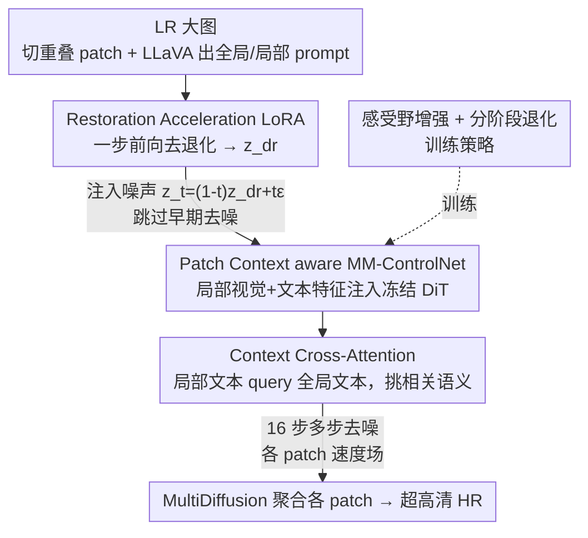

# DreamSR: Towards Ultra-High-Resolution Image Super-Resolution via a Receptive-Field Enhanced Diffusion Transformer

**会议**: CVPR 2026  
**论文**: [CVF Open Access](https://openaccess.thecvf.com/content/CVPR2026/html/Dong_DreamSR_Towards_Ultra-High-Resolution_Image_Super-Resolution_via_a_Receptive-Field_Enhanced_Diffusion_CVPR_2026_paper.html)  
**代码**: https://github.com/jerrydong0219/DreamSR  
**领域**: 图像恢复 / 扩散模型  
**关键词**: 真实世界超分辨率, 超高清(4K), 扩散 Transformer, ControlNet, 分块推理  

## 一句话总结
DreamSR 用一个"全局 + 局部"双分支的 MM-ControlNet 给基于 FLUX(DiT) 的超分模型注入 patch 级文本提示，配合一步去退化 LoRA 和感受野增强训练，专门解决超高清(≥4K)图像分块推理时"全局 prompt 和局部 patch 语义错配导致的过度生成 (over-generation)"，在多个真实数据集的无参考指标上达到 SOTA。

## 研究背景与动机
**领域现状**：真实世界图像超分 (Real-ISR) 近年从 GAN 转向利用大规模预训练 T2I 扩散先验，借助文本引导生成逼真细节。对于超高清 (≥4K) 图像，由于显存限制必须采用**分块推理 (patch-wise inference)**——把大图切成小块分别超分，再用 MultiDiffusion 这类方法把各块结果聚合回整图。

**现有痛点**：分块推理时会同时踩两个坑。一是**过度生成 (over-generation)**：每个 patch 只携带局部、不完整的语义，但模型用的却是从整张 LR 图算出的**全局 prompt**，全局描述和当前 patch 内容对不上，模型就会在 patch 里"脑补"出本不该有的物体/纹理，相邻块之间细节还不一致(图 1 里牛角、建筑的错乱)。二是**生成不足 (under-generation)**：如果干脆只喂局部 prompt，又因为局部描述信息太稀薄，激活不了预训练模型的完整生成能力，纹理变得模糊平滑。

**核心矛盾**：全局 prompt 能充分激活生成先验但和局部 patch 语义错配；局部 prompt 语义对齐但不足以激活生成能力——**二者不可兼得**。同时多数方法在网络设计和训练上过度强调全局生成，反而牺牲了 patch 内细粒度纹理的恢复。

**本文目标**：在分块推理框架下既**抑制 patch 的过度生成**、又**增强局部细节合成**，最终在超高清场景下得到既忠实又富有细节的结果。

**切入角度**：作者选 FLUX.1-dev 作为骨干(它是统一的 MM-DiT 架构，避免了 SDXL 那种 base/refiner 把生成先验割裂的问题)，并提出关键观察——既然全局和局部 prompt 各有所长，那就**同时用两者**，让局部文本通过 cross-attention 去"挑选"全局语义里和当前 patch 最相关的部分。

**核心 idea**：用一个双分支 MM-ControlNet 同时注入"局部 patch 的视觉+文本特征"和"全局文本特征"，让全局/局部语义在 cross-attention 里融合对齐，从根上消除分块推理的语义错配。

## 方法详解

### 整体框架
DreamSR 建立在冻结的 FLUX.1-dev DiT 之上，外挂两个可训练组件：**Patch Context aware MM-ControlNet**(双分支，注入局部信息)和 **Restoration Acceleration LoRA**(一步去退化)。整个重建被拆成两个阶段串行执行：**去退化阶段 (degradation removal)** 用 LoRA 一步前向把 LR 的退化抹掉、并把其潜变量分布拉近自然图像；**纹理生成阶段 (texture generation)** 则从去退化后的中间状态出发，多步去噪精修高频纹理。推理时整图先切成带重叠的 patch，由 LLaVA 为整图生成全局 prompt、为每个 patch 生成局部 prompt，各 patch 并行去噪后用 MultiDiffusion 聚合。整套推理是 **1+16** 步(1 步去退化 + 16 步纹理生成)。

### 关键设计

**1. Patch Context aware MM-ControlNet：用局部文本 query 全局文本来对齐语义、压住过度生成**

这是全文的核心，直接针对"全局 prompt 与局部 patch 错配"这个痛点。它的 ControlNet $F_\theta$ 是把 FLUX DiT $\epsilon_\phi$ 的层**部分复制**得到的——只保留处理文本的 MM-DiT 块、丢掉 Single-DiT 块，并且为了平衡性能和效率只复制**一半**的 MM-DiT 块，中间特征均匀注入主网络对应层。和以往 ControlNet **只往 DiT 注入视觉特征**不同，DreamSR 同时注入视觉和文本两路特征。

具体地，对 patch 潜变量 $z_{lq}^{ij}$，ControlNet 输出图像特征 $f_{c,img}^l$ 和文本特征 $f_{c,txt}^l$($l=1,...,9$)。图像特征经一个零初始化 MLP 直接加回主网络：

$$f_{img}'^l = f_{img}^l + M^l(f_{c,img}^l)$$

文本特征则经过一个 **Context Cross-Attention 模块**融合全局/局部语义——用主网络的全局文本特征作 query $Q^l_{txt}=P_Q(f^l_{txt})$，用 ControlNet 的局部文本特征作 key/value $K^l_{c,txt}=P_K(f^l_{c,txt})$、$V^l_{c,txt}=P_V(f^l_{c,txt})$：

$$f_{txt}'^l = M^l_{txt}\big(\mathrm{CrossAttention}(Q^l_{txt}, K^l_{c,txt}, V^l_{c,txt})\big)$$

这一步的关键在于：cross-attention 让每个局部 patch **动态地从全局 prompt 里挑出与自己最相关的语义线索、压制无关或冗余信号**。于是模型既保留了全局 prompt 充分激活生成先验的能力，又让每个 patch 的生成被自己的局部语义"校准"，从根上消除了分块推理时的语义错配，同时保证相邻 patch 的语义一致性。

**2. Restoration Acceleration LoRA + 两阶段推理：一步抹掉退化，并把它变成扩散的中间起点来省步数**

针对超高清重建步数太多、计算太贵的问题。多数扩散 SR 会先做"去退化"再生成，避免网络把退化误当成语义；但它们去退化后**仍从纯噪声重新开始**多步生成，浪费了早期步数。DreamSR 把去退化**直接整合进网络**：第一步推理时给 DiT 挂上一个 rank=256 的 LoRA，把 LQ 潜变量 $z_{lq}$ 喂进主网络和 ControlNet 一次前向，得到去退化潜变量 $z_{dr}$。

巧妙之处是 $z_{dr}$ 不被丢弃重来，而是当作扩散过程的**中间状态**：通过往里注入受控高斯噪声构造 $z_t$，

$$z_t = (1-t)\,z_{dr} + t\cdot\epsilon$$

其中 $t$ 是预设插值步($t=0.8$)。从这个中间状态起步，模型就能**跳过早期冗余去噪、直接聚焦高频纹理精修**。这把整体推理压到 1+16 步，远少于其他扩散 SR 的 20~200 步，同时 $z_{dr}$ 提供了更干净、语义更一致的起点，对后续多步生成也有帮助。

**3. 分阶段退化 + 感受野增强训练：让模型真正"看懂"局部 prompt、学会补细节**

针对"局部细节生成不足"的痛点，从训练数据侧下手，包含两个互补设计。

其一，**分阶段退化管线**：两个阶段诉求不同，所以用不同方式造训练对。去退化阶段沿用传统 Real-ESRGAN 像素级退化；纹理生成阶段则提出一种 **image-to-image (i2i) 退化**——用 FLUX 模型主动"擦掉"高质图的纹理细节(把高质图下采样后 VAE 编码得 $z_{hq}$，混入强度 0.3–0.5 的高斯噪声，再用 FLUX 在 $P_{img}+P_{neg}$ 条件下部分去噪)。和 Real-ESRGAN 同时破坏结构和纹理不同，i2i **只选择性移除纹理细节、保留全局结构**，这样网络被迫学会"在结构正确的前提下、靠文本引导补出高频细节"。

其二，**感受野增强 (Receptive-Field Enhancement) 训练**：作者发现以往方法常从约 1K 分辨率的中分辨率数据集(如 LSDIR、FFHQ)下采样或随机裁 768/1024 的大块来训练，结果**局部 prompt 和全局 prompt 太相似**，网络干脆忽略局部 prompt 的引导。DreamSR 的做法是直接从**原生高分辨率(多为约 2K)图像里裁 512×512 的块**——这样裁出的小块内容和整图差异足够大，局部 prompt 才真正"局部"，从而对齐了训练/推理时的感受野、强化了局部 prompt 的作用。

### 损失函数 / 训练策略
联合优化 MM-ControlNet 和 LoRA。MM-ControlNet 主要用速度场损失，目标速度 $v_{gt}=z_1-z_0$($z_0=E(I_{gt})$ 为目标潜变量、$z_1$ 为随机噪声)，$L_v=\|v_p-v_{gt}\|_2^2$；当采样的 $t\in[0,0.2]$ 时额外用像素级损失 $L_p=\|D(\hat z_0)-I_{gt}\|_2^2+\lambda\,\mathrm{LPIPS}(D(\hat z_0),I_{gt})$($\hat z_0=z_t-t v_p$)增强保真度。LoRA(一步去退化)则改用图像级监督 $L_{lora}=\|\hat z_{dr}-z_0\|_2^2+\|D(\hat z_{dr})-I_{gt}\|_2^2+\lambda_1\mathrm{LPIPS}+\lambda_2\mathrm{GAN}$，其中潜变量级损失保证两阶段衔接一致。训练用 16×H20、batch 64、AdamW(lr=5e-6)：先单训 MM-ControlNet 2 万步稳定输出，再在多步纹理生成和单步去退化之间交替训练约 10 万步；$\lambda,\lambda_1,\lambda_2=2,2,0.5$。

## 实验关键数据

### 主实验
在 5 个真实数据集(RealSR、DRealSR、RealLQ250、RealLR200、RealDeg)上 ×4 超分。无参考指标(MUSIQ/MANIQA/CLIPIQA+)是衡量扩散 SR 生成质量的关键，DreamSR 在多数上领先；参考指标(PSNR/SSIM/LPIPS)所有扩散方法都偏弱(作者引用前人结论：生成能力越强、传统参考指标越不适合评判)。

| 数据集 | 指标 | DreamSR | DiT4SR | SeeSR | SUPIR |
|--------|------|---------|--------|-------|-------|
| RealSR | MUSIQ ↑ | **70.56** | 67.56 | 69.82 | 63.41 |
| RealSR | MANIQA ↑ | 0.5731 | 0.4540 | 0.5437 | 0.4472 |
| RealSR | CLIPIQA+ ↑ | **0.7318** | 0.6609 | 0.6912 | 0.5989 |
| RealSR | PSNR ↑ | 20.93 | 23.54 | 25.15 | 22.41 |
| RealLR200 | MANIQA ↑ | **0.5488** | 0.4650 | 0.4698 | 0.3979 |
| RealLR200 | CLIPIQA+ ↑ | **0.7391** | 0.7086 | 0.7088 | 0.6418 |
| RealDeg(高清) | MANIQA ↑ | **0.4574** | 0.4437 | 0.4535 | 0.3613 |

注：RealSR/DRealSR 是 128×128 小图，DreamSR 拿无参考指标第一但 PSNR 较低；在 RealLQ250、RealLR200 和高分辨率 RealDeg 上无参考指标几乎全面领先，体现其超高清重建优势。

**推理效率**：在 2560×1440 图像、单张 H20 上对比，DreamSR 用 1+16 步、86s，步数远少于其他扩散 SR，且比多数基于 SD/SDXL UNet 的方法更快(仅慢于轻量化的 FaithDiff)。

| 方法 | 步数 | 时间(s) |
|------|------|---------|
| SUPIR | 50 | 124 |
| DiT4SR | 40 | 228 |
| DreamClear | 50 | 185 |
| FaithDiff | 20 | 30 |
| **DreamSR** | **1+16** | **86** |

### 消融实验
均在高分辨率 RealDeg 数据集上验证。

| 配置 | MUSIQ ↑ | MANIQA ↑ | CLIPIQA+ ↑ | 说明 |
|------|---------|----------|-----------|------|
| 单分支 ControlNet(仅全局 prompt) | 41.68 | 0.3891 | 0.6251 | 去掉文本分支，过度生成 |
| 单分支 ControlNet(仅局部 prompt) | 41.55 | 0.3932 | 0.6177 | 缺全局语义，纹理不连贯 |
| **双分支(Full)** | **45.62** | **0.4574** | **0.6647** | 全局/局部交互最优 |
| w/o i2i 退化 | 43.77 | 0.3917 | 0.6355 | 只用 Real-ESRGAN，输出过平滑缺纹理 |
| w/o 感受野增强训练 | 43.55 | 0.3868 | 0.5975 | 过拟合全局语义，局部细节退化 |
| w/o LoRA(20 步) | 38.00 | 0.3868 | 0.5975 | 去掉一步去退化，即便加步数也更差 |
| w/o LoRA(30 步) | 38.34 | 0.3865 | 0.6042 | 同上 |

### 关键发现
- **双分支是核心**：只用全局 prompt 会过度生成、只用局部 prompt 会语义不连贯，两者通过 cross-attention 交互后三项无参考指标显著跳升(MUSIQ 41.6→45.6)，证明对齐机制确实在起作用。
- **i2i 退化和感受野增强缺一不可**：去掉任一个都明显掉点，前者负责"逼模型补纹理"，后者负责"让模型真听局部 prompt"。
- **LoRA 不只是提速**：去掉它即便把步数加到 30 步，质量仍明显落后于 1+16 的完整模型——说明一步去退化提供的干净中间起点本身就提升了生成质量，而不仅是压缩步数。

## 亮点与洞察
- **把"全局/局部 prompt 之争"转成 cross-attention 融合**：以往要么二选一，DreamSR 用局部文本 query 全局文本，让每个 patch 自适应地取用全局语义——这个"局部挑全局"的视角可迁移到任何需要分块/分窗处理大图又怕全局条件错配的生成任务。
- **去退化结果当扩散中间态而非重新加噪**：$z_t=(1-t)z_{dr}+t\epsilon$ 这一招既省步数又提质量，是把"去退化"和"生成"无缝缝在同一条扩散轨迹上的巧妙工程。
- **从训练数据侧根治"忽略局部 prompt"**：感受野增强点破了一个隐蔽问题——在中分辨率上裁大块会让局部/全局 prompt 几乎一样，于是直接去原生 2K 图裁小块，简单但切中要害。

## 局限与展望
- 作者承认现有参考指标(PSNR/SSIM/LPIPS)不适合评判强生成能力的模型，DreamSR 在这些指标上明显偏低；这意味着评测主要靠无参考指标，**忠实度 (fidelity) 缺乏可靠量化**，存在生成内容偏离真实场景的风险。⚠️
- 强依赖 LLaVA 生成全局/局部 prompt 的质量，prompt 错误或幻觉会直接传导到生成结果；论文未分析 prompt 质量的敏感性。
- 模型基于 FLUX 这类大 DiT，参数量大、训练成本高(16×H20、12 万步)，复现门槛较高。
- i2i 退化用 FLUX 离线造数据，退化分布与真实社媒/相机退化的差距未充分讨论。

## 相关工作与启发
- **vs DreamClear / DiT4SR**：同样基于 DiT 做超分，但它们(及多数 ControlNet-like 方法)只向主网络注入视觉特征、忽视超高清下文本与局部 patch 的对齐；DreamSR 额外注入并融合局部文本，专攻分块推理的语义错配，在无参考指标和高清数据集上更强。
- **vs SUPIR / SeeSR**：它们引入语义线索增强细节但基于 SD/SDXL UNet，用全局 prompt 在分块时易过度生成；DreamSR 换 FLUX 统一 DiT 骨干并用双分支局部对齐，推理步数(1+16)也更少。
- **vs MultiDiffusion**：DreamSR 复用其 patch 聚合思路保证全局一致性，但在聚合之前先用 Context Cross-Attention 解决了单块内的语义错配，是对分块推理范式的正交改进。

## 评分
- 新颖性: ⭐⭐⭐⭐ 双分支注入局部文本 + 去退化作扩散中间态，针对超高清分块推理痛点的组合很对症
- 实验充分度: ⭐⭐⭐⭐ 5 个真实数据集 + 3 组消融 + 推理效率对比，但参考指标偏弱、缺 prompt 敏感性分析
- 写作质量: ⭐⭐⭐⭐ 痛点→方法对应清晰，公式完整；部分记号/排版略乱
- 价值: ⭐⭐⭐⭐ 面向 4K+ 实用超分，1+16 步且开源，工程落地价值高

<!-- RELATED:START -->

## 相关论文

- [\[CVPR 2026\] One-Step Diffusion Transformer for Controllable Real-World Image Super-Resolution](one-step_diffusion_transformer_for_controllable_real-world_image_super-resolutio.md)
- [\[CVPR 2026\] SAT: Selective Aggregation Transformer for Image Super-Resolution](sat_selective_aggregation_transformer_for_image_super_resolution.md)
- [\[CVPR 2026\] STCDiT: Spatio-Temporally Consistent Diffusion Transformer for High-Quality Video Super-Resolution](stcdit_spatio-temporally_consistent_diffusion_transformer_for_high-quality_video.md)
- [\[CVPR 2026\] FiDeSR: High-Fidelity and Detail-Preserving One-Step Diffusion Super-Resolution](fidesr_high-fidelity_and_detail-preserving_one-step_diffusion_super-resolution.md)
- [\[CVPR 2026\] UCAN: Unified Convolutional Attention Network for Expansive Receptive Fields in Lightweight Super-Resolution](ucan_unified_convolutional_attention_lightweight_sr.md)

<!-- RELATED:END -->
