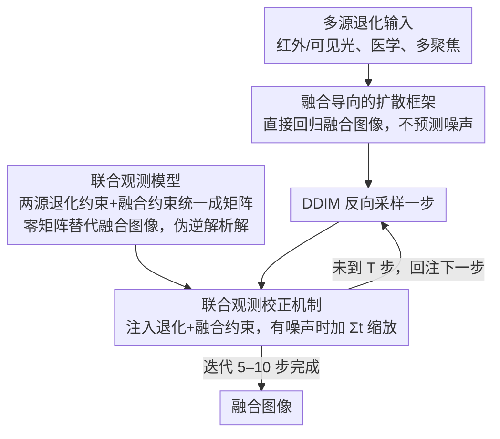

# DRFusion: Degradation-Robust Fusion via Degradation-Aware Diffusion Framework

**会议**: CVPR 2026  
**arXiv**: [2604.08922](https://arxiv.org/abs/2604.08922)  
**代码**: [https://github.com/YShi-cool/DRFusion](https://github.com/YShi-cool/DRFusion)  
**领域**: 图像融合 / 图像恢复  
**关键词**: multimodal image fusion, diffusion model, degradation-aware, joint observation model, image restoration

## 一句话总结

提出退化感知扩散框架 DRFusion，通过直接回归融合图像（而非显式预测噪声）和联合观测模型校正机制，在少量扩散步骤内实现任意退化场景下的多模态图像融合。

## 研究背景与动机

真实世界的图像融合面临噪声、模糊、低分辨率等退化挑战。传统"先恢复再融合"管线存在误差累积和部署复杂性。端到端神经网络方法简单高效但可解释性差。扩散模型理论基础强但存在三个固有限制：(1) 需要目标分布的训练数据，而融合缺乏自然的融合图像；(2) 标准扩散模型处理单域分布，融合需要建模多源互补信息；(3) 迭代采样计算成本高。

现有扩散融合方法要么只处理特定退化，要么依赖独立预训练的恢复模型，缺乏灵活统一的框架。

## 方法详解

### 整体框架

DRFusion 要在带噪声、模糊、低分辨率等退化的真实场景下做多模态图像融合，同时避开「先恢复再融合」管线的误差累积。它的做法是改造扩散模型：丢掉标准扩散里显式预测噪声的步骤、只保留反向过程，用有限几步扩散迭代直接从多源退化输入映射到融合输出，并在每一步迭代里插入一次联合观测校正，把退化约束和融合约束同时拉回来。

### 关键设计

**1. 融合导向的扩散框架：直接回归融合图像而非预测噪声**

标准扩散需要目标分布的训练数据，可融合任务本身没有「自然的融合图像」作监督。DRFusion 干脆不预测噪声，而是直接回归融合图像、把去噪隐含在中间表示里。这让框架接近端到端网络的灵活性，可以自监督地处理融合（无需融合标签），又只需少量扩散步骤就能得到高质量结果。

**2. 联合观测模型：把两源退化约束和融合约束统一成一个矩阵**

退化恢复和多模态融合本是两件事，分开做容易误差累积。DRFusion 把两个源图像各自的退化约束和融合约束统一写成矩阵形式，关键技巧是把融合图像所在的位置用零矩阵替代（因而不必预先拿到融合图像），并推导出联合退化矩阵伪逆的解析解——通过分别求解各子方程，绕开了直接计算高维伪逆。

**3. 联合观测校正机制：每步采样后同时注入两类约束**

把约束写成矩阵还不够，得在采样过程中真正用上。DRFusion 在每一步 DDIM 采样之后注入联合观测校正，迫使中间采样既对齐退化模型、又保留跨模态的互补信息；在有噪声时再加一个缩放因子 $\Sigma_t$ 控制校正强度。消融显示这一步对保持恢复精度至关重要。

### 损失函数 / 训练策略

融合权重由网络数据驱动学习（多任务架构同时预测噪声和权重图），并约束 $W_1 + W_2 = 1$；框架以此统一处理噪声、模糊、低分辨率及其任意组合等多种退化场景。

## 实验关键数据

### 主实验

| 融合任务 | 退化类型 | 本文 | 对比方法 | 说明 |
|---------|---------|------|---------|------|
| 红外-可见光融合 | 噪声+模糊 | 最优 | DeFusion, DDFM 等 | 退化鲁棒性强 |
| 医学图像融合 | 低分辨率 | 最优 | 多种方法 | 恢复+融合一体化 |
| 多聚焦融合 | 散焦模糊 | 有竞争力 | 多种方法 | 灵活适配 |

### 关键发现

- 在复杂退化场景下显著优于现有方法
- 少量扩散步骤（如 5-10 步）即可达到竞争性结果
- 联合观测校正对保持恢复精度至关重要
- 数据驱动的融合权重学习优于固定权重

## 亮点与洞察

- 联合观测模型将退化恢复和多模态融合统一为一个约束优化问题
- 伪逆的解析求解方法优雅避免了高维矩阵运算
- 去除显式噪声预测使框架在少步采样时仍高效
- 统一处理噪声、模糊、低分辨率及其任意组合

## 局限与展望

- 退化模型需要已知或可估计（退化算子 A 需显式给出）
- 扩散步数减少可能在某些极端退化下影响质量
- 融合权重的学习依赖于训练数据的代表性

## 相关工作与启发

- 与 DDNM 的伪逆约束思路类似，但扩展到多输入融合场景
- 为其他多输入图像处理任务提供了退化感知扩散的通用范式

## 评分

- 新颖性：⭐⭐⭐⭐ — 联合观测模型的退化感知扩散融合
- 技术深度：⭐⭐⭐⭐⭐ — 数学推导严谨，伪逆求解优雅
- 实验充分度：⭐⭐⭐⭐ — 多任务多退化类型验证
- 实用价值：⭐⭐⭐⭐ — 统一框架处理任意退化

<!-- RELATED:START -->

## 相关论文

- [\[CVPR 2026\] Degradation-Robust Fusion: An Efficient Degradation-Aware Diffusion Framework for Multimodal Image Fusion in Arbitrary Degradation Scenarios](degradation-robust_fusion_an_efficient_degradation-aware_diffusion_framework_for.md)
- [\[CVPR 2026\] From Events to Clarity: The Event-Guided Diffusion Framework for Dehazing](from_events_to_clarity_the_event-guided_diffusion_framework_for_dehazing.md)
- [\[CVPR 2026\] FAPE-IR: Frequency-Aware Planning and Execution Framework for All-in-One Image Restoration](fape-ir_frequency-aware_planning_and_execution_framework_for_all-in-one_image_re.md)
- [\[CVPR 2026\] MMDIR: Multimodal Instruction-Driven Framework for Mixed-Degradation Document Image Restoration](mmdir_multimodal_instruction-driven_framework_for_mixed-degradation_document_ima.md)
- [\[CVPR 2026\] NEC-Diff: Noise-Robust Event–RAW Complementary Diffusion for Seeing Motion in Extreme Darkness](nec-diff_noise-robust_event-raw_complementary_diffusion_for_seeing_motion_in_ext.md)

<!-- RELATED:END -->
