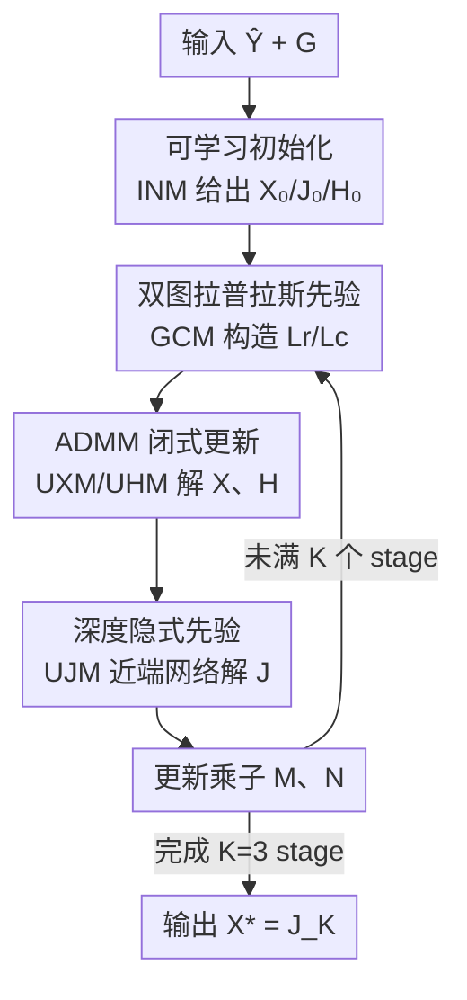

# Dual Graph Regularized Deep Unfolding Network for Guided Depth Map Super-resolution

**会议**: CVPR 2026  
**论文**: [CVF Open Access](https://openaccess.thecvf.com/content/CVPR2026/html/Zhong_Dual_Graph_Regularized_Deep_Unfolding_Network_for_Guided_Depth_Map_CVPR_2026_paper.html)  
**代码**: 无  
**领域**: 图像恢复 / 引导深度图超分 / 深度展开网络  
**关键词**: 引导深度超分, 双图拉普拉斯先验, 深度展开, ADMM, 可解释网络

## 一句话总结
本文提出 LapNet，把"行/列双图拉普拉斯先验 + 深度隐式先验"写进一个统一变分模型，用 ADMM 推出闭式更新后展开成可解释的多阶段网络，在把图构造复杂度从 $O(H^3W^3)$ 压到 $O(H^3+W^3)$ 的同时，以 3.84M 参数刷到引导深度超分（GDSR）的 SOTA。

## 研究背景与动机
**领域现状**：引导深度图超分（GDSR）是用对齐的高分辨率彩色图去引导、把低分辨率深度图恢复成高分辨率。传统做法把它写成带先验的优化问题（图拉普拉斯先验、Total Variation 等），可解释、可控，但手工先验表达力有限、迭代慢；近年深度学习方法精度高、灵活，但是黑箱，靠堆模块涨点，组件作用说不清。

**现有痛点**：为弥合"可解释"与"高性能"，已有混合方法把图优化塞进深度网络，但图构造本身是瓶颈——全连接图能抓全局依赖，但要对 $HW\times HW$ 的稠密拉普拉斯矩阵做乘法和求逆，复杂度高达 $O(H^3W^3)$；稀疏的局部邻域图虽快，却只能建模短程结构、感受野受限，且固定邻接模式只能吃固定分辨率。更糟的是很多方法把 2D 图像拉平成 1D 向量来建图，破坏了深度图天然的行列拓扑、丢几何细节。

**核心矛盾**：深度图最本质的性质是分段平滑（piecewise smooth，PWS）——平滑区被尖锐边界分隔，图拉普拉斯天然适合刻画它；但"在 2D 全图上建图"和"算得起 / 任意分辨率"之间存在硬冲突。

**本文目标**：要一个既保留 2D 拓扑、又算得起、还支持任意输入分辨率的图正则化方式，并把它和数据驱动先验融进同一个可解释框架。

**切入角度**：作者观察到，与其在整张图上学逐像素相似度，不如把结构依赖**沿行、列两个方向分别建模**——行子空间和列子空间各自的相似图远小于全局图，尺寸随分辨率线性而非平方增长。

**核心 idea**：用"行图 + 列图"的双图拉普拉斯先验替代单个全局图，把它与深度隐式先验一起写进统一变分模型，再用 ADMM 展开成多阶段网络，实现可解释 + 高效 + 高精度三者兼顾。

## 方法详解

### 整体框架
LapNet 的输入是双三次上采样到目标尺寸的低分深度图 $\hat{Y}\in\mathbb{R}^{H\times W}$ 和高分彩色引导图 $G\in\mathbb{R}^{H\times W\times C}$，输出是重建的高分深度图 $X$。它的整条管线由一个统一变分目标驱动：

$$\min_X \|Y-DX\|_F^2 + \lambda\,\mathrm{tr}(X^\top L_r X) + \alpha\,\mathrm{tr}(X L_c X^\top) + \beta f(X,G)$$

其中第一项是数据保真（$D$ 是下采样退化算子），中间两项是行/列双图拉普拉斯正则，最后一项 $f(X,G)$ 是从引导图提取高频结构的深度隐式先验。作者引入辅助变量 $J=X$、$H=X$ 解耦各项，用 ADMM 得到每个子问题的闭式解，再把"一次 ADMM 迭代"对应成网络的"一个 stage"，共 $K=3$ 个 stage 串行展开。每个 stage 内部按固定顺序跑五个模块：先由**初始化模块（INM）**给出 $X_0,J_0,H_0$，之后每 stage 由**图构造模块（GCM）**从当前 $X_t$ 动态构造 $L_r,L_c$，**更新 X / 更新 H 模块（UXM/UHM）**走闭式解注入图正则，**更新 J 模块（UJM）**用轻量 U-Net 注入引导图高频先验，最后更新拉格朗日乘子进入下一 stage，末端取 $X^*=J_K$。

### 关键设计

**1. 双图拉普拉斯先验：把全局图拆成行图 + 列图，PWS 不丢但算得起**

这是全文的核心，直接针对"全局图算不起、稀疏图看不远、拉平丢拓扑"三连痛点。传统图正则在 $S(x)=\tfrac12\sum_{i,j}w_{ij}(x_i-x_j)^2=x^\top L x$ 上做文章，需要 $HW\times HW$ 的拉普拉斯 $L=D-W$。作者改为分别在行子空间和列子空间建相似图 $S_r\in\mathbb{R}^{H\times H}$、$S_c\in\mathbb{R}^{W\times W}$，正则项写成

$$\tfrac12\sum_{i,j}\|X_i-X_j\|_2^2 (S_r)_{ij} + \tfrac12\sum_{i,j}\|(X^\top)_i-(X^\top)_j\|_2^2 (S_c)_{ij}$$

由 Lemma 1，它等价于紧凑的迹形式 $\mathrm{tr}(X^\top L_r X)+\mathrm{tr}(X L_c X^\top)$，其中 $L_r=U_r-S_r$、$L_c=U_c-S_c$（$U_r,U_c$ 为度矩阵）。因为 $X$ 保持成 2D 矩阵、$L_r$ 左乘约束行、$L_c$ 右乘约束列，整张图的分段平滑被两个方向的低维矩阵共同刻画，复杂度从 $O(H^3W^3)$ 降到 $O(H^3+W^3)$；又因为图尺寸只跟 $H$ 或 $W$ 线性相关、不依赖固定邻接，模型天然支持任意输入分辨率。相比把图像拉平成 1D 向量再建图的旧法，这里完整保住了行列拓扑。

**2. 深度隐式先验：用近端网络从引导图补手工先验抓不到的高频结构**

双图拉普拉斯擅长平滑约束，但对引导图里精细的高频结构（薄物体、纹理边）刻画不足，于是作者补一个数据驱动的隐式先验项 $\beta\cdot f(X,G)$。在 ADMM 中引入辅助变量 $J=X$ 后，$J$ 子问题 $\min_J \tfrac{\mu}{2}\|X_{t+1}-J+\tfrac{M_t}{\mu}\|_F^2+\beta f(J,G)$ 的解恰好是一个近端算子 $J_{t+1}=\mathrm{Prox}(X_{t+1}+\tfrac{M_t}{\mu},G)$。作者把这个 Prox 实现成轻量 U 形网络（UJM）：先用 Fuse Block 把当前重建 $X_t$ 和引导图 $G$ 融合，再过近端网络细化输出 $J$。为减少跨迭代的信息损失，还加了细粒度特征传播——把上一 stage 的解码器特征 $F_{k-1}$ 和重建 $X_k$ 一起喂给当前 stage 编码器。这样"显式图正则负责结构平滑、隐式深度先验负责高频细节"，两者互补。

**3. 统一变分 + ADMM 闭式求解：让每一步都有解析解，可解释且高效**

把数据保真、双图正则、深度隐式先验塞进一个目标后，作者用 ADMM 引入 $J=X$、$H=X$ 两个约束与乘子 $M,N$，得到增广拉格朗日 $\Phi_\mu$，再交替求解三个变量。$X$ 子问题合并了数据保真、行图正则 $\lambda L_r$ 和两个等式约束的二次项，可解出闭式

$$X_{t+1}=(D^\top D+\lambda L_{r,t}+\mu I_r)^{-1}\Big(D^\top Y+\tfrac{\mu_t}{2}(J_t+H_t-\tfrac{M_t+N_t}{\mu_t})\Big)$$

$H$ 子问题承接列图正则 $\alpha L_c$，闭式解为 $H_{t+1}=(\mu X_{t+1}+N_t)(\mu I_c+2\alpha L_{c,t+1})^{-1}$；$J$ 子问题如设计 2 落到近端网络；最后乘子按 $M_{t+1}=M_t+\mu(X_{t+1}-J_{t+1})$、$N_{t+1}=N_t+\mu(X_{t+1}-H_{t+1})$ 更新（Algorithm 1）。注意行正则压在 $X$ 更新、列正则压在 $H$ 更新，正好把两个方向的拉普拉斯拆到两个只需求逆 $H\times H$ 或 $W\times W$ 小矩阵的子问题里——这是复杂度能降下来的实操关键。每一步都有解析解，意味着展开后网络的每个模块都对应优化算法里的一步，可解释性来自此处。

**4. 可学习初始化的深度展开：把 ADMM 迭代逐 stage 解卷成网络，端到端学初值与权重**

为兼得迭代优化的可解释和深度学习的拟合力，作者把上面 $K$ 步 ADMM 解卷（unfold）成 $K$ 个网络 stage（最终取 $K=3$），五个模块（INM/GCM/UXM/UHM/UJM）一一对应算法步骤。三处把"经典算法的常量"换成"可学习量"是涨点关键：① INM 不再用 bicubic 当初值，而是融合 $\hat{Y}$ 与 $G$ 学出 $X_0,J_0,H_0$；② 惩罚/平衡参数 $\alpha,\lambda,\beta$ 不固定为 1，而是反传学习（训练中观察到 $\beta$ 下降以抑制近端项、$\lambda/\alpha$ 上升以加强图正则，自适应平衡保真与结构）；③ GCM 里的相似度（$L_2$ 距离、$\sigma$ 自适应学习）也是动态的——每个 stage 用当前 $X_t$ 重新构图，而非只在 $X_0$ 上构一次静态图。各 stage 采用非共享参数，让每一步学到不同的变换。

### 损失函数 / 训练策略
仅用 L1 loss 监督重建深度与 GT 的差异。展开迭代数 $K=3$，近端网络 24 个特征通道（轻量变体 LapNet-T 用 8 通道）；PyTorch 实现，2 张 RTX 5090 训练；评测指标为 RMSE。

## 实验关键数据

### 主实验
在 6 个数据集、3 个放大倍率（4×/8×/16×）上比 RMSE（越低越好）。LapNet 几乎全面拿到最优，平均 RMSE 在三个倍率上均居首：

| 方法 | NYU v2 16× | DIDOE 16× | RGB-D-D 16× | 平均 4× | 平均 8× | 平均 16× |
|------|-----------|-----------|-------------|---------|---------|----------|
| SGNet（次优） | 4.77 | 8.31 | 2.55 | 1.70 | 2.92 | 4.52 |
| DCNAS | 5.06 | 8.36 | 2.61 | 1.72 | 2.99 | 4.60 |
| DORNet | 5.60 | 9.18 | 3.35 | 1.87 | 3.26 | 5.29 |
| **LapNet** | **4.55** | **8.24** | **2.45** | **1.64** | **2.82** | **4.39** |

关键不在绝对差距，而在效率：LapNet 仅 **3.84M** 参数，次优的 SGNet 要 **25.33M**，约 1/6.6 的体量却更准。真实世界 RGB-D-D 数据集上优势更明显：

| 方法 | DCNAS | SFG | DORNet | **LapNet** |
|------|-------|-----|--------|-----------|
| RMSE↓ | 4.87 | 3.88 | 3.42 | **3.25** |

定性上，LapNet 在椅背、桌腿等细结构更锐、更少把 RGB 纹理"拷贝"进平滑深度区。

### 消融实验
在 NYU v2 8× 上做四组消融（RMSE 越低越好）：

| 配置 | NYU v2 | Sintel | DIDOE | 说明 |
|------|--------|--------|-------|------|
| **LapNet（完整）** | **2.33** | **5.05** | **5.51** | 可学初值 + 可学惩罚 + L2 动态双图 + 深度先验 |
| Model3 | 2.52 | 5.26 | 5.78 | 用点积相似度替代 L2 |
| Model4 | 2.60 | 5.24 | 5.73 | 静态图（只在 $X_0$ 构一次） |
| Model5 | 2.63 | 5.31 | 5.87 | 去掉行图 |
| Model6 | 2.57 | 5.28 | 5.81 | 去掉列图 |
| Model7 | 3.01 | 5.87 | 6.34 | 用固定 guided filter 替换可学近端网络 |

> 初始化消融（Model1：初值=bicubic 且惩罚固定为 1；Model2：仅初值可学）以折线图给出（Fig. 6b），结论为 LapNet < Model2 < Model1，故未列入上表数值。

### 关键发现
- **深度隐式先验贡献最大**：Model7（把可学近端网络换成固定 guided filter）从 2.33 掉到 3.01，是所有消融里掉得最狠的，说明数据驱动的高频先验不可或缺。
- **行图、列图互补缺一不可**：去掉任一方向（Model5/Model6）都明显掉点（2.33→2.63/2.57），印证行列先验各抓一类结构线索。
- **动态图 > 静态图、L2 > 点积**：每 stage 用当前估计重新构图（vs Model4 静态）、L2 距离（vs Model3 点积，更尺度不变）都更优。
- **迭代数 3 是甜点**：1→3 稳步降 RMSE，超过 3 仅边际下降；非共享参数比共享更准（代价是参数量上升），作者选非共享。
- **惩罚参数自适应演化**：训练中 $\beta$ 降（抑制近端项）、$\lambda/\alpha$ 升（强化图正则），自动在保真与结构间平衡。

## 亮点与洞察
- **把"全局图"拆成"行图×列图"是核心巧思**：一个矩阵分解直接把 $O(H^3W^3)$ 砍到 $O(H^3+W^3)$，还顺带解决了"固定分辨率"和"拉平丢拓扑"两个老问题——一招破三难。
- **ADMM 闭式解天然映射成可解释模块**：每个 stage 的每个子模块都对应算法一步，可解释性不是事后强加，而是从优化推导里长出来的；同时把行正则压 $X$、列正则压 $H$，让两次求逆都只在小矩阵上做。
- **"显式手工先验 + 隐式深度先验"互补范式可迁移**：显式图正则管全局平滑、隐式近端网络管高频细节，这种分工对任何"既要结构约束又要细节恢复"的恢复任务（如图像去噪、引导滤波）都有借鉴价值。
- **可学习初值 + 可学惩罚参数**把展开网络里常被当常量的部分也端到端优化，消融显示这部分实打实涨点，提示展开类方法别浪费"超参可学"这块红利。

## 局限性 / 可改进方向
- **求逆仍是潜在瓶颈**：虽然降到 $O(H^3+W^3)$，但 UXM/UHM 仍要对 $H\times H$、$W\times W$ 矩阵求逆，超高分辨率下 $H,W$ 很大时这一项会重新变贵，作者未给出超高分场景的耗时分析。
- **行列分解的隐含假设**：把结构依赖拆成纯行向 + 纯列向，对斜向/曲线边界这类不沿坐标轴的结构是否会欠建模，论文未单独分析（⚠️ 为笔者推断，以原文为准）。
- **非共享参数换性能**：迭代数增多时非共享策略参数量上涨，效率—精度权衡只能靠固定 $K=3$ 折中，自适应决定每图迭代步数是可探索方向。
- **仅 L1 + RMSE 评估**：未报告 SSIM/边界保持等结构指标，对"抑制纹理拷贝"的定量度量主要靠定性图。

## 相关工作与启发
- **vs LGR [34] / 其他图优化混合法**：他们多用全连接图（$O(H^3W^3)$、抓全局但算不起）或局部稀疏图（快但短程、固定分辨率），且常拉平成 1D；本文用行列双图保 2D 拓扑、线性增长、任意分辨率，效率与精度双赢。
- **vs SGNet [53]（次优）**：SGNet 精度接近但 25.33M 参数；LapNet 3.84M 参数更准更轻，胜在展开式结构的紧凑可解释。
- **vs 纯黑箱深度法（DKN/FDSR/DORNet 等）**：它们靠堆模块涨点、组件作用不透明；本文每个模块对应 ADMM 一步，兼得可解释与 SOTA。
- **启发**：当一个先验作用在 2D 信号的"全局图"上时，先想想能不能沿坐标轴分解成低维子图——往往能在几乎不损表达力的前提下指数级降复杂度。

## 评分
- 新颖性: ⭐⭐⭐⭐⭐ 行列双图拉普拉斯分解 + 深度展开，把复杂度从 $O(H^3W^3)$ 降到 $O(H^3+W^3)$，思路干净有效。
- 实验充分度: ⭐⭐⭐⭐ 6 数据集 ×3 倍率 + 四组消融充分，但仅 RMSE 单指标、缺超高分耗时与结构指标。
- 写作质量: ⭐⭐⭐⭐⭐ 从动机到变分建模到 ADMM 闭式解到展开网络，推导链条完整、模块对应清晰。
- 价值: ⭐⭐⭐⭐⭐ 3.84M 参数刷 SOTA，可解释 + 高效，对引导深度超分及更广的展开式恢复有实用与方法论价值。

<!-- RELATED:START -->

## 相关论文

- [\[CVPR 2026\] Beyond Single Solution: Multi-Hypothesis Collaborative Deep Unfolding Network for Image Compressive Sensing](beyond_single_solution_multi-hypothesis_collaborative_deep_unfolding_network_for.md)
- [\[CVPR 2026\] Spectral Super-Resolution via Adversarial Unfolding and Data-Driven Spectrum Regularization](spectral_super-resolution_via_adversarial_unfolding_and_data-driven_spectrum_reg.md)
- [\[AAAI 2026\] SpatioTemporal Difference Network for Video Depth Super-Resolution](../../AAAI2026/image_restoration/spatiotemporal_difference_network_for_video_depth_super-resolution.md)
- [\[CVPR 2026\] RawMetaDiff: Unlocking Extreme Darkness from Dual-Exposure RAW with Meta-Guided Diffusion](rawmetadiff_unlocking_extreme_darkness_from_dual-exposure_raw_with_meta-guided_d.md)
- [\[CVPR 2026\] Time-Aware One Step Diffusion Network for Real-World Image Super-Resolution](time-aware_one_step_diffusion_network_for_real-world_image_super-resolution.md)

<!-- RELATED:END -->
