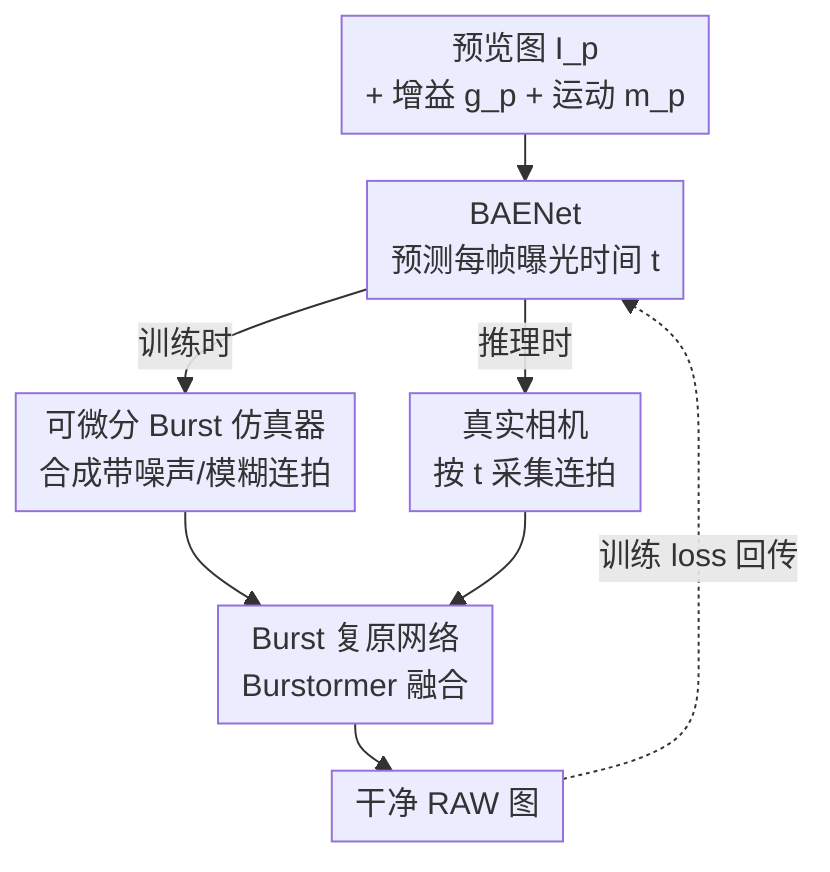

# Dynamic Exposure Burst Image Restoration

**会议**: CVPR 2026  
**论文**: [CVF Open Access](https://openaccess.thecvf.com/content/CVPR2026/html/Kim_Dynamic_Exposure_Burst_Image_Restoration_CVPR_2026_paper.html)  
**代码**: 无（仅复用 [Burstormer](https://github.com/akshaydudhane16/Burstormer) 作为复原骨干）  
**领域**: 图像复原 / 计算摄影  
**关键词**: Burst 图像复原, 自动曝光, 可微分仿真, 低光成像, 非均匀曝光

## 一句话总结
DEBIR 第一次把"为每张连拍帧预测最优曝光时间"作为一个可学习模块塞进 burst 复原流程：用 BAENet 根据预览图、增益和运动幅度预测每帧曝光时间，再用一个对曝光时间可微的 burst 仿真器把它和复原网络端到端连起来训练，在低光场景下复原 PSNR 比固定曝光档位高 0.28 dB，并在真实双相机系统上验证有效。

## 研究背景与动机
**领域现状**：连拍（burst）成像是手机/相机在低光高噪声场景拿高质量图的主流手段——连拍多张、利用噪声的随机性融合出一张干净图。近年的工作（DBSR、BIPNet、Burstormer、Mehta 等）几乎都在卷"对齐+融合"算法，网络越做越强。

**现有痛点**：所有这些方法都默认一件事——连拍各帧用**同一套曝光设置**（相同曝光时间 + 增益）。结果是每帧噪声水平、模糊程度都差不多，帧与帧之间几乎没有"互补信息"，融合能榨出的增益就被卡住了。少数用非均匀曝光的方法（如曝光包围 exposure bracketing）虽然各帧曝光不同，但用的是**预先固定的档位**（如 {8,24,40,56}/1920 秒），换个场景就不一定合适。

**核心矛盾**：曝光时间 $t$ 和增益 $g$ 之间存在 trade-off——长曝光提高信噪比（SNR）但运动会糊；短曝光不糊但要靠拉高增益压时间、噪声被放大。静态场景该偏长曝光压噪，动态场景该偏短曝光防糊。**最优曝光取决于具体拍摄环境，而固定档位天然做不到自适应。**

**本文目标**：(1) 给每张连拍帧自适应地预测一个最优曝光时间；(2) 让"预测曝光"这件事直接以"最终复原质量"为优化目标，而不是凭经验设档位。

**切入角度**：作者注意到现代相机在按下快门前已经有一段实时**预览（preview）流**，预览图本身就携带了场景的噪声分布、内容、以及帧间运动信息。于是可以在按快门那一刻、用预览信息预测好这一串连拍各自的曝光时间。

**核心 idea**：用一个轻量网络 BAENet 把"预览图 + 增益 + 运动幅度"映射到"每帧曝光时间"，并造一个**对曝光时间可微**的 burst 仿真器，使得复原 loss 的梯度能一路回传到曝光预测网络——从而第一次实现"用复原损失直接监督曝光预测"。

## 方法详解

### 整体框架
DEBIR 的输入是按快门前的一张预览 RAW 图（连同它的增益 $g_p$ 和相对上一预览帧的运动幅度 $m_p$），输出是一张干净的 RAW 图。它假设一种现代相机常见的成像场景：拍照前先有实时预览流并对场景做了自动曝光（AE）估出目标曝光值 $e$。流程是：

1. 用户按下快门 → **BAENet** 从预览信息预测 $n$ 帧的曝光时间 $\mathbf{t}=\{t_1,\dots,t_n\}$；各帧增益由 $g_i = ke/t_i$ 反算，保证所有帧**亮度一致但噪声/模糊水平不同**（这样才能互补）。
2. 成像系统按预测的 $(t_i, g_i)$ 真实采集 $n$ 张 RAW 连拍帧。
3. **复原网络**把这 $n$ 张 RAW 融合成一张干净 RAW。

关键难点在训练：要监督 BAENet，理论上需要"某场景下哪串曝光时间能得到最好复原结果"这种 ground-truth 曝光序列，而这要把所有曝光组合都拍一遍并和干净图对比，实际不可行。作者的解法是用一个**可微分 burst 仿真器**在训练时**替代真实相机**：BAENet 给曝光时间 → 仿真器合成带真实噪声/模糊的连拍 → 复原网络复原 → 和干净图算 loss → 梯度穿过仿真器回传到 BAENet。推理时仿真器被拿掉，换成真相机。

### 关键设计

**1. BAENet：用预览信息预测每帧曝光时间，并用 bounded softmax 约束曝光预算**

这是 DEBIR 区别于一切固定档位方法的核心。BAENet 吃三样输入：预览 RAW 图 $I_p$、它的增益 $g_p$、运动幅度 $m_p$（定义为 $I_p$ 与上一预览帧 $I_p'$ 之间光流向量的平均模长，光流在 sRGB 域用现成估计器算）。三者各管一摊——$g_p$ 反映当前噪声水平（增益越大噪声越大）、$m_p$ 反映相机/物体运动（决定模糊风险）、$I_p$ 提供前两者刻画不了的细节噪声/模糊分布和场景内容。网络骨干用轻量的 MobileNetV2，把 $g_p$、$m_p$ 沿通道拼到 $I_p$ 上喂进去（两者数值尺度差很大，先 shift+scale 归一化到 $[0,1]$）。

直接让网络预测任意长曝光时间会因为搜索空间无界而训练不稳。作者的做法是约束曝光总预算 $\sum_i t_i \le t_u$：把 MobileNetV2 最后一层改成输出 $n+1$ 维，过一个 bounded softmax 使各元素为正且和为 1，再把前 $n$ 个元素乘以上界 $t_u$ 得到各帧曝光时间，第 $n+1$ 个元素则吸收"用不满预算"的余量：

$$t_i = t_u \cdot \mathrm{softmax}_{\mathrm{bounded}}(f_i, \epsilon)$$

其中 $f_i$ 是 bounded softmax 前的特征值，输出被夹在 $[\epsilon, 1-n\epsilon]$，$\epsilon = t_{\min}/t_u$（$t_{\min}=1/240$ 秒是系统最小曝光时间）。这样既保证了每帧曝光为正、又把曝光预算固定住，训练稳定且天然支持任意帧数 $n$。

**2. 可微分 Burst 仿真器：让复原 loss 的梯度能穿过"曝光时间"回传**

这是让"用复原损失监督曝光预测"成为可能的关键工程。仿真器是个**无可学习参数**的模块，给定曝光时间 $\mathbf{t}$、增益 $\mathbf{g}$ 和一段场景辐照序列 $\mathbf{S}$（用高帧率 RAW 视频帧表示，每帧对应曝光时长 $e_S=1/1920$ 秒），合成出带真实模糊和噪声的连拍。它先算每帧的曝光起止时刻 $t_i^s, t_i^e$（首帧从常数 $t^0$ 起，后续帧 $t_i^s = t_{i-1}^e + \delta$，帧间隔 $\delta=7/1920$ 秒，$t_i^e = t_i^s + t_i$），再按下式合成第 $i$ 帧：

$$\mathrm{syn}(\mathbf{S}, t^s, t^e, g) = \mathrm{clip}\circ \mathrm{cfa}\left(S_{s,e} + gN\right)$$

模糊来自把曝光时段内的辐照积分起来 $S_{s,e}$（曝光越长积进去的运动越多→越糊），积分的端点用线性插值权重 $\alpha_s = \lceil\bar t^s\rceil - \bar t^s$、$\alpha_e = \bar t^e - \lfloor\bar t^e\rfloor$ 做软混合，使 $S_{s,e}$ 对**连续**的曝光时间可微（$\bar t = t/e_S$）。噪声 $N$ 用异方差高斯 $\mathcal{N}(0, \lambda_{\mathrm{read}} + \lambda_{\mathrm{shot}}S_{s,e})$ 建模 shot/read 噪声，但采样不可导，所以用重参数化技巧改写成 $N = \sqrt{\lambda_{\mathrm{read}} + \lambda_{\mathrm{shot}}S_{s,e}}\cdot Z,\ Z\sim\mathcal{N}(0,1)$，让 $N$ 对 $S_{s,e}$（进而对 $\mathbf{t}$）可导。

相比真实退化模型（式 2），仿真器有两处刻意简化：① 去掉量化以保证梯度非零；② 不放大场景辐照、只按增益放大噪声 $N$——因为框架假设各帧增益与曝光时间成反比，亮度相同而噪声水平不同，这正是"互补信息"的来源。预览图和 ground-truth（取首帧的清晰辐照 $I_{gt}=\mathrm{cfa}(S_{\bar t^0})$）也都由同一个仿真器合成。

**3. 三阶段交替训练：破解 BAENet 与复原网络相互依赖导致的训练崩溃**

虽然可微仿真器允许端到端训练，但从零开始联合训练 BAENet 和复原网络极不稳定、易陷局部极小：初期 BAENet 乱给曝光，复原网络会过早去适应这些烂曝光，这种偏置又反过来"锁死"BAENet 去迎合复原网络的当前能力而非真正最优。作者拆成三阶段：

- **S1 预训练复原网络**：用随机采样的曝光时间和增益合成连拍，让复原网络先学会处理各种曝光的输入，loss 为 $\mathcal{L}_{\mathrm{restore}} = \|\mathrm{res}_\phi(\mathbf{I}) - I_{gt}\|_1$。
- **S2 训练 BAENet**（固定复原网络），又分两小步：**warm-up**（S2-1）先用预定义曝光组合集 $E$ 逐一仿真+复原、选复原最好的那组当伪 ground-truth $\mathbf{t}_{\mathrm{pseudo\text{-}gt}}$，以 $\mathcal{L}_{\mathrm{warm\text{-}up}} = \|\mathrm{bae}_\theta(I_p,g_p,m_p) - \mathbf{t}_{\mathrm{pseudo\text{-}gt}}\|_1$ 把 BAENet 拉到合理初值；**主训练**（S2-2）再用真正的复原 loss $\mathcal{L}_{\mathrm{DEBIR}} = \|\mathrm{res}_\phi(\mathrm{sim}(\mathrm{bae}_\theta(I_p,g_p,m_p))) - I_{gt}\|_1$ 微调曝光预测。
- **S3 微调复原网络**（固定 BAENet）：再用 $\mathcal{L}_{\mathrm{DEBIR}}$ 让复原网络适配 BAENet 给出的最优曝光分布。

为防止跨阶段过拟合，训练集 $D$ 被切成不重叠的 $D_{\mathrm{restore}}$（4092 段）和 $D_{\mathrm{BAENet}}$（1127 段），避免复原网络对 S1 见过的"曝光-连拍"组合产生偏好而污染 S2 的 BAENet。

### 损失函数 / 训练策略
三个阶段对应三个 L1 损失（见上：$\mathcal{L}_{\mathrm{restore}}$ / $\mathcal{L}_{\mathrm{warm\text{-}up}}$ / $\mathcal{L}_{\mathrm{DEBIR}}$）。复原网络预训练 500 epoch（lr 3e−4），BAENet 训练 100 epoch（lr 1e−7，含 35 epoch warm-up），复原网络微调 50 epoch（lr 1e−5），均用 cosine annealing + AdamW。默认曝光上界 $t_u=128/1920$ 秒、burst 帧数 $n=4$，4×RTX 3090、batch=4、256×256 训练。训练数据从 GoPro（含运动）和 RealBlur（静态场景）视频经 gamma 展开 + 随机逆 CCM/WB 转到 RAW、再 8× 帧插值到 1920 FPS 合成，共 5219 段训练 + 532 段评测。

## 实验关键数据

### 主实验
测试集上与各类自动曝光/预定义曝光方法对比（均接 Burstormer 复原、同样的预训练+微调流程，公平起见）：

| 方法 | PSNR↑ | SSIM↑ | LPIPS↓ |
|------|-------|-------|--------|
| Digital-Gimbal | 33.87 | 0.9309 | 0.187 |
| Active S-L | 33.89 | 0.9379 | 0.176 |
| Average AE | 34.69 | 0.9484 | 0.157 |
| Gradient AE | 34.86 | 0.9494 | 0.156 |
| Exposure Bracket（固定档位） | 35.04 | 0.9481 | 0.164 |
| **DEBIR（本文）** | **35.32** | **0.9519** | **0.154** |

单曝光的 Average/Gradient AE 各帧噪声模糊一致、缺互补信息；固定曝光包围虽非均匀但无法随场景自适应；Digital-Gimbal 的曝光参数训练后就冻死、Active S-L 只能处理两帧不可扩展。DEBIR 按场景逐帧预测曝光，复原质量最优。

真实双相机系统（一相机用 BAENet、一相机用曝光包围，同时采集 142 张低光连拍，无参考指标评测）：

| 方法 | NIQE↓ | BRISQUE↓ | TOPIQ↑ |
|------|-------|----------|--------|
| Exposure Bracket | 6.57 | 50.66 | 0.339 |
| **DEBIR（本文）** | **6.34** | **46.90** | **0.363** |

BAENet 含光流估计的推理仅 0.023 秒，证明实用性。

### 消融实验

| 配置 | PSNR↑ | 说明 |
|------|-------|------|
| Full（preview+gain+motion） | 35.32 | 完整输入 |
| w/o Preview Image | 34.80 | 去预览图掉最多（-0.52） |
| w/o Motion Info. | 35.13 | 去运动信息（-0.19） |
| w/o Gain | 35.21 | 去增益（-0.11） |

训练策略消融（S1 预训练复原 / S2-1 warm-up / S2-2 主训练 BAENet / S3 微调复原 / E2E 端到端）：

| 训练策略 | PSNR↑ | SSIM↑ | LPIPS↓ |
|----------|-------|-------|--------|
| S1, S2-2 | 34.93 | 0.9482 | 0.162 |
| S1, S2-1, S2-2 | 35.01 | 0.9489 | 0.160 |
| S1, S2-2, S3 | 35.16 | 0.9502 | 0.157 |
| **S1, S2-1, S2-2, S3（完整）** | **35.32** | **0.9519** | **0.154** |
| E2E（纯端到端） | 33.60 | 0.9279 | 0.196 |

### 关键发现
- **预览图是最关键输入**：去掉它掉 0.52 dB，因为它一图涵盖噪声分布、模糊、内容；运动信息比增益更重要（-0.19 vs -0.11）。
- **训练策略至关重要**：纯端到端只有 33.60 dB，比完整三阶段低近 1.7 dB，印证了"BAENet 与复原网络相互依赖会崩"的分析；warm-up（S2-1）和复原网络微调（S3）各自都带来可观增益。
- **非均匀曝光确有价值**：把 BAENet 改成预测单一曝光统一施加，PSNR 从 35.32 掉到 35.01（-0.31 dB）。
- **BAENet 的预测符合物理直觉**：运动 $m_p$ 越大，首帧 $t_1$ 越短以防糊；增益 $g_p$ 越大（噪声越大）则 $t_1$ 拉长以压噪；并且 BAENet 会让相邻帧曝光朝相反方向调（如 $t_1$ 短防糊、$t_2$ 长补色彩/降噪），主动制造互补信息。
- **可扩展到任意帧数**：$n=2,4,6,8$ 下 DEBIR 全面优于固定曝光包围（如 $n=8$ 时 36.11 vs 35.89），帧数越多增益越大。

## 亮点与洞察
- **把"曝光设置"从手工超参变成可学习模块**：以往 burst 复原都在卷网络结构、把曝光当固定前提，本文第一个用复原损失直接监督曝光预测，是问题视角的转换——"先决定怎么拍，再决定怎么修"。
- **可微分 burst 仿真器是整篇的技术枢纽**：用线性插值让积分端点对连续曝光时间可微、用重参数化让噪声采样可微，两个小技巧合起来才让梯度能穿过"曝光时间"这个本来离散/物理的量回传，这个思路可迁移到任何"想学习物理采集参数"的成像任务（如学习快门、ISO、对焦）。
- **bounded softmax 约束曝光预算**很优雅：把"曝光总预算固定 + 各帧为正 + 可留余量"三件事用一个 $n+1$ 维 softmax 解决，且天然支持任意帧数。
- **主动制造互补信息的洞察**：BAENet 学到的不是"每帧都拍最好"，而是让相邻帧曝光互补（一帧防糊、一帧降噪），这比单帧最优更符合 burst 融合的本质。

## 局限与展望
- 作者承认 BAENet 不保证给出全局最优曝光——它在"图还没拍、信息有限"的前提下预测，且有陷入局部极小的风险，穷举搜索原则上能找到更好组合。
- 仅针对**低光 RAW** 场景设计与验证；亮光、HDR、或非 Bayer 传感器是否适用未验证。⚠️ 真实系统评测只有 142 张、且用无参考指标，样本量和评测严谨度有限。
- 仿真器依赖把视频经逆 ISP 转 RAW 来造训练数据，sim-to-real gap 可能影响真实场景表现（论文用双相机系统部分缓解了这点）。
- 展望：作者提出可进一步**联合预测曝光时间与 burst 帧数**，并把功耗等实际约束纳入优化目标。

## 相关工作与启发
- **vs 均匀曝光 burst 复原（DBSR / BIPNet / Burstormer）**：它们假设各帧同曝光、只卷对齐融合；本文复用 Burstormer 当复原骨干，但在它前面加了自适应曝光预测，把性能瓶颈从"融合算法"挪到了"采集策略"。
- **vs 固定档位非均匀曝光（曝光包围 / Zhang 等）**：都用非均匀曝光，但本文是按场景动态预测而非固定档位，消融显示动态比固定高 0.28 dB（35.32 vs 35.04）。
- **vs 学习型曝光预测（Digital-Gimbal / Active S-L / Liba motion metering）**：Digital-Gimbal 的曝光参数训练后冻死、不随场景变；Active S-L 把曝光当分类、预定义集随帧数指数膨胀且只支持两帧；Liba 用 motion metering 但假设均匀曝光。本文逐帧预测连续曝光、随场景自适应、可扩展到任意帧数，是这条线上更彻底的解法。

## 评分
- 新颖性: ⭐⭐⭐⭐⭐ 第一个用复原损失直接监督逐帧曝光预测，可微 burst 仿真器是真正的新工具
- 实验充分度: ⭐⭐⭐⭐ 对比 baseline 全、消融到位、有真实相机验证；但真实评测样本量小、缺主流 burst benchmark 上的横向对比
- 写作质量: ⭐⭐⭐⭐⭐ 动机—难点—解法逻辑清晰，公式和训练策略交代完整
- 价值: ⭐⭐⭐⭐ 给计算摄影提供"学习采集参数"的可微范式，工业落地潜力明确，但增益幅度（约 0.3 dB）相对温和

<!-- RELATED:START -->

## 相关论文

- [\[CVPR 2026\] Self-supervised Dynamic Heterogeneous Degradation Modeling for Unified Zero-Shot Image Restoration](self-supervised_dynamic_heterogeneous_degradation_modeling_for_unified_zero-shot.md)
- [\[CVPR 2026\] ExpoCM: Exposure-Aware One-Step Generative Single-Image HDR Reconstruction](expocm_exposure-aware_one-step_generative_single-image_hdr_reconstruction.md)
- [\[CVPR 2026\] Flickerformer: A Duet of Periodicity and Directionality for Burst Flicker Removal](it_takes_two_a_duet_of_periodicity_and_directionality_for_burst_flicker_removal.md)
- [\[CVPR 2026\] RawMetaDiff: Unlocking Extreme Darkness from Dual-Exposure RAW with Meta-Guided Diffusion](rawmetadiff_unlocking_extreme_darkness_from_dual-exposure_raw_with_meta-guided_d.md)
- [\[CVPR 2026\] Human-Centric Multi-Exposure Fusion: Benchmark and Bi-level Cognition Distillation Framework](human-centric_multi-exposure_fusion_benchmark_and_bi-level_cognition_distillatio.md)

<!-- RELATED:END -->
