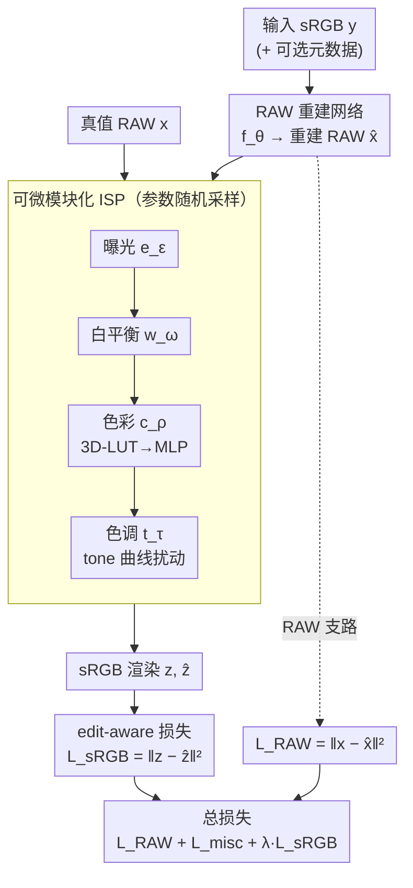

# Edit-aware RAW Reconstruction

**会议**: CVPR2026  
**arXiv**: [2512.05859](https://arxiv.org/abs/2512.05859)  
**代码**: 待确认  
**领域**: 图像恢复 / ISP / RAW 重建  
**关键词**: RAW 重建, 可微 ISP, 编辑感知损失, 照片后期, 即插即用损失

## 一句话总结
针对"RAW 重建的真实目的是后期编辑、而现有方法只优化逐像素 RAW 保真度"的错配，本文提出一个即插即用的 **edit-aware loss**——用一个可微、模块化、参数随机采样的简化 ISP 把真值 RAW 与重建 RAW 都渲染到 sRGB 再算误差，使重建结果在各种渲染风格/编辑下更鲁棒，在多种编辑条件下 sRGB PSNR 提升最高 1.5–2 dB。

## 研究背景与动机

**领域现状**：消费摄影里用户拍完照后常在相册里做后期，以获得自己偏好的照片风格。Gallery 图是相机板载 ISP 把 RAW 渲染成的最终成片。RAW 域编辑比直接改 JPEG 更准、更灵活（线性响应、高位深、高动态范围），但 RAW 文件体积大、兼容性差，几乎不会被保存，相机最终只输出 8-bit sRGB JPEG。于是出现了 **RAW 重建**这一任务：从渲染好的 sRGB 反推回 RAW 传感器测量值，分为有元数据辅助（存少量 RAW 样本/latent）和盲重建（只靠 sRGB）两类。

**现有痛点**：绝大多数 RAW 重建方法只优化**逐像素 RAW 重建精度**（$\mathcal{L}_{\mathrm{RAW}}=\|\mathbf{x}-\hat{\mathbf{x}}\|_2^2$），完全不考虑下游用途。少数方法加了 cyclic loss，但它只要求重建 RAW 重新渲染后能匹配**未编辑的原始 sRGB**，对不同照片风格和后期编辑没有任何鲁棒性。结果是：RAW 在原始视图看着没问题，一旦做一个稍重的编辑（换色温、调曲线、套预设），就会暴露出 banding 条带、色彩/色调崩塌。

**核心矛盾**：RAW 重建在 RAW 空间的逐像素误差，和它真正服务的目标——"在 sRGB 空间做各种编辑后还能贴近真值"——并不是同一个目标。RAW 域的小误差经过 ISP 的非线性渲染（曝光、白平衡、色彩 LUT、tone 曲线）会被放大成可见的色偏，尤其在重编辑下。

**本文目标**：给 RAW 重建一个直接对齐"鲁棒可编辑"这一下游目标的训练目标，且要满足两个现实约束——① 不能假设拿得到拍摄时那个相机 ISP（实际 ISP 是黑盒专有的）；② 要能即插即用地塞进任意已有重建框架。

**切入角度**：既然真正在意的是渲染后的 sRGB，那就把监督信号搬到 sRGB 空间——但用一个**训练期专用、参数随机的简化可微 ISP** 来近似"各种可能的编辑/渲染"，而不是去复刻某个具体相机 ISP。

**核心 idea**：把损失从 RAW 空间挪到 sRGB 空间，用一个可微、模块化、参数从真实分布随机采样的 ISP $g_\phi$ 把真值 RAW 和重建 RAW 同时渲染到 sRGB 再算 $\ell_2$ 误差，让网络学会"在各种编辑下都好渲染"的 RAW。

## 方法详解

### 整体框架
方法本身极简：在原有 RAW 重建网络 $\hat{\mathbf{x}}=f_\theta(\mathbf{y})$ 的训练损失里，**加一条 edit-aware 损失支路**。原支路（绿色路径）照旧算 RAW 空间误差 $\mathcal{L}_{\mathrm{RAW}}$；新支路（黄色路径）把真值 RAW $\mathbf{x}$ 和重建 RAW $\hat{\mathbf{x}}$ 各送进**同一个、参数同次随机采样的**可微 ISP $g_\phi$，得到 $\mathbf{z}=g_\phi(\mathbf{x})$、$\hat{\mathbf{z}}=g_\phi(\hat{\mathbf{x}})$，再在 sRGB 空间算 $\mathcal{L}_{\mathrm{sRGB}}=\|\mathbf{z}-\hat{\mathbf{z}}\|_2^2$。

这个可微 ISP 由四个串联模块构成，$g_\phi = t_\tau \circ c_\rho \circ w_{\boldsymbol\omega} \circ e_\varepsilon$，分别模拟曝光、白平衡、色彩、tone。每次 mini-batch 从精心设计的分布里随机抽一组参数 $\phi=(\varepsilon,\boldsymbol\omega,\rho,\tau)$，从而在训练中覆盖大量"可能的编辑/风格"。重建网络在最小化这条损失时，被迫输出在各种渲染下都贴近真值的 RAW。推理时则把重建 RAW 存成 DNG，丢进完全独立的 Adobe Photoshop 做真实编辑评测——ISP 在训练和推理两端是解耦的。

### 关键设计

**1. sRGB 空间的 edit-aware 损失：把监督搬到真正在意的输出域**

现有方法在 RAW 空间监督，但 RAW 的小误差经 ISP 非线性渲染会被放大，且 RAW 保真高不代表编辑后好看。本文新增一条损失 $\mathcal{L}_{\mathrm{sRGB}}(\mathbf{z},\hat{\mathbf{z}})=\|\mathbf{z}-\hat{\mathbf{z}}\|_2^2$，其中 $\mathbf{z}=g_\phi(\mathbf{x})$、$\hat{\mathbf{z}}=g_\phi(\hat{\mathbf{x}})$ 是真值与重建 RAW 经同一可微 ISP 渲染出的 sRGB。关键在于 $g_\phi$ 的参数 $\phi$ **不学习、而是每个 batch 随机采样**，且采样分布设计成让 $g_\phi$ 的输出落在与真实相机 sRGB 同一分布里（$\mathbf{z},\hat{\mathbf{z}},\mathbf{y}\in\mathcal{Y}$）。这与 InvISP/CycleISP 等的 cyclic loss 有本质区别：cyclic loss 只用一个固定渲染、且监督的是未编辑的原 sRGB，而本文每次换一组随机"编辑"，逼网络学到对**整片编辑空间**鲁棒的 RAW，而不是只对默认渲染对齐

**2. 可微、模块化、参数随机采样的简化 ISP：在不碰黑盒相机 ISP 的前提下覆盖真实编辑空间**

真实相机 ISP 是黑盒、不可微，没法直接拿来当损失。本文用四个可微模块拼出一个"够用就好"的 ISP $g_\phi = t_\tau \circ c_\rho \circ w_{\boldsymbol\omega} \circ e_\varepsilon$，且每个模块的参数都从贴近真实操作范围的分布里采样：① **曝光** $e_\varepsilon(\mathbf{p})=\mathbf{p}\cdot 2^\varepsilon$，$\varepsilon\sim\mathcal{N}(0,\sigma^2)$；② **白平衡** $w_{\boldsymbol\omega}(\mathbf{p})=C_{\boldsymbol\omega}W_{\boldsymbol\omega}\mathbf{p}$，光源 $\boldsymbol\omega$ 从真实 DNG 的 AsShotNeutral 标签拟合出的二维色度高斯里采样、并约束在凸包内且离原图 ASN 不远（用户白平衡微调幅度有限），$W$ 是对角增益矩阵、$C$ 是依光源插值的色彩空间变换阵；③ **色彩** 用 3D-LUT 实现风格化映射，但 LUT 不可微，于是用 MLP $c_\rho$ 离线逼近 $K{=}15$ 个 LUT、训练时随机选一个（$\rho\sim\mathcal{U}\{1,\dots,K\}$）；④ **色调** 用 MLP 逼近 Adobe tone 曲线，再叠加一个单调非降的低阶随机多项式 $S_\tau$ 扰动（$\tau\sim\mathcal{U}\{1,\dots,d\}$），最后乘固定矩阵 $T$ 转到 linear-sRGB 并做 $1/2.2$ gamma。关键 trick 是**真值与重建用同一组采样参数**渲染，损失才度量"两者渲染差异"而非"渲染本身的随机性"；这套轻量 ISP 既给出可微梯度，又用随机性把训练样本撒满整个编辑空间

**3. 面向目标编辑的推理期微调：元数据辅助方法能把模型调到具体图 + 具体编辑**

元数据辅助方法在推理时本就能用存下的 RAW 样本对单张图微调权重。本文发现：有了可微 ISP，微调不仅能对齐**图**，还能对齐**目标编辑**。具体在 UNet 上做：用下采样 RAW $\mathbf{x_d}$ 计算 $\mathcal{L}_{\mathrm{sRGB\text{-}FT}}=\|\mathbf{z_d}-\hat{\mathbf{z}_d}\|_2^2$，其中 $\mathbf{z_d}=g_\phi(\mathbf{x_d})$。微调时 $\phi$ 可以**固定成目标编辑**（如要做 +0.5 曝光就令 $\varepsilon=0.5$），也可以照训练那样随机采样；跑 100 次迭代、随机 1024 像素 crop。把 $\phi$ 锁到目标编辑能让重建进一步贴近期望的后期风格——这是 RAW 空间损失根本给不出的能力，因为它不知道"目标编辑"为何物

### 损失函数 / 训练策略
总损失为 $\mathcal{L}_{\mathrm{total}}=\mathcal{L}_{\mathrm{RAW}}(\mathbf{x},\hat{\mathbf{x}})+\mathcal{L}_{\mathrm{misc}}+\lambda\mathcal{L}_{\mathrm{sRGB}}(\mathbf{z},\hat{\mathbf{z}})$，其中 $\mathcal{L}_{\mathrm{misc}}$ 是宿主方法自带的其他非逐像素损失（如 CAM 的 super-pixel loss），$\lambda$ 是权重。采样分布参数全程固定：$\sigma{=}0.75$、$M{=}2619$（全部训练图的光源）、$K{=}15$ 个 LUT、tone 多项式次数 $d{=}5$。CAM 用 $\lambda{=}2$、RAW Diffusion 用 $\lambda{=}4$；在 UNet 上做了一个极端测试——**只用 $\mathcal{L}_{\mathrm{sRGB}}$、完全去掉 $\mathcal{L}_{\mathrm{RAW}}$**，看这条损失单独能否引导出可编辑鲁棒的重建。

## 实验关键数据

数据集为 [3] 的智能手机 RAW 数据集（Samsung S24 Ultra 主摄，3224 张 3000×4000，按 2619/205/400 划分训练/验证/测试）。推理时重建 RAW 存成 DNG，用 Adobe Camera RAW 套 5 种编辑（默认渲染 / Bright 预设 / Flat-green / Warm-contrast / Cool-matte，越往后编辑越重）。指标为重建 RAW 的 PSNR，以及编辑后 sRGB 的 PSNR、SSIM、$\Delta E$（越低越好）。

### 主实验

三种宿主框架（CAM 元数据辅助、RAW Diffusion 盲重建、自建 UNet 元数据辅助）加上 edit-aware loss 后，编辑后 sRGB 质量普遍提升，编辑越重提升越大（Edit 5 最高约 2 dB）：

| 方法 | RAW PSNR | Edit1 sRGB PSNR | Edit5 sRGB PSNR | Edit5 $\Delta E$ |
|------|----------|-----------------|-----------------|------------------|
| CAM | 37.17 | 27.27 | 25.43 | 8.00 |
| CAM + Edit-aware | **37.57** | **29.24** | **27.43** | **5.98** |
| RAWDiff | **34.18** | 24.27 | 23.29 | 9.91 |
| RAWDiff + Edit-aware | 33.37 | **25.44** | **25.03** | **8.60** |
| UNet | **38.82** | 28.52 | 26.44 | 6.88 |
| UNet + Edit-aware | 35.62 | **29.26** | **28.02** | **5.75** |

值得注意：CAM 加损失后连 **RAW PSNR 都略涨**（37.17→37.57）；而盲重建 RAWDiff 和"只用 sRGB 损失"的 UNet 则用一点 RAW 保真换来显著的 sRGB 增益（UNet RAW 38.82→35.62，但 Edit5 sRGB 26.44→28.02）。

### 消融实验

UNet 模型、50 张困难图、Edit 5 的 sRGB PSNR，拆解四个损失模块与"是否随机采样"的贡献：

| 配置 | sRGB PSNR | 说明 |
|------|-----------|------|
| 仅曝光 | 23.22 | 只保留曝光模块 |
| 仅白平衡 | 22.35 | 只保留白平衡模块 |
| 仅色彩 | 20.54 | 只保留色彩模块（单模块最低） |
| 仅色调 | 23.77 | 只保留 tone 模块（单模块最高） |
| 固定 pipeline（不采样） | 24.20 | 全模块但参数固定，≈ 传统 cyclic loss |
| Ours（全模块+随机采样） | **25.15** | 完整配置 |

### 关键发现
- **随机参数采样是关键增量**：全模块但固定 pipeline 只有 24.20（这正等价于 forward-inverse 方法的 cyclic consistency loss），加上随机采样涨到 25.15——证明"覆盖整片编辑空间"而非"对齐单一渲染"才是性能来源。
- **单模块各有侧重**：四个模块单独用时 tone（23.77）和曝光（23.22）最有用，色彩单独最弱（20.54），但合起来才最好，说明模块互补。
- **目标编辑微调再加分**：Table 3 中，UNet+Edit-aware 把 $\phi$ 固定到目标编辑（EV+2 & CCT 3000K）比随机采样微调进一步提升（PSNR 31.09→31.26，$\Delta E$ 3.23→3.18），且全面优于 baseline 的逐图微调。
- **真人盲测压倒性偏好**：20 图、3 方法、25 人共 1500 次强制二选一，本文结果被偏好 **83%**（CAM/RAWDiff/UNet 各为 77%/88%/82%）。
- **泛化到 image-specific 编辑**：Table 5 用人工逐图编辑（而非固定编辑集）测同样呈现一致的提升趋势，说明不是过拟合到那 5 个固定编辑。

## 亮点与洞察
- **重新定义了 RAW 重建的损失目标**：把"逐像素 RAW 保真"换成"渲染后 sRGB 在编辑空间内鲁棒"，这是一个目标对齐（objective alignment）层面的洞察——RAW 重建的真正甲方是后期编辑，损失就该长在那个域。
- **用随机采样的可微 ISP 当损失，而非复刻真实 ISP**：巧在它绕开了"相机 ISP 是黑盒不可微"这一死结。ISP 只是训练期的损失工具，不要求和推理时的 Photoshop 一致，反而因为随机覆盖而泛化到未知 ISP。
- **即插即用、零结构改动**：不动网络结构、不加推理开销，只多一条损失支路，CAM/RAWDiff/UNet 三种异构框架都能直接接，工程友好度极高。
- **"LUT 不可微就用 MLP 逼近"这个 trick 可迁移**：任何想把离散查表式风格变换塞进可微训练管线的任务（色彩分级、tone mapping、风格迁移监督）都能复用这套 LUT→MLP 近似。
- **微调期把随机参数锁成目标编辑**：训练用随机分布求泛化、推理微调用固定值求精准，同一个 $\phi$ 接口在两个阶段扮演不同角色，设计很优雅。

## 局限与展望
- **不建模局部 tone mapping**：为简单和速度，ISP 只做全局操作，局部色调调整靠 patch 级随机采样间接覆盖，对强局部编辑可能不足。
- **RAW 保真度有取舍**：盲重建与"纯 sRGB 损失"设定下 RAW PSNR 会掉（UNet 掉约 3 dB），对仍需高 RAW 保真的下游（如某些机器视觉任务）未必划算——本文明确把适用场景限定在消费摄影编辑。
- **依赖数据集采样分布**：白平衡光源字典、$K{=}15$ 个 LUT、tone 曲线都基于特定数据/Adobe 风格，换到差异很大的相机生态可能需重拟合采样分布。
- **评测编辑相对受控**：主实验用 5 个固定编辑（虽补了 image-specific 实验），编辑覆盖面和"真实用户编辑分布"的契合度仍是开放问题。
- **改进方向**：把可微 ISP 扩到局部算子（局部 tone/HDR）、用更大规模 LUT 库或可学习风格嵌入扩大编辑空间、把 $\lambda$ 自适应化以更好平衡 RAW 与 sRGB 两个目标。

## 相关工作与启发
- **vs 元数据辅助方法（CAM[24]、Punnappurath&Brown[28]、Li et al.[20]、Wang[32]）**：它们在采样策略/模型类上各有创新，但统一优化逐像素 RAW 保真（最多加 super-pixel、熵编码等正则），不考虑重渲染到 sRGB。本文正交：作为损失插件直接接到这些方法上提升编辑鲁棒性。
- **vs 含 cyclic loss 的 forward-inverse 方法（CycleISP[37]、InvISP[35]、ParamISP[18]）**：它们也在 sRGB 域做监督，但只对齐**未编辑的原 sRGB**、且渲染固定。消融里"固定 pipeline"这一行正是它们的等价物（24.20），本文用随机编辑采样把它推到 25.15。
- **vs 盲重建/扩散方法（UPI[5]、RAW Diffusion[29]）**：只靠 sRGB 输入、仍在 RAW 空间优化。本文给 RAWDiff 加损失后用少量 RAW 保真换显著 sRGB 增益。
- **vs 面向机器视觉的 RAW 重建[4]**：目标是检测等任务，与照片编辑目标不一致；本文专攻消费摄影编辑这一主流动机。

## 评分
- 新颖性: ⭐⭐⭐⭐ 损失目标从 RAW 域搬到 sRGB 编辑空间、用随机可微 ISP 当损失，是清晰且有说服力的目标对齐洞察，虽然单个组件（可微 ISP、LUT→MLP）多为已有技术的组合。
- 实验充分度: ⭐⭐⭐⭐ 三种异构框架 + 5 种编辑 + 消融 + 用户研究 + image-specific 编辑，覆盖全面；略遗憾是仅单一数据集/单机型为主。
- 写作质量: ⭐⭐⭐⭐⭐ 动机—方法—实验逻辑链非常顺，公式与模块对应清楚，即插即用定位明确。
- 价值: ⭐⭐⭐⭐ 即插即用、零推理开销、对消费摄影 RAW 重建有直接实用价值，损失思路可迁移到其他"渲染后才在意"的重建任务。

<!-- RELATED:START -->

## 相关论文

- [\[CVPR 2026\] ExpoCM: Exposure-Aware One-Step Generative Single-Image HDR Reconstruction](expocm_exposure-aware_one-step_generative_single-image_hdr_reconstruction.md)
- [\[CVPR 2026\] Efficient Real-Time Raw-to-Raw Denoising for Extreme Low-Light Ultra HD Video on Mobile Devices](efficient_real-time_raw-to-raw_denoising_for_extreme_low-light_ultra_hd_video_on.md)
- [\[CVPR 2026\] RAW-Domain Degradation Models for Realistic Smartphone Super-Resolution](rawdomain_degradation_models_smartphone_sr.md)
- [\[CVPR 2026\] RawMetaDiff: Unlocking Extreme Darkness from Dual-Exposure RAW with Meta-Guided Diffusion](rawmetadiff_unlocking_extreme_darkness_from_dual-exposure_raw_with_meta-guided_d.md)
- [\[CVPR 2026\] AE2VID: Event-based Video Reconstruction via Aperture Modulation](ae2vid_event-based_video_reconstruction_via_aperture_modulation.md)

<!-- RELATED:END -->
