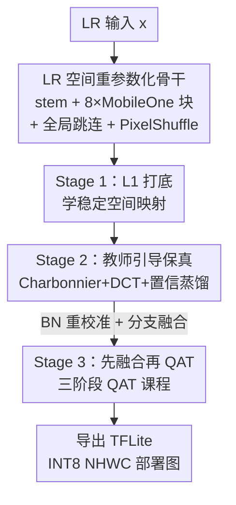

# Efficient INT8 Single-Image Super-Resolution via Deployment-Aware Quantization and Teacher-Guided Training

**会议**: CVPR 2026  
**arXiv**: [2604.20291](https://arxiv.org/abs/2604.20291)  
**代码**: 无  
**领域**: 图像恢复 / 超分辨率 / 模型量化  
**关键词**: INT8 量化, 单图超分, 结构重参数化, 知识蒸馏, 端侧部署  

## 一句话总结
针对手机 NPU 上的 $\times 3$ 单图超分，本文用「LR 空间 MobileOne 重参数化骨干 + 三阶段教师引导训练 + 先融合再 QAT」的部署导向流水线，在 MAI 2026 量化超分挑战赛上以 82K 参数拿到 INT8 29.79 dB / 0.8634 SSIM、final score 1.8。

## 研究背景与动机

**领域现状**：单图超分（SISR）近年靠堆容量提精度——EDSR 加深残差骨干、RCAN 用残差套残差 + 通道注意力、SwinIR/HAT 引入窗口注意力建模长程依赖。这些模型保真度强，但越做越大、越难压缩。

**现有痛点**：要把超分模型塞进手机 NPU 跑 INT8，会同时撞上三堵墙。一是**量化敏感**——超分的质量在像素级度量，激活值范围、取整误差、训练-部署不一致都会直接变成可见的纹理糊和边缘伪影，比高层视觉任务难量化得多。二是**容量不足**——紧凑模型本身缺乏恢复复杂纹理和长程结构的能力。三是**结构错配**——重参数化骨干训练时是多分支、推理时融合成单分支，若直接在多分支结构上做量化感知训练（QAT），分支融合后量化误差会不可预测地累积、精度崩盘。

**核心矛盾**：重建保真度、模型紧凑度、低比特鲁棒性三者互相拉扯，而大多数工作只优化其一，把量化当成训练后的「转换后处理」而非一等设计目标。

**本文目标**：造一个面向 $\times 3$ SR、能真正跑在手机 NPU INT8 上的紧凑流水线，让训练时优化的图和部署时执行的整数图严格对齐。

**切入角度**：不发明新的超分算子，而是把「架构设计 + 监督信号 + 部署一致性」当成一个联合优化问题——计算留在低分辨率空间省算力，用 Mamba 教师补容量短板，把 QAT 直接做在融合后的部署图上消除错配。

**核心 idea**：用「LR 空间重参数化骨干 + 教师引导的多阶段保真训练 + 先融合再量化（deploy-before-QAT）」三件套，让一个 82K 的小模型在 INT8 下仍逼近 FP32 质量。

## 方法详解

### 整体框架

输入是低分辨率 RGB 图 $x\in\mathbb{R}^{H\times W\times 3}$，输出是 $\times 3$ 放大的 $\hat{y}\in\mathbb{R}^{3H\times 3W\times 3}$。整个方法分两条线：**学生网络**负责在 LR 空间做 extract–refine–upsample 的紧凑推理，**三阶段训练流水线**负责把浮点保真度逐步对齐到 INT8 部署约束。学生先用 stem 把 LR 图投到特征空间，过 8 个 MobileOne 风格重参数化块在 LR 域精炼，全局跳连保结构，最后 PixelShuffle 头一次性放大重建。训练则按 Stage 1（L1 打底）→ Stage 2（Charbonnier + DCT + 教师蒸馏提保真）→ Stage 3（在融合部署图上做 QAT）推进，最终导出 TFLite INT8。

### 关键设计

**1. LR 空间重参数化骨干：训练多分支强表达、推理单分支轻量**

痛点是紧凑超分既要省算力又要有足够表达力。本文把绝大部分计算压在 LR 空间——stem 用 $3\times 3$ 卷积把输入投到 $C=32$ 通道，骨干是 $N=8$ 个 MobileOne 风格块全程在 LR 域工作，只在最后用 PixelShuffle 放大，因此主计算量随 $H\times W$ 而非 $3H\times 3W$ 增长，对手机部署友好。每个块训练时是多分支重参数化结构：4 个 $3\times 3$ 卷积分支、1 个 $1\times 1$ 分支、1 个 identity 分支，各带 BN，最后 ReLU：

$$B(f)=\sigma\Big(\sum_{i=1}^{5}\mathrm{BN}_i(\mathrm{Conv}^{(i)}_{3\times 3}(f))+\mathrm{BN}_{1\times 1}(\mathrm{Conv}_{1\times 1}(f))+\mathrm{BN}_{\mathrm{id}}(f)\Big)$$

训练后所有分支按 BN 折叠公式 $\widetilde{W}=\frac{\gamma}{\sqrt{\sigma^2+\epsilon}}W,\ \widetilde{b}=\beta+\frac{\gamma}{\sqrt{\sigma^2+\epsilon}}(b-\mu)$ 解析地合并成一个等价的 $3\times 3$ 卷积。骨干后加特征级全局跳连 $f=f_N+f_0$ 保粗结构，再投到 27 通道做 PixelShuffle。这样训练时享受多分支的优化好处，部署时是规整的单分支图——消融里 MobileOne 块比 RepConv、RepDW 都更抗量化

**2. 教师引导的三阶段保真训练：用 Mamba 教师补小模型的纹理短板**

小模型恢复细纹理和长程结构吃力，本文用一个预训练的 MambaIRv2Light $\times 3$ 教师在输出级蒸馏来补。训练分三阶段渐进：Stage 1 只用 L1 学稳定映射；Stage 2/3 把 L1 换成对离群点更鲁棒的 Charbonnier 损失 $\mathcal{L}_{\mathrm{char}}=\frac{1}{N}\sum_i\sqrt{(\hat{y}^i_{01}-y^i_{01})^2+\epsilon^2}$（$\epsilon=10^{-3}$），并加 DCT 频域监督 $\mathcal{L}_{\mathrm{DCT}}=\|D(\hat{y}_{01})-D(y_{01})\|_1$ 显式约束高频。蒸馏的关键是**置信加权**——按教师自身误差 $e(p)=\frac{1}{3}\sum_c|t_c(p)-y_{01,c}(p)|$ 算逐像素权重 $w(p)=\mathrm{clip}(\exp(-\gamma e(p)),w_{\min},w_{\max})$（$\gamma=10$，$w_{\min}=0.10$，$w_{\max}=0.75$），教师在哪准就在哪信它多一点，教师自己也错的像素就少跟。蒸馏损失 $\mathcal{L}_{\mathrm{KD}}=\frac{1}{N}\sum_p w(p)|\hat{y}_{01}(p)-t(p)|$。阶段损失为 $\mathcal{L}^{(2)}=\mathcal{L}_{\mathrm{char}}+0.02\mathcal{L}_{\mathrm{DCT}}+0.03\mathcal{L}_{\mathrm{KD}}$、$\mathcal{L}^{(3)}=\mathcal{L}_{\mathrm{char}}+0.015\mathcal{L}_{\mathrm{DCT}}+\lambda_{\mathrm{KD}}(t)\mathcal{L}_{\mathrm{KD}}$。消融显示：Stage 3 加上教师把 INT8 从 29.91 dB 提到 30.00 dB，在挑战赛严卡的阈值下这点提升是有意义的

**3. 先融合再 QAT（Deploy-before-QAT）：让 fake-quant 训练图与真实 INT8 执行图严格一致**

这是本文针对「重参数化 + 量化」错配的核心修法。直接在多分支训练拓扑上做 QAT，等分支解析融合后量化误差会不可预测地累积、精度暴跌。本文反过来——**在 QAT 初始化之前就先把网络压成部署形态**：先用 forward-only mini-batch 重校准 BN 的 running 统计量（64 个 batch），再把多分支块全部塌缩成单分支 $3\times 3$ 卷积，然后用 PyTorch FX graph-mode + QNNPACK 后端把 QAT 算子直接插进这张融合图。这保证训练时模拟的 fake-quantization 与部署时真实整数执行数学上严格对齐。QAT 本身走**三阶段课程**：epoch 0–30 权重和量化 observer 都活跃，让模型适应量化约束并校准 scale/zero-point；epoch 30–90 关掉 observer 冻结量化网格，逼网络在固定 8-bit 边界下用直通估计（STE）微调权重；epoch 90–150 连 fake-quant 节点也冻死，纯粹在目标整数算术下收敛残差。训练中每步还做权重裁剪 $W\leftarrow\mathrm{clip}(W,W_{\min},W_{\max})$ 压离群。最后导出 TFLite，把 fake-quant 节点映射成原生 INT8 算子、张量转 NHWC 布局保证硬件兼容

## 实验关键数据

### 主实验

数据集为 DIV2K（800 训练 / 100 验证 / 100 测试），任务 $\times 3$ SR，全图 RGB PSNR/SSIM 评估（不剪边）。

挑战赛榜单（MAI 2026 Quantized 4K SR，节选）：

| 队伍 | FP32 PSNR/SSIM | INT8 PSNR/SSIM | NPU 时延(ms) | Final Score |
|------|------|------|------|------|
| AntYSP | 30.04 / 0.8757 | 29.96 / 0.8729 | 4.33 | 21.8 |
| AntSR | 30.08 / 0.8764 | 29.98 / 0.8731 | 4.52 | 21.5 |
| z6 | N.A. | 29.93 / 0.8699 | 5.49 | 16.5 |
| IN2GM | 29.88 / 0.8708 | 29.85 / 0.8701 | 46.5 | 1.7 |
| **AIO_MAI (本文)** | 29.98 / 0.8730 | **29.79 / 0.8634** | 41.1 | **1.8** |

与经典基线对比（本文用 fixed-shape 可部署 INT8 TFLite，仅 82K 参数）：

| 方法 | 类型 | PSNR (dB) | SSIM |
|------|------|------|------|
| Bicubic | FP32 | 28.26 | 0.828 |
| FSRCNN | FP32 | 29.45 | 0.838 |
| ABPN | INT8 | 30.15 | 0.852 |
| 本文 (Stage 2) | FP32 | **30.28** | **0.863** |
| 本文 (Deploy) | INT8 | 30.13 | **0.858** |

本文 INT8 部署模型 PSNR 与 ABPN 几乎持平（30.13 vs 30.15），但 SSIM 更高（0.858 vs 0.852），说明在量化部署下更好地保住了结构信息；FP32→INT8 仅掉 0.15 dB，鲁棒性强。

### 消融实验

骨干块对比（FP32 → 动态全量化 INT8 TFLite 的掉点）：

| 块 | FP32 PSNR/SSIM | INT8 PSNR/SSIM | ΔPSNR↓ | ΔSSIM↓ |
|------|------|------|------|------|
| RepConv | 30.0897 / 0.855 | 29.8492 / 0.847 | 0.2405 | 0.008 |
| RepDW | 29.3583 / 0.838 | 28.7031 / 0.814 | 0.6552 | 0.024 |
| **MobileOne** | 30.1350 / 0.859 | **30.0003 / 0.856** | **0.1347** | **0.003** |

Stage 3 教师监督消融：

| 配置 | 教师 | 精度 | PSNR (dB) | SSIM |
|------|------|------|------|------|
| Stage 3 (Direct QAT) | ✗ | INT8 | 29.9114 | 0.853 |
| Stage 3 (Ours Full) | ✓ | INT8 | **30.0003** | **0.856** |

### 关键发现
- **MobileOne 块是抗量化最优解**：不仅 INT8 绝对值最高（30.0003 dB），FP32→INT8 掉点也最小（仅 0.1347 dB）；RepDW 这种激进深度可分形式量化掉点最狠（0.6552 dB），说明更激进的因子化反而不利低比特超分。
- **教师监督在最终量化阶段仍有用**：即便已进入纯整数收敛，加教师仍把 INT8 拉过 30 dB，证明强监督能缩小浮点训练与部署 INT8 之间的优化 gap。
- **量化要当一等设计目标**：导出后哪怕掉一点点都可能让模型跌破挑战赛阈值，先融合再 QAT 让导出几乎无损是上榜关键。

## 亮点与洞察
- **「先融合再 QAT」直击重参数化与量化的根本错配**：大多数工作把重参数化和量化各自做，本文点破了「多分支训练图 ≠ 单分支部署图」会让量化误差累积爆炸，把 QAT 直接钉在融合后的部署图上——这个 train-deploy 一致性思路可迁到任何「重参数化骨干 + 低比特部署」的场景。
- **置信加权蒸馏很务实**：不无脑信教师，而是按教师自身误差给逐像素权重，教师糊的地方就少学——这避免了把教师的错误也蒸馏进学生，是个可复用的软监督 trick。
- **DCT 频域监督补 CNN 的高频短板**：在像素 loss 之外显式约束 DCT 系数差，针对超分最看重的高频细节，比单纯 L1/Charbonnier 更有的放矢。
- **82K 参数打平 ABPN**：在极小参数预算下靠架构-部署协同设计逼近更大模型，印证了「careful coordination > 单纯堆容量」。

## 局限与展望
- **绝对精度仍落后头部队伍**：Final Score 1.8 远低于榜首 AntYSP 的 21.8，主要差在 NPU 时延（41.1ms vs 4.33ms）——本文重保真与部署一致性，运行时效率并未做到极致优化。
- **只在单一目标平台验证**：评估几乎只围绕官方 MAI 2026 目标 NPU，作者自承未在 MediaTek NPU、Apple Neural Engine 等其他加速器上验证，泛化性待考。
- **教师蒸馏增益偏小**：加教师只提升约 0.09 dB，在非挑战赛的常规场景下这点收益是否值回 Mamba 教师的训练成本存疑。
- **方法是工程组合而非新算子**：作者明确说不引入新 SR 原语，创新点在流水线协同——novelty 更偏系统集成。

## 相关工作与启发
- **vs QuantSR / Tu et al.（SR 专用量化）**: 他们聚焦量化模块本身（SR-aware 校准、裁剪），本文则强调「先把图融合到部署形态再量化」的训练-部署一致性，是对 SR 量化的正交补充。
- **vs MobileOne / RepVGG（结构重参数化）**: 本文沿用其多分支训练、单分支推理思想，但补上了「重参数化遇到 INT8 量化会错配」这一缺口，并给出 deploy-before-QAT 的解法。
- **vs DVMSR（Mamba + 轻量 + 蒸馏）**: 同样用 Mamba 系做教师、靠蒸馏提轻量超分质量，但本文把目标进一步压到真实 INT8 端侧部署，蒸馏改成置信加权且只在输出级做。

## 评分
- 新颖性: ⭐⭐⭐☆☆ 无新算子，胜在 deploy-before-QAT 的一致性洞察 + 置信蒸馏的务实组合
- 实验充分度: ⭐⭐⭐⭐☆ 有挑战赛榜单、经典基线、骨干与教师双消融，但只在单一目标平台
- 写作质量: ⭐⭐⭐⭐☆ 动机-方法-实验逻辑清晰，公式与流程交代完整
- 价值: ⭐⭐⭐⭐☆ 端侧 INT8 超分的部署一致性思路实用，可迁移到其他重参数化+量化场景

<!-- RELATED:START -->

## 相关论文

- [\[CVPR 2026\] IAFMNet: Information-Aware Feature Modulation for Efficient Super-Resolution](iafmnet_information-aware_feature_modulation_for_efficient_super-resolution.md)
- [\[ICCV 2025\] Outlier-Aware Post-Training Quantization for Image Super-Resolution](../../ICCV2025/image_restoration/outlier-aware_post-training_quantization_for_image_super-resolution.md)
- [\[CVPR 2026\] LightRR: A Lightweight Network for Single Image Reflection Removal](lightrr_a_lightweight_network_for_single_image_reflection_removal.md)
- [\[CVPR 2026\] ExpoCM: Exposure-Aware One-Step Generative Single-Image HDR Reconstruction](expocm_exposure-aware_one-step_generative_single-image_hdr_reconstruction.md)
- [\[CVPR 2026\] PS-SR: Pseudo-Single-Step Video Super-Resolution via Speculative Diffusion](ps-sr_pseudo-single-step_video_super-resolution_via_speculative_diffusion.md)

<!-- RELATED:END -->
