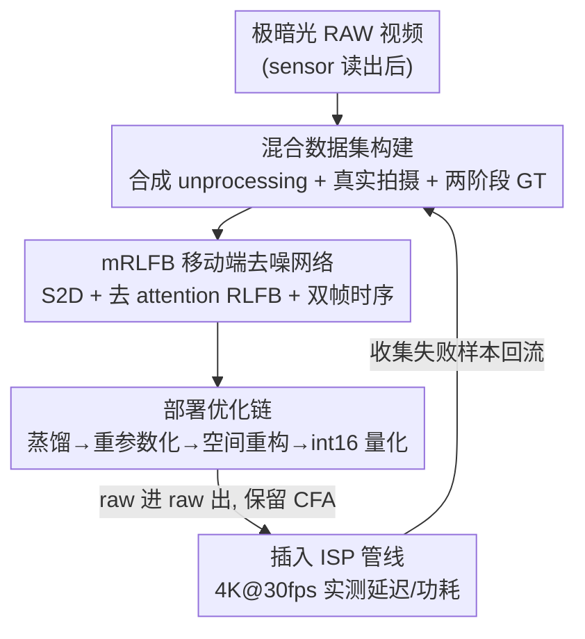

# Efficient Real-Time Raw-to-Raw Denoising for Extreme Low-Light Ultra HD Video on Mobile Devices

**会议**: CVPR 2026  
**论文**: [CVF Open Access](https://openaccess.thecvf.com/content/CVPR2026/html/Pochimireddy_Efficient_Real-Time_Raw-to-Raw_Denoising_for_Extreme_Low-Light_Ultra_HD_Video_CVPR_2026_paper.html)  
**代码**: 无（项目页见论文，未公开代码）  
**领域**: 图像/视频复原  
**关键词**: RAW视频去噪, 极暗光, 移动端部署, 结构重参数化, 实时ISP  

## 一句话总结
针对手机在 <1lx 极暗光下拍 4K/8K 视频噪声大、又必须满足 <33ms 延迟和 <250mA 功耗的难题，三星这篇论文给出一套从「混合数据集构建 → 轻量 mRLFB 去噪网络 → 蒸馏/重参数化/量化部署优化」的端到端工程方案，做出一个能直接插进商用 ISP 管线（raw 进 raw 出、保留 CFA）的实时去噪器，在骁龙 NPU 上 4K@30fps 运行，PSNR 与重型 SOTA 持平但延迟/功耗低一个数量级。

## 研究背景与动机
**领域现状**：手机夜景视频质量这几年靠 DNN 提升很多，但主流去噪模型（NAFNet、BRVE、各种 transformer/recurrent 结构）都把恢复质量放在第一位，普遍计算量大、单帧处理动辄几百毫秒到数秒。它们在 <10lx 的弱光下还行，但极暗（<1lx）场景里传感器读出噪声急剧上升，传统 ISP 的去噪根本不够用。

**现有痛点**：把这些重型模型搬到手机上做实时 UHD 视频几乎不可行。论文把困难归成三点——① **数据稀缺**：极暗光下带真实运动的「噪声-干净」配对 raw 视频极难采集，合成方法又难泛化；② **缺轻量模型**：现有移动端友好结构大多为单张图设计（8MP 跑 0.5–1s），不是为 30/60fps 实时视频准备的；③ **部署约束**：要同时满足 <33ms 延迟和 <250mA 功耗，必须训练低复杂度模型并做训练后优化（重参数化、量化），而这些又和「可学习性 / 细节保留」存在 trade-off。

**核心矛盾**：恢复质量与移动端实时性/功耗之间的根本冲突——越想去干净极暗光噪声，模型越重，越跑不动手机 NPU。同时还有一个工程约束：很多 SOTA 是「替换整个 ISP」或「联合去马赛克+去噪（JDD）」的方案，牺牲了模块化，没法即插即用到现有商用相机栈里。

**本文目标**：做一个 **raw 进 / raw 出、保留 Bayer CFA 模式、放在 sensor 读出之后、去马赛克之前**的去噪模块，既能把极暗光噪声压下去，又不破坏下游 ISP 行为，还要在真机上实时跑。

**核心 idea**：不追求论文式的「更强模型」，而是把数据、模型、部署当成一个**端到端工程系统**整体优化——用合成+真实混合数据解决配对难题，用去掉 attention、加多级 skip 的轻量 RLFB 变体（mRLFB）控制算力，再用蒸馏+结构重参数化+空间重构+int16 量化把延迟/功耗压到约束以内。

## 方法详解

### 整体框架
方法是一条**四阶段串行的工程管线**：先用「合成 unprocessing + 真实三脚架拍摄 + 两阶段 GT」凑出极暗光下的配对训练数据；再训一个移动端优化的 mRLFB 去噪网络（输入噪声 raw，输出干净 raw，全程保留 CFA）；接着对这个网络做一串训练后优化（蒸馏→重参数化→空间重构→量化）把它压到能在手机 NPU 上实时跑；最后插进 ISP 管线、在骁龙 8 Gen 3 上按 4K@30fps 实测延迟和功耗，失败样本回流再迭代。

### 关键设计

**1. 混合数据集构建：用合成+真实+两阶段GT绕开极暗光配对数据采不到的问题**

极暗光下没法直接采到带真实运动的「噪声-干净」配对——一旦有运动，多帧平均会拖出拖影，干净参考根本生成不了。论文用三套数据拼出训练集。**合成数据**走一条 unprocessing 反向管线（图 4）：拿高质量 sRGB 图，依次做逆 tone mapping / gamma（$\gamma=2.12$）/ CCM → Bayer 马赛克 → 曝光衰减模拟 <1lx → 逆 AWB / BLS，得到干净伪 raw $B_{GT}$；ISP 参数（WB 增益均值 [1.81,1,1.89]、CCM 矩阵）直接从 Galaxy S25 拍照元数据里抠出来，保证传感器一致性。再叠上异方差高斯噪声模拟暗光读出噪声：

$$B_{in} = \mathcal{N}(0,\ \beta_1 B_{GT} + \beta_2)$$

其中 $\beta_1,\beta_2$ 是 shot/read 噪声参数，用 0lx 和 <1lx 实拍标定再做网格搜索+人工感知校验。合成又分两套互补集——Set1（1500 张，纹理优先，并用 color blob cut-mix 模拟小光源周围的强度梯度、抑制 color bleed）、Set2（1200 张强逆光，覆盖宽亮度范围）。**真实数据**用三脚架在受控暗室拍静态 raw 序列（丢掉前 90 帧等稳定），GT 走两阶段：先把 90 连续帧 burst 平均掉零均值噪声，再用一个合成数据训出来的 16-mRLFB 大模型清掉残余噪声（图 5）——作者诚实地指出用模型造 GT 会引入模型偏置和质量天花板，但在这种欠定问题里是实用折中。**合成运动**：从预定义运动字典给静态对加合成位移，保证逐帧对齐，专门用于时序评测。训练时先用合成预训练，再用真实静态数据微调。

**2. mRLFB 移动端架构：去掉 attention、靠 S2D 降分辨率和双帧输入换实时性**

对 UHD 视频，特征图分辨率直接决定算力。网络（图 6）开头先做 $k\times k$ Space-to-Depth（S2D），把空间分辨率降 $k$ 倍、通道扩 $k^2$ 倍且保留颜色通道关系，后续卷积都在这个低分辨率上跑，结尾再用 Depth-to-Space（D2S）还原。核心是 $N=4$ 个 **mRLFB（mobile-optimized Residual Local Feature Block）**，从 RLFN 改来——关键是**砍掉 attention 模块**，省掉全局池化/上采样开销。每个 mRLFB 是三层 3×3 卷积（ReLU）接一个 1×1 卷积，外包残差：

$$F_{out} = F_{in} + W_1 * \big(F_{in} + \sigma(W_3 * \sigma(W_2 * \sigma(W_1 * F_{in})))\big)$$

$W_i$ 是卷积核、$\sigma$ 是 ReLU。深层特征经 3×3 卷积聚合后，再与浅层特征 concat、过 1×1 卷积——这条多级 skip 把高频纹理细节带到输出。**时序**上单帧模型会在极暗光下闪烁，但论文不用重型时序块（太吃延迟），只把首层 3×3 卷积改成同时吃**前一帧和当前帧的 S2D 输出**（32 通道输入），输出当前帧去噪结果，其余结构不变——两帧方案在时序一致性和延迟之间取平衡，实测时序指标全面优于单帧（见实验）。

**3. 部署优化链：蒸馏→重参数化→空间重构→int16 量化，把网络压进 NPU 约束**

光有轻量结构还不够实时，论文叠了四步训练后优化。**Step 1 知识蒸馏**：先训一个高容量教师 T（Model A，$N=4,k=4,d=32$），蒸馏到紧凑学生 S（Model B，$d=16$），用输出空间+中间特征双重引导，学生与基础损失 $L$ 联合训练：$L_{KD} = \|T(y)-S(y)\|_1 + \beta\|\phi(T)-\phi(S)\|_2^2$。**Step 2 结构重参数化**：训练时 mRLFB 里用多分支块（1×1+skip 做局部特征蒸馏，接 3×3 再接 1×1，外加全局 skip），训练后通过核融合等价合并成**单个 3×3 卷积**（图 7），数学等价但消掉了 skip 带来的 feature map 显存开销和运行时。**Step 3 空间分辨率重构**：推理时把特征图宽度方向再砍一半、通过权重重排把中间通道深度翻倍（图 9）；只在推理时这么做（不训练）以免单方向感受野变大引入方向偏置——这一步利用了 NPU 对两种配置延迟等价的特性。但有个 NPU 约束：通道深度上限 64，超过 64 并行化受阻反而变慢，所以只砍单方向。**Step 4 int16 量化**：整数运算更省功耗，但量化掉精度。论文用 per-channel 对称权重 + per-tensor 激活的训练后 int16 量化（比 int8 粒度更细），质量掉超阈值就再做几轮量化感知微调；最终 I/O 保持 10/12-bit 整数 Bayer，内部 int16 累加器按需提升到 int32。

### 损失函数 / 训练策略
基础损失是 raw 保真 + 颜色一致的复合损失。**Raw 重建损失**用 L1：$L_{raw} = \frac{1}{M}\sum\|B_{GT}-B_{pred}\|$。**色差损失**专门压跨通道错位：取绿通道均值 $G_{avg}=\frac{1}{2}(G_1+G_2)$ 作参考，算 $D_{BG}=B-G_{avg}$、$D_{RG}=R-G_{avg}$ 与预测对应量的 L1 差，$L_{chromatic}=\frac{1}{M}\sum(\|D_{BG}-\hat{D}_{BG}\|_1+\|D_{RG}-\hat{D}_{RG}\|_1)$。总损失 $L = w_r L_{raw} + w_c L_{chromatic}$，$w_r=0.6,w_c=0.4$。训练：batch 16，256×256 packed-RAW patch，Adam + 余弦退火，初始 lr $1\times10^{-4}$，TensorFlow 单卡 A100。

## 实验关键数据

### 主实验
真机用 Galaxy S25 Plus（骁龙 8 Gen 3 Elite），量化模型 INT16、其余 FP16，Monsoon HV 差分测功耗。注意极暗光 raw 像素强度极小，绝对 MSE 小，所以 PSNR 偏高（55–60dB）；公开数据集（CRVD/SRVD）光照高、PSNR 在 30–45dB 区间，两者数值不可直接横比。

与 SOTA 对比（real-world static + 合成预训练→真实微调两种范式，Table 2）：

| 方法 | PSNR↑(Real) | SSIM↑(Real) | Runtime(ms)↓ | Current(mA)↓ |
|------|-------------|-------------|--------------|--------------|
| NAFNet | 59.09 | 0.9838 | 375 | 12187 |
| BRVE | 59.55 | 0.9993 | 4806.3 | 156204 |
| SplitterNet | 53.83 | 0.9735 | 16.97 | 551 |
| **Ours: Model A\*** | **60.18** | 0.9883 | 22.95 | 565 |
| **Ours: Model B\*** | — | — | **19.30** | **475** |

要点：Model A* 的 PSNR 反超 NAFNet/BRVE，而延迟从几百~几千毫秒压到 ~20ms、电流从上万 mA 压到几百 mA，低一两个数量级；唯一同量级的轻量基线 SplitterNet PSNR 低 6dB+。公开数据集泛化（Table 3）Model B* 在 CRVD 37.21 / SRVD 34.46 dB，也优于三个基线。

### 消融实验
部署优化对延迟/功耗的逐步影响（多帧模型，Table 5）：

| 配置 | Runtime(ms)↓ | Current(mA)↓ | PSNR↑ | SSIM↑ |
|------|--------------|--------------|-------|-------|
| Model A | 25.32 | 621 | 60.54 | 0.9886 |
| Model A (restructured) | 43.54 | 1405 | 60.54 | 0.9886 |
| Model AQ（量化） | 17.94 | 366 | 57.46 | 0.9992 |
| Model B（蒸馏） | 20.53 | 503 | 58.63 | 0.9880 |
| Model B (restructured) | 12.96 | 419 | 58.63 | 0.9880 |
| Model BRQ（重构+量化） | 12.91 | 244 | 57.17 | 0.9986 |

合成数据消融（Table 1）：Set1 56.97 / Set2 56.53 / Set1+Set2 58.05 / 纯真实 60.18 / 合成预训练+真实微调 **60.54** dB（PSNR 最高）。时序消融（Table 4）：多帧 Model A 的 tOF 0.55、tLP 0.70、flicker 0.78、VMAF 70.43，全面优于单帧 Model A* 和所有基线。

### 关键发现
- **重构（空间重构）只对小模型有利**：Model B 重构后 runtime 砍 37%、功耗砍 16%（借 NPU 并行）；但 Model A 重构反而把中间通道从 32 升到 64、超出 NPU 高效区，runtime/功耗双双暴涨（43.54ms/1405mA）——说明这步优化和 NPU 通道并行上限强耦合，不能盲套。
- **蒸馏单步就降约 20%**：Model A→B 的蒸馏把 runtime 和功耗各降约 20%，是部署链里性价比最高的一步。
- **合成→真实迁移学习最有效**：合成预训练再真实微调的 PSNR（60.54）高于纯合成（58.05）和纯真实（60.18），合成 Set1+Set2 组合也优于单独任一集，印证纹理/亮度多样性互补。
- **多帧换时序几乎不损单帧质量**：两帧输入把时序指标拉到全场最好，且没牺牲逐帧 PSNR，也没超移动端约束。

## 亮点与洞察
- **把「部署」当一等公民**：这是少见的从数据→模型→训练后优化→真机测量全链路打通的工作，论文自称是第一篇整体处理移动端 on-device 部署的极暗光 raw 视频去噪——对工业落地参考价值远大于纯刷点。
- **raw 进 raw 出 + 保留 CFA 的「即插即用」定位很聪明**：放在 sensor 读出后、去马赛克前，不替换 ISP、不破坏下游行为，能直接增强现有商用相机栈，比 JDD/换 ISP 的方案模块化好太多。
- **去 attention + 重参数化的组合拳**：训练时用多分支块保表达力、推理时融成单 3×3 卷积消显存开销，是 NPU 友好结构设计的可复用范式；空间重构利用「NPU 对两种 shape 延迟等价」这个硬件特性更是接地气的工程 trick。
- **诚实标注 GT 的局限**：作者明说用模型造 GT 会带来偏置和质量天花板，这种自省在工程论文里难得。

## 局限性 / 可改进方向
- **真实运动的 GT 始终缺位**：<1lx 下真实运动没法做 burst 平均，所有动态评测靠合成运动字典，真机真实运动场景的质量只能靠补充材料的主观视频佐证，缺定量证据。
- **PSNR 数值不可跨数据集比**：极暗光 raw 的 55–60dB 是「像素强度小→MSE 小」的产物（baseline 噪声 PSNR 就有 46.45dB），看绝对值容易高估，论文已坦诚说明但读者需警惕。⚠️ 评估时应结合 SSIM/VMAF/时序指标综合看。
- **GT 由模型生成**：真实数据的干净参考用一个合成训练的大模型清残噪，去噪上限被这个 teacher 锁死，存在自证风险。
- **强依赖特定硬件/传感器**：ISP 参数从 Galaxy S25 元数据抠取，NPU 优化绑骁龙 Hexagon，换平台/传感器的迁移成本和泛化未充分验证；代码/数据集也未公开，复现门槛高。
- **可改进**：引入物理更准的传感器噪声模型（如 normalizing flow 跨传感器标定）减少合成-真实 gap；探索更长时序窗口或轻量光流对齐进一步压闪烁。

## 相关工作与启发
- **vs NAFNet / BRVE（重型 SOTA）**：它们恢复质量略高或相当（NAFNet 59.09、BRVE 59.55 vs 本文 60.18），但 runtime 几百~几千毫秒、电流上万 mA，根本没法实时上手机；BRVE 还需二值网络专用硬件。本文用工程化优化在持平质量下把延迟/功耗压低一两个数量级。
- **vs SplitterNet（轻量基线）**：同属实时可部署量级（16.97ms/551mA），但 PSNR 仅 53.83，比本文低 6dB+，时序指标也差（VMAF 40.74 vs 本文多帧 70.43）——说明单纯求快会严重掉质量，本文在快和好之间找到了更优点。
- **vs RViDeNet/CRVD 数据范式**：CRVD 靠调 ISO 模拟噪声、缺真实低光保真度；本文用「真实三脚架拍摄 + 合成 unprocessing + 合成运动」的混合策略，专门针对 <1lx 极暗光，更贴近真实部署分布。
- **vs JDD / 换 ISP 方案**：JDD 联合去马赛克去噪精度高但牺牲模块化；本文坚持 pre-demosaic、保留 CFA 的 raw-in/raw-out 设计，换来即插即用——启发：在工业管线里「兼容性/模块化」常比「端到端精度最优」更重要。

## 评分
- 新颖性: ⭐⭐⭐⭐ 单个组件（RLFN、重参数化、量化、unprocessing）都不新，但端到端打通移动端极暗光 raw 视频实时部署、并坚持 ISP 兼容的系统性整合是新的。
- 实验充分度: ⭐⭐⭐⭐ 主对比+合成数据+部署+时序+公开数据集多维消融充分，真机实测延迟/功耗到位；扣分在真实运动缺定量 GT、代码数据未公开。
- 写作质量: ⭐⭐⭐⭐ 工程细节交代清楚、对 GT 局限和 PSNR 偏高诚实说明；图表稍多、部分流程靠图说明。
- 价值: ⭐⭐⭐⭐⭐ 对手机夜景视频落地有直接工程参考价值，raw-in/raw-out 即插即用范式可迁移到其他 ISP 内增强任务。

<!-- RELATED:START -->

## 相关论文

- [\[CVPR 2026\] RawMetaDiff: Unlocking Extreme Darkness from Dual-Exposure RAW with Meta-Guided Diffusion](rawmetadiff_unlocking_extreme_darkness_from_dual-exposure_raw_with_meta-guided_d.md)
- [\[CVPR 2026\] NEC-Diff: Noise-Robust Event–RAW Complementary Diffusion for Seeing Motion in Extreme Darkness](nec-diff_noise-robust_event-raw_complementary_diffusion_for_seeing_motion_in_ext.md)
- [\[CVPR 2026\] Edit-aware RAW Reconstruction](edit-aware_raw_reconstruction.md)
- [\[CVPR 2026\] 2-Shots in the Dark: Low-Light Denoising with Minimal Data Acquisition](2-shots_in_the_dark_low-light_denoising_with_minimal_data_acquisition.md)
- [\[CVPR 2026\] Real-Time Neural Video Compression with Unified Intra and Inter Coding](real-time_neural_video_compression_with_unified_intra_and_inter_coding.md)

<!-- RELATED:END -->
