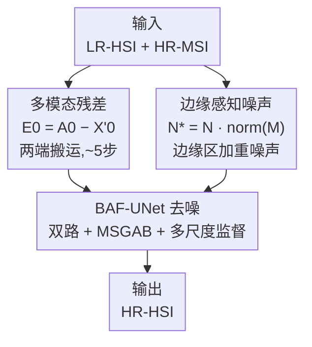

# EMR-Diff: Edge-aware Multimodal Residual Diffusion Model for Hyperspectral Image Super-resolution

**会议**: CVPR 2026  
**论文**: [CVF Open Access](https://openaccess.thecvf.com/content/CVPR2026/html/Zhang_EMR-Diff_Edge-aware_Multimodal_Residual_Diffusion_Model_for_Hyperspectral_Image_Super-resolution_CVPR_2026_paper.html)  
**代码**: https://github.com/luocz55/EMR-Diff  
**领域**: 扩散模型 / 图像恢复  
**关键词**: 高光谱超分辨, 多模态残差扩散, 边缘感知噪声, 图像融合, 双路UNet

## 一句话总结
EMR-Diff 把"低分辨高光谱图 + 高分辨多光谱图"融合成"高分辨高光谱图"的任务重写成一个扩散过程：让马尔可夫链的起点和终点之间传递的不再是纯高斯噪声而是**多模态残差**（把采样步数从上千步压到 5 步），再用 HR-MSI 的边缘信息**调制噪声**让模型专注重建高频细节，配合双路 BAF-UNet，在 ICVL/Harvard/Chikusei 三个数据集的 PSNR、SAM 等指标上全面超过 10 个 SOTA。

## 研究背景与动机
**领域现状**：受硬件限制，传感器很难同时拿到高空间分辨率和高光谱分辨率的高光谱图像（HSI）。主流折中方案是融合——用一张容易获取的低分辨高光谱图（LR-HSI，光谱细但空间糊）和一张高分辨多光谱图（HR-MSI，空间清但光谱稀），融合出既清晰又光谱完整的 HR-HSI。近年扩散模型凭强生成能力成了这条路线的新宠。

**现有痛点**：把标准扩散框架（DDPM）直接搬到 HSI 超分有三个具体毛病。其一，**采样低效**——前向过程要把图像彻底破坏成纯噪声，反向就得迭代上千步，推理慢。其二，**细节生成受限**——纯高斯噪声各向同性、不区分区域，模型很难把注意力集中到 HSI 超分最关键的高频细节（边缘、纹理）上。其三，**去噪不充分**——常规 UNet 把带噪输入和观测条件早早拼接（early fusion），导致两类信息互相干扰，加上盲目上采样、对观测信息利用不足，重建质量上不去。

**核心矛盾**：扩散模型"从纯噪声生成"这个范式天然和"超分本质是补缺失细节、而非凭空生成"错位。LR-HSI+HR-MSI 里其实已经包含了 HR-HSI 的大部分信息，没必要把图像先彻底毁掉再重建。

**本文目标**：在保留扩散模型生成能力的前提下，(1) 大幅压缩采样步数；(2) 让噪声/去噪聚焦高频细节；(3) 设计专门的去噪网络解耦观测条件与噪声。

**核心 idea**：不让扩散链在"干净图 ↔ 纯噪声"之间走，而是在"HR-HSI ↔ LR-HSI+HR-MSI"之间走——两端的差就是**多模态残差** $E_0$，扩散过程逐步搬运这个残差即可，几十步就够；同时用 HR-MSI 边缘把高斯噪声调制成**边缘感知噪声**，把噪声能量压到边缘区，逼模型先修细节。

## 方法详解

### 整体框架
EMR-Diff 的核心是改写扩散链的两个端点：前向链的**起点** $X'_0$ 是真值 HR-HSI 与其伪多光谱图（Pseudo-MSI）在通道维拼接的结果；**终点** $A_0$ 是上采样后的 LR-HSI（$Y_\uparrow$）与 HR-MSI（$Z$）的拼接，即 $A_0 = Y_\uparrow \,\textcircled{c}\, Z$。两端之差就是多模态残差 $E_0 = A_0 - X'_0$，它一口气概括了"LR-HSI 相对 HR-HSI 丢掉的空间细节"和"HR-MSI 相对 Pseudo-MSI 的光谱差异"。前向过程沿马尔可夫链把 $E_0$ 和边缘感知噪声 $N^*$ 按单调递增系数 $\eta_t$ 逐步注入起点；反向过程从 $A_0$ 出发，用去噪网络 BAF-UNet 逐步回搬残差、恢复 $X'_0$。由于两端本就高度相关，整条链只需约 5 步。

下图是从输入到输出的整体流向，自上而下三个贡献节点正对应后面三个关键设计：

### 关键设计

**1. 多模态残差机制：把"生成"改成"搬残差"以压缩采样步数**

针对"采样低效"和"凭空生成"的错位，作者受 ResShift（自然图像超分用单模态残差）启发，把残差概念扩展到多模态融合。前向不再加噪到纯噪声，而是把残差 $E_0$ 沿链注入，递推式为

$$X'_t = X'_{t-1} + \alpha_t E_0 + \kappa\sqrt{\alpha_t}\,N^*, \qquad X'_t = X'_0 + \eta_t E_0 + \kappa\sqrt{\eta_t}\,N^*$$

其中 $\alpha_t = \eta_t - \eta_{t-1}$，$\eta_t$ 是单调递增序列，$\kappa$ 调控噪声强度（设为 1）。$t=1$ 时 $\eta_t \to 0$，$X'_1 \approx X'_0$（接近真值）；$t=T$ 时 $\eta_t \to 1$，$X'_T \approx A_0 + N^*$（接近观测+噪声）。反向后验为

$$X'_{t-1} = \tfrac{\eta_{t-1}}{\eta_t}X'_t + \tfrac{\alpha_t}{\eta_t} f_\theta(X'_t, A_0, t) + \kappa\sqrt{\tfrac{\eta_{t-1}}{\eta_t}\alpha_t}\,N^*$$

去噪网络 $f_\theta$ 直接预测 $X'_0$。与标准扩散从随机噪声起步不同，这里链的起终点本就是同一场景的不同退化版本，残差 $E_0$ 既含空间差又含光谱差，搬运它等于给模型明确指路"要补哪些细节、补多少光谱"，所以步数能从上千降到几十。消融显示多模态残差比无残差、单模态残差分别高 1.35 dB、0.82 dB。

**2. 边缘感知噪声：用 HR-MSI 边缘把噪声能量压到高频区**

针对"纯高斯噪声不分区域、细节难恢复"，作者观察到 HR-HSI 与 HR-MSI 的高频边缘结构高度相似（论文 Fig.3），于是用 HR-MSI 的边缘来调制噪声。先把 HR-MSI 按波段平均成灰度图 $P$，用 Sobel 算子 $C_x, C_y$ 求水平/垂直梯度 $G_x = C_x * P$、$G_y = C_y * P$，再算梯度幅值作为边缘强度：

$$M = \sqrt{G_x^2 + G_y^2 + \epsilon}, \quad \epsilon = 10^{-8}$$

归一化得权重 $W = \text{norm}(M)$，与纯高斯噪声逐元素相乘得到边缘感知噪声 $N^* = N \cdot W$。这样平坦区噪声小、边缘区噪声大——因为多模态残差的幅值本就集中在高频边缘，把噪声扰动也对齐到那里，等于强迫去噪网络把"算力"花在重建边缘和纹理上。消融显示替换纯高斯噪声后 PSNR 提升 0.92 dB，误差图在边缘区明显变小。

**3. 双路注意力融合 UNet（BAF-UNet）：解耦观测条件与噪声、配多尺度渐进监督**

针对"早融合干扰 + 盲上采样"，BAF-UNet 用两条互补设计把去噪网络做"专"。**双路解耦**：一条去噪路处理带噪输入 $X'_t$（注入正弦余弦时间步编码），一条引导路吃拼接好的 LR-HSI+HR-MSI（提供结构与光谱先验），两路只在深层才融合而非早期拼接，避免噪声分布学习和结构特征学习互相污染。每路的主干块是 **MSGAB（多尺度组注意力块）**：输入先过 $I = \text{LReLU}(\text{LN}(\text{Conv}(I_n)))$，再用空间注意力增强 $J = \text{SpatialAttn}(I)\odot I$；接着两条并行组卷积取互补特征——1 组卷积 $g_1$ 做稠密跨通道交互、$S$ 组卷积 $g_2$ 做稀疏连接以保光谱特性；用 $\beta_i = \text{Softmax}(\text{Conv}(\text{GAP}(g_i)))$ 自适应加权融合 $h = \sum_i \beta_i g_i$，最后过 MLP 并残差相加 $Out = \text{MLP}(h) + I_n$。**多尺度监督**：把 LR-HSI 上采样、HR-MSI 下采样到各尺度注入每个上采样阶段，并用逐级下采样的 HR-HSI 当每阶段监督目标，损失为

$$L_{\text{multi}} = \sum_{k=0}^{3} \big\| O_k + Y_{\uparrow n}\,\textcircled{c}\,Z_{\downarrow n'} - X'_{\downarrow n'} \big\|_1, \quad n = 2^k,\ n' = 2^{3-k}$$

让每个上采样阶段都有明确监督，模拟"低分→高分"的渐进重建，解决盲上采样问题，并让 LR-HSI 主导光谱恢复、HR-MSI 精修空间结构。消融里这三个子设计逐一去掉分别掉 1.06 dB（MSGAB）、0.65 dB（早融合）、0.74 dB（单尺度监督）。

### 损失函数 / 训练策略
训练用上式的多尺度 $L_1$ 损失（$k=0,1,2,3$ 四个阶段累加），去噪网络 $f_\theta$ 直接回归 $X'_0$。推理默认 5 步扩散，LR-HSI 经 8 倍双三次上采样后与 HR-MSI 拼成 $A_0$ 作为反向起点。Pseudo-MSI 取 HR-HSI 的前 3 个波段（1,2,3）拼到起点以保证光谱平滑。

## 实验关键数据

### 主实验
三个数据集（ICVL/Harvard/Chikusei，LR-HSI 由 3×3 高斯模糊 + 8 倍下采样得到，HR-MSI 用 Nikon D700 光谱响应函数合成）、四个指标全面对比 10 个 SOTA，EMR-Diff 全部第一：

| 数据集 | 指标 | EMR-Diff | 最强对手(DSPNet) | 说明 |
|--------|------|----------|------------------|------|
| ICVL | PSNR↑ / SAM↓ | **55.40 / 0.0040** | 55.19 / 0.0042 | 空间+光谱双优 |
| Harvard | PSNR↑ / SAM↓ | **49.28 / 0.0233** | 48.68 / 0.0237 | PSNR +0.60 dB |
| Chikusei | PSNR↑ / SAM↓ | **47.55 / 0.0950** | 46.97 / 0.0977 | 128 波段大场景仍领先 |

（传统法 CNMF/Hysure 与深度法差距巨大，如 ICVL 上 PSNR 仅 36~38；无监督法 PLR/SDP/ARGS 输出偏平滑，PSNR 比监督法低约 6~9 dB。）

### 消融实验
| 配置 | PSNR↑ | SAM↓ | ERGAS↓ | 说明（Harvard） |
|------|-------|------|--------|------|
| 多模态残差(Full) | **49.28** | 0.0233 | 0.7800 | 完整 |
| 单模态残差 | 48.46 | 0.0241 | 0.8025 | 只 LR↔HR-HSI 残差，−0.82 dB |
| 无残差 | 47.93 | 0.0250 | 0.8994 | −1.35 dB |
| 边缘感知噪声 | **49.28** | 0.0233 | 0.7800 | — |
| 纯高斯噪声 | 48.36 | 0.0245 | 0.8198 | −0.92 dB |

BAF-UNet 模块拆解（Table 4）：UNet 44.87 → 加 MSGAB(B-UNet) 48.22 → 加双路(AF-UNet) 48.63 → 完整 BAF-UNet **49.28**；去掉 MSGAB/双路/多尺度监督分别掉 1.06/0.65/0.74 dB。

### 关键发现
- **多模态残差贡献最大**，去掉残差掉 1.35 dB——印证"在两端退化版本间搬残差"比"从噪声生成"更契合超分本质。
- **扩散步数 5 步最优**（Table 5）：3/4 步欠拟合（48.54/48.70），10 步反而降到 48.89，说明残差范式让极少步数就够，多了无益。
- **Pseudo-MSI 取前 3 波段(1,2,3)最好**（49.28），优于均匀采样(1,15,31)和末三波段——因为初始波段对应可见光，空间细节和高频信息最丰富，最利于引导扩散恢复结构。

## 亮点与洞察
- **把扩散链的端点从"纯噪声"换成"另一个观测"**：这是最"啊哈"的一招——超分本就有强观测先验（LR-HSI+HR-MSI），让链在两端退化版本之间走、只搬残差，天然把上千步压到 5 步，思路可迁移到任何"配对退化"的恢复任务（去模糊、pan-sharpening）。
- **用跨模态边缘相似性调制噪声**：HR-MSI 边缘 ≈ HR-HSI 边缘这个观察很朴素却好用，把噪声能量空间重分配到高频区，等于给扩散加了一个免费的"细节注意力先验"，无需额外网络。
- **双路深融合而非早拼接**：把"学噪声分布"和"学结构先验"两件事在网络里物理分开，是一个可复用的条件扩散设计模式。

## 局限与展望
- 作者承认**跨传感器/跨场景泛化**仍是挑战，未来想探索更高效采样器和更强泛化。
- ⚠️ 实验中 LR-HSI/HR-MSI 都是由 HR-HSI 用固定退化（高斯模糊+双三次下采样、固定相机响应函数）**合成**的，真实传感器的退化更复杂，论文未做真实数据验证，实战增益待观察。
- 边缘感知噪声依赖 HR-MSI 与 HR-HSI 边缘一致这一假设；当两模态错位或 HR-MSI 本身有噪声/伪影时，调制可能把噪声压错地方——论文未讨论该失效情形。
- 5 步最优、10 步反降是个有点反直觉的现象，作者只给了实验结论未深究机制，可改进处是分析残差范式下步数与误差累积的关系。

## 相关工作与启发
- **vs ResShift**：ResShift 在自然图像超分上用单模态残差（LR↔HR）缩短扩散链；EMR-Diff 把它扩到多模态，残差同时编码空间损失和光谱差异，消融证明多模态比单模态高 0.82 dB——这是针对 HSI"空间+光谱"双重缺失的关键扩展。
- **vs 标准扩散 HSI 融合（如条件扩散 / 双向循环扩散）**：它们沿用 DDPM 从噪声生成、需大量步数；EMR-Diff 用残差搬运 + 边缘噪声，把步数压到 5 且质量更高。
- **vs 监督深度融合法（DSPNet/DHIF/LAGConv）**：这些方法直接回归映射、确定性强但缺乏生成式细节补全；EMR-Diff 在保持确定性观测先验的同时引入扩散的细节生成能力，PSNR 普遍再高 0.2~0.6 dB。

## 评分
- 新颖性: ⭐⭐⭐⭐ 多模态残差扩散 + 跨模态边缘调制噪声两个点都具体且契合 HSI，残差扩散思路虽承自 ResShift 但扩展到位
- 实验充分度: ⭐⭐⭐⭐ 三数据集四指标对比 10 个 SOTA，6 组消融逐一拆解，但全为合成退化、缺真实数据
- 写作质量: ⭐⭐⭐⭐ 三大模块对应三大痛点结构清晰，公式与图配套完整
- 价值: ⭐⭐⭐⭐ 5 步高质量 HSI 超分，效率/质量双赢，残差换端点的思路对配对恢复任务有普适借鉴价值

<!-- RELATED:START -->

## 相关论文

- [\[CVPR 2026\] Residual Diffusion Bridge Model for Image Restoration](residual_diffusion_bridge_model_for_image_restoration.md)
- [\[CVPR 2026\] Degradation-Robust Fusion: An Efficient Degradation-Aware Diffusion Framework for Multimodal Image Fusion in Arbitrary Degradation Scenarios](degradation-robust_fusion_an_efficient_degradation-aware_diffusion_framework_for.md)
- [\[CVPR 2026\] Enhancing Unregistered Hyperspectral Image Super-Resolution via Unmixing-based Abundance Fusion Learning](enhancing_unregistered_hyperspectral_image_super-resolution_via_unmixing-based_a.md)
- [\[CVPR 2026\] Time-Aware One Step Diffusion Network for Real-World Image Super-Resolution](time-aware_one_step_diffusion_network_for_real-world_image_super-resolution.md)
- [\[CVPR 2026\] Low-Rank Residual Diffusion Models](low-rank_residual_diffusion_models.md)

<!-- RELATED:END -->
