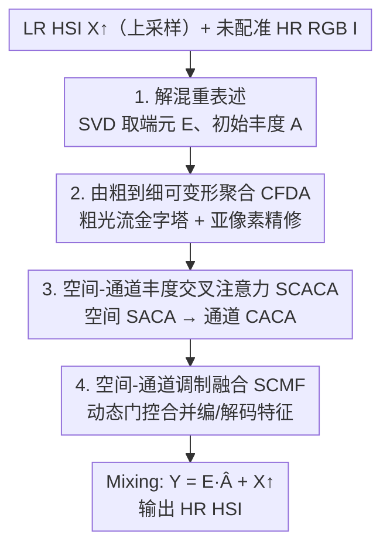

# Enhancing Unregistered Hyperspectral Image Super-Resolution via Unmixing-based Abundance Fusion Learning

**会议**: CVPR 2026  
**论文**: [CVF Open Access](https://openaccess.thecvf.com/content/CVPR2026/html/Zhang_Enhancing_Unregistered_Hyperspectral_Image_Super-Resolution_via_Unmixing-based_Abundance_Fusion_Learning_CVPR_2026_paper.html)  
**代码**: https://github.com/yingkai-zhang/UAFL （论文承诺开源，待发布）  
**领域**: 图像恢复 / 高光谱超分辨率  
**关键词**: 高光谱超分, 非配准融合, 光谱解混, 可变形聚合, 交叉注意力

## 一句话总结
针对"低分辨率高光谱图 + 一张未配准高分辨率参考图"的超分任务，本文用光谱解混把空间和光谱信息解耦，让网络只去增强解混出的丰度图（而非直接做易受错位干扰的空谱耦合融合），再配合由粗到细的可变形聚合、空间-通道丰度交叉注意力和调制融合模块，在 ICVL/REAL 数据集上以约一半参数量刷出 SOTA（×4 上 PSNR 41.84/42.05 dB）。

## 研究背景与动机

**领域现状**：高光谱传感器存在空间分辨率与光谱分辨率的固有 trade-off——光谱很准但空间细节差，于是高光谱超分（HSI SR）成为刚需。单图超分受限于单一输入信息量；reference-based 配准超分用一张高分辨率参考图（RGB）补空间细节，效果更好，但严格假设 LR HSI 与参考图已**完美对齐**。

**现有痛点**：现实中平台振动、视角变化、传感器采集时间差，几乎必然带来错位，于是出现"非配准 HSI SR"。主流做法是两阶段：先用预训练光流模型（如 RAFT）显式把参考图 warp 对齐，再交给空谱耦合网络融合。但这套有两个硬伤：① **显式对齐**会在 warp 后的图像里引入纹理畸变和伪影（论文 Fig.2(c) 把参考 RGB warp 后从 41.59 dB 掉到 14.79 dB）；② **空谱耦合融合**让网络要同时学空间和光谱，学习容量被严重约束（Fig.1 里这类方法参数大、PSNR 反而不高）。

**核心矛盾**：错位无法回避，而"在像素域显式对齐 + 在耦合空谱域融合"这条路既会引入伪影、又难学。问题根子在于：直接在原始空谱耦合域里融合一张未对齐的参考，把"对齐误差"和"空谱重建"两件难事搅在了一起。

**切入角度**：HSI 因强光谱相关性具有低秩性，可做光谱解混（unmixing），而解混本身对几何错位**鲁棒**（端元 endmember 反映材质光谱，与像素对齐与否无关）。作者据此在 Fig.2(d) 做了关键验证：用 **LR HSI 的端元 $E_{lrhsi}$ + HR HSI 的丰度 $A_{hrhsi}$** 重新混合（mixing），能高质量重建出 HR HSI（41.46 dB）；而直接拿端元去混未配准参考 RGB 则定量很差（14.79 dB，虽看上去清晰）。这说明只要拿到"结构良好、对齐准"的丰度图，端元几乎不用动就能重建。

**核心 idea**：把"非配准空谱融合"重新表述为"**学习残差丰度图**"——先用 SVD 解混固定端元、得到初始丰度，再让网络专心利用未配准参考去增强这张丰度图。这一步把难题拆成了一个更具体、更好优化的学习目标。

## 方法详解

### 整体框架
输入是一张 LR HSI $X\in\mathbb{R}^{h\times w\times B}$ 和一张未配准 HR RGB 参考 $I\in\mathbb{R}^{H\times W\times b}$，目标输出 HR HSI $Y\in\mathbb{R}^{H\times W\times B}$。整条流水线分三段：**解混（Unmixing）→ 多尺度编码-解码增强丰度 → 混合（Mixing）**。

先把 LR HSI 上采样到目标尺寸得 $X_\uparrow$，对其做奇异值分解 $X_\uparrow = USV^T$，取 $U$ 的前 $K$ 个左奇异向量构成端元矩阵 $E\in\mathbb{R}^{B\times K}$（论文取 $K=3$），初始丰度由 $A=E^T X_\uparrow$ 得到。网络 $f(\cdot|\theta)$ 不再去预测整张 HSI，而是以初始丰度 $A$ 和参考 $I$ 为输入，学一张增强后的残差丰度 $\hat{A}=f(A,I|\theta)$。在编码-解码的 backbone 里串入三个核心模块：**CFDA** 把未配准参考特征隐式聚合对齐到丰度特征上、**SCACA** 用空间+通道交叉注意力精修丰度、**SCMF** 在解码端用动态门控融合编码-解码特征。最后做混合 $Y_{res}=E\hat{A}$，并加回上采样基底 $Y=Y_{res}+X_\uparrow$ 得到最终 HR HSI。整个方案的精髓是：端元始终固定不学，所有可学习容量都花在"把丰度对齐好、增强好"上。

### 关键设计

**1. 解混重表述：把空谱耦合融合改写成学残差丰度**

针对"直接在耦合空谱域融合未对齐参考既引入伪影又难学"这个根本痛点，本文用光谱解混做问题分解。利用 HSI 的低秩性，对上采样后的 $X_\uparrow$ 做 SVD，前 $K$ 个左奇异向量当端元 $E$、$A=E^T X_\uparrow$ 当初始丰度。关键在于：**端元代表材质光谱、对错位天然鲁棒，所以固定不动**；网络只学增强后的残差丰度 $\hat{A}=f(A,I|\theta)$，最终 $Y=E\hat{A}+X_\uparrow$。

$$Y = E\hat{A} + X_\uparrow,\qquad \hat{A}=f(A,I|\theta)$$

这样做有效，是因为 Fig.2(d) 的解混分析证明了"$E_{lrhsi}$ + 好的 $A_{hrhsi}$ 就能高质量重建"——光谱精度由 LR HSI 自身保证、空间结构问题全部收敛到"丰度图增强"这一个子任务上。相比旧的两阶段方法在像素域显式对齐再耦合融合，这里把一个复杂耦合问题转成了单一、可优化的残差学习目标，网络容量不再被空谱耦合稀释。⚠️ 端元固定为 SVD 直接结果、不参与训练，这一假设的边界（端元估计误差会不会传导）论文未深入讨论，以原文为准。

**2. 由粗到细可变形聚合 CFDA：在特征域隐式对齐，绕开像素 warp 的伪影**

显式像素对齐会把畸变烙进图像，本文改为在**深度特征域**做隐式聚合。CFDA 分两级。**粗光流金字塔预测器（CPFP）**：先把丰度特征 $F$ 与参考特征 $F_{ref}$ 下采样，卷积预测低分辨率光流再上采样为粗运动先验 $C_{flow}=\mathrm{Up}(\mathrm{Conv}_{3\times3}(F_\downarrow,F_{ref\downarrow}))$；用它 warp 参考后与 $F$ 拼接，再预测残差光流 $\Delta C_{flow}$ 和相似度图，得到最终先验光流 $F_{flow}=C_{flow}+\Delta C_{flow}$ 与置信度 $F_{sim}=\mathrm{Sigmoid}(F'_{sim})$。**亚像素精修（FSPR）**：取光流小数部分 $d_f$ 做频率位置编码 $\gamma(d_f)=[\omega d_f,\omega^2 d_f,\dots]$，拼成 $F_{pe}=\mathrm{Concat}[\sin(\gamma(d_f)),\cos(\gamma(d_f))]$ 给出亚像素级先验；精修网络吃 $[F,\mathrm{Warp}(F_{ref},F_{flow}),F_{pe}]$ 预测残差偏移和 mask $\Delta P=(\Delta P_o,\Delta P_m)$，最终偏移 $O=F_{flow}+\mathrm{Tanh}(\Delta P_o)$、调制掩码 $M=\mathrm{Sigmoid}(F_{sim}\odot\Delta P_m)$，再用调制可变形卷积把参考特征聚合成 $\hat{F}_{ref}$。

之所以有效：先验光流给可变形卷积一个稳定起点、亚像素编码补足精度，整个对齐发生在特征而非像素层面，因此不会像 warp 图像那样留下纹理伪影。消融（Tab.4）显示，相比通用 DCNv2（41.80 dB），CFDA 把 PSNR 提到 41.95 dB，且特征可视化里 DCNv2 的伪影/模糊文字被 CFDA 显著消除。

**3. 空间-通道丰度交叉注意力 SCACA：用参考结构分别精修丰度的空间结构与光谱响应**

聚合后的参考特征还需进一步引导丰度精修。SCACA 先用轻量自调制 $\hat{F}_{refm}=\hat{F}_{ref}+\hat{F}_{ref}\odot\mathrm{Sigmoid}(\mathrm{Conv}_{5\times5}(\hat{F}_{ref}))$ 强化参考特征，再做**层级交叉注意力**：先空间后通道。**空间分支 SACA** 用窗口交叉注意力，$Q,K,V$ 全来自丰度特征 $Z_w$，但在聚合前用参考特征调制 Value：$V_{mod}=V\odot\mathrm{Reshape}(\hat{F}_{refw})$，$\hat{Z}=\mathrm{Softmax}(QK^T/\sqrt{d_k}+B)V_{mod}$，借参考的结构信息引导丰度的空间对应关系。**通道分支 CACA** 互补地精修光谱签名，同样以参考调制 Value $V_{mod}=V\odot\hat{F}_{refm}$，自适应放大显著光谱、压制无关响应。

设计巧在"Value 调制"这一招：不是简单 concat 参考，而是让参考特征直接作用在注意力的 Value 上，使丰度精修过程显式吸收参考的空间结构和通道特性。空间+通道双路结合，让多模态信息既补了空间细节又对齐了光谱。消融里 SCACA 把基线从 41.41 提到 41.66 dB。

**4. 空间-通道调制融合 SCMF：动态门控合并编/解码特征，避免简单跳连丢细节**

编码-解码间的特征如果直接相加/拼接，难以在不同尺度自适应取舍。SCMF 把编码特征 $F_{enc}$ 与解码特征 $F_{dec}$ 沿通道拼成 $F_{cat}$，再走两条并行调制。**空间调制**：值分支用深度卷积+LeakyReLU 生成 $V_{spa}$，门控分支 $M_{spa}=\mathrm{Sigmoid}(\mathrm{Conv}_{3\times3}(F_{cat}))$ 给每个像素一个重要性权重，$F_{spa}=V_{spa}\odot M_{spa}$。**通道调制**：值分支用 $1\times1$ 卷积得 $V_{spe}$，门控分支先全局平均池化成通道描述子再 $1\times1$ 卷积 $M_{spe}=\mathrm{Sigmoid}(\mathrm{Conv}_{1\times1}(\mathrm{GAP}(F_{cat})))$，$F_{spe}=V_{spe}\odot M_{spe}$。两路相加并残差接回解码特征：

$$\hat{F}_{dec}=(F_{spa}+F_{spe})+F_{dec}$$

有效之处在于门控权重是**动态、由内容生成**的，空间门控按局部上下文强调/抑制细节、通道门控按全局描述子重标定光谱响应，两者互补再残差保底。Tab.5 显示越是困难的大倍率收益越大——×16 上加 SCMF 提升 0.38 dB，说明它在多尺度特征融合里对高频细节恢复尤其关键。

### 损失函数 / 训练策略
端到端只用 L1 损失训练。配置 $C=64$ 维特征、$K=3$ 个端元；AdamW 优化器，weight decay $5\times10^{-5}$、学习率 $1\times10^{-5}$，batch size 1，单张 RTX 4090；ICVL 训 150 epoch、REAL 训 300 epoch。LR HSI 由高斯核（$\mu=8,\sigma=3$）模糊后按 ×4/×8/×16 下采样得到。

## 实验关键数据

### 主实验

ICVL 模拟数据集，×4 倍率（PSNR↑/SSIM↑/SAM↓）：

| 方法 | 来源 | PSNR | SSIM | SAM |
|------|------|------|------|-----|
| SSPSR | TCI'20 | 40.19 | 0.982 | 0.033 |
| HSIFN | TNNLS'24 | 41.14 | 0.983 | 0.041 |
| SRLF | CVPR'25 | 38.75 | 0.977 | 0.041 |
| SSCH-S | IJCV'25 | 41.38 | **0.987** | 0.031 |
| **本文** | - | **41.84** | 0.986 | **0.025** |

REAL 真实数据集，多倍率对比（PSNR↑ / 参数量 / FLOPs）：

| 方法 | ×4 PSNR | ×8 PSNR | ×16 PSNR | Params(M) | FLOPs(G) |
|------|---------|---------|----------|-----------|----------|
| HSIFN | 40.15 | 34.39 | 30.07 | 21.01 | 594.10 |
| SSCH-S | 41.16 | 36.19 | 31.91 | 11.01 | 165.68 |
| **本文** | **42.05** | **37.23** | **32.28** | **5.94** | **96.17** |

本文在三个倍率上全面领先：×4/×8/×16 分别比次优高 0.89/1.04/0.37 dB，且参数量约为 SSCH-S 的一半、FLOPs 少约 42%，实现了精度与效率的双赢（Fig.1 气泡图里位于左上角）。

### 消融实验

逐模块累加（REAL，×4）：

| Unmix | SCACA | CFDA | SCMF | PSNR | SAM | Params |
|-------|-------|------|------|------|-----|--------|
| ✗ | ✗ | ✗ | ✗ | 41.26 | 0.036 | 5.08M |
| ✓ | ✗ | ✗ | ✗ | 41.41 | 0.034 | 5.05M |
| ✓ | ✓ | ✗ | ✗ | 41.66 | 0.034 | 4.85M |
| ✓ | ✓ | ✓ | ✗ | 41.95 | 0.033 | 5.85M |
| ✓ | ✓ | ✓ | ✓ | **42.05** | **0.033** | 5.94M |

CFDA 单独对比（REAL，×4）：

| 聚合方式 | PSNR | SAM | Params |
|----------|------|-----|--------|
| w/o Aggregation | 41.66 | 0.034 | 4.85M |
| w/ DCNv2 | 41.80 | 0.033 | 5.78M |
| w/ CFDA | **41.95** | **0.033** | 5.85M |

### 关键发现
- **解混策略是地基**：仅加 Unmix 就把基线从 41.26 提到 41.41 dB，且参数还略降——验证"固定端元、只学残差丰度"确实简化了优化目标。
- **CFDA 贡献最显著的单步提升**：加入 CFDA 让 PSNR 从 41.66 跳到 41.95（+0.29 dB），且优于通用 DCNv2（41.80），特征可视化里伪影/模糊明显减少，说明"特征域隐式聚合 + 由粗到细光流先验"确实比像素 warp 干净。
- **SCMF 在大倍率收益更大**：×16 上 +0.38 dB 远超 ×4 的 +0.10 dB，说明任务越难、多尺度动态门控融合越重要。
- **K=3 端元足够**：在强光谱相关性下，仅 3 个端元即可重建，进一步印证 HSI 低秩假设。

## 亮点与洞察
- **把"对齐难题"换成"丰度增强易题"**：最 aha 的是 Fig.2(d) 的实证——端元对错位鲁棒、只需修好丰度图就能重建，于是显式对齐这一步整个被绕过，伪影问题从根上消失。这种"用问题结构（低秩/可解混）做分解"的思路可迁移到其它带几何错位的融合任务（如多光谱-全色融合、跨模态配准恢复）。
- **Value 调制式交叉注意力**：不 concat 参考而是用参考特征逐元素调制注意力 Value，是个轻量又有效的多模态注入 trick，可复用到任意"主特征 + 引导特征"的精修场景。
- **效率友好**：用约一半参数刷 SOTA，说明"省下耦合融合的容量、专注丰度"不仅效果好还更省，对实际部署有意义。

## 局限与展望
- **端元由 SVD 一次性固定且不参与训练**：若 LR HSI 本身光谱质量差或场景端元数远超 $K=3$，固定端元可能成为重建上限，论文未讨论端元估计误差的传导。
- **仍依赖一张 HR RGB 参考**：方法是 reference-based，参考缺失或与目标场景差异极大时效果未验证；RGB 仅 3 通道，对参考之外的光谱细节贡献有限。
- **⚠️ 真实数据规模有限**：REAL 仅 60 对、测试 10 对，泛化性结论需谨慎；不同传感器/室外强光场景下的鲁棒性有待更大规模验证。
- 改进方向：让端元可学/可自适应估计，或引入端元数自动选择；探索无参考或弱参考设定下的丰度增强。

## 相关工作与启发
- **vs 两阶段显式对齐（如 SSCH/HSIFN）**：它们先用预训练光流 warp 参考再耦合融合，本文不做像素 warp、改在特征域用 CFDA 隐式聚合，避开了 warp 伪影（Fig.2(c) 那种从 41.59 掉到 14.79 dB 的灾难），且把融合从空谱耦合域转到丰度域，参数更省、精度更高。
- **vs 优化类解混超分（Optimized 等）**：传统解混优化方法对错位有一定鲁棒性但依赖手工先验、难应对复杂真实场景（Tab.1 里 Optimized 仅 25.35 dB）；本文保留"解混对错位鲁棒"的优点，但用深度网络学残差丰度+可变形聚合，摆脱手工先验。
- **vs 通用可变形卷积 DCNv2**：直接用 DCNv2 聚合会留伪影（41.80 dB），本文的 CFDA 用"粗光流金字塔 + 亚像素频率编码精修"给可变形卷积更稳的先验，把 PSNR 提到 41.95 dB 且特征更干净。

## 评分
- 新颖性: ⭐⭐⭐⭐⭐ 用光谱解混把非配准空谱融合重表述为"固定端元+学残差丰度"，从问题结构上消解了显式对齐的伪影难题，切入角度新且有实证支撑。
- 实验充分度: ⭐⭐⭐⭐ 模拟+真实双数据集、三倍率、逐模块消融与 CFDA/SCMF 专项消融都齐全，但真实数据规模偏小。
- 写作质量: ⭐⭐⭐⭐⭐ 动机用 Fig.2(d) 解混分析讲得透彻，模块公式完整，框架图清晰。
- 价值: ⭐⭐⭐⭐ 以约一半参数刷 SOTA，对参考型 HSI 超分的实用化有明确推进，思路可迁移到其它带错位的融合恢复任务。

<!-- RELATED:START -->

## 相关论文

- [\[CVPR 2026\] EMR-Diff: Edge-aware Multimodal Residual Diffusion Model for Hyperspectral Image Super-resolution](emr-diff_edge-aware_multimodal_residual_diffusion_model_for_hyperspectral_image_.md)
- [\[CVPR 2026\] RegionFuse: Region-Adaptive Pixel Distribution Learning for Infrared and Visible Image Fusion](regionfuse_region-adaptive_pixel_distribution_learning_for_infrared_and_visible_.md)
- [\[NeurIPS 2025\] Enhancing Infrared Vision: Progressive Prompt Fusion Network and Benchmark](../../NeurIPS2025/image_restoration/enhancing_infrared_vision_progressive_prompt_fusion_network_and_benchmark.md)
- [\[CVPR 2026\] Bridging the Perception Gap in Image Super-Resolution Evaluation](bridging_the_perception_gap_in_image_super-resolution_evaluation.md)
- [\[CVPR 2026\] SAT: Selective Aggregation Transformer for Image Super-Resolution](sat_selective_aggregation_transformer_for_image_super_resolution.md)

<!-- RELATED:END -->
