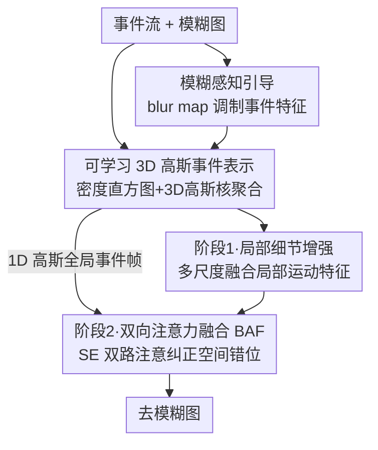

# Event-Based Motion Deblurring Using Task-Oriented 3D Gaussian Event Representations

**会议**: CVPR 2026  
**论文**: [CVF Open Access](https://openaccess.thecvf.com/content/CVPR2026/html/Xue_Event-Based_Motion_Deblurring_Using_Task-Oriented_3D_Gaussian_Event_Representations_CVPR_2026_paper.html)  
**代码**: 未公开  
**领域**: 图像恢复 / 事件相机去模糊  
**关键词**: 事件相机, 运动去模糊, 可学习事件表示, 3D高斯核, 双向注意力融合  

## 一句话总结
针对现有事件去模糊普遍使用「固定权重核」把稀疏事件聚合成事件帧、无法适配局部运动快慢差异的问题，本文提出一个**可学习的 3D 高斯事件表示**：根据模糊图内容与事件密度自适应采样关键时空坐标、用 3D 高斯核加权聚合事件，再配一个两阶段融合网络（局部细节增强 + 1D 高斯全局对齐），在 GoPro/HS-ERGB/REBlur 三个数据集上 PSNR 全面超越 SOTA。

## 研究背景与动机
**领域现状**：事件相机有微秒级时间分辨率，能捕捉 RGB 帧之间的运动信息，是去运动模糊的天然辅助传感器。但事件流稀疏、结构不规则，无法直接和 RGB 融合，主流做法是先用一个**手工设计的固定权重核**把稀疏事件点沿时间轴聚合成「事件帧」，再喂给恢复网络。代表方法是 Voxel Grid——把事件沿时间分成 N 个 bin，用固定的双线性插值权重累加。

**现有痛点**：真实场景里运动是高度**非线性、空间异质**的——画面不同区域的运动速度和方向各不相同。慢运动产生稀疏事件，需要更长的时间积分窗口 $T$ 才能把边缘信息攒够；快运动产生密集事件，需要更短的 $T$ 否则边缘会糊成一片。固定权重核没有样本自适应能力：在事件密集区分不清权重、在稀疏区生成低质量表示，导致同一张事件帧不同区域质量参差，运动信息利用不充分。即便是 EST/LETC 这类已经「可学习」的事件表示，它们的核在时间轴上仍是**均匀分布**的，无法贴合每个样本各自的时间密度曲线。

**核心矛盾**：事件帧的质量取决于「积分窗口 $T$ 和权重核形状要随局部运动快慢动态变化」，而手工核 / 均匀核都把这套参数写死了，无法做到逐区域、逐样本自适应。

**本文目标**：让事件聚合这一步本身「面向去模糊任务」可学习——既要按事件密度分配采样点（密集多采、稀疏少采），又要让每个核的中心位置和覆盖范围（含 xyt 三轴耦合）都能根据图像退化程度自适应调整。

**核心 idea**：用一组**可学习的 3D 高斯核**替代固定权重核来聚合事件——核中心由「模糊图引导 + 事件密度直方图」预测，核的协方差矩阵决定它在时空中的注意范围；再叠一个两阶段融合网络，先用局部运动特征补细节、再用 1D 高斯全局事件帧纠正结构错位。

## 方法详解

### 整体框架
输入是一段**事件流**和一张**模糊图**，输出是去模糊后的清晰图。整条管线分两大块：先把事件流转成一个**任务自适应的事件帧表示**（3D-GSER 模块），再把这个表示和图像特征送进一个**两阶段融合网络**还原清晰图。

具体地，事件流先被体素化成 3D 时空直方图并拼上显式 3D 位置编码；模糊图经一个轻量卷积块生成「模糊得分图」(blur map) 去调制事件特征，让模块知道哪些区域糊得严重；调制后的体素特征经一串深度可分离 3D 卷积提取高层时空特征，再由多头 MLP 采样器预测出 $K$ 个 3D 高斯核（每个核含均值 $\mu$ 和协方差 $\Sigma$）；这些核作为自适应局部注意权重把事件聚合成事件帧。之后进入两阶段融合：第一阶段用多尺度融合把各核生成的局部运动特征和图像纹理对齐增强细节；第二阶段用一个额外的 **1D 高斯（只沿时间轴）事件帧**提供全局边缘位置线索，经双向注意力融合模块 (BAF) 纠正空间错位。

### 关键设计

**1. 可学习 3D 高斯事件表示 (3D-GSER)：把固定权重核换成样本自适应的 3D 高斯核**

这是全文的核心，直接针对「固定核无法适配局部运动异质性」这个痛点。作者用 $K$ 个 3D 高斯核来聚合事件：第 $k$ 个核由均值 $\mu_k=(x_k,y_k,t_k)$（关注中心）和协方差矩阵 $\Sigma_k$（关注范围）参数化，$\Sigma_k$ 的对角元 $\sigma_{xx},\sigma_{yy},\sigma_{tt}$ 决定三个轴各自的覆盖宽度，非对角元 $\rho_{xy},\rho_{xt},\rho_{yt}$ 刻画局部非线性运动场里三个维度的耦合关系（比如斜向运动就是 x-t 耦合）。事件 $(x_i,y_i,t_i)$ 在第 $k$ 个核下的权重为

$$w_i^k=\exp\!\left(-\tfrac12 \Delta_i^\top \Sigma_k^{-1}\Delta_i\right),\quad \Delta_i=(x_i-x_k,\ y_i-y_k,\ t_i-t_k)^\top$$

再按权重把事件投到 2D 网格 $E_k(u,v)=\sum_i w_i^k\,\delta(x_i-u)\delta(y_i-v)$，正负极性各产生 $K$ 帧，共 $2K$ 帧沿通道堆叠成最终事件帧张量。

关键在于核参数**不是手工设定，而是预测出来的**：事件流先体素化成 3D 计数直方图 $V(x,y,t)=\sum \delta_{x,x_i}\delta_{y,y_i}\delta_{t,t_i}$，对数压缩后拼上映射到 $[-1,1]$ 的连续位置编码 $E(x,y,t)=2(t/D,\,x/W,\,y/H)-1$；经 $L$ 层深度可分离 3D 卷积 $Y=\sigma(\mathrm{BN}(\mathrm{PW}(\sigma(\mathrm{BN}(\mathrm{DW}(X))))))$ 抽时空特征后做全局池化得 $F_{\text{global}}$，再借鉴点云方法 SampleNet 的思路用多个 MLP 头预测每个核的 $\mu_k,\Sigma_k$。这样核中心会自动往事件密集（快运动）区聚、协方差会自动收窄时间窗口，稀疏区则放宽 $T$ 攒边缘——一举解决密集区糊、稀疏区空的老问题。

**2. 模糊感知引导 (Blur Map)：让事件聚合「知道」画面哪里糊得最厉害**

只看事件密度还不够——密度反映运动快慢，但不直接等于「这块需要重点修」。作者用模糊图本身提供任务导向的先验：对模糊图 $I_b$ 过一个轻量卷积块生成模糊得分图 $S_b=\sigma(\mathrm{Conv}(I_b))\in[0,1]^{H\times W}$，高亮严重模糊区域，再广播到体素域、用一个可学习标量 $\alpha$ 去调制事件特征：

$$\tilde V_{\text{guided}}(x,y,t)=\tilde V(x,y,t)+\alpha\,S_b(x,y)$$

这样采样器在预测高斯核时会被引导着把注意力更多分给退化重的区域，等于把「去模糊任务」的信号注入到表示构建阶段，而不是等到恢复网络才用——这也是标题里 "task-oriented" 的由来。消融显示它在 GoPro 上贡献约 +0.10 dB。

**3. 两阶段融合网络 + 双向注意力融合 (BAF)：局部补细节、全局纠错位**

3D 高斯核只盯局部时空区域，捕到的主要是局部运动场，不同核因时间轴坐标不同会导致生成的事件帧**彼此空间错位**。作者据此设计两阶段融合（基于 EFNet）：第一阶段做多尺度融合，用注意力把各核的局部运动特征和图像纹理细致对齐，专攻细节恢复；第二阶段额外用一个 **1D 高斯核（只沿 t 轴）**生成一张提供全局边缘位置线索的事件帧，送进 BAF 模块纠正全局错位。

BAF 的机制是双向的对称注意：图像特征 $I$ 和事件特征 $E$ 各自先归一化、$1\times1$ 卷积调通道、GELU，再各过一个 SE 块算出通道注意权重 $A_I=\mathrm{SE}(I),\ A_E=\mathrm{SE}(E)$，分别逐元素加权 $F_I=I\odot A_I,\ F_E=E\odot A_E$，然后沿通道拼接、$1\times1$ 卷积降维、FFN 处理，最后残差相加。两条支路互相用对方的全局响应调制自己，从而把局部核之间的错位边缘拉回到一致的结构位置。消融里加上 BAF（变体 C）把 GoPro PSNR 从 36.61 推到 36.76 dB，可视化也显示它有效抑制了 ghosting 和边缘偏移。

> 此外原文还专门讨论了「极性湮灭」(polarity annihilation)：同一边缘同时产生正负事件，累加时互相抵消造成 ghosting，所以正负极性分开处理、各生成 $K$ 帧——这是上面 $2K$ 帧设计的由来。

### 损失函数 / 训练策略
单卡 RTX 3090、PyTorch，直接在 GoPro-ESIM 上训练无需预训练。输入裁成 $256\times256$ patch、事件流同步切段，batch size 4，AdamW（$\beta_1=0.9,\beta_2=0.99$）、初始学习率 $2\times10^{-4}$、余弦退火 $T_{\max}=400\text{K}$ 迭代，数据增强用随机旋转和翻转。HS-ERGB 与 REBlur 上则在 GoPro 预训练模型基础上微调 4K 迭代、学习率降到 $2\times10^{-5}$。

## 实验关键数据

### 主实验
三个数据集（合成 GoPro、半合成 HS-ERGB、真实 REBlur）上 PSNR 全部取得最优，分别比之前最好方法高 0.16 / 0.62 / 0.15 dB：

| 方法 | 来源 | GoPro PSNR/SSIM | HS-ERGB PSNR/SSIM | REBlur PSNR/SSIM | Params(M) | FLOPs(G) |
|------|------|-----------------|--------------------|-------------------|-----------|----------|
| NAFNet (仅图像) | ECCV2022 | 33.71 / 0.967 | 27.64 / 0.811 | 36.15 / 0.969 | 67.8 | 96.8 |
| EFNet | ECCV2022 | 35.46 / 0.972 | 26.68 / 0.800 | 38.12 / 0.975 | 8.5 | 153.9 |
| MAENet | ECCV2024 | 36.07 / 0.976 | 27.93 / 0.812 | 38.47 / 0.978 | 13.9 | 149.7 |
| SepNet | ICCV2025 | 36.70 / 0.977 | – | 38.53 / 0.977 | – | – |
| **本文** | – | **36.86 / 0.977** | **28.55 / 0.813** | **38.68 / 0.977** | 16.7 | 172.6 |

HS-ERGB 上的 +0.62 dB 提升最显著，说明自适应表示在半合成、运动多样的数据上优势更大。代价是参数量(16.7M)和 FLOPs(172.6G)略高于 EFNet/MAENet。

### 消融实验

模块消融（GoPro / REBlur，以 Voxel Grid 为 baseline）：

| 配置 | Blur Map | BAF | 3D-GSER | GoPro PSNR | REBlur PSNR |
|------|:--------:|:---:|:-------:|------------|-------------|
| Baseline | × | × | × | 36.13 | 38.01 |
| A | × | × | ✓ | 36.51 | 38.37 |
| B | ✓ | × | ✓ | 36.61 | 38.41 |
| C | × | ✓ | ✓ | 36.76 | 38.53 |
| D（完整） | ✓ | ✓ | ✓ | **36.86** | **38.68** |

事件表示对比（GoPro，统一 bin/核数量）：

| 表示 | 类型 | PSNR | SSIM |
|------|------|------|------|
| Voxel Grid | 手工 | 36.13 | 0.9719 |
| SCER | 手工 | 35.95 | 0.9711 |
| DA | 手工 | 36.09 | 0.9713 |
| EST | 可学习 | 35.86 | 0.9704 |
| LETC | 可学习 | 35.84 | 0.9710 |
| **3D-GSER** | 可学习 | **36.51** | **0.9751** |

### 关键发现
- **3D-GSER 贡献最大**：从 Baseline 到变体 A（只换表示）GoPro 直接 +0.38 dB、REBlur +0.36 dB，是单一最大增量；BAF 次之（C 相对 A +0.25 dB），Blur Map 最小（B 相对 A +0.10 dB）。
- **可学习 ≠ 自适应**：EST/LETC 虽然「可学习」却比手工 Voxel Grid 还低，原因是它们的核在时间轴上仍均匀分布；3D-GSER 比最好的替代表示高 0.38 dB，关键在于它既按密度采样多个 3D 坐标、又用协方差矩阵动态调注意范围。
- **BAF 专治结构错位**：可视化中变体 A 有 ghosting、B 仍有边缘偏移，加 BAF 的 C 才把边缘位置纠回来——印证「局部核会带来时间轴错位、需要全局 1D 高斯帧对齐」的设计动机。

## 亮点与洞察
- **把「事件聚合」本身变成面向任务可学习的一步**：以往事件帧只是预处理，核形状写死；本文让核中心和协方差都由「模糊图 + 密度」预测，等于把去模糊目标前置注入到表示构建——这个「task-oriented representation」思路可迁移到事件超分、事件 SLAM 等任何依赖事件帧聚合的下游。
- **3D 高斯协方差的非对角元建模运动耦合**：用 $\rho_{xt},\rho_{yt}$ 显式刻画 xy-t 耦合，相当于让单个核能表达斜向/旋转运动，这是固定双线性核做不到的，物理直觉清晰。
- **借 SampleNet 把点云采样思路搬到事件时空域**：用多 MLP 头预测一组 3D 坐标，是把点云领域的可学习采样优雅地复用到事件密度自适应上。

## 局限与展望
- 参数量(16.7M)和 FLOPs(172.6G)高于 EFNet(8.5M/153.9G)，自适应核预测带来的开销在实时/嵌入式部署下可能是瓶颈，作者未给推理时延。
- ⚠️ 核数量 $K$、深度可分离卷积层数 $L$ 等关键超参的敏感性分析原文未充分展开，难判断 36.51 这一档表示增益对 $K$ 的依赖。
- 训练事件来自 ESIM/V2E 仿真，真实事件的噪声、热像素分布与仿真有差距；虽在真实 REBlur 上验证有效，但跨传感器泛化（不同事件相机型号）未测。
- 模糊得分图只用单帧模糊图卷积生成，对超大位移、纹理稀缺区域是否仍可靠定位退化区，值得进一步验证。

## 相关工作与启发
- **vs Voxel Grid / SBT（手工固定核）**: 它们把整个曝光时间均匀切分、用固定权重累加，无法建模空间变化的模糊；本文用预测出的 3D 高斯核按密度自适应聚合，GoPro 表示对比上 +0.38 dB。
- **vs SCER（EFNet 的多时间尺度表示）**: SCER 用 T/6、T/3、T/2 三个手工积分窗口，仍是写死的；本文的 $T$（即协方差时间分量）随样本动态调整，在快运动的 REBlur 上更不易产生厚边和极性湮灭。
- **vs EST / LETC（可学习事件表示）**: 同为可学习核，但它们核位置沿时间轴均匀；本文额外学习核中心坐标，能贴合每个样本的时间密度曲线，因此在 GoPro 上反超它们约 0.65 dB。
- **vs EFNet / MAENet（事件去模糊融合网络）**: 本文沿用 EFNet 的融合骨架，但把前端事件表示换成 3D-GSER、并加入 1D 高斯全局帧 + BAF 做全局对齐，三个数据集 PSNR 均更优。

## 评分
- 新颖性: ⭐⭐⭐⭐ 把事件帧聚合做成密度+模糊双引导的可学习 3D 高斯核，角度新且物理直觉清晰
- 实验充分度: ⭐⭐⭐⭐ 合成/半合成/真实三类数据 + 模块和表示双重消融充分，但缺超参敏感性与推理时延
- 写作质量: ⭐⭐⭐⭐ 动机（密度/速度异质性）到方法（自适应核）逻辑顺，图示直观
- 价值: ⭐⭐⭐⭐ 三数据集 SOTA，且「任务导向事件表示」思路对事件视觉下游有较好迁移性

<!-- RELATED:START -->

## 相关论文

- [\[CVPR 2026\] MAD-Avatar: Motion-Aware Animatable Gaussian Avatars Deblurring](motionaware_animatable_gaussian_avatars_deblurring.md)
- [\[CVPR 2026\] NEC-Diff: Noise-Robust Event–RAW Complementary Diffusion for Seeing Motion in Extreme Darkness](nec-diff_noise-robust_event-raw_complementary_diffusion_for_seeing_motion_in_ext.md)
- [\[CVPR 2026\] BiEvLight: Bi-level Learning of Task-Aware Event Refinement for Low-Light Image Enhancement](bievlight_bi-level_learning_of_task-aware_event_refinement_for_low-light_image_e.md)
- [\[CVPR 2026\] AE2VID: Event-based Video Reconstruction via Aperture Modulation](ae2vid_event-based_video_reconstruction_via_aperture_modulation.md)
- [\[CVPR 2026\] Spatio-Temporal Difference Guided Motion Deblurring with the Complementary Vision Sensor](spatio-temporal_difference_guided_motion_deblurring_with_the_complementary_visio.md)

<!-- RELATED:END -->
