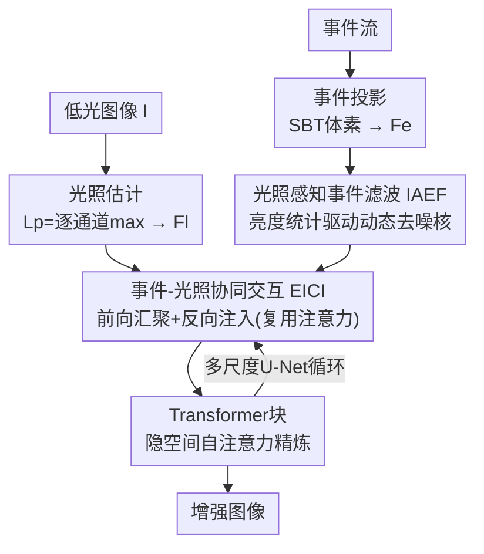

# Event-Illumination Collaborative Low-light Image Enhancement with a High-resolution Real-world Dataset

**会议**: CVPR 2026  
**论文**: [CVF Open Access](https://openaccess.thecvf.com/content/CVPR2026/html/Xu_Event-Illumination_Collaborative_Low-light_Image_Enhancement_with_a_High-resolution_Real-world_Dataset_CVPR_2026_paper.html)  
**代码**: https://github.com/QUEAHREN/EIC-LIE  
**领域**: 图像恢复 / 低光增强  
**关键词**: 事件相机, 低光增强, Retinex, 双向交互, 事件去噪  

## 一句话总结
EIC-LIE 让事件信号（提供 HDR 细节）和图像光照先验（提供全局亮度）通过一个"前向汇聚 + 反向注入、复用注意力矩阵"的双向交互模块协同增强，再用图像亮度统计驱动一个动态事件滤波器压噪声，并配套了首个 1024×768 高分辨率真实事件低光数据集 RLE，在五个数据集上 PSNR 最高超 SOTA 1.24dB。

## 研究背景与动机
**领域现状**：低光图像增强（LIE）主流是 Retinex 路线——把低光图分解为反射率 $R$ 和光照图 $L$（$I = R \odot L$），用估计出的光照先验去引导网络增强。而事件相机因为有高动态范围（HDR）、高时间分辨率，被引入做 event-based LIE，用事件流补回传统传感器丢掉的细节。

**现有痛点**：现有 event-based LIE 有三个具体问题。其一，它们普遍依赖"直接特征融合"——堆一个复杂的融合模块把事件特征和图像特征拼起来，却**丢掉了 Retinex 强调的全局光照信息**，只顾补细节不管整体亮度。其二，低光下光子数极少、事件触发阈值 $c$ 又低，事件流里混进大量随机噪声；EvLight 用从图像估计的 SNR 图做"选择性融合"，但这种固定引导不可靠，增强结果里仍有明显噪点。其三，缺高分辨率真实数据集——此前最好的 SDE 用机械臂沿同一轨迹拍 GT，只能拍**静态慢速场景**，存在 <10ms 的时序错位，且 DAVIS346 传感器分辨率低（346×260）、颜色失真。

**核心矛盾**：事件给的是 HDR 边缘/纹理（局部、高频），图像给的是全局光照（低频、稳定）——两者本应互补，但旧方法只做**单向注入**（把一个模态塞进另一个），缺乏相互精炼的反向通路，导致两个模态无法在网络中被对方的互补信息持续更新。同时，事件噪声的时空统计分布和有效事件差异巨大，传统去噪滤波器很难在"压噪"和"保留有意义事件"之间平衡。

**本文目标与核心 idea**：建立事件与光照之间真正的**双向协同**，并用图像的亮度统计去**动态过滤**事件噪声。一句话——用"前向汇聚 + 反向注入"的双向交互替代单向融合，用"光照感知的动态滤波核"替代固定 SNR 引导，再造一个高分辨率真实数据集 RLE 把这套方法验证扎实。

## 方法详解

### 整体框架
EIC-LIE 的输入是一张低光 RGB 图 $I$ 和与之时间同步的事件流，输出是增强后的正常光图像。流程上先做两件准备：从图像里抽**光照先验** $L_p$（对图像所有通道做逐像素取最大），由它估出光照特征 $F_l$；事件流则用 SBT（基于时间分桶）表示堆成事件体素 $V$（按时间分成 $B$ 个 bin，每个 bin 累加极性 $V(i)=\sum_{k\in T_i} p_k$），抽出初始事件特征 $F_e$。然后主干是一个多尺度 U 形网络，在每个尺度上交替堆叠两个核心模块——**EICI（事件-光照协同交互）**负责把事件、光照、图像三路特征双向融合，**IAEF（光照感知事件滤波）**负责给事件特征去噪，中间再插 Transformer 块在隐空间做自注意力精炼，最终解码出增强图像。

### 关键设计

**1. EICI 事件-光照协同交互：用"前向汇聚+反向注入"做真正的双向融合**

针对旧方法"单向注入、缺乏互补精炼"的痛点，EICI 把交互拆成两个可逆过程。**前向汇聚** $G(\cdot,\cdot)$ 以辅助特征 $X$ 去更新主特征 $T$：$(T', A) = G(X, T)$，用基于协方差的交叉注意力让 $T$ 选择性吸收 $X$ 的上下文，同时**把中间注意力矩阵 $A \in \mathbb{R}^{C\times C}$ 存下来**。**反向注入** $I(\cdot,\cdot)$ 则复用这个 $A$ 把信息送回辅助空间：$X' = I(T', A) + X$，从而在共享信息的同时保持模态独立性。

具体到三路特征：以图像特征 $F_i$ 为主、事件特征 $F_e$ 和光照特征 $F_l$ 为辅，先分别前向汇聚——$(F_i', A_e)=G_e(F_e, F_i)$ 补 HDR 细节、$(F_i'', A_l)=G_l(F_l, F_i)$ 补全局光照；三者相加后过 Transformer 块在隐空间融合 $\hat{F}_i = T(F_i + F_i' + F_i'')$；再用反向注入把融合特征解回各自模态：$\hat{F}_l = I_l(\hat{F}_i, A_l)+F_l$、$\hat{F}_e = I_e(\hat{F}_i, A_e)+F_e$。**关键巧思是复用前向那步存下的 $A_l$、$A_e$ 当隐式对齐约束**——消融显示，若直接用交叉注意力做反解（不复用 $A$），融合特征和模态特征之间存在巨大域差、分不开（t-SNE 上特征纠缠），而复用 $A$ 能让分解后的特征模态独立性强、且各自携带互补的 HDR 纹理与静态亮度信息。

**2. IAEF 光照感知事件滤波：用图像亮度统计驱动一个动态可变形滤波核去事件噪声**

针对低光下事件随机噪声多、固定 SNR 引导不可靠的痛点，IAEF 引入图像里稳定的全局光照统计来动态加权滤波。它从两路特征里抽三组参数：从**光照特征** $F_l$ 抽出可分离的 1D 滤波核 $K_v, K_h = \mathcal{K}(F_l)$（垂直/水平方向，合成 $n\times n$ 核 $K$，编码光照先验帮助区分噪声与有效事件响应）；从**事件特征** $F_e$ 抽出权重 $W=\mathcal{W}(F_e)$（量化每个像素处事件的可靠性）和空间偏移 $P_x, P_y = \mathcal{P}(F_e)$（动态参考邻域里可用事件的坐标，应对噪声与事件错位）。

最终对像素 $(m,n)$ 的滤波是一个可变形采样加权聚合：
$$\hat{F}_e(m,n) = \sum_{(P_x,P_y)} W(m,n)\cdot K(m,n)\cdot S\big(F_e,\,(m+P_x(m,n),\,n+P_y(m,n))\big)$$
其中 $S(\cdot)$ 是空间采样，核 $K(m,n)$ 用 $K_v(n)\cdot K_h(m)$ 近似（可分离降算量）。和传统事件去噪滤波器相比，它的有效性来自把**全局光照先验**编进核里——既建模了信噪事件时空分布差异，又有稳定的亮度统计兜底，所以能在压噪和保留有意义事件之间取得平衡（t-SNE 可见 Post-IAEF 的事件特征噪声明显低于 Pre-IAEF）。

**3. RLE 数据集与双分束器混合成像系统：补齐高分辨率真实事件低光基准**

针对此前数据集"只能拍静态慢速、时序错位、分辨率低、颜色失真"的痛点，作者设计了一套**双分束器同轴对齐**的光学系统：第一块分束器 10R/90T，90% 光给正常光 RGB 相机（Sony IMX273，1440×1080）；剩下 10% 进第二块 50R/50T 分束器，让低光 RGB 相机和事件相机（Sony&Prophesee IMX636，1280×720）各拿到 10%×50% 的光强，满足 $L_1 + L_2 = L$ 的光路守恒。再用外部同步控制器保证三台相机精确同步触发、配合套筒和单应变换做空间对齐。由此拿到首个 1024×768 的真实事件低光数据集 RLE，覆盖室内外、宽光照范围和复杂动态场景，时间同步且带 GT，相比 SDE（346×260）分辨率大幅提升，并支持场景内的相对运动。

## 实验关键数据

### 主实验
在 SDE（真实）、SDSD（合成）、RLE（本文真实）共多个数据集上，EIC-LIE 全面超 SOTA，且参数量只有 EvLight 的约 9.4%。

| 数据集 | 指标 | EIC-LIE | EvLight (CVPR'24) | 提升 |
|--------|------|---------|-------------------|------|
| SDE-indoor | PSNR / SSIM | 23.33 / 0.7573 | 22.44 / 0.7697 | +0.89dB |
| SDE-outdoor | PSNR / SSIM | 24.22 / 0.8200 | 23.21 / 0.7505 | +1.01dB / +0.0695 |
| SDSD-indoor | PSNR / SSIM | 29.76 / 0.9193 | 28.52 / 0.9125 | +1.24dB |
| SDSD-outdoor | PSNR / SSIM | 27.45 / 0.8668 | 26.67 / 0.8356 | +0.78dB / +0.0312 |
| RLE | PSNR / SSIM | 23.63 / 0.7670 | 22.68 / 0.7201 | +0.95dB / +0.0469 |

参数量上 EIC-LIE 仅 2.13M（EvLight 22.73M），RLE 上 1024×768 推理 298ms，比 EvLight（323ms）更快。

### 消融实验
作者把三处核心设计分别拆开做了消融（均在 RLE 上，baseline 各不同）。

| 配置 | PSNR | SSIM | 说明 |
|------|------|------|------|
| 仅 baseline（无 I 无 E） | 19.53 | 0.6623 | Case 0 |
| w. E（只加事件引导） | 21.40 | 0.7287 | +1.87dB |
| w. I（只加光照引导） | 21.08 | 0.7194 | +1.55dB |
| **w. I&E（完整）** | **23.63** | **0.7670** | 双引导，相比无引导分别 +2.23/+2.55dB |
| 无事件滤波（Case 3） | 20.92 | 0.7064 | IAEF baseline |
| w. Conv. 滤波（Case 4） | 21.92 | 0.7481 | 普通卷积压不住噪声 |
| w. Transformer 滤波（Case 5） | 21.86 | 0.7430 | TB 也压不住 |
| **w. IAEF** | **23.63** | **0.7670** | 比无滤波 +2.71dB |
| 无反向注入（Case 6） | 20.24 | 0.6920 | BI baseline |
| w. Gating（Case 7） | 20.92 | 0.7237 | 门控替代 |
| w. Cross-Attn（Case 8） | 21.05 | 0.7128 | 直接交叉注意力替代 |
| **w. BI（反向注入）** | **23.63** | **0.7670** | 比无 BI +3.39dB（原文称 >2.58dB） |

### 关键发现
- **反向注入里"复用注意力矩阵"是分离模态的关键**：直接换成交叉注意力（Case 8，21.05dB）或门控（Case 7）都明显掉点，作者归因于不复用 $A$ 时融合特征与模态特征域差太大、分不开。
- **IAEF 必须用光照先验，普通 Conv/Transformer 不行**：Case 4/5 只比无滤波高约 1dB，而 IAEF 高 2.71dB——说明压事件噪声的关键不是更强的算子，而是引入全局光照统计去区分信噪事件。
- **事件和光照引导接近等价且互补**：单独加各 +1.5~1.9dB，合起来 +4.1dB，验证了 HDR 细节与全局光照确实互补而非冗余。

## 亮点与洞察
- **"前向存注意力、反向复用注意力"是个可迁移的双向交互范式**：用同一个 $A$ 把信息送过去又解回来，天然形成隐式对齐约束，避免了多模态融合后无法干净分离回各模态的老问题，可借鉴到任何"融合后还要拆回各模态"的多模态任务。
- **把去噪从"特征级硬融合"变成"动态可变形采样核"**：IAEF 用光照算核、用事件算权重和偏移，本质是一个内容自适应的可变形滤波器，比固定 SNR 图灵活得多。
- **数据集工程很扎实**：双分束器同轴 + 外部同步触发，直接绕过了机械臂方案"只能静态、时序错位"的硬伤，是这条线方法落地真实动态场景的基础。

## 局限与展望
- 方法依赖图像侧的全局光照先验质量——极端低光下图像本身几乎全黑、亮度统计可能不可靠时，IAEF 的引导是否还稳定，论文未深入讨论。⚠️ 此为笔者推测，以原文为准。
- EICI/IAEF 的细节（$G(\cdot)$、$I(\cdot)$ 的具体实现，核提取/权重提取模块结构）放在补充材料里，正文公式偏抽象，复现需查 supp.。
- RLE 虽然分辨率和动态性都领先，但仍是单一硬件系统采集，跨传感器/跨域泛化（换不同事件相机）尚待验证。
- 反向注入消融文字称 ">2.58dB"，而表 6 数值差为 23.63−20.24=3.39dB，⚠️ 表述与表格口径略有出入，以原文表格为准。

## 相关工作与启发
- **vs EvLight (CVPR'24)**：EvLight 用图像估计的 SNR 图做固定的选择性融合，本文指出这种固定引导在低光下不可靠、残留噪声；EIC-LIE 改用光照感知的动态滤波核 + 双向交互，PSNR 在各数据集上领先 0.78~1.24dB，且参数只有它的约 9.4%。
- **vs MambaLLIE / Retinexformer（纯图像 Retinex 方法）**：它们只有图像、缺 HDR 细节补偿，边缘偏平滑；本文把事件 HDR 信息通过 EICI 注入，恢复出更锐利的纹理。
- **vs SDE 数据集（机械臂方案）**：SDE 靠机械臂沿轨迹拍 GT，只能静态慢速、有时序错位且分辨率低；RLE 用双分束器同轴 + 同步触发，支持高分辨率真实动态场景。

## 评分
- 新颖性: ⭐⭐⭐⭐ 双向交互复用注意力 + 光照感知动态事件滤波，两处机制设计都不落俗套
- 实验充分度: ⭐⭐⭐⭐⭐ 五个数据集 + 三组分别针对核心设计的消融，且自建数据集补齐 benchmark
- 写作质量: ⭐⭐⭐⭐ 动机和消融清晰，但核心模块实现细节大量放进 supp.，正文公式偏抽象
- 价值: ⭐⭐⭐⭐ 方法有效 + 首个高分辨率真实事件低光数据集，对该子领域有基建意义

<!-- RELATED:START -->

## 相关论文

- [\[CVPR 2026\] BiEvLight: Bi-level Learning of Task-Aware Event Refinement for Low-Light Image Enhancement](bievlight_bi-level_learning_of_task-aware_event_refinement_for_low-light_image_e.md)
- [\[CVPR 2026\] Multinex: Lightweight Low-light Image Enhancement via Multi-prior Retinex](multinex_lightweight_low-light_image_enhancement_via_multi-prior_retinex.md)
- [\[ECCV 2024\] Towards Real-world Event-guided Low-light Video Enhancement and Deblurring](../../ECCV2024/image_restoration/towards_real-world_event-guided_low-light_video_enhancement_and_deblurring.md)
- [\[ICCV 2025\] Low-Light Image Enhancement using Event-Based Illumination Estimation (RetinEV)](../../ICCV2025/image_restoration/low-light_image_enhancement_using_event-based_illumination_estimation.md)
- [\[CVPR 2026\] Bi-Bridge: Bidirectional Diffusion Bridges for Low-Light Image Enhancement](bi-bridge_bidirectional_diffusion_bridges_for_low-light_image_enhancement.md)

<!-- RELATED:END -->
