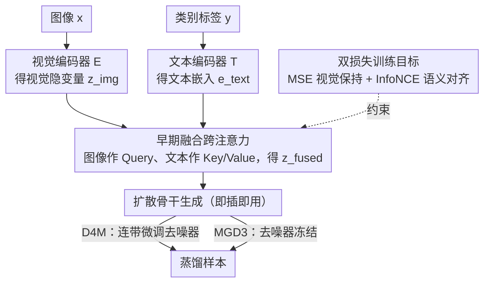

# EVLF: Early Vision-Language Fusion for Generative Dataset Distillation

**会议**: CVPR 2026  
**arXiv**: [2603.07476](https://arxiv.org/abs/2603.07476)  
**代码**: [GitHub](https://github.com/wenqi-cai297/earlyfusion-for-dd/)  
**领域**: 图像复原  
**关键词**: 数据集蒸馏, 扩散模型, 视觉-语言融合, 早期融合, 即插即用

## 一句话总结

提出 EVLF，一种在编码器-骨干网络接口处进行视觉-语言早期融合的即插即用方法，解决了扩散模型数据集蒸馏中晚期语义注入导致的文本过度主导和视觉保真度下降问题。

## 研究背景与动机

数据集蒸馏（Dataset Distillation, DD）旨在合成紧凑的训练集，使模型以少量样本达到高精度。基于扩散模型的 DD 方法（如 D4M、MGD3）已成为主流，但存在一个核心结构性问题：

**晚期融合的语义主导**：标准扩散管道中，文本语义通过去噪阶段的跨注意力注入（late fusion），导致文本信号过度主导生成轨迹

**视觉保真度下降**：由于编码器衍生的视觉隐变量仅包含视觉信息，晚期注入的语义以"纠正"方式工作而非"协同演化"，导致生成的样本标签匹配但视觉失真

**表现为**：生成样本出现不自然的形状、类文本纹理、过度简化的轮廓

核心洞察：将语义融合从去噪阶段提前到编码器输出阶段（encoder-backbone interface），让视觉和语义信号从扩散过程开始就协同演化。

## 方法详解

### 整体框架

EVLF 要治的是扩散数据集蒸馏里"语义注入太晚"的毛病：标准管线把文本条件一路留到去噪阶段才通过跨注意力塞进去，等于让视觉隐变量先成形、再被文本回头"纠偏"，纠偏越用力，画面越容易长出类文本纹理和不自然的轮廓。EVLF 把这一融合步骤整体前移到 VAE 编码器和扩散骨干的接口处。

具体地，图像先过编码器得到视觉隐变量 $z_{\text{img}} = \mathcal{E}(x)$，类别标签过文本编码器得到嵌入 $e_{\text{text}} = \mathcal{T}(y)$；一个轻量跨注意力模块就在这个接口处把两者融成 $z_{\text{fused}} = \text{CA}(z_{\text{img}}, e_{\text{text}})$，再把它当作扩散生成的初始条件喂给骨干。这样语义从扩散过程一开始就在场、和视觉一起演化，而不是事后打补丁。集成 D4M 时还需顺带微调去噪器去适配融合后的隐变量分布，集成 MGD3 时去噪器可保持冻结。

### 关键设计

**1. 早期融合跨注意力：让语义以视觉为锚点被注入，而不是反过来主导画面**

这一块直接对准"晚期注入导致文本过度主导"的痛点。模块刻意把图像 token 当 Query、文本 token 当 Key/Value——谁当 Query，谁就是被"查询"的主体、决定输出的骨架，所以让图像发问、文本应答，等于规定语义只能沿着已有视觉结构去补充，而非另起炉灶重画：

$$Q = \tilde{z}W_Q, \quad K = \tilde{e}W_K, \quad V = \tilde{e}W_V$$

$$z_{\text{fused}} = \psi(\text{LN}(\tilde{z} + \text{softmax}(\frac{QK^\top}{\sqrt{d}})V))$$

注意力结果通过残差加回原视觉隐变量 $\tilde{z}$ 再做 LayerNorm 和投影 $\psi$，所以融合是在视觉基底上"叠"语义、而不是替换它。这正是早期融合相对晚期注入的关键区别：晚期注入面对的是已经定型的去噪轨迹、只能强行掰回来，早期融合则在隐变量刚出炉、还可塑时就让两路信号协同演化。

**2. 双损失训练目标：一手按住视觉结构、一手拉齐类别语义**

光有跨注意力还不够，融合很容易滑向两个极端——要么语义没真正进来，要么视觉被语义带偏。于是训练用两个损失对冲。视觉保持损失 $\mathcal{L}_{\text{MSE}} = \|z_{\text{fused}} - z_{\text{img}}\|_2^2$ 把融合后的隐变量拴在原始视觉隐变量附近，防止它偏离真实图像结构；语义对齐损失 $\mathcal{L}_{\text{InfoNCE}}$ 则通过一个可学习投影器把 $z_{\text{fused}}$ 映到文本嵌入空间，在 batch 内做对比学习，把同类样本拉到一起、异类推开。两者加权求和：

$$\mathcal{L}_{\text{CA}} = \lambda_1 \mathcal{L}_{\text{InfoNCE}} + \lambda_2 \mathcal{L}_{\text{MSE}}$$

训练时 $\lambda_2$（视觉项）从小到大渐进放开，相当于先让模型学会注入语义、再逐步收紧对视觉保真的约束，避免一开始就被 MSE 锁死、语义进不来。

**3. 即插即用：只在一个接口处插模块，不绑定具体训练调度或损失**

EVLF 整套机制都收在编码器-骨干这一个接口里，不改采样器、不依赖特定的扩散损失或训练调度。这意味着它能直接挂到 D4M、MGD3 等任意基于编码器的扩散 DD 管线上：对 D4M 这类需要重训去噪器的方法就连带微调去噪器，对 MGD3 这类可冻结骨干的方法就只训融合模块本身。改动面小，也是它能在多个基线上一致涨点的前提。

### 损失函数 / 训练策略

- 跨注意力模块训练 4 epochs，batch 16，AdamW
- $\lambda_1 = 0.1$（固定），$\lambda_2$ 从 0.05 线性增到 1.0（前 2 epochs）
- 可选去噪器微调：使用 $z_{\text{fused}}$ 上的标准扩散损失
- D4M 集成时需微调去噪器，MGD3 集成时保持冻结
- 单卡 NVIDIA A5000 即可训练

## 实验关键数据

### 主实验

| 数据集 | IPC | 指标 | D4M | D4M+EVLF | MGD3 | MGD3+EVLF |
|--------|-----|------|-----|----------|------|-----------|
| ImageWoof | 10 | ResNetAP-10 | 33.2 | 37.3 | 36.6 | **39.3** |
| ImageWoof | 50 | ResNetAP-10 | 51.7 | 55.8 | 55.6 | **59.0** |
| ImageNette | 20 | ResNetAP-10 | 66.3 | 71.7 | 69.2 | **72.5** |
| CIFAR-10 | 10 | Accuracy | 37.6 | **45.7** | - | - |
| Tiny-ImageNet | 10 | Accuracy | 42.5 | **49.2** | - | - |
| ImageNet-1K | 50 | Accuracy | 60.1 | 60.6 | 60.3 | **61.9** |

### 消融实验

| 配置 | IPC=10 | IPC=20 | IPC=50 | 说明 |
|------|--------|--------|--------|------|
| D4M 基线 | 47.7 | 56.3 | 67.8 | ImageIDC 上 ResNetAP-10 |
| +去噪器微调 | 54.1 | 61.1 | 70.3 | 微调有效 |
| +跨注意力 | 51.1 | 57.5 | 69.1 | 跨注意力有效 |
| +两者结合 | **57.3** | **62.0** | **72.1** | 互补效果最佳 |

### 关键发现

- EVLF 在所有 IPC 设置和数据集上一致提升性能，尤其在低 IPC 时提升更大（CIFAR-10 IPC=10 提升 8.1%）
- t-SNE 可视化显示 EVLF 生成的样本分布范围更广，多样性更好
- $\lambda_1 > 0$（启用 EVLF）时准确率和覆盖率都显著提升，且对 $\lambda_1$ 具体值不敏感
- 迁移学习实验显示 EVLF 蒸馏的数据集具有更好的特征迁移能力

## 亮点与洞察

1. **诊断精准**：准确识别了扩散 DD 中晚期语义注入导致文本过度纠正的核心问题，并用可视化（Fig.1）直观展示
2. **设计优雅**：仅一个轻量跨注意力模块即可实现即插即用的改进，无需修改管线其他部分
3. **实验全面**：覆盖 CIFAR-10/100、Tiny-ImageNet、ImageNet-1K 及其子集，多种 IPC 设置和架构
4. **概念上的启发**：早期融合 vs 晚期融合的比较揭示了条件生成中语义注入时机的重要性

## 局限与展望

1. 当前仅支持类级别条件，不支持实例级或多标签场景
2. EVLF 在 ImageNet-1K 大规模设置上的提升相对较小（~0.5-1.6%）
3. 未探索更复杂的融合机制（如多层融合、自适应融合权重）
4. 未来方向：实例感知和组合提示，扩展到更细粒度的控制

## 相关工作与启发

- **D4M**：原型驱动采样的 LDM DD 方法，EVLF 为其即插即用增强
- **MGD3**：多模态引导 DD，EVLF 同样可无缝集成
- **MinimaxDiffusion**：极小极大优化的 DiT DD，关注判别性和代表性
- 启发：EVLF 的早期融合思想可推广到其他条件生成任务中的语义注入时机优化

## 评分

- 新颖性: ⭐⭐⭐⭐ 早期融合替代晚期注入的想法简单但洞察深刻
- 实验充分度: ⭐⭐⭐⭐ 7 个数据集、多 IPC、多架构、消融/可视化/迁移实验
- 写作质量: ⭐⭐⭐⭐ 问题诊断清晰，框架图优秀，逻辑流畅
- 价值: ⭐⭐⭐⭐ 即插即用的通用方法，对 DD 社区有实用价值

<!-- RELATED:START -->

## 相关论文

- [\[CVPR 2026\] VLIC: Vision-Language Models As Perceptual Judges for Human-Aligned Image Compression](vlic_vision-language_models_as_perceptual_judges_for_human-aligned_image_compres.md)
- [\[CVPR 2026\] UniRain: Unified Image Deraining with RAG-based Dataset Distillation and Multi-objective Reweighted Optimization](unirain_unified_image_deraining_rag_dataset_distillation.md)
- [\[CVPR 2026\] Human-Centric Multi-Exposure Fusion: Benchmark and Bi-level Cognition Distillation Framework](human-centric_multi-exposure_fusion_benchmark_and_bi-level_cognition_distillatio.md)
- [\[CVPR 2026\] White-Balance First, Adjust Later: Cross-Camera Color Constancy via Vision-Language Evaluation](white-balance_first_adjust_later_cross-camera_color_constancy_via_vision-languag.md)
- [\[ICML 2026\] Early Decisions Matter: Proximity Bias and Initial Trajectory Shaping in Non-Autoregressive Diffusion Language Models](../../ICML2026/image_restoration/early_decisions_matter_proximity_bias_and_initial_trajectory_shaping_in_non-auto.md)

<!-- RELATED:END -->
