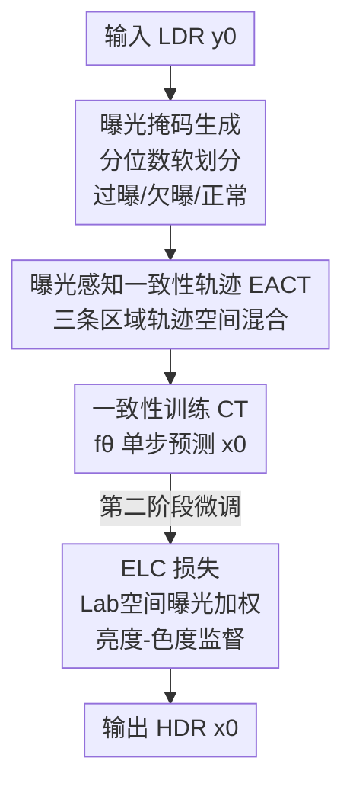

# ExpoCM: Exposure-Aware One-Step Generative Single-Image HDR Reconstruction

**会议**: CVPR 2026  
**论文**: [CVF Open Access](https://openaccess.thecvf.com/content/CVPR2026/html/Liu_ExpoCM_Exposure-Aware_One-Step_Generative_Single-Image_HDR_Reconstruction_CVPR_2026_paper.html)  
**代码**: https://github.com/AoyuLiu01/ExpoCM  
**领域**: 图像恢复 / HDR重建 / 一致性模型  
**关键词**: 单图HDR重建, 一致性模型, 曝光感知, PF-ODE, 一步生成

## 一句话总结
ExpoCM 把单图 HDR 重建建模成一个曝光感知的一致性模型轨迹：先用软曝光掩码把 LDR 分成过曝/欠曝/正常三类区域，对每类区域设计不同的 PF-ODE 一致性轨迹（过曝纯噪声幻想细节、欠曝注入低频先验、正常区直接用输入），再配一个在 CIE L\*a\*b\* 空间按曝光加权的亮度-色度损失，从而**无需蒸馏、单步推理**就拿到 SOTA 保真度，且比 DDPM 快 400 倍以上。

## 研究背景与动机
**领域现状**：单图 HDR 重建要从一张 LDR 恢复出宽动态范围辐照。传统方法靠手工先验（光照估计、相机响应建模），深度学习时代主流是用 CNN（HDRCNN、ExpandNet、SingleHDR、HDRUNet）直接学一个 LDR→HDR 的回归映射；近期则有人把扩散模型的强生成先验搬过来。

**现有痛点**：纯回归方法本质上压不住这个高度病态的问题——过曝区像素饱和、信息彻底丢失，回归只能给出模糊的"平均答案"，幻想不出合理细节；欠曝区噪声被放大，回归又容易把噪声一起放大或抹成糊状。扩散方法虽然生成能力强，但有两个硬伤：一是要几十到上千步迭代采样，512×512 一张图 DDPM 要 174 秒，根本没法实用；二是标准扩散过程是**空间无差别**的，对所有像素一视同仁地加噪去噪。

**核心矛盾**：HDR 重建的退化是**空间异质**的——过曝、欠曝、正常三类区域的信息丢失方式完全不同（一个是饱和丢信息要"无中生有"，一个是噪声淹没要"去噪保结构"，一个是本来就好要"原样保留"）。但现有的一致性/扩散轨迹用的是一条统一轨迹（$x_t = (1-\alpha)x_0 + \alpha y_0 + \sigma\epsilon$），把退化当成均匀的来处理，这与任务的异质本质相悖。

**本文目标**：在**单步**内同时做到（1）幻想过曝区的饱和细节、（2）抑制欠曝区噪声并恢复结构、（3）保留正常区可靠内容，且训练不依赖从预训练扩散模型蒸馏。

**切入角度**：作者注意到一致性模型（CM）能学一条从 PF-ODE 轨迹上任意点直达干净图 $x_0$ 的映射，天然支持一步生成。既然轨迹是可以设计的，那干脆**按曝光条件把单条统一轨迹拆成三条区域专属轨迹**，再空间混合，让生成过程对症下药。

**核心 idea**：用"曝光感知的一致性轨迹（EACT）"替代统一轨迹——按软曝光掩码为过曝/欠曝/正常区注入不同的扰动与引导，把空间异质的退化直接编进 PF-ODE 流里，配合曝光加权的 L\*a\*b\* 损失，实现免蒸馏的一步高保真 HDR 重建。

## 方法详解

### 整体框架
给定一张 LDR 图 $y_0$，ExpoCM 要一步重建出 HDR 图 $x_0$。整条 pipeline 分三块：**先**用曝光掩码生成模块把 $y_0$ 软划分成过曝/欠曝/正常三区；**再**基于这三个掩码构造曝光感知一致性轨迹（EACT），即对每类区域用一条专属的 PF-ODE 轨迹并按掩码空间混合，网络 $f_\theta$ 在这条混合轨迹上用一致性训练（CT）损失优化；**最后**在第二阶段用曝光加权的亮度-色度损失（ELC loss）微调，专门压制亮度偏差和色偏。推理时把噪声 $x_T$（可为纯噪声或 $y_0$+噪声）一次喂进 $f_\theta$ 即得结果，512×512 仅 0.33 秒。

骨干网络是一个三下采样、三上采样的 U-Net，输入为噪声状态 $x_t$ 与 LDR 图 $y_0$ 沿通道维拼接，时间步 $t$ 转成位置编码注入每个残差块。

### 关键设计

**1. 曝光掩码生成：用分位数软划分把"哪里坏、怎么坏"标出来**

要对症下药，第一步得知道每个像素属于哪类退化。直接用固定亮度阈值很脆——同一阈值在不同场景下意义完全不同。作者改用**分位数**策略：先算亮度 $Y = 0.2126 I_R + 0.7152 I_G + 0.0722 I_B$，取第 2 与第 98 亮度百分位 $(q_{lo}, q_{hi})$，用 margin $\tau=0.02$ 定义一个窄过渡带的核心区间：$l_{core} = q_{lo} + \tau(q_{hi}-q_{lo})$，$h_{core} = q_{hi} - \tau(q_{hi}-q_{lo})$。比 $l_{core}$ 暗的像素倾向欠曝、比 $h_{core}$ 亮的倾向饱和。把到核心区间的归一化距离 clip 到 $[0,1]$ 得到低/高曝信心图 $m_{low}, m_{high}$，最后组合出三张**软**权重图：

$$w_{over} = m_{high}(1 - m_{low}), \quad w_{under} = m_{low}(1 - m_{high}), \quad w_{good} = 1 - \max(w_{over}, w_{under}).$$

软划分（而非硬阈值二值掩码）保证了后面三条轨迹混合时边界平滑、不留接缝。这一步是整个曝光感知框架的"地图"，没有它后面的区域专属轨迹就无从落地。

**2. 曝光感知一致性轨迹 EACT：给三类区域各设一条 PF-ODE 轨迹再空间混合**

这是全文核心。统一轨迹 $x_t = (1-\alpha(t))x_0 + \alpha(t)y_0 + \sigma(t)\epsilon$ 的毛病是无论像素好坏都把 LDR 观测 $y_0$ 当可信引导塞进去。但过曝区的 $y_0$ 是饱和废值、欠曝区的 $y_0$ 是放大噪声，硬塞进去只会把错误信息引进生成过程。作者据此对三类区各设一条轨迹。**过曝区**结构信息在 $y_0$ 里彻底丢失、不可恢复，于是**完全不用 $y_0$**，让模型纯从噪声幻想合理细节：$x_t^o = (1-\alpha(t))x_0 + \sigma_o(t)\epsilon$，$\sigma_o(t)$ 控制生成强度。**欠曝区**信号没全丢、只是埋在噪声里，直接用 $y_0$ 会引入放大噪声和模糊，于是用低频算子（如高斯模糊）$\mathrm{Flow}(\cdot)$ 从 $y_0$ 抽粗结构先验注入，既给可靠引导又不带进高频噪声：$x_t^u = (1-\alpha(t))x_0 + \alpha(t)\lambda_u \mathrm{Flow}(y_0) + \sigma_u(t)\epsilon$，$\lambda_u$ 调节贡献。**正常区** $y_0$ 可信，沿用接近基线的轨迹：$x_t^g = (1-\alpha(t))x_0 + \alpha(t)y_0 + \sigma_g(t)\epsilon$。

完整轨迹按掩码逐像素空间混合：

$$x_t = w_{over} \odot x_t^o + w_{under} \odot x_t^u + w_{good} \odot x_t^g,$$

$\odot$ 为逐元素乘。和已有"曝光感知"生成方法的两阶段解耦 pipeline（慢且易出 artifact）不同，ExpoCM 是**统一一步**框架——在数学上混合 ODE 轨迹，同时把恢复（去噪保结构）和生成（幻想细节）一次解决。网络 $f_\theta$ 在这条混合轨迹上用一致性训练损失 $\mathcal{L}_{CT}(\theta,\theta^-)=\mathbb{E}\big[\|f_\theta(x_t,t,y_0)-f_{\theta^-}(x_{t'},t',y_0)\|_2^2\big]$ 优化（$f_{\theta^-}$ 是 EMA 目标网络，$t'<t$），从而学到从轨迹任意点直达 $x_0$ 的单步映射，**无需从预训练扩散模型蒸馏**。

**3. 曝光加权亮度-色度损失 ELC：在感知均匀空间按曝光分别管好亮度和颜色**

即便有了好的生成先验，重建图仍可能在过/欠曝处有亮度失衡或色偏。作者把监督搬到**感知均匀**的 CIE L\*a\*b\* 空间，因为它把亮度 L\* 和色度 (a\*, b\*) 显式解耦，能分别加权。把预测和 GT 都转到 Lab，算亮度残差 $\Delta L^* = \hat{L}^* - L^*$ 和色度残差 $\Delta C^* = \sqrt{(\hat{a}^*-a^*)^2 + (\hat{b}^*-b^*)^2}$。

关键洞察是**不同曝光区对亮度/色度的可靠性不同**：欠曝区色度被噪声污染不可靠、但亮度仍含结构线索，所以应**强压亮度、放松色度**；过曝区像素饱和成白、颜色丢失，所以应**强压色度（恢复颜色）、容忍亮度漂移**；正常区两者都可靠、均衡监督。据此设计连续可微的亮度/色度权重 $w_L, w_C$（式中 $\alpha$ 控制掩码过渡锐度，$s_Y$ 为暗区门控函数、$A_{spec}$ 衡量高光近白程度、$h_Y$ 为高光可见因子，$\kappa$ 系列为各区强度系数）：

$$w_L = \lambda_L^{(0)}\big(1 + \kappa_L^{lo} s_Y w_{under}^\alpha + \kappa_L^{hi} A_{spec} w_{over}^\alpha\big),$$
$$w_C = \lambda_C^{(0)}\big(\kappa_C^{hi} w_{over}^\alpha (1-A_{spec}) h_Y + \kappa_C^{lo} w_{under}^\alpha (1-s_Y)\big).$$

最终 $\mathcal{L}_{ELC} = \mathbb{E}[w_L \cdot \rho(\Delta L^*)] + \mathbb{E}[w_C \cdot \rho(\Delta C^*)]$，$\rho$ 用 Charbonnier 鲁棒惩罚 $\rho(x)=\sqrt{x^2+\epsilon^2}$。超参取 $\kappa_L^{lo}=3,\kappa_L^{hi}=1,\kappa_C^{hi}=3,\kappa_C^{lo}=0.5$ 等，作者称小幅改动 $\alpha$、$\kappa$ 比、$\tau$ 对性能影响 <0.1dB（⚠️ 公式中部分符号定义以原文为准）。

### 损失函数 / 训练策略
两阶段训练：**阶段一**用一致性训练损失 $\mathcal{L}_{CT}$ 学曝光感知轨迹、确保稳定的一步推理；**阶段二**用 ELC 损失微调，专门消除亮度失衡与色偏拿到最终高保真结果。实现细节：PyTorch + NVIDIA 3090，训练 500K 迭代、总 batch size 4、256×256 随机裁剪 patch，AdamW（$\beta_1=0.9,\beta_2=0.999$），学习率 $5\times10^{-5}$ 余弦退火到 $1\times10^{-7}$。

## 实验关键数据

### 主实验
三个基准 HDR-REAL、HDR-EYE、AIM2025 上对比 8 个方法（含 CNN 类、Transformer 类、扩散类 DDPM/DDIM）。下表摘录 µ-law tonemap 域的 PSNR-µ、HDR-VDP-2/-3、以及色差 ∆E2000（数值越小越好）：

| 数据集 | 方法 | PSNR-µ ↑ | SSIM-µ ↑ | HDR-VDP-2/-3 ↑ | LPIPS ↓ | ∆E2000 ↓ |
|--------|------|----------|----------|----------------|---------|----------|
| HDR-REAL | DDPM (1000步) | 25.45 | 0.8173 | 43.52 / 7.45 | 0.1921 | 10.40 |
| HDR-REAL | Reti-Diff | 27.64 | 0.8354 | 42.08 / 7.31 | 0.2645 | 4.83 |
| HDR-REAL | **ExpoCM (本文)** | **28.66** | **0.8684** | **44.27 / 7.72** | **0.1919** | **4.02** |
| HDR-EYE | DDIM | 16.98 | 0.7647 | 53.47 / 7.92 | 0.2007 | 13.19 |
| HDR-EYE | **ExpoCM (本文)** | **20.75** | **0.8017** | 44.09 / 7.94 | 0.2353 | **9.68** |
| AIM2025 | HDRUNet | 25.88 | 0.8709 | 57.83 / 7.06 | 0.2218 | 4.46 |
| AIM2025 | DDPM (1000步) | 23.03 | 0.8320 | **75.57 / 8.78** | **0.1286** | 7.91 |
| AIM2025 | **ExpoCM (本文)** | **29.02** | **0.8922** | 74.01 / 8.68 | 0.1511 | **3.90** |

ExpoCM 在三个数据集的 PSNR-µ、SSIM-µ 与色差 ∆E2000 上几乎全面领先，且 ∆E2000 最低（颜色最准），印证 ELC 损失对色偏的压制有效。

**效率**：512×512 单图推理 0.33s，对比 DDPM（174.10s）快 **>400×**、对比 DDIM 50 步（7.85s）快 **>20×**。

### 消融实验
**EACT 轨迹（曝光分区数量）**，HDR-REAL / AIM2025 上：

| 配置 | PSNR-µ (REAL) | SSIM-µ (REAL) | PSNR-µ (AIM) | 说明 |
|------|---------------|---------------|--------------|------|
| Baseline（统一轨迹） | 21.09 | 0.6917 | 27.90 | 空间无差别，最差 |
| Two-Mask（正常 vs 病态二分） | 25.75 | 0.8076 | 28.48 | 仅分可靠/不可靠，+4.66 PSNR |
| Three-Mask（过/欠/正常，完整） | **25.84** | **0.8282** | **28.89** | 区分过曝与欠曝是关键 |

**ELC 损失（轨迹 × 加权策略解耦验证）**，看 ∆E2000：

| 配置 | PSNR-µ (REAL) | ∆E2000 (REAL) | 说明 |
|------|---------------|---------------|------|
| Baseline（统一轨迹） | 21.09 | 12.23 | 无 EACT 无 ELC |
| w/o EACT（统一轨迹 + ELC） | 21.26 | 12.04 | 仅加 ELC 到弱骨干也涨 |
| w/o weighting（EACT + 均匀 Lab 损失） | 28.56 | 4.06 | 有 EACT 但损失不按曝光加权 |
| Default（EACT + 完整 ELC） | **28.66** | **4.02** | 完整模型，色差最低 |

### 关键发现
- **区分过曝与欠曝是性能跃升的关键**：从 Baseline 统一轨迹到 Two-Mask（只分可靠/不可靠）就涨 +4.66 PSNR，再细分到 Three-Mask 进一步提升 SSIM 与 LPIPS——说明病态区不能笼统对待，过曝（要幻想）和欠曝（要去噪）必须分开处理。
- **EACT 与 ELC 各司其职、互补**：EACT 负责保真度的大头（消融里去掉它 PSNR 从 28.66 掉到 21 出头）；ELC 的曝光加权则专攻颜色——`w/o weighting` 用均匀 Lab 损失时 ∆E2000 已经不错（4.06），但加权后进一步降到 4.02，且把 ELC 单加到弱骨干上（w/o EACT）也能小幅改善色差，证明其通用性。
- **超参鲁棒**：作者称小幅扰动 $\alpha$、$\kappa$ 比例、$\tau$ 阈值带来的性能波动 <0.1dB。

## 亮点与洞察
- **把"空间异质退化"直接编进生成轨迹**：以往做法要么统一轨迹一刀切、要么两阶段解耦（先恢复再生成）慢且易出 artifact。ExpoCM 的巧处是在 PF-ODE 层面对三类区各设轨迹再**数学混合**，一步内同时完成恢复与生成，这个"轨迹即先验"的视角很可复用。
- **免蒸馏的一致性训练**：常见 CM 要从预训练扩散模型蒸馏（贵），本文从头训练曝光感知一致性轨迹绕开了蒸馏，对低层视觉任务上 CM 的落地是个实用范式。
- **损失搬到 L\*a\*b\* 并按曝光解耦亮度/色度**："欠曝信亮度不信色度、过曝信亮度漂移但要救颜色"这个先验非常符合成像物理，且实现成连续可微权重——这个按区域可靠性给监督加权的思路可迁移到去噪、去雾、低光增强等其他病态恢复任务。

## 局限与展望
- **依赖软曝光掩码的质量**：掩码用分位数 + 亮度统计算出，极端场景（如大面积单色、强逆光）下分位数估计可能偏，进而影响三条轨迹的混合权重；作者未深入讨论掩码失败时的退化行为。
- **HDR-EYE 上 HDR-VDP 未领先**：在小数据集 HDR-EYE 上 ExpoCM 的 HDR-VDP-2（44.09）低于 DDPM/DDIM（53 上下），说明在某些感知指标 / 小样本场景下一步生成相比多步扩散仍有差距，PSNR 领先不等于全指标领先。⚠️ 不同数据集规模差异大（HDR-EYE 仅 46 对），结论不宜直接外推。
- **超参较多**：ELC 损失含 $\kappa_L^{lo/hi}, \kappa_C^{lo/hi}, \tau_s, \tau_h, \delta$ 等一串系数，虽称鲁棒但调参空间不小，跨数据集是否需重调未充分验证。
- **改进方向**：掩码生成可考虑可学习化（替代固定分位数策略）；轨迹混合权重也可做成随时间步自适应而非全程固定。

## 相关工作与启发
- **vs 回归式 CNN（HDRCNN / ExpandNet / SingleHDR / HDRUNet）**：它们学确定性 LDR→HDR 映射，对病态的过曝区只能给模糊均值、无法幻想细节。ExpoCM 用生成式一致性轨迹"无中生有"补饱和细节，过曝区保真度明显更高。
- **vs 标准扩散（DDPM / DDIM）**：DDPM 生成质量高但要上千步、174s/张且空间无差别处理；DDIM 减步后质量骤降。ExpoCM 用一致性模型一步生成（0.33s，快 400×+），并把曝光异质性编进轨迹，在保真度（PSNR/∆E2000）上反超多步扩散。
- **vs 两阶段曝光感知生成方法**：已有方法先恢复再生成、解耦两阶段，慢且接缝处易出 artifact。ExpoCM 在单条混合 ODE 轨迹里同时解恢复与生成，统一且更快。

## 评分
- 新颖性: ⭐⭐⭐⭐⭐ 把曝光异质性编进 PF-ODE 一致性轨迹 + 免蒸馏一步生成，视角新颖且自洽
- 实验充分度: ⭐⭐⭐⭐ 三基准、多指标、两组消融解耦验证 EACT 与 ELC，但 HDR-EYE 部分感知指标未领先
- 写作质量: ⭐⭐⭐⭐ 动机—方法—公式链条清晰，ELC 权重符号略密
- 价值: ⭐⭐⭐⭐⭐ 单步、免蒸馏、快 400×且 SOTA 保真度，对实用 HDR 重建价值高

<!-- RELATED:START -->

## 相关论文

- [\[CVPR 2026\] GDPO-SR: Group Direct Preference Optimization for One-Step Generative Image Super-Resolution](gdpo-sr_group_direct_preference_optimization_for_one-step_generative_image_super.md)
- [\[CVPR 2026\] Time-Aware One Step Diffusion Network for Real-World Image Super-Resolution](time-aware_one_step_diffusion_network_for_real-world_image_super-resolution.md)
- [\[CVPR 2026\] F²HDR: Two-Stage HDR Video Reconstruction via Flow Adapter and Physical Motion Modeling](f2hdr_two-stage_hdr_video_reconstruction_via_flow_adapter_and_physical_motion_mo.md)
- [\[ECCV 2024\] Intrinsic Single-Image HDR Reconstruction](../../ECCV2024/image_restoration/intrinsic_single-image_hdr_reconstruction.md)
- [\[CVPR 2026\] LRHDR: Learning Representation-enhanced HDR Video Reconstruction](lrhdr_learning_representation-enhanced_hdr_video_reconstruction.md)

<!-- RELATED:END -->
