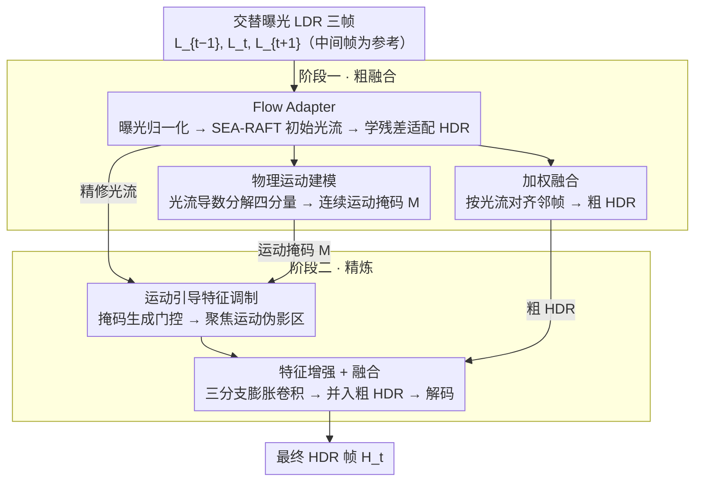

# F²HDR: Two-Stage HDR Video Reconstruction via Flow Adapter and Physical Motion Modeling

**会议**: CVPR 2026  
**arXiv**: [2603.14920](https://arxiv.org/abs/2603.14920)  
**代码**: [https://github.com/wei1895/F2HDR](https://github.com/wei1895/F2HDR)  
**领域**: 模型压缩  
**关键词**: HDR视频重建, 光流适配器, 物理运动建模, 交替曝光, 两阶段重建

## 一句话总结
提出 F²HDR，一个两阶段 HDR 视频重建框架，通过 Flow Adapter 将通用预训练光流适配到交替曝光场景以实现鲁棒对齐，并利用物理运动建模从光流中提取连续运动掩码来引导第二阶段的伪影消除，在真实 HDR 视频基准上达到 SOTA。

## 研究背景与动机
从交替曝光的 LDR 帧序列重建 HDR 视频是一种低成本的 HDR 获取方案。长曝光帧捕获暗区细节但亮区饱和，短曝光帧保留亮区信息但暗区噪声大，互补融合可重建高动态范围内容。

**核心矛盾**：动态场景下跨曝光帧对齐极其困难——不同曝光的帧亮度差异大、运动物体和遮挡区域的光流估计不可靠，导致融合结果出现鬼影（ghosting）和细节丢失。

**现有方法的两个核心问题**：

**第一阶段的对齐精度不足**：
   - 预训练通用光流模型在不同曝光帧间表现不佳（过曝/欠曝区域匹配困难）
   - 为 HDR 重训的任务专用光流模型能处理曝光变化，但生成的光流边缘模糊，因为训练时用的是 HDR 重建损失而非光流预测损失
   - 根本原因：没有适合 HDR 重建的光流数据集

**第二阶段的伪影消除缺乏引导**：
   - 现有方法简单融合同模态输入，缺乏对"哪些区域有运动伪影"的显式建模
   - Shu et al. 引入曝光掩码但只反映亮区，不反映真正困难的运动区域

**核心 idea**：
- 第一阶段：利用预训练光流的清晰边缘 + 学习残差光流适配 HDR 场景 → **两全其美**
- 第二阶段：从光流物理分解提取运动掩码（平移、散度、旋度、剪切）→ 精确指示伪影区域 → 引导融合

## 方法详解

### 整体框架
F²HDR 把"从交替曝光 LDR 序列重建 HDR 视频"拆成两个串起来的阶段。输入是三帧交替曝光的 LDR 序列 $\{L_{t-1}, L_t, L_{t+1}\}$，以中间帧 $L_t$ 为参考，目标是输出对应的 HDR 帧 $H_t$。

第一阶段（粗融合）先做对齐：把曝光归一化后的帧送进预训练光流网络估出初始光流，再用 Flow Adapter 补一层残差让它适配 HDR 场景，对齐邻帧后加权融合得到一张粗 HDR，并顺手从光流里算出物理运动掩码。第二阶段（精炼）拿这张运动掩码当"伪影地图"：先分别提取 LDR 域和 HDR 域特征，用掩码门控调制聚焦到运动伪影区域，再做特征增强、与粗 HDR 融合后解码出最终结果。两阶段端到端联合训练，第二阶段的梯度能一路回传到第一阶段的光流，让对齐和去伪影互相促进。

### 关键设计

**1. Flow Adapter：在预训练光流上学残差，而不是从头重训**

跨曝光对齐是整个任务最难的一步，而现有两条路线各有死穴：直接拿通用预训练光流，它在过曝/欠曝区域匹配不上；为 HDR 重训一个任务专用光流，因为监督信号是 HDR 重建损失而非光流本身，估出来的光流边缘糊成一片。本文的做法是两头都要——保留预训练光流清晰的运动边界，只学一个残差把它"掰"到 HDR 场景。

具体上先做曝光归一化，把参考帧的亮度对齐到相邻帧，让预训练光流面对的是曝光一致的帧对：$g_{t\to t-1}(L_t) = \text{clip}(((L_t^\gamma / e_t) e_{t-1})^{1/\gamma})$。归一化后的帧对喂进 SEA-RAFT 得到初始光流 $f_{t\to t\pm1}$。Flow Adapter 本身是一个带不同膨胀率的浅层残差 CNN，输入是原始帧加上缩放后的光流拼成的张量 $\mathbf{x}_t = [L_{t-1}, L_t, L_{t+1}, f/\lambda, f/\lambda]$，输出残差 $[\Delta f_{t\to t-1}, \Delta f_{t\to t+1}] = \mathcal{A}(\mathbf{x}_t)$，最终光流为 $\tilde{f} = f + \lambda \Delta f$（$\lambda=20$ 是固定归一化因子）。关键在于 adapter 与下游 HDR 重建网络联合训练，于是它学到的残差专门补预训练光流在曝光变化和遮挡区的短板，同时因为只是"微调"而非重估，清晰的运动边界被原样保留下来。

**2. 物理运动建模：把光流的空间导数分解成四种物理运动，得到连续可微的伪影掩码**

第二阶段要知道"哪里有运动伪影"才能针对性去鬼影，但现有的二值掩码（遮挡掩码、SAM 掩码）只能给出硬边界，捕捉不到运动的连续物理特征。本文转而从光流 $f=[u,v]$ 的一阶空间导数里读运动结构，分解成四个物理可解释的分量：平移 $\|f\|_2 = \sqrt{u^2 + v^2}$（全局位移幅度）、散度 $\nabla \cdot f = u_x + v_y$（缩放运动，如物体跑近或远离）、旋度 $\nabla \times f = v_x - u_y$（旋转运动）、剪切 $S = \frac{1}{2}(u_y + v_x)$（局部非刚性形变）。

四个分量按自适应权重融合成一张统一运动能量图，权重 $w_t, w_d, w_c, w_s$ 由卷积块直接从光流学出来：

$$E_m = \frac{w_t \odot \|f\|_2 + w_d \odot |\nabla \cdot f| + w_c \odot |\nabla \times f| + w_s \odot |S|}{w_t + w_d + w_c + w_s + \epsilon}$$

为了让运动边缘更突出，再做一次多尺度对比增强 $E_s = E_m \odot (1 + 2 S_{multi})$，在尺度 $\{1,2,4\}$ 上算中心-周围的运动对比；最后用自适应 Otsu 阈值配 sigmoid 软化得到掩码 $M = \frac{1}{2}[1 + \tanh(8(E_s - \tau))]$。这样得到的 $M \in [0,1]$ 是连续可微的，既精确指示了伪影高发区，又能直接参与端到端训练——这正是二值掩码做不到的。

**3. 运动引导特征调制：用运动掩码当门控，让网络把算力压到伪影区域**

有了运动掩码，第二阶段就用它来调制对齐后的特征，而不是像旧方法那样把同模态输入无差别地一融了事。流程是：对每帧的 LDR 域 $L_t$ 和 HDR 域 $I_t$ 各提特征，再用 1×1 卷积融合成 $F_{LI_t} = \text{Conv}([F_{L_t}, F_{I_t}])$；用光流把邻帧特征对齐到 $\tilde{F}_{LI_{t\pm1}}$；把归一化光流幅度和运动掩码一起编码成门控信号 $G_{t\pm1} = \sigma(\text{Conv}([\|\tilde{f}\|_2/\tilde{f}_{max}, M_{t\pm1}, \mathbf{1}]))$；最后门控调制 $\bar{F}_{LI_{t\pm1}} = G_{t\pm1} \odot \tilde{F}_{LI_{t\pm1}}$。运动明显的区域门控值高被强调，静态区域被抑制。调制后的特征经三分支膨胀卷积增强，与粗 HDR 特征融合后解码出最终 HDR。

### 损失函数 / 训练策略
- 使用 $\mu$-law 色调映射：$\mathcal{T}(H) = \frac{\log(1+\mu H)}{\log(1+\mu)}$，$\mu=5000$
- $\ell_1$ 重建损失：$\mathcal{L} = \|\mathcal{T}(H_{final}) - \mathcal{T}(H_{gt})\|_1$
- 训练集：Vimeo-90K 模拟交替曝光
- Adam 优化器，初始 LR $1 \times 10^{-4}$，每 10 epoch 减半，50 epoch，batch 16
- RTX 3090 单卡训练

## 实验关键数据

### 主实验 — DeepHDRVideo 数据集

| 方法 | PSNR_T↑ | SSIM_T↑ | HDR-VDP-2↑ |
|------|---------|---------|------------|
| Kalantari19 | 39.91 | 0.9329 | — |
| Chen21 | 43.32 | 0.9551 | 78.37 |
| HDRFlow | 43.03 | 0.9518 | 77.58 |
| NECHDR | 43.44 | 0.9558 | 77.28 |
| HDR-V-Diff | 42.07 | 0.9604 | — |
| **F²HDR** | **43.87** | **0.9573** | **78.88** |

### 主实验 — Real-HDRV 数据集

| 方法 | PSNR_T↑ | SSIM_T↑ | HDR-VDP-2↑ | PSNR_L↑ |
|------|---------|---------|------------|---------|
| Chen21 | 40.79 | 0.9510 | 76.50 | 50.30 |
| HDRFlow | 40.34 | 0.9481 | 75.82 | 49.72 |
| NECHDR | 40.88 | 0.9518 | 76.77 | 50.41 |
| **F²HDR** | **41.01** | **0.9538** | **76.93** | **50.51** |

### 消融实验

| 配置 | DeepHDRVideo PSNR_T | Real-HDRV PSNR_T |
|------|---------------------|------------------|
| Stage I w/o Flow Adapter | 43.06 | 40.29 |
| Stage I w/o FA + Stage II | 43.21 | 40.45 |
| Stage I (with FA) | 43.39 | 40.61 |
| Stage I w/o Mask + Stage II | 43.68 | 40.87 |
| Stage I w/ CNN Mask + Stage II | 43.76 | 40.93 |
| **Full (Stage I + Stage II)** | **43.87** | **41.01** |

### 光流质量评估（Real-HDRV）

| 方法 | EPE↓ | LDR Warping PSNR↑ | LDR Warping SSIM↑ |
|------|------|-------------------|-------------------|
| HDRFlow | 3.53 | 29.93 | 0.8763 |
| NECHDR | 3.30 | 30.31 | 0.8901 |
| Ours w/o FA | 1.81 | 30.39 | 0.8897 |
| **Ours** | **2.08** | **30.84** | **0.8922** |

### 关键发现
- Flow Adapter 是最关键组件：移除后 DeepHDRVideo PSNR 下降 0.81 dB（43.87→43.06）
- 物理运动掩码贡献 0.19 dB，优于 CNN 学习的掩码（0.11 dB），验证物理先验的价值
- 有趣发现：加 Flow Adapter 后 EPE 变大（2.08 > 1.81）但 warping 质量更好——因为 adapter 为遮挡区域生成了非零光流偏移，而伪标签在遮挡区为零
- 两阶段方案比单阶段大幅提升
- 推理速度（0.29s@1080p）介于最快的 HDRFlow（0.076s）和最慢的 LAN-HDR（0.905s）之间

## 亮点与洞察
- **Flow Adapter 设计精妙**：不重训光流而是学残差，兼顾预训练模型的清晰边缘和任务适配能力
- **物理运动分解**有理论美感：将光流导数分解为平移/散度/旋度/剪切四个物理可解释分量，连续可微的掩码优于二值掩码
- 第二阶段的优化可以反向传播到第一阶段的光流，形成相互促进
- 曝光归一化技巧（对齐到相邻帧曝光后喂入预训练光流）简单有效

## 局限与展望
- 方法基于三帧输入（$t-1, t, t+1$），更长的时序窗口可能进一步提升稳定性
- Flow Adapter 是浅层 CNN，可能在极端大位移时容量不足
- 训练数据来自 Vimeo-90K 模拟曝光，domain gap 可能影响真实场景泛化
- 物理运动分解基于一阶导数，更高阶的运动特征（加速度等）未考虑
- 推理速度还有优化空间（相比 HDRFlow 慢 4 倍）
- 缺少视频级时序一致性指标（如 tOF、tLP）的评估

## 相关工作与启发
- HDRFlow 的轻量任务专用光流 vs 本文 adapter 方案：两种路线各有优劣
- 物理运动分解可推广到其他需要运动感知的视频处理任务（去模糊、视频稳定等）
- Flow Adapter 思路类似于 NLP 中的 adapter tuning，将预训练模型适配到下游任务的范式具有通用性

## 评分
- 新颖性: ⭐⭐⭐⭐ Flow Adapter（残差光流适配预训练模型）和物理运动建模都有明确的技术贡献
- 实验充分度: ⭐⭐⭐⭐ 两个真实数据集 + 光流质量评估 + 完整消融 + 推理速度对比
- 写作质量: ⭐⭐⭐⭐ 动机清晰、两个核心问题-两个解决方案的对应关系明确
- 价值: ⭐⭐⭐⭐ HDR 视频重建的实用框架，Flow Adapter 思路有推广价值

<!-- RELATED:START -->

## 相关论文

- [\[CVPR 2026\] LRHDR: Learning Representation-enhanced HDR Video Reconstruction](lrhdr_learning_representation-enhanced_hdr_video_reconstruction.md)
- [\[CVPR 2026\] HFR and HDR Video from Multi-Attenuated Spikes Using a Rapidly Rotating SpokeND Filter](hfr_and_hdr_video_from_multi-attenuated_spikes_using_a_rapidly_rotating_spokend_.md)
- [\[CVPR 2026\] ExpoCM: Exposure-Aware One-Step Generative Single-Image HDR Reconstruction](expocm_exposure-aware_one-step_generative_single-image_hdr_reconstruction.md)
- [\[ECCV 2024\] Intrinsic Single-Image HDR Reconstruction](../../ECCV2024/image_restoration/intrinsic_single-image_hdr_reconstruction.md)
- [\[CVPR 2026\] AE2VID: Event-based Video Reconstruction via Aperture Modulation](ae2vid_event-based_video_reconstruction_via_aperture_modulation.md)

<!-- RELATED:END -->
