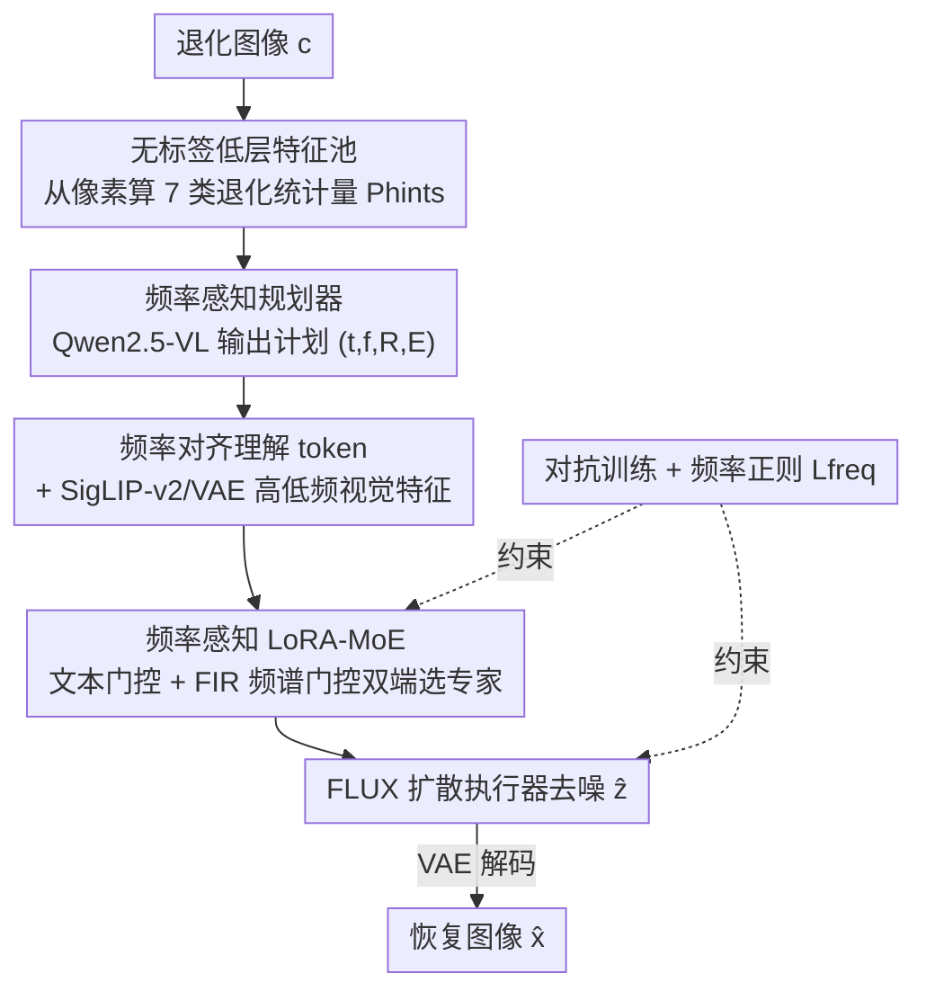

# FAPE-IR: Frequency-Aware Planning and Execution Framework for All-in-One Image Restoration

**会议**: CVPR 2026  
**论文**: [CVF Open Access](https://openaccess.thecvf.com/content/CVPR2026/html/Liu_FAPE-IR_Frequency-Aware_Planning_and_Execution_Framework_for_All-in-One_Image_Restoration_CVPR_2026_paper.html)  
**代码**: https://github.com/Programmergg/FAPE-IR  
**领域**: 图像恢复 / 多合一图像恢复  
**关键词**: All-in-One 图像恢复, 频率感知, MLLM 规划器, LoRA-MoE, 扩散模型  

## 一句话总结
FAPE-IR 用一个冻结的多模态大模型（Qwen2.5-VL）当"规划器"读懂退化图像、生成频率感知的恢复计划，再用扩散执行器里的 LoRA-MoE 按计划动态调度高/低频专家来修图，配合对抗训练和频率正则，在七类恢复任务上拿到 SOTA 并对未见的复合退化有强零样本泛化。

## 研究背景与动机

**领域现状**：All-in-One Image Restoration（AIO-IR）想用一个统一模型处理去雨、去雪、去雾、去模糊、低光增强、去噪、超分等多种退化。当前主流有两条路线：一是**多分支映射**，给共享 backbone 注入任务级先验（prompt、embedding、专用编码器），为每种退化学一条恢复路径；二是**聚类/路由**，在隐空间里把不同任务的特征聚类或路由到不同专家。

**现有痛点**：多分支路线在共享参数下，不同退化的梯度会互相冲突（gradient conflict），很难同时到达各任务最优；而且训练推理都依赖先验标签或文本输入，标注和 prompt 工程成本高。聚类/路由路线因为任务在隐空间里被强行隔离（gradient isolation），各任务几乎独立学习，发现不了退化之间可以共享的结构，对复合退化鲁棒性差。更关键的是，两条路线都缺语义理解、依赖不透明的退化流水线，没法做内容自适应，也不可解释。

**核心矛盾**：任务之间到底该**共享**还是**隔离**知识，现有方法用固定的任务级设计一刀切——要么全共享导致冲突，要么全隔离导致割裂，没有按样本（per-image）自适应判断的能力。

**切入角度**：作者的关键观察是——退化天然有频率属性。去雨、去雪、去模糊、去噪主要修**高频**（纹理、边缘、细结构），去雾、低光增强主要修**低频**（光照、色彩、整体亮度）。如果按频率把任务分组，就能让"同频率任务共享、异频率任务隔离"，从频率视角同时化解梯度冲突和梯度隔离这对矛盾（论文 Figure 1(c)）。

**核心 idea**：把扩散当"执行引擎"，前面接一个 MLLM"规划器"先解析退化语义、输出频率感知的恢复计划，再用频率感知的 LoRA-MoE 按计划动态选高/低频专家——用**理解→生成**的统一范式，把语义规划和频域恢复耦合起来。

## 方法详解

### 整体框架
FAPE-IR 采用"规划 + 执行"（Planning and Execution）范式，把恢复拆成两个阶段。给定退化图像 $c$：**规划阶段**用冻结的 Qwen2.5-VL 当频率感知规划器，先从像素直接算一组无标签低层统计量当视觉提示，配合通用恢复指令和专家规则，让 MLLM 输出一个可解析的恢复计划（哪类退化、主要修高频还是低频、恢复流程、判断理由），并编码成"理解 token"。**执行阶段**用基于 FLUX transformer 的扩散执行器，把 VAE latent 去噪还原成干净图，途中由 Frequency-Aware LoRA-MoE 模块根据规划器的文本 token + 中间特征的频谱能量，**双端门控**地在高/低频专家间 top-1 选择。整套用对抗训练 + 频率正则化损失优化。

### 关键设计

**1. 频率感知规划器：让冻结 MLLM 把退化"翻译"成频率显式的恢复计划**

针对"现有方法缺语义理解、不可解释"的痛点，FAPE-IR 不再靠任务标签，而是让 Qwen2.5-VL 自己看图、按频率视角输出计划。先构造一个**无标签低层特征池**：直接从像素一次过算出向量 $P_{hints}$，每个分量对应一种代表性退化的统计量——雨用有向条纹强度、雪用小亮斑密度、噪声用平坦区亮度/色度方差、模糊用 Laplacian 和梯度响应、雾用暗通道和饱和度统计、低光用全局亮度、超分用输入空间尺寸 $H\times W$。这些轻量统计量不需要任何监督。规划器再接收三类输入：通用恢复指令 $r$、编码"哪种退化影响哪个频带"先验知识的专家规则 $P_{expert}$、以及视觉提示 $P_{hints}$，输出一个可解析的文本，被解析成四元组 $FP=(\hat{t},\hat{f},R,E)$：$\hat{t}$ 是选中的任务、$\hat{f}$ 指明主修高频还是低频、$R$ 是自然语言描述的恢复流程、$E$ 是判断理由。这个人类可读的计划充当了下游高/低频专家的**路由信号**，即使复合退化下决策过程也透明可解释。计划随后被编码成频率对齐的理解 token $h$，并用 Qwen 的视觉占位符把 SigLIP-v2 的 $E_{sig}(c)$ 和 VAE 的 $E_{vae}(c)$ 高低频视觉特征注进去（替换执行器原来的 T5 编码），得到条件 token $h_{cond}=\text{insert}(h,E_{sig}(c),E_{vae}(c))$，同时单独抽出文本 token $h_{text}$ 留给后面的 MoE 门控用。

**2. 频率感知 LoRA-MoE：双端门控在高/低频专家间做可解释路由**

针对"任务该共享还是隔离"的核心矛盾，执行器只设两个 LoRA 专家——分别专精高频和低频——用参数高效的方式让同频任务共享专家、异频任务走不同专家。关键是**双端门控**：一端是**频率感知文本路由**，用规划器给的 $h_{text}$ 提出专家选择。由于 $h_{text}\in\mathbb{R}^{B\times K\times D}$ 而门控要在 $\mathbb{R}^{B\times L\times D}$ 上逐 token 操作，先把 $h_{text}$ 沿 token 轴右补零到长度 $L$，再过一个逐 token 全连接层加 softmax 得到文本门控权重 $w_{text}=\text{Softmax}(W_t\cdot\text{Padding}(h_{text}))$。另一端是 **FIR 频谱路由**，补偿高层语义 token 在门控上的局限：用深度可分 FIR 低通滤波器（固定归一化 1D 高斯核 $g$，$\sum_k g_k=1$）沿 token 轴把执行器中间生成 token $h_{gen}$ 分成低频 $h_{low}=L_g(h_{gen})$ 和高频 $h_{high}=h_{gen}-h_{low}$，再按相对能量算门控：$e_{low}=\|h_{low}\|_2^2$、$e_{high}=\|h_{high}\|_2^2$，$p_{low}=\frac{e_{low}}{e_{low}+e_{high}}$、$p_{high}=1-p_{low}$，温度缩放 softmax 得视觉门控 $w_{visual}$。两路用可学习非负标量 $\lambda_s$ 融合 $\tilde{\alpha}=\lambda_s w_{text}+(1-\lambda_s)w_{visual}$，再 top-1 得到 one-hot 频带选择 $\alpha=\text{Top1}(\tilde{\alpha})$。最终 FLUX 投影矩阵更新为

$$W' = W + \sum_{i=1}^{N}\alpha_i\,A_iB_i,$$

其中 $(A_i,B_i)$ 是第 $i$ 个频率专家的秩-$r_i$ LoRA 适配器，backbone $W$ 冻结。这样既用语义又用频谱联合决定专家分配，对优化中的"频带漂移"更鲁棒。

**3. 对抗训练 + 多级判别器：在扩散预训练权重上换损失换来更高保真**

针对"统一模型常用 flow-matching 微调易产生伪影"的问题，FAPE-IR 把 flow-matching 目标换成对抗训练（附录 Theorem 6 论证：相比自回归和 flow-matching，对抗训练在该设定下伪影更少 ⚠️ 理论细节以原文为准）。判别器用冻结的 SigLIP-v2 $F_{sig}$ 抽多层 token map 重排成空间特征 $\{f^{(l)}\}$ 和最后一层池化表征 $p$，接一个**多级判别器头** $H_\psi$：每层空间图过带抗混叠 BlurPool 下采样的浅层谱归一化卷积得 $s^{(l)}$，池化 token 得 $s^{pool}$，各空间图平均成标量 $\bar{s}^{(l)}$，再均匀聚合 $D(x)=\frac{1}{L+1}\big(\sum_{l=1}^{L}\bar{s}^{(l)}+s^{pool}\big)$，让局部结构（多尺度空间路径）和全局语义（池化路径）一致。判别器损失为标准式

$$\mathcal{L}_{adv}^{\mathcal{D}}=-\mathbb{E}_x[\log D(x)]-\mathbb{E}_{\hat{x}}[\log(1-D(\hat{x}))].$$

生成器用复合损失 $\mathcal{L}_{adv}=\underbrace{\alpha\|\hat{x}-x\|_2^2}_{\text{MSE}}+\underbrace{\beta\|\phi(\hat{x})-\phi(x)\|_2^2}_{\text{LPIPS}}\underbrace{-\lambda\,\mathbb{E}[D(\hat{x})]}_{\text{adv}}$，兼顾像素保真、感知相似和对抗真实感；为减少过度生成/失真，输入 FLUX 时不额外拼噪声通道。

**4. 频率正则化损失：逼每个专家只在自己的频带干活**

上面的 $\mathcal{L}_{adv}$ 只管整体保真，不管频谱内容怎么分配给专家。为了让两个 LoRA-MoE 专家真正专精互补频带，作者加一个基于能量的频率正则：令 $L_g$ 是深度可分 FIR 低通、$H_g\triangleq I-L_g$ 为互补高通，对低/高频专家的适配器输出 $y_{low}$、$y_{high}$，惩罚"出格"能量

$$\mathcal{L}_{freq}=\text{mean}\big(\|H_g(y_{low})\|_2^2+\|L_g(y_{high})\|_2^2\big),$$

即低频专家不该产生高频内容、高频专家不该产生低频内容。$g$ 是固定高斯核（不可训练 buffer），损失跨层求和。整体目标为 $\mathcal{L}_{Total}=\mathcal{L}_{adv}+\gamma\,\mathcal{L}_{freq}$，只多一个标量项就显式逼出低/高频专精，把可解释性和保真度调和到一起。

### 训练策略
主模型用 Prodigy 优化器、判别器头用 AdamW（基础学习率 $1\times10^{-4}$ 余弦退火）。所有数据上训 200K 步、batch size 1、输入 $512\times512$，跑在 8× H200 GPU。one-step 设定下 $\alpha=50.0$、$\beta=5.0$、$\lambda=0.5$、$\gamma=1\times10^{-3}$、扩散时间步 $t=300$。

## 实验关键数据

### 主实验
七类恢复任务用**同一个**训好的模型评测（而非每任务单训单测）。下表节选六类 AIO-IR 任务序列的 PSNR/SSIM（完整含 LPIPS/FID/DISTS 见原文 Table 1）。

| 任务 | 指标 | FAPE-IR | 最强基线 | 提升 |
|------|------|---------|----------|------|
| 去雨 Deraining | PSNR | **28.30** | 21.94 (PromptIR) | +6.36 dB |
| 去雨 Deraining | FID↓ | **21.55** | 100.07 (AdaIR) | ↓约 4.6× |
| 去雪 Desnowing | PSNR | **30.29** | 24.19 (AdaIR) | +6.10 dB |
| 去雾 Dehazing | PSNR | **33.85** | 21.94 (PromptIR) | +11.91 dB |
| 去模糊 Deblurring | PSNR | **30.91** | 30.82 (DFPIR) | +0.09 dB |
| 低光 Low-light | SSIM | **0.90** | 0.90 (DFPIR) | 持平/最佳 |
| 去噪 Denoising | SSIM | **0.87** | 0.84 (PromptIR) | +0.03 |

超分单独对比扩散类 SR 方法（原文 Table 2）：

| 方法 | PSNR↑ | SSIM↑ | LPIPS↓ | FID↓ | DISTS↓ |
|------|-------|-------|--------|------|--------|
| OSEDiff | 26.49 | 0.76 | 0.28 | 117.55 | 0.21 |
| PASD | 26.87 | 0.75 | 0.29 | 120.46 | 0.21 |
| **FAPE-IR** | **28.53** | **0.85** | **0.19** | **85.82** | **0.15** |

天气类任务（去雨/雪/雾）PSNR 普遍涨 6–8 dB、感知距离降数倍——这些退化语义布局丰富、频率模式复杂，正好是频率感知规划器引导专家发力的场景。去噪和低光的 PSNR 略低于最佳，但 SSIM 最高、LPIPS/FID/DISTS 一致更低，说明频率规划 + 对抗训练偏向感知忠实的细节。复杂度对比（Table 3）：FAPE-IR 推理 1.57s、显存 38.92G，参数虽多但远快于统一类对手 PURE（201.67s）。

### 消融实验
URHI（低频/雾主导）上固定超参只训 10K 步的最小消融（原文 Table 4）：

| 配置 | PSNR↑ | SSIM↑ | 说明 |
|------|-------|-------|------|
| 无 Qwen / Freq-U / Freq-G | 25.03 | 0.92 | 纯基线 |
| + Qwen2.5-VL（无路由控制） | 27.95 | 0.94 | 语义规划有益但不足以分配算力 |
| + Freq-U（文本路由） | 28.92 | 0.94 | 计划耦合 MoE 门控，能自主选频带 |
| + Freq-G（FIR 频谱路由） | **29.71** | **0.95** | 注入 token 频谱先验，最佳，比无规划基线 +4.68 dB |
| LoRA 容量 4/16（极不对称） | 24.75 | 0.91 | 单靠重塑 LoRA 结构无法解耦频带 |
| LoRA 容量 8/16（轻度不对称，对齐主导频带） | 29.60 | 0.95 | 近最优 |

### 关键发现
- **频率先验 + 语义规划的耦合才是关键**：单加 Qwen 只到 27.95 dB，单靠重塑 LoRA 容量（如 4/16）反而掉到 24.75 dB；只有把频谱先验（Freq-G）和语义规划（Freq-U）耦合起来才稳定到 29.71 dB。
- **规划器输出可分且因果有效**：冻结规划器抽决策 token 做 t-SNE，呈现干净的、按频谱对齐的任务流形；文本任务读出准确率 79.4%（BSD68 全灰度图会误触发低光标志）。
- **零样本泛化复合退化**：虽只在单退化数据上训，在 CDD-11 复合退化基准（雾+雨/雪、低光混合）上仍能去低频伪影、保细节、减交叉伪影。

## 亮点与洞察
- **用"频率"统一了"共享 vs 隔离"这对老矛盾**：不再按任务标签硬分组，而是按高/低频自然聚类，让同频任务共享专家、异频任务隔离——一个频率视角同时解了梯度冲突和梯度隔离，这是最"啊哈"的地方。
- **冻结 MLLM 当规划器、输出可读计划**：不微调 MLLM，纯靠无标签像素统计 + 指令让它输出 $(\hat{t},\hat{f},R,E)$ 四元组，既给路由信号又自带可解释性，复合退化下也能看懂模型为什么这么修。
- **双端门控值得迁移**：语义 token（高层意图）+ FIR 频谱能量（低层证据）两路融合做 MoE 路由，对"优化中频带漂移"鲁棒；这套"高层规划 + 低层频谱校正"的门控可以迁到其他需要按频带/尺度分专家的生成任务。
- **频率正则只多一个标量项**就显式逼出专家专精，简洁有效。

## 局限与展望
- 作者承认规划器文本读出准确率只有 79.4%，且灰度图会误触发低光标志，说明纯文本任务分类还不够稳。
- **参数量大、显存高**（38.92G）：虽比 PURE 快，但相比 MoCE-IR（2.11G）等轻量 AIO-IR 重不少，落地交互场景仍有压力。⚠️ 仅两个频率专家（高/低）可能对"中频主导"或多退化强混叠场景粒度不够。
- 零样本复合退化目前只给了定性结果（Figure 9），缺 CDD-11 上的定量数值，泛化强度有待量化。
- 改进思路：把两专家扩成多频带专家、或让规划器输出连续频带权重而非二选一；对 MLLM 规划器做轻量适配以提升任务读出准确率。

## 相关工作与启发
- **vs 多分支映射（PromptIR / InstructIR / UniRestore）**：它们注入任务级 prompt/先验学恢复路径，跨任务梯度冲突且依赖标签/prompt 工程；FAPE-IR 无标签、按频率自适应分组，化解冲突且不需先验标签。
- **vs 聚类/路由（AdaIR / DFPIR / MoCE-IR / DiffUIR）**：它们在隐空间把任务强隔离、各自独立学习，发现不了共享结构；FAPE-IR 让同频任务共享专家，复合退化鲁棒性更强。
- **vs MLLM+Diffusion 统一模型（BAGEL / Janus / UniWorld-V1 / Emu3.5）**：这些条件接口面向高层语义编辑/创作，不擅长像素级无伪影恢复；FAPE-IR 沿用 MLLM+Diffusion 范式但专精低层恢复，强调细粒度可控性和伪影抑制。

## 评分
- 新颖性: ⭐⭐⭐⭐⭐ 用频率视角统一"共享 vs 隔离"，MLLM 规划 + 频率 LoRA-MoE 的组合在 AIO-IR 里很新。
- 实验充分度: ⭐⭐⭐⭐ 七任务 + SR + 复杂度 + 消融 + 规划分析齐全，但复合退化泛化只有定性、缺量化。
- 写作质量: ⭐⭐⭐⭐ 动机—方法—实验逻辑清晰，公式 OCR 略乱但可还原。
- 价值: ⭐⭐⭐⭐⭐ 可解释、统一、SOTA，给 MLLM+Diffusion 做低层视觉提供了可迁移范式。

<!-- RELATED:START -->

## 相关论文

- [\[CVPR 2026\] UniLDiff: Unlocking the Power of Diffusion Priors for All-in-One Image Restoration](unildiff_unlocking_the_power_of_diffusion_priors_for_all-in-one_image_restoratio.md)
- [\[CVPR 2026\] Degradation-Consistent Test-Time Adaptation for All-in-One Image Restoration](degradation-consistent_test-time_adaptation_for_all-in-one_image_restoration.md)
- [\[CVPR 2026\] Retrieve-to-Restore: Efficient All-in-One Image Restoration with a Retrieval-Based Degradation Bank](retrieve-to-restore_efficient_all-in-one_image_restoration_with_a_retrieval-base.md)
- [\[CVPR 2026\] DRFusion: Degradation-Robust Fusion via Degradation-Aware Diffusion Framework](drfusion_degradation_robust_fusion_via_degradation_aware_diffusion_framework.md)
- [\[CVPR 2025\] Degradation-Aware Feature Perturbation for All-in-One Image Restoration](../../CVPR2025/image_restoration/degradation-aware_feature_perturbation_for_all-in-one_image_restoration.md)

<!-- RELATED:END -->
