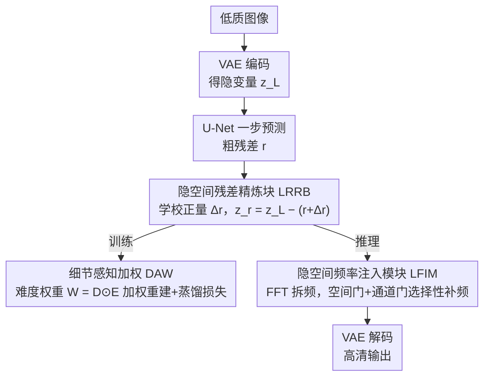

# FiDeSR: High-Fidelity and Detail-Preserving One-Step Diffusion Super-Resolution

**会议**: CVPR 2026  
**arXiv**: [2603.02692](https://arxiv.org/abs/2603.02692)  
**代码**: [GitHub](https://github.com/Ar0Kim/FiDeSR)  
**领域**: 图像超分辨率  
**关键词**: 单步扩散超分, 频率感知, 残差精炼, 细节加权, 高保真

## 一句话总结

提出 FiDeSR，一种高保真和细节保持的单步扩散超分框架，通过细节感知加权（DAW）、隐空间残差精炼块（LRRB）和潜在频率注入模块（LFIM）三个互补组件，同时解决单步扩散超分中的结构保真度退化和高频细节恢复不足问题。

## 研究背景与动机

扩散模型在真实世界图像超分（Real-ISR）中表现出色，但多步扩散推理代价高。单步扩散方法（SinSR、OSEDiff）通过蒸馏压缩迭代过程，但面临两个核心问题：

**高保真度难以保持**：VAE 编码条件导致结构失真和低频不一致（如 AddSR 出现结构扭曲）

**高频细节恢复不足**：
   - 多步扩散通过迭代去噪逐步生成高频细节，单步扩散将此压缩为一步，高频恢复不充分（如 OSEDiff 过度平滑）
   - 最近的残差学习方法（PiSA-SR）仅预测单一全局残差，导致不稳定的高频重建和残差伪影（如 PiSA-SR 生成过多细节）

FiDeSR 的应对方式不在去噪步数上做文章，而是把保真和细节问题拆到训练、模型架构、推理三个阶段，分别用 DAW、LRRB、LFIM 三块针对性补齐。

## 方法详解

### 整体框架

FiDeSR 想解决的是单步扩散超分的一对老毛病：把多步去噪压成一步后，结构容易失真、高频细节又恢复不够。它的思路是不在去噪过程本身下功夫，而是分别在训练、模型、推理三个环节各补一块。整条流水线基于 SD 2.1-base，只用 LoRA 微调：训练时低质图像先被 VAE 编码成隐变量 $z_L$，U-Net 一步预测出粗残差 $r$，残差精炼块（LRRB）把它修成更准的 $z_r$，而细节感知加权（DAW）则在算损失时给不同空间位置分配不同权重；推理时同样走「单步预测 → LRRB 精炼 → 频率注入（LFIM）→ VAE 解码」，其中 LFIM 是一个不需要重训就能在线调节频率强度的旋钮。三块各管一段：DAW 管「学的时候盯哪里」，LRRB 管「残差预测得准不准」，LFIM 管「最后还想加多少细节」。

### 关键设计

**1. 细节感知加权 DAW：让损失盯住模型最容易翻车的细节区**

单步扩散的一个隐患是模型会在大片平坦区域上把损失刷低，却把真正难的边缘纹理糊掉。DAW 的做法是给损失乘一张空间权重图，把注意力强行拉到「既重要又没做好」的位置。它先算一张细节图 $D$，把三个互补算子取平均——Sobel 抓边缘锐度、Laplacian 抓局部对比度、Variance 抓纹理方差：

$$D = \frac{Sobel(x_H) + Laplacian(x_H) + Variance(x_H)}{3}$$

再算一张误差图 $E$，把像素误差和感知误差按比例 $p$ 混起来，$E = (1-p)E_{pix} + pE_{perc}$；两者逐元素相乘得到难度权重 $W_{DAW} = D \odot E$，同时施加到重建损失和 CSD 蒸馏损失上。一个位置只有同时「细节丰富」且「当前重建得差」时权重才高，这比单纯按频率加权更聪明——它不会在已经修好的高频区上反复使劲。

**2. 隐空间残差精炼块 LRRB：把一步预测的粗残差再修一道**

PiSA-SR 这类残差学习方法只预测一个全局残差，单步出手往往不稳，会冒出高频伪影。LRRB 不推翻 U-Net 的预测，而是把它当成一个不错的初始估计再做校正。它借用 ESRGAN 里的 RRDB 结构，但搬到了扩散的隐空间上操作：把 $z_L$ 和 U-Net 给出的初始残差 $r$ 拼起来送进去，学一个校正量 $\Delta r$，得到精炼残差 $r' = r + \Delta r$，最终隐变量为 $z_r = z_L - r'$。和像素域的 ESRGAN 不同，LRRB 是专门针对扩散隐空间里残差不稳定这个问题设计的，相当于在「一步预测」和「最终输出」之间补了一层专职纠错。

**3. 隐空间频率注入模块 LFIM：推理时按区域、按通道地选择性补频率**

前两块都在训练阶段定型，LFIM 则是留给推理的一个旋钮——无需重训就能调节加多少高频或低频。它对精炼后的隐变量 $z_r$ 做 FFT，用 Butterworth 滤波器把它拆成低频分量 $\Delta_{LP}$ 和高频分量 $\Delta_{HP}$，再用两道门控制注入：空间门 $M_{sp}$ 复用细节图（同样的 Sobel/Laplacian/Variance）判断哪些是细节区、哪些是平坦区，通道门 $M_{ch}$ 则看每个通道的频率能量比。注入是有选择的——低频往结构上补、高频往纹理上补，于是低频增强偏向提升保真，高频增强偏向提升感知质量，二者可以在推理时灵活权衡。

### 损失函数 / 训练策略

总损失 $\mathcal{L}_{total} = \mathcal{L}_{rec} + \mathcal{L}_{reg}$：
- **重建损失**：$\mathcal{L}_{rec} = \lambda_{mse} \cdot W_{DAW} \cdot \text{MSE} + \lambda_{lpips} \cdot W'_{DAW} \cdot \text{LPIPS}$
- **正则化损失**：DAW 加权的 CSD 损失（蒸馏预训练扩散模型的语义先验）
- $\lambda_{mse} = 1$, $\lambda_{lpips} = 2$
- 基座：SD 2.1-base，冻结 VAE 和 U-Net，LoRA rank=8
- 训练：2× H100，batch 8，AdamW，lr $5 \times 10^{-5}$，200K steps
- 文本提示由 RAM 提取

## 实验关键数据

### 主实验

| 数据集 | 指标 | FiDeSR (1s) | PiSA-SR (1s) | OSEDiff (1s) | SeeSR (50s) |
|--------|------|-------------|--------------|--------------|-------------|
| DRealSR | PSNR↑ | **28.90** | 28.32 | 27.92 | 28.14 |
| DRealSR | LPIPS↓ | **0.2836** | 0.2960 | 0.2967 | 0.3141 |
| DRealSR | MANIQA↑ | **0.6239** | 0.6161 | 0.5898 | 0.6016 |
| DRealSR | FID↓ | **127.97** | 130.48 | 135.45 | 146.98 |
| RealSR | LPIPS↓ | **0.2626** | 0.2672 | 0.3194 | 0.3004 |
| RealSR | FID↓ | **109.68** | 124.18 | 123.49 | 125.09 |
| DIV2K | DISTS↓ | **0.1845** | 0.1934 | 0.1975 | 0.1966 |

注：FiDeSR 仅用 **1 步**推理，在全参考和无参考指标上均优于多数单步和部分多步方法，FID 在所有方法中最低。

### 消融实验

| 配置 | CLIPIQA↑ | NIQE↓ | MUSIQ↑ | MANIQA↑ | 说明 |
|------|----------|-------|--------|---------|------|
| 无 LRRB + 无 DAW | 0.6611 | 4.7381 | 67.60 | 0.6237 | 基线 |
| 仅 DAW | 0.6641 | 4.7129 | 67.63 | 0.6236 | DAW 轻微提升 |
| 仅 LRRB | 0.6626 | 4.7340 | 67.95 | 0.6278 | LRRB 提升更显著 |
| DAW + LRRB | **0.6699** | **4.6300** | **68.29** | **0.6285** | 互补效果最佳 |

### 关键发现

- FiDeSR 是首个同时在全参考和无参考指标上达到最优平衡的单步扩散 SR 方法
- LRRB 将高频噪声预测误差平均降低 1.62%（DIV2K 1.24%, DRealSR 1.99%, RealSR 1.62%）
- LFIM 的低频注入提升 PSNR/SSIM（结构保真），高频注入提升 MUSIQ/MANIQA（感知质量），可灵活权衡
- 在所有数据集上 FID 最低，说明生成分布最接近真实图像分布

## 亮点与洞察

1. **问题分析精准**：清晰识别了单步扩散 SR 的两个核心瓶颈（保真 vs 细节），并从训练/架构/推理三个阶段针对性设计
2. **DAW 的双重引导**：同时利用细节图（"哪里重要"）和误差图（"哪里差"），比纯频率加权更智能
3. **LRRB 的设计合理性**：将 RRDB 的残差精炼思想引入扩散隐空间，专门解决扩散残差不稳定问题
4. **LFIM 的灵活性**：推理时可调节增强强度，无需重训练，实用性强
5. **感知-失真权衡的突破**：FiDeSR 在二者之间取得了比现有方法更好的平衡

## 局限与展望

1. 基于 SD 2.1-base，可能受限于基座模型的生成能力
2. LFIM 的频率分离依赖 Butterworth 滤波器参数的手动设定
3. DAW 的误差图计算增加了训练时的额外开销
4. 未探索更高效的单步蒸馏策略（如一致性模型）
5. 可扩展到视频超分或多模态修复任务

## 相关工作与启发

- **PiSA-SR**：残差学习的单步扩散 SR，FiDeSR 的 LRRB 直接改进其粗残差预测
- **OSEDiff**：基于 VSD + LoRA 的单步 SR，高频恢复不足
- **GuideSR**：通过全分辨率引导提升保真度，但感知质量受限
- **TFDSR**：将频率信息融入多步扩散，FiDeSR 将类似思想压缩到单步
- 启发：单步扩散的瓶颈不在于步数，而在于残差预测的精度和频率分量的控制

## 评分

- 新颖性: ⭐⭐⭐⭐ 三个组件各有新意，DAW 的双重引导和 LRRB 的扩散隐空间残差精炼设计独特
- 实验充分度: ⭐⭐⭐⭐ 3 个数据集、9 种指标、与 8 种方法对比、消融全面
- 写作质量: ⭐⭐⭐⭐ 问题定义清晰，三个组件的动机和关联讲解流畅
- 价值: ⭐⭐⭐⭐ 单步扩散 SR 的实用性强，同时解决保真和细节恢复是重要贡献

<!-- RELATED:START -->

## 相关论文

- [\[CVPR 2026\] Bridging Fidelity-Reality with Controllable One-Step Diffusion for Image Super-Resolution](bridging_fidelity-reality_with_controllable_one-step_diffusion_for_image_super-r.md)
- [\[CVPR 2026\] IFCSR: Inference-Free Fidelity-Realism Control for One-Step Diffusion-based Real-World Image Super-Resolution](ifcsr_inference-free_fidelity-realism_control_for_one-step_diffusion-based_real-.md)
- [\[CVPR 2026\] One-Step Diffusion Transformer for Controllable Real-World Image Super-Resolution](one-step_diffusion_transformer_for_controllable_real-world_image_super-resolutio.md)
- [\[CVPR 2026\] Time-Aware One Step Diffusion Network for Real-World Image Super-Resolution](time-aware_one_step_diffusion_network_for_real-world_image_super-resolution.md)
- [\[CVPR 2026\] GDPO-SR: Group Direct Preference Optimization for One-Step Generative Image Super-Resolution](gdpo-sr_group_direct_preference_optimization_for_one-step_generative_image_super.md)

<!-- RELATED:END -->
