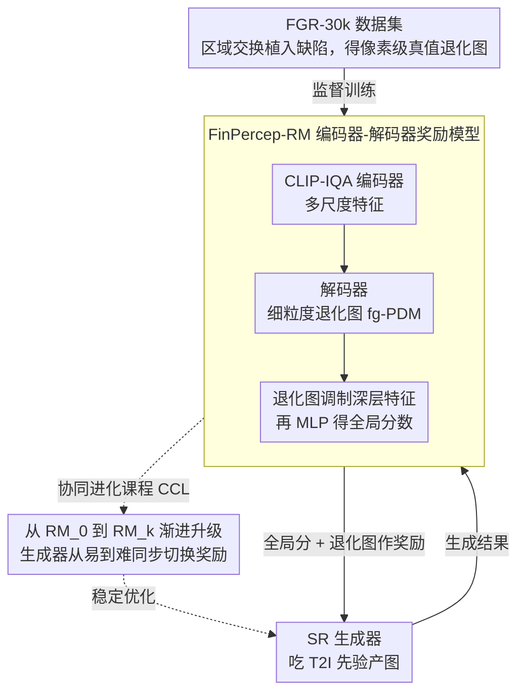

# FinPercep-RM: A Fine-grained Reward Model and Co-evolutionary Curriculum for RL-based Real-world Super-Resolution

**会议**: CVPR 2026  
**arXiv**: [2512.22647](https://arxiv.org/abs/2512.22647)  
**代码**: [https://github.com/lyd-2022/FinPercep-RM](https://github.com/lyd-2022/FinPercep-RM)  
**领域**: 图像修复 / 超分辨率  
**关键词**: 图像超分辨率, 奖励模型, RLHF, 细粒度质量评估, 课程学习

## 一句话总结

提出细粒度感知奖励模型 FinPercep-RM 和协同进化课程学习（CCL）策略，解决 RLHF 应用于真实世界超分辨率时的奖励黑客和训练不稳定问题，通过同时输出全局质量分数和空间退化热力图实现局部缺陷感知。

## 研究背景与动机

基于扩散模型的真实世界图像超分辨率（Real-ISR）已取得显著进展，利用大规模 T2I 模型的生成先验合成丰富纹理。RLHF 作为 T2I 领域的成功优化范式，自然被迁移到 ISR 任务中——用图像质量评估（IQA）模型作为奖励信号引导 SR 模型。

然而，现有 IQA 模型（如 CLIP-IQA、MANIQA）仅输出单一全局分数，**对局部细粒度失真不敏感**——一张有明显局部伪影的图像可能获得与原图相近的高分。这导致严重的**奖励黑客（Reward Hacking）**：生成器学会"讨好"不完善的奖励信号，收敛到全局分数高但充满局部伪影和"油画感"外观的结果。

另一方面，直接使用更复杂的细粒度奖励模型会引发**训练不稳定**——高方差的空间惩罚信号导致策略梯度振荡和收敛失败。这形成了**稳定性-鲁棒性两难**：简单全局奖励稳定但被黑客，复杂细粒度奖励鲁棒但不稳定。

核心思想：**一个好的奖励模型不仅要评估"质量是什么（What）"，还要诊断"缺陷在哪里（Where）"。** 同时用课程学习从简单到复杂逐步引入细粒度奖励。

## 方法详解

### 整体框架

这篇论文要解决的是：把 RLHF 搬到真实世界超分（Real-ISR）上时，奖励信号粒度太粗，生成器学会钻空子刷高全局分却留下满图局部伪影。整个系统由三块拼起来：一个吃 T2I 先验的 SR 生成器负责产图；一个 FinPercep-RM 奖励模型既给整张图打一个全局质量分、又用解码器吐出一张和输入同分辨率的细粒度感知退化图（fg-PDM），告诉训练过程"哪里坏了"；外面再套一层 CCL 协同进化课程，让奖励模型和生成器从"简单全局奖励"一步步同步升级到"带空间热力图的严格奖励"。前两块解决"奖励看得够不够细"，第三块解决"看得细之后训练稳不稳"。

### 关键设计

**1. 编码器-解码器奖励模型：把全局分数和局部缺陷在架构上焊死**

传统 IQA（CLIP-IQA、MANIQA）的全局分数是直接从最深层特征回归出来的，和图像哪块坏了完全脱钩——这正是奖励黑客的根源，一张局部全是伪影的图照样能拿到接近原图的高分。FinPercep-RM 的做法是让全局分数"必须看过"空间缺陷才能算出来。编码器（CLIP-IQA 骨干）抽取多尺度特征 $\{f_i\}_{i=1}^N$，解码器把这些特征上采样、跨层融合，重建出同分辨率的感知退化图 $M_{fg\text{-}pdm}\in[0,1]$（Sigmoid 归一化，值越大代表该像素退化越重）。关键在于全局分数不是从 $f_N$ 直接回归，而是先用退化图去调制最深层特征、再过 MLP：

$$S_{fgc\text{-}global} = \mathrm{MLP}\big(f_N \odot \mathrm{interpolate}(M_{fg\text{-}pdm})\big)$$

退化图作为一道空间门控乘进全局特征，缺陷区域被显式压暗或加权，全局分数就被迫"依赖"局部诊断结果。这样一来生成器再想只刷全局分而不修局部伪影，在架构层面就行不通了。

**2. FGR-30k 数据集：用区域交换可控地"植入"局部缺陷**

想训练出会定位缺陷的解码器，得有带空间标注的监督，可现有 IQA 和偏好数据集只有一个总分、没有"哪里坏"的标签。FGR-30k 用一条合成管线造监督：拿高质量图 $I_{GT}$ 退化成 $I_{LR}$，再用多个 SR 模型生成各式各样的 $I_{SR}$，然后用区域交换把 $I_{SR}$ 里真实的伪影区域（靠随机掩码加 SAM 语义掩码圈出来）抠出来贴回 $I_{GT}$，得到一张除了被植入区域外都完好的合成样本 $I_{syn}$。由于干净底图和植入区域都已知，真值退化图 $M_{gt}$ 可以精确算出来——它融合了像素级 L1 距离和 DINOv3 特征级余弦距离，既抓低层纹理差异、又抓高层语义异常。比起标注真实伪影，这种"可控植入"既便宜又能给出像素级精确的监督。

**3. 协同进化课程学习（CCL）：把"看得细"和"训得稳"调和起来**

直接拿完整 FinPercep-RM 当奖励会出大问题——高方差的空间惩罚信号让策略梯度剧烈振荡、最终不收敛（实验曲线肉眼可见的抖动）。简单全局奖励稳定却被黑客，复杂细粒度奖励鲁棒却不稳定，CCL 用双路径协同进化绕开这个两难。一路是奖励模型渐进扩展：从一个只会打全局分的简单模型 $RM_0$ 起步，分阶段在 FGR-30k 上训练、逐步引入解码器参数，慢慢长成带热力图的完整模型 $RM_k$；另一路是生成器课程共进化：早期先用平滑的 $RM_0$ 把生成器训到稳定收敛，拿到一个好初始化后，再分阶段切换到越来越严格的 $RM_k$。从易到难的过渡让生成器先站稳脚跟、再接受细粒度的局部审查，既躲过了早期的梯度振荡，又在后期拿到了鲁棒的空间监督。

### 一个完整示例：CCL 课程如何展开

以一次完整训练为例感受 CCL 的"协同"。第 0 阶段，奖励模型只有编码器分支 $RM_0$，相当于一个普通全局 IQA；生成器在它的引导下平稳训练、奖励曲线单调上升、收敛到一个不再钻空子的初始策略。进入中间阶段，解码器分支被逐步激活并在 FGR-30k 上学会输出退化图，奖励模型升级为 $RM_1, RM_2, \dots$，每升一级，全局分数就更多地被局部退化图调制、对局部伪影更敏感；生成器同步切到新奖励，因为已经有了稳定初始化，它能消化更严格的空间惩罚而不崩。到最后阶段，完整的 $RM_k$ 上线，奖励既看全局观感、又逐像素盯着伪影区域，生成器被迫把残留的纹理伪影和"油画感"一并修掉。对照直接上完整奖励的版本——曲线一开始就剧烈振荡、迟迟不收敛——CCL 这条从 $RM_0$ 到 $RM_k$ 的平滑路径正是稳定性的来源。

### 损失函数 / 训练策略

FinPercep-RM 的训练目标由三项组成：

$$\mathcal{L}_{total} = \lambda_{map}\,\mathcal{L}_{map} + \lambda_{rank}\,\mathcal{L}_{rank} + \lambda_{align}\,\mathcal{L}_{align}$$

其中 $\mathcal{L}_{map}$ 是预测退化图对真值 $M_{gt}$ 的 L1 损失，直接监督"哪里坏"的定位；$\mathcal{L}_{rank}$ 是三元组排序损失，强制 $S_{SR} < S_{syn} < S_{GT}$，让分数排序符合真实质量序；$\mathcal{L}_{align}$ 是锚定对齐损失，把各阶段的打分锚到统一基准上，防止奖励模型在课程升级过程中发生跨阶段分数漂移、保证生成器看到的奖励尺度一致。RL 端则沿用标准 RLHF pipeline，只是把奖励换成了协同进化中的当前 $RM_k$。

## 实验关键数据

### 主实验

**DRealSR 数据集，应用到不同 SR 基线**

| 基线模型 | 配置 | LPIPS↓ | MUSIQ↑ | MANIQA↑ | CLIPIQA↑ |
|---------|------|--------|--------|---------|---------|
| SUPIR | Baseline | 0.452 | 65.665 | 0.629 | 0.572 |
| SUPIR | + 标准 IQA 奖励 | 0.465 | 64.892 | 0.612 | 0.589 |
| SUPIR | **+ FinPercep-RM** | **0.428** | **67.234** | **0.648** | **0.586** |
| DreamClear | Baseline | 0.317 | 65.077 | 0.605 | 0.543 |
| DreamClear | + 标准 IQA 奖励 | 0.332 | 64.123 | 0.591 | 0.567 |
| DreamClear | **+ FinPercep-RM** | **0.295** | **67.891** | **0.632** | **0.561** |

### 消融实验

| 配置 | 训练稳定性 | 奖励黑客 | 最终质量 | 说明 |
|------|----------|---------|---------|------|
| 标准 IQA 奖励 | ✅ 稳定 | ❌ 严重 | 中等 | 局部伪影明显 |
| FinPercep-RM (无 CCL) | ❌ 振荡 | ✅ 缓解 | 差（不收敛） | 直接使用不稳定 |
| **FinPercep-RM + CCL** | **✅ 稳定** | **✅ 缓解** | **最优** | 完整方法 |

### 关键发现

- 标准 IQA 奖励会导致 LPIPS 上升（失真增加）但 MUSIQ 分数下降——典型的奖励黑客：模型学会了取悦 IQA 但实际质量下降
- FinPercep-RM 在所有 SR 基线上一致提升（包括 ResShift、SUPIR、DreamClear、DiffBIR、SeeSR、DIT4SR）
- CCL 的训练曲线平滑且最终收敛到更高奖励值，直接使用 FinPercep-RM 的曲线剧烈振荡
- 退化图可视化显示 FinPercep-RM 能准确定位纹理伪影区域

## 亮点与洞察

- **将奖励黑客归因于感知粒度不足**是精准的诊断：全局分数确实无法区分"整体好但局部差"和"整体好且局部好"
- **架构耦合全局-局部**的设计巧妙：用退化图调制全局特征再回归分数，使两者在架构层面不可分离
- **CCL 课程学习**解决了一个普遍的 RLHF 问题——复杂奖励信号导致训练不稳定——可迁移到其他 RLHF 应用

## 局限与展望

- FGR-30k 的退化图真值依赖于像素+特征差异的启发式融合，可能不完美反映人类感知
- CCL 的阶段划分和切换时机需要手动调整，自适应课程更理想
- 仅在 ISR 任务上验证，是否适用于其他图像生成 RLHF（如 T2I）待探索
- 编码器-解码器结构增加了计算开销，实时性有限

## 相关工作与启发

- **vs CLIP-IQA/MANIQA**: 仅全局分数，缺乏空间感知，易被奖励黑客
- **vs 大规模 IQA（如 Q-Align）**: 语义感知好但计算成本过高，不适合迭代训练
- **vs NPN（反问题空间方法）**: 不同方向——NPN 在零空间层面工作，FinPercep-RM 在奖励信号层面

## 评分

- 新颖性: ⭐⭐⭐⭐⭐ 首次系统诊断 ISR-RLHF 的奖励黑客问题并提出架构+课程双重解决方案
- 实验充分度: ⭐⭐⭐⭐⭐ 6 个 SR 基线、多数据集、训练曲线可视化、用户研究
- 写作质量: ⭐⭐⭐⭐ 问题动机清晰，图表丰富
- 价值: ⭐⭐⭐⭐⭐ 对 RLHF 在视觉生成中的应用有重要启示

<!-- RELATED:START -->

## 相关论文

- [\[CVPR 2026\] Toward Real-world Infrared Image Super-Resolution: A Unified Autoregressive Framework and Benchmark Dataset](real_iisr_infrared_image_super_resolution_autoregressive.md)
- [\[NeurIPS 2025\] DP²O-SR: Direct Perceptual Preference Optimization for Real-World Image Super-Resolution](../../NeurIPS2025/image_restoration/dp2o-sr_direct_perceptual_preference_optimization_for_real-world_image_super-res.md)
- [\[CVPR 2025\] AdcSR: Adversarial Diffusion Compression for Real-World Image Super-Resolution](../../CVPR2025/image_restoration/adversarial_diffusion_compression_for_real-world_image_super-resolution.md)
- [\[ECCV 2024\] Pairwise Distance Distillation for Unsupervised Real-World Image Super-Resolution](../../ECCV2024/image_restoration/pairwise_distance_distillation_for_unsupervised_real-world_image_super-resolutio.md)
- [\[ECCV 2024\] A New Dataset and Framework for Real-World Blurred Images Super-Resolution](../../ECCV2024/image_restoration/a_new_dataset_and_framework_for_real-world_blurred_images_super-resolution.md)

<!-- RELATED:END -->
