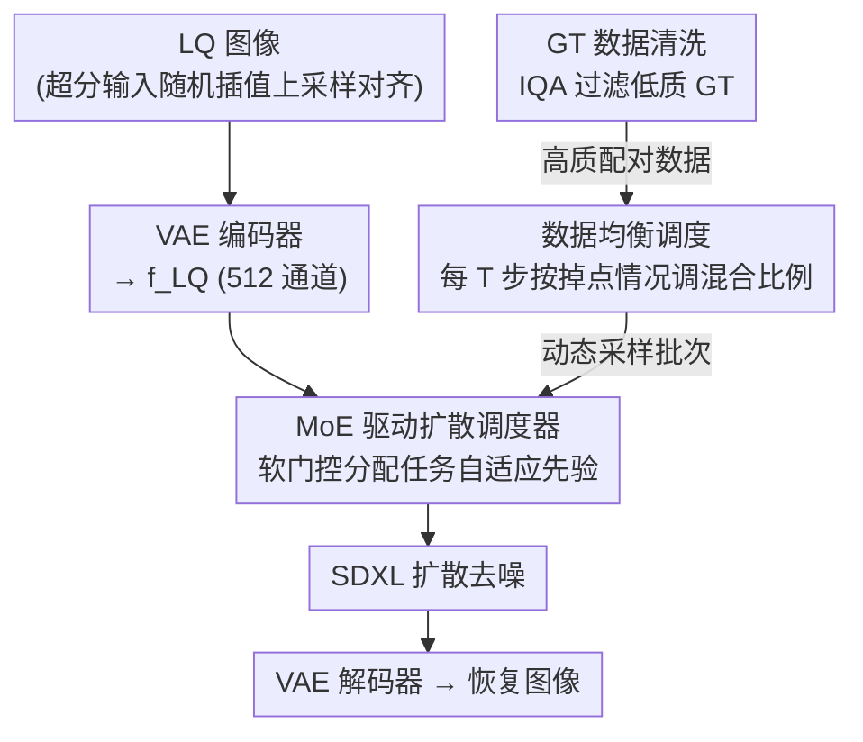

# FoundIR-v2: Optimizing Pre-Training Data Mixtures for Image Restoration Foundation Model

**会议**: CVPR 2026  
**论文**: [CVF Open Access](https://openaccess.thecvf.com/content/CVPR2026/html/Chen_FoundIR-v2_Optimizing_Pre-Training_Data_Mixtures_for_Image_Restoration_Foundation_Model_CVPR_2026_paper.html)  
**代码**: https://github.com/cschenxiang/FoundIR-v2  
**领域**: 图像恢复 / 扩散模型  
**关键词**: 图像恢复基础模型, 数据混合比例, 动态数据调度, MoE 扩散先验, all-in-one  

## 一句话总结
FoundIR-v2 发现「不同恢复任务的训练数据混合比例」本身就是决定 all-in-one 图像恢复性能的关键变量，于是用一套「数据均衡调度（动态调比例）+ MoE 驱动的扩散调度器（动态分配任务自适应生成先验）」的双调度方案在 SDXL 上做生成式预训练，单模型覆盖 50+ 子任务并在多基准上超过现有 SOTA。

## 研究背景与动机
**领域现状**：图像恢复正在走「基础模型」路线——用大规模配对数据预训练一个统一模型，同时处理去模糊、去雾、去噪、低光增强、超分等几十种退化。当前主流提升手段集中在两件事：把数据**做大**（数据合成 / 真实采集，如 FoundIR 收集百万级配对数据）和换更强的**底座**（扩散模型提供生成先验）。

**现有痛点**：几乎所有工作都在堆数据规模和质量，却忽略了一个隐藏旋钮——**各任务数据之间的混合比例**（即分给去模糊 vs 去雾 vs 超分的相对数据量）。作者的统计实验（Figure 1，限定去模糊/去雾/低光/超分四任务）显示：对四个任务用相同或随机采样比例，会导致 all-in-one 模型性能严重不稳定——简单任务过拟合、复杂任务欠拟合。换句话说，不合适的混合比例直接造成「训练低效 / 学习不充分」。

**核心矛盾**：任务之间的数据交互是复杂的——可能互相促进、互相独立、甚至互相冲突；而且不同任务因为内在难度不同，所需数据量差异很大。静态固定比例（现有做法）无法应对这种异质性，必然顾此失彼。第二个被忽略的矛盾在底座侧：现有方法要么直接套扩散模型、要么对所有任务统一微调，**没有按任务区分扩散先验的作用**——比如处理「低分辨率 + 有雾」图像时，现有 all-in-one 只去雾、忘了同时该做超分，白白浪费了扩散先验的重建潜力。

**本文目标**：(1) 系统地优化数据组成，在平衡各任务能力的同时挖掘任务间的协同；(2) 自适应地给每个任务分配合适的扩散先验。

**核心 idea**：把 LLM 时代的「数据混合律（Data Mixing Law）」迁移到图像恢复——**动态**而非静态地调整训练池中各任务的采样比例（哪个任务掉点就给它加数据），并配一个 MoE 调度器在生成式预训练中**按任务动态分配生成先验**，数据调度与模型调度联合优化。

## 方法详解

### 整体框架
FoundIR-v2 以 SDXL 为扩散底座，是一个 latent-space 的生成式恢复框架，核心是「**双调度**」：数据侧的均衡调度优化喂什么、模型侧的 MoE 调度器优化怎么用先验。整条流水线：低质（LQ）图像经预训练 VAE 编码器投到隐空间得到 $f^{LQ}$（取编码器倒数第二层、512 通道特征）；对来自超分数据集的 LQ 输入，因其与 HQ 分辨率不同，先用随机选取的插值（最近邻/双线性/双三次）上采样对齐到输出分辨率，使所有任务能统一训练。$f^{LQ}$ 与扩散模型在时间步 $t$ 产生的带噪隐变量 $x_t^{HQ}$ 拼接后送入 MoE 调度器，产出任务自适应的调度特征去引导扩散过程；同时用 LLaVA 给所有训练数据生成图像描述，文本嵌入经 cross-attention 注入隐特征作为辅助 text-to-image 信息。整个多任务训练过程外挂一个数据均衡调度环：每隔 $T$ 次迭代在小参考集上评估各任务表现、重算混合比例。最后由 VAE 解码器还原输出。

### 关键设计

**1. 数据均衡调度（DES）：哪个任务掉点就给它加数据**

针对「静态固定比例顾此失彼」的痛点，DES 把混合比例做成训练中可动态调整的变量。先把大规模训练数据 $\mathcal{D}_{tr}$ 按任务属性切成 $k$ 类，混合比例（权重）$\lambda$ 定义为在 $k$ 个域上的采样概率，从而决定训练数据分布 $P_\lambda = \sum_{i=1}^{k}\lambda_i\,\mathrm{unif}(\mathcal{D}_i)$；训练目标是在固定模型规模下最小化 L1 重建损失 $\theta_\lambda^* = \arg\min_\theta \lVert I^{HQ} - M_0(I^{LQ})\rVert_1$。关键在于比例不再固定：初始用均匀采样，之后每隔 $T$ 次迭代在一个**独立小参考集** $\mathcal{D}_{ref}$（从各任务各取等量样本、与 $\mathcal{D}_{tr}$ 不相交）上评估当前模型，得到各任务得分 $s_j^{(t)}$，与上一个检查点 $s_j^{(t-T)}$ 比较。若任务 $j$ 掉点（$s_j^{(t)} < s_j^{(t-T)}$）就提高它下一轮的采样概率、多分配监督，反之略微降权。更新规则用 softmax 归一化重加权：

$$\lambda_j^{(t+1)} = \frac{\lambda_j^{(t)}\exp\!\big(-\alpha\,\Delta s_j^{(t)}\big)}{\sum_{i=1}^{k}\lambda_i^{(t)}\exp\!\big(-\alpha\,\Delta s_i^{(t)}\big)}$$

其中 $\Delta s_j^{(t)} = s_j^{(t)} - s_j^{(t-T)}$ 是任务 $j$ 的表现变化，$\alpha>0$ 控制调整灵敏度，归一化保证 $\sum_j\lambda_j^{(t+1)}=1$。这样「给欠学任务补数据、防已学好任务过拟合」是闭环自调的，而非靠人工拍比例。作者强调**不存在某个绝对最优比例**——比例本就该随训练动态漂移（Table 2 给出实例：超分从 25% 一路涨到 45%，低光从 25% 降到 10%）；相比静态采样，动态混合让模型在训练**早期**就能较快获得综合恢复能力，而不是拖到最后才收敛。

**2. MoE 驱动的扩散调度器：按任务软分配生成先验**

针对「对所有任务无差别地用扩散先验」的痛点，这个调度器让不同退化任务各取所需。给定 LQ 特征 $f_k^{LQ}$ 与第 $k$ 个任务在时间步 $t$ 的带噪隐变量 $x_{t,k}^{HQ}$，先拼接成融合表示 $z_t^{(k)} = \phi(f_k^{LQ}, x_{t,k}^{HQ})$，送入由 $n$ 个共享专家组成的 MoE。每个专家 $E_i(\cdot)$ 是**一种注意力机制**（如空间注意力、通道注意力、稀疏注意力），用来激活不同任务所需的线索。路由器对融合表示打分并用 softmax 转成非负、和为 1 的权重：

$$w_i^{(k)} = \frac{\exp\!\big(g_i^{(k)\top} z_t^{(k)}\big)}{\sum_{j=1}^{n}\exp\!\big(g_j^{(k)\top} z_t^{(k)}\big)}, \qquad F^{(k)}(z_t) = \sum_{i=1}^{n} w_i^{(k)}\,E_i\!\big(z_t^{(k)}\big)$$

$g_i^{(k)}$ 是每个专家的可学习门控参数。这里用的是**软 MoE**（所有专家加权融合），而非只取 top-k 的硬 MoE——消融显示软门控让专家自适应协作、各任务都更稳（Figure 7a）。训练采用两阶段：先只预训练调度器，再联合微调 VAE 编码器、调度器与扩散模型，以增强多任务特征利用的一致性。本设计与设计 1 联合优化，让「动态数据混合」对齐「自适应模型能力」。

**3. 高质量 GT 数据清洗：别让脏 GT 污染多任务目标**

针对一个被忽视的数据问题：现有数据集只关心 LQ 图像的退化多样性，却忽略 GT 质量。例如去雾任务的 GT 虽然无雾，但常带模糊、噪声等其它退化（Figure 3）——在数据混合训练时，这种「不干净的 GT」会让不同任务的学习目标互相冲突，干扰泛化。作者用多模态 IQA 模型（如 DA-CLIP、DepictQA）对训练集 GT 做退化识别与质量评估，过滤掉低质 GT、只保留高质量配对数据，缓解预训练混合时的「数据污染」。消融（Figure 7b）表明过滤后恢复性能进一步提升，说明 GT 质量对基础模型同样重要。

### 损失函数 / 训练策略
重建用 L1 损失（式 2）。在一张 NVIDIA H20（96 GB）上用 AdamW 训练，图像随机裁成 $512\times512$、batch size 16，遵循两阶段训练：第二阶段 VAE 编码器初始学习率 $5\times10^{-6}$、其余组件 $5\times10^{-5}$，余弦退火调度；共 150,000 次迭代，调度间隔 $T=30{,}000$，每轮比例调整幅度限制在 $[5\%, 10\%]$。一个工程技巧：先在**小模型**上记录数据比例的调整趋势，再迁移到大模型指导训练，以降低大规模预训练成本；小模型验证时超分任务用 MUSIQ 算分、其余任务用 PSNR，$\mathcal{D}_{ref}$ 每类 10 个样本。推理用 Euler 调度器、20 步采样、CFG 尺度固定 5；超分任务用 AdaIN 做 color-fix，其余任务不做。

## 实验关键数据

### 主实验
在多任务公开基准上与通用恢复、all-in-one、恢复 agent 及真实超分方法对比（PSNR/SSIM/LPIPS 及多种感知指标）。下表节选 FoundIR-v2（Ours）相对最强 all-in-one 基线 FoundIR 的代表性结果：

| 基准（任务） | 指标 | 本文 | FoundIR | 备注 |
|------|------|------|---------|------|
| 4KRD（运动去模糊） | PSNR ↑ | 26.64 | 26.59 | LPIPS 0.145 vs 0.235，感知质量大幅领先 |
| LSD（散焦去模糊） | PSNR ↑ | 20.78 | 19.18 | MUSIQ 50.74 vs 15.92 |
| Dense-HAZE（去雾） | PSNR ↑ | **15.29** | 9.29 | +6.0 dB |
| NH-HAZE（非均匀去雾） | PSNR ↑ | **17.00** | 11.43 | +5.6 dB |
| RS-Cloud（去云） | PSNR ↑ | **22.06** | 11.71 | +10.4 dB，SSIM 0.828 |

在去雾/去云这类「复杂且数据稀缺」的任务上，FoundIR-v2 的 PSNR 增益最显著（最多 +10 dB），印证「动态给欠学任务补数据」的价值；在去模糊这类已被充分学习的任务上 PSNR 与 FoundIR 持平但感知指标（LPIPS/MUSIQ/CLIPIQA+）明显更好。

### 消融实验
核心消融在去模糊/去雾/低光/超分四个代表任务上取平均：

| 配置 | Avg. PSNR ↑ | Avg. SSIM ↑ | 说明 |
|------|------|------|------|
| Mixing（混合训练） | 18.91 | 0.6759 | 静态混合 |
| Sequence（顺序学习） | 18.69 | 0.6476 | 多任务顺序 |
| Incremental（增量学习） | 19.93 | 0.6725 | FoundIR 式增量 |
| **DES（本文）** | **20.41** | **0.6977** | 动态均衡调度最优 |

DES 不仅在 FoundIR-v2 上最优，迁移到 PromptIR、FoundIR 上也能在它们各自固定比例方案上带来增益。$\mathcal{D}_{ref}$ 大小与间隔 $T$ 的敏感性见下表：

| $\mathcal{D}_{ref}$ size | 10 | 10 | 10 | 20 | 30 |
|------|------|------|------|------|------|
| $T$ interval | 10000 | 25000 | 30000 | 30000 | 30000 |
| Avg. PSNR | 20.17 | 20.53 | 20.41（Ours） | 20.48 | 20.36 |

### 关键发现
- **数据比例是一等公民**：相同/随机比例会让简单任务过拟合、复杂任务欠拟合；且**没有绝对最优比例**，比例应随训练动态漂移（Table 2 中超分 25%→45%、低光 25%→10%）。
- **DES 是性能主力**：在固定模型下，DES 比混合/顺序/增量三种策略都更高，且可即插即用到别的 all-in-one 模型上。
- **软 MoE > 硬 MoE > 无调度器**：软门控让专家自适应协作，雷达图上各任务都更稳（Figure 7a）。
- **GT 质量同样重要**：过滤低质 GT（约从原始数据中剔除一部分）能进一步提升性能（Figure 7b）。
- **超参不敏感**：$\mathcal{D}_{ref}$ 取 10、$T$ 取 30000 时综合时间开销与性能最划算，平均 PSNR 波动很小。

## 亮点与洞察
- **把 LLM 的「数据混合律」搬进低级视觉**：以往图像恢复只卷数据规模，本文第一次把「混合比例」当成可优化目标，并给出闭环自调的 DES 公式（按掉点情况 softmax 重加权），思路干净、可迁移到任何多任务/多域训练。
- **「掉点就补数据」的反馈控制很巧**：用一个小独立参考集周期性体检、比较相邻检查点的得分差 $\Delta s$ 来驱动比例调整，本质是把训练当成一个需要负反馈稳定的多任务系统，避免人工调参。
- **专家 = 不同注意力机制**：MoE 的每个专家是空间/通道/稀疏注意力，软门控按任务激活不同线索，把「按任务分配扩散先验」具体落到了可学习的注意力组合上。
- **小模型探路、大模型沿用**：先在小模型上记录比例调整趋势再迁移到大模型，是降低大规模生成式预训练成本的实用工程技巧。

## 局限与展望
- 论文主要在四个代表任务上做消融分析（出于训练成本），50+ 子任务的细粒度逐项分析放在补充材料，正文难以核验每个任务都受益。⚠️ 具体各子任务表现以原文/补充为准。
- DES 依赖在 $\mathcal{D}_{ref}$ 上的周期性评估，评测指标的选择（超分用 MUSIQ、其余用 PSNR）本身会影响比例调整方向，跨任务用不同指标驱动同一套权重更新存在一定异质性，可能引入偏置。
- 去雾/去云等任务 PSNR 绝对值仍偏低（如 Dense-HAZE 15.29），说明这些复杂退化即便动态补数据也远未饱和，瓶颈可能在数据本身而非比例。
- 比例调整幅度被人工限制在 $[5\%,10\%]$/轮、$\alpha$ 等也是手调，调度本身仍有超参；如何让灵敏度也自适应是可延伸方向。

## 相关工作与启发
- **vs FoundIR（前作）**：FoundIR 研究的是图像恢复的**数据规模律**（数据越多越好）并用静态固定比例训练；本文进一步揭示**数据混合律**——比例同样关键，并把比例从静态变为动态调度，同时底座从图像空间扩散换成 latent 空间扩散（SDXL），消融显示同策略下 FoundIR-v2 显著优于 FoundIR。
- **vs SUPIR / FaithDiff 等真实超分**：它们主要面向单一超分/感知质量，本文是覆盖 50+ 任务的统一基础模型；针对「低分有雾」这类复合退化，级联 FoundIR(去退化)+SUPIR(超分) 会割裂，FoundIR-v2 在一个模型里同时完成退化去除与细节生成（Figure 6）。
- **vs PromptIR / DiffUIR / InstructIR 等 all-in-one**：它们用静态混合或 prompt 区分任务，本文的差异是把「喂什么数据」做成动态闭环 + 把「怎么用先验」做成软 MoE，二者联合优化。

## 评分
- 新颖性: ⭐⭐⭐⭐⭐ 首次把「数据混合比例」立为图像恢复基础模型的一等优化目标，并给出动态闭环调度方案。
- 实验充分度: ⭐⭐⭐⭐ 覆盖任务广、对比 SOTA 多、消融完整；但 50+ 子任务的逐项分析多在补充，正文以四任务为主。
- 写作质量: ⭐⭐⭐⭐ 动机—方法—消融逻辑清晰，公式与算法伪代码齐全。
- 价值: ⭐⭐⭐⭐⭐ DES 即插即用、可迁移到任意多任务训练，对「数据配比」这一被忽视维度提供了实用方法论。

<!-- RELATED:START -->

## 相关论文

- [\[ICCV 2025\] FoundIR: Unleashing Million-scale Training Data to Advance Foundation Models for Image Restoration](../../ICCV2025/image_restoration/foundir_unleashing_million-scale_training_data_to_advance_foundation_models_for_.md)
- [\[CVPR 2026\] Residual Diffusion Bridge Model for Image Restoration](residual_diffusion_bridge_model_for_image_restoration.md)
- [\[CVPR 2026\] 2-Shots in the Dark: Low-Light Denoising with Minimal Data Acquisition](2-shots_in_the_dark_low-light_denoising_with_minimal_data_acquisition.md)
- [\[CVPR 2026\] Hybrid Agents for Image Restoration](hybrid_agents_for_image_restoration.md)
- [\[CVPR 2026\] Beyond Strict Pairing: Arbitrarily Paired Training for High-Performance Infrared and Visible Image Fusion](beyond_strict_pairing_arbitrarily_paired_training_for_high-performance_infrared_.md)

<!-- RELATED:END -->
