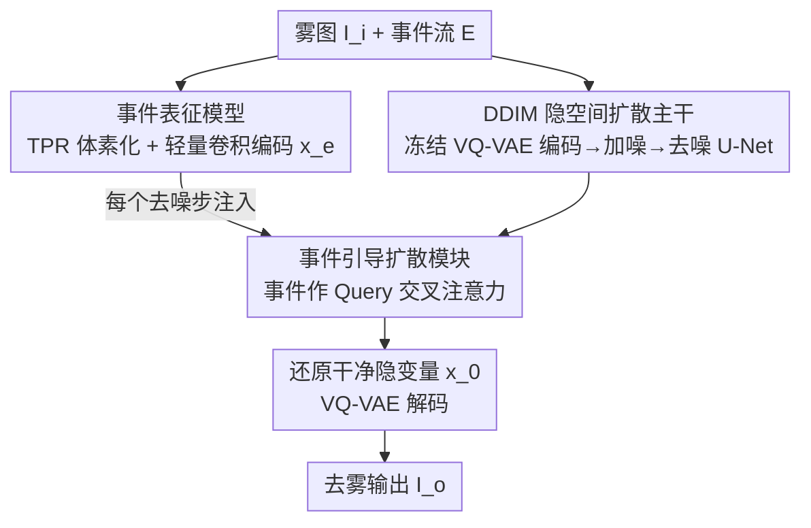

# From Events to Clarity: The Event-Guided Diffusion Framework for Dehazing

**会议**: CVPR 2026  
**论文**: [CVF Open Access](https://openaccess.thecvf.com/content/CVPR2026/html/Wang_From_Events_to_Clarity_The_Event-Guided_Diffusion_Framework_for_Dehazing_CVPR_2026_paper.html)  
**代码**: 待确认（论文承诺开源数据集，未给出仓库链接）  
**领域**: 图像恢复 / 扩散模型  
**关键词**: 事件相机, 图像去雾, 扩散模型, 高动态范围, 交叉注意力

## 一句话总结
EvDehaze 首次把事件相机引入去雾任务，将去雾重新建模成「以事件为条件的图像生成」，在隐空间 DDIM 扩散里通过交叉注意力注入事件的高动态范围边缘/对比度线索，在无需真实成对数据监督的情况下生成更真实清晰的去雾图，并附带首个真实雾天 RGB-事件无人机数据集。

## 研究背景与动机

**领域现状**：去雾经历了三代——基于大气散射模型（ASM）与暗通道先验等手工先验、基于深度网络（DehazeNet、FFA-Net、Restormer 等）的端到端监督回归、以及最近用扩散模型（IR-SDE、ResShift）借助强生成先验来恢复清晰图像。

**现有痛点**：无论哪一代方法，**输入都只是 RGB 帧**。而 RGB 由有源像素传感器（APS）采集，动态范围本就有限（约 60dB）。论文在 Sec. 3 用大气散射模型给出了定量证明：浓雾会**压缩观测动态范围**——设透射率为常数 $t$，令 $a=J_{\min}t$、$b=A(1-t)$，则观测到的对比度 $DR_{\text{obs}}=\frac{ka+b}{a+b}<k=DR_{\text{true}}$，且 $t$ 越接近 0（雾越浓）$a$ 越小、动态范围损失越严重。这种信息丢失是不可逆的，导致去雾本质上是病态问题，强行恢复往往抹掉结构和光照细节、产生伪影。

**核心矛盾**：要补回被雾压掉的高动态范围信息，但 RGB 传感器本身就没记下这些信息——靠 RGB 去恢复 RGB 丢失的东西是「无米之炊」。同时，雾天里雾的浓度、光照随时变，几乎不可能采集到对齐的「雾图-清晰图」真实成对数据，所以监督学习的路也走不通。

**本文目标**：(1) 找一个本身就能在雾里保留高动态范围的信息源；(2) 在没有真实成对监督的前提下，把这种信息有效注入去雾模型。

**切入角度**：事件相机异步触发、微秒级延迟、动态范围高达 120dB（是 APS 的两倍），对局部亮度变化敏感，天然能在雾里捕捉到边缘、角点等结构线索。作者由此提出：**事件流恰好能补上 RGB 缺失的 HDR 结构信息**。而扩散模型的强生成先验和对真实数据的鲁棒泛化，正适合在「无监督」场景下把这种稀疏线索转化为真实图像。

**核心 idea**：把事件引导的去雾重写成「**以稀疏事件为条件的扩散生成**」——不显式地把事件翻译成 RGB，而是把事件特征直接注入隐空间去噪的每一步，让采样轨迹被物理一致的边缘/对比度先验牵引。

## 方法详解

### 整体框架

EvDehaze（记作 $f_{edh}$）输入一帧雾图 $I_i$ 和对应事件流 $E$，输出去雾帧 $I_o=f_{edh}(I_i, E)$。整条管线在**冻结的 VQ-VAE 隐空间**里跑 DDIM 扩散，分三块协同：① VQ-VAE 把雾图编码进隐空间，加噪后由去噪 U-Net 迭代还原干净隐变量，再解码回图像，提供生成主干和强先验；② 事件表征模型把原始事件流编码成多尺度高动态范围特征 $x_e$；③ 事件引导扩散模块在每个去噪步通过交叉注意力把 $x_e$ 注入 U-Net 中间层，让生成轨迹始终被事件的边缘/对比度线索牵引。关键在于：事件不是被翻译成像素，而是作为「隐式条件」贯穿整个去噪过程。

### 关键设计

**1. 隐空间 DDIM 扩散主干：在 VQ-VAE 压缩空间里跑去噪，省算力又借生成先验**

针对「去雾病态、RGB 强行恢复易出伪影」的痛点，作者不做像素级回归，而是把去雾交给扩散生成。雾图 $I_i$ 先由冻结的 VQ-VAE 编码器编成紧凑隐变量 $x_{hz}=f_E(I_i)$，加高斯噪声得到 $x_T = x_{hz} + N$；之后 DDIM 采样器跑 $T$ 步，每步去噪 U-Net 以噪声隐变量 $x_t$、原始隐变量 $x_{hz}$ 和事件特征 $x_e$ 三者为条件预测 $x_{t-1}$，即 $p_\theta(x_{t-1}\mid x_t, x_{hz}, x_e)$；还原出 $x_0$ 后再经冻结解码器得到 $I_o=f_D(x_0)$。把 $x_{hz}$ 作为条件贯穿全程，保证生成轨迹锚定在原图内容附近、不会漫游跑偏；在低维隐空间操作则显著降低显存与推理开销。选 DDIM 而非 DDPM 是因为它用非马尔可夫确定性采样、训练目标不变但推理可大幅加速——实验里只用 **15 步**就能平衡速度与质量。

**2. 事件表征模型：用时序金字塔把稀疏事件压成多尺度 HDR 特征**

事件天然只响应局部亮度变化，对雾鲁棒、自带精确边缘与运动信息，但直接建模这种细粒度时序结构计算量大。作者采用时序金字塔表征（TPR）：把事件流 $E$ 切成 $L=3$ 个层级、覆盖逐级缩小的时间窗，每层再分 $M=2$ 个时间 bin，形成体素网格 $V_l\in\mathbb{R}^{M\times H\times W}$，拼成统一 4D 张量 $E_{\text{TPR}}=\{V_l\}_{l=1}^{L}\in\mathbb{R}^{L\times M\times H\times W}$，同时编码粗、细两种尺度的时序结构。随后用一个仅含三层卷积 + 池化的轻量编码器 $f_e$ 把它压成低维特征图 $x_e=f_e(E_{\text{TPR}})\in\mathbb{R}^{C\times H'\times W'}$。这一表征既紧凑又判别性强，专为注入扩散模型而设计——它把事件里抗雾的边缘/纹理信号提炼成能直接喂给去噪步的条件。

**3. 事件引导扩散模块：事件当 Query 做交叉注意力，把 HDR 线索注入每个去噪步**

针对「事件特征怎么有效喂进扩散」的问题，作者没有用简单拼接，而是设计基于交叉注意力的引导模块 $f_{eg}$。在时间步 $t$，取 U-Net 中间特征作 Key、Value，事件特征 $x_e$ 作 Query：$Q=W_q x_e$、$K=W_k x_t$、$V=W_v x_t$，注意力为 $\text{Attention}(Q,K,V)=\text{Softmax}\!\big((QK^\top)/\sqrt{d}\big)V$。其含义是让事件捕捉到的空间边缘与对比度区域去「查询」并调制 U-Net 的去噪行为，从而把生成对齐到物理一致的边缘/对比度先验上。该交叉注意力被嵌入 U-Net 选定的中间层、并在**所有 DDIM 步**反复施加，使事件引导随去噪渐进注入，强化结构一致性、减少语义漂移。消融显示：把它换成简单特征拼接（w/o cross attention）会明显掉点，证明「以事件为 Query 的注意力」这个形式本身是关键。

### 损失函数 / 训练策略

训练目标为像素 + 感知的组合：$L_{\text{total}}=\lambda_{\text{pix}}L_{\text{pix}}+\lambda_{\text{perc}}L_{\text{perc}}$，其中 $L_{\text{pix}}$ 是生成图与干净图之间的 $\ell_1$ 损失（保证颜色与结构准确），$L_{\text{perc}}$ 是在预训练 VGG 深层特征上算的感知损失（鼓励语义保真）。论文设 $\lambda_{\text{pix}}=1.0$、$\lambda_{\text{perc}}=0.2$。优化器 AdamW、固定学习率 $5\times10^{-5}$，在四张 A800 上训练，其余架构与训练设置沿用 ResShift 管线。

## 实验关键数据

### 主实验

在合成集 SOTS 与真实集 NH-HAZE 上对比（事件均为模拟），核心结论是：在**扩散类方法**内 EvDehaze 取得最优，且参数远少于 IR-SDE。作者明确声明目标不是在 PSNR/SSIM 上超过 RGB 监督回归器，而是追求感知真实感，所以主比较锚定扩散组。

| 类别 | 方法 | SOTS PSNR↑ | SOTS SSIM↑ | SOTS LPIPS↓ | NH-HAZE PSNR↑ | NH-HAZE LPIPS↓ | 参数 |
|------|------|-----------|-----------|------------|---------------|----------------|------|
| 监督回归 | Restormer | 38.43 | 0.989 | 0.009 | 18.32 | 0.355 | 26.13M |
| 监督回归 | Dehamer | 36.63 | 0.988 | 0.005 | 20.66 | 0.230 | 132.50M |
| 监督回归 | **Restormer+EGDM(本文)** | **39.12** | **0.990** | 0.009 | 19.23 | 0.331 | 32.86M |
| 扩散 | IR-SDE | 33.82 | 0.984 | 0.014 | 12.59 | 0.361 | 537.21M |
| 扩散 | ResShift | 29.06 | 0.950 | 0.017 | 16.26 | 0.327 | 114.65M |
| 扩散 | **EvDehaze(本文)** | **34.12** | **0.986** | **0.012** | **18.43** | **0.313** | 122.68M |

两个值得注意的点：一是把事件引导模块 EGDM 插进监督式 Restormer 主干（Restormer+EGDM），在不改架构、仅加事件线索的情况下 SOTS PSNR 从 38.43 提到 39.12，说明 HDR 事件线索对强 Transformer 基线也有增益；二是 EvDehaze 在扩散组里 SOTS PSNR 34.12（远超 ResShift 的 29.06）、NH-HAZE LPIPS 0.313 全表最低，参数却只有 IR-SDE 的约 1/4。

### 消融实验

| 配置 | SOTS PSNR↑ | SOTS SSIM↑ | 说明 |
|------|-----------|-----------|------|
| (1) Baseline (ResShift) | 29.06 | 0.950 | 无事件、无引导 |
| (2) w/o event data | 30.15 | 0.957 | 去掉事件数据 |
| (3) w/o cross attention | 33.65 | 0.981 | 事件改简单拼接注入 |
| (4) Full Model (EvDehaze) | 34.12 | 0.986 | 完整模型 |

采样器消融（Tab. 3）显示 DDIM 15 步（34.12 / 0.986）优于 DDPM 15 步（33.92 / 0.985）和 DDPM 5 步（33.70 / 0.982），印证选 DDIM 既快又略好。

### 关键发现
- **事件数据是最大增益来源**：从 Baseline(29.06) 到完整模型(34.12) 共涨 5.06 dB，其中加入事件（配置 2，30.15）和把事件用交叉注意力正确注入（配置 3→4）各贡献一部分；缺了事件数据掉点最明显，说明 HDR 线索是恢复对比度的「命脉」。
- **注入方式很关键**：w/o cross attention（简单拼接，33.65）比完整模型（34.12）低，证明不是「有事件就行」，而是必须用以事件为 Query 的交叉注意力去调制去噪行为。
- **真实数据集验证泛化**：在自采无人机雾天数据（AQI=341）上，输出直方图相比输入呈现更宽的强度范围和更强的中高调，定性证明 EvDehaze 在真实场景里确实扩展了可用动态范围、恢复了远处建筑与道路的边缘纹理。

## 亮点与洞察
- **传感器层面的破题**：去雾被困在「RGB 丢的信息 RGB 补不回」的死结里多年，本文换传感器——用事件相机的 120dB HDR 直接提供 RGB 缺失的结构线索，是从问题根源（信息源）而非算法层面破局，思路很干净。
- **把无监督难题转译成条件生成**：雾天采不到成对数据 → 干脆不做监督回归，改用扩散的生成先验 + 事件条件，绕开「必须有 GT」的约束，这个 reframing 是全文最聪明的一步。
- **EGDM 是可插拔模块**：事件引导模块能搬到 Restormer 这种非扩散主干上并稳定涨点，意味着「事件 HDR 线索」这个 trick 可迁移到任意有中间特征的恢复网络，迁移时只需把事件特征当 Query 做交叉注意力即可。
- **首个真实雾天 RGB-事件数据集**：用 DJI M300 RTK + PROPHESEE EVK4 + RealSense D435i（3.6cm 对齐架）采集 AQI=341 的同步数据，填补了事件去雾无真实数据的空白。

## 局限与展望
- 作者自己澄清：目标不是 PSNR/SSIM 超过 RGB 监督回归器，所以在合成 SOTS 上像素保真度仍低于 Restormer/Dehamer（34.12 vs 38+），追求高保真度的应用未必适用。
- ⚠️ 训练与多数测试用的是 **Vid2E 模拟事件**（RESIDE-ITS 上用 6-DoF 运动合成 44k 对），真实事件只在自采无人机集上做定性评估，缺真实事件的定量指标——模拟到真实的域差距未被量化。
- 自采数据集描述里 AQI 出现 341 与 314 两个数值（摘要/图 1 写 341，采集段落写 314），疑为笔误，⚠️ 以原文为准。
- 事件相机依赖运动产生触发，对完全静止场景或纹理稀疏区域，事件线索可能稀疏；论文用 6-DoF 模拟运动来保证事件密度，真实静态雾景下的表现存疑。
- 改进方向：补充真实事件的定量评测、探索在动态/低光叠加雾的复杂场景下的鲁棒性。

## 相关工作与启发
- **vs RGB 监督回归（Restormer / Dehamer / FFA-Net）**：它们靠大规模成对合成数据做像素级回归，PSNR 高但在浓雾真实场景因信息不可逆丢失而出伪影；本文用扩散 + 事件追求感知真实感，不直接和它们比像素保真，而是补上 HDR 信息源。
- **vs 扩散去雾（IR-SDE / ResShift）**：同为扩散生成先验，但它们只吃 RGB、在病态去雾里缺结构约束易生成不真实纹理；本文把事件的边缘/对比度先验通过交叉注意力注入每个去噪步，给生成轨迹加了物理锚点，且参数更省。
- **vs 其他事件引导增强（低光增强、去雨、HDR 成像）**：以往事件引导任务大多依赖大规模真实成对数据学映射，而雾天无法采成对数据；本文用扩散生成先验绕开监督需求，是事件引导首次进入去雾这一无监督场景。

## 评分
- 新颖性: ⭐⭐⭐⭐⭐ 首次把事件相机引入去雾，并将其重写成事件条件扩散生成，传感器层面破题
- 实验充分度: ⭐⭐⭐⭐ 三套设置 + 消融充分，但真实事件仅做定性、模拟到真实域差距未量化
- 写作质量: ⭐⭐⭐⭐ 动机推导（HDR 压缩证明）清晰，但 AQI 数值前后不一致等小瑕疵
- 价值: ⭐⭐⭐⭐ 思路可迁移、附首个真实 RGB-事件雾天数据集，对事件成像与去雾社区有奠基意义

<!-- RELATED:START -->

## 相关论文

- [\[CVPR 2026\] NEC-Diff: Noise-Robust Event–RAW Complementary Diffusion for Seeing Motion in Extreme Darkness](nec-diff_noise-robust_event-raw_complementary_diffusion_for_seeing_motion_in_ext.md)
- [\[CVPR 2026\] One-Shot Flow, Any-Time Frame: A Bidirectional Warping Framework for Event-Based Video Frame Interpolation](one-shot_flow_any-time_frame_a_bidirectional_warping_framework_for_event-based_v.md)
- [\[CVPR 2026\] DRFusion: Degradation-Robust Fusion via Degradation-Aware Diffusion Framework](drfusion_degradation_robust_fusion_via_degradation_aware_diffusion_framework.md)
- [\[CVPR 2026\] AE2VID: Event-based Video Reconstruction via Aperture Modulation](ae2vid_event-based_video_reconstruction_via_aperture_modulation.md)
- [\[CVPR 2026\] Disentanglement-wise Image Dehazing through Cross-Domain Manifold Consensus](disentanglement-wise_image_dehazing_through_cross-domain_manifold_consensus.md)

<!-- RELATED:END -->
