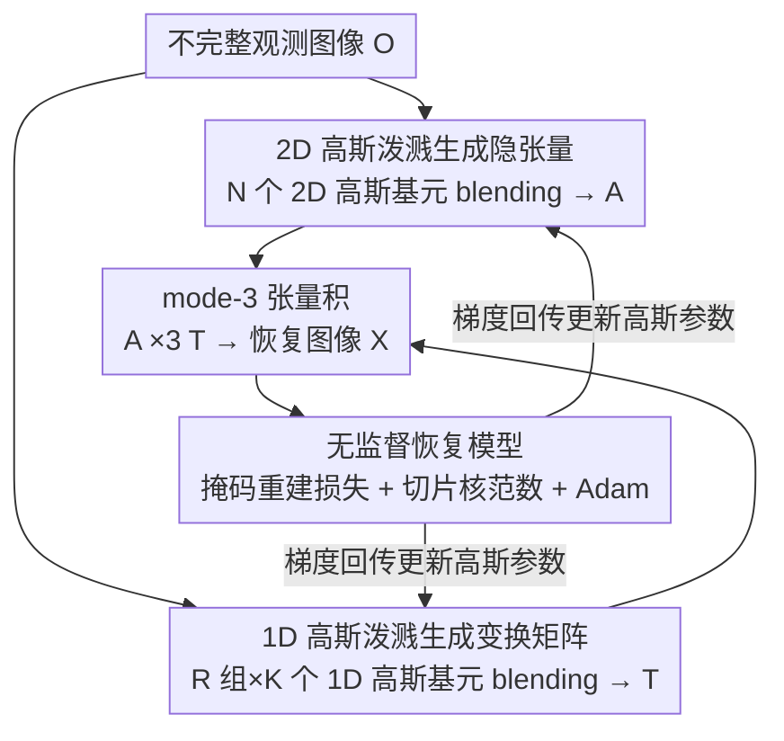

# Gaussian Splatting-based Low-Rank Tensor Representation for Multi-Dimensional Image Recovery

**会议**: CVPR 2026  
**论文**: [CVF Open Access](https://openaccess.thecvf.com/content/CVPR2026/html/Zeng_Gaussian_Splatting-based_Low-Rank_Tensor_Representation_for_Multi-Dimensional_Image_Recovery_CVPR_2026_paper.html)  
**代码**: 无（论文未提供）  
**领域**: 图像恢复 / 低秩张量表示  
**关键词**: 高斯泼溅, 低秩张量, t-SVD, 多维图像恢复, 高频信息  

## 一句话总结
把 3D 重建里的高斯泼溅搬进 t-SVD：用 2D 高斯泼溅生成隐张量、1D 高斯泼溅生成变换矩阵，得到一种连续、紧凑、擅长刻画局部高频细节的低秩张量表示 GSLR，并据此搭一个无监督的多维图像恢复模型，在随机/管状/切片三种缺失下的 PSNR/SSIM 全面超过 SOTA。

## 研究背景与动机
**领域现状**：多维图像（彩色图、多光谱图 MSI 等）天然存在强全局相关性，可以用低秩性来刻画。其中基于张量奇异值分解（t-SVD）的张量管秩（tubal-rank）因为代数性质漂亮而广受关注——t-SVD 把一个三阶张量分解成一个**隐张量** $\mathcal{A}$ 和一个**变换矩阵** $\mathbf{T}$，前者抓空间结构、后者抓 mode-3（光谱/通道方向）纤维上的信息。

**现有痛点**：t-SVD 这两个核心组件都有硬伤。其一，隐张量过去靠**张量分解**来近似（SVD、NMF、QR 分解等），表示能力有限，只能给出一个全局粗糙的逼近，抓不住空间局部高频信息（锐利边缘、细纹理）。其二，变换矩阵通常被限定为 DFT、DCT 这类**固定基原子**（复指数原子、余弦原子），无法精确刻画 mode-3 纤维上的局部高频，典型表现就是多光谱图里被打断的光谱曲线恢复不出来。

**核心矛盾**：后来有人用神经网络去隐式学这些基原子，但神经网络存在**谱偏置（spectral bias）**——优先学低频、对高频天生不友好，所以"用网络换固定基"并没有真正解决高频问题。问题的根本在于：t-SVD 的两个组件都缺一个**连续、紧凑、又能精确表达高频**的参数化方式。

**切入角度**：作者注意到 3D 重建里的**高斯泼溅（Gaussian Splatting）**正好具备这种能力——它把数据建模成一堆连续高斯基元的加权混合，是一种"非神经网络"的连续建模工具，既紧凑又能保住精细几何细节，且天生没有神经网络的谱偏置。但直接拿来建模多维图像不行：原生高斯泼溅完全忽略多维图像的低秩结构。

**核心 idea**：把高斯泼溅"裁剪"进 t-SVD 框架——用 **2D 高斯泼溅生成隐张量**、用 **1D 高斯泼溅生成变换矩阵**，两者不可或缺、互补，合起来就是 GSLR；再叠一个切片核范数低秩先验，让它既连续高频、又保住低秩结构。

## 方法详解

### 整体框架
GSLR 沿用 t-SVD 的分解骨架：把一张多维图像 $\mathcal{X}\in\mathbb{R}^{H\times W\times B}$ 写成隐张量 $\mathcal{A}\in\mathbb{R}^{H\times W\times R}$ 与变换矩阵 $\mathbf{T}\in\mathbb{R}^{B\times R}$ 的 mode-3 张量积：

$$\mathcal{X}=\mathcal{A}\times_3\mathbf{T}$$

不同的是，$\mathcal{A}$ 和 $\mathbf{T}$ 不再来自张量分解或固定变换，而是分别由**裁剪过的 2D 高斯泼溅**和**1D 高斯泼溅**"渲染"出来。整条恢复管线是无监督的：输入一张带缺失的观测图像 $\mathcal{O}$，把所有高斯基元的参数当作可学习变量，用 Adam 直接最小化"已观测像素的重建误差 + 隐张量切片核范数"，优化收敛后用 $\mathcal{A}\times_3\mathbf{T}$ 重建出完整图像。整个 blending（渲染）过程对参数完全可微，所以无需任何训练数据、单图自监督即可拟合。

### 关键设计

**1. 2D 高斯泼溅生成隐张量（2DGS-LT）：把空间局部高频写进连续高斯场**

针对"张量分解只能给隐张量一个粗糙全局近似、抓不住空间高频"的痛点，作者把隐张量参数化成一个**连续的 2D 高斯场**：场里有 $N$ 个 2D 高斯基元，每个基元由位置 $\mu\in\mathbb{R}^2$、协方差 $\Sigma\in\mathbb{R}^{2\times2}$、特征 $c\in\mathbb{R}^R$ 三组可学习参数定义（特征向量的维度 $R$ 正好等于隐张量的 mode-3 维度）。任意空间坐标 $(x,y)$ 处的隐张量值，由所有重叠高斯基元渲染（blending）叠加得到：

$$\mathcal{A}(x,y)=\sum_{j=1}^{N}c_j\cdot\exp\!\left(-\tfrac{1}{2}\big((x,y)^\top-\mu_j\big)^\top\Sigma_j^{-1}\big((x,y)^\top-\mu_j\big)\right)$$

每个 2D 基元有 $5+R$ 个参数（位置 2 + 协方差 3 + 特征 $R$），整组共 $N(5+R)$ 个。它之所以能抓高频：高斯基元的协方差可以学得很"尖"，从而在边缘、纹理这类局部位置堆叠出锐利响应，这是固定基或低秩分解给不出来的连续、自适应表达；同时它本质仍是有限个基元的紧凑表示，不会退化成逐像素自由参数那样过拟合。

**2. 1D 高斯泼溅生成变换矩阵（1DGS-TM）：让 mode-3 纤维上的高频也连续可表达**

针对"变换矩阵靠 DFT/DCT 固定基原子、抓不住 mode-3 纤维高频（如断裂的光谱曲线）"的痛点，作者把高斯泼溅裁剪到 1D，用它生成变换矩阵的每一列。具体地，变换矩阵 $\mathbf{T}$ 的 $R$ 列分别由 $R$ 个独立的**1D 高斯场**生成，每个场含 $K$ 个 1D 高斯基元，每个基元由位置 $\mu\in\mathbb{R}$、方差 $\sigma\in\mathbb{R}^+$、特征 $c\in\mathbb{R}$ 三个参数定义。第 $r$ 列在光谱坐标 $z$ 处的取值同样靠 blending：

$$\mathbf{T}(z,r)=\sum_{k=1}^{K}c_k^r\cdot\exp\!\left(-\frac{(z-\mu_k^r)^2}{2(\sigma_k^r)^2}\right)$$

总参数量 $3KR$。和 DFT/DCT 不同，这里的"基"不是预先钉死的解析函数，而是随数据优化的连续高斯混合；和用神经网络隐式学变换相比，它没有谱偏置，因此能精确还原沿 mode-3 方向的高频（光谱曲线的尖峰、突变）。2D 与 1D 两路在框架里**不可或缺且互补**：前者管空间维高频、后者管 mode-3 维高频，缺任一路表示能力都会塌。

**3. 无监督恢复模型与切片核范数低秩先验：把连续高频塞回低秩结构里**

光有连续高频表达还不够——原生高斯泼溅会忽略多维图像固有的低秩结构。作者据此搭了一个无监督恢复模型，目标函数是"已观测像素的掩码重建误差 + 隐张量逐切片的核范数"：

$$\min_{\theta_\mathcal{A},\theta_\mathbf{T}}\ \big\lVert\mathcal{M}\odot(\mathcal{O}-\mathcal{A}\times_3\mathbf{T})\big\rVert_F^2+\lambda\sum_{i=1}^{R}\big\lVert\mathbf{A}_{[i]}\big\rVert_*$$

其中 $\mathcal{M}$ 是观测位置为 1、缺失位置为 0 的二值掩码，$\odot$ 为逐元素乘，$\lambda$ 是权衡系数；约束部分就是 2DGS-LT 与 1DGS-TM 的渲染公式。第一项保证恢复结果在已观测处贴合输入，第二项对隐张量每个正面切片施加矩阵核范数，显式注入空间低秩先验，弥补高斯泼溅本身对结构的忽视。由于两路 blending 全程可微，作者直接用 Adam 优化所有高斯参数 $\theta_\mathcal{A},\theta_\mathbf{T}$（共 $N(5+R)+3KR$ 个），收敛后用 $\mathcal{X}=\mathcal{A}\times_3\mathbf{T}$ 输出。

> ⚠️ 作者还给出 Lemma 1 + Theorem 1：当 2D/1D 高斯基元数取到 $N=HW$、$K=B$ 且协方差/方差趋于 0、隐张量切片满足 SVD 形式、$\mathbf{T}$ 可逆时，GSLR 退化为经典 t-SVD。这说明 GSLR 是 t-SVD 的严格推广、表示能力更强，并非另起炉灶（详细证明在补充材料，⚠️ 以原文为准）。

## 实验关键数据

数据集为彩色图（512×512×3 / 256×256×3）与多光谱图 MSI（256×256×31 / ×80）。评测三种缺失模式：随机缺失（SR 0.02/0.05/0.10）、管状缺失（SR 0.10/0.15/0.20）、切片缺失（更难，只保留首尾各 5 个波段）。对比 6 个 SOTA：TNN、TRLRF、TCTV、HLRTF、LRTFR、FLRTF。指标 PSNR / SSIM。

### 主实验
随机缺失 SR=0.10 与切片缺失下，GSLR 在彩色图与 MSI 上均取得最高 PSNR/SSIM（节选代表数据）：

| 缺失模式 / 数据 | 指标 | GSLR | 次优 | 提升 |
|------|------|------|------|------|
| 随机缺失 SR=0.10 / 彩色图 | PSNR / SSIM | **25.423 / 0.747** | 24.416 / 0.705 (TCTV) | +1.01 dB |
| 随机缺失 SR=0.10 / MSI | PSNR / SSIM | **41.466 / 0.988** | 38.839 / 0.970 (HLRTF) | +2.63 dB |
| 管状缺失 SR=0.20 / MSI | PSNR / SSIM | **30.435 / 0.898** | 29.554 / 0.858 (TCTV) | +0.88 dB |
| 切片缺失 / Painting | PSNR / SSIM | **36.815 / 0.958** | 35.833 / 0.949 (FLRTF) | +0.98 dB |
| 切片缺失 / Hairs | PSNR / SSIM | **43.276 / 0.989** | 42.563 / 0.973 (FLRTF) | +0.71 dB |

即便在 SR=0.02 这种极低采样率下，GSLR 依然领先（如彩色图 21.684 dB vs 次优 LRTFR 19.195 dB）。切片缺失是最能体现 mode-3 高频能力的场景，依赖固定基的 TNN/TRLRF 在这里几乎崩掉（Painting 仅 16.217 / 19.954 dB），而 GSLR 全面最优，印证 1DGS-TM 对光谱方向高频的刻画力。

### 消融实验
作者把两路高斯泼溅分别替换成其他方案，在 Toy 数据上对比（PSNR / SSIM）：

| 消融对象 | 替换方案 | 随机 SR=0.10 | 切片缺失 | 说明 |
|------|------|------|------|------|
| 隐张量 (Tab.4) | 无约束参数化 | 36.875 / 0.963 | 28.123 / 0.823 | 自由参数化，无低秩约束 |
| 隐张量 (Tab.4) | 低秩分解 | 37.955 / 0.963 | 30.323 / 0.853 | HLRTF 式分解 |
| 隐张量 (Tab.4) | **2DGS-LT（本文）** | **43.630 / 0.995** | **34.201 / 0.943** | 2D 高斯泼溅最佳 |
| 变换矩阵 (Tab.5) | 无约束变换 | 38.692 / 0.985 | 11.067 / 0.224 | 离散，切片缺失下崩溃 |
| 变换矩阵 (Tab.5) | INR 隐式神经表示 | 39.330 / 0.973 | 26.637 / 0.786 | 连续但有谱偏置 |
| 变换矩阵 (Tab.5) | **1DGS-TM（本文）** | **43.630 / 0.995** | **34.201 / 0.943** | 1D 高斯泼溅最佳 |

额外地，作者还把整套 GSLR 和**原生 2D 高斯泼溅（2DGS）**对比（Tab.6）：Toy 随机 SR=0.10 下 GSLR 43.630 dB vs 2DGS 28.770 dB；且 2DGS 因为特征属性离散，**在切片缺失下完全失效**，而 GSLR 靠 1D 高斯泼溅补上了 mode-3 连续性。

### 关键发现
- **两路高斯泼溅缺一不可**：去掉 2DGS-LT（换低秩分解）随机 SR=0.10 掉约 5.7 dB；去掉 1DGS-TM 在切片缺失下从 34.2 dB 暴跌到 11.07 dB（无约束变换）或 26.6 dB（INR），说明 mode-3 连续表达对切片恢复是决定性的。
- **连续性是关键**：无约束/离散方案在切片缺失（mode-3 整片丢失）下基本崩盘，唯有连续表示（INR、1DGS-TM）能恢复，而 1DGS-TM 因无谱偏置又优于 INR。
- **低秩先验不可省**：相比原生 2DGS，GSLR 全面领先，差距源于 2DGS 忽略多维图像的低秩结构——这正是切片核范数项补上的部分。

## 亮点与洞察
- **把 3D 重建工具"降维"嫁接到低秩张量分解**：2D 高斯泼溅做空间隐张量、1D 高斯泼溅做光谱变换矩阵，是个很干净的拆分——空间维和 mode-3 维各用一套连续高斯场，互补且都规避了神经网络的谱偏置。这个"用高斯混合替代固定基/分解"的思路可迁移到其他依赖变换基的任务（如张量补全、压缩感知）。
- **退化定理给了理论安全感**：证明 GSLR 在极限参数下退化成经典 t-SVD，说明它是严格超集而非玄学魔改，表示能力下界有保障。
- **非神经、单图无监督**：整套方法不需要训练集，靠单张图上的可微 blending + Adam 拟合即可，对缺乏训练数据的遥感/医学/光谱场景很实用。

## 局限与展望
- **参数量与计算开销**：高斯基元数 $N$ 可达 $9\times10^4$ 量级，$N(5+R)+3KR$ 个参数全靠单图优化，推理即优化，速度/显存成本论文正文未充分讨论（⚠️ 细节在补充材料）。
- **超参敏感**：$N$、$K$、$R$、$\lambda$、学习率都要在较大区间内逐数据搜索（如 $R$ 在随机/管状缺失取 15–60、切片缺失取 100–300），实际部署需要不少调参成本。
- **仅验证三阶张量恢复任务**：方法形式上绑定 t-SVD 的三阶结构与 mode-3 语义，是否能推广到更高阶张量、或恢复以外的任务（去噪、超分、融合）尚未验证。

## 相关工作与启发
- **vs 经典 t-SVD（TNN/DFT、DCT 变换）**：它们用固定基原子构造变换矩阵、用张量分解近似隐张量，本文证明 GSLR 在极限条件下退化为它们，但常规条件下用连续高斯场获得更强的局部高频表达，切片缺失下优势尤其明显。
- **vs 基于神经网络的 t-SVD（HLRTF / LRTFR / FLRTF）**：它们用网络隐式学非线性基，但有谱偏置、偏向低频；GSLR 用非神经的高斯混合，天然能抓高频，消融中 1DGS-TM 全面优于 INR 变换。
- **vs 原生 2D 高斯泼溅（2DGS, Zhang et al.）**：原生 2DGS 只做 2D 图像表示、忽略低秩结构且特征离散，切片缺失下失效；GSLR 加上 1D 高斯泼溅 + 切片核范数低秩先验后，把它扩成可处理多维图像、可抗 mode-3 缺失的框架。

## 评分
- 新颖性: ⭐⭐⭐⭐⭐ 首次把高斯泼溅引入 t-SVD，2D/1D 双路分别生成隐张量与变换矩阵，并给出退化为经典 t-SVD 的理论
- 实验充分度: ⭐⭐⭐⭐ 三种缺失模式 + 6 个 SOTA + 充分消融（隐张量/变换/原生 2DGS 三组对照），但效率分析放在补充材料
- 写作质量: ⭐⭐⭐⭐ 痛点—机制—公式衔接清晰，两路设计互补关系讲得明白
- 价值: ⭐⭐⭐⭐ 为低秩张量表示提供了连续、非神经、抗高频丢失的新参数化，对遥感/光谱等无训练数据场景实用

<!-- RELATED:START -->

## 相关论文

- [\[CVPR 2026\] Low-Rank Residual Diffusion Models](low-rank_residual_diffusion_models.md)
- [\[CVPR 2026\] Multinex: Lightweight Low-light Image Enhancement via Multi-prior Retinex](multinex_lightweight_low-light_image_enhancement_via_multi-prior_retinex.md)
- [\[CVPR 2026\] BiProLoRA: Bilevel Prompt LoRA for Real Scene Recovery](biprolora_bilevel_prompt_lora_for_real_scene_recovery.md)
- [\[CVPR 2026\] Perceptual Neural Video Compression with Color Separation and Rank Chain](perceptual_neural_video_compression_with_color_separation_and_rank_chain.md)
- [\[CVPR 2026\] MAD-Avatar: Motion-Aware Animatable Gaussian Avatars Deblurring](motionaware_animatable_gaussian_avatars_deblurring.md)

<!-- RELATED:END -->
