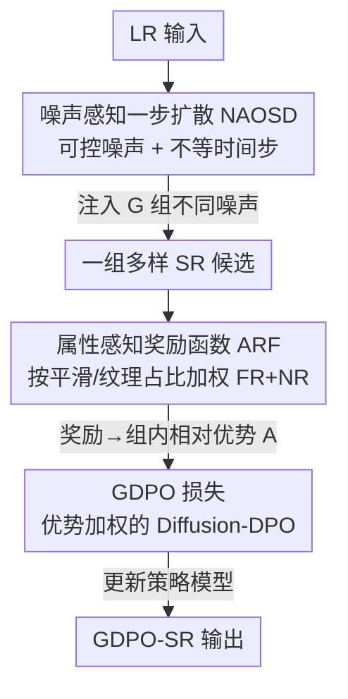

# GDPO-SR: Group Direct Preference Optimization for One-Step Generative Image Super-Resolution

**会议**: CVPR 2026  
**论文**: [CVF Open Access](https://openaccess.thecvf.com/content/CVPR2026/html/Yi_GDPO-SR_Group_Direct_Preference_Optimization_for_One-Step_Generative_Image_Super-Resolution_CVPR_2026_paper.html)  
**代码**: https://github.com/Joyies/GDPO  
**领域**: 图像恢复 / 真实场景超分辨率  
**关键词**: 一步扩散超分, 偏好优化, DPO, GRPO, 奖励函数  

## 一句话总结
针对一步扩散超分（one-step Real-ISR）确定性输出导致无法做偏好优化的问题，本文先用"可控噪声注入 + 不等时间步"让一步模型生成多样化候选，再把 DPO 的像素级约束与 GRPO 的组内相对优势融合成 GDPO，并配一个按图像平滑/纹理占比动态加权的奖励函数，在不增加任何推理开销的前提下同时提升保真度和感知质量。

## 研究背景与动机
**领域现状**：真实场景图像超分（Real-ISR）近年主流是借助预训练 T2I 扩散先验（SD/FLUX）。早期 StableSR、SeeSR、PASD 这类多步去噪方法画质好，但推理慢、易产生幻觉细节；为提速出现了 OSEDiff、InvSR 等一步扩散方法，直接把 LR 图当输入、单步出结果。

**现有痛点**：一步方法把 LR 到 HR 做成了**确定性映射**——同一个输入只能产出唯一输出，生成能力受限、细节被牺牲。而最近用强化学习（RL）对齐人类偏好的思路（DPO、GRPO）在多步 ISR 上已被 DP2O-SR 验证有效，自然的问题是：能不能把 RL 用到一步生成超分上？

**核心矛盾**：直接搬 DPO/GRPO 到一步模型有两道坎。其一，偏好优化要求策略模型对同一输入能产出**多样**输出，而一步模型是确定性的，根本生成不出可比较的正负样本。其二，两种 RL 算法各有短板：DPO 只用一对离线生成的正负样本，数据多样性受限；GRPO 虽在线生成一组样本算组内相对优势，但它只计算**整张图**的似然，忽略了对 ISR 至关重要的局部细节。

**本文目标**：(1) 让一步超分模型重新获得可控的输出多样性；(2) 设计一个既有 DPO 像素级精度、又有 GRPO 在线多样本效率的偏好优化算法；(3) 让奖励信号能区分一组候选的细微质量差异。

**核心 idea**：用"噪声可控注入"把一步模型变得有随机性（不同噪声→不同质量的候选），再用 **GDPO** 把 DPO 的像素级损失改写成由 GRPO 式组内相对优势加权的形式——一句话就是"用组内相对优势重新加权 Diffusion-DPO 损失"。

## 方法详解

### 整体框架
GDPO 的训练分两个核心阶段。先有一个能产出多样候选的基础模型 NAOSD（noise-aware one-step diffusion）：给定 LR 输入，注入不同随机噪声就能得到一组质量参差的超分候选。然后进入 GDPO 偏好优化——**优势计算阶段**用 ARF（attribute-aware reward function）给组内每个候选打分并转成组内相对优势 $A_i$；**策略优化阶段**把这些候选连同噪声喂给策略模型和冻结的参考模型，用 GDPO 损失把策略往高奖励候选的方向推。整个过程参考模型和策略模型都用预训练好的 NAOSD 初始化。

### 关键设计

**1. 噪声感知一步扩散 NAOSD + 不等时间步策略：给确定性一步模型注入可控多样性**

一步超分本来是确定性的，没有 RL 需要的"同输入多输出"。NAOSD 的做法是在隐空间注入可控高斯噪声：LR 经 VAE 编码得 $z_{LR}=E(I_{LR})$，再注噪得到扰动隐变量 $\tilde{z}=\sqrt{\alpha_{t_{add}}}\,z_{LR}+\sqrt{\beta_{t_{add}}}\,\epsilon$（$\epsilon\sim\mathcal{N}(0,I)$，$\alpha_{t_{add}}+\beta_{t_{add}}=1$），随后 UNet 在扩散时间步 $t_{diff}$ 上去噪得到 $z_{SR}=(\tilde{z}-\sqrt{\beta_{t_{diff}}}\,\text{UNet}(\tilde{z},c_t,t_{diff}))/\sqrt{\alpha_{t_{diff}}}$，最后 VAE 解码出超分图。语义引导 $c_t$ 由 DAPE 与 CLIP 文本编码器组合提取，VAE 编码器和 UNet 用 LoRA 微调。

关键在于**把注噪时间步 $t_{add}$ 和去噪时间步 $t_{diff}$ 解耦**。作者发现若让 $t_{add}=t_{diff}$ 并一起调大，生成能力上去了但保真度明显塌；于是用更大的 $t_{add}$ 扩张采样空间、用更保守的 $t_{diff}$ 稳住保真。作者还给了近似分析：在理想噪声预测假设（$\text{UNet}(\tilde{z},c_t,t_{diff})\approx\epsilon$）下，

$$z_{SR}\approx\frac{\sqrt{\alpha_{t_{add}}}}{\sqrt{\alpha_{t_{diff}}}}z_{LR}+\frac{\sqrt{\beta_{t_{add}}}-\sqrt{\beta_{t_{diff}}}}{\sqrt{\beta_{t_{diff}}}}\epsilon$$

说明只要 $t_{add}\ne t_{diff}$ 就会残留一个随机项 $\epsilon$，从而产生多样性——这正是后续 RL 优化所需的"多样候选"来源。

**2. 属性感知奖励函数 ARF：按图像内容动态平衡保真与感知**

要从一组候选里挑出谁更好，得有个能区分细微质量差异、且对不同内容公平的打分器。ARF 同时用全参考（FR）和无参考（NR）指标：FR 只取 PSNR（保真度衡量力强），NR 取 MANIQA 和 MUSIQ（常用感知质量评估）。难点是不同图像对保真/感知的偏好不同——建筑场景偏保真，花草树叶偏感知好看。ARF 因此**按平滑区与细节区的像素占比动态调权**：把图转灰度切成 $10\times10$ 的 patch，每块算 Sobel 梯度幅值直方图的 Shannon 熵来度量复杂度，据此把图分成平滑区 $\Omega_s$（低复杂度）和细节区 $\Omega_d$（高复杂度）。第 $i$ 个候选的奖励为

$$R_i=\rho_s\sum_{f\in G_{FR}}\frac{s_i^f}{|G_{FR}|}+\rho_d\sum_{f\in G_{NR}}\frac{s_i^f}{|G_{NR}|}$$

其中 $s_i^f$ 是指标 $f$ 经 min-max 归一化后的分数，$\rho_s=|\Omega_s|/(|\Omega_s|+|\Omega_d|)$、$\rho_d=|\Omega_d|/(|\Omega_s|+|\Omega_d|)$ 分别是平滑区与细节区的像素占比。直觉是：平滑区多就更看重保真（FR 权重大），细节区多就更看重感知（NR 权重大）。

**3. GDPO 损失：用组内相对优势重新加权 Diffusion-DPO**

这是把 DPO 和 GRPO 缝合的核心。先把 ARF 给出的绝对奖励 $R_i$ 转成组内相对优势（沿用 GRPO 的标准化）：$A_i=(R_i-\text{mean}(\{R_j\}))/\text{std}(\{R_j\})$，告诉模型组内谁更好谁更差。然后不像 DPO 只用一对样本，GDPO 用整组生成样本，把 Diffusion-DPO 损失改写为优势加权形式：

$$L_{GDPO}=-\mathbb{E}_{x_0\sim D,\,x_t\sim q(x_t|x_0)}\log\sigma\Big(-\omega\sum_{i=1}^{G}A_i\big(\|\epsilon-\pi_\theta(x_t,t)\|_2^2-\|\epsilon-\pi_{ref}(x_t,t)\|_2^2\big)\Big)$$

机制是：当某候选奖励高时 $A_i$ 变大、在 $\sum_i A_i(\cdot)$ 里权重更大，使 $-\omega\sum_i A_i(\cdot)$ 更趋于负、$\log\sigma(\cdot)$ 升高，梯度就优先把策略往这些高奖励候选靠。作者指出 **DPO 是 GDPO 在 $G=2$ 时的特例**。相比 GRPO 必须算全图似然，GDPO 继承了 Diffusion-DPO 的隐式似然计算 + 像素级约束，因此能更有效地学到局部细节——正好补上 GRPO"只看整图、忽略局部"的短板。

### 损失函数 / 训练策略
NAOSD 预训练用 $L_1$、LPIPS、VSD 三项组合：$L_{onestep}=L_1(I_{SR},I_{HR})+\lambda_1 L_{LPIPS}+\lambda_2 L_{VSD}$（$\lambda_1=2,\lambda_2=1$）。GDPO 微调阶段用上面的 $L_{GDPO}$，组大小 $G=6$，偏好权重 $\omega=5000$，LoRA rank 4，学习率 $5\times10^{-5}$，训练 1500 iters（8×A100）。

## 实验关键数据

### 主实验
基线 SD2.1-base，对比多步方法（StableSR/DiffBIR/SeeSR/PASD）和一步方法（OSEDiff/InvSR）。下表为与 SOTA 在三个数据集上的对比节选（红=最优，蓝=次优）：

| 数据集 | 方法 | PSNR↑ | LPIPS↓ | DISTS↓ | MANIQA↑ | MUSIQ↑ |
|--------|------|-------|--------|--------|---------|--------|
| DRealSR | SeeSR | 28.07 | 0.3174 | 0.2315 | 0.6054 | 65.08 |
| DRealSR | OSEDiff | 27.92 | 0.2968 | 0.2165 | 0.5899 | 64.65 |
| DRealSR | **GDPO-SR** | **28.18** | **0.2851** | **0.2112** | 0.6180 | **65.63** |
| RealSR | OSEDiff | 25.15 | 0.2921 | 0.2128 | 0.6326 | 69.09 |
| RealSR | InvSR | 24.30 | 0.2775 | 0.2060 | 0.6561 | 67.31 |
| RealSR | **GDPO-SR** | **25.48** | **0.2675** | **0.1980** | 0.6615 | 69.42 |

GDPO-SR 在三个数据集上 PSNR / LPIPS / DISTS 全部取得最优，FR 指标领先尤为明显，NR 指标也保持整体领先。相比基础模型 NAOSD（同噪声输入），GDPO-SR 在 RealSR 上 PSNR 25.25→25.48、MANIQA 0.6459→0.6615、MUSIQ 69.06→69.42，ARF 涉及的指标全部提升。

效率上（处理 100 张 512×512 图均时）GDPO-SR 与 OSEDiff 完全一致（0.11s / 2.27T FLOPs / 1.77B 参数），**噪声注入和 GDPO 不带来任何推理开销**；比 InvSR 更快（0.11s vs 0.12s）且 FLOPs 更小。

与多步 RL 方法 DP2O-SR 比，DP2O-SR 的 NR 指标更高但 FR 指标差很多（RealSR PSNR 仅 22.39 vs GDPO-SR 25.48），说明它以牺牲保真换生成力；GDPO-SR 作为一步模型在保真和感知间更平衡。

### 消融实验

GDPO 策略消融（RealSR，对比其他 RL 算法）：

| 方法 | PSNR↑ | FID↓ | DISTS↓ | MUSIQ↑ | 说明 |
|------|-------|------|--------|--------|------|
| NAOSD | 25.25 | 114.91 | 0.2001 | 69.06 | 基础模型 |
| Diffusion-DPO | 25.41 | 112.87 | 0.2010 | 69.16 | 只用一对离线样本 |
| DanceGRPO | 25.10 | 113.74 | 0.2049 | 69.95 | 全图似然，NR↑但FR↓ |
| **GDPO (ours)** | **25.48** | **112.13** | **0.1980** | 69.42 | 保真感知双赢 |

ARF 组件消融（RealSR）：

| 配置 | LPIPS↓ | DISTS↓ | MUSIQ↑ | CLIPIQA↑ | 说明 |
|------|--------|--------|--------|----------|------|
| NAOSD | 0.2689 | 0.2001 | 69.06 | 0.6617 | 基础模型 |
| ARF w/ FR | 0.2642 | 0.1978 | 67.68 | 0.6359 | 只用FR，NR掉 |
| ARF w/ NR | 0.2866 | 0.2102 | 69.80 | 0.6914 | 只用NR，保真掉 |
| ARF w/o AW | 0.2660 | 0.1979 | 68.42 | 0.6331 | 去掉自适应权重(ρ固定0.5) |
| **ARF (ours)** | 0.2675 | 0.1980 | 69.42 | 0.6760 | 动态加权最均衡 |

### 关键发现
- **GDPO 的价值在"局部 + 平衡"**：DanceGRPO（全图似然）能提 NR 但保真塌，说明全局似然抓不住局部分布；GDPO 的像素级约束让它在 FR 和 NR 上都不掉，是三种 RL 里唯一两头都好的。
- **单一指标奖励不够**：只用 FR 会让 NR 明显下降，只用 NR 会让保真下降——必须 FR+NR 联合才能全面评估重建质量。
- **自适应权重确实有用**：把 $\rho_s,\rho_d$ 固定成 0.5（w/o AW）后所有指标都变次优，证明统一权重抓不住图像内容的空间差异。
- **零推理开销**：可控噪声 + GDPO 只发生在训练阶段，推理时与 OSEDiff 同等成本，这是一步方法做 RL 的实用性关键。

## 亮点与洞察
- **把"一步模型确定性"这个障碍转成可调旋钮**：用 $t_{add}\ne t_{diff}$ 的不等时间步既造出多样性、又不塌保真，且给了残差噪声项的近似推导支撑，比单纯加噪更可控。
- **GDPO 是 DPO 与 GRPO 的最小公倍数**：把 GRPO 的组内相对优势 $A_i$ 直接塞进 Diffusion-DPO 的像素级损失里当权重，$G=2$ 即退化回 DPO，形式优雅且即插即用；这个"用相对优势加权偏好损失"的思路可迁移到其他扩散偏好优化任务。
- **内容自适应奖励**：用 Sobel 梯度 + Shannon 熵切平滑/纹理区来动态配 FR/NR 权重，比固定权重更贴合"建筑要保真、花草要好看"的直觉，是个可复用的奖励设计 trick。

## 局限与展望
- 作者承认：GDPO 训练时每个输入要在线生成多个候选（$G=6$），相比 DPO 增加了训练开销。
- ARF 仍是**手工设计的启发式奖励**，怎样设计更贴合人眼感知的奖励仍待研究。
- ⚠️ 自己观察：ARF 只用 PSNR 当 FR、MANIQA+MUSIQ 当 NR，奖励信号本身就被这几个指标"圈定"，可能存在对这些指标过拟合的风险（论文也用蓝/黄底色区分了"奖励内/外指标"，在 DIV2K-val 上 SSIM/LPIPS/FID/DISTS 等奖励外指标并未全面超过 NAOSD，印证了这一点）。
- ⚠️ 不等时间步的 $t_{add},t_{diff}$ 具体取值、ARF 中三个指标的相对量纲对齐细节正文未充分展开，复现需参考代码。

## 相关工作与启发
- **vs DPO / Diffusion-DPO**：DPO 只用一对离线正负样本，数据多样性受限；GDPO 用整组在线样本 + 相对优势，DPO 是其 $G=2$ 特例，样本效率和优化平衡都更好。
- **vs GRPO / DanceGRPO / Flow-GRPO**：GRPO 系算整图似然、忽略局部细节，对超分这种重局部纹理的任务伤保真；GDPO 借 Diffusion-DPO 的隐式似然 + 像素级约束更好地学局部。
- **vs DP2O-SR**：DP2O-SR 是把 Diffusion-DPO 用到**多步** Real-ISR，靠离线配对数据、偏感知而损保真；GDPO-SR 是**一步**模型，在线生成、保真与感知更平衡，且推理成本远低。
- **vs OSEDiff / InvSR**：同为一步扩散，但它们是确定性映射、生成力受限；GDPO-SR 在等同推理成本下用 RL 偏好优化把质量进一步推高。

## 评分
- 新颖性: ⭐⭐⭐⭐ 首次把 RL 偏好优化引入一步生成超分，GDPO 巧妙融合 DPO 像素级约束与 GRPO 组内优势
- 实验充分度: ⭐⭐⭐⭐ 三数据集 + 多 SOTA 对比 + GDPO/ARF 双消融 + 效率分析，覆盖全面
- 写作质量: ⭐⭐⭐⭐ 动机层层递进，公式与近似分析清楚，框架图直观
- 价值: ⭐⭐⭐⭐ 零推理开销提升一步超分质量，方法可迁移到其他扩散偏好优化任务

<!-- RELATED:START -->

## 相关论文

- [\[NeurIPS 2025\] DP²O-SR: Direct Perceptual Preference Optimization for Real-World Image Super-Resolution](../../NeurIPS2025/image_restoration/dp2o-sr_direct_perceptual_preference_optimization_for_real-world_image_super-res.md)
- [\[CVPR 2026\] ExpoCM: Exposure-Aware One-Step Generative Single-Image HDR Reconstruction](expocm_exposure-aware_one-step_generative_single-image_hdr_reconstruction.md)
- [\[CVPR 2026\] PS-SR: Pseudo-Single-Step Video Super-Resolution via Speculative Diffusion](ps-sr_pseudo-single-step_video_super-resolution_via_speculative_diffusion.md)
- [\[CVPR 2026\] Bridging Fidelity-Reality with Controllable One-Step Diffusion for Image Super-Resolution](bridging_fidelity-reality_with_controllable_one-step_diffusion_for_image_super-r.md)
- [\[CVPR 2026\] One-Step Diffusion Transformer for Controllable Real-World Image Super-Resolution](one-step_diffusion_transformer_for_controllable_real-world_image_super-resolutio.md)

<!-- RELATED:END -->
