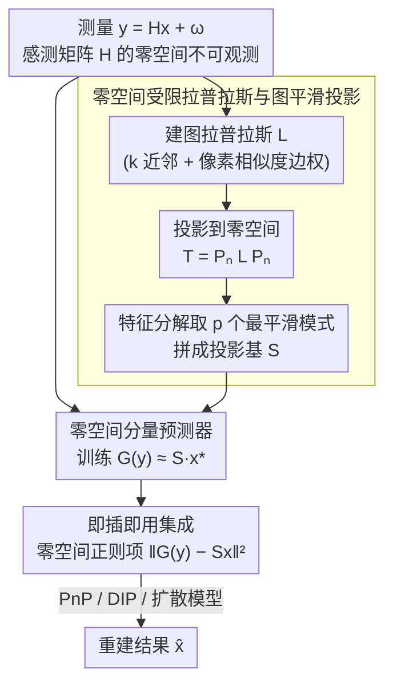

# GSNR: Graph Smooth Null-Space Representation for Inverse Problems

**会议**: CVPR 2026  
**arXiv**: [2602.20328](https://arxiv.org/abs/2602.20328)  
**代码**: 无  
**领域**: 图像修复 / 逆问题  
**关键词**: 逆问题, 零空间表示, 图平滑, 谱图理论, 即插即用

## 一句话总结

提出图平滑零空间表示（GSNR），通过谱图理论构建零空间受限拉普拉斯矩阵并选择最平滑的 p 个谱模式作为零空间投影基，为 PnP、DIP 和扩散模型等逆问题求解器提供结构化的零空间约束，在去模糊、压缩感知、去马赛克和超分辨率上提升高达 4.3dB PSNR。

## 研究背景与动机

成像逆问题的核心挑战在于**零空间（Null Space）的不适定性**：对于欠定系统 $y = Hx^* + \omega$，感测矩阵 $H$ 的零空间中存在无穷多个与测量一致的解。任何信号 $x$ 都可以分解为值域分量 $x_r = P_r x$（可观测）和零空间分量 $x_n = P_n x$（不可观测）。

现有方法存在两类问题：(1) 通用先验（如 PnP 去噪器、扩散模型的分数函数）在整个图像空间操作，不区分可观测和不可观测分量——去噪器可能自由修改零空间分量导致偏差和幻觉；(2) 已有零空间方法（如 NSN、NPN）尝试在零空间中学习低维投影，但**盲目学习任意零空间子空间**可能浪费容量并引入偏差——它们不知道哪些零空间方向是"有意义的"。

核心洞察：**自然图像在零空间中不是均匀分布的——它们占据一个低维、结构化的子集。** 受图像的图（graph）平滑表示启发，可以利用谱图理论选择**最平滑的零空间方向**作为投影基——这些方向既容易从测量中预测，又能高效覆盖零空间的自然图像变化。

## 方法详解

### 整体框架

GSNR 要解决的是：逆问题 $y = Hx + \omega$ 里，感测矩阵 $H$ 的零空间不可观测，通用先验在那里乱改会带来偏差和幻觉，而盲学零空间子空间又浪费容量。它的思路是先用谱图理论把零空间里"值得保留"的方向挑出来，再训一个小预测器从测量里把这些方向的取值估出来，最后作为一个正则项挂到任意求解器上。具体来说：给定图拉普拉斯矩阵 $L$，先把它投影进零空间得到受限拉普拉斯 $T = P_n L P_n$，对 $T$ 做特征分解、取 $p$ 个最小特征值对应的特征向量拼成投影矩阵 $S \in \mathbb{R}^{p \times n}$；训练预测器 $G(y) \approx Sx^*$ 估出零空间的低维表示；重建时把 $\|G(y) - Sx\|^2$ 当作正则项加进 PnP、DIP 或扩散模型的目标函数。整条链路里只有 $G$ 需要训练，$S$ 由问题结构直接算出。

### 关键设计

**1. 零空间受限拉普拉斯与图平滑投影：有原则地挑出最有信息量的零空间方向**

已有零空间方法（NSN、NPN）盲学任意子空间，不知道哪些方向真有意义，于是容量被浪费、偏差被引入。GSNR 改成从图的频率结构里挑方向：先在像素网格上建图拉普拉斯 $L$（4 或 8 最近邻，边权编码局部像素相似度），再投影到零空间得到 $T = P_n L P_n$。对 $T$ 做特征分解，特征值天然给出零空间内部的频率排序——最小特征值对应最平滑（低频）的零空间模式，取前 $p$ 个最平滑模式就构成投影基 $S$。

之所以挑"最平滑"而不是任意方向，是因为自然图像在空间上本就平滑，它们的零空间分量也应优先落在平滑模式上；论文用 Theorem 1&2 证明这些图平滑模式在很小的 $p$ 下就能达到高覆盖率，即少量模式就能解释零空间里大部分的自然图像方差，这正是"高覆盖"指标。

**2. 零空间分量预测器：把挑出来的方向真正从测量里估出来**

光有一组好方向还不够，还得知道每个方向上的取值——这一步由网络 $G$ 完成，用 L2 拟合 $p$ 维零空间系数 $G(y) \approx Sx^*$。这里图平滑的选择第二次发挥作用：Proposition 1 证明图平滑的零空间分量比一般零空间基更容易从测量中预测，因为平滑模式和值域空间相关性更强。于是 GSNR 在零空间表示的两个关键指标上同时占优——覆盖率（coverage，小 $p$ 即可覆盖大方差，来自设计 1）和可预测性（predictability，平滑方向好估，来自这里），而旧方法往往只能顾一头。

**3. 即插即用集成：只约束传感器盲区，与现有先验互补**

PnP / DIP / 扩散模型这些通用先验作用在整张图像上，会和数据保真项打架；GSNR 把惩罚 $\|G(y) - Sx\|^2$ 只施加在零空间分量上，等于只在传感器看不见的方向上加结构约束，因此和现有先验是互补而非冲突。集成方式随求解器而变：对 PnP，在近端梯度下降的数据保真步里加这一项零空间惩罚；对 DIP，作为隐式正则；对扩散模型，作为后验采样的零空间引导。

### 损失函数 / 训练策略

预测器 $G$ 用 L2 损失训练 $\min_G \mathbb{E}\|G(y) - Sx^*\|^2$，投影矩阵 $S$ 由零空间受限拉普拉斯 $T$ 的特征分解直接得到、无需学习。重建阶段，零空间正则项的权重 $\eta$ 需要调优。

## 实验关键数据

### 主实验

**图像去模糊**

| 方法 | PSNR↑ | 提升 | 说明 |
|------|-------|------|------|
| PnP 基线 | X dB | - | 无零空间约束 |
| PnP + GSNR | X+Y dB | **+最高 4.3dB** | 显著提升 |
| 端到端学习模型 | Z dB | - | 有监督训练 |
| PnP + GSNR | Z+1 dB | **+最高 1dB** | 超越端到端模型 |

**跨任务一致性**

| 任务 | PnP 提升 | DIP 提升 | Diffusion 提升 |
|------|---------|---------|--------------|
| 去模糊 | 显著 | 显著 | 显著 |
| 压缩感知 | 显著 | 显著 | 显著 |
| 去马赛克 | 显著 | 显著 | 显著 |
| 超分辨率 | 显著 | 显著 | 显著 |

### 消融实验

| 配置 | PSNR | 说明 |
|------|------|------|
| 无零空间约束 | 基线 | 标准 PnP/DIP/Diffusion |
| 随机零空间基 (NPN) | +小幅 | 覆盖率低 |
| **GSNR (图平滑基)** | **+最大** | 高覆盖+高可预测性 |

### 关键发现

- GSNR 在四个任务 × 三个求解器上一致带来提升，证明零空间结构化约束的普适价值
- 图平滑基比随机学习基在小 p 下覆盖率更高——30% 的模式可捕获 80%+ 的零空间方差
- 覆盖率/可预测性曲线可作为选择 p 值的操作性诊断工具
- 零空间正则项减少了幻觉——去噪器不再自由修改不可观测分量

## 亮点与洞察

- **"仅约束看不见的部分"** 是优雅的设计哲学：现有先验约束整个图像可能与数据保真项冲突，GSNR 只在传感器盲区施加结构
- **谱图理论提供了有原则的方向选择**：不需要学习投影矩阵，直接从问题结构中推导，理论清晰
- **覆盖率/可预测性诊断曲线** 是实用的工具：让正则化强度的选择从"调参"变为"客观评估"

## 局限与展望

- 图拉普拉斯的构建需要邻域像素相似度估计，对严重退化图像可能不准确
- 零空间特征分解的计算开销在高分辨率图像上可能很高
- 预测器 $G$ 的泛化性依赖于训练数据的多样性
- 理论分析假设了线性传感矩阵，对非线性前向模型的适用性需验证

## 相关工作与启发

- **vs NPN**: 同样学习零空间投影，但盲目学习任意方向；GSNR 用图平滑提供有原则的方向选择
- **vs PnP/RED**: 在整个图像空间操作，不区分可观测和不可观测分量
- **vs 全变差（TV）**: 对整个图像施加平滑性，可能过度平滑；GSNR 仅对零空间施加平滑

## 评分

- 新颖性: ⭐⭐⭐⭐⭐ 首次将图平滑引入零空间表示，理论贡献扎实（三个定理/命题）
- 实验充分度: ⭐⭐⭐⭐⭐ 四个任务 × 三个求解器的全面验证，理论与实验紧密对应
- 写作质量: ⭐⭐⭐⭐⭐ 数学推导严谨，动机和直觉解释清晰
- 价值: ⭐⭐⭐⭐⭐ 为逆问题提供了通用的、即插即用的零空间正则化框架

<!-- RELATED:START -->

## 相关论文

- [\[CVPR 2026\] Variational Garrote for Sparse Inverse Problems](variational_garrote_for_sparse_inverse_problems.md)
- [\[CVPR 2026\] PnP-CM: Consistency Models as Plug-and-Play Priors for Inverse Problems](pnp-cm_consistency_models_as_plug-and-play_priors_for_inverse_problems.md)
- [\[CVPR 2026\] Outlier-Robust Diffusion Solvers for Inverse Problems](outlier-robust_diffusion_solvers_for_inverse_problems.md)
- [\[CVPR 2026\] Time Without Time: Pseudo-Temporal Representation for Space-Time Super-Resolution](time_without_time_pseudo-temporal_representation_for_space-time_super-resolution.md)
- [\[ICML 2026\] Learning Normalized Energy Models for Linear Inverse Problems](../../ICML2026/image_restoration/learning_normalized_energy_models_for_linear_inverse_problems.md)

<!-- RELATED:END -->
