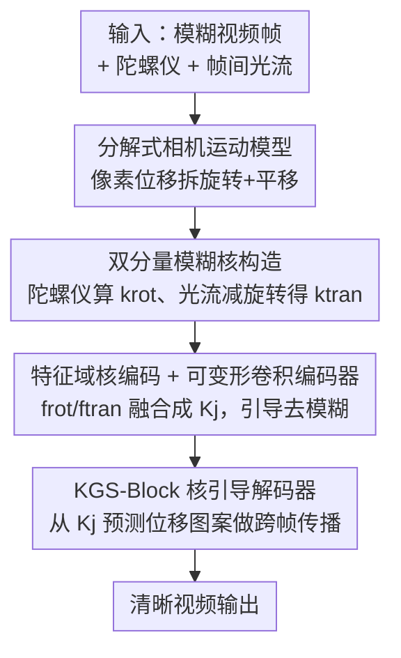

# Gyro-based Deep Video Deblurring

**会议**: CVPR 2026  
**论文**: [CVF Open Access](https://openaccess.thecvf.com/content/CVPR2026/html/Rim_Gyro-based_Deep_Video_Deblurring_CVPR_2026_paper.html)  
**代码**: http://cg.postech.ac.kr/research/GyroDVD （项目页，代码待确认）  
**领域**: 视频复原 / 视频去模糊  
**关键词**: 陀螺仪去模糊, 视频去模糊, 模糊核构造, 平移运动, 可变形卷积

## 一句话总结
GyroDVD 是第一个面向「陀螺仪辅助视频去模糊」的学习式框架：它用一个分解式相机运动模型把每个像素的运动拆成旋转（陀螺仪测）和平移（光流估）两部分，据此构造逐像素模糊核，再用核引导的图像编码器 + 视频解码器把模糊视频还原成清晰视频，在自建的大规模真实数据集 GyroVD 上显著超过此前所有陀螺仪图像/视频去模糊方法。

## 研究背景与动机
**领域现状**：智能手机、单反相机都内置了陀螺仪（gyro sensor），能以很高的帧率（如 400 FPS）几乎零成本地记录相机的旋转运动，这对去运动模糊是宝贵的先验。已有不少陀螺仪去模糊工作，但绝大多数集中在**单图去模糊**：从陀螺仪数据估出一个模糊核，再把它作为额外输入喂给网络（拼接、可变形卷积、注意力等）去复原清晰图。

**现有痛点**：陀螺仪路线有两个根深蒂固的缺陷。第一，**陀螺仪只测旋转、测不到平移**——而拍视频时摄影师常常边走边拍，前进/横移这种平移运动对模糊的贡献非常显著，忽略它会让模糊核与真实模糊对不上。第二，少数几个做陀螺仪**视频**去模糊的方法（Park et al.、Arslan et al.）依赖**简化的模糊模型 + 精确对齐 + 反卷积（deconvolution）**求解，模型假设苛刻、性能受限，而且同样无视平移。另一条想补平移的路线用加速度计估核，但需要场景深度和重力方向、还假设曝光起始时相机静止，现实中都不成立。

**核心矛盾**：要把平移补回来，最直接的信号是帧间光流——但光流把旋转和平移**纠缠**在一起，直接用会把旋转又算进去一遍。如何从光流里**干净地剥离出平移分量**，是把陀螺仪去模糊从「只有旋转」推进到「旋转+平移」的关键瓶颈。此外，整个陀螺仪视频去模糊连一个真实的大规模训练集都没有，现有数据集要么是图像级、要么合成的模糊只含旋转，realism 不足。

**本文目标**：(1) 建一个能同时刻画旋转和平移的逐像素运动/模糊核模型；(2) 设计一个能有效利用模糊核的视频去模糊网络；(3) 造一个真实、大规模、带陀螺仪的视频去模糊数据集。

**核心 idea**：用一个**分解式运动模型**把像素位移近似拆成「旋转项（陀螺仪直接给）+ 平移项（从光流里减掉旋转后剩下的）」，据此构造逐像素模糊核，并让这个核同时引导**去模糊**和**跨帧特征传播**。

## 方法详解

### 整体框架
GyroDVD 的输入是一段模糊视频 $\{I_j\}$ 加上同步采集的陀螺仪数据，输出是对应的清晰视频。整条管线分两大块：**模糊核构造**（把陀螺仪 + 光流变成逐像素模糊核）和 **GyroDVD 网络**（用模糊核引导一个 encoder–decoder 去模糊）。先用分解式运动模型把每像素位移拆成旋转/平移；旋转分量 $\mathbf{k}^{\text{rot}}$ 由陀螺仪角速度累积而来，平移分量 $\mathbf{k}^{\text{tran}}$ 由光流减去旋转后估得，两者合成完整模糊核。网络侧不在像素域硬合并这两个核，而是各自编码后在**特征域**融合成核特征 $\mathbf{K}_j$；图像编码器用以 $\mathbf{K}_j$ 算偏移的可变形卷积逐帧去模糊，视频解码器则用从 $\mathbf{K}_j$ 预测出的位移图案做跨帧传播，最后重建出清晰帧。

### 关键设计

**1. 分解式相机运动模型：把每个像素的位移拆成「旋转能测、平移可估」两项**

刚体相机运动可用旋转矩阵 $R$ 和平移向量 $t$ 描述，像素 $p$ 在投影模型下被 warp 到 $p' = \pi\!\left(C\left(R C^{-1}p_H + \frac{1}{d}t\right)\right)$（式 1），其中 $C$ 是内参、$d$ 是深度。问题是：直接用式 1 算模糊轨迹要同时知道平移 $t$ 和深度 $d$，而陀螺仪只给旋转、深度又难拿到，根本算不出来。

作者对式 1 的投影函数 $\pi$ 做一阶 Taylor 展开，把旋转和平移**解耦**成相加的两项：$p'_i \approx \pi(C R_i C^{-1} p_H) + \tau_i$，其中平移项 $\tau_i = \frac{1}{d} J C t_i$（$J$ 是 $\pi$ 的 Jacobian）。再假设在一帧短曝光内平移速度和深度近似恒定，得到最终的分解式运动模型：

$$p'_i \approx \pi\!\left(C R_i C^{-1} p_H\right) + \frac{t_i - t_s}{t_e - t_s}\,\tau$$

这里 $\tau$ 是整个曝光区间 $(t_s, t_e)$ 的累积平移向量，第 $t_i$ 时刻的平移按时间线性分配。这个分解的妙处在于：旋转项里只剩 $R_i$（陀螺仪能直接给），平移项被压缩成一个**与深度无关的待估向量 $\tau$**——不再需要逐像素深度，只要从光流里把 $\tau$ 估出来即可，把一个原本欠定的问题变成可解的。

**2. 双分量逐像素模糊核构造：陀螺仪给旋转、光流减旋转给平移，再合成**

旋转分量直接来自陀螺仪：在曝光区间内拿到角速度测量 $\{\omega_k\}$，用指数映射累积成累计旋转 $R_i = \prod_{k:\tilde t_k \le t_i} \exp([\omega_k]_\times \Delta\tilde t_k)$（式 4，$[\cdot]_\times$ 是反对称矩阵）。把 $R_i$ 代入运动模型并令 $\tau=0$，对每个像素算出旋转引起的位移轨迹 $\mathbf{k}^{\text{rot}} = \{d^{\text{rot}}_i\}$，$d^{\text{rot}}_i = p'_i - p$（式 5）。

平移分量是本设计的关键：从当前帧 $I$ 到下一帧 $I'$ 算光流 $f$，但光流同时含旋转和平移。作者先按式 4 累积出帧间旋转 $R$，再从光流里**把旋转那部分减掉**，得到纯平移向量

$$\tau = \frac{t_e - t_s}{\delta}\left(p'_f - \pi(C R C^{-1} p_H)\right)$$

（式 6，$p'_f = p + f$ 是光流指向的位置，$\delta$ 是两帧时间中心间隔）。把 $\tau$ 按时间分配到各采样点得到 $\mathbf{k}^{\text{tran}}$（式 7），最终模糊核 $\mathbf{k} = \mathbf{k}^{\text{rot}} + \mathbf{k}^{\text{tran}}$（式 8）。论文用可视化（图 1）说明：单看旋转或单看平移都和真实模糊对不上，二者相加才贴合实际轨迹。由于光流是从**模糊帧**上估的、可能出错，作者还从光流算一致性掩码（consistency mask），对不可靠区域丢弃 $\mathbf{k}^{\text{tran}}$、改用最近邻的平移分量，增强鲁棒性。

**3. 特征域模糊核编码 + 可变形卷积图像编码器：让网络区分两种核的不同误差特性**

一个直觉做法是按式 8 在**像素域**把 $\mathbf{k}^{\text{rot}}$ 和 $\mathbf{k}^{\text{tran}}$ 直接相加再喂网络。但作者指出：旋转核（来自陀螺仪，较准）和平移核（来自光流，噪声大）**误差特性完全不同**，像素域硬加会让光流的误差污染整个核、拉低质量。于是改为**各自用独立编码层、在特征域融合**：$\mathbf{K}_j = f_{\text{rot}}(\mathbf{k}^{\text{rot}}_j) + f_{\text{tran}}(\mathbf{k}^{\text{tran}}_j)$（式 9），让网络学到 modality-specific 表征、保留互补信息。消融显示特征域融合比像素域融合高约 0.1 dB PSNR。

得到核特征 $\mathbf{K}_j$ 后，图像编码器先抽取初始图像特征，再用一层**调制可变形卷积**（modulated deformable conv）逐帧去模糊——其 offset 和 mask 都由 $\mathbf{K}_j$ 算出，相当于让模糊核去"指挥"采样点往哪偏，精准对齐被模糊拖散的内容。可变形卷积算力贵，所以只放在图像编码器、不铺到整个视频处理流程，是精度与效率的折中。

**4. KGS-Block：把固定的空间位移图案换成「模糊核自适应」的可学习传播**

视频解码器沿用 ShiftNet 的思路——用时间/空间 shift 操作高效地在相邻帧间传播特征：每帧特征图沿通道劈两半，一半传给邻帧、一半留本地，传播的那半再按**固定**空间图案做位移以增强时序聚合。问题是固定图案完全不知道模糊核信息。

作者提出 **KGS-Block（Kernel-Guided Shift Block）**，把固定图案换成**由模糊核特征预测的可学习图案**。具体：把去模糊特征 $F_j$ 沿通道劈成 $F^a_j, F^b_j$，再把 $F^a_j$ 分成 $L$ 组，每组按从 $\mathbf{K}_j$（经两层卷积）预测出的位移 $[s^x_{j,l}, s^y_{j,l}]$ 做 warp：$F^{\text{shift}}_{j,l} = \text{Warp}(F^a_{j,l}, [s^x_{j,l}, s^y_{j,l}])$（式 10）。移位后的组拼接传给下一帧，再与本帧特征通过通道注意力块融合：$F^{\text{dec}}_j = \text{CABs}(\text{Cat}(F^b_j, F^a_{j-1}, F^{\text{shift}}_{j-1}))$（式 11）。前向/后向 KGS-Block 交替堆叠实现双向解码。因为只需少量额外参数去预测位移图案，KGS-Block 几乎不增算力却能让传播"顺着模糊轨迹走"。消融里一个反直觉的发现：在解码器里"天真地"用模糊核（如 Shift+Cat K、Shift+KGC）反而会掉点，说明必须像 KGS-Block 这样精心设计才能用好核。

### 损失函数 / 训练策略
用 AdamW 优化器 + $\ell_1$ 损失训练，初始学习率 4e−4、cosine annealing 衰减到 1e−7，共 600K 次迭代，batch size 4、每个 batch 含 13 帧连续视频，训练 patch 256×256，加水平/垂直翻转增强。模糊核时间采样数 $N=8$，解码器通道组数 $L=8$，光流用 RAFT-small 估计。

## 实验关键数据

### 主实验
数据集为自建 GyroVD：合成子集 GyroVD-Syn 用手机 App 同步采 240 FPS 高速视频 + 400 FPS 陀螺仪，平均连续帧合成模糊（632 视频 / 63,200 帧，按 505/50/77 划分训练/验证/测试，测试集再按模糊幅度分 small/medium/large）；真实子集 GyroVD-Real 含 100 段夜间/室内真实模糊视频（无 GT，用无参考指标评）。GyroVD 是目前最大、最真实的陀螺仪去模糊数据集。

GyroVD-Syn 上 PSNR/SSIM 对比（节选，↑越高越好）：

| 方法 | 类型 | Small PSNR | Large PSNR | Avg PSNR/SSIM | Param(M) |
|------|------|-----------|-----------|---------------|----------|
| GyroDeblur [60] | 陀螺仪图像 | 34.22 | 30.48 | 32.34 / 0.8458 | 16.31 |
| DSTNet [39] | 视频 | 35.77 | 31.75 | 33.86 / 0.8810 | 7.45 |
| ShiftNet [25] | 视频 | 36.16 | 32.46 | 34.37 / 0.8865 | 4.70 |
| RVRT [28] | 视频 | 36.52 | 32.85 | 34.82 / 0.8957 | 13.57 |
| ShiftNet+ [25] | 视频(大) | 36.97 | 33.51 | 35.31 / 0.9023 | 12.99 |
| ShiftNet with $\mathbf{k}^{\text{rot}}$ | 陀螺仪视频 | 36.21 | 32.77 | 34.55 / 0.8898 | 4.72 |
| **GyroDVD-64** | 陀螺仪视频 | 36.81 | 33.84 | **35.39 / 0.9047** | 5.04 |
| **GyroDVD-128** | 陀螺仪视频 | 37.35 | 34.38 | **35.93 / 0.9113** | 17.15 |

关键对比：GyroDVD-64 仅 5.04M 参数就超过 12.99M 的 ShiftNet+（35.39 vs 35.31 Avg PSNR）；更小的 GyroDVD-48（3.22M）在 large-blur 子集上（33.54）也已超过所有对比方法。陀螺仪**图像**去模糊整体反而不如视频方法，因为单图去模糊即便有运动信息仍高度欠定，而视频能借相邻帧。

### 消融实验

模糊核来源消融（替换可变形卷积 offset 和位移图案的输入源，GyroDVD-64 训 150K iter）：

| 配置 | PSNR / SSIM | 说明 |
|------|-------------|------|
| Baseline（无核） | 33.51 / 0.8736 | 不用任何运动信息 |
| w/ 视频帧 | 33.51 / 0.8732 | 用帧本身，无增益 |
| w/ 光流 | 34.11 / 0.8846 | 双向光流 |
| w/ $\mathbf{k}^{\text{rot}}$ only | 34.30 / 0.8869 | 只用旋转核 |
| w/ $\mathbf{k}^{\text{rot}},\mathbf{k}^{\text{tran}}$ | **34.65 / 0.8928** | 完整双分量核 |
| w/ 从 GT 帧算 $\mathbf{k}^{\text{tran}}$ | 34.78 / 0.8964 | 上界参考 |

网络结构消融（编码器/解码器如何用核）：

| Encoder | Decoder | PSNR / SSIM | 说明 |
|---------|---------|-------------|------|
| w/o K | Shift | 33.51 / 0.8736 | 不用核基线 |
| Def-Conv. | Shift | 33.95 / 0.8800 | 仅编码器用核 |
| Def-Conv. | Shift + Cat K | 33.42 / 0.8733 | 解码器天真用核反而掉点 |
| Def-Conv. | Shift + KAM [12] | 34.15 / 0.8840 | 注意力式用核 |
| Def-Conv. | **KGS-Block** | **34.65 / 0.8928** | 完整模型 |

### 关键发现
- **平移分量很重要但旋转分量更基础**：只用旋转核（34.30）已显著超过用光流（34.11），说明陀螺仪旋转信息质量高；但补上平移核再涨 0.35 dB（34.65），且可视化显示纯旋转核常与真实运动错位、丢细节，证明平移不可忽略。
- **核要"会用"而不是"乱用"**：在解码器里简单拼接核（Shift+Cat K）从 33.95 掉到 33.42，比不用核还差；唯有 KGS-Block 这种精心设计才把核用对（34.65），凸显架构设计的必要性。
- **特征域融合 > 像素域融合**：像素域按式 8 直接加核得 34.55 dB，比特征域分别编码（34.65）低 0.1 dB，因为两种核误差特性不同，分开编码能保留互补信息。
- **对模糊帧光流误差鲁棒**：用模糊帧估的光流算 $\mathbf{k}^{\text{tran}}$（34.65）和用 GT 清晰帧算（34.78）差距很小，说明一致性掩码 + 分离编码确实抑制了光流误差传播。

## 亮点与洞察
- **一阶 Taylor 解耦把"测不到的平移"变成"可估的低维向量"**：分解式运动模型的核心是把投影展开成"旋转项 + 平移项"，从而消掉逐像素深度依赖，只需估一个累积平移 $\tau$——这是整套方法成立的数学支点，思路干净且可迁移到其他"惯性传感器 + 视觉"的运动建模。
- **"光流减旋转"得到干净平移**：用陀螺仪的高质量旋转去"净化"纠缠的光流，比单纯信任光流或单纯信任陀螺仪都好，是传感器互补的典范——旋转用准的、平移用补的。
- **核引导贯穿编解码两端**：同一组模糊核既算可变形卷积 offset（去模糊）又预测 shift 图案（跨帧传播），让"运动先验"在 deblur 和 temporal fusion 两个环节都起作用，且 KGS-Block 几乎零额外算力。
- **数据集本身是硬贡献**：自研手机 App 同步采 240 FPS 视频 + 400 FPS 陀螺仪并记录每帧曝光起止时间戳，使陀螺仪与帧能精确时间对齐，这是构造真实陀螺仪视频去模糊数据集的工程关键。

## 局限与展望
- **平移分量受光流质量牵制**（作者承认）：$\mathbf{k}^{\text{tran}}$ 从模糊帧光流估得，光流严重失败时平移核会退化；虽用一致性掩码 + 分离编码缓解，但极端模糊下仍可能拖累。
- **推理慢、不利于端侧**（作者承认）：可变形卷积 + 多帧传播使推理时间偏长，GyroDVD-128 每帧约 0.202 秒，难以在设备端实时跑。
- **动态物体运动并非显式建模**：模糊核源于相机运动模型，对场景中独立运动物体没有专门处理；论文称平移分量来自光流"恰好"也带了一些物体运动线索，但这更像副产品而非设计，⚠️ 细节在补充材料、正文未充分展开。
- **依赖深度/速度恒定假设**：分解模型假设短曝光内平移速度和深度恒定，剧烈前后运动或近景大景深变化时该近似可能失效。

## 相关工作与启发
- **vs 陀螺仪图像去模糊（GyroDeblur [60] / EggNet [17]）**：它们只用旋转核做单图去模糊，本文既补了平移分量、又升级到视频借助相邻帧；结果上 GyroDVD（35.39）远超 GyroDeblur（32.34），印证"单图即便有运动信息仍欠定"。
- **vs 经典陀螺仪视频去模糊（Park et al. [14] / Arslan et al. [2]）**：它们用简化模糊模型 + 反卷积、且忽略平移，本文是第一个**学习式**框架并显式建模平移，摆脱了反卷积的苛刻假设。
- **vs ShiftNet [25]**：本文解码器建在 ShiftNet 的 shift 传播之上，但把固定 shift 图案换成核引导的 KGS-Block；对照实验"ShiftNet with $\mathbf{k}^{\text{rot}}$"（拼接式扩展，34.55）说明仅靠拼接旋转核不够，必须像 GyroDVD 这样同时建平移 + 精心设计核利用机制。
- **vs 加速度计补平移路线 [16,19]**：它们用加速度计估平移，但需场景深度、重力方向且假设初始静止；本文改用光流估平移、避开这些不现实的前提。

## 评分
- 新颖性: ⭐⭐⭐⭐⭐ 首个学习式陀螺仪视频去模糊框架，分解式运动模型把平移问题转化得很巧。
- 实验充分度: ⭐⭐⭐⭐⭐ 自建大规模真实数据集 + 合成/真实双评测 + 细致消融，对比方法覆盖图像/视频两类。
- 写作质量: ⭐⭐⭐⭐ 公式推导清晰、动机层层递进；部分网络细节（动态物体、补充材料）正文略简。
- 价值: ⭐⭐⭐⭐⭐ 几乎零成本传感器 + 数据集开放，对手机低光视频去模糊有直接落地价值。

<!-- RELATED:START -->

## 相关论文

- [\[CVPR 2026\] SelfHVD: Self-Supervised Handheld Video Deblurring](selfhvd_self-supervised_handheld_video_deblurring.md)
- [\[CVPR 2025\] Gyro-based Neural Single Image Deblurring](../../CVPR2025/image_restoration/gyro-based_neural_single_image_deblurring.md)
- [\[ECCV 2024\] Domain-Adaptive Video Deblurring via Test-Time Blurring](../../ECCV2024/image_restoration/domain-adaptive_video_deblurring_via_test-time_blurring.md)
- [\[CVPR 2026\] Dual Graph Regularized Deep Unfolding Network for Guided Depth Map Super-resolution](dual_graph_regularized_deep_unfolding_network_for_guided_depth_map_super-resolut.md)
- [\[CVPR 2026\] BluRef: Unsupervised Image Deblurring with Dense-Matching References](bluref_unsupervised_image_deblurring_with_dense-matching_references.md)

<!-- RELATED:END -->
