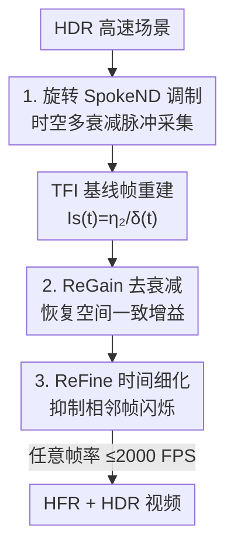

# HFR and HDR Video from Multi-Attenuated Spikes Using a Rapidly Rotating SpokeND Filter

**会议**: CVPR 2026  
**论文**: [CVF Open Access](https://openaccess.thecvf.com/content/CVPR2026/html/Chang_HFR_and_HDR_Video_from_Multi-Attenuated_Spikes_Using_a_Rapidly_CVPR_2026_paper.html)  
**代码**: 无  
**领域**: 图像恢复 / 视频重建  
**关键词**: 脉冲相机, HDR视频重建, 高帧率, SpokeND滤光片, 多衰减调制  

## 一句话总结
在脉冲（spike）相机前架一片高速旋转的镂空式中性密度滤光片（SpokeND），让每个像素周期性地以多档衰减采样光强，再用两阶段的 ReST-Net（ReGain 去空间衰减 + ReFine 去时间闪烁）从这些「多衰减脉冲」里重建出最高 2000 FPS 的高帧率（HFR）兼高动态范围（HDR）视频。

## 研究背景与动机

**领域现状**：要同时拍到「高动态范围」和「高速运动」的场景对普通相机很难。传统 HDR 视频方法靠交替曝光（alternating-exposure）多帧融合，但交替曝光本身会牺牲时间分辨率，在高速场景里要么拖影、要么帧率掉到 20–60 FPS。神经形态的脉冲相机有天然优势：每个像素是独立的光子累加器，时间分辨率高达 20,000 Hz、数据只有单 bit，没有统一快门的概念。

**现有痛点**：脉冲相机要重建出能看的图像，需要在一个时间窗内累加脉冲——窗口越长动态范围越好，但高速运动下长窗口就会糊。要在短窗口下提升 HDR，已有思路要么改传感器内部（调量化位数 [2]、调触发阈值 [51]），需要硬件改造且阈值无法在高速场景里实时切换；要么在光路上做光学调制（固定空间掩膜）[29,32,33]，但滤光片位置固定，**每个像素只能看到一个固定衰减档**，重建 HDR 还得靠空间上采样/插值，损失空间分辨率。想让滤光片动起来给每个像素喂多档衰减，传统数字相机帧率又太低（LCD 衰减器只有 30 FPS [31]、多传感器系统 35 FPS [39]），根本接不住高速运动。

**核心矛盾**：小触发阈值能提升暗部灵敏度（拉低可测的 $I_{min}$），却让亮部更容易饱和触发（压低可测的 $I_{max}$）——灵敏度与抗饱和在单一固定配置下是此消彼长的，单档采样吃不下真实场景的全动态范围。

**切入角度**：脉冲相机的超高时间分辨率不只能拍高速，还能在「时间」这一维上承接快速的光学调制。如果把空间衰减滤光片高速旋转起来，每个像素就能在极短时间内轮流被多个衰减档照到——空间调制借时间维度变成了「时空联合调制」，单传感器就能拿到多曝光等价信息。

**核心 idea**：用一片高速旋转的多档镂空 ND 滤光片，把「多曝光」编码进时间，让单个脉冲相机采到多衰减脉冲，再用神经网络把空间上的衰减差异和时间上的波动一并解算掉，重建 HFR + HDR 视频。

## 方法详解

### 整体框架
方法要解决的是：单个脉冲相机如何在高速场景里同时拿到 HDR 和高帧率。整体分采集端和重建端两块。采集端在相机前放一片旋转的 SpokeND 滤光片，让每个像素周期性接收 92% / 75% / 0% 三档衰减的光，配合脉冲相机超高时间分辨率得到「多衰减脉冲」流。重建端是两阶段网络 ReST-Net：先用 TFI 做基线帧重建，再经 ReGain 把多衰减帧拉回「无衰减」的空间一致帧，最后经 ReFine 压掉相邻帧之间的时间闪烁，按任意目标帧率（最高 2000 FPS）输出 HFR + HDR 视频，整体是 coarse-to-fine 的思路。

脉冲生成机制：像素持续累积光生电子，累积电压 $V(t)$ 一旦达到阈值 $V_{th}$ 就读出脉冲 1 并复位，否则按固定间隔 $\tau$ 默认读出 0：

$$S(t) = \begin{cases} 1, & V(t) \ge V_{th} \\ 0, & \text{otherwise} \end{cases}$$

在 $N$ 个采样间隔的窗口里累加脉冲可得重建光强 $I_s(t) = \eta_1 \sum_{i\in[0,N-1]} S(t+i\tau)$，动态范围 $DR = 20\log(I_{max}/I_{min})$。$N$ 越大动态范围越高，但高速场景里长窗口必糊，所以作者固定用小 $V_{th}$ 保灵敏度、靠多衰减来补回被压低的 $I_{max}$。

### 关键设计

**1. 旋转 SpokeND 滤光片：把多曝光编码进时间维**

针对「固定滤光片每像素只能看一个衰减档」的痛点，作者设计了一片镂空轮辐（spoke）状的中性密度滤光片，每根轮辐对应一个衰减档。它满足三条要求：（1）**多档衰减**——参照传统多曝光 HDR，设三档透过率 92% / 75% / 0%（百分比越大表示透光越少 ⚠️ 原文如此表述，0% 处忽略材料本征吸收）；（2）**高频周期性**——衰减区绕旋转中心对称分布以保持空间平衡，并把图案做成四个重复周期，在 1800 RPM（每分钟 1800 转）下达到 7200 CPM（每分钟 7200 个调制周期）的时间调制频率，大幅细化调制粒度；（3）**轻量稳定**——用光学树脂制造。配套硬件平台把脉冲相机和该滤光片一起装在光学面包板上，滤光片由陶瓷轴承+齿轮支撑、高速电机匀速驱动到 1800 RPM。这套机制的关键在于：脉冲相机 20,000 Hz 的采样远快于滤光片旋转，因此能在每个像素被不同轮辐扫过的瞬间精确采到对应衰减档的脉冲——高衰减档防亮部饱和、低衰减档保暗部灵敏度，单传感器就拿到了多曝光等价信号。

**2. ReGain 模块：从多衰减帧恢复空间一致的「无衰减」增益**

旋转滤光片带来的直接副作用是：同一帧里不同像素被不同衰减档照到，画面出现空间不一致（spatial variation），而且多衰减脉冲与无衰减脉冲之间的关系是**非线性**的——亮部 0% 衰减区在强光下会脉冲饱和、光子数与脉冲密度失去线性；暗部 92% 衰减区可能完全不触发脉冲，二者都没法直接解析反推。ReGain 的思路是借旋转的时间冗余来救：即便某个时刻 $t$ 某像素饱和或零脉冲，它的时间邻域里总有被合适衰减档照到、强度恰当的脉冲。因此 ReGain 每步取 $2K+1$ 个时间相邻、间隔为 $\Delta_g$ 的多衰减帧 $\{I_s(t+k\cdot\Delta_g)\,|\,k\in[-K,K]\}$ 作为输入，让网络学习恢复相对于无衰减条件的空间一致增益（gain）。在做这一步之前先用 TFI 而非 TFW 做基线帧重建——TFW 在时间窗里累加对窗口大小敏感、高速下易糊，TFI 改用相邻脉冲的时间间隔 $\delta(t)$ 估计像素强度 $I_s(t)=\eta_2/\delta(t)$，对运动更鲁棒。网络结构是 U-Net 编码-解码骨架，并插入自注意力块扩大感受野、增强空间上下文建模，输出无衰减空间一致帧 $I_g(t)$。

**3. ReFine 模块：抑制时间闪烁并支持任意帧率 HFR 输出**

ReGain 解决了空间一致性，但逐帧独立处理仍会在相邻帧之间留下时间波动/闪烁（inter-frame flickering）。ReFine 负责在时间维上细化，并把输出帧率解耦成可任意指定（最高 2000 FPS）。做法很直接：设目标帧间隔 $\Delta_f$，把当前 ReGain 输出 $I_g(t)$ 与前一帧 $I_g(t-\Delta_f)$ 拼接后送入 ReFine，用前一帧提供「一致性感知」的引导，增强时间稳定、压低感知闪烁，得到精修帧 $I_f(t)$。结构同样是 U-Net + 自注意力。正是「以 $\Delta_f$ 为可调间隔取相邻帧」这一设计让网络能在任意目标帧率下输出，从而在高速运动上实现 HFR + HDR。

### 损失函数 / 训练策略
两个模块分别监督。ReGain 的真值 $G_g(t)$ 由合成的**无衰减脉冲**经 TFI 基线重建（公式 $I_s=\eta_2/\delta$）得到，损失为像素级 $\ell_1$ 与 $\ell_2$ 的加权和：$L_g = \alpha_1 L_1 + \alpha_2 L_2$。ReFine 的真值 $G_f(t)$ 是用于合成脉冲的 HDR 视频帧，损失在 $\ell_1$、$\ell_2$ 之外加了一项**时间一致性损失** $L_f = \beta_1 L_1 + \beta_2 L_2 + \beta_3 L_{temp}$，其中 $L_{temp} = \ell_2\big(I_f(t)-I_f(t-\Delta_f),\; G_f(t)-G_f(t-\Delta_f)\big)$，即约束预测的相邻帧差与真值帧差一致，直接对准「闪烁」这一目标。训练数据靠自研模拟器合成：对模拟的 SpokeND 滤光片施加匀速旋转、用与衰减档逐元素相乘模拟透光，再按脉冲相机的积分-触发机制生成多衰减脉冲与无衰减脉冲；合成集共 285 组（235 训练 / 50 测试），HDR 视频真值取自 Chang 等 [1] 与 Su 等 [37]。真实数据则用搭好的硬件采了 100 组（80 室内 / 20 室外，各 1 秒），但因高速场景无法重复采到对应无衰减脉冲，真实数据只用于主观评测。

## 实验关键数据

对比对象是同样基于脉冲相机的重建方法 TFW（按时间窗累加，TFW-$N$ 表示窗长 $N$）和 TFI（按脉冲间隔估计）。作者指出这是首个用多衰减脉冲重建 HFR+HDR 视频的框架，而对比方法都是为无衰减脉冲设计的，比较并不完全公平，但仍是有力基线。

### 主实验（合成数据，Table 1）

| 方法 | PSNR↑ | SSIM↑ | HDR-VDP3↑ | HDR-VQM↓ |
|------|-------|-------|-----------|----------|
| TFW-10 | 13.47 | 0.217 | 2.858 | 1.530 |
| TFW-70 | 22.16 | 0.541 | 4.508 | 0.797 |
| TFW-200 | 29.05 | 0.742 | 6.313 | 0.289 |
| TFI | 21.75 | 0.645 | 4.804 | 0.736 |
| **本文 ReST-Net** | **34.27** | **0.916** | **7.501** | **0.152** |

本文在四项指标上全面领先：相比最强基线 TFW-200，PSNR 提升约 5.2 dB（29.05→34.27），SSIM 0.742→0.916。定性上，TFI/TFW-10 在天空、道路等高亮区因 0% 衰减脉冲饱和而丢细节、且空间不一致；TFW-200 靠时间平均换来空间一致，却在运动物体（如行驶的车）上明显拖影；本文既能恢复饱和区细节又无运动模糊。

### 消融实验（合成数据，Table 1）

| 配置 | PSNR↑ | SSIM↑ | HDR-VDP3↑ | HDR-VQM↓ | 说明 |
|------|-------|-------|-----------|----------|------|
| 完整模型 | 34.27 | 0.916 | 7.501 | 0.152 | ReGain + ReFine |
| w/o ReGain | 21.89 | 0.789 | 4.859 | 0.724 | 去掉去衰减，空间一致性崩 |
| w/o ReFine | 31.48 | 0.900 | 7.173 | 0.166 | 去掉时间细化，噪声抑制变弱 |

两个模块都有贡献，但**ReGain 是主力**：去掉它 PSNR 直接从 34.27 掉到 21.89（−12.4 dB），因为缺少去衰减就无法纠正持续存在的空间变化；去掉 ReFine 掉到 31.48（−2.8 dB），主要表现为噪声抑制和时间一致性变弱。这与「ReGain 管空间、ReFine 管时间」的分工相吻合。

### 关键发现
- **去衰减（空间）比去闪烁（时间）权重大得多**：ReGain 缺失造成的掉点是 ReFine 的约 4 倍，说明多衰减脉冲带来的核心难点是空间不一致的非线性 gain 恢复。
- **帧率与动态范围可解耦**：ReFine 以可调的 $\Delta_f$ 取帧，使输出帧率最高可达 2000 FPS 而不绑定采集配置。
- **对运动速度的鲁棒性有可预测的下降**：在合成集上把运动速度加倍时 PSNR=29.91 / SSIM=0.902，加到三倍时 PSNR=26.35 / SSIM=0.805，呈平滑下降，反映了方法的理论上限。
- **合成到真实可零样本迁移**：滤光片置于镜头前会引入一定离焦、实际衰减档偏离理想设定，但模型无需重训即可在真实数据上重建出高质量 HDR 视频。

## 亮点与洞察
- **把空间调制「转」成时空调制**：传统固定空间掩膜每像素只能看一个衰减档，本文用旋转让同一像素在时间上轮流吃到多档衰减——核心是借脉冲相机 20,000 Hz 采样远快于 1800 RPM 旋转，才能精确切片各档脉冲。这个「用时间分辨率换光学调制带宽」的思路可迁移到其他需要高速光学调制的成像任务。
- **任务拆解干净、消融自证**：空间不一致交给 ReGain、时间闪烁交给 ReFine，消融数据清楚显示二者各司其职且 ReGain 是瓶颈，是很有说服力的模块化设计。
- **时间一致性损失直击目标**：$L_{temp}$ 不是约束单帧，而是约束「相邻帧差与真值帧差一致」，直接对准闪烁这一现象，比单纯逐帧 L1/L2 更贴合 HFR 视频的需求。
- **软硬件协同的真系统**：自制 SpokeND 滤光片（光学树脂、四周期、陶瓷轴承、高速电机）+ 自研模拟器 + 100 组真实数据，工程闭环完整。

## 局限与展望
- **运动速度仍是硬约束**（作者承认）：速度翻倍/三倍时指标平滑下降，存在理论上限——本质是旋转调制频率与场景运动速度之间的采样竞争。
- **滤光片置于镜头前引入离焦**：当前原型把 SpokeND 放在镜头前，焦平面之外会有一定离焦、实际衰减偏离理想设定；作者提出更优方案是把滤光片放到镜头后、贴近传感器，但需更复杂的硬件集成，留作未来工作。
- **真实数据无法定量评测**：高速场景下采不到可重复的无衰减脉冲真值，真实数据只能主观比较，缺少 PSNR 类客观数。
- **衰减档与周期是经验设定**：三档（92%/75%/0%）与四周期均为经验值，对不同动态范围/速度的场景是否最优、如何自适应，文中未深入。⚠️ 部分透过率表述（百分比含义、0% 忽略本征吸收）以原文为准。

## 相关工作与启发
- **vs TFW / TFI（脉冲基线重建）**：二者都为无衰减脉冲设计，TFW 靠时间窗累加（长窗 HDR 好但糊、短窗噪声大），TFI 靠脉冲间隔估强度对运动更稳但单档难覆盖全动态范围；本文在采集端就引入多衰减、并用网络解算非线性 gain，同时拿下 HDR 与无拖影。
- **vs 量化位/阈值调制 [2,51]**：它们改传感器内部来扩动态范围，需硬件改造且阈值在高速下无法实时切换；本文走光路外置调制，更灵活、不动传感器。
- **vs 固定空间掩膜 [29,32,33]**：固定掩膜每像素单档、靠空间上采样补分辨率；本文让掩膜高速旋转，每像素拿多档、保住空间分辨率。
- **vs LCD 衰减器 [31] / 多传感器系统 [39]**：它们的时间调制帧率只有 30/35 FPS，扛不住高速运动；本文借脉冲相机时间分辨率把等效调制频率推到 7200 CPM、重建帧率到 2000 FPS。
- **vs 脉冲-RGB 混合系统 [1]**：混合系统需精确同步与分光对齐、分光镜还增大体积；本文单传感器即可，硬件更紧凑。

## 评分
- 新颖性: ⭐⭐⭐⭐⭐ 首个用旋转 SpokeND 滤光片把多曝光编码进时间、单脉冲相机重建 HFR+HDR 视频的框架，软硬件思路都新。
- 实验充分度: ⭐⭐⭐⭐ 合成数据四指标对比+消融+速度鲁棒性齐全，但真实数据仅主观评测、缺客观数。
- 写作质量: ⭐⭐⭐⭐ 动机推导清晰、机制与模块分工讲得明白；部分硬件/透过率细节略简。
- 价值: ⭐⭐⭐⭐⭐ 给「高速+HDR」这一长期难题提供了单传感器的可落地路线，时空调制思路有迁移潜力。

<!-- RELATED:START -->

## 相关论文

- [\[CVPR 2026\] F²HDR: Two-Stage HDR Video Reconstruction via Flow Adapter and Physical Motion Modeling](f2hdr_two-stage_hdr_video_reconstruction_via_flow_adapter_and_physical_motion_mo.md)
- [\[CVPR 2026\] LRHDR: Learning Representation-enhanced HDR Video Reconstruction](lrhdr_learning_representation-enhanced_hdr_video_reconstruction.md)
- [\[CVPR 2026\] ExpoCM: Exposure-Aware One-Step Generative Single-Image HDR Reconstruction](expocm_exposure-aware_one-step_generative_single-image_hdr_reconstruction.md)
- [\[CVPR 2026\] Gyro-based Deep Video Deblurring](gyro-based_deep_video_deblurring.md)
- [\[CVPR 2026\] SelfHVD: Self-Supervised Handheld Video Deblurring](selfhvd_self-supervised_handheld_video_deblurring.md)

<!-- RELATED:END -->
