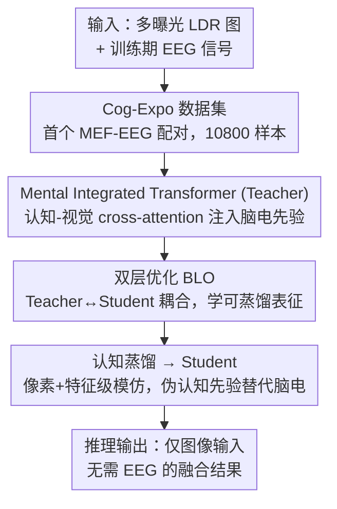

# Human-Centric Multi-Exposure Fusion: Benchmark and Bi-level Cognition Distillation Framework

**会议**: CVPR 2026  
**论文**: [CVF Open Access](https://openaccess.thecvf.com/content/CVPR2026/html/Shang_Human-Centric_Multi-Exposure_Fusion_Benchmark_and_Bi-level_Cognition_Distillation_Framework_CVPR_2026_paper.html)  
**代码**: https://github.com/501586528/HC-MEF  
**领域**: 图像恢复 / 多曝光融合 / 低层视觉 / 脑电认知引导  
**关键词**: 多曝光融合、EEG 脑电、双层优化、知识蒸馏、人眼感知

## 一句话总结
本文把人类脑电（EEG）认知信号引入多曝光融合（MEF）：先构建首个 MEF-EEG 配对数据集 Cog-Expo，再用「双层优化」把一个受脑电引导的 Teacher 的认知知识蒸馏给一个**只用图像、推理时无需脑电**的 Student，在 MEF 基准上达到 SOTA 且融合结果更贴合人眼感知。

## 研究背景与动机

**领域现状**：多曝光融合（MEF）要把同一场景不同曝光的多张低动态范围（LDR）图合成一张高质量图，最终目标是「视觉上贴合人类感知」。从手工先验到深度学习（DeepFuse、MEF-GAN、Transformer 系）都有长足进步。

**现有痛点**：但绝大多数方法的优化目标是**统计指标或像素级重建损失**——训练方便，却无法刻画人类视觉系统（HVS）真正在意的主观因素：视觉舒适度、伪影容忍度、显著性注意。于是「指标好看」和「人眼觉得好」之间存在系统性偏差。

**核心矛盾**：EEG 能直接、毫秒级地客观记录大脑对视觉刺激的反应，是引入人类认知反馈的理想信号——但用到 MEF 这种低层视觉任务上有两道坎：(1) **没有数据**——现有 EEG-视觉数据集都面向高层识别，没有「曝光变化刺激」的配对；(2) **推理拿不到信号**——EEG 训练时能采，部署时不可能给每张图配脑电。核心挑战因此变成：**如何在训练期用脑电认知引导，却保持推理期纯图像输入**。

**本文目标**：拆成两个子问题——补上数据缺口，以及设计一个「训练用脑电、推理不用脑电」的框架。

**切入角度**：作者观察到 EEG 的 ERP 成分（如与注意/决策相关的 P300）携带感知偏好信息，且大脑对极端曝光会在枕叶过激活；这意味着脑电对曝光是**敏感且可建模**的认知先验。

**核心 idea**：用「特权信息蒸馏」的范式——构造受脑电引导的 Teacher，再通过**双层优化**让 Teacher 学到「天然可蒸馏」的表征，把认知引导迁移给只看图像的 Student，从而摆脱推理期对脑电的依赖。

## 方法详解

### 整体框架
系统由「数据 + 方法」两侧组成。数据侧是 **Cog-Expo** 数据集：10 名被试观看 SICE 的欠/正常/过曝刺激、64 通道 1kHz 采集，得到 10,800 条 EEG-图像样本。方法侧把问题写成一个**双层优化（BLO）**：下层是受脑电引导的 Teacher（Mental Integrated Transformer），上层是只用 LDR 图像的 Student。Teacher 用 cross-attention 把脑电认知 token 注入视觉特征；Student 通过**认知蒸馏**模仿 Teacher 的像素与特征级输出，推理时用从图像自身导出的「伪认知先验」替代脑电，实现 EEG-free 部署。BLO 的关键在于把下层目标显式写成依赖 Student 参数，逼 Teacher 学出「学生学得动」的表征。

### 关键设计

**1. Cog-Expo：首个面向 MEF 的脑电认知数据集**

痛点是现有 EEG-视觉数据全是高层识别任务，没有曝光变化刺激，根本无法把脑电和多曝光序列连起来。作者基于 SICE 基准构建 Cog-Expo：每组取最欠曝、最过曝、正常三张图组成刺激块，强化对极端曝光的认知反应；10 名被试（标准 10-20 导联、64 通道、1kHz、阻抗 <18 kΩ）每张图呈现 1 秒、间隔 0.5 秒空屏，每三块插一个「主体在极端曝光下是否仍可辨认」的提问以驱动主动认知，最终 10,800 条高质量样本。预处理刻意「最小化」——只去 EMG/EOG 伪影、加 50Hz 陷波，保留原始神经信息作为数据驱动认知引导的可靠基础。脑响应分析进一步发现：极端曝光在右枕叶引发过激活，长时程下活动由枕叶向顶叶/额叶扩散，说明短时刺激主要是被动枕叶响应、语义判别才调动高阶认知区——为「脑电携带曝光相关感知偏好」提供了生理证据。

**2. Mental Integrated Transformer（Teacher）：用 cross-attention 把认知先验注入视觉特征**

光有脑电不够，得让它真正调制视觉特征。Teacher 设计成一个多模态 U-Net：原始 EEG $E_{\text{raw}}$ 先经一个轻量 1D-CNN-Transformer 混合编码器 $E_{\text{EEG}}$ 投影成紧凑认知 token $E\in\mathbb{R}^D$，再经 MLP adapter 得到欠曝/过曝各自的认知 token $v^{\text{low}}_{\text{cog}}/v^{\text{over}}_{\text{cog}}$。编码阶段每个 block 做 **cross-attention：用视觉中间特征当 Query、认知 token 当 Key/Value**，从而按被试认知反应动态调制视觉特征、强调感知显著或视觉吃力的区域；解码阶段则在每个上采样级用一个目标认知态 $v^{\text{GT}}_{\text{cog}}$（来自高质量参考态）引导重建对齐人眼偏好。EEG 编码器不单独预训练而是端到端并入 Teacher，让认知表征直接为融合任务优化。消融显示把 cross-attention 换成简单 concat 掉点最多，说明「跨注意力注入」而非「特征拼接」才是把高维认知先验融进视觉空间的关键。

**3. 双层优化（BLO）：逼 Teacher 学出「可蒸馏」的表征**

标准两阶段蒸馏（先把 Teacher 训到收敛、冻结、再训 Student）有个隐患：固定的 Teacher 可能学出 Student 根本模仿不动的表征。本文把它写成一个嵌套的双层优化：

$$\min_{\theta_S}\ \mathcal{L}_{\text{Upper}}(\theta_S,\theta_T^*)\quad \text{s.t.}\quad \theta_T^*=\arg\min_{\theta_T}\mathcal{L}_{\text{Lower}}(\theta_T,\theta_S)$$

Student（上层）只用 LDR 图像优化 $\theta_S$ 去逼近最优 Teacher；Teacher（下层）用图像 + 脑电先验优化，但**下层目标显式依赖 Student 当前参数** $\theta_S$。这个耦合让「最优 Teacher」不再静止，而是随训练演化、始终保持一个 Student 够得着、可蒸馏的表征空间。整体用交替梯度下降（A-GD）在统一循环里交替更新 T 和 S。消融对比表明：BLO 显著优于两阶段（PSNR 20.53）和无嵌套的联合训练（22.11），达到 23.76，印证「动态耦合」放大了蒸馏效果。

**4. 认知蒸馏：把脑电知识迁给只用图像的 Student**

最后一公里是让推理彻底摆脱脑电。蒸馏损失在像素级和特征级同时迁移特权知识：

$$\mathcal{L}_{\text{Distill}}=\lVert I^S_F-\text{sg}(I^{T*}_F)\rVert_1+\beta\sum_l\lVert \phi^l_S-\text{sg}(\phi^l_T)\rVert_2^2$$

其中 $\text{sg}(\cdot)$ 是 stop-gradient（保证上层更新稳定），$\beta$ 是特征蒸馏权重；两个网络都再加 L1 重建损失 $\mathcal{L}_{\text{recon}}=\lVert I_F-I_{GT}\rVert_1$ 保结构与感知保真。Student 为保持与 Teacher 架构一致，把 cross-attention 里的生物先验替换成**直接从输入 LDR 图导出的伪认知先验**充当 Key/Value，于是推理时只凭视觉线索就能近似认知感知引导。消融显示：只有重建损失的基线 PSNR 仅 17.90，加 EEG cross-attention 但不蒸馏到 18.98，完整蒸馏框架跃到 23.76——说明「用了脑电」远不够，「把感知知识真正蒸出来」才是质变。

## 实验关键数据

评测指标：有参考用 **PSNR / SSIM / MS-SSIM / CC（相关系数，↑）/ MSE（↓）**；无参考用 **BRISQUE（↓）/ MUSIQ（↑）/ DBCNN（↑）/ EN（信息熵 ↑）/ Qabf（边缘保持 ↑）** 评感知质量。训练用 SICE（仅取最欠/最过曝两张），跨域测 MEF-LUT 与 MEFB，单卡 RTX 4090、AdamW、lr 2e-4、300K 迭代。

### 主实验
有参考基准（SICE / MEF-LUT，对照 9 个 SOTA）：

| 数据集 | 指标 | 本文 | 次优(HSDS-MEF) | 提升 |
|--------|------|------|----------|------|
| SICE | PSNR↑ | 23.764 | 20.568 | +3.9%(相对) |
| SICE | SSIM↑ | 0.6065 | 0.5593 | 最佳 |
| SICE | MS-SSIM↑ | 0.8203 | 0.7679 | 最佳 |
| MEF-LUT | PSNR↑ | 22.793 | 22.623 | 最佳 |
| MEF-LUT | SSIM↑ | 0.6369 | 0.6033 | +13.8%(相对) |

无参考基准 MEFB（感知质量）：

| 方法 | BRISQUE↓ | MUSIQ↑ | DBCNN↑ | Qabf↑ |
|------|------|------|------|------|
| HSDS-MEF | 20.112 | 66.454 | 0.5977 | 0.6317 |
| AGAL | 21.591 | 66.178 | 0.6082 | 0.6107 |
| **Ours** | **19.492** | **67.310** | **0.6208** | **0.6645** |

BRISQUE 较次优提升约 9.7%，MUSIQ 最高，说明感知质量与人眼舒适度对齐更好；且参数量仅 1.37M、FLOPs 30.9G，属轻量。

### 消融实验
认知蒸馏分级消融（SICE）：

| 配置 | 图像 | 认知(EEG) | 蒸馏 | PSNR↑ | SSIM↑ |
|------|------|------|------|------|------|
| (1) 基线 Student | ✓ | × | × | 17.900 | 0.5094 |
| (2) Fusion-only(注EEG不蒸馏) | ✓ | ✓ | × | 18.980 | 0.5128 |
| Ours(完整蒸馏) | ✓ | ✓ | ✓ | 23.764 | 0.6065 |

优化策略与 Teacher 结构消融：

| 消融维度 | 配置 | PSNR↑ | SSIM↑ |
|------|------|------|------|
| 优化策略 | 两阶段训练 | 20.531 | 0.5012 |
| 优化策略 | 联合训练(无嵌套) | 22.108 | 0.5539 |
| 优化策略 | **Ours(BLO)** | **23.764** | **0.6065** |
| Teacher 结构 | 去编码端 EEG 引导 | 23.155 | 0.5891 |
| Teacher 结构 | 去解码端 EEG 引导 | 23.420 | 0.5983 |
| Teacher 结构 | concat 替代 cross-attn | 22.887 | 0.5750 |

### 关键发现
- **蒸馏才是质变点**：仅注入 EEG（设置 2）相比基线只涨约 1 dB，而完整蒸馏直接 +5.8 dB——「用认知信号」和「蒸出认知知识」是两回事。
- **BLO > 联合 > 两阶段**：动态耦合让 Teacher 学出可蒸馏表征，比静态两阶段高 3.2 dB，验证「Teacher 要为 Student 而学」的核心论点。
- **cross-attention 不可替代**：换成 concat 掉点最多（PSNR 23.76→22.89），说明高维认知先验需要注意力机制而非简单拼接才能融进视觉特征。
- **下游受益**：在 MEFB 上做深度估计，本文融合图能产出边缘更锐、几何更一致的深度图，说明融合质量惠及结构理解。

## 亮点与洞察
- **把神经科学信号引入低层视觉**是少见且有想象空间的跨界：用 EEG 作为「人眼偏好」的客观监督，绕开了统计指标与人眼感知之间的鸿沟。
- **「特权信息 + 双层优化」组合很巧**：BLO 的精髓不是「训得更准」而是「训得更可蒸馏」，让 Teacher 主动迁就 Student——这个思路可迁移到任何「训练有特权模态、推理只有普通模态」的任务（如训练有深度/红外、推理只有 RGB）。
- **伪认知先验**让 Student 在没有脑电时也能复用同一套 cross-attention 结构，是把「特权信号」平滑替换为「自生成代理」的实用工程手法。

## 局限与展望
- **数据规模与被试有限**：仅 10 名被试、SICE 衍生刺激，年龄集中（均值 22.3 岁），认知偏好的群体泛化性、跨人群一致性仍待验证。
- **EEG 噪声与个体差异**：脑电高维且嘈杂，伪认知先验能否在更难场景稳定逼近真脑电引导，论文未充分压力测试。
- **依赖参考图训练**：主训练用 SICE 的成对/参考图，极端运动错位、剧烈曝光跳变下的鲁棒性（作者也承认 MEF 普遍易受运动错位影响）需进一步检验。
- **跨任务推广未验证**：作者展望脑电先验可推广到更广的认知感知低层视觉，但本文只在 MEF 上验证，迁移成本与效果待考。

## 相关工作与启发
- **vs 传统/深度 MEF（DeepFuse、MEF-GAN、HSDS-MEF、HoLoCo 等）**：它们只用视觉先验 + 统计/像素损失，忽略认知线索；本文引入 EEG 认知监督，在感知指标（BRISQUE/MUSIQ）上优势尤为明显。
- **vs 脑机回路类认知利用方法**：以往工作多在「脑-机回路」里直接依赖原始脑电信号、部署仍需采集；本文通过蒸馏把认知能力迁入纯视觉模型，实现 EEG-free 推理这一更通用范式。
- **vs 标准两阶段知识蒸馏**：固定 Teacher 可能学出 Student 模仿不动的表征；本文用双层优化耦合 T/S，逼 Teacher 学可蒸馏表征，实测优于两阶段与联合训练。

## 评分
- 新颖性: ⭐⭐⭐⭐⭐ 首个 MEF-EEG 数据集 + 双层认知蒸馏，跨神经科学与低层视觉的全新范式。
- 实验充分度: ⭐⭐⭐⭐ 有参考/无参考多基准 + 三类消融 + 下游深度估计齐全，被试与数据规模偏小。
- 写作质量: ⭐⭐⭐⭐ 动机—数据—方法—验证链条清晰，BLO 与脑响应分析讲得透。
- 价值: ⭐⭐⭐⭐ 思路开创、SOTA 且轻量，「特权认知蒸馏」对感知对齐类低层视觉有借鉴意义。

<!-- RELATED:START -->

## 相关论文

- [\[CVPR 2026\] BiEvLight: Bi-level Learning of Task-Aware Event Refinement for Low-Light Image Enhancement](bievlight_bi-level_learning_of_task-aware_event_refinement_for_low-light_image_e.md)
- [\[CVPR 2026\] Bridging Human Evaluation to Infrared and Visible Image Fusion](bridging_human_evaluation_to_infrared_and_visible_image_fusion.md)
- [\[CVPR 2026\] EVLF: Early Vision-Language Fusion for Generative Dataset Distillation](evlf_early_vision-language_fusion_for_generative_dataset_distillation.md)
- [\[CVPR 2026\] UniRain: Unified Image Deraining with RAG-based Dataset Distillation and Multi-objective Reweighted Optimization](unirain_unified_image_deraining_rag_dataset_distillation.md)
- [\[CVPR 2026\] DRFusion: Degradation-Robust Fusion via Degradation-Aware Diffusion Framework](drfusion_degradation_robust_fusion_via_degradation_aware_diffusion_framework.md)

<!-- RELATED:END -->
