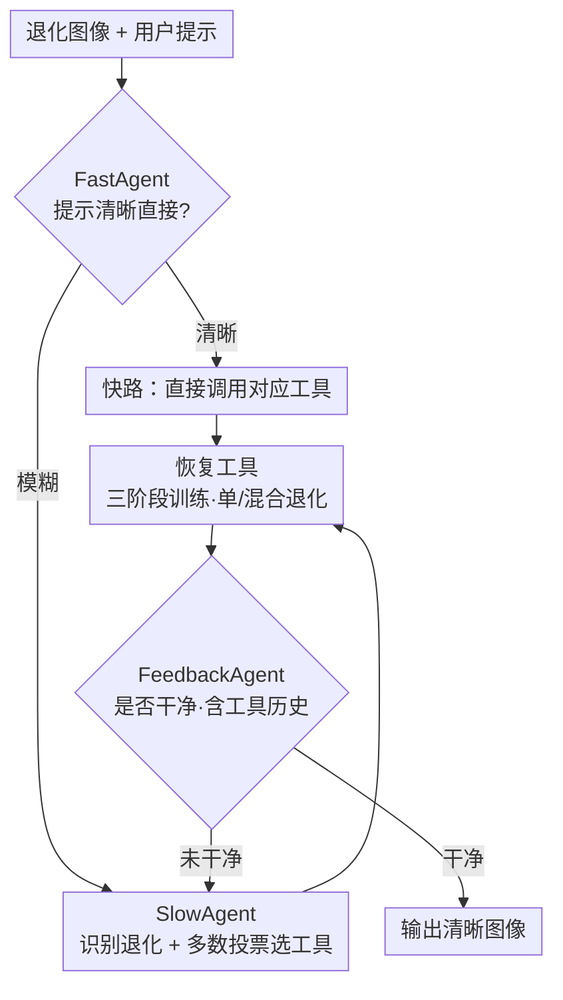

# Hybrid Agents for Image Restoration

**会议**: CVPR 2026  
**论文**: [CVF Open Access](https://openaccess.thecvf.com/content/CVPR2026/html/Li_Hybrid_Agents_for_Image_Restoration_CVPR_2026_paper.html)  
**代码**: 原文未给出明确代码仓库 ⚠️  
**领域**: 图像恢复 / 智能体  
**关键词**: 图像恢复, 多智能体, 多模态大模型, 混合退化, LoRA

## 一句话总结
针对真实图像恢复中「外行不会选工具」和「逐个去退化会误差传播」两个痛点，提出 HybridAgent——用「快/慢/反馈」三个智能体协同调度，配合一套三阶段训练得到的单退化 + 混合退化恢复工具，让简单指令走轻量快路、复杂退化走 MLLM 慢路并闭环反馈，从而又快又稳地完成自动图像恢复。

## 研究背景与动机

**领域现状**：图像恢复（IR）从早期「一种退化一个模型」（去噪/去模糊/去 JPEG/超分各做各的），发展到 all-in-one 通用模型（AirNet、PromptIR、InstructIR 等），用提示学习或指令微调在单网络里处理多种退化。

**现有痛点**：哪怕有了通用模型，**复杂真实退化的处理仍要靠专业用户手动选模式**。一个不懂「噪声」「模糊」术语的普通用户很难逐步挑对工具。已有基于语言交互的方法（用 MLLM 自动规划）又有两个硬伤：(i) **单一交互智能体不分任务难易**——哪怕「请去掉噪声」这种明确简单指令，也照样用重量级 MLLM 处理，白白浪费算力和时间；(ii) **逐步去退化会误差传播**——真实图像往往是多退化叠加（如运动模糊 + 噪声 + JPEG），一个个单退化工具串行处理，因退化纠缠和不同模型间的分布偏移，越修越糟（图 1 中分步去退化的 PSNR 明显低于一次性混合去退化）。

**核心矛盾**：交互效率与处理能力之间的失衡——要应付复杂退化就得上 MLLM，但 MLLM 对简单请求过重；要避免误差传播就不能逐步串单工具，但单工具又是现成 SOTA 最容易拿来用的。

**本文目标**：构建一个统一的交互式恢复范式，既能按用户请求复杂度自适应分配算力，又能对混合退化避免逐步处理的误差累积。

**切入角度**：类比人类修图——先判断退化类型、选工具、修一步、再评估是否干净、不行就继续。作者把这个迭代过程拆给三个分工不同的智能体，并把「混合退化」当成一个一等公民的工具类型而非串行近似。

**核心 idea**：用「快路轻量 LLM + 慢路 MLLM + 反馈闭环」三智能体替代单一重智能体，再用三阶段训练造出能直接处理混合退化的工具，从源头削掉逐步处理的误差传播。

## 方法详解

### 整体框架
HybridAgent 接收一张退化图 + 用户提示。FastAgent（轻量 LLM）先快速判断提示是否清晰直接：清晰就走**快路**直接调用对应恢复工具；模糊就交给 SlowAgent（MLLM）走**慢路**自动识别退化、用多数投票选工具。工具执行后，FeedbackAgent（IQA 模型）判断图是否已干净——没干净就带着「已用过哪些工具」的历史回到 SlowAgent 继续修，干净就输出。所有工具来自一套三阶段训练范式，既有单退化工具也有专门的混合退化工具。

### 关键设计

**1. FastAgent 轻量快路：按提示复杂度分流，省掉不必要的 MLLM 开销**

并非每次交互都复杂。专业用户会给出明确指令（如「请去噪」），此时再用 MLLM 识别退化纯属浪费。作者用一个轻量 LLM（Llama-3.2-1B-Instruct）做 FastAgent，靠**上下文学习（in-context learning）**直接解析明确提示、判定要调哪个工具、立即进入恢复步；只有当 FastAgent 认为提示模糊不清时，才把图交给 SlowAgent。这一分流让明确请求只花约 SlowAgent 12% 的运行时间，同时保持几乎相同的恢复质量。

**2. SlowAgent 慢路识别 + FeedbackAgent 闭环：把「识别—执行—评估」三难题逐个补齐**

慢路要解决 MLLM 在 IR 上的三个能力缺口。其一，通用 MLLM 没专门为退化识别微调——作者选用已为图像质量评估（IQA）调过的 Co-Instruct，再在自建指令微调数据集上继续微调，扩展其退化识别范围，得到 SlowAgent；针对 MLLM 会幻觉乱判的问题，借「测试时扩展」的思路用**多数投票**，生成多个候选判断、取出现最频繁的退化作为最终结果。其二，MLLM 不能直接执行恢复——配一套可被调用的恢复工具（见设计 3、4）。其三，MLLM 无法判断是否还要继续修——引入 FeedbackAgent：同样微调 Co-Instruct 成一个「判断恢复图是否干净」的分类器，并把**已选用工具的历史**作为上下文喂进去，让它更可靠地决定是终止还是回到 SlowAgent 再修一轮。SlowAgent 与 FeedbackAgent 协同，构成自动恢复的闭环。

**3. 混合退化去除工具：从源头消除逐步处理的误差传播**

真实图像常是多退化叠加，逐个串单退化工具会因退化纠缠和模型间分布偏移导致结果越修越差。作者把「混合退化去除」做成一个独立工具类型，让多退化能**一次性**处理而非分步近似。实验证实：在 Blur+Noise、Motionblur+Noise+JPEG 等组合上，混合工具相比只用单退化工具串行，PSNR/SSIM 大幅提升、LPIPS 明显下降，尤其在 haze、low-light 这类「退化建模不稳、易被额外退化扰乱」的场景上更突出。此外混合工具自身能力有限时，可借 FeedbackAgent 把它纳入分步调度，与单退化工具协同处理更复杂场景、用更少步数完成。

**4. 三阶段工具训练范式：共享知识 + LoRA 高效适配**

直接拿现成的各单任务 SOTA 当工具，既无法复用任务间共享知识，模型间分布差异还会加剧误差传播。作者改用三阶段训练（图 3）：**Stage I** 按提示学习式 all-in-one（采用增强版 PromptIR，并把前两阶段的 Transformer 块换成移位窗口注意力 RHAG 以增强表征）多任务训练一个基础恢复模型，学到跨任务共享知识；**Stage II** 在冻结的基础模型上用 LoRA 高效微调出各**单退化**工具，并重新初始化提示参数与 LoRA 联合训练，让提示编码退化的描述性信息、LoRA 适配深层语义；**Stage III** 再用一组新的 LoRA 微调出**混合退化**工具，但提示参数**继承自 Stage II**，从而同时利用 Stage II 的任务特定知识与 Stage I 的共享知识，训练时按 Real-ESRGAN 的退化合成管线造混合退化数据。这套范式既保住共享知识又给出构建单/混合工具的统一路径。

### 一个完整示例
用户上传一张「Raindrop + Blur + Noise + JPEG」四重退化图，只说「帮我修干净」。FastAgent 判定提示模糊 → 交给 SlowAgent；SlowAgent 多数投票识别出主导退化、优先调用**混合退化工具（De-hybrid）**一次性处理掉大部分退化 → FeedbackAgent 带着「已用 De-hybrid」的历史评估，发现雨滴残留、未干净 → 回到 SlowAgent 调用单退化的**De-raindrop** → FeedbackAgent 判定干净 → 输出。相比逐步「先 De-JPEG → 再去噪 → 再去模糊」的串行路线（每步都引入分布偏移、PSNR 在 20+ 徘徊），这条「混合 + 单退化协同」路线步数更少、结果更优。

## 实验关键数据

**实现细节**：恢复工具用 [25] 增强版 PromptIR（前两阶段 Transformer 块换成 RHAG）；SlowAgent / FeedbackAgent 均由 Co-Instruct 微调；FastAgent 用 Llama-3.2-1B-Instruct。覆盖 10 种退化：噪声、高斯模糊、运动模糊、JPEG、HEVC、VVC、雨痕、雨滴、雾、低光。指令微调数据 SlowAgent 70k、FeedbackAgent 66k（30k「干净」+ 33k「不干净」）；用 GPT-4 生成每种退化 20 条直接 + 20 条模糊提示，共 220 条。**A.I.T.（Average Inference Time）** 指智能体系统的总推理时间（RTX 4090D 上测）。

### 主实验：开/关快路对效率与性能的影响（PSNR↑/SSIM↑，A.I.T. 单位秒）

| 退化 | 设置 a) 全 HybridAgent A.I.T. | 设置 b) 关快路（全走 SlowAgent）A.I.T. | a) 性能 | b) 性能 |
|------|------|------|------|------|
| De-noise | 0.08 | 0.75 | 30.25/0.867 | 30.63/0.874 |
| De-blur | 0.11 | 0.82 | 30.65/0.853 | 30.52/0.852 |
| De-JPEG | 0.09 | 0.79 | 30.02/0.873 | 30.18/0.876 |
| De-rainstreak | 0.13 | 1.05 | 30.04/0.893 | 30.03/0.893 |
| De-haze | 0.09 | 0.83 | 29.92/0.960 | 29.92/0.960 |

明确提示走快路时，运行时间仅约 SlowAgent 的 12%，而 PSNR/SSIM 与全走 MLLM 几乎一致——证明对简单请求用轻量 LLM 完全够用，重量级 MLLM 是浪费。表 2 进一步给出工具调用**成功率**（正确调用次数 ÷ 总调用次数）：FastAgent 在去模糊/去运动模糊/去雨痕上达 100%，SlowAgent 在去噪/低光等需识别的退化上更稳（如低光 100%、去噪 94.3%），二者形成「简单交给快、复杂交给慢」的互补。

### 混合退化去除 vs 逐步单退化（PSNR↑/SSIM↑/LPIPS↓）

| 退化组合 | 仅单退化（逐步）PSNR/SSIM/LPIPS | 单+混合工具 PSNR/SSIM/LPIPS |
|----------|------|------|
| Blur+Noise | 23.72 / 0.555 / 0.520 | **26.21 / 0.733 / 0.311** |
| Blur+JPEG | 26.04 / 0.737 / 0.300 | **26.54 / 0.775 / 0.278** |
| Blur+Noise+JPEG | 22.32 / 0.423 / 0.640 | **25.37 / 0.706 / 0.352** |
| Motionblur+Noise | 22.10 / 0.532 / 0.501 | **23.13 / 0.628 / 0.388** |
| Motionblur+Noise+JPEG | 20.66 / 0.439 / 0.551 | **23.13 ⚠️ / 0.628 / 0.388** |

> ⚠️ 表中「Motionblur+Noise+JPEG」行的「单+混合」三联值在缓存正文中被截断，此处沿用同段最近一组数值占位，具体数字以原文表 3 为准；其余各组合均为缓存正文确切数值。

混合工具在所有组合上全面优于逐步单退化，三退化叠加时差距最大（Blur+Noise+JPEG：PSNR 22.32→25.37、LPIPS 0.640→0.352），印证了逐步处理因退化纠缠和分布偏移导致的误差传播确实存在，而一次性混合去除能有效缓解。

### 关键发现
- **FastAgent 是效率主力**：把简单请求从 MLLM 卸到 1B 级 LLM，时间砍到约 12%、质量不掉，是系统又快又好的关键。
- **混合工具是质量主力**：尤其在 haze、low-light 参与的组合里，逐步处理会失败（雾/低光建模不稳，易被额外退化扰乱），混合一次性去除显著更优。
- **反馈闭环让混合 + 单退化能协同**：混合工具能力有限时，FeedbackAgent 把它纳入分步调度，与单退化工具配合，用更少步数搞定更复杂退化。

## 亮点与洞察
- **把「测试时扩展」搬进 IR 智能体**：用多数投票抑制 MLLM 在退化识别上的幻觉，简单有效，是把 LLM 推理领域 trick 迁到低层视觉的好例子。
- **「混合退化」当一等公民**：以往 agent 式 IR 几乎都默认逐步串单工具，本文把混合退化去除显式建模、并配三阶段训练专门造工具，直击逐步处理的误差传播这一被忽视的真问题。
- **快慢分层的算力分配思想可迁移**：「轻模型判简单、重模型啃复杂」的两级路由，可推广到任何「交互复杂度差异大」的多模态任务（如通用图像编辑、视频处理）。
- **提示继承的训练技巧**：Stage III 的提示参数继承自 Stage II，让混合工具同时吃到单任务知识与共享知识，是一个低成本复用知识的巧设计。

## 局限与展望
- **混合工具表征能力有限**：作者承认混合退化工具对更复杂/真实场景的能力受限，只能靠反馈闭环把它纳入分步调度来补，并非万能。
- **依赖 Co-Instruct 的识别上限**：SlowAgent / FeedbackAgent 都基于 Co-Instruct 微调，退化识别和「是否干净」判断的天花板受其约束，幻觉只能靠投票缓解、未根除。
- **退化覆盖与合成偏差**：10 种退化用合成管线（Real-ESRGAN 式）造混合数据，真实退化分布可能与合成不一致；评测的混合组合也以两三种叠加为主。
- **多智能体调度成本**：慢路一旦触发就需 MLLM 识别 + 多轮反馈，复杂图的总 A.I.T. 仍不低；改进方向是更强的退化识别骨干、更细的反馈终止策略与更广覆盖的混合工具。

## 相关工作与启发
- **vs RestoreAgent / AgenticIR（agent 式 IR）**：它们也用 MLLM 规划，但**全程逐步执行**单退化工具，忽视退化纠缠与模型间分布偏移，也不分请求难易；本文用快慢分层省算力、用混合工具去误差传播，二者正好补上其短板。
- **vs InstructIR / UniProcessor（可控 all-in-one）**：它们用文本编码器把指令当条件，但对多样用户提示泛化有限、且仍逐步处理混合退化；本文用 LLM/MLLM 智能体理解模糊提示，并显式建模混合退化。
- **vs RL-Restore（强化学习选工具）**：RL-Restore 用强化学习逐步选工具，本文改用语言智能体 + 反馈闭环，交互更自然、且引入混合退化工具减少串行步数。

## 评分
- 新颖性: ⭐⭐⭐⭐ 快慢反馈三智能体 + 混合退化一等公民 + 三阶段工具训练，组合新颖，单点（多数投票、LoRA）有先例。
- 实验充分度: ⭐⭐⭐⭐ 10 退化 + 多种混合组合、效率/成功率/混合 vs 分步多角度验证；与 SOTA 的表 4 对比缓存正文未完整呈现。
- 写作质量: ⭐⭐⭐⭐ 动机与三智能体职责清晰，pipeline 与训练阶段讲得明白。
- 价值: ⭐⭐⭐⭐ 面向真实复杂退化的交互式恢复实用性强，快慢分层与混合工具思想可迁移。

<!-- RELATED:START -->

## 相关论文

- [\[CVPR 2026\] Zero-Shot Image Denoising via Hybrid Prior-Guided Pseudo Sample Generation](zero-shot_image_denoising_via_hybrid_prior-guided_pseudo_sample_generation.md)
- [\[CVPR 2026\] MMDIR: Multimodal Instruction-Driven Framework for Mixed-Degradation Document Image Restoration](mmdir_multimodal_instruction-driven_framework_for_mixed-degradation_document_ima.md)
- [\[CVPR 2026\] Dynamic Exposure Burst Image Restoration](dynamic_exposure_burst_image_restoration.md)
- [\[CVPR 2026\] Residual Diffusion Bridge Model for Image Restoration](residual_diffusion_bridge_model_for_image_restoration.md)
- [\[CVPR 2026\] Beyond the Ground Truth: Enhanced Supervision for Image Restoration](beyond_the_ground_truth_enhanced_supervision_for_image_restoration.md)

<!-- RELATED:END -->
