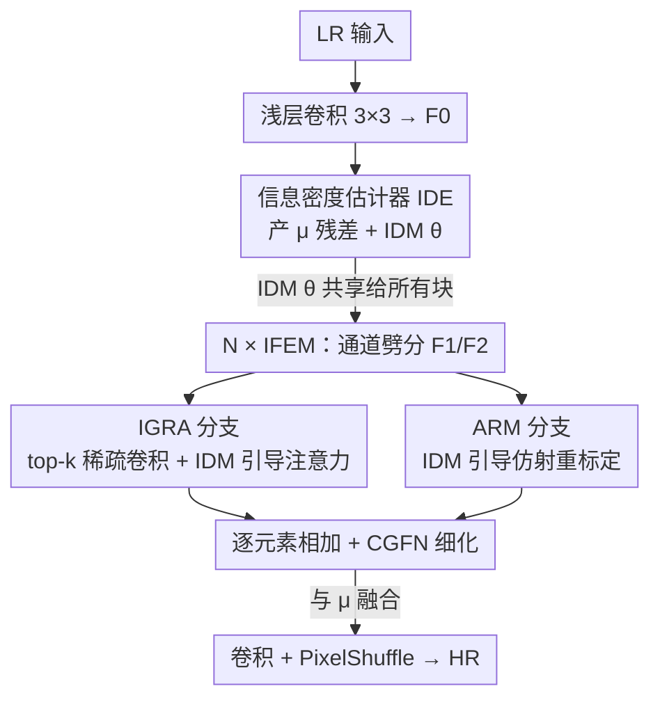

# IAFMNet: Information-Aware Feature Modulation for Efficient Super-Resolution

**会议**: CVPR 2026  
**论文**: [CVF Open Access](https://openaccess.thecvf.com/content/CVPR2026/html/Xu_IAFMNet_Information-Aware_Feature_Modulation_for_Efficient_Super-Resolution_CVPR_2026_paper.html)  
**代码**: 无（原文未提供）  
**领域**: 图像恢复 / 高效超分辨率  
**关键词**: 单图超分, 信息密度, 稀疏卷积, 自适应计算, 仿射调制  

## 一句话总结
IAFMNet 把"图像不同区域信息量不均"这件事用信息论量化成一张**信息密度图（IDM）**，再用它驱动一个稀疏卷积 + 仿射调制的双分支网络，把算力集中投到纹理/边缘等"难重建、信息密集"的区域，在更低 FLOPs 下取得比同量级高效超分方法更好的重建质量。

## 研究背景与动机

**领域现状**：单图超分（SISR）在真实平台上要兼顾画质与算力。为了"高效"，主流做法——无论是轻量 CNN（高效卷积算子、专家挖掘、特征调制）还是轻量 ViT（窗口注意力、语义 token 聚合）——基本都遵循同一种哲学：用一套**空间均匀**的策略，对图像每个像素/区域投入相同的计算与注意力。

**现有痛点**：这种"一视同仁"忽略了图像视觉复杂度的高度不均。下采样作为一个低通滤波器，会**不成比例地**削弱高频细节与边缘，而这些恰恰是携带最关键信息的区域。作者在 Urban100 上用 GT 与基线 SR 结果的绝对差异图（difference map）证实：重建误差明显集中在纹理复杂区，平坦区误差很小。在算力受限时还给平坦区分配同样多的计算，显然是浪费。

**核心矛盾**：高效超分要在"算力预算固定"与"误差集中在少数难区"之间做分配。既有的非均匀计算工作（基于经验 PSNR gap、局部梯度、学习的空间注意力）虽证明了非均匀计算有用，但它们的复杂度估计依赖**经验启发式或粗糙代理信号**，无法从原理上刻画"重建难度"。

**本文目标**：① 找到一个有原理依据、可解释的信号来定位"难重建区"；② 让网络据此把硬算力（计算）和软调制（注意力）都倾斜到这些区域。

**切入角度**：从信息论出发。一个信号 $x$ 携带的信息量是 $I(x)=-\log_2 p(x)$——越不可预测、出现概率越低的信号信息量越大、编码成本越高。作者把"量化特征的编码成本（rate cost）"直接解读为 SISR 的重建难度指标。

**核心 idea**：用无监督的**信息熵损失**估计逐像素的信息密度图 IDM，再以 IDM 同时指导"硬资源分配（稀疏卷积）"和"软特征调制（仿射重标定）"，实现性能与算力的更优权衡。

## 方法详解

### 整体框架
IAFMNet 是一条"先估密度、再按密度分配算力"的超分流水线。给定 LR 输入 $y$，先用一层 $3\times3$ 卷积提取浅层特征 $F_0$；接着送入**信息密度估计器（IDE）**，并行产出两样东西——均值图 $\mu$（后面当作残差特征）和核心引导信号 IDM $\theta$。$F_0$ 与共享的 $\theta$ 一起，穿过 $N$ 个**信息引导特征增强块（IFEB）**：每个 IFEB 内含一个 IFE 模块（IFEM）和一个通道门控前馈网络（CGFN）做逐级细化。最后一个 IFEB 的输出与 $\mu$ 融合，经轻量卷积 + PixelShuffle 上采样得到 HR 图像 $\hat{x}$。

IFEM 内部是本文真正发力的地方：输入特征先卷积扩通道，再沿通道劈成 $F_1,F_2$ 两路，分别送进 IGRA 分支（硬资源分配）和 ARM 分支（软仿射调制），两路输出逐元素相加融合。

### 关键设计

**1. 信息密度图 IDM：用无监督信息熵损失把"重建难度"量化出来**

痛点是既有非均匀计算方法用梯度、PSNR gap 这类粗糙代理来猜哪里难重建，没有原理依据。本文改从"编码成本即重建难度"出发：对浅层特征 $F$，先用注入均匀噪声的方式近似可微量化 $\hat{F}=Q(F)=F+U(-\tfrac12,\tfrac12)$，再用全因子分解密度模型假设每个量化元素 $\hat{F}_i$ 服从独立高斯 $\mathcal{N}(\mu_i,\theta_i^2)$，其概率为该高斯在量化区间 $[\hat{F}_i-\tfrac12,\hat{F}_i+\tfrac12]$ 上的积分（用标准高斯 CDF $\Phi$ 表示）。每个元素的编码成本取负对数似然，求和得到**信息熵损失**：

$$\mathcal{L}_{IE}=\sum_i R_{\hat{F}_i}=\sum_i -\log_2 p_{\hat{F}_i}(\hat{F}_i\mid \mu_i,\theta_i).$$

其中 $\mu,\theta$ 由两个"卷积 + GDN（广义除性归一化）"小模块从 $F$ 预测。最小化 $\mathcal{L}_{IE}$ 会逼网络学准密度模型并吐出一张空间变化的尺度图 $\theta$——这张图就是 IDM：高频纹理在浅层特征里出现概率低、编码成本高，因而在 IDM 上被高亮。作者还实测 IDM 优于 Sobel/Laplacian：传统梯度算子只对强边界响应（这些边其实容易重建），而 IDM 经熵建模能抓住低对比度的密集细节（毛发、杂乱背景），更贴近真实重建难度（IDM 引导比 Sobel 引导在 Urban100 高 0.15 dB）。

**2. 信息引导资源分配 IGRA：把硬算力只投到 top-k% 信息区**

这一分支解决"平坦区被浪费算力"的问题。它先从 IDM $\theta$ 里取信息量最高的 top-$k\%$ 空间位置生成二值掩码 $M=\mathcal{T}(\theta,k)$，得到稀疏特征 $F_{sparse}=M\odot F_1$；再用**子流形稀疏卷积（SSC）**处理。SSC 与普通稀疏卷积的区别在于它**不扩散**活跃区，只在 $M$ 标记的信息位上计算、严格保持稀疏模式：

$$F_{ssc}(p)=\begin{cases}\sum_{q\in N(p)}W(q-p)\cdot F_{sparse}(q)+F_1(p), & M(p)=1\\ F_1(p), & \text{otherwise}\end{cases}$$

这样平坦/冗余区被直接跳过，FLOPs 大幅下降。为了弥补硬阈值带来的信息损失，分支再叠一个**同样由 IDM 引导的轻量自注意力**：把 $F_{ssc}$ 与 IDM 各自下采样后相加、$1\times1$ 卷积、上采样得到注意力图 $A=\text{Upsample}(\text{Conv}_{1\times1}(F_D+\theta_D))$，再用 $F_{refined}=A\odot F_{ssc}$ 精修稀疏输出。消融显示 SSConv 在 Manga109 上带来 0.26 dB 增益、仅多 6 GFLOPs，而 5% 阈值就给出最佳性价比——印证"最关键信息集中在一小撮区域"的假设。

**3. 仿射重标定模块 ARM：用 IDM 做软的逐通道特征调制**

IGRA 是"硬分配"，ARM 则是它的互补——"软调制"，把 IDM 的引导隐式地编码进特征。给定 $F_2$，先 $1\times1$ 卷积扩通道再劈成两半：第一半与 IDM $\theta$ 沿通道拼接、过 $1\times1$ 卷积生成调制参数 $s=\text{Conv}_{1\times1}([\mathcal{S}(\text{Conv}_{1\times1}(F_2))[0],\theta])$；第二半用轻量深度卷积抽局部结构 $F_{local}=\text{DWConv}(\cdot)$。最后用信息感知的尺度对局部特征做重标定 $F_{ARM}=F_{local}\odot s$。仿射重标定本身在超分里是成熟做法，本文的增量在于**用 IDM 这个有原理依据的信息先验去引导它**：消融里只加仿射结构涨 0.07 dB，再用 IDM 引导又额外涨 0.06 dB，且几乎不增算力。

### 损失函数 / 训练策略
总损失为 $L=L_1+\lambda\mathcal{L}_{IE}$，即标准 $L_1$ 像素损失加上信息熵损失。训练用 DF2K（DIV2K+Flickr2K），bicubic 下采样造 LR，$64\times64$ patch + 翻转/旋转增广，Adam，batch 64，学习率从 $1\times10^{-3}$ 余弦退火到 $1\times10^{-5}$，共 1,000,000 次迭代，两张 RTX 4090。消融显示 $\lambda=10^{-4}$ 最佳。

## 实验关键数据

### 主实验
训练集 DF2K，评测 Set5 / Set14 / BSD100 / Urban100 / Manga109，指标为 Y 通道 PSNR/SSIM，FLOPs 统一按 $1280\times720$ HR 输出计。下表摘录纹理最复杂的 Urban100（PSNR/SSIM）对比同量级轻量方法：

| 方法 | Params | FLOPs | Urban100 ×2 | Urban100 ×3 | Urban100 ×4 |
|------|--------|-------|-------------|-------------|-------------|
| SAFMN | 228K | 52G | 31.84/0.9256 | 27.95/0.8474 | 25.97/0.7809 |
| SMFANet | 186K | 41G | 32.20/0.9282 | 28.22/0.8523 | 26.18/0.7862 |
| SeemoRe-T | 220K | 45G | 32.22/0.9286 | 28.27/0.8538 | 26.23/0.7883 |
| **IAFMNet (ours)** | 198–220K | 42/19/11G | **32.52/0.9312** | **28.48/0.8561** | **26.39/0.7891** |

×2 Urban100 较 SeemoRe-T 提升约 0.30 dB 且 FLOPs 更低；×4 Urban100 也以 26.39 领先。

与轻量 ViT 方法相比（IAFMNet-L 大版，×4）：

| 方法 | Params | FLOPs | Set5 | Urban100 | Manga109 |
|------|--------|-------|------|----------|----------|
| SRFormer-light | 873K | 63G | 32.51/0.8988 | 26.67/0.8032 | 31.17/0.9165 |
| CATANet | 535K | 41G | 32.58/0.8998 | 26.87/0.8081 | 31.31/0.9183 |
| **IAFMNet-L (ours)** | 519K | 28G | 32.57/0.8993 | 26.73/0.8038 | 31.39/0.9173 |

IAFMNet-L 用约 519K 参数 / 28G FLOPs（不到 SRFormer-light 的一半），在多数数据集上取得相当或更优的 PSNR，验证了信息引导策略比"空间均匀算子"更会花算力。

### 消融实验
| 配置 | Urban100 ×2 | Manga109 ×2 | 说明 |
|------|-------------|-------------|------|
| IDE：C+G，$\lambda=10^{-4}$（Full） | 32.52/0.9312 | 39.32/0.9792 | 完整设置 |
| IDE 去 GDN（仅 C） | 32.35/0.9287 | 39.11/0.9779 | 掉 0.17 dB，GDN 对密度建模关键 |
| IDM 换成 Sobel 引导 | 32.37/0.9290 | 39.14/0.9780 | 比学习的 IDM 低 0.15–0.18 dB |
| IGRA 去 SSConv（仅注意力） | 32.31/0.9284 | 39.06/0.9793 | SSConv 在 Manga109 贡献 0.26 dB |
| ARM 去 IDM 引导 | 32.45/0.9297 | 39.26/0.9787 | IDM 引导仿射额外 +0.06 dB |

### 关键发现
- **稀疏阈值越高画质越好，但 5% 性价比最佳**：5%/10%/20%/50% 阈值的 Urban100 在 32.52→32.58 间小幅波动，但 FLOPs 从 42G 升到 50G——说明关键信息确实高度集中，只需照顾一小撮区域。
- **GDN 不可省**：去掉 GDN 后掉 0.17 dB，因为缺了它密度建模就不准，IDM 随之失真。
- **硬+软互补**：IGRA（硬分配）与 ARM（软调制）分别独立增益，且都靠同一张 IDM 引导，证明"用一个有原理依据的信息先验同时驱动两种机制"是有效的统一设计。
- **IDM 比梯度算子更懂"难"**：Sobel 偏爱强边界（其实易重建），IDM 经熵建模能抓低对比密集纹理，更贴近真实误差分布。

## 亮点与洞察
- **把"重建难度"接到信息论上**：用量化特征的编码成本（rate cost）当难度指标，比 PSNR gap / 梯度等启发式更有原理依据，且无监督、可解释——这是本文最"啊哈"的地方。
- **一张 IDM 三处复用**：同一张密度图既做 IGRA 的硬掩码、又做注意力引导、还做 ARM 的仿射先验，设计上非常经济，避免了为每种机制单独学引导信号。
- **可迁移性**：IDM + 子流形稀疏卷积的"按需算力"范式，可迁移到去噪、去模糊等其它低层视觉任务，甚至检测/分割里"难区优先计算"的场景；用编码成本当难度代理也能给主动学习/课程学习提供信号。

## 局限与展望
- IDM 由浅层特征上的因子分解高斯密度估计而来，**高斯 + 全因子分解**假设可能在高度结构化纹理上不够精确（忽略空间相关性）；⚠️ 论文未深入分析该假设的失效边界。
- top-$k\%$ 是预设的固定稀疏率，未做图像自适应；不同内容/退化下"最优 $k$"可能不同，固定 5% 只是均值意义上的折中。
- 评测局限在 bicubic 退化的经典超分协议，未涉及真实复杂退化（盲超分）；信息密度估计在真实噪声/压缩伪影下是否仍能正确高亮"信息区"有待验证。
- 改进方向：把密度模型升级为带空间上下文的条件熵模型、让稀疏率随 IDM 统计自适应、把熵损失推广到盲超分。

## 相关工作与启发
- **vs SMFANet / SAFMN（特征调制类高效 CNN）**：它们也做特征调制，但调制是空间均匀的；本文用 IDM 把调制（ARM）和算力（IGRA）都做成空间非均匀，在相近参数/FLOPs 下 Urban100 明显更高。
- **vs 非均匀计算（PSNR gap / 局部梯度 / 学习注意力）**：同样想"难区多算"，但它们的难度代理是经验启发式；本文用信息熵给出原理化、可解释的难度图，消融里 IDM 引导稳定优于 Sobel 引导。
- **vs 轻量 ViT（SwinIR-light / SRFormer-light / CATANet）**：ViT 靠窗口/分组注意力降复杂度但仍偏均匀；IAFMNet-L 用更少参数/FLOPs 取得相当或更优画质，说明"按信息密度分配算力"比"统一压缩注意力"更省。

## 评分
- 新颖性: ⭐⭐⭐⭐⭐ 首次从信息密度（编码成本）视角增强 SISR 退化特征，把信息论难度估计落地成可用的引导信号
- 实验充分度: ⭐⭐⭐⭐ 五数据集 ×三尺度 + 三张组件消融 + IDM vs 梯度可视化，扎实；但只覆盖 bicubic 退化，缺真实退化/盲超分验证
- 写作质量: ⭐⭐⭐⭐ 动机—方法—消融逻辑清晰，公式与可视化到位
- 价值: ⭐⭐⭐⭐ 在高效超分上给出"性能-算力"更优解，且提供一个可迁移的"难区优先计算"范式

<!-- RELATED:START -->

## 相关论文

- [\[CVPR 2026\] Efficient INT8 Single-Image Super-Resolution via Deployment-Aware Quantization and Teacher-Guided Training](efficient_int8_single-image_super-resolution_via_deployment-aware_quantization_a.md)
- [\[CVPR 2026\] DNF-SR: Dual-Input and Negative-Aware Feature Fine-Tuning for Real-World Image Super-Resolution](dnf-sr_dual-input_and_negative-aware_feature_fine-tuning_for_real-world_image_su.md)
- [\[CVPR 2026\] AE2VID: Event-based Video Reconstruction via Aperture Modulation](ae2vid_event-based_video_reconstruction_via_aperture_modulation.md)
- [\[CVPR 2026\] Time-Aware One Step Diffusion Network for Real-World Image Super-Resolution](time-aware_one_step_diffusion_network_for_real-world_image_super-resolution.md)
- [\[CVPR 2026\] EMR-Diff: Edge-aware Multimodal Residual Diffusion Model for Hyperspectral Image Super-resolution](emr-diff_edge-aware_multimodal_residual_diffusion_model_for_hyperspectral_image_.md)

<!-- RELATED:END -->
