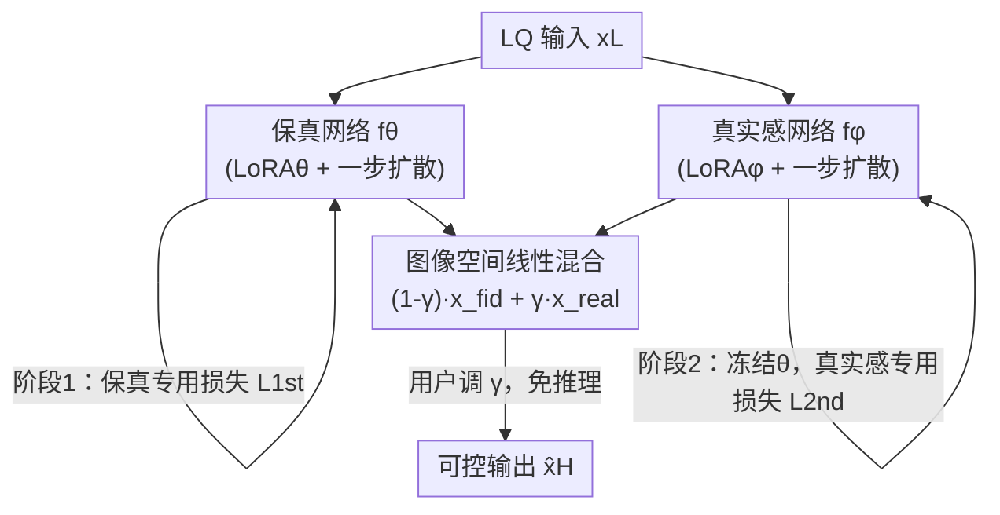

# IFCSR: Inference-Free Fidelity-Realism Control for One-Step Diffusion-based Real-World Image Super-Resolution

**会议**: CVPR 2026  
**论文**: [CVF Open Access](https://openaccess.thecvf.com/content/CVPR2026/html/Back_IFCSR_Inference-Free_Fidelity-Realism_Control_for_One-Step_Diffusion-based_Real-World_Image_Super-Resolution_CVPR_2026_paper.html)  
**代码**: 无（原文未提供）  
**领域**: 图像恢复 / 真实世界图像超分 / 扩散模型  
**关键词**: 真实世界超分, 一步扩散, 保真度-真实感控制, 免推理控制, 图像空间插值  

## 一句话总结
IFCSR 让"调保真度 vs 真实感"这件事从扩散模型的**隐空间**搬到**图像空间**——先用两个专精网络分别推一张保真图和一张真实感图，之后用户只需调一个参数 $\gamma$ 在图像空间线性混合两图，**不需要任何额外网络推理**就能在保真-真实谱上任意滑动。

## 研究背景与动机

**领域现状**：真实世界图像超分（real-world ISR）要在两个常常打架的目标间权衡——**保真度 fidelity**（输出与 HR 的相似度，靠 MSE 等重建损失提升）和**真实感 realism**（看起来自然/真实，靠 GAN、扩散等生成先验提升）。近年用预训练文生图模型（如 Stable Diffusion）当生成先验、并蒸馏成一步/少步扩散，已能高效产出真实感强的超分结果。

**现有痛点**：不同用户对"保真 vs 真实"的偏好不同，于是出现了**可控扩散超分**（PiSA-SR、OFTSR、CTSR、RCOD 等）。但它们几乎都在**隐空间**或扩散过程内部做控制：用两个模型、或用 timestep 当控制参数。问题是——**每调一次参数就要重新跑一遍前向**（VAE 解码器、SD UNet 等）。用户为了找到满意的折中点往往要反复试很多次，推理次数随调参次数**线性增长**。即便扩散从多步降到一步，单次推理仍然不便宜，导致"调参即推理"在实际产品里很不实用。

**核心矛盾**：可控性发生在隐空间 → 每个控制点都对应一次昂贵的网络前向；而用户体验需要的是"实时、连续地拖动滑块"。隐空间控制和交互式调参之间存在根本张力。

**本文目标**：① 把控制从隐空间挪到图像空间，使调参不再触发推理；② 让两个端点网络真的一个偏保真、一个偏真实，从而让中间的可控空间覆盖足够宽的保真-真实谱。

**切入角度**：如果保真端图像 $\hat{x}_H^{fid}$ 和真实感端图像 $\hat{x}_H^{real}$ 都已经在图像空间生成好了，那么二者的线性混合本身就是一张合法图像——混合这一步是纯像素加权，零网络评估。

**核心 idea**：训两个一步扩散网络（一个专保真、一个专真实感），推理时各出一张图，用 $\gamma$ 在**图像空间**线性插值；为了让端点真的"够专"，配一套两阶段训练 + 深度加权的专用损失。

## 方法详解

### 整体框架
IFCSR 的骨架是"两个专精的一步扩散网络 + 图像空间线性混合"。两个网络 $f_\theta$（保真）与 $f_\phi$（真实感）都以低质 LQ 图 $x_L$ 为输入，沿用一步扩散架构：VAE 编码器把 LQ 编进隐向量、SD UNet 做 LQ→HQ 隐空间变换（用残差学习）、VAE 解码器解回图像空间；两网各自挂一个可训练 LoRA（$\text{LoRA}_\theta$、$\text{LoRA}_\phi$）在冻结的 SD UNet 上。最终输出定义为两端输出的线性组合：

$$\hat{x}_H=(1-\gamma)f_\theta(x_L)+\gamma f_\phi(x_L)=(1-\gamma)\hat{x}_H^{fid}+\gamma\hat{x}_H^{real},\quad \gamma\in[0,1].$$

$\gamma\to0$ 偏高保真低真实感，$\gamma\to1$ 偏低保真高真实感。关键在于：一旦 $\hat{x}_H^{fid}$ 和 $\hat{x}_H^{real}$ 推好，调 $\gamma$ 只是图像加权，**免推理**。训练上分两阶段：先单独训保真网络 $f_\theta$，再冻住它训真实感网络 $f_\phi$；两阶段各配一种深度加权专用损失，把端点往各自目标上推。

### 关键设计

**1. 图像空间可控公式：把控制从隐空间挪到图像空间，换来免推理控制**

痛点是既有方法在隐空间/扩散内部控制，每调一次参数都要重跑 VAE 解码器 + SD UNet，推理次数随调参线性增长。IFCSR 的做法直白却关键：把保真端与真实感端的**最终图像**都先生成出来，再在图像空间做线性混合 $\hat{x}_H=(1-\gamma)\hat{x}_H^{fid}+\gamma\hat{x}_H^{real}$。因为混合发生在像素层、不经过任何网络，所以一次性推完两张端点图后，用户拖动 $\gamma$ 探索整个保真-真实谱的**推理次数恒为常数**（而非线性增长）。这是本文相对 PiSA-SR/CTSR 等隐空间控制方法最核心的实用性优势：交互式调参终于变成"实时滑块"。

**2. 两阶段训练：让两个端点网络真的一个专保真、一个专真实感**

只靠公式 (1) 还不够——如果直接对 $\gamma\sim U(0,1)$ 整段做 $\arg\min_{\theta,\phi}\mathbb{E}_\gamma[\mathcal{L}(\hat{x}_H,x_H)]$ 联合优化，缺少显式的专精机制，两端不会自然分化，可控空间也对不齐保真-真实谱。本文改用**解耦的两阶段**：阶段 1 只训保真网络 $f_\theta$，此时 $f_\phi$ 还没训，令 $\gamma=0$，目标是 $\hat{\theta}=\arg\min_\theta \mathcal{L}_{1st}(\hat{x}_H^{fid},x_H)$；阶段 2 训真实感网络 $f_\phi$，**冻结 $\theta$**，此时按 $\gamma\sim U(0,1)$ 采样、对混合输出 $\hat{x}_H$ 监督 $\hat{\phi}=\arg\min_\phi\mathbb{E}_{\gamma\sim U(0,1)}[\mathcal{L}_{2nd}(\hat{x}_H,x_H)]$。先训保真是因为"提保真"（最小化重建损失）比"提真实感"容易，作为更稳的锚点；阶段 2 在保真端固定的前提下用随机 $\gamma$ 学真实感端，能把学到的可控空间**对齐到保真-真实谱**。消融证实：单阶段会与谱错位，两阶段才开始对齐。

**3. 深度加权的保真/真实感专用损失：把可控谱拉宽**

光有两阶段、但两阶段都用同一个 LPIPS+MSE 基线损失的话，谱会很窄——因为基线损失没有显式偏向保真或真实感。本文基于一个观察：预训练网络（如 VGG）的**浅层抓低级结构（边、色），深层抓高级语义**。于是对 LPIPS 的逐层特征距离 $\mathcal{D}(\hat{x}_H,x_H,l)$ 做**深度相关加权**：

$$\mathcal{L}_s(\hat{x}_H,x_H;w)=\frac{1}{\sum_{j=0}^{L}w_j}\sum_{l=0}^{L}w_l\,\mathcal{D}(\hat{x}_H,x_H,l).$$

保真训练（阶段 1）用**单调递减**权重 $w_l^{dec}=k^{L-l}$ 强调浅层（结构对齐 → 保真）；真实感训练（阶段 2）用**单调递增**权重 $w_l^{inc}=k^{l-1}$ 强调深层（语义/感知 → 真实感）。$k\ge1$ 控制增减速率，$k=1$ 时退化成 LPIPS+MSE 基线。两阶段损失即 $\mathcal{L}_{1st}=\mathcal{L}_s(\cdot;w^{dec})$、$\mathcal{L}_{2nd}=\mathcal{L}_s(\cdot;w^{inc})$。消融显示：把专用损失加进两阶段训练能**显著拓宽**保真-真实谱。代价是该损失会放大 LPIPS 这个特征空间保真指标在不同 $\gamma$ 下的**非单调**行为（作者明确承认）。

### 损失函数 / 训练策略
4× ISR，训练集 FFHQ（前 1 万张）+ LSDIR（约 8.5 万张），按 Real-ESRGAN 退化造 LQ-HQ 对，$512\times512$ patch。底座为 Stable Diffusion v2.1-base，所有 LoRA rank=4，用空提示。两阶段都用 AdamW（$\beta_1=0.9,\beta_2=0.999$）、batch 4、学习率 5e-5；专用损失里 $k=7$、用 VGG 算特征距离。每阶段约 24 小时、两阶段共 48 小时（单张 H100）。

## 实验关键数据

### 主实验
评测 RealSR / DRealSR（真实场景）与 DIV2K-val（合成），LR 128→512 bicubic 上采样当 LQ。保真指标 PSNR/SSIM/LPIPS/DISTS，真实感指标 NIQE/MUSIQ/MANIQA/CLIPIQA，另测 FID。下表摘录 RealSR 上 $\gamma$ 三档与代表性一步方法对比：

| 方法 | 步数 | PSNR ↑ | SSIM ↑ | LPIPS ↓ | NIQE ↓ | CLIPIQA ↑ |
|------|------|--------|--------|---------|--------|-----------|
| OSEDiff | 1 | 25.15 | 0.7341 | 0.2921 | 5.64 | 0.6685 |
| TSD-SR | 1 | 24.81 | 0.7172 | 0.2743 | 5.13 | 0.7158 |
| PiSA-SR | 1 | 25.50 | 0.7418 | 0.2672 | 5.50 | 0.6701 |
| **Ours ($\gamma=0.0$)** | 1 | **28.00** | **0.7975** | 0.2921 | 7.90 | 0.3337 |
| **Ours ($\gamma=0.5$)** | 1 | 25.14 | 0.7055 | 0.2866 | 5.43 | 0.6522 |
| **Ours ($\gamma=1.0$)** | 1 | 22.10 | 0.6075 | 0.3502 | **4.90** | **0.7011** |

$\gamma=0.0$ 在参考指标（PSNR/SSIM）上取得最高保真；$\gamma=1.0$ 在无参考指标（NIQE/CLIPIQA）上拿到最强真实感；$\gamma=0.5$ 给出全指标都有竞争力的平衡结果。DRealSR 上趋势一致（如 $\gamma=0.0$ PSNR 30.86、$\gamma=1.0$ NIQE 5.70/CLIPIQA 0.7446）。

### 消融实验
RealSR 上 $\gamma$ 扫描验证可控性（部分档位）：

| $\gamma$ | PSNR ↑ | SSIM ↑ | LPIPS ↓ | NIQE ↓ | MUSIQ ↑ | CLIPIQA ↑ |
|----------|--------|--------|---------|--------|---------|-----------|
| 0.0 | 28.00 | 0.7975 | 0.2921 | 7.89 | 47.64 | 0.3329 |
| 0.2 | 27.34 | 0.7764 | 0.2540 | 6.26 | 61.58 | 0.5093 |
| 0.4 | 25.89 | 0.7297 | 0.2726 | 5.64 | 68.73 | 0.6244 |
| 0.6 | 24.41 | 0.6825 | 0.3008 | 5.24 | 70.12 | 0.6711 |
| 0.8 | 23.13 | 0.6416 | 0.3275 | 4.98 | 70.36 | 0.6913 |
| 1.0 | 22.10 | 0.6075 | 0.3501 | 4.90 | 70.29 | 0.7008 |

两阶段 + 专用损失的有效性（Fig.7 定性，三组对比）：

| 配置 | 谱宽 / 对齐 | 说明 |
|------|-----------|------|
| 单阶段 + 基线损失 | 与谱错位 | 缺专精，端点不分化 |
| 两阶段 + 基线损失 | 开始对齐但谱窄 | 基线损失未偏向任一目标 |
| 两阶段 + 专用损失（Full） | 谱明显变宽 | 深度加权强化端点专精 |

### 关键发现
- **$\gamma$ 单调可控**：随 $\gamma$ 从 0→1，PSNR/SSIM 单调下降、NIQE/MUSIQ/CLIPIQA 单调改善（仅 MUSIQ 在 $\gamma=1.0$ 与 0.8 持平），说明图像空间插值确实给出连续可控的保真-真实过渡。
- **特征空间保真指标 LPIPS 非单调**：LPIPS 在不同 $\gamma$ 下呈现不一致权衡，作者归因于深度加权专用损失放大了这一现象——这是"拓宽谱"换来的副作用。
- **两阶段 + 专用损失缺一不可**：单阶段与谱错位，两阶段但用基线损失谱太窄，只有两阶段配专用损失才既对齐又够宽。
- **实用性优势可量化**：相比隐空间控制方法每次调参都要重推，IFCSR 调参推理次数恒定，画质却与 SOTA 可控方法 PiSA-SR 相当。

## 亮点与洞察
- **"把控制点前移到图像空间"是一招以简驭繁**：核心公式只是一行线性插值，却把"可控性 = 反复推理"这个老问题直接解耦成"两次推理 + 任意次免费混合"，工程实用性极高。
- **用 VGG 层深当"保真/真实感"的旋钮**：浅层→结构→保真、深层→语义→真实感，用单调递增/递减权重把同一套 LPIPS 改造成两个方向相反的专用损失，思路巧且可复用。
- **可迁移性**：图像空间端点混合 + 两阶段专精损失，可迁移到任何存在"两个对立质量目标"的恢复/生成任务（去噪 vs 细节、风格 vs 内容、压缩伪影去除 vs 锐度），都能换来免推理的连续可控。

## 局限与展望
- **失败案例**：当保真端图 $\hat{x}_H^{fid}$ 与真实感端图 $\hat{x}_H^{real}$ 在结构上差异很大时，线性混合会产生结构错位/重影（作者 Fig.8 明确给出）——图像空间混合假设两端"结构基本对齐"，强退化下该假设可能不成立。
- **LPIPS 非单调**：专用损失放大了特征空间保真指标的非单调行为，意味着"谱宽"和"指标单调性"之间存在 trade-off。
- 需要两次端点推理与两阶段（共约 48 小时）训练、且依赖 SD v2.1 底座；端点数固定为 2（保真/真实感两极），暂不支持沿其它质量维度（如锐度/色彩）扩展更多控制轴。
- 改进方向：约束两端结构一致性（如共享结构、对齐后再混合）以消除重影、用更鲁棒的特征空间指标缓解非单调、把"图像空间端点混合"推广到多于两个端点的多维可控。

## 相关工作与启发
- **vs PiSA-SR**：同样用两个（LoRA）模型做保真-真实控制，但 PiSA-SR 在**隐空间**插值、每调一次要重跑网络；IFCSR 在**图像空间**混合、调参免推理，画质相当但实用性更强。
- **vs OFTSR / CTSR / RCOD（timestep 控制）**：它们用扩散内部的 timestep 当控制参数，控制点都绑在推理过程上；IFCSR 把控制彻底移出网络，推理次数与调参次数解耦。
- **vs OSEDiff / TSD-SR（一步扩散但不可控）**：这些方法高效但不给用户调"保真 vs 真实感"的旋钮；IFCSR 在一步扩散基础上补上了连续、免推理的可控性。

## 评分
- 新颖性: ⭐⭐⭐⭐ "图像空间端点混合 → 免推理控制"角度新颖实用，但单条核心公式相对简单
- 实验充分度: ⭐⭐⭐⭐ 三数据集、多保真/真实感指标、$\gamma$ 全扫描 + 两阶段/损失消融充分；失败案例与非单调现象也诚实披露
- 写作质量: ⭐⭐⭐⭐⭐ 动机（推理次数线性 vs 常数）讲得极清楚，图 2/3 把机制差异一目了然
- 价值: ⭐⭐⭐⭐ 把可控超分的交互成本从"线性推理"降到"常数推理"，对真实产品体验价值明显

<!-- RELATED:START -->

## 相关论文

- [\[CVPR 2026\] One-Step Diffusion Transformer for Controllable Real-World Image Super-Resolution](one-step_diffusion_transformer_for_controllable_real-world_image_super-resolutio.md)
- [\[CVPR 2026\] Time-Aware One Step Diffusion Network for Real-World Image Super-Resolution](time-aware_one_step_diffusion_network_for_real-world_image_super-resolution.md)
- [\[CVPR 2026\] Bridging Fidelity-Reality with Controllable One-Step Diffusion for Image Super-Resolution](bridging_fidelity-reality_with_controllable_one-step_diffusion_for_image_super-r.md)
- [\[CVPR 2026\] FiDeSR: High-Fidelity and Detail-Preserving One-Step Diffusion Super-Resolution](fidesr_high-fidelity_and_detail-preserving_one-step_diffusion_super-resolution.md)
- [\[CVPR 2026\] Language-Guided One-Step Diffusion Model for Nighttime Flare Removal](language-guided_one-step_diffusion_model_for_nighttime_flare_removal.md)

<!-- RELATED:END -->
