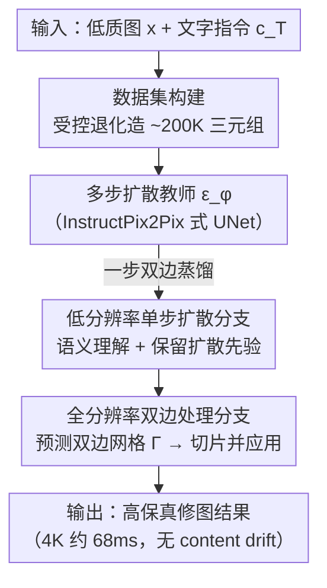

# InstantRetouch: Efficient and High-Fidelity Instruction-Guided Image Retouching with Bilateral Space

**会议**: CVPR 2026  
**论文**: [CVF Open Access](https://openaccess.thecvf.com/content/CVPR2026/html/Wu_InstantRetouch_Efficient_and_High-Fidelity_Instruction-Guided_Image_Retouching_with_Bilateral_Space_CVPR_2026_paper.html)  
**代码**: https://openimaginglab.github.io/InstantRetouch/ （项目页）  
**领域**: 图像修复增强 / 指令引导修图 / 扩散蒸馏 / 双边网格  
**关键词**: 语言引导修图, 双边网格, 一步蒸馏, 变分分数蒸馏, 内容保真

## 一句话总结
InstantRetouch 把语言引导的照片修图从"直接编辑像素/latent"换成"在紧凑、内容解耦的双边空间里只预测一套仿射变换网格"，再用变分分数蒸馏把多步扩散教师蒸馏成单步生成器，从而在 4K 上做到 68ms 出图、比扩散基线快 70–900 倍，同时几乎不改动原图内容（无 content drift）。

## 研究背景与动机
**领域现状**：语言引导修图（按自然语言调色调、出风格）相比传统增强算法能给出更细粒度、更有表现力的控制。近来 Step1X-Edit、FLUX.1-Kontext、Qwen-Image、Gemini-2.5-Flash 等大扩散编辑模型做通用编辑（加/删物体）效果惊艳，几乎以假乱真。

**现有痛点**：把这些通用编辑模型用到**修图**上有两个硬伤。① **保真度**：修图本应只做光度调整（亮度、色彩、色调），不能动几何与纹理，但生成式编辑模型无法很好解耦这些编辑，常出现 content drift——把内容、纹理甚至人脸都改了；② **效率**：它们基于迭代扩散，计算昂贵、推理慢，高分辨率修图尤其吃不消，很多模型甚至原生处理不了 1K 以上。

**核心矛盾**：根因在于生成式编辑**直接修改输入图的变分 latent**，而 latent 同时编码了"实际内容"和"光度信息"。修图只需要后者，前者既冗余（拖慢速度）又危险（一动就可能改内容/纹理/几何）。修图本应只在一个**只关乎视觉外观、不含内容信息的更小表示**上操作。

**本文目标**：找一个紧凑且内容解耦的表示来承载修图，并且仍能借助扩散模型的强语义先验来"听懂指令出好看的结果"，同时把多步扩散的慢推理压成单步。

**切入角度**：用**双边空间**——一张低分辨率的 3D 双边网格（bilateral grid）来存局部仿射变换，再用一张学习到的引导图把网格切片、应用到全分辨率原图上。这套表示在 4K 下也极其高效，且**因设计而保真**（只做仿射调色，不碰内容）。但双边空间本身不会"听指令"，所以还要把扩散先验蒸馏进来。

**核心 idea**：用"双边网格表示 + 双分支单步生成器 + 一步双边蒸馏（VSD + 提示对齐损失 + 渐进式两阶段训练）"，把多步扩散教师压成一个直接预测双边网格的单步学生，鱼与熊掌兼得。

## 方法详解

### 整体框架
方法把一个多步扩散教师蒸馏成一个直接预测双边网格的快速单步生成器 $G_\theta$。整条管线分两大阶段：先构造一个约 20 万三元组 $(x, x^\star, c_T)$（输入图、修好的目标图、文字指令）的大规模高质量修图数据集，并用它微调一个多步扩散教师 $\epsilon_\phi$；再把教师知识蒸馏进单步双边网格生成器。生成器 $G_\theta$ 由两条协同分支组成：**低分辨率单步扩散分支**负责语义理解、保留扩散先验，**全分辨率双边处理分支**用轻量 bilateral adapter 预测出双边网格、再"切片并应用"到高分辨率原图上输出最终结果。训练采用渐进式策略：先单独训低分支（VSD + 数据损失 + 提示对齐损失），再联合训两条分支并加上双边损失。

### 关键设计

**1. 双边空间表示：把修图压进一张低分辨率仿射网格，按设计就保真又高效**

修图不该去动整张图的内容，于是模型不直接编辑像素或 latent，而是预测一张低分辨率的 3D 双边网格 $\Gamma \in \mathbb{R}^{H_g \times W_g \times D \times 12}$，每个格子存一套局部仿射变换参数。应用时用一个全可微的"切片并应用"算子：对全分辨率输入的每个像素 $(x', y')$、颜色 $(r,g,b)$，先用学习到的查找表算出灰度引导值 $z=g(r,g,b)$，再用空间坐标与引导值对网格做三线性插值取出仿射矩阵 $A=\Gamma(x'W_g/W,\, y'H_g/H,\, z/d)$，最后 $O = A\cdot(r,g,b,1)^T$ 得到输出色。因为只做仿射调色、不重绘内容，几何与纹理天然被保住；又因为重活都在低分辨率网格上、全分辨率算子开销可忽略，低分支延迟还与分辨率无关，于是 4K 出图仅 68ms，而扩散方法处理 720p 都要 10s 以上。

**2. 双分支单步生成器：低分扩散管语义、全分双边管保真，二者协同**

光有双边空间不会"听指令"，所以生成器 $G_\theta$ 设计成两条协同分支。低分辨率分支含一个冻结的 VAE 编码器 $E_\theta$ 和一个单步 U-Net 去噪器 $\epsilon_\theta$，负责语义理解并保留扩散先验：它直接对白噪声 $z_{t_{max}}\sim\mathcal N(0,I)$ 做单步去噪（条件为输入图 latent $c_I=E_\theta(x)$ 与指令 $c_T$），得到 $\hat z_0 = (z_{t_{max}} - \beta_t\epsilon_\theta)/\alpha_t$；训练时临时用 VAE 解码器出一张低分图 $\hat x$ 稳定蒸馏，推理时不用解码器。全分辨率分支是轻量 bilateral adapter，单次前向就吐出双边网格 $\Gamma$，再用上面的切片-应用算子作用到高分原图。这条双分支把"扩散的语义强项"和"双边的结构保真强项"合在一起——消融显示纯双边网格预测保真极高（SSIM 0.996）但不会听指令（O 仅 6.09），纯扩散听指令好但保真差，唯有双分支同时拿下两者。

**3. 一步双边蒸馏：用 VSD + 提示对齐损失把多步教师压成单步，并用渐进式两阶段训练稳住**

学生（单步双边）与教师（多步扩散）结构差异大，蒸馏不稳，论文提出渐进式蒸馏。核心目标是**潜空间变分分数蒸馏（VSD）**（沿用 DMD）：引入一个在学生生成分布上微调的可训练正则器 $\epsilon_{\phi'}$，对学生输出 $\hat z_0$ 加噪得 $\hat z_t$，VSD 梯度为 $\mathbb{E}\big[\omega(t)\,(\epsilon_\phi(\hat z_t)-\epsilon_{\phi'}(\hat z_t))\,\partial\hat z_0/\partial\theta\big]$，把学生推向教师；同时 $\epsilon_{\phi'}$ 用学生自身样本并行更新以保持是忠实代理。但把多步编辑器压成单步会**削弱指令耦合**——在"更梦幻""更温暖"这类弱、风格化指令下易产出"看似合理但跑偏"的结果。为此加**提示对齐损失** $\mathcal L_{align}$：用规则匹配器把指令拆成若干原子修图属性（如 `brightness:up`、`temperature:warm`、`style:vintage`），每个属性配一对正负文本提示，用冻结 CLIP 算图文余弦相似度并以 InfoNCE 形式 $\ell_{nce}(a)=-\log\frac{\exp(s^+_a/\tau)}{\exp(s^+_a/\tau)+\exp(s^-_a/\tau)}$ 提供方向性监督，恢复被步数压缩丢掉的指令对齐。此外有数据损失 $\mathcal L_{data}=\|\hat x - x^\star\|_2^2 + \lambda_{LPIPS}\mathcal L_{LPIPS}$ 稳住低分输出，以及双边损失 $\mathcal L_{bila}$（$\ell_1$/LPIPS 对齐 GT、与低分预测一致项、网格 3D 拉普拉斯平滑、防 RGB 溢出软惩罚）训全分分支。训练分两阶段渐进：**阶段一**只训低分分支（$\mathcal L_{stage1}=\mathcal L_{data}+\lambda_{VSD}\mathcal L_{VSD}+\lambda_{align}\mathcal L_{align}$），**阶段二**解冻 bilateral adapter 端到端联合训并加双边损失（$\mathcal L_{stage2}=\mathcal L_{stage1}+\lambda_{bila}\mathcal L_{bila}$）；VSD 还配一个从高噪到低噪的渐进时间步课程，先学色调/曝光等粗属性再蒸馏细色彩。

**4. 受控退化构造修图数据集：用"先有好图、再造退化输入"反推 20 万三元组**

现有指令编辑数据多是物体级/几何编辑，缺高保真修图样本。本文反向构造约 20 万三元组：先用无参考质量指标 MUSIQ 与 LAION 美学分以保守阈值从公开数据/网络筛出高质量目标 $x^\star$；再对每个目标用 photo-finishing 流水线做随机光度退化（曝光、gamma、白平衡、对比度、色调曲线、饱和度、阴影/高光、HSL）合成退化输入 $x$，并用 Grounding-SAM 生成区域掩码、在不同掩码内施加不同退化参数以模拟局部修图；最后用多模态 LLM（Qwen2.5-VL-72B）以角色扮演模板对 $(x,x^\star)$ 生成简洁多样的修图指令 $c_T$，再用规则检查器保证多样性并过滤"改内容"的动词。这套"先好后坏再生成指令"的可控管线，保证了三元组里输入到目标只差光度、不差内容，正契合修图"非破坏性"的本质。

### 损失函数 / 训练策略
总目标见关键设计 3：阶段一 $\mathcal L_{stage1}=\mathcal L_{data}+\lambda_{VSD}\mathcal L_{VSD}+\lambda_{align}\mathcal L_{align}$，阶段二再加双边损失 $\mathcal L_{stage2}=\mathcal L_{stage1}+\lambda_{bila}\mathcal L_{bila}$。训练在 512px、用 AdamW + EMA + 混合精度 + 梯度裁剪；推理为单次前向，出网格后直接作用到原生分辨率，延迟与图像尺寸无关。

## 实验关键数据

**自定义/采用指标说明**：
- **内容保真**：SSIM、CW-SSIM（几何与纹理失真）、GMSD（梯度幅值一致性）、DISTS（纹理相似度）；评测时把输出转灰度并对输入做直方图匹配，以排除有意的色调变化、只看结构是否被破坏。
- **编辑质量**：SC（指令-图像对齐，0–10，由 GPT-4o 给）、PQ（感知质量，0–10）、综合分 $O=\sqrt{SC\times PQ}$。
- **效率**：720p–4K 端到端时延（开源模型在 8×RTX 4090 上测，闭源按 API 端到端时延）。

### 主实验
iRetouch 基准上的对比（节选自 Table 1；空白表示模型无法处理高分辨率或非指令驱动）：

| 方法 | 720p 时延(s)↓ | 4K 时延(s)↓ | SSIM↑ | DISTS↓ | O↑ |
|------|--------------|------------|-------|--------|-----|
| 3DLUT | 0.066 | 0.201 | 0.982 | 0.024 | —（非指令） |
| Qwen-Image | 7.720 | — | 0.689 | 0.147 | 8.39 |
| FLUX.1-Kontext-Pro | 10.235 | — | 0.802 | 0.132 | 8.12 |
| GPT-Image-1 | 15.427 | — | 0.505 | 0.216 | 8.32 |
| Gemini-2.5-Flash | 14.440 | — | 0.676 | 0.115 | **8.74** |
| **Ours** | **0.065** | **0.068** | **0.989** | **0.022** | 8.54 |

结论：本方法在 720p–4K 全程保持约 0.065–0.068s 的近常数时延，比生成式基线快 70–900 倍；内容保真（SSIM 0.989、DISTS 0.022）在所有指令驱动方法中最高；编辑质量综合分 8.54 紧追最强闭源 Gemini-2.5-Flash（8.74），远超其它开源编辑器。

### 消融实验
框架消融（来自 Table 2）：

| 配置 | 时延(s)↓ | SSIM↑ | O↑ | 说明 |
|------|---------|-------|-----|------|
| Bilateral Grid Prediction | 0.001 | **0.996** | 6.09 | 纯双边、无扩散先验：保真满分但不听指令 |
| Teacher（多步扩散） | 4.602 | 0.833 | 8.33 | 质量高但慢、保真低 |
| Hybrid（教师特征+双边） | 0.065 | 0.904 | 6.56 | 折中但两头都不够好 |
| Student（仅扩散） | 0.319 | 0.788 | 8.64 | 听指令最好但保真最差 |
| **Ours（双分支全模型）** | 0.065 | **0.989** | 8.54 | 同时拿下高保真与高质量 |

蒸馏损失消融（来自 Table 3）：

| 损失配置 | SC↑ | PQ↑ | O↑ |
|----------|-----|-----|-----|
| $\mathcal L_{base}$ | 5.978 | 8.280 | 7.036 |
| $\mathcal L_{base}+\mathcal L_{VSD}$ | 7.257 | 9.013 | 8.087 |
| $\mathcal L_{base}+\mathcal L_{VSD}+\mathcal L_{align}$ | **8.140** | 8.984 | **8.553** |

### 关键发现
- **保真与质量本是 trade-off，双分支才打破**：纯双边保真 0.996 却不听指令（O 6.09），纯扩散听指令好却保真崩（SSIM 0.505–0.833）；双分支同时拿到 SSIM 0.989 与 O 8.54，验证"扩散管语义、双边管结构"的分工。
- **VSD 和提示对齐损失缺一不可**：只用 base 时 O 仅 7.036，加 VSD 升到 8.087，再加 $\mathcal L_{align}$ 把 SC 从 7.257 提到 8.140、O 到 8.553——提示对齐专治弱/风格化指令下的"跑偏"。
- **效率优势随分辨率拉大**：多数扩散基线连 1K 以上都处理不了，而本方法 4K 仍是常数时延 68ms，这是双边表示把重活留在低分网格的直接结果。
- 用户研究（30 人、20 例、4 维度）与 PPR10K 人像身份保持（FaceNet 余弦相似度）上本方法均居首，佐证"无伪影、不改身份"的修图体验。

## 亮点与洞察
- **"修图只需调色、不需重绘"被落到表示层**：用低分双边仿射网格代替像素/latent 编辑，把"内容保真"从靠损失约束变成"按设计就成立"，这是又快又不漂移的根因。
- **把扩散先验"蒸"进非扩散表示**：教师是多步扩散、学生是双边网格，结构截然不同却用 VSD + 渐进两阶段成功蒸馏，提供了"扩散先验可迁移到任意高效表示"的范例。
- **提示对齐损失把弱指令拆成原子属性**：用规则匹配 + CLIP InfoNCE 给"更梦幻/更温暖"这类方向性指令提供稳定可加的监督，是对"步数压缩丢失指令耦合"的精准补救，可迁移到其它一步蒸馏编辑任务。
- **数据集"先好后坏"反向构造**：用受控光度退化造输入，天然保证三元组只差光度，比正向编辑数据更契合非破坏性修图。

## 局限与展望
- 本质只做**光度/调色**类编辑，仿射双边网格无法表达需要改结构/几何/重绘的编辑，超出修图范畴的指令做不了。
- 强依赖外部大模型构造数据（Qwen2.5-VL-72B 出指令、Grounding-SAM 出掩码）与评测（SC/PQ 由 GPT-4o 给分），存在数据偏置与评估器偏差 ⚠️（以原文为准）。
- 教师质量上限受所用预训练 Stable Diffusion 编辑器约束；对极强语义/局部精细编辑，单步学生与多步教师仍有差距（O 8.54 vs 8.74）。
- 训练流程较复杂（两阶段 + VSD 时间步课程 + 多项损失加权），超参与稳定性调试成本不低。

## 相关工作与启发
- **vs FLUX.1-Kontext / Qwen-Image / Gemini-2.5-Flash（大扩散编辑模型）**：它们直改 latent，通用编辑强但修图会 content drift 且慢（10–15s）；本方法在双边空间只调色，4K 68ms、保真 SSIM 0.989，避免内容漂移。
- **vs 3DLUT / RSFNet（传统增强）**：它们快但风格固定、非指令驱动、无法语义对齐；本方法兼具传统增强的速度与生成式的指令可控性。
- **vs InstructPix2Pix / Step1X-Edit（指令编辑）**：本方法借鉴其指令-图像配对/教师训练范式，但把多步扩散蒸成单步双边生成器，速度快两个数量级且保真大幅提升。
- **vs HDRNet 式双边网格上采样**：本方法把经典双边网格从"固定增强算子"升级为"由扩散先验蒸馏、可听指令"的可学习表示，是双边空间与生成式语义的结合。

## 评分
- 新颖性: ⭐⭐⭐⭐⭐ 把双边空间与扩散先验蒸馏结合，用一步双边生成器同时解决修图的保真与效率两大痛点，表示层设计很巧。
- 实验充分度: ⭐⭐⭐⭐⭐ 自建 iRetouch 基准 + 框架/损失双消融 + 用户研究 + PPR10K 身份保持，覆盖保真/质量/效率三轴。
- 写作质量: ⭐⭐⭐⭐ 动机与双分支机制讲得清楚、公式完整；损失与训练阶段较多，初读需要梳理。
- 价值: ⭐⭐⭐⭐⭐ 4K 常数时延 + 无内容漂移的指令修图对实际产品落地价值很高，思路也可迁移到其它高效编辑任务。

<!-- RELATED:START -->

## 相关论文

- [\[CVPR 2026\] FiDeSR: High-Fidelity and Detail-Preserving One-Step Diffusion Super-Resolution](fidesr_high-fidelity_and_detail-preserving_one-step_diffusion_super-resolution.md)
- [\[CVPR 2026\] Efficient INT8 Single-Image Super-Resolution via Deployment-Aware Quantization and Teacher-Guided Training](efficient_int8_single-image_super-resolution_via_deployment-aware_quantization_a.md)
- [\[CVPR 2026\] MMDIR: Multimodal Instruction-Driven Framework for Mixed-Degradation Document Image Restoration](mmdir_multimodal_instruction-driven_framework_for_mixed-degradation_document_ima.md)
- [\[CVPR 2026\] Statistical Characteristic-Guided Denoising for Rapid High-Resolution Transmission Electron Microscopy Imaging](statistical_characteristic-guided_denoising_for_rapid_high-resolution_transmissi.md)
- [\[CVPR 2026\] DetectSCI: Toward Object-Guided ROI Reconstruction for High-Resolution Video Snapshot Compressive Imaging](detectsci_toward_object-guided_roi_reconstruction_for_high-resolution_video_snap.md)

<!-- RELATED:END -->
