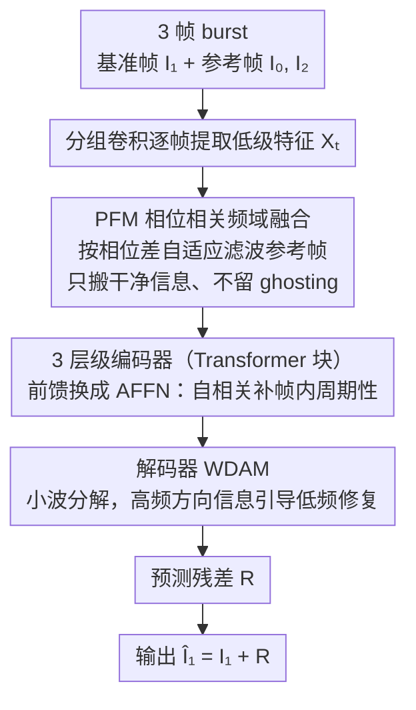

# Flickerformer: A Duet of Periodicity and Directionality for Burst Flicker Removal

**会议**: CVPR 2026  
**arXiv**: [2603.22794](https://arxiv.org/abs/2603.22794)  
**代码**: [GitHub](https://github.com/qulishen/Flickerformer)  
**领域**: 图像恢复  
**关键词**: Burst Flicker Removal, Phase Correlation, Autocorrelation, Wavelet Attention, Transformer

## 一句话总结

揭示闪烁伪影具有周期性和方向性两个内在物理特性，设计Flickerformer三模块（PFM/AFFN/WDAM）分别针对帧间/帧内周期性和方向性建模，以3.92M参数量在BurstDeflicker基准上达到31.226dB PSNR，超越第二名AST +0.580dB且仅用其19.70%参数。

## 研究背景与动机

**领域现状**：在交流电（AC）驱动的人工光源下拍摄短曝光图像时，光源强度随AC频率周期性振荡，加上现代相机rolling shutter的逐行曝光机制，导致图像出现条纹状亮度波动——即闪烁伪影（flicker artifacts）。这种伪影不仅降低感知质量，还影响下游视觉任务（HDR成像、慢运动视频、运动捕捉等）。

**现有痛点**：传统方法依赖硬件传感器调整曝光（但引入运动模糊）或假设已知光源参数（受限于可控场景）。近年深度学习方法（DeflickerCycleGAN、BurstDeflicker基准方法）**将闪烁视为通用图像退化**，直接套用去噪/去模糊/HDR框架，完全忽略闪烁的物理结构特性。

**核心矛盾**：闪烁不是随机噪声，而是一种**结构化退化**——具有特定的空间-时间模式。通用修复框架无法捕捉这些模式，导致闪烁抑制不充分，且在多帧融合时引入ghosting伪影。

**本文目标**：首次将闪烁的物理先验嵌入深度网络，设计针对闪烁结构特性的专用架构，在有效去除闪烁的同时避免ghosting。

**切入角度**：作者发现闪烁伪影具有两个可利用的内在特性——（1）**周期性**：闪烁条纹在空间和时间上呈重复模式，且交换两帧的相位分量会交换闪烁的空间分布，说明相位编码了闪烁位置信息；（2）**方向性**：由于rolling shutter逐行扫描，闪烁条纹沿扫描方向（水平/垂直）排列，产生方向性的高频亮度振荡和低频暗带。

**核心 idea**：设计三个互补模块——PFM和AFFN利用周期性（帧间相位相关+帧内自相关），WDAM利用方向性（小波域高频引导低频），组成首个融合闪烁物理先验的Transformer架构。

## 方法详解

### 整体框架

Flickerformer要解决的是：从一组短曝光burst帧里把交流电+rolling shutter造成的条纹闪烁去掉，同时不引入多帧融合常见的ghosting。它把前面提炼的两个物理特性——周期性和方向性——拆给三个模块分头建模，串成一条非对称U-shaped编码器-解码器。

具体流转上，网络吃3帧burst（基准帧$\mathbf{I}_1$与两个参考帧$\mathbf{I}_0, \mathbf{I}_2$），先用分组卷积对每帧独立提取低级特征$\mathbf{X}_t \in \mathbb{R}^{H \times W \times C}$，再由PFM在频域做帧间融合得到统一特征$\mathbf{F}_0$。融合后的特征进入3层级编码器（每层级2个Transformer块，通道数[32, 64, 96]，注意力头数[1, 2, 4]），其中前馈分支换成AFFN来强化帧内周期性；解码器则用WDAM做方向性注意力。网络最终只预测残差图$\mathbf{R}$，输出$\hat{\mathbf{I}}_1 = \mathbf{I}_1 + \mathbf{R}$，让模型专注于"挑出闪烁"而非重建整图。

### 关键设计

**1. PFM：用相位相关挑出干净帧，融合时不留ghosting**

burst多帧融合的老问题是——参考帧里既有能补基准帧的干净信息，也有它自己的闪烁和运动差异，直接像素对齐或注意力融合往往把闪烁和运动一起搬进来，留下ghosting。PFM的切入点来自一个实验观察：交换两帧的相位分量会交换闪烁的空间分布，说明**闪烁的位置信息是编码在相位里的**。于是PFM对各帧特征做FFT得到频域表示$\tilde{\mathbf{X}}_t = A_t(\mathbf{k})e^{i\Phi_t(\mathbf{k})}$，再算参考帧与基准帧的相位相关分数$\mathbf{S}_t(\mathbf{k}) = |e^{i\Phi_t(\mathbf{k})} \odot e^{-i\Phi_1(\mathbf{k})}|$当作每个频率上的可靠性度量，经卷积+sigmoid变成权重图$\mathbf{W}_t$去加权滤波参考帧频谱，IFFT回空间域后拼接三帧增强特征做卷积融合。因为频域相乘等价于空域卷积，PFM本质上是一个**按相位差自适应的频域滤波器**：相位越对得上（闪烁差异越小）的频率分量保留越多，从而只把参考帧里真正有用的信息搬过来。

**2. AFFN：把前馈网络换成自相关算子，补上帧内的空间周期性**

PFM管的是帧之间的周期性，但单帧内部那一道道规律排列的闪烁条纹本身也是周期信号，标准FFN看不出这种重复结构。AFFN借Wiener-Khinchin定理用一次FFT高效算出空间自相关$\mathbf{R}_l = \mathcal{F}^{-1}(|\mathcal{F}(\mathbf{F}_l)|^2)$——自相关天然会放大信号里重复出现的结构、压住不相关的噪声，正好对上条纹的周期性。在此基础上做双域增强：频域把功率谱叠回去$\hat{\mathbf{F}}_k = \mathcal{F}(\mathbf{F}_l) + \alpha|\mathcal{F}(\mathbf{F}_l)|^2$，空域把自相关叠回去$\hat{\mathbf{F}}_l = \mathcal{F}^{-1}(\hat{\mathbf{F}}_k) + \beta\mathbf{R}_l$（$\alpha, \beta$可学习），最后过一个depthwise gated FFN输出。这样PFM（帧间）和AFFN（帧内）一头一尾，把周期性建模补完整；可视化也显示自相关能区分"闪烁变化"和"运动变化"，这正是FRFN等普通FFN做不到、会引入ghosting的地方。

**3. WDAM：用稳定的高频方向信息当罗盘，引导受损低频的修复**

闪烁的方向性来自rolling shutter逐行扫描——条纹沿扫描方向排列，亮带是高频振荡、暗带是低频压暗，受损最重的恰恰是低频暗区，而高频里的方向信息反而相对稳定。WDAM顺着这点反过来用：对特征做Haar小波分解，拿到低频$\mathbf{F}_{LL}$和水平/垂直/对角三个高频$\mathbf{F}_{LH}, \mathbf{F}_{HL}, \mathbf{F}_{HH}$；低频送进window-based多头注意力做修复，水平+垂直高频则经卷积+sigmoid生成方向权重图$\mathbf{M}$去调制注意力的Value分支

$$\text{Att} = \text{Softmax}\Big(\frac{\mathbf{QK}^\top}{\sqrt{d}} + \mathbf{B}\Big)(\mathbf{M} \odot \mathbf{V})$$

修复后各分量经IDWT重建。用高频边缘变化标记出闪烁的位置和方向，再去校正低频暗区，比各向同性的标准注意力定位更准（人脸等细微闪烁区域修复更彻底）；而且注意力只在尺寸减半的低频子带上算，复杂度降到标准window attention的约25%，Flops随之从139.42G降到128.76G。

### 损失函数 / 训练策略

采用L1损失和VGG-19感知损失的等权组合。使用Adam优化器，学习率$1 \times 10^{-4}$。输入为3帧burst，输出基准帧的去闪烁结果。通道扩展因子$\gamma = 2.66$。

## 实验关键数据

### 主实验

在BurstDeflicker基准数据集上与16种SOTA方法对比：

| 方法 | 类型 | PSNR↑ | SSIM↑ | LPIPS↓ | Params(M) | Flops(G) |
|------|------|:-----:|:-----:|:------:|:---------:|:--------:|
| **Flickerformer (Ours)** | **专用** | **31.226** | **0.920** | **0.045** | **3.92** | **128.76** |
| AST | 通用修复 | 30.646 | 0.918 | 0.050 | 19.90 | 156.43 |
| Restormer | 通用修复 | 30.630 | 0.917 | 0.055 | 26.10 | 141.16 |
| FPro | 通用修复 | 30.551 | 0.910 | 0.051 | 22.38 | 247.04 |
| Uformer | 通用修复 | 30.544 | 0.910 | 0.056 | 18.12 | 145.24 |
| HINT | 通用修复 | 30.336 | 0.916 | 0.046 | 24.85 | 142.30 |
| HDRTransformer | HDR | 30.031 | 0.918 | 0.054 | 1.04 | 272.12 |
| RT-XNet | 低光增强 | 29.718 | 0.909 | 0.058 | 3.66 | 245.82 |
| Retinexformer | 低光增强 | 29.598 | 0.899 | 0.055 | 3.74 | 184.14 |
| FFTformer | 去模糊 | 29.478 | 0.895 | 0.050 | 14.88 | 131.71 |
| MambaIR | 通用修复 | 29.478 | 0.904 | 0.060 | 3.59 | 186.76 |
| FBANet | Burst SR | 29.459 | 0.896 | 0.052 | 4.76 | 432.07 |
| Burstormer | Burst SR | 29.439 | 0.910 | 0.056 | 0.17 | 141.05 |
| Stripformer | 去模糊 | 29.223 | 0.892 | 0.058 | 19.71 | 681.64 |
| SAFNet | HDR | 29.223 | 0.892 | 0.058 | 1.12 | 169.74 |
| AFUNet | HDR | 28.922 | 0.903 | 0.066 | 1.14 | 301.36 |

Flickerformer在全部三个指标上均取得最优，PSNR超越第二名AST +0.580dB，且参数量仅为AST的19.70%（3.92M vs 19.90M），计算量也更低（128.76G vs 156.43G）。

### 消融实验

**FFN替换实验**（仅替换AFFN为其他FFN变体）：

| FFN变体 | Params(M) | Flops(G) | PSNR(dB) |
|---------|:---------:|:--------:|:--------:|
| **AFFN (Ours)** | **3.92** | **128.76** | **31.226** |
| FRFN [AST] | 4.03 | 128.76 | 30.961 |
| GDFN [Restormer] | 3.92 | 128.76 | 30.959 |
| LeFF [Uformer] | 4.60 | 146.73 | 30.954 |
| FFN [SwinIR] | 4.45 | 139.31 | 30.876 |

**注意力机制替换实验**（仅替换WDAM为其他注意力）：

| 注意力模块 | Params(M) | Flops(G) | PSNR(dB) |
|-----------|:---------:|:--------:|:--------:|
| **WDAM (Ours)** | **3.92** | **128.76** | **31.226** |
| ASSA [AST] | 3.92 | 139.42 | 30.997 |
| Condensed SA | 3.46 | 132.29 | 30.981 |
| Swin SA | 3.92 | 139.36 | 30.896 |
| Top-k SA | 3.96 | 145.20 | 30.894 |

**各模块独立贡献**（以AST对应模块为baseline逐一替换）：

| 配置 | 融合 | FFN | 注意力 | PSNR↑ | SSIM↑ |
|------|:----:|:---:|:------:|:-----:|:-----:|
| (a) AST baseline | CNN | FRFN | ASSA | 30.449 | 0.912 |
| (b) +PFM | **PFM** | FRFN | ASSA | 30.728 | 0.914 |
| (c) +AFFN | CNN | **AFFN** | ASSA | 30.831 | 0.915 |
| (d) +WDAM | CNN | FRFN | **WDAM** | 30.822 | 0.915 |
| (e) **完整模型** | **PFM** | **AFFN** | **WDAM** | **31.226** | **0.920** |

### 关键发现

- **三模块各自独立贡献且高度互补**：PFM带来+0.279dB，AFFN带来+0.382dB，WDAM带来+0.373dB，三者叠加后总提升+0.777dB（超出简单相加），说明模块间存在协同效应
- **AFFN优于FRFN的核心原因**：可视化表明FRFN无法区分运动变化和闪烁变化，融合时引入ghosting伪影；AFFN通过自相关聚焦周期性结构，有效区分闪烁与运动
- **WDAM方向性定位更精准**：对比ASSA等各向同性注意力，WDAM在人脸等细微闪烁区域修复更彻底，高频子带提供了精确的闪烁位置定位
- **效率优势显著**：WDAM仅在半尺寸低频子带上做注意力计算，复杂度降至标准window attention的约25%，Flops从139.42G降至128.76G

## 亮点与洞察

- **物理先验驱动网络设计**：从闪烁的交流电成因和rolling shutter机制出发，推导出周期性和方向性两个可利用特性，每个模块都有明确的物理对应——这种"理解退化→设计方法"的范式对其他结构化退化（moiré、banding、rolling shutter distortion）同样适用
- **"高频引导低频"的反直觉设计**：传统观念中低频是主体、高频是细节，但在闪烁场景下低频（暗区）反而受损最重，而高频方向信息（LH/HL子带的边缘变化）相对稳定——WDAM用稳定的高频做"定位罗盘"引导低频修复，是一种跨频率互补的巧妙设计
- **相位携带闪烁空间分布信息**：通过实验验证交换两帧相位即交换闪烁模式，这一发现直接启发了PFM的设计——用相位相关度量帧间闪烁差异，优于直接像素级对齐或注意力融合
- **极高的参数效率**：3.92M参数即达到SOTA——利用物理先验减少了网络需要"自行发现"的模式，降低了模型容量需求

## 局限与展望

- **大范围灯灭区域无法恢复**：当多帧burst中均不存在某区域的干净信息时（如大面积长条灯全灭），模型仅能部分恢复——本质上是信息缺失问题，需增加burst帧数或引入生成式先验
- **Haar小波固定**：当前使用固定的Haar小波基，可学习的自适应小波基可能更适配不同类型的闪烁模式
- **burst帧数固定为3**：输入帧数手动设定，自适应选择burst大小可能更灵活
- **仅处理短曝光场景**：对长曝光视频中LED PWM频闪等其他形式的闪烁处理有待扩展

## 相关工作与启发

- **vs 通用修复（Restormer/AST/Uformer）**：这些框架不建模闪烁特有的周期性/方向性结构，对闪烁抑制不充分且参数量大（20-26M vs 3.92M），说明任务特定先验的嵌入可以同时提升性能和效率
- **vs Burst SR（Burstormer/FBANet）**：Burst SR假设空间均匀退化，对闪烁这种非均匀结构化退化效果有限（PSNR仅29.4-29.5dB），且FBANet计算量高达432G
- **vs HDR方法（HDRTransformer/SAFNet）**：HDR聚焦曝光融合而非条纹模式消除，在严重闪烁下引入色彩偏差和ghosting
- **对去moiré的启发**：Moiré也是结构化周期性退化，PFM/AFFN的周期性建模思路可能有迁移价值

## 评分

- 新颖性: ⭐⭐⭐⭐⭐ 首次系统揭示闪烁的周期性+方向性物理特性，三个模块（PFM/AFFN/WDAM）各有明确的物理动机，相位携带闪烁分布信息的发现尤为精彩
- 实验充分度: ⭐⭐⭐⭐ 对比16种SOTA方法覆盖6个任务类型，三组消融实验逐模块验证，配有特征可视化分析；但仅在单个数据集上评测
- 写作质量: ⭐⭐⭐⭐ 物理特性→模块设计的逻辑链条清晰，图1的相位交换实验直观有说服力，公式推导严谨
- 价值: ⭐⭐⭐⭐⭐ 首个burst去闪烁专用架构，3.92M参数超越20M+的通用方法，"物理先验嵌入网络"的方法论对结构化退化修复有广泛启发

<!-- RELATED:START -->

## 相关论文

- [\[CVPR 2026\] Dynamic Exposure Burst Image Restoration](dynamic_exposure_burst_image_restoration.md)
- [\[CVPR 2026\] LightRR: A Lightweight Network for Single Image Reflection Removal](lightrr_a_lightweight_network_for_single_image_reflection_removal.md)
- [\[CVPR 2026\] PhaSR: Generalized Image Shadow Removal with Physically Aligned Priors](phasr_generalized_image_shadow_removal_with_physically_aligned_priors.md)
- [\[CVPR 2026\] Polarization State Tracing for Reflection Removal and Color-Consistent Reconstruction](polarization_state_tracing_for_reflection_removal_and_color-consistent_reconstru.md)
- [\[CVPR 2026\] Language-Guided One-Step Diffusion Model for Nighttime Flare Removal](language-guided_one-step_diffusion_model_for_nighttime_flare_removal.md)

<!-- RELATED:END -->
