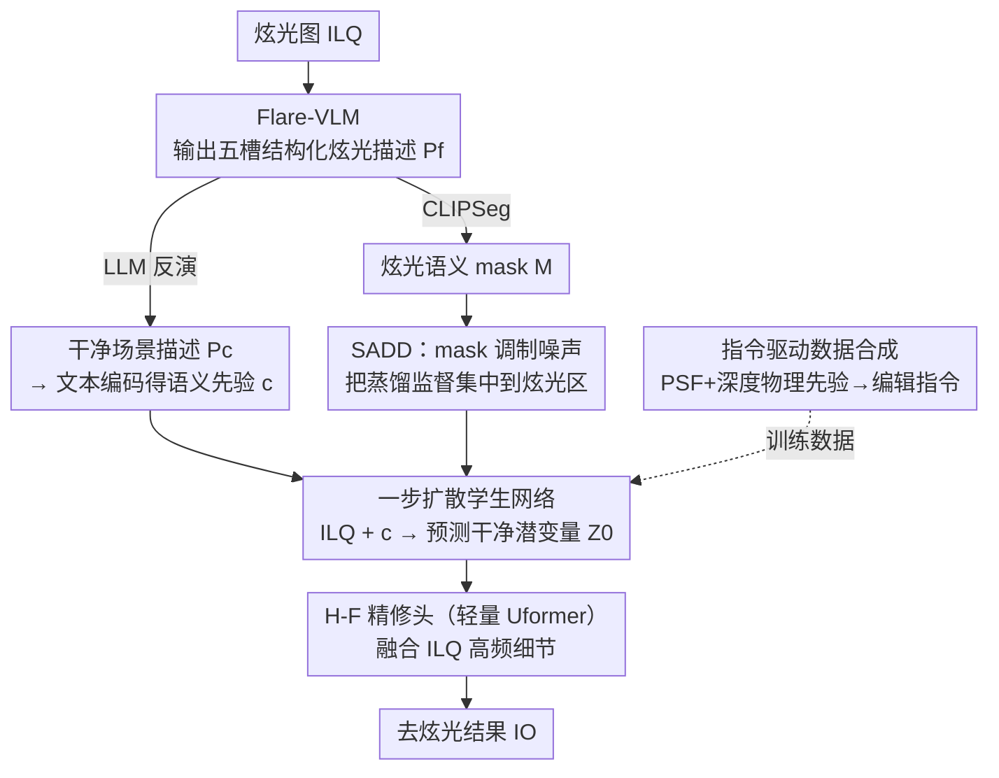

# Language-Guided One-Step Diffusion Model for Nighttime Flare Removal

**会议**: CVPR 2026  
**论文**: [CVF Open Access](https://openaccess.thecvf.com/content/CVPR2026/html/Ning_Language-Guided_One-Step_Diffusion_Model_for_Nighttime_Flare_Removal_CVPR_2026_paper.html)  
**代码**: 待确认  
**领域**: 图像恢复 / 夜间炫光去除  
**关键词**: 夜间炫光去除, 一步扩散, 视觉语言模型, 语义蒸馏, 数据合成

## 一句话总结
针对"夜间强光源造成的炫光会遮挡局部区域、现有方法缺乏被遮挡区的语义先验因而补出伪影/丢细节"的痛点，本文做了首个炫光专用视觉语言模型 Flare-VLM 输出结构化炫光描述、用它引导一步扩散在单次前向里重建严重受损区，并提出语义感知分布蒸馏（SADD）把噪声集中到炫光区、配合指令驱动的数据合成管线生成更贴近真实的训练数据，在恢复质量与下游检测上都优于现有方法。

## 研究背景与动机

**领域现状**：夜间高强度光源（车灯、路灯）在光学系统内反射散射，产生环状光晕、条纹、弥散辉光等多种炫光，既损视觉质量又干扰低光目标检测等下游任务。主流学习方法（CNN/Transformer）把炫光去除当作纯像素/特征级的图到图任务，在 Flare7K++ 这类数据集上能处理温和/弥散炫光。

**现有痛点**：当强炫光**完全遮挡**局部场景内容时，这些模型没有可靠的语义先验去推断被遮区域底下到底是什么物体/结构，于是产生伪影、过度平滑或与周围不一致的重建。炫光的形态（数量、空间分布、色度）又和场景光照布局强耦合，去炫光不只是抹掉可见伪影，还要在保持"光源—炫光"空间关系的前提下，重建出与邻近颜色/纹理/边缘一致的内容。

**核心矛盾**：被遮区缺语义先验。直接拿通用视觉语言模型（如 CLIP/通用 VLM）来补也不行——它们为开放域识别训练，生成的描述粗糙、与场景无关，说不清炫光类型及其与光源的空间关系，无法转成可执行的恢复条件。

**本文目标**：把"语言"当作场景级知识的显式载体引入去炫光，并解决三件事：(1) 怎么得到对炫光精确、可解析的语言描述；(2) 怎么在保证效率（一步扩散）的同时让语义真正约束恢复；(3) 怎么合成贴近真实的炫光训练数据。

**切入角度**：先造一个炫光专用 VLM，把炫光伪影转成固定 schema 的结构化条件（光源类型、位置、形状、颜色、被遮结构），再让一步扩散吃这些语义先验做单次重建；蒸馏时把噪声按语义 mask 集中到炫光区，避免干扰干净背景。

**核心 idea**：用炫光专用语言描述作显式语义先验引导一步扩散，并让蒸馏的监督"对准"炫光区而非全图均匀铺开。

## 方法详解

### 整体框架
框架（LG-ODM）分两个阶段。**阶段 1（核心去炫光）**：给定炫光图 $I_{LQ}$，Flare-VLM 先产出一段五槽结构化炫光描述 $P_f$；一路用 LLM 把 $P_f$ 反演成"无炫光、场景对齐"的干净描述 $P_c$，经文本编码器得语义先验 $c$；另一路 CLIPSeg 联合 $I_{LQ}$ 与 $P_f$ 得到炫光语义 mask $M$。一步扩散学生网络在 $c$ 引导下把 $I_{LQ}$ 编码为 $\hat{Z}$ 并直接预测干净潜变量 $\hat{Z}_0$，解码得初步恢复图 $\hat{I}$。训练这个学生网络的关键是 **SADD（语义感知分布蒸馏）**：用 $M$ 调制注入潜空间的噪声，把蒸馏监督集中到炫光区。**阶段 2（细节精修）**：因为编解码会过平滑边缘、压制纹理，再接一个轻量高频精修头（H-F Refine Head，实例化为 Uformer），以 $\hat{I}$ 为基底、$I_{LQ}$ 为高频残差来源融合出最终输出 $I_O$。此外有一条**离线数据合成管线**，从真实无炫光夜景图出发，用 Flare-VLM 提取光源语义/几何先验生成编辑指令，再用图像编辑模型合成炫光图，作为训练数据。

### 关键设计

**1. Flare-VLM：把炫光伪影翻译成结构化、可解析的语言条件**

这一设计直击"被遮区缺语义先验、通用 VLM 描述太粗"的痛点。作者收集带明显炫光的夜景图，为每张人工写一段**只聚焦炫光退化**的描述，强制含五个要素：光源类型（路灯/车灯）、光源在图像平面的大致位置（左上/中心）、炫光形状（直条纹/弥散辉光）、炫光颜色（白/黄）、被遮挡的目标结构（屋檐/楼面）。再把所有文本归一化成固定模板 `[The <光源类型,位置> generate <颜色,形状> flare, which occludes <目标>.]`，让五个槽位能用简单规则直接转成语义条件，免去处理自由文本。基模型用 Qwen-2.5 7B、以 LoRA 指令微调。推理时 Flare-VLM 对 $I_{LQ}$ 产出 $P_f$，再由 LLM（Qwen3）把这段"退化描述"反演成无炫光的场景对齐描述 $P_c$，编码为 $c$——正是这个 $c$ 让一步模型有了重建被夜间炫光严重遮挡区域的语义依据。一步重建本身遵循 OSEDiff 思路：固定一个反向时间步 $T$、直接预测该步噪声 $\varepsilon=\epsilon_\theta(\hat{Z},c,T)$，再解出干净潜变量 $\hat{Z}_0=(\hat{Z}-\sqrt{1-\bar\alpha_T}\,\varepsilon)/\sqrt{\bar\alpha_T}$，单次前向即得高质量恢复、兼顾效率。

**2. SADD（语义感知分布蒸馏）：把噪声与监督"对准"炫光区**

标准的变分 score 蒸馏（VSD）有两个毛病：只用"低质输入条件"下的教师输出监督学生；且向潜空间注入**空间均匀**的高斯噪声。但夜间炫光是局部的，均匀噪声会无谓扰动干净背景、逼教师去"去噪"本就干净的区域，使监督与真实退化错位。SADD 的修法是用语义把噪声门控住。先用炫光描述 $P_f$ 作 prompt 喂 CLIPSeg 得炫光 mask $M=\mathrm{CLIPSeg}(I_{LQ},P_f)\in[0,1]$，再注入 mask 一致的噪声：$\hat{Z}_t=\sqrt{\bar\alpha_t}\hat{Z}_0+\sqrt{1-\bar\alpha_t}\,(\sigma(M)\odot\varepsilon)$，其中 $\sigma(M)=(1+\gamma_f)M+(1+\gamma_b)(1-M)$，$\gamma_f\ge0$ 增强炫光区扰动、$\gamma_b\le0$ 衰减背景区扰动。监督上还**加了一条真值条件的教师路径**，让教师能基于高质内容给出引导。最终梯度（式 6）在一段时间步序列 $\mathcal{T}=\{t-s,\dots,t\}$ 上聚合：既对齐学生（正则器 $\epsilon_\phi$）与低质条件教师 $\epsilon_\psi$ 之差，又引入真值条件教师与之的差，从而给学生**空间精准、与退化一致**的梯度信号，抑制背景漂移、稳住蒸馏。

**3. 指令驱动数据合成：用物理先验生成场景对齐的真实感炫光**

现有合成数据多把预生成的炫光层**加性叠**到干净背景上，忽略真实光源的语义与几何，导致与真实退化域差距大。本文反过来：从约 1400 张人工筛过的无炫光夜景图出发，先提取实际出现的光源类型与空间位置作为锚点；再引入几何先验——在薄透镜与波动光学成像模型下，点扩散函数 $\mathrm{PSF}_\lambda(s,t;z)=|\mathcal{F}\{A(u,v)\exp(i\phi_\lambda(u,v;z))\}|^2$ 描述深度 $z$ 处单位点光源在传感面的强度，入射能量近似按平方反比衰减 $E\propto 1/z^2$，于是各通道炫光强度可写成 $I_c(s,t)=M(s,t)\,k_c/(\epsilon+D(s,t))^2\cdot p_c(D(s,t))$（$D$ 为逐像素深度、$M$ 为光源二值 mask）。把跨 RGB 聚合归一化后的强度离散成五档（very weak→very intense），扩展模板为 `[Add <炫光形状> around <光源类型,位置>. The flare intensity is <档位>.]`。Flare-VLM 据无炫光图 $I_c$、其深度图 $D$ 和基础指令生成结构受约束的详细编辑提示 $P_{edit}$，再交给图像编辑模型 Step1X-Edit 合成炫光图。径向 RGB 强度曲线显示其空间衰减比 Flare7K++、Wu et al. 的叠加式合成更贴近真实炫光（反射型炫光如光圈鬼影不在合成范围内）。

### 损失函数 / 训练策略
学生网络的全局重建用 LPIPS：$L_{rec}=\mathrm{LPIPS}(\hat{I},I_{GT})$；为强调光源区，额外加光源感知损失 $L_{light}=\mathrm{LPIPS}(M_{Light}\odot\hat{I},\,M_{Light}\odot I_{GT})$；正则器 $\epsilon_\phi$ 也可训练，其目标为 $L_{diff}=\mathbb{E}\,L_{MSE}(\epsilon_\phi(\alpha_t\hat{Z}_0+\beta_t\varepsilon;t,c),\varepsilon)$，仅用于更新 $\epsilon_\phi$。实现上：阶段 1 用 AdamW、学习率 $5\times10^{-5}$，所有 LoRA 从教师（SD 2.1-base）初始化、秩 8，SADD 初始时间步 $t=4$、$\gamma_f=0.1$、$\gamma_b=-0.3$；阶段 2 为轻量 Uformer（学习率 $1\times10^{-4}$）；文本反演用 Qwen3；训练在两张 RTX 3090 上。

## 实验关键数据

### 主实验
配对测试集（自合成测试集 + Flare7K++ 测试集）上的定量对比。诊断式自定义指标：`PSNRflare` 只在炫光区算 PSNR、`PSNRback` 只在背景区算 PSNR；扩散方法标了推理步数（"s"），推理时间在 RTX 3090 上测、不含预处理。

| 方法 | 步数 | 合成 PSNR↑ | 合成 SSIM↑ | 合成 LPIPS↓ | 合成 FID↓ | Flare7K++ FID↓ | 推理(s)↓ |
|------|------|-----------|-----------|------------|----------|----------------|----------|
| Uformer | — | 31.357 | 0.925 | 0.0602 | 28.015 | 37.979 | 0.172 |
| Difflare | 200s | 29.154 | 0.823 | 0.0821 | 39.783 | 42.158 | 12.415 |
| CycleRDM | 10s | 29.825 | 0.903 | 0.0946 | 27.774 | 39.580 | 0.560 |
| OSEDiff | 1s | 27.012 | 0.845 | 0.1790 | 28.000 | 47.896 | 0.138 |
| **本文** | 1s | **31.844** | **0.936** | **0.0527** | **21.636** | **34.206** | **0.126** |

本文在两套配对数据的全部四个指标上都拿到最优：合成集 FID 从次优 27.774 降到 21.636（真实感明显提升），同时**只用一步**、推理 0.126s 比所有扩散对手都快（Difflare 200 步要 12.4s）。这说明语言引导的炫光建模比"把炫光当通用退化"更能定位并约束炫光结构，像素保真与感知质量同时受益。无配对真实数据（Flare7K++ Real-world / DarkZurich / ExDark）上以 NIQE/MUSIQ/CLIPIQA 评测，本文在 MUSIQ、CLIPIQA 上取得最优或次优，验证真实夜景鲁棒性。

下游低光检测（YOLOv11）佐证恢复质量对任务有用：

| 训练用数据集 | Precision↑ | Recall↑ | mAP50↑ |
|--------------|-----------|---------|--------|
| 不增强 | 0.756 | 0.699 | 0.742 |
| Wu et al. | 0.756 | 0.681 | 0.730 |
| Flare7K++ | 0.753 | 0.689 | 0.737 |
| **本文数据** | **0.764** | **0.714** | **0.774** |

用本文合成数据训练的去炫光模型，增强后图像喂同一检测器得到最高 mAP50（0.774）；而 Wu et al./Flare7K++ 数据训练的模型常扭曲亮源、产生错误框，召回与 mAP 略降。

### 消融实验
逐组件消融（自合成测试集），重点看炫光区与背景区 PSNR 的分别变化：

| 配置 | PSNRflare↑ | PSNRback↑ | 说明 |
|------|-----------|-----------|------|
| Baseline | 22.340 | 27.041 | 一步扩散基线 |
| +Flare-VLM | 24.722 | 27.990 | 精确炫光描述显著提升炫光区重建 |
| +SADD（Bright mask） | 22.702 | 28.315 | 亮度 mask 对背景改善有限 |
| +SADD（Semantic mask） | 23.085 | 31.164 | 语义 mask 大幅抑制背景漂移 |
| +H-F Refine | 22.657 | 27.826 | 高频头单加提升很小 |
| Full | **24.728** | **31.197** | 完整模型最优 |

### 关键发现
- **Flare-VLM 贡献最大**：给扩散模型精确的炫光描述后，炫光区 PSNR 从 22.340 提到 24.722，是炫光区重建质量的主来源。
- **语义 mask 远胜亮度 mask**：SADD 用语义 mask 时背景区 PSNR 冲到 31.164（亮度 mask 仅 28.315），说明把噪声/监督按语义集中到炫光区，能有效抑制背景漂移——这正是 SADD 的核心价值。
- **H-F 精修头是锦上添花**：单独加它提升甚微，作者据此指出绝大部分增益来自一步扩散阶段本身，而非后处理。

## 亮点与洞察
- "首个炫光专用 VLM + 固定五槽 schema"把模糊的炫光语义压成可被规则直接解析的条件，绕开了通用 VLM 描述太粗、自由文本难落地的障碍——这种"为子任务定制结构化语言条件"的思路可迁移到雨/雾/低光等其它退化恢复。
- SADD 把 VSD 的均匀噪声换成语义 mask 门控的噪声（$\sigma(M)=(1+\gamma_f)M+(1+\gamma_b)(1-M)$），用一个极简的加权式实现"哪里退化就监督哪里"，是把"局部退化"这一物理事实写进蒸馏目标的巧妙做法。
- 数据合成端"PSF + 平方反比深度衰减 → 离散强度档 → 编辑指令 → Step1X-Edit"把物理成像先验灌进生成式编辑，比加性叠层更贴近真实炫光的空间分布，对所有依赖合成数据的退化任务都有借鉴意义。

## 局限与展望
- 编解码路径仍会损失高频，本文是用阶段 2 的 Uformer 精修头**事后**补偿；作者自承未来想在生成主干内部直接缓解高频损失以简化架构。
- 数据合成**不含反射型炫光**（如光圈鬼影），适用范围受限于散射/折射类炫光。
- Flare-VLM 训练依赖人工写的五槽描述与人工筛选的约 1400 张无炫光底图，标注成本不低；Flare-VLM 描述错误或 CLIPSeg mask 不准时，SADD 的语义门控可能反而把监督引偏（论文未充分讨论该失败模式）。
- ⚠️ 消融表中 +Flare-VLM 单列的 PSNRback（27.990）与 Full（31.197）之间，背景增益主要由语义 SADD 带来，但各组件叠加顺序对最终数值的耦合关系原文呈现有限，以原文为准。

## 相关工作与启发
- **vs Uformer / BracketFlare 等 Transformer 去炫光**：它们在像素/特征级操作、缺结构化炫光语义，强炫光完全遮挡时易失败；本文用语言语义先验显式引导被遮区重建，炫光区 PSNR 与 FID 全面更优。
- **vs Difflare 等多步扩散去炫光**：后者推理动辄上百步（12.4s）；本文一步扩散 0.126s 且质量更高。
- **vs OSEDiff 等通用一步扩散恢复**：本文沿用其一步预测干净潜变量的框架，但注入炫光专用语言条件 + SADD 语义蒸馏，使一步模型适配夜间炫光这一局部强退化任务。
- **vs Wu et al. / Flare7K++ 的加性叠层合成**：本文用指令驱动 + 物理先验在干净夜景上直接生成炫光，域差更小，下游检测 mAP 更高。

## 评分
- 新颖性: ⭐⭐⭐⭐⭐ 首个炫光专用 VLM + 语义门控蒸馏 + 物理先验数据合成，三处都把"语言语义"创造性地接进去炫光管线。
- 实验充分度: ⭐⭐⭐⭐ 配对/非配对/下游检测 + 逐组件消融较全，但对 Flare-VLM/mask 出错时的失败模式分析不足。
- 写作质量: ⭐⭐⭐⭐ 动机（被遮区缺语义先验）与三大组件逻辑清晰，公式与图示到位。
- 价值: ⭐⭐⭐⭐ 一步推理高质量去炫光且利好下游夜间检测，语言先验融入恢复的范式有迁移价值。

<!-- RELATED:START -->

## 相关论文

- [\[CVPR 2026\] Bridging Fidelity-Reality with Controllable One-Step Diffusion for Image Super-Resolution](bridging_fidelity-reality_with_controllable_one-step_diffusion_for_image_super-r.md)
- [\[CVPR 2026\] One-Step Diffusion Transformer for Controllable Real-World Image Super-Resolution](one-step_diffusion_transformer_for_controllable_real-world_image_super-resolutio.md)
- [\[CVPR 2026\] IFCSR: Inference-Free Fidelity-Realism Control for One-Step Diffusion-based Real-World Image Super-Resolution](ifcsr_inference-free_fidelity-realism_control_for_one-step_diffusion-based_real-.md)
- [\[CVPR 2026\] FiDeSR: High-Fidelity and Detail-Preserving One-Step Diffusion Super-Resolution](fidesr_high-fidelity_and_detail-preserving_one-step_diffusion_super-resolution.md)
- [\[CVPR 2026\] Time-Aware One Step Diffusion Network for Real-World Image Super-Resolution](time-aware_one_step_diffusion_network_for_real-world_image_super-resolution.md)

<!-- RELATED:END -->
