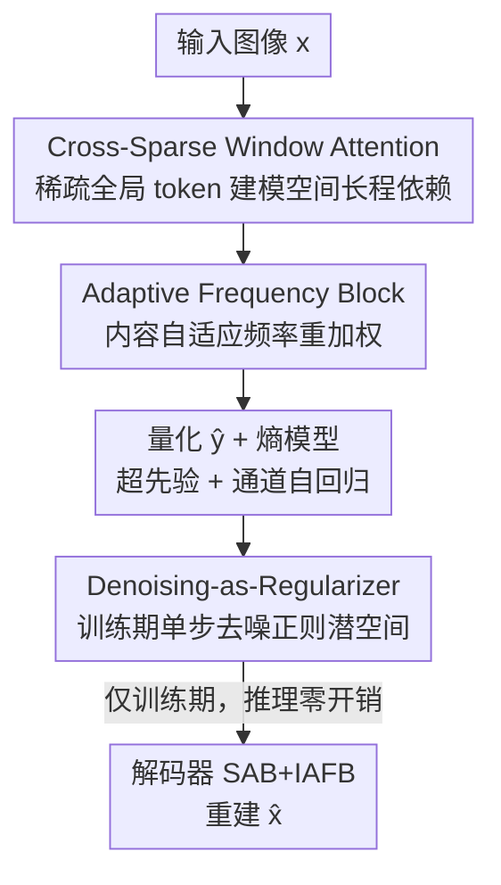

# Learned Image Compression via Sparse Attention and Adaptive Frequency

**会议**: CVPR 2026  
**论文**: [CVF Open Access](https://openaccess.thecvf.com/content/CVPR2026/html/Ma_Learned_Image_Compression_via_Sparse_Attention_and_Adaptive_Frequency_CVPR_2026_paper.html)  
**代码**: https://github.com/（论文称已开源 "SAAF"，具体地址 ⚠️ 以原文为准）  
**领域**: 图像恢复 / 学习式图像压缩  
**关键词**: 学习式图像压缩、稀疏注意力、自适应频率变换、去噪正则、率失真

## 一句话总结
SAAF 用一条"空间-频率双路"变换网络做学习式图像压缩：空间路用稀疏窗口注意力（CSWA）以极少全局 token 高效建模长程依赖，频率路用内容自适应的频率重加权（AFB）替代固定小波变换，再加一个只在训练期生效的去噪正则（DaR）让潜空间更平滑，最终在 Kodak/CLIC/Tecnick 上同时拿到最优 BD-rate 和最低延迟（67 ms）。

## 研究背景与动机
**领域现状**：学习式图像压缩（LIC）已经在率失真（RD）上超过 JPEG、VVC 等传统编解码器。主流框架沿用 Ballé 的自编码器 + 超先验：一个变换网络 $g_a/g_s$ 把图像压成紧凑潜变量 $y$，一个熵模型估计量化后 $\hat{y}$ 的分布来控制码率，二者按率失真目标 $L_{RD}=E[R+\lambda D(x,\hat{x})]$ 端到端联合优化。近年的改进集中在变换网络（引入 CNN-Transformer、状态空间模型）和熵模型（超先验、通道自回归、高斯混合）两条线上。

**现有痛点**：作者指出两个具体短板。其一，空间建模的注意力陷在"效果与效率"的两难里——标准窗口多头自注意力（WMSA）感受野局限于窗口内，而 Swin 的移位窗口虽能跨窗传信，却要堆多层才能传到远处，复杂度反而更高。其二，自然图像有多尺度频率结构，但多数 LIC 直接忽略频率；少数引入频率变换的工作（如固定小波基）又和传统算法一样依赖人工设计的固定参数，无法随图像内容自适应。

**核心矛盾**：RD 性能和推理速度之间的 trade-off——想要更强的长程/频率建模往往要付出更高的延迟和算力，而工程落地又对延迟敏感。固定频率变换则在"是否随内容变化"这一维度上根本没有自由度。

**本文目标**：① 在不增加复杂度的前提下让空间注意力兼顾局部和全局；② 把频率分解从固定变换升级成内容自适应；③ 在不增加任何推理开销的情况下进一步提升重建质量。

**切入角度**：长程依赖未必需要稠密注意力——少量"窗口条件化"的可学习全局 token 就能充当跨窗信息的中转站；频率响应也不必硬解码到固定频带，可以让网络按内容动态生成频带权重。

**核心 idea**：用"稀疏全局 token 的局部-全局注意力 + 内容自适应频率重加权 + 训练期去噪正则"三件套，同时把 RD 和延迟往更优的方向推。

## 方法详解

### 整体框架
SAAF 整体仍是"变换网络 + 超先验/自回归熵模型"的标准 LIC 骨架，但把变换网络做成空间-频率双路：编码器把图像 $x$ 逐级下采样成潜变量 $y$，每一级里既有处理空间长程关系的 **Sparse Attention Block（含 CSWA）**，又有做频率重加权的 **Adaptive Frequency Block（AFB）**；$y$ 量化为 $\hat{y}$ 后由超先验 $\Phi=(\mu,\sigma)$ 加通道自回归上下文做高斯熵编码，解码器用对称的 SAB + 逆频率块 IAFB 把 $\hat{y}$ 重建成 $\hat{x}$。额外挂一个只在训练期工作的 **Denoising-as-Regularizer（DaR）**，给潜空间施加结构化约束。三个模块按下图顺序串起来：

### 关键设计

**1. Cross-Sparse Window Attention（CSWA）：用稀疏全局 token 替掉昂贵的跨窗注意力**

CSWA 针对的是 WMSA 感受野受限、移位窗口又太贵的问题，把单个窗口的注意力拆成三部分：局部窗口注意力（LWA）、全局稀疏注意力（GSA）、局部-全局混合（LGM）。LWA 就是标准窗口内自注意力 $\text{Softmax}(Q_i K_i^\top/\sqrt{d_h}+B)V_i$，但有个关键工程优化——把相对位置偏置 $B$ 从 Swin 里"用 MLP 动态生成"改成预计算并缓存成静态查找表，推理时直接查表，省掉这部分算力（Tab. 3 验证）。GSA 是核心：引入 $N_g$ 个可学习全局 token $G_i=G_{learn}+\bar{X}_i$，其中 $G_{learn}$ 是所有窗口共享的参数，$\bar{X}_i$ 是该窗口的均值特征——这样每个窗口都有"窗口条件化"的全局表示。局部 query 只对这 $N_g$ 个全局 token 做交叉注意力，注意力矩阵从 $M^2\times M^2$ 缩到 $M^2\times N_g$，复杂度大降。最后 LGM 用固定权重 $\alpha=0.25$ 融合：$H_i=(1-\alpha)H_{local,i}+\alpha H_{global,i}$。消融显示 $N_g=2$ 就够（再多反而不划算），说明极稀疏的全局 token 就能撑起长程建模，这正是它比 WMSA 又快又好的原因。

**2. Adaptive Frequency Block（AFB）：让频率分解随图像内容动态变化**

固定小波这类频率变换的毛病是参数人工写死、不看内容。AFB 用一个轻量卷积网络——分解权重生成器（DWG）——根据输入内容动态生成 4 张权重图 $A_{freq}\in\mathbb{R}^{H\times W\times 4}$，模拟对 LL/LH/HL/HH 四个频带的响应。它不做硬分解，而是做"内容自适应重加权"：再引入一组可学习全局权重 $w_{freq}\in\mathbb{R}^4$ 提供全局频率偏好，重加权特征为

$$X_{freq}=X\odot\Big(\sum_{i=1}^{4}A_{freq,i}\cdot\exp(w_{freq,i})\Big)$$

其中 $\exp(\cdot)$ 保证权重为正。这样局部（$A_{freq}$）和全局（$w_{freq}$）两个尺度共同调制频率响应。重加权后的特征再过一个带正交约束的正交线性投影（OLP）做通道变换，保证训练稳定和信息保持。解码端的 IAFB 用对称结构：先用 OLP 还原维度，再用类似的频率注意力做残差增强，选择性恢复细节。

**3. Denoising-as-Regularizer（DaR）：借扩散思想正则潜空间，推理零开销**

传统 RD 目标只管码率和失真，对潜变量本身没有约束，容易在低码率下出伪影。DaR 是一个**只在训练期**用的正则器：给潜变量 $y$ 加上按时间步缩放的高斯噪声得到 $y_{noise}=y+t\cdot\epsilon$，用一个轻量噪声预测器 $f_{denoise}$ 预测注入的噪声 $\epsilon$，并以时间步 $t$ 和超潜变量 $\hat{z}$ 为条件：

$$L_{DaR}=E\big[\|f_{denoise}(y_{noise},t_{emb},\hat{z}_{cond})-\epsilon\|_2^2\big]$$

基于去噪分数匹配，最小化 $L_{DaR}$ 等价于最大化条件对数似然 $\log p(y|c)$，相当于给潜空间装了一个可学习先验。$\hat{z}$ 条件带来空间自适应性：平滑区域被强正则、纹理区域被保留，实现隐式的频率自适应正则。关键是 DaR 推理时整个关掉——它只通过训练梯度把编码器"推"向更平滑的潜变量，从而在不动码率、不加任何推理开销的前提下提升视觉质量。

### 损失函数 / 训练策略
总训练目标把 RD 损失、OLP 的正交损失、DaR 损失三项加权相加：

$$L=E\big[L_{RD}+\lambda_{OLP}L_{OLP}+\lambda_{DaR}L_{DaR}\big]$$

其中 $\lambda_{OLP}=0.1$、$\lambda_{DaR}=0.01$。训练数据取 OpenImages 前 30 万张（短边 ≥256），随机裁 $256\times256$、batch 16、100 epoch，初始学习率 $10^{-4}$、第 80 epoch 衰减到 $10^{-5}$，用 MSE 做失真项，通过 6 个不同的 $\lambda$（0.05~0.0018）训出覆盖不同码率的 6 个模型。

## 实验关键数据

### 主实验
在 Kodak、CLIC、Tecnick 三个标准数据集上以 VTM-9.1 为锚点比 BD-rate（越负越好），并测延迟/FLOPs/参数量（在 Kodak 上）。

| 方法 | 会议 | BD-rate Kodak↓ | BD-rate CLIC↓ | BD-rate Tecnick↓ | 延迟(ms)↓ | 参数(M) |
|------|------|------|------|------|------|------|
| MLIC++ | ICML'23 NCW | -15.07 | -14.46 | -17.19 | 211 | 116 |
| AuxT | ICLR'25 | -10.17 | -9.38 | -9.98 | 82 | 46 |
| DCAE | CVPR'25 | -17.00 | -16.98 | -20.11 | 74 | 119 |
| LALIC | CVPR'25 | -15.30 | -15.42 | -17.61 | - | - |
| **SAAF（本文）** | - | **-17.40** | **-17.35** | **-20.57** | **67** | 123 |

SAAF 三个数据集上 BD-rate 全部最优，同时延迟最低（67 ms，对比 MLIC++ 的 211 ms），且 FLOPs/参数量与最强基线 DCAE 相当——说明它的优势不是靠堆算力换来的。

### 消融实验
以 BASE（用 WMSA、无附加模块）为基准，逐个加模块看 Kodak/CLIC/Tecnick 的 BD-rate（相对 VTM-9.1）和 Kodak 延迟。

| 配置 | BD-rate Kodak↓ | BD-rate CLIC↓ | BD-rate Tecnick↓ | 延迟(ms)↓ |
|------|------|------|------|------|
| BASE | -0.64 | -1.86 | -3.52 | 61 |
| BASE + SAB ($N_g{=}2$) | -1.86 | -2.53 | -4.16 | 52 |
| BASE + AFB | -3.42 | -4.35 | -5.81 | 65 |
| BASE + DaR | -1.56 | -2.63 | -4.29 | 61 |
| BASE + ALL（SAAF） | **-3.99** | **-4.59** | **-6.04** | 56 |

模块级效率对比（Tab. 3）显示，CSWA 相比 WMSA 在同一特征图上延迟 0.33 ms（WMSA 0.44）、FLOPs 231M（WMSA 264M）、显存 21.82MB（WMSA 22.70），只是参数略增（0.22M vs 0.15M）。

### 关键发现
- **AFB 单模块贡献 RD 最大**（Kodak 从 -0.64 提到 -3.42），但带来轻微延迟上升；SAB 则同时改善 RD 又把延迟从 61ms 降到 52ms——一个主攻效果、一个主攻效率，互补。
- **DaR 真正零延迟**：单加它延迟仍是 61ms，BD-rate 却从 -0.64 提到 -1.56，验证"训练期正则、推理期关掉"的设计成立。
- **全局 token 极稀疏即可**：$N_g$ 从 1→2→3 中 $N_g=2$ 最优（Kodak -1.86 vs -1.32/-1.64），说明长程建模不需要稠密注意力。
- CSWA 在潜变量可视化里能把能量集中到更少的通道、更清晰地保留图像轮廓，从而对后续熵模型更友好。

## 亮点与洞察
- **"稀疏全局 token"是个可复用的注意力提速思路**：用极少量（2 个）窗口条件化的可学习 token 当跨窗中转站，把 $M^2\times M^2$ 的注意力压到 $M^2\times N_g$，又快又不丢长程信息——可迁移到任何窗口注意力受效率困扰的稠密预测任务。
- **把扩散去噪当"正则器"而非"生成器"**：DaR 只借去噪分数匹配的目标去结构化潜空间，推理时整个丢掉，等于"白嫖"了扩散先验却不付推理代价，这个"训练期模块"范式很巧。
- **相对位置偏置查表化**：把 Swin 里动态 MLP 生成的 $B$ 预计算成静态查找表，是个小而实在的工程提速点。
- **内容自适应频率重加权**取代固定小波，提示频率域方法的下一步是"让网络自己决定频带响应"。

## 局限与展望
- DaR 的去噪只是单步、且依赖超潜变量 $\hat{z}$ 做条件，论文未充分探讨多步去噪或更强条件是否能进一步提升，正则强度 $\lambda_{DaR}=0.01$ 也较保守。
- 评测都在 MSE 优化下做 PSNR/BD-rate，没有报告感知质量指标（如 LPIPS/MS-SSIM）下的表现，"视觉质量提升"主要靠定性图说明。
- CSWA 的融合权重 $\alpha=0.25$ 和全局 token 数 $N_g=2$ 是固定/经验选的，是否需要随分辨率或码率自适应未讨论。
- 频带数固定为 4（模拟 LL/LH/HL/HH），是否对所有内容都最优、能否动态选频带数留待验证。

## 相关工作与启发
- **vs WMSA / Swin 移位窗口**：标准 WMSA 局部受限、移位窗口靠堆层传远程信息且更贵；CSWA 用稀疏全局 token 一步建长程，延迟更低（0.33 vs 0.44 ms）、能量更集中，是对窗口注意力效率瓶颈的直接回应。
- **vs 固定频率变换（WeConvene / AuxT 等）**：它们用人工设计的固定小波/正交变换，无法随内容变化；AFB 用 DWG 动态生成频带权重 + 可学习全局权重，做到了内容自适应，BD-rate 明显更优。
- **vs DCAE（CVPR'25，最强基线）**：DCAE 靠字典式熵模型把 RD 推得很高但延迟 74ms；SAAF 在 RD 略胜（Kodak -17.40 vs -17.00）的同时把延迟压到 67ms，且参数/FLOPs 相当，整体性价比更好。

## 评分
- 新颖性: ⭐⭐⭐⭐ 稀疏全局 token + 训练期去噪正则两个点都有想法，但都建立在成熟 LIC 骨架上。
- 实验充分度: ⭐⭐⭐⭐ 三数据集 + 完整模块/全局 token 消融 + 效率分析扎实，缺感知指标。
- 写作质量: ⭐⭐⭐⭐ 结构清晰、公式完整，部分模块（DaR 条件化）细节略简。
- 价值: ⭐⭐⭐⭐ 同时拿下最优 RD 和最低延迟，对工程落地的 LIC 有直接参考价值。

<!-- RELATED:START -->

## 相关论文

- [\[CVPR 2026\] Variational Garrote for Sparse Inverse Problems](variational_garrote_for_sparse_inverse_problems.md)
- [\[CVPR 2026\] FAPE-IR: Frequency-Aware Planning and Execution Framework for All-in-One Image Restoration](fape-ir_frequency-aware_planning_and_execution_framework_for_all-in-one_image_re.md)
- [\[CVPR 2026\] VLIC: Vision-Language Models As Perceptual Judges for Human-Aligned Image Compression](vlic_vision-language_models_as_perceptual_judges_for_human-aligned_image_compres.md)
- [\[CVPR 2026\] Perceptual Neural Video Compression with Color Separation and Rank Chain](perceptual_neural_video_compression_with_color_separation_and_rank_chain.md)
- [\[CVPR 2026\] Real-Time Neural Video Compression with Unified Intra and Inter Coding](real-time_neural_video_compression_with_unified_intra_and_inter_coding.md)

<!-- RELATED:END -->
