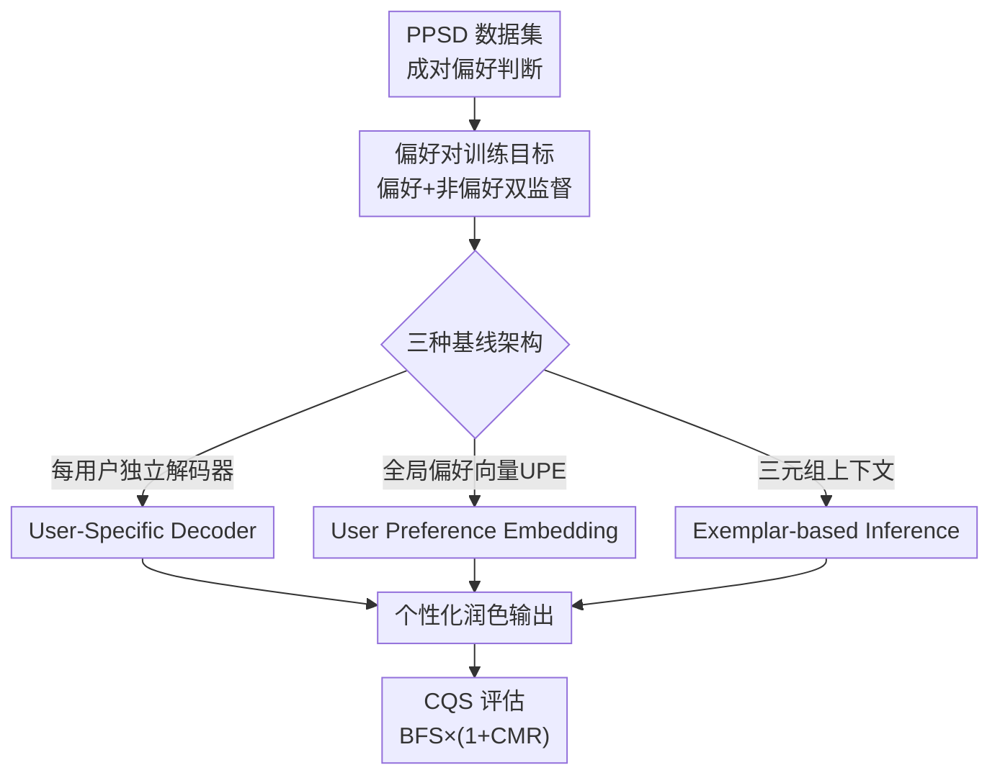

# Learning Personalized Photographic Style from Pairwise User Preferences

**会议**: CVPR 2026  
**论文**: [CVF Open Access](https://openaccess.thecvf.com/content/CVPR2026/html/Kim_Learning_Personalized_Photographic_Style_from_Pairwise_User_Preferences_CVPR_2026_paper.html)  
**领域**: 图像修复 / 个性化润色  
**关键词**: 个性化摄影风格、成对偏好、图像润色、隐式风格学习、偏好评估

## 一句话总结
这篇论文把「从用户的成对偏好判断中学个性化色调审美、再把它应用到任意新照片上」定义成一个新任务 PPS（Personalized Photographic Style），并配套交付了一个 767 人、约 6 万条偏好判断的大规模数据集 PPSD、三种可行的基线模型，以及一个专门衡量「保真度 + 偏好对齐」的评估指标 CQS，证明从纯比较信号里学个人审美是可行的。

## 研究背景与动机
**领域现状**：让照片更「好看」一直是刚需，但 Adobe Lightroom 这类手动工具门槛太高。学术界主要靠两条路做自动化色调风格：一是「照片级风格迁移」（PST），用户挑一张参考图，把它的色彩/色调搬到目标图上；二是「个性化图像增强」（PIE），从特定摄影师的修图（如 Adobe-MIT 5K 里的 Expert A/B）或人工退化-复原对里学增强映射。

**现有痛点**：这两条路都依赖**定义清晰的源-目标对**。PST 需要每张图都给一张参考图，可单张参考根本表达不了一个人完整的审美偏好；PIE 需要明确的摄影师身份或退化-复原配对作为监督信号。现实里，一个普通用户既给不出参考图，也没有「正确答案」——他只能告诉你「这两张里我更喜欢哪张」。

**核心矛盾**：个人审美**只隐式地存在于用户脑子里**，没有单一 ground truth，尤其在色彩和色调这种细腻又主观的维度上。已有范式要么需要显式参考、要么需要显式退化，都无法直接吃「相对偏好」这种模糊监督。

**本文目标**：把问题拆成三个一直卡住该方向的瓶颈——缺大规模成对偏好数据、缺对「模糊偏好学习」有效方法的认识、缺合适的评估框架——逐一补上。

**切入角度**：作者借鉴 NLP（HH-RLHF、UltraFeedback）和文生图（Pick-a-Pic、HPDv3）里成对偏好学习的成功经验——当没有客观答案时，**两两比较比绝对打分更自然也更可靠**。把这套思路第一次系统搬到「色彩与色调」这个更细微的感知域。

**核心 idea**：用「同一场景的不同色调渲染之间，用户更偏好哪个」这种纯比较信号，去推断用户隐式审美，再泛化到内容完全不同的新照片上。

## 方法详解

### 整体框架
作者明确说**目标不是造一个最强模型，而是把 PPS 这个任务的地基铺好**：先用网页众包采集大规模成对偏好（PPSD 数据集），再设计一套能吃「偏好对」而非「源-目标对」的训练范式，在这套范式下实现并对比三种代表性基线架构，最后用一个专门的指标 CQS 来公平衡量它们。整条链路从数据到方法到评估自洽闭环。

训练上有一个所有方法共用的约定：给定同一场景的偏好对 $(I_p, I_n)$（用户偏好 $I_p$ 胜过 $I_n$），随机取其中一张作为输入、生成一张输出 $\hat{I}$，再用**偏好图和非偏好图同时监督**这张输出。三种方法的差别只在于「怎么把用户的偏好上下文注入到生成里」。

### 关键设计

**1. PPSD 数据集：用五类风格变体把「主观审美」量化成可学的成对信号**

任务能不能学，根本上卡在有没有数据。作者搭了个网页应用众包采集：858 名参与者每人答 90 道两两比较题（80 道主任务 + 10 道一致性校验，校验题是把早先做过的图对左右翻转再问一遍，用来量化每个用户答得稳不稳），按响应时间和一致性过滤后保留 767 个有效用户，共约 6 万条有效偏好判断，覆盖 1,192 个场景、7,972 个独特图对。一个「用户」被定义为「个人 + 设备」的唯一组合，因为不同显示设备的观看条件会影响偏好。

数据集的核心巧思在于**用五类来源刻意制造多样的色调变体**，让模型见过尽可能广的风格空间：Type A 用 Adobe-MIT 5K 里 188 个场景的多位专业摄影师修图版本（天然的色彩分级差异）；Type B 用 12 款相机设备对同场景的不同 ISP 处理（308 对，含手动拍摄的旗舰手机和佳能微单）；Type C 用 FLUX-krea/Qwen-Images 生成图，再让 Llava 写「照片级而非艺术化」的修图指令、交给 FLUX-kontext 执行得到风格变体（161 对，作者称这是首次用 FLUX-kontext 构造照片级风格迁移数据）；Type D 是对 Pixabay/Unsplash 图施加可控编辑（降饱和、提亮、加闪光 + 三个专业 LUT），便于**单独**分析某种色彩/色调属性上的偏好；Type E 跨内容（狗、自然、建筑、食物等）保证内容多样性，支持内容感知方法。用两两比较而非绝对打分，正是因为照片风格是纯感知的，并排比较时用户更容易说清自己的偏好。

**2. 三种基线架构：从「每人一个解码器」到「免训练上下文推断」的三种偏好注入方式**

有了数据还得回答「这种模糊偏好怎么注入到模型里」。作者实现并对比三条路，覆盖从重到轻三种代价：

*(a) User-Specific Decoder（每用户独立解码器）*——共享一个编码器 $E$ 抽特征，给**每个用户单独配一个解码器** $D_u$。解码器用基于 LIIF 的隐式神经表示，对任意归一化坐标 $c\in[0,1]^2$ 预测 RGB：$\hat{I}_u(c)=D_u(F(c),c)$，其中 $F=E(I)$。推理时冻结编码器、为新用户初始化并在其 $N$ 条参考偏好上训练新解码器（即推理时训练），让解码器专门拟合这个人的风格。表达力最强但每个用户都要训练。

*(b) User Preference Embedding（全局偏好向量）*——只用**一个全局解码器**，个性化全靠一个紧凑的用户偏好向量 $e_u$（UPE）。对每个偏好对 $(I_p^{(i)}, I_n^{(i)})$，用 DINOv2 特征 $f(\cdot)$ 分别算「内容嵌入」（求和，捕场景）和「风格嵌入」（相减，捕偏好方向）：$e_{content}^{(i)}=f(I_p^{(i)})+f(I_n^{(i)})$、$e_{style}^{(i)}=f(I_p^{(i)})-f(I_n^{(i)})$，归一化后拼成对级嵌入，再用一个浅层 Transformer $g(\cdot)$ 把 $N$ 个对级嵌入聚合成 $e_u$。查询图生成时解码器同时条件于图像特征和 UPE：$\hat{I}_u(c)=D(F_q(c),e_u,c)$。**关键好处是新用户免训练**——直接从其 $N$ 条参考样本现抽 UPE 即可。「相减捕偏好方向」是这条路的精髓：它把「喜欢 A 不喜欢 B」直接编码成特征空间里的一个方向向量。

*(c) Exemplar-based Inference（三元组上下文）*——把 PIE-MSM 的「上下文风格预测」搬过来，做成完全免推理训练的方式。原始 PIE-MSM 吃的是 $(I_s, I_t)$ 输入-输出对；但偏好对没有显式的输入-输出对应。作者改成喂 $N$ 个**三元组** $\{(s^{(i)}, p^{(i)}, n^{(i)})\}$（场景图、偏好图、非偏好图）作为上下文，每个三元组编码为内容嵌入 $z_{content}^{(i)}=\phi_c(s^{(i)})$、偏好方向 $z_{prefer}^{(i)}=\psi_s(p^{(i)})-\psi_s(s^{(i)})$、非偏好方向 $z_{non\text{-}prefer}^{(i)}=\psi_s(n^{(i)})-\psi_s(s^{(i)})$。把查询图的内容嵌入 $\phi_c(q)$ 接到上下文序列末尾，Transformer 直接预测查询图的风格嵌入 $\hat{z}_q^{prefer}$。**三元组结构让模型从比较里学到「偏好的方向」**，无需推理时训练就能做偏好对齐的风格化。

**3. 偏好对训练目标：用偏好图+非偏好图双监督 + w 课程，避免风格被带崩**

PPS 没有 ground truth——一个偏好对只说明 $I_p$ 比 $I_n$ 更受偏好，但**两张都不是「正确答案」，也都不是「错误答案」**；而且照片风格极敏感，细微改动就可能让结果变难看。如果只拿偏好图当目标硬拟合，模型容易过激地往某个方向冲、破坏画面。

作者的解法是对预测 $\hat{I}$ **同时**算它和偏好图、非偏好图的损失再加权：

$$L = w\cdot L_{prefer} + (1-w)\cdot L_{non\text{-}prefer}$$

其中 $L_{prefer}$、$L_{non\text{-}prefer}$ 可用 $\ell_1$/$\ell_2$/感知损失实例化。关键是给 $w$ 设了**课程**：从 $w=0.5$（对两张图等权）线性增大到 $1.5$。开头等权让模型先学清楚两种风格之间的差异、不至于一上来就过拟合偏好图；随训练推进 $w$ 逐渐变大、越来越偏向偏好图。值得注意的是当 $w>1$ 时 $(1-w)$ 变负，非偏好项从「靠近」翻转成「远离」，监督信号在后期实际带上了「推开非偏好风格」的对比味道（⚠️ 这一符号翻转的解读以原文公式为准，论文正文未特别强调）。

**4. CQS 评估：把「保真度」和「偏好对齐」用几何均值拧成一个不被钻空子的分数**

PPS 评估的难点是：既要看预测有没有忠实匹配目标（保真度），又要看预测是不是更偏向偏好目标（偏好对齐），单看任一面都会被钻空子。作者先把基线对偏好对的两张图都跑一遍得到 $\hat{I}_p$、$\hat{I}_n$，用某个度量 $M$ 算四个交叉距离 $d_{pp},d_{pn},d_{np},d_{nn}$，聚合成「对偏好目标的平均表现」$\bar{d}_p$ 和「对非偏好目标的平均表现」$\bar{d}_n$。

直接用差值 $\Delta=\bar{d}_p-\bar{d}_n$ 只反映相对偏好、忽略了绝对质量——两个 $\Delta$ 相同的模型，绝对保真度可能天差地别。于是定义：

$$\text{CQS} = \text{BFS}\times(1+\text{CMR})$$

其中基础保真分 BFS 取 $\bar{d}_p$ 与 $\bar{d}_n$ 的**几何均值**（越小越好的指标如 ∆E、LPIPS 取倒数）：$\text{BFS}_{\uparrow}=\sqrt{\bar{d}_p\times\bar{d}_n}$；比较边际比 CMR 把偏好边际按总量归一化：$\text{CMR}_{\uparrow}=\frac{\bar{d}_p-\bar{d}_n}{\bar{d}_p+\bar{d}_n}$。**用几何均值是关键**——它会重罚「在任一目标上表现都很差」的模型，逼模型对两种审美都得合理保真，而不能靠在某一边刷分；CMR 的归一化让偏好边际的衡量更稳定。

### 损失函数 / 训练策略
隐式函数基线用 L1 损失；PIE-MSM 把原损失适配到上述偏好目标。所有方法训 100 epoch，$w$ 在 500 epoch 内从 0.5 线性增到 1.5。User-Specific Decoder 和 UPE 用 EDSR 当编码器、HIIF 当解码器；Exemplar-based 沿用官方 PIE-MSM 配置。评估时**偏好图和非偏好图都当输入**喂进去，因为模型必须学会「何时该调整、何时该保持原貌」。

## 实验关键数据

### 主实验
在筛掉一致性 <0.7 的用户后保留 521 人（471 训练 / 50 验证），每个验证用户取 $N=16$ 条参考、$M=16$ 条评估。下表为 ∆E00 维度上三种基线的拆解（其余指标趋势一致，Model (b) 在 CQS 上全面领先）：

| 模型 (∆E00↓) | vs. 偏好 | vs. 非偏好 | BFS↑ | CMR↑ | CQS↑ |
|--------------|---------|-----------|------|------|------|
| (a) User-Specific Decoder | 6.50 | 7.18 | 0.146 | 0.050 | 0.154 |
| (b) User Preference Embedding | 4.88 | 5.71 | 0.189 | 0.078 | **0.204** |
| (c) Exemplar-based Inference | 5.06 | 5.17 | 0.196 | 0.011 | 0.197 |

跨指标的最终 CQS 对比（Model (b) 在四个度量上都最高，尤其 PSNR 拉开巨大差距）：

| CQS↑ | ∆E00 | LPIPS | PSNR | SSIM |
|------|------|-------|------|------|
| (a) | 0.154 | 7.24 | 25.72 | 0.855 |
| (b) | **0.204** | **9.99** | **36.63** | **0.879** |
| (c) | 0.197 | 7.00 | 25.52 | 0.867 |

最关键的结论是：**三种基线的 CMR 全为正**，说明它们都成功学会了区分偏好方向，验证了 PPS 任务本身可行。作者还借 ∆E00 论证了 CQS 的必要性：Model (a) 偏好边际不弱（CMR 0.050 vs (c) 的 0.011），但绝对保真度极差（BFS 0.146 vs 0.196），CQS 正确地惩罚了这种低保真、把 (c) 排在前面（0.197 vs 0.154）；而 (b) 虽保真略逊于 (c)（BFS 0.189 vs 0.196），但偏好对齐远胜（CMR 0.078 vs 0.011），CQS 正确判定 (b) 的强偏好对齐压过了微小的保真差距、给它最高分。

### 消融实验
| 消融维度 | 配置 | ∆E00 CQS | PSNR CQS | 说明 |
|---------|------|---------|---------|------|
| 训练用户数 | N=50 | 0.185 | 30.39 | 用户越多越好 |
| 训练用户数 | N=200 | 0.192 | 32.18 | 持续提升 |
| 训练用户数 | N=471 (full) | 0.204 | 36.66 | 471 人仍在涨，数据再大可能更好 |
| 参考样本数 | N=4 | 0.195 | 34.7 | 参考太少欠拟合 |
| 参考样本数 | N=16 | 0.204 | 36.66 | 最优 |
| 参考样本数 | N=32 | 0.195 | 33.0 | 参考过多反而掉，引入噪声/冲突信号 |

### 关键发现
- **训练用户多样性是涨点主力**：从 50 涨到 471 用户 CQS 单调上升（∆E00 上 0.185→0.204），且到 471 仍未饱和，说明见过越多人的偏好、越能学到可泛化的个性化模式。
- **参考样本数存在「甜点」**：N 从 4 增到 16 性能上升，到 32 反而下降——过多参考会引入噪声或互相冲突的偏好信号，最优配置可能因人而异。
- **Model (b)（UPE）综合最优**：既免新用户训练、又在 PSNR 上把另外两条路甩开一大截，「相减捕偏好方向 + 紧凑向量条件化」这条路最具性价比。

## 亮点与洞察
- **把模糊的主观审美变成可学的工程问题**：核心洞察是「偏好的方向可以用特征相减来编码」——$f(I_p)-f(I_n)$ 直接是一个方向向量。这个 trick 在 UPE 和 Exemplar 两条路里都被复用，可迁移到任何「只有相对偏好、没有绝对答案」的视觉个性化任务（如个性化超分、个性化色彩管理）。
- **CQS 的「几何均值 + 归一化边际」设计很值得借鉴**：用几何均值把「在任一目标上摆烂」这条路堵死，是评估「双目标都要好」类任务（不止偏好学习）的通用思路；论文还专门用反例证明了为什么不能只用 Δ 或简单平均。
- **数据集构造把生成模型用成了「风格变体工厂」**：Llava 写「照片级」修图脚本 + FLUX-kontext 执行，低成本造出大量真实感色调变体，绕开了人工修图的高门槛，是数据稀缺方向值得抄的采集范式。
- **「个人 = 个人 × 设备」的定义**很细腻地考虑到观看条件对偏好的影响，提醒做主观评估时设备/显示差异不可忽略。

## 局限与展望
- **本质是奠基性 benchmark 而非 SOTA 模型**：作者自己说三种方法只是「未来研究的起点」，没有一个为 PPS 量身打造的强模型，CQS 绝对值也都不高，离实用还有距离。
- **集中式采集有疲劳天花板**：每人单次 90 题、平均 8.7 分钟，受感知疲劳和注意力限制；作者展望移动端在日常照片回顾中渐进累积偏好的更自然范式。
- **是否「全自动」是开放问题**：作者诚实地反问「全自动增强是不是最优体验」——创作过程里人往往看重掌控感，自动化与用户能动性的平衡需要结合 HCI、用户体验、认知心理学进一步研究。
- **方法上限未触及**：论文也点出扩散模型生成先验 + DPO/Diffusion-DPO/D3PO 这类偏好优化方法尚未用上，是后续把保真度和偏好对齐都拉高的明显方向。
- **个人补充**：w 在 $w>1$ 后变成对比式监督，但论文没系统消融 w 课程终值/曲线的影响，这块超参对「风格会不会被带崩」可能很敏感，值得专门分析。

## 相关工作与启发
- **vs 照片级风格迁移（PST）**：PST 靠单张参考图显式指定风格，本文认为单张参考表达不了完整审美；PPS 从多次跨场景的偏好比较里学，无需逐图给参考，能做真正的自动个性化。
- **vs 个性化图像增强（PIE，如 PieNet / PIE-MSM）**：PIE 依赖定义清晰的学习信号（摄影师身份或退化-复原对），本文的目标审美只隐式存在于用户脑中、必须从比较判断里推断；Exemplar 基线正是把 PIE-MSM 改造成吃「偏好三元组」而非「输入-输出对」。
- **vs NLP/文生图的偏好数据集（HH-RLHF / UltraFeedback / Pick-a-Pic / HPDv3）**：它们都用成对偏好但聚焦语言响应或文生图的内容层面；PPSD 第一次把这套框架带到「色彩与色调」这个更细微的感知域。
- **vs 修图数据集（Adobe-MIT 5K / PPR10K / PIE-MSM）**：这些提供源-目标修图对，PPSD 在其基础上叠加开源图库和生成模型，转而采集「成对偏好」这种更贴近真实用户、无需 ground truth 的信号。

## 评分
- 新颖性: ⭐⭐⭐⭐ 首次把「从纯成对偏好学个性化色调审美」定义成任务并配齐数据/方法/评估，问题定义和 CQS 指标都有原创性。
- 实验充分度: ⭐⭐⭐⭐ 三种基线 × 四指标 + 用户数/参考数双消融论证充分，但都是基线、缺一个强模型，绝对性能不高。
- 写作质量: ⭐⭐⭐⭐ 动机—数据—方法—评估闭环清晰，CQS 必要性用反例讲透；公式排版略密、w 课程的符号翻转可再点明。
- 价值: ⭐⭐⭐⭐ 作为该方向的开山数据集 + 评估基准价值高，PPSD 和 CQS 都可被后续工作直接复用。

<!-- RELATED:START -->

## 相关论文

- [\[CVPR 2026\] Towards Universal Computational Aberration Correction in Photographic Cameras: A Comprehensive Benchmark Analysis](unicac_universal_computational_aberration_correction_benchmark.md)
- [\[CVPR 2026\] LRHDR: Learning Representation-enhanced HDR Video Reconstruction](lrhdr_learning_representation-enhanced_hdr_video_reconstruction.md)
- [\[CVPR 2025\] OptiFusion: Towards Universal Computational Aberration Correction in Photographic Cameras](../../CVPR2025/image_restoration/towards_universal_computational_aberration_correction_in_photographic_cameras_a_.md)
- [\[ECCV 2024\] Pairwise Distance Distillation for Unsupervised Real-World Image Super-Resolution](../../ECCV2024/image_restoration/pairwise_distance_distillation_for_unsupervised_real-world_image_super-resolutio.md)
- [\[CVPR 2026\] Enhancing Unregistered Hyperspectral Image Super-Resolution via Unmixing-based Abundance Fusion Learning](enhancing_unregistered_hyperspectral_image_super-resolution_via_unmixing-based_a.md)

<!-- RELATED:END -->
