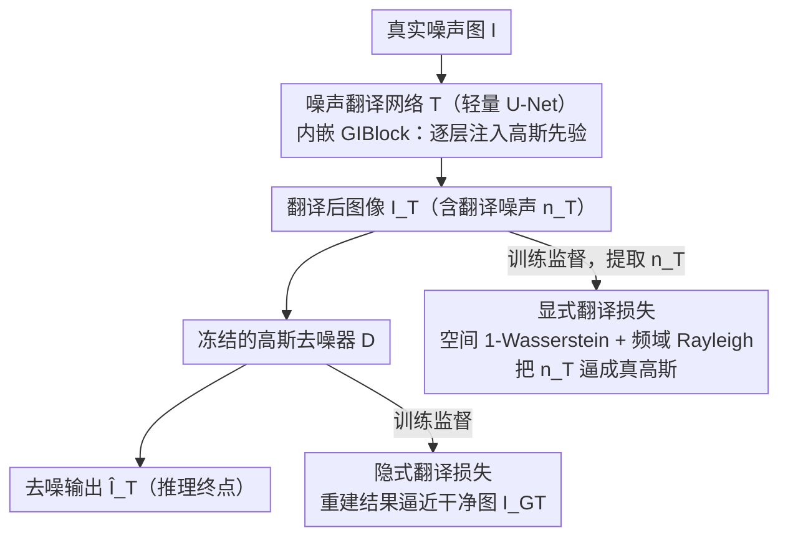

# Learning to Translate Noise for Robust Image Denoising

**会议**: CVPR 2026 Findings  
**arXiv**: [2412.04727](https://arxiv.org/abs/2412.04727)  
**代码**: [https://hij1112.github.io/learning-to-translate-noise/](https://hij1112.github.io/learning-to-translate-noise/)  
**领域**: Image Restoration / 图像恢复  
**关键词**: 图像去噪, 噪声翻译, 高斯噪声, 分布外泛化, Wasserstein距离

## 一句话总结

提出噪声翻译框架，通过轻量级噪声翻译网络将未知真实噪声转换为高斯噪声，再由预训练的高斯去噪网络处理，在 OOD 真实噪声基准上平均 PSNR 提升 1.5dB 以上，且翻译网络仅 0.29M 参数、可跨去噪器迁移。

## 研究背景与动机

基于深度学习的图像去噪方法在控制环境下表现出色，但面对分布外（OOD）真实噪声时泛化能力严重不足：

**合成噪声与真实噪声的分布差异**：早期方法假设高斯噪声，训练的模型在真实场景中表现大幅下降

**真实数据集的过拟合**：用真实 noisy-clean 图像对训练的模型会过拟合到训练数据特有的噪声-信号相关性，在新噪声类型上失效

**完整覆盖所有真实噪声分布不现实**：不同相机、传感器、环境产生的噪声千差万别

**现有泛化方法局限**：固定变换（如 Anscombe 变换）适应性差；测试时优化（如 LAN）计算开销大，不可扩展到大图像

**关键观察**：给真实噪声图像额外添加高斯噪声后，用高斯去噪器处理效果反而显著改善（PSNR 从 29.63dB 提升到 32.73dB）。这启发了"先翻译、再去噪"的策略。

## 方法详解

### 整体框架

这篇论文的目标是让去噪器面对没见过的真实噪声也不掉链子，但它没有去训练一个"什么噪声都能去"的万能去噪器，而是反过来——先把陌生噪声"翻译"成一种早就擅长处理的噪声（高斯），再交给一个固定的高斯去噪器收尾。整个系统分两阶段串起来：先单独训练一个只懂高斯噪声的去噪网络 $\mathcal{D}(\cdot; \boldsymbol{\theta})$，然后把它冻住，再训练一个轻量的噪声翻译网络 $\mathcal{T}(\cdot; \boldsymbol{\phi})$，专门负责把任意真实噪声重塑成高斯噪声。推理时一张真实噪声图 $I$ 先过翻译网络、再过去噪网络，即 $\hat{I}_\mathcal{T} = \mathcal{D}(\mathcal{T}(I; \boldsymbol{\phi}); \boldsymbol{\theta}^*)$。这样分而治之的好处是：去噪器只需面对它训练时见过的高斯分布，泛化压力全部转移到了那个只有 0.29M 参数的翻译网络上。

### 关键设计

**1. 隐式翻译损失：用冻结去噪器的最终效果反推翻译目标**

难点在于"翻译成高斯"这件事没有现成的监督信号——我们并不知道某张真实噪声图"应该"被翻译成什么样。作者的办法是绕开对中间噪声形态的直接约束，转而用最终去噪质量来间接逼它：把翻译输出送进冻结的去噪器，要求重建结果逼近干净图，即 $\mathcal{L}_{\text{implicit}} = \|\mathcal{D}(\mathcal{T}(I; \boldsymbol{\phi}); \boldsymbol{\theta}^*) - I_{\text{GT}}\|_1$。由于去噪器 $\boldsymbol{\theta}^*$ 只对高斯噪声拿手，这个损失变低就等价于翻译网络的输出越来越"像高斯"——监督信号是从下游性能里反向流出来的，不需要人为定义翻译目标。

**2. 显式翻译损失：从空间和频率两个维度把翻译噪声逼成真高斯**

光靠隐式损失，翻译网络可能找到一些"碰巧让去噪器满意"但并非真高斯的捷径，所以还得直接在分布层面约束。作者把翻译后的噪声 $n_\mathcal{T}$ 和一个高斯参考噪声 $n_\mathcal{G}$ 做两路 1-Wasserstein 距离匹配。空间域项 $\mathcal{L}_{\text{spatial}}$ 把两者按通道展平、排序后算排序元素的 L1 距离，这等价于一维 Wasserstein 距离，逼的是噪声在**元素级别**服从高斯分布。但元素级高斯还不够——真高斯噪声还得是空间不相关的，否则残留的结构化条纹（如拉链纹理）依然会骗过元素级检验。频域项 $\mathcal{L}_{\text{freq}}$ 正是补这一刀：它利用一条数学性质——空间不相关的高斯噪声，其傅里叶系数幅度服从 Rayleigh 分布——对 $n_\mathcal{T}$ 和 $n_\mathcal{G}$ 分别做 FFT 后匹配幅度分布，从而把空间相关性也压成高斯该有的样子。两项合成 $\mathcal{L}_{\text{explicit}} = \mathcal{L}_{\text{spatial}} + \beta \cdot \mathcal{L}_{\text{freq}}$，一个管"逐点像不像"，一个管"空间结构散不散"。

**3. 高斯注入块（GIBlock）：把高斯先验从网络内部一层层灌进去**

一个自然的想法是直接在输入端给图加高斯噪声，但这会扭曲信号本身、把干净细节也淹掉。GIBlock 改成在翻译网络 U-Net 的**每一层内部**逐步施加高斯先验：每个块由 NAFBlock + 高斯噪声注入 + 残差连接组成，让网络在多个尺度上反复被"提醒"输出应当趋向高斯，而不是在入口处一次性破坏信号。消融显示，正是这个逐层注入的结构，让翻译网络在推理时面对从未见过的噪声仍能稳定地把它映射到高斯分布——去掉它，翻译的可靠性明显下降。

### 损失函数 / 训练策略

总损失把上面三项串起来：$\mathcal{L}_{\text{total}} = \mathcal{L}_{\text{implicit}} + \alpha \cdot \mathcal{L}_{\text{explicit}}$，权重取 $\alpha = 5 \times 10^{-2}$、显式损失内部 $\beta = 2 \times 10^{-3}$，GIBlock 注入的高斯噪声水平 $\tilde{\sigma} = 100$。两个网络分开训练：去噪网络用 BSD400 + WED（统一加 σ=15 的高斯噪声）外加 SIDD 训练，专攻高斯去噪；翻译网络只用 SIDD 的真实 noisy-clean 对、配合 [0,15] 随机高斯噪声增强来训练，骨干是轻量级 U-Net。值得注意的是翻译网络的训练数据只来自单一真实数据集 SIDD，却能泛化到 9 个 OOD 基准，说明它学到的是"如何把噪声塑成高斯"这件通用的事，而非记住某种特定噪声。

## 实验关键数据

### 主实验（OOD 平均 PSNR，dB）

| 方法 | SIDD (ID) | OOD Avg↑ | 提升 |
|------|----------|---------|------|
| NAFNet | 39.97 | 38.43 | 基线 |
| **NAFNet + NTN** | 39.24 | **39.94** | **+1.51** |
| Xformer | 39.98 | 38.58 | 基线 |
| **Xformer + NTN** | 39.10 | **40.04** | **+1.46** |
| AFM (之前 SOTA) | 38.29 | 39.07 | — |
| Mask-Denoising | 38.91 | 38.56 | — |
| CLIP-Denoising | 38.03 | 38.53 | — |

### 消融实验

| 配置 | SIDD | OOD Avg | 说明 |
|------|------|---------|------|
| 基线翻译（仅 implicit） | 39.35 | 39.27 | 最简版本 |
| + GIBlock | 39.05 | 39.61 | +0.34 OOD |
| + Explicit loss | 39.33 | 39.61 | +0.34 OOD |
| + Both（完整版） | 39.24 | **39.94** | +0.67 OOD |

### 与简单加高斯噪声对比

| 输入 | SIDD | OOD Avg |
|------|------|---------|
| 原始噪声图 I | 37.77 | 17.89 |
| I + N(σ=5) | 38.15 | 22.93 |
| I + N(σ=10) | 38.76 | 39.22 |
| I + N(σ=15) | 39.16 | 38.95 |
| **翻译后 $I_\mathcal{T}$** | **39.24** | **39.94** |

### 关键发现

1. **固定加噪的局限性一目了然**：σ=10 在某些数据集好但在另一些差，σ=15 同理；不同图像/数据集需要不同噪声水平，而翻译网络可自适应
2. **翻译网络可跨去噪器迁移**：用 NAFNet 训练的翻译网络直接搭配 Xformer 使用，OOD 性能（39.94 dB）与专门为 Xformer 训练的（40.04 dB）几乎一致
3. **ID 性能并非下降而是去过拟合**：在 SIDD 上的微小 PSNR 下降是因为其他方法过拟合了训练集中的伪影（如拉链纹理），本文方法反而避免了这种过拟合
4. **计算开销极小**：翻译网络仅 0.29M 参数、1.07G MACs，对比 NAFNet 的 29.1M/16.23G 和 Xformer 的 25.1M/142.68G，几乎可忽略

## 亮点与洞察

1. **朴素观察 → 优雅框架**：从"加高斯噪声反而提升去噪效果"的观察出发，推导出完整的噪声翻译理论
2. **损失函数的数学动机极强**：
    - 空间域：1-Wasserstein 匹配确保元素级高斯分布
    - 频域：利用高斯噪声 FFT 幅度服从 Rayleigh 分布的数学性质，确保空间不相关性
3. **即插即用架构**：翻译网络与去噪网络完全解耦，一次训练可搭配任何预训练高斯去噪器
4. **不需要测试时优化**：与 LAN 等方法相比，推理时无需逐像素优化，可扩展到任意分辨率
5. **可视化说服力强**：翻译前后的噪声分布直方图清楚展示了从结构化噪声到高斯噪声的转变

## 局限与展望

1. 翻译网络仅在 SIDD 训练，遇到与 SIDD 差异极大的噪声类型时可能受限
2. ID 性能有微小下降（约 0.7dB），对追求极致 ID 性能的场景需额外微调
3. 去噪网络需预训练在同一高斯噪声水平（σ=15）上，噪声水平不匹配时效果待验证
4. 仅在图像去噪上验证，视频去噪和其他图像恢复任务（如去模糊、超分）的适用性待探索

## 相关工作与启发

- **DnCNN**：CNN 去噪先驱，频域训练提升泛化性
- **NAFNet / Restormer / KBNet**：强大的去噪骨干网络，但泛化能力有限
- **Anscombe 变换 / Pixel-Shuffle Down-sampling**：固定变换简化噪声，但适应性差
- **LAN**：测试时优化像素级偏移，有效但不可扩展（限 256×256）
- **AFM**：对抗训练提升鲁棒性，但仍受限于训练分布
- 核心启发："不要尝试去噪所有噪声类型，而是先将所有噪声统一翻译成一种你已经擅长处理的噪声"——这种分而治之的思路适用于更广泛的领域

## 评分

- 新颖性: ⭐⭐⭐⭐⭐ — 噪声翻译的思路新颖且有坚实的数学动机
- 实验充分度: ⭐⭐⭐⭐⭐ — 9 个 OOD 基准、详尽消融、可视化分析、迁移性验证
- 写作质量: ⭐⭐⭐⭐⭐ — 从直觉到理论到实验，论述逻辑清晰
- 价值: ⭐⭐⭐⭐⭐ — 即插即用、轻量高效，对图像去噪领域有实际推动意义

<!-- RELATED:START -->

## 相关论文

- [\[ICLR 2026\] Are Deep Speech Denoising Models Robust to Adversarial Noise?](../../ICLR2026/image_restoration/are_deep_speech_denoising_models_robust_to_adversarial_noise.md)
- [\[CVPR 2026\] Convexity-Aware Noise Calibration: A Self-Supervised Framework for Noise-Level-Unknown Image Denoising](convexity-aware_noise_calibration_a_self-supervised_framework_for_noise-level-un.md)
- [\[CVPR 2026\] PNG: Diffusion-Based sRGB Real Noise Generation via Prompt-Driven Noise Representation Learning](diffusion-based_srgb_real_noise_generation_via_prompt-driven_noise_representatio.md)
- [\[CVPR 2026\] NEC-Diff: Noise-Robust Event–RAW Complementary Diffusion for Seeing Motion in Extreme Darkness](nec-diff_noise-robust_event-raw_complementary_diffusion_for_seeing_motion_in_ext.md)
- [\[CVPR 2025\] Classic Video Denoising in a Machine Learning World: Robust, Fast, and Controllable](../../CVPR2025/image_restoration/classic_video_denoising_in_a_machine_learning_world_robust_fast_and_controllable.md)

<!-- RELATED:END -->
