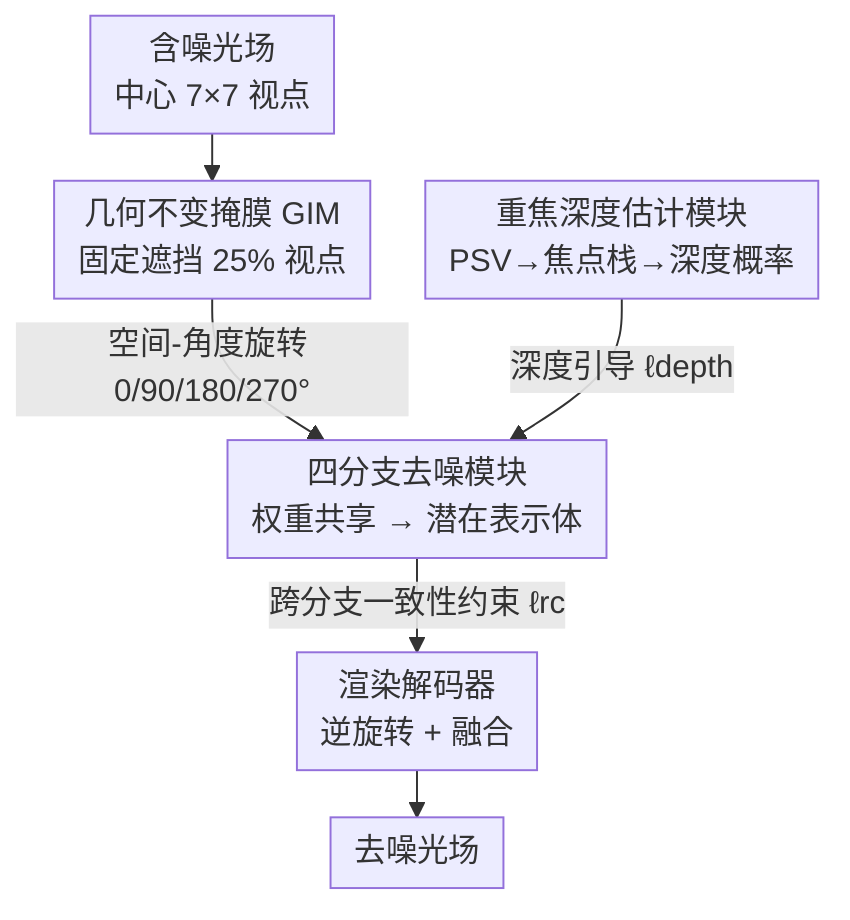

# LF-BVN: Blind-View Network for Self-Supervised Light Field Denoising

**会议**: CVPR 2026  
**论文**: [CVF Open Access](https://openaccess.thecvf.com/content/CVPR2026/html/Guo_LF-BVN_Blind-View_Network_for_Self-Supervised_Light_Field_Denoising_CVPR_2026_paper.html)  
**代码**: https://github.com/shuozh/LF-BVN （论文称将公开）  
**领域**: 图像恢复 / 光场去噪 / 自监督  
**关键词**: 光场去噪、自监督、盲视点、几何不变掩膜、跨视点一致性

## 一句话总结
把单图去噪里的「盲点（blind-spot）」思想推广到光场的「盲视点（blind-view）」——遮住一部分视点、用其它视点的多视角一致性来重建它们，从而无需任何干净图像就能训练，并靠几何不变掩膜让一张权重共享网络去噪全部视点，在合成、真实和显微光场上都达到或超过监督方法。

## 研究背景与动机
**领域现状**：光场（Light Field, LF）相机用一次曝光记录场景的强度和方向信息，但相机阵列、Lytro Illum、Raytrix 等设备受硬件和光照限制，拍出的光场常带噪声，会拖累视点合成、超分、深度估计等下游任务。主流去噪方法分两类：传统方法（LFBM5D、Hyperfan4D 等）靠手工先验跨视点滤波，结果常有伪影和模糊；数据驱动方法（APA、MSPNet、SRDNet 等）用「噪声-干净」配对图训练，效果好但严重依赖精确对齐的配对数据。

**现有痛点**：精确对齐的噪声-干净光场对在真实场景里几乎拿不到，导致监督方法很难泛化到训练时没见过的复杂噪声。已有的自监督尝试（VCDNet、V2V3D）是从光场显微（LFM）领域迁来的，有两个硬伤：一是过度依赖点扩散函数（PSF），而常规光场成像原理不同、根本没有 PSF；二是用多个**独立**网络去噪不同视点，难以保持视点间一致性，常出现可见伪影。

**核心矛盾**：单图盲点去噪只能靠**空间邻域**推测目标像素，在平坦区会把噪声当纹理、在边缘会把真实不连续当噪声；而光场的多视点恰好提供了比空间邻域更可靠的监督信号——同一 3D 点在不同视点的投影在无噪时光度一致，噪声却几乎不可能跨视点一致。问题在于：怎么把盲点推广成「盲视点」，又不为每个视点单独训练一个网络、还能保住视点一致性？

**本文目标**：(1) 设计一种适配光场结构的固定掩膜，让单一网络能去噪所有视点；(2) 在多分支去噪时强制跨视点一致性；(3) 从含噪光场里挖出可靠的深度线索来引导去噪。

**切入角度**：作者观察到光场具有「旋转不变性」——只要把整个光场在空间域和角度域**同步**旋转，视点间的几何（视差）关系就保持不变（来自 [28]）。这意味着对旋转后的输入沿用同一套掩膜，网络看到的几何关系一致，于是一张权重共享网络就能处理所有旋转分支。

**核心 idea**：用「盲视点」代替「盲点」——遮住若干视点，强迫网络从**其它视点**重建被遮视点，把多视点一致性当作免费的自监督信号；再用几何不变掩膜 + 权重共享把「为每个视点训一个网络」压成「一张网络跑四个旋转分支」。

## 方法详解

### 整体框架
LF-BVN 是一个自监督光场去噪框架：输入一张含噪光场（取中心 7×7 视点），输出去噪后的完整光场，全程不需要任何干净参考。整体是一个**四分支、权重共享**结构。先用几何不变掩膜（GIM）遮住固定的 1/4 视点；再把光场分别旋转 0°/90°/180°/270° 喂进四个分支，由于旋转改变了可见视点集合但保住了几何关系，四个分支用同一套参数 $f_\theta$ 处理。每个分支内部，被遮的光场先送进去噪模块 $f_{\theta_1}$ 重建出一个「潜在表示体（latent representation volume）」——它编码去噪场景的几何，再由渲染解码器 $f_{\theta_2}$ 还原被遮视点的内容；最后对每个分支的输出做逆旋转并融合成完整去噪光场。其中，重焦深度估计模块从含噪光场里抽出深度概率为去噪提供额外引导，重建一致性损失 $\ell_{rc}$ 则强制四个分支得到的潜在表示体彼此一致。

### 关键设计

**1. 几何不变掩膜 GIM：让一张网络去噪所有视点**

盲视点最棘手的地方在于：单图盲点可以随机遮像素（统计性质不随位置变），但光场盲视点依赖**视点间的几何关系**，而这关系随视点对剧烈变化——换一种遮挡图案就得重训一个网络，要遮完所有视点甚至得训 $U\cdot V$ 个网络。作者根据视差公式 $D_{j\to i}(x_i)=x_j-x_i=(a_j-a_i)\cdot\frac{B\cdot f}{Z(x_i)}$（$B$ 基线、$f$ 焦距、$Z$ 深度），指出场景几何 $Z$ 固定时视差只由相对角度位置决定，因此必须用**固定的角度掩膜**才能保住几何一致。GIM 的巧处在于：当整个光场在空间域和角度域**同步**旋转时几何关系不变（$\mathbb{E}[f_\phi[R^{90}_{ax}(L)]]=(d,0)$ 与未旋转时相同），于是固定一张掩膜、配合旋转，就让被遮视点集合在分支间「转一圈」覆盖全部视点，而网络始终面对同一种几何关系，可以权重共享。GIM 同时满足三条原则：固定角度图案（保几何一致）、盲视点均匀分布（每个被遮视点附近都有可见视点参考）、遮挡比例权衡（90° 旋转下最优最小遮挡比是 25%，对应 4 个分支）。

**2. 潜在表示体 + 重建一致性损失 $\ell_{rc}$：把四个分支的去噪结果拧成一致**

不同视点被分开去噪，天然会出现光度不一致的伪影。作者引入一种视点无关的光场表示——潜在表示体（来自 [29]，形状 $4C\times H\times W$）来建模光场：四个分支看的是同一场景，理应学到同一个潜在表示。于是约束一致性
$$\ell_{rc}=\sum_{r}\left\|R^{-r}_{x}\big(f_{\theta_1}(R^{r}_{ax}(L)\odot M)\big)-f_{\theta_1}(L\odot M)\right\|_1,\quad r\in\{90,180,270\}$$
即：旋转后的光场过同一套 GIM 和去噪模块，得到的潜在表示体再做逆旋转，应当与原始朝向得到的表示一致。这样四个分支的几何表示被显式对齐，跨视点光度一致性大幅改善，避免了 V2V3D 那种「简单平均多个体导致纹理区伪影」的问题。盲视点本身的损失 $\ell_{blind}=\|f_\theta(M\odot L)-(1-M)\odot L\|_2^2$ 只在被遮视点上度量预测与原值的差。

**3. 重焦深度估计模块 + 深度损失 $\ell_{depth}$：从含噪光场里抠出可靠深度引导**

盲视点去噪的关键是找准 3D 点在各视点的对应投影，而这取决于深度，所以准确的深度引导很重要。但已有自监督深度估计普遍依赖光度一致性损失，在含噪条件下不可靠。作者改为先按一组预设深度平面把被遮光场移位到中心视点，构造平面扫描体（PSV $\in\mathbb{R}^{D\times U\times V\times H\times W\times C}$），再用光场重聚焦生成焦点栈
$$FS=\frac{1}{|M|}\sum_{u=1}^{U}\sum_{v=1}^{V}PSV_{uv}$$
其中 $|M|$ 是可见视点数。关键巧思是：由于中心视点本身被遮，重聚焦图像不含原中心视点信息，于是可以安全地用**含噪的中心视点**当监督信号而不怕网络学成恒等映射。深度模块 $f_\sigma$ 预测每像素在 $D$ 个深度平面上的概率 $DP\in\mathbb{R}^{D\times H\times W}$，并用
$$\ell_{depth}=\Big\|\sum_{d}^{D}[f_\sigma(PSV)\odot FS]_d-\tilde I_c\Big\|_1$$
约束（$\tilde I_c$ 为含噪原中心视点）。得到的深度概率再加权 PSV，为潜在表示体的构建提供深度引导。总损失为 $\ell_{total}=\ell_{blind}+\alpha\ell_{rc}+\beta\ell_{depth}$，取 $\alpha=0.3,\beta=0.1$。

> ⚠️ 框架↔关键设计一致性：框架图中的 GIM、四分支去噪模块（含潜在表示体 + $\ell_{rc}$）、重焦深度估计模块（含 $\ell_{depth}$）三个贡献组件，分别对应上面三个关键设计；渲染解码器、逆旋转融合属脚手架步骤。

### 损失函数 / 训练策略
PyTorch + Adam（$\beta_1=0.9,\beta_2=0.999$），batch size 20，学习率固定 $10^{-4}$，单张 NVIDIA A5000，训练 $10^5$ 次迭代。训练时取中心 7×7 视点、随机裁成 48×48 patch 输入。评测用 PSNR / SSIM。

## 实验关键数据

### 主实验
在 HCI 数据集 16 个场景训练、另 8 个评测，并零样本测试 HCIold（5 场景）与 DLFD（30 场景）。对照三类方法：单图盲点（B2U、ZSBlind）、监督光场（APA、DRLF、SRDNet、MSPNet）、自监督光场（V2V3D）。

合成数据（sRGB，PSNR↑/SSIM↑）：

| 噪声 | 数据集 | 本文 | SRDNet（监督SOTA） | V2V3D（自监督） |
|------|--------|------|---------------------|------------------|
| σ=20 | HCI | 37.86 / **0.960** | **38.17** / 0.925 | 36.21 / 0.909 |
| σ=20 | HCIold | **37.72** / **0.953** | 36.78 / 0.937 | 35.97 / 0.896 |
| σ=20 | DLFD | **36.04** / **0.937** | 35.44 / 0.901 | 33.89 / 0.891 |
| σ=50 | HCI | 34.51 / **0.911** | **34.73** / 0.901 | 33.37 / 0.901 |
| σ=50 | DLFD | **33.19** / 0.883 | 32.27 / 0.884 | 33.04 / 0.883 |

本文在多数设置上超过所有自监督方法和三个监督方法；SRDNet 仅在 HCI 上 SSIM 略高，但因依赖训练分布，迁到弱纹理更多的 HCIold/DLFD 时掉点明显，凸显本文的跨数据集泛化优势。

未见噪声类型（在 σ=20 高斯上训练，迁到 Poisson λ=30 / Uniform [−50,50]）：

| 噪声 | 数据集 | 本文 | V2V3D | SRDNet |
|------|--------|------|-------|--------|
| Poisson | HCI | **36.09 / 0.932** | 34.17 / 0.889 | 30.64 / 0.763 |
| Poisson | DLFD | **34.51 / 0.917** | 33.85 / 0.867 | 29.26 / 0.726 |
| Uniform | HCI | **36.46 / 0.943** | 33.33 / 0.885 | 29.96 / 0.670 |
| Uniform | DLFD | **35.13 / 0.917** | 32.78 / 0.898 | 27.83 / 0.659 |

监督方法在未见噪声上普遍崩盘（SRDNet 掉到 27–30 dB），本文仍稳健领先，印证无监督架构学到的是光场内在几何而非过拟合特定噪声分布。

去噪结果再做深度估计（OAVC 估深度，MAE/MSE↓，越低越好；衡量视点一致性）：

| 数据集 | 本文 | SRDNet | V2V3D |
|--------|------|--------|-------|
| HCI | **0.122 / 0.056** | 0.158 / 0.097 | 0.187 / 0.124 |
| DLFD | **0.172 / 0.113** | 0.234 / 0.217 | 0.208 / 0.176 |

去噪后深度更准，说明本文更好地保住了跨视点的几何与光度一致性。

### 消融实验
HCI + 高斯 σ=20。

掩膜比例 & 分支数（Table 5）：

| 配置 | 遮挡比例 | PSNR | SSIM | FLOPs(T) |
|------|---------|------|------|----------|
| 4 分支(90°) | 25% | **37.86** | **0.960** | 5.0 |
| 4 分支(90°) | 50% | 36.91 | 0.942 | 5.0 |
| 4 分支(90°) | 75% | 36.10 | 0.926 | 5.0 |
| 2 分支(180°) | 50% | 35.97 | 0.925 | 2.5 |
| 2 分支(180°) | 75% | 35.19 | 0.910 | 2.5 |

各组件逐步加入（Table 6，base 用随机视点掩膜）：

| 配置 | PSNR | SSIM | 说明 |
|------|------|------|------|
| base（随机掩膜） | 30.56 | 0.812 | 学不到跨视点关系，几乎无法恢复 |
| + GIM | 36.47 | 0.915 | 盲视点策略成功适配光场，+5.91 dB |
| + 潜在表示体 LRV | 37.27 | 0.930 | 协同提升去噪 |
| + $\ell_{depth}$ | 37.55 | 0.954 | 深度引导 |
| + $\ell_{rc}$（完整） | **37.86** | **0.960** | 一致性约束补满 |

效率（Table 4）：本文 12.30M 参数、单帧 0.55s、5.00T FLOPs；相比 V2V3D（53.86M、1.05s）大幅减少参数和推理时间。监督的 SRDNet/MSPNet 虽参数更小，但因顺序处理视点或多次迭代而推理更慢（3.12s / 2.27s）。

### 关键发现
- 去掉 GIM 退回随机掩膜会直接崩到 30.56 dB——GIM 是把盲视点跑通的最关键一环，贡献最大（+5.91 dB）。
- 遮挡比例越低越好但需要更多分支：90° 旋转下 25% 遮挡（4 分支）是 FLOPs 与精度的最佳折中；固定分支数下增大遮挡比例（等于平均更多被遮输出）反而因可见上下文减少而掉点。
- 显微光场（LFM）上也能跑：按 V2V3D 设置训练并用 PSF 渲染，本文在去噪同时保留更多细节。

## 亮点与洞察
- **盲点→盲视点的视角迁移**很漂亮：单图盲点受限于「空间邻域连续性」假设，而光场的多视点天然给出更强、更可靠的监督信号——噪声几乎不可能跨视点一致，这把自监督的「噪声独立性」假设落在了几何上而非空间上。
- **几何不变掩膜 + 权重共享**是工程巧思：用「空间-角度同步旋转下几何不变」这一性质，把「每个视点一个网络」压成「一张网络四个旋转分支」，既省参数又天然促成视点一致。
- **借被遮中心视点当深度监督**：因为重聚焦图像不含原中心视点，可以放心用含噪中心视点监督而不会塌成恒等映射——这是一个很取巧的自监督深度信号设计，可迁移到其它需要从含噪数据抠深度的多视任务。

## 局限与展望
- 框架绑定光场的视差/重聚焦几何与旋转不变性，难直接迁到单目或稀疏多视场景。
- 25% 最优遮挡比对应 4 个旋转分支，训练/推理需跑四遍前向，相比单分支方法仍有额外开销。
- GIM 的设计依据「光场旋转不变性」，对非规则角度排布或严重遮挡/非朗伯反射的场景，论文也承认全局一致性会被破坏（仅靠有效子集投影来缓解），鲁棒性边界值得进一步验证。⚠️ 部分 GIM 实现细节作者放在补充材料，正文未完全展开。

## 相关工作与启发
- **vs 单图盲点（B2U / Noise2Void / ZSBlind）**：它们靠单图内的空间统计与盲点结构去噪，平坦区/边缘易误判；本文把盲点扩成盲视点，用多视点一致性提供更可靠监督，高噪下能恢复桌面、墙面等弱纹理细节。
- **vs V2V3D（自监督光场显微去噪）**：V2V3D 把视点切成两不重叠子集、用两个独立网络去噪，且简单平均多个表示体导致纹理区伪影、还依赖 PSF；本文用权重共享 + 重建一致性损失显式对齐潜在表示，并去掉对 PSF 的依赖，能处理常规光场。
- **vs 监督光场（SRDNet / MSPNet / DRLF）**：监督方法需对齐的噪声-干净对、对训练噪声分布过拟合，迁到未见噪声（Poisson/Uniform）时大幅掉点；本文无需干净数据且跨噪声/跨数据集泛化更强。

## 评分
- 新颖性: ⭐⭐⭐⭐⭐ 把盲点干净地推广成盲视点，并用几何不变掩膜把多网络压成单网络，思路自洽且原创。
- 实验充分度: ⭐⭐⭐⭐ 合成/真实/显微 + 未见噪声 + 下游深度 + 效率均覆盖，消融清晰；但缺与更多近期自监督多视方法的对比、部分细节在补充材料。
- 写作质量: ⭐⭐⭐⭐ 理论（盲视点）到方法推导连贯，公式完整；少量符号与图依赖补充材料。
- 价值: ⭐⭐⭐⭐ 首个同时适用常规光场与光场显微的自监督去噪框架，免干净数据、泛化强，对真实光场采集很实用。

<!-- RELATED:START -->

## 相关论文

- [\[CVPR 2026\] TM-BSN: Triangular-Masked Blind-Spot Network for Real-World Self-Supervised Image Denoising](tm-bsn_triangular-masked_blind-spot_network_for_real-world_self-supervised_image.md)
- [\[CVPR 2026\] Self-Diffusion Driven Blind Imaging](self-diffusion_driven_blind_imaging.md)
- [\[CVPR 2026\] Next-Scale Prediction: A Self-Supervised Approach for Real-World Image Denoising](next-scale_prediction_a_self-supervised_approach_for_real-world_image_denoising.md)
- [\[CVPR 2026\] Convexity-Aware Noise Calibration: A Self-Supervised Framework for Noise-Level-Unknown Image Denoising](convexity-aware_noise_calibration_a_self-supervised_framework_for_noise-level-un.md)
- [\[CVPR 2026\] SelfHVD: Self-Supervised Handheld Video Deblurring](selfhvd_self-supervised_handheld_video_deblurring.md)

<!-- RELATED:END -->
